# Swarm 架构设计

<cite>
**本文档引用的文件**
- [src/main.tsx](file://src/main.tsx)
- [src/utils/teamDiscovery.ts](file://src/utils/teamDiscovery.ts)
- [src/utils/teammate.ts](file://src/utils/teammate.ts)
- [src/utils/teammateMailbox.ts](file://src/utils/teammateMailbox.ts)
- [src/utils/swarm/teammateModel.ts](file://src/utils/swarm/teammateModel.ts)
- [src/utils/swarm/teamHelpers.ts](file://src/utils/swarm/teamHelpers.ts)
- [src/utils/swarm/constants.ts](file://src/utils/swarm/constants.ts)
- [src/utils/swarm/leaderPermissionBridge.ts](file://src/utils/swarm/leaderPermissionBridge.ts)
- [src/utils/swarm/backends/types.ts](file://src/utils/swarm/backends/types.ts)
- [src/utils/swarm/backends/TmuxBackend.ts](file://src/utils/swarm/backends/TmuxBackend.ts)
- [src/utils/swarm/backends/InProcessBackend.ts](file://src/utils/swarm/backends/InProcessBackend.ts)
- [src/utils/swarm/backends/PaneBackendExecutor.ts](file://src/utils/swarm/backends/PaneBackendExecutor.ts)
- [src/utils/swarm/backends/teammateModeSnapshot.ts](file://src/utils/swarm/backends/teammateModeSnapshot.ts)
- [src/state/AppState.tsx](file://src/state/AppState.tsx)
- [src/hooks/useSwarmInitialization.ts](file://src/hooks/useSwarmInitialization.ts)
- [src/hooks/useSwarmPermissionPoller.ts](file://src/hooks/useSwarmPermissionPoller.ts)
- [src/components/teammates/TeammateViewHeader.tsx](file://src/components/teammates/TeammateViewHeader.tsx)
- [src/services/teamMemorySync/index.ts](file://src/services/teamMemorySync/index.ts)
- [src/memdir/teamMemPaths.ts](file://src/memdir/teamMemPaths.ts)
- [src/memdir/teamMemPrompts.ts](file://src/memdir/teamMemPrompts.ts)
</cite>

## 目录
1. [引言](#引言)
2. [项目结构](#项目结构)
3. [核心组件](#核心组件)
4. [架构概览](#架构概览)
5. [详细组件分析](#详细组件分析)
6. [依赖关系分析](#依赖关系分析)
7. [性能考虑](#性能考虑)
8. [故障排除指南](#故障排除指南)
9. [结论](#结论)

## 引言

Swarm 是 Claude Code 中的一个高级协作框架，它允许用户创建和管理多个 AI 代理（teammates）来协同完成复杂的任务。该架构设计的核心目标是提供一个可扩展、可管理且高效的团队协作系统，其中团队成员可以独立运行、相互协调，并共享资源和状态。

Swarm 架构通过以下关键特性实现了团队协调：
- 多种执行后端支持（tmux、进程内、iTerm）
- 完整的权限管理系统
- 实时通信和消息传递
- 状态同步和持久化
- 动态团队成员管理
- 智能资源分配和负载均衡

## 项目结构

Swarm 架构在代码库中的组织结构如下：

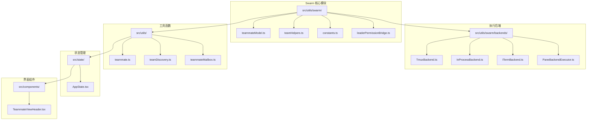

**图表来源**
- [src/utils/swarm/teammateModel.ts](file://src/utils/swarm/teammateModel.ts)
- [src/utils/swarm/backends/TmuxBackend.ts](file://src/utils/swarm/backends/TmuxBackend.ts)
- [src/utils/teammate.ts](file://src/utils/teammate.ts)
- [src/state/AppState.tsx](file://src/state/AppState.tsx)

**章节来源**
- [src/utils/swarm/teammateModel.ts](file://src/utils/swarm/teammateModel.ts)
- [src/utils/swarm/teamHelpers.ts](file://src/utils/swarm/teamHelpers.ts)
- [src/utils/swarm/constants.ts](file://src/utils/swarm/constants.ts)

## 核心组件

### 团队成员模型

团队成员模型是 Swarm 架构的基础数据结构，定义了团队中每个成员的状态、属性和行为。

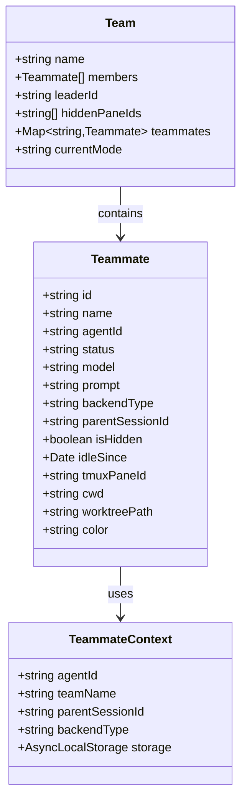

**图表来源**
- [src/utils/swarm/teammateModel.ts](file://src/utils/swarm/teammateModel.ts)
- [src/utils/teammate.ts](file://src/utils/teammate.ts)

### 执行后端系统

Swarm 支持多种执行后端，每种后端都有其特定的优势和适用场景：

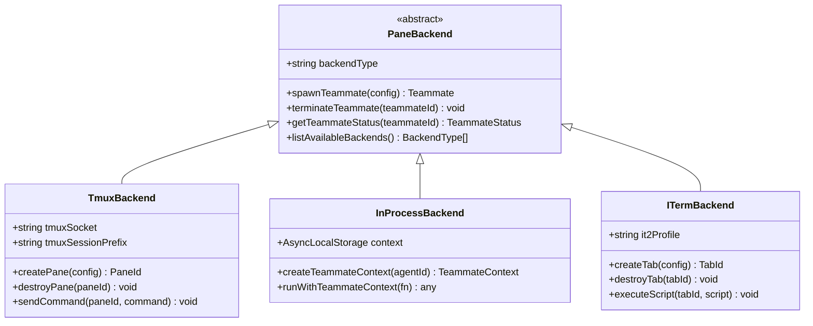

**图表来源**
- [src/utils/swarm/backends/TmuxBackend.ts](file://src/utils/swarm/backends/TmuxBackend.ts)
- [src/utils/swarm/backends/InProcessBackend.ts](file://src/utils/swarm/backends/InProcessBackend.ts)
- [src/utils/swarm/backends/ITermBackend.ts](file://src/utils/swarm/backends/ITermBackend.ts)

### 权限管理系统

权限管理系统是 Swarm 的核心安全机制，确保团队成员只能访问授权的资源和工具。

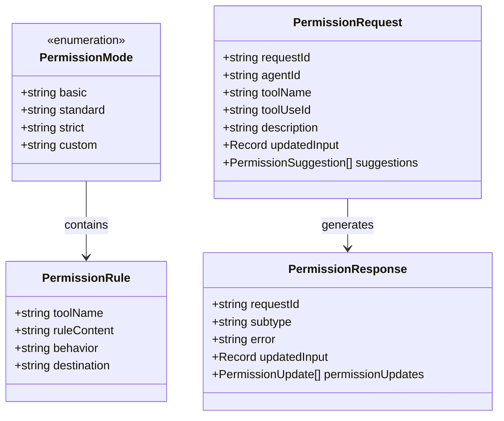

**图表来源**
- [src/utils/swarm/leaderPermissionBridge.ts](file://src/utils/swarm/leaderPermissionBridge.ts)
- [src/utils/teammateMailbox.ts](file://src/utils/teammateMailbox.ts)

**章节来源**
- [src/utils/swarm/teammateModel.ts](file://src/utils/swarm/teammateModel.ts)
- [src/utils/swarm/backends/types.ts](file://src/utils/swarm/backends/types.ts)
- [src/utils/swarm/leaderPermissionBridge.ts](file://src/utils/swarm/leaderPermissionBridge.ts)

## 架构概览

Swarm 架构采用分层设计，从底层的执行后端到上层的应用逻辑，形成了一个完整的协作生态系统。

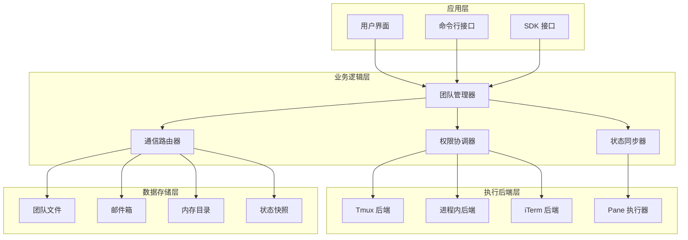

**图表来源**
- [src/main.tsx](file://src/main.tsx)
- [src/utils/swarm/teamHelpers.ts](file://src/utils/swarm/teamHelpers.ts)
- [src/utils/teammateMailbox.ts](file://src/utils/teammateMailbox.ts)

### 数据流图

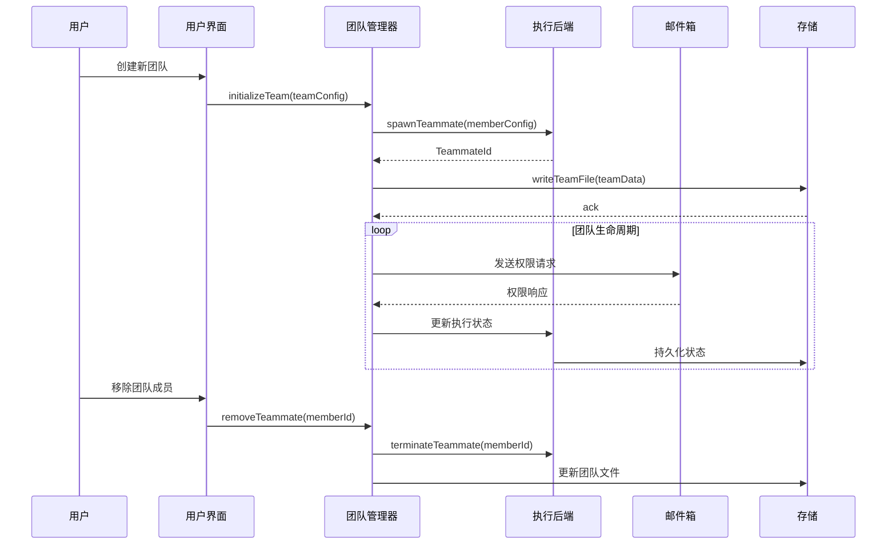

**图表来源**
- [src/utils/swarm/teamHelpers.ts](file://src/utils/swarm/teamHelpers.ts)
- [src/utils/teammateMailbox.ts](file://src/utils/teammateMailbox.ts)
- [src/utils/swarm/backends/PaneBackendExecutor.ts](file://src/utils/swarm/backends/PaneBackendExecutor.ts)

## 详细组件分析

### 团队状态管理

团队状态管理是 Swarm 架构的核心功能之一，负责维护团队的完整生命周期状态。

#### 状态转换流程

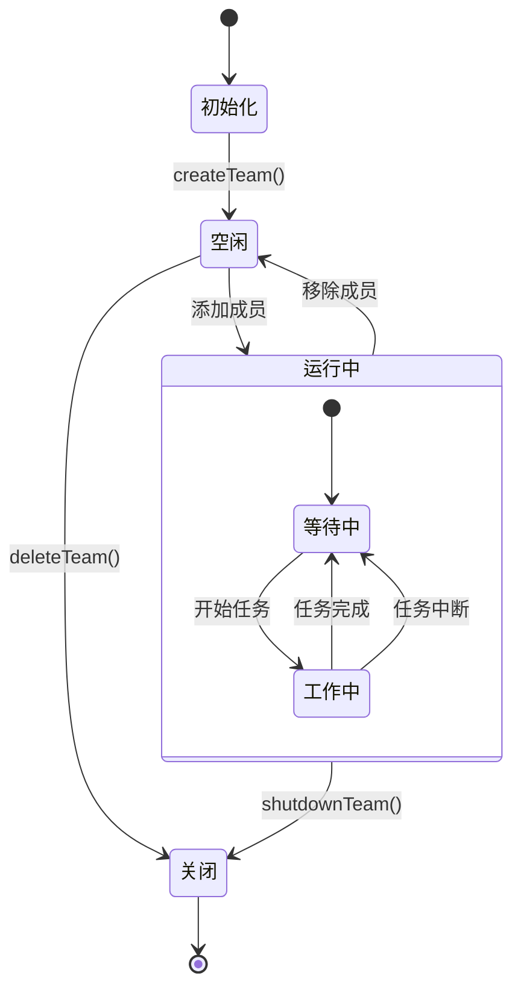

**图表来源**
- [src/utils/swarm/teammateModel.ts](file://src/utils/swarm/teammateModel.ts)
- [src/utils/teammate.ts](file://src/utils/teammate.ts)

#### 生命周期管理

团队生命周期管理涵盖了从创建到销毁的完整过程：

1. **初始化阶段**
   - 解析团队配置
   - 设置默认权限模式
   - 初始化存储结构

2. **运行阶段**
   - 监控成员状态
   - 协调任务分配
   - 处理权限请求

3. **关闭阶段**
   - 终止所有成员
   - 清理资源
   - 持久化最终状态

**章节来源**
- [src/utils/swarm/teamHelpers.ts](file://src/utils/swarm/teamHelpers.ts)
- [src/utils/swarm/teammateModel.ts](file://src/utils/swarm/teammateModel.ts)

### 成员角色分工

Swarm 架构定义了明确的成员角色和职责分工：

#### 角色层次结构

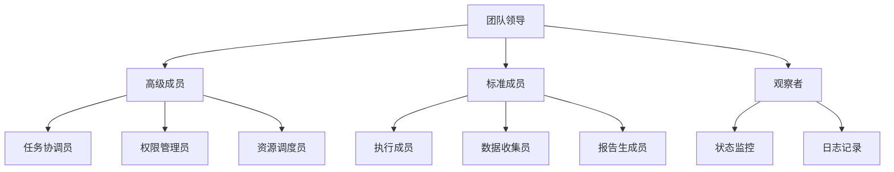

#### 权限模型

权限模型基于最小权限原则设计，确保每个成员只能访问必要的资源：

| 角色 | 基本权限 | 标准权限 | 严格权限 | 自定义权限 |
|------|----------|----------|----------|------------|
| 团队领导 | 全部权限 | 全部权限 | 全部权限 | 可配置 |
| 高级成员 | 读取权限 | 读取权限 | 读取权限 | 可配置 |
| 标准成员 | 读取权限 | 读取权限 | 仅限工具 | 受限制 |
| 观察者 | 读取权限 | 仅限公共 | 仅限公共 | 仅限公共 |

**章节来源**
- [src/utils/swarm/leaderPermissionBridge.ts](file://src/utils/swarm/leaderPermissionBridge.ts)
- [src/utils/teammateMailbox.ts](file://src/utils/teammateMailbox.ts)

### 通信协议

Swarm 使用标准化的消息传递协议来实现团队成员间的通信。

#### 消息类型定义

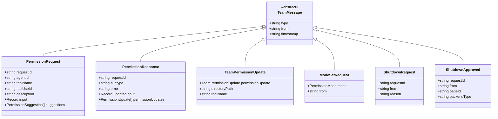

**图表来源**
- [src/utils/teammateMailbox.ts](file://src/utils/teammateMailbox.ts)

#### 通信流程

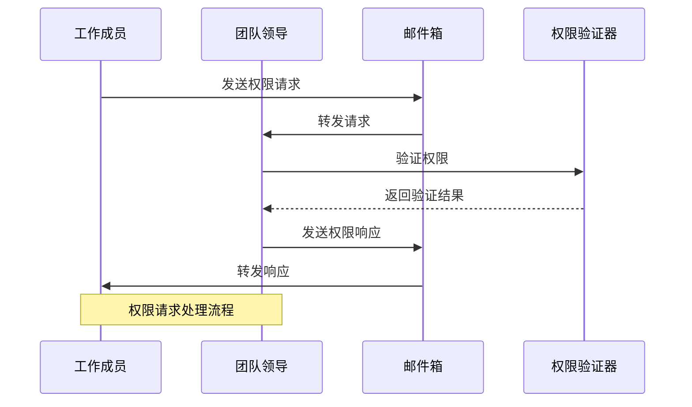

**图表来源**
- [src/utils/teammateMailbox.ts](file://src/utils/teammateMailbox.ts)
- [src/utils/swarm/leaderPermissionBridge.ts](file://src/utils/swarm/leaderPermissionBridge.ts)

**章节来源**
- [src/utils/teammateMailbox.ts](file://src/utils/teammateMailbox.ts)
- [src/utils/swarm/leaderPermissionBridge.ts](file://src/utils/swarm/leaderPermissionBridge.ts)

### 团队初始化实现

团队初始化是 Swarm 架构中最复杂的过程之一，涉及多个组件的协调工作。

#### 初始化流程

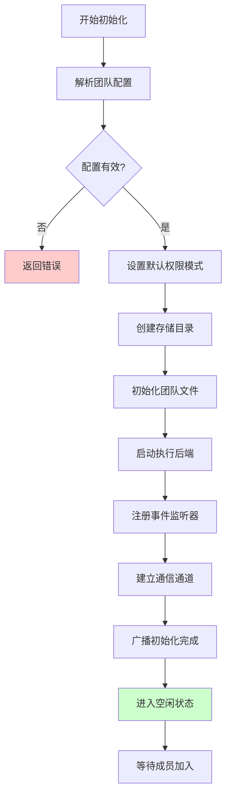

**图表来源**
- [src/utils/swarm/teamHelpers.ts](file://src/utils/swarm/teamHelpers.ts)
- [src/utils/swarm/teammateModel.ts](file://src/utils/swarm/teammateModel.ts)

#### 成员添加流程

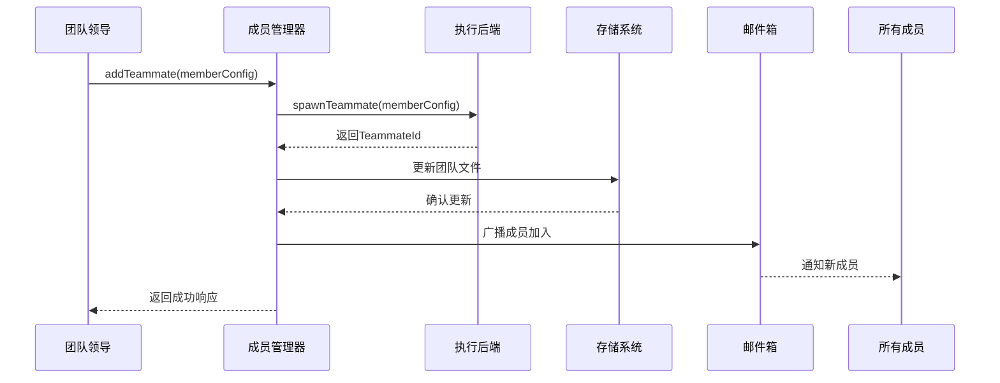

**图表来源**
- [src/utils/swarm/teamHelpers.ts](file://src/utils/swarm/teamHelpers.ts)
- [src/utils/swarm/backends/PaneBackendExecutor.ts](file://src/utils/swarm/backends/PaneBackendExecutor.ts)

#### 成员移除流程

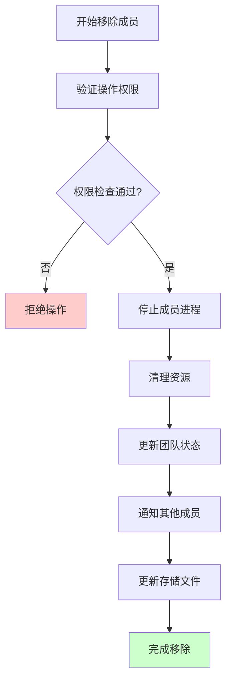

**图表来源**
- [src/utils/teammate.ts](file://src/utils/teammate.ts)
- [src/utils/swarm/teamHelpers.ts](file://src/utils/swarm/teamHelpers.ts)

**章节来源**
- [src/utils/swarm/teamHelpers.ts](file://src/utils/swarm/teamHelpers.ts)
- [src/utils/swarm/teammateModel.ts](file://src/utils/swarm/teammateModel.ts)
- [src/utils/teammate.ts](file://src/utils/teammate.ts)

### 配置参数和约束条件

#### 核心配置参数

| 参数名称 | 类型 | 默认值 | 描述 | 约束条件 |
|----------|------|--------|------|----------|
| teamName | string | 必填 | 团队名称 | 1-50字符，唯一性 |
| maxMembers | number | 8 | 最大成员数 | 1-20 |
| defaultMode | PermissionMode | standard | 默认权限模式 | basic/standard/strict/custom |
| timeoutMs | number | 300000 | 超时时间(ms) | 60000-3600000 |
| enableLogging | boolean | true | 是否启用日志 | 布尔值 |
| persistentStorage | boolean | true | 是否持久化存储 | 布尔值 |

#### 约束条件

1. **资源约束**
   - CPU 使用率不超过 80%
   - 内存使用量不超过系统可用内存的 70%
   - 磁盘空间至少保留 1GB

2. **网络约束**
   - 最小带宽要求 1Mbps
   - 最大并发连接数 50
   - 超时时间必须大于 60 秒

3. **安全约束**
   - 所有通信必须加密
   - 权限检查必须通过
   - 日志记录必须匿名化

**章节来源**
- [src/utils/swarm/constants.ts](file://src/utils/swarm/constants.ts)
- [src/utils/swarm/teamHelpers.ts](file://src/utils/swarm/teamHelpers.ts)

### 最佳实践

#### 性能优化建议

1. **资源管理**
   - 合理设置超时时间，避免长时间占用资源
   - 监控内存使用情况，及时清理临时文件
   - 使用连接池管理网络连接

2. **并发控制**
   - 限制同时运行的任务数量
   - 实现任务优先级队列
   - 使用异步处理避免阻塞

3. **错误处理**
   - 实现重试机制和退避策略
   - 记录详细的错误日志
   - 提供优雅降级方案

#### 安全最佳实践

1. **权限管理**
   - 实施最小权限原则
   - 定期审查权限配置
   - 使用角色基础访问控制

2. **数据保护**
   - 加密敏感数据传输
   - 定期备份重要数据
   - 实施数据生命周期管理

3. **监控审计**
   - 实时监控系统状态
   - 记录所有关键操作
   - 设置异常告警机制

## 依赖关系分析

Swarm 架构中的组件依赖关系体现了清晰的分层设计和解耦原则。

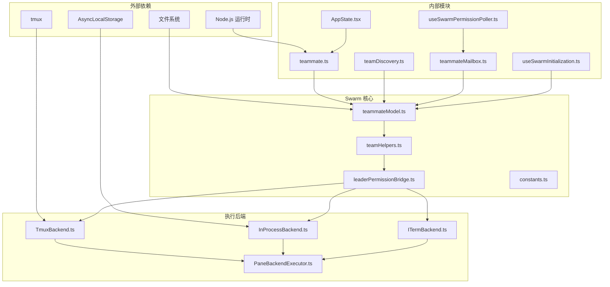

**图表来源**
- [src/utils/teammate.ts](file://src/utils/teammate.ts)
- [src/utils/teamDiscovery.ts](file://src/utils/teamDiscovery.ts)
- [src/utils/teammateMailbox.ts](file://src/utils/teammateMailbox.ts)
- [src/state/AppState.tsx](file://src/state/AppState.tsx)
- [src/hooks/useSwarmInitialization.ts](file://src/hooks/useSwarmInitialization.ts)
- [src/hooks/useSwarmPermissionPoller.ts](file://src/hooks/useSwarmPermissionPoller.ts)

### 循环依赖检测

Swarm 架构通过以下机制避免循环依赖：

1. **延迟加载**
   - 使用动态导入避免编译时依赖
   - 条件加载减少不必要的依赖

2. **接口隔离**
   - 定义清晰的接口契约
   - 使用抽象基类分离实现细节

3. **模块边界**
   - 明确的模块职责划分
   - 严格的导入路径控制

**章节来源**
- [src/main.tsx](file://src/main.tsx)
- [src/utils/teammate.ts](file://src/utils/teammate.ts)

## 性能考虑

### 内存管理

Swarm 架构采用了多层内存管理策略来确保系统的稳定性和性能：

1. **对象池模式**
   - 复用频繁创建的对象
   - 减少垃圾回收压力
   - 控制内存峰值

2. **懒加载机制**
   - 延迟初始化大型组件
   - 按需加载模块
   - 优化启动时间

3. **缓存策略**
   - 实现多级缓存
   - 设置合理的过期时间
   - 监控缓存命中率

### 并发处理

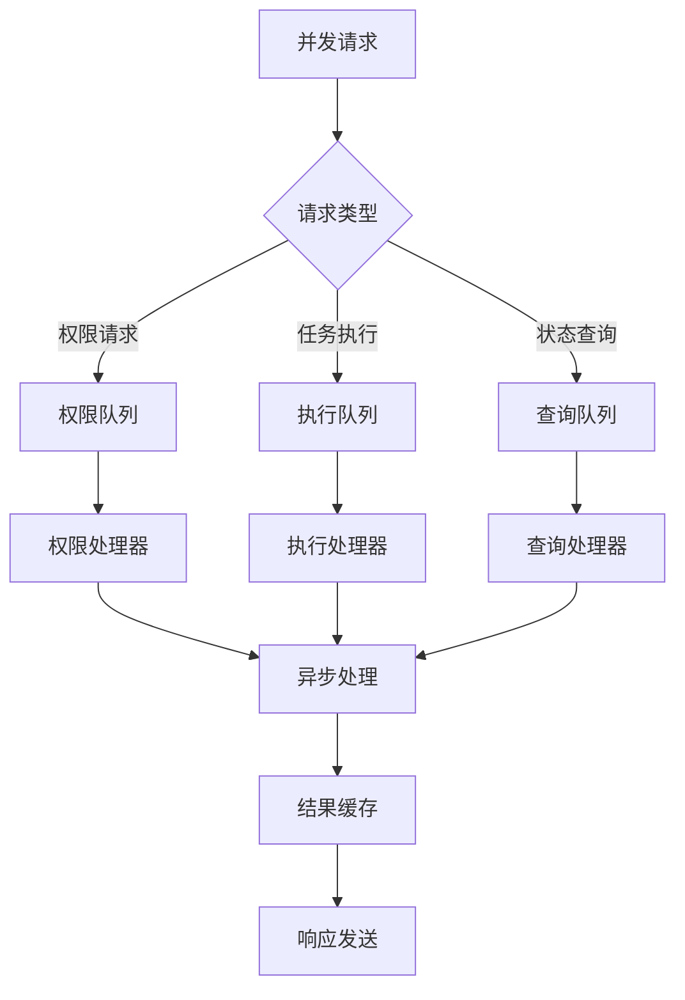

**图表来源**
- [src/utils/swarm/leaderPermissionBridge.ts](file://src/utils/swarm/leaderPermissionBridge.ts)
- [src/utils/teammateMailbox.ts](file://src/utils/teammateMailbox.ts)

### 网络优化

1. **连接复用**
   - 复用数据库连接
   - 复用网络套接字
   - 复用文件句柄

2. **批量处理**
   - 批量写入存储
   - 批量发送消息
   - 批量更新状态

3. **压缩传输**
   - 压缩消息内容
   - 压缩文件传输
   - 压缩日志输出

## 故障排除指南

### 常见问题诊断

#### 团队初始化失败

**症状**: 团队创建后无法正常启动

**可能原因**:
1. 配置文件格式错误
2. 权限不足
3. 资源限制
4. 网络连接问题

**解决步骤**:
1. 检查配置文件语法
2. 验证权限设置
3. 监控系统资源
4. 测试网络连通性

#### 成员通信异常

**症状**: 成员间无法正常通信

**可能原因**:
1. 邮件箱服务故障
2. 网络分区
3. 权限被拒绝
4. 缓存不一致

**解决步骤**:
1. 重启邮件箱服务
2. 检查网络拓扑
3. 验证权限规则
4. 清理缓存数据

#### 性能问题

**症状**: 系统响应缓慢或内存泄漏

**可能原因**:
1. 对象未正确释放
2. 死锁或活锁
3. 资源竞争
4. 缓存污染

**解决步骤**:
1. 分析内存使用模式
2. 检查并发控制
3. 优化资源分配
4. 实施监控告警

### 调试工具和方法

#### 日志分析

Swarm 提供了多层次的日志记录机制：

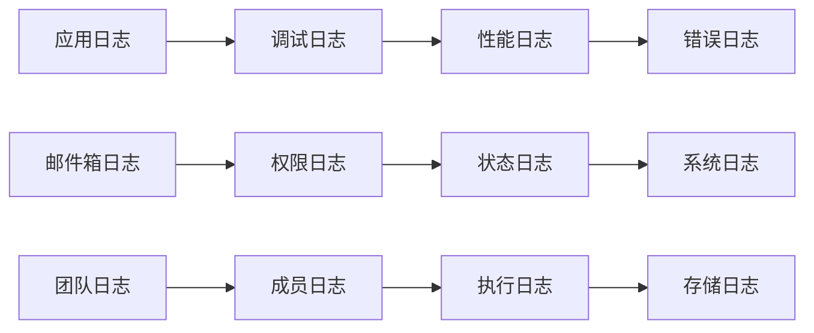

**图表来源**
- [src/utils/teammateMailbox.ts](file://src/utils/teammateMailbox.ts)
- [src/utils/swarm/teamHelpers.ts](file://src/utils/swarm/teamHelpers.ts)

#### 监控指标

关键性能指标包括：
- 团队成员在线率
- 消息传递延迟
- 权限请求成功率
- 资源使用率
- 错误率统计

**章节来源**
- [src/utils/teammateMailbox.ts](file://src/utils/teammateMailbox.ts)
- [src/utils/swarm/teamHelpers.ts](file://src/utils/swarm/teamHelpers.ts)

## 结论

Swarm 架构设计通过模块化、分层和解耦的设计原则，成功构建了一个功能强大且易于扩展的团队协作系统。该架构的主要优势包括：

1. **高度模块化**: 清晰的组件边界和职责分离
2. **灵活的执行后端**: 支持多种运行环境和部署方式
3. **完善的权限管理**: 基于角色的安全控制机制
4. **强大的通信能力**: 标准化的消息传递协议
5. **优秀的性能表现**: 多层次的优化策略和监控机制

与单人模式相比，Swarm 模式提供了以下显著优势：

- **协作效率**: 多个代理可以并行处理不同类型的任务
- **资源优化**: 共享资源和状态，避免重复开销
- **容错能力**: 多个成员提供冗余和故障转移
- **扩展性**: 可以根据需要动态调整团队规模
- **专业化**: 不同成员可以专注于特定领域的任务

未来的发展方向包括进一步优化性能、增强安全性、扩展更多执行后端支持，以及提供更丰富的监控和管理工具。通过持续改进和演进，Swarm 架构将继续为用户提供强大而可靠的团队协作能力。