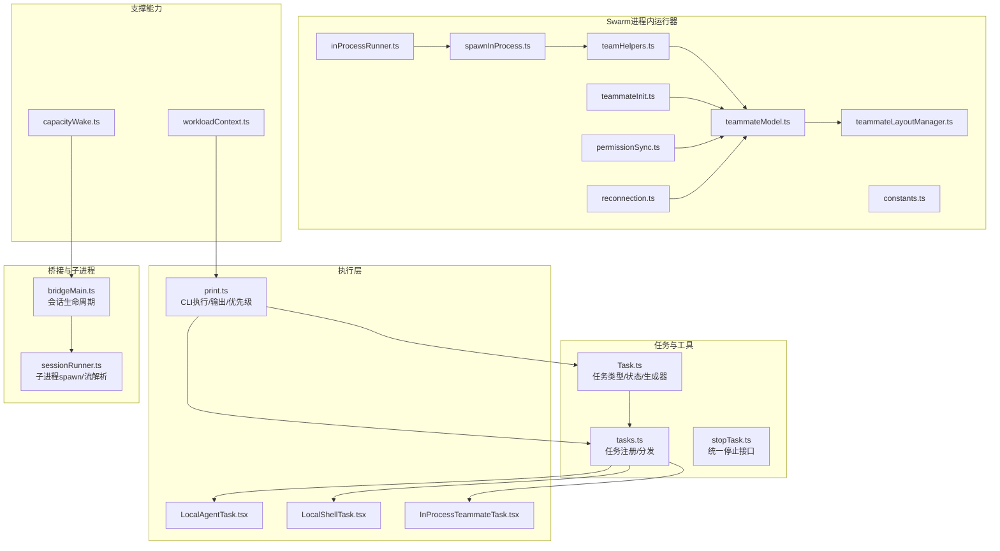
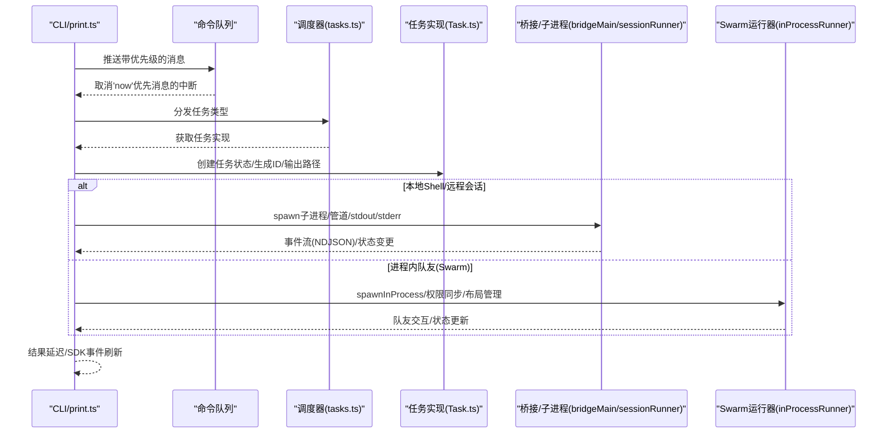
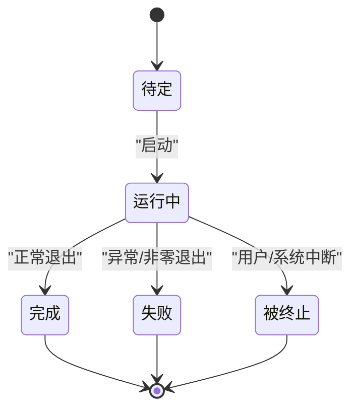
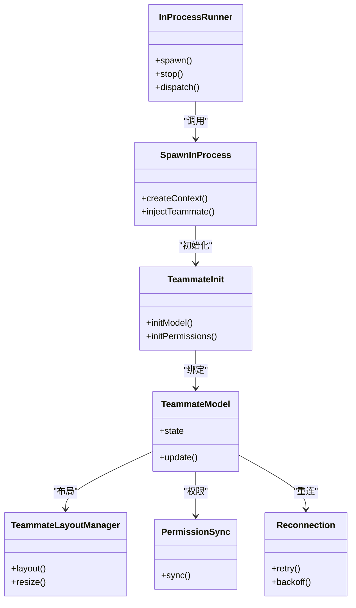
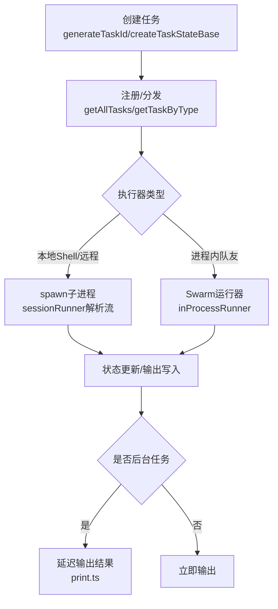
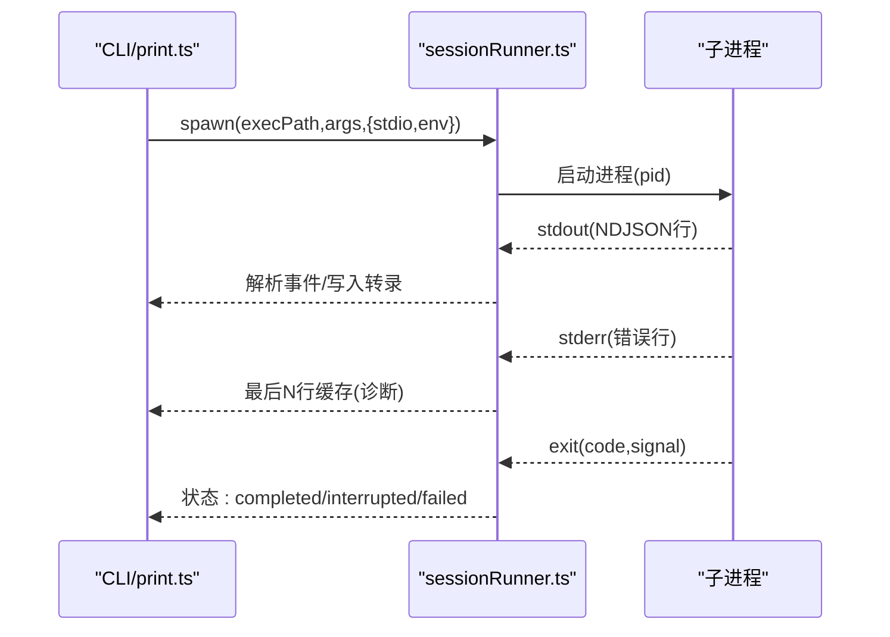
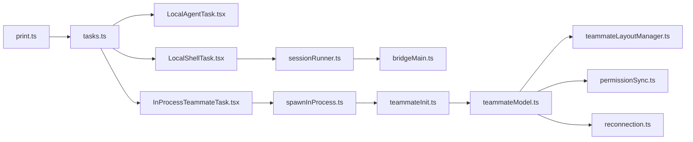

# 任务执行与调度

<cite>
**本文引用的文件**
- [Task.ts](file://src/Task.ts)
- [tasks.ts](file://src/tasks.ts)
- [LocalAgentTask.tsx](file://src/tasks/LocalAgentTask/LocalAgentTask.tsx)
- [LocalShellTask.tsx](file://src/tasks/LocalShellTask/LocalShellTask.tsx)
- [InProcessTeammateTask.tsx](file://src/tasks/InProcessTeammateTask/InProcessTeammateTask.tsx)
- [print.ts](file://src/cli/print.ts)
- [bridgeMain.ts](file://src/bridge/bridgeMain.ts)
- [sessionRunner.ts](file://src/bridge/sessionRunner.ts)
- [stopTask.ts](file://src/tasks/stopTask.ts)
- [killShellTasks.ts](file://src/tasks/LocalShellTask/killShellTasks.ts)
- [swarm/inProcessRunner.ts](file://src/utils/swarm/inProcessRunner.ts)
- [swarm/spawnInProcess.ts](file://src/utils/swarm/spawnInProcess.ts)
- [swarm/teamHelpers.ts](file://src/utils/swarm/teamHelpers.ts)
- [swarm/teammateModel.ts](file://src/utils/swarm/teammateModel.ts)
- [swarm/teammateLayoutManager.ts](file://src/utils/swarm/teammateLayoutManager.ts)
- [swarm/teammateInit.ts](file://src/utils/swarm/teammateInit.ts)
- [swarm/permissionSync.ts](file://src/utils/swarm/permissionSync.ts)
- [swarm/reconnection.ts](file://src/utils/swarm/reconnection.ts)
- [swarm/constants.ts](file://src/utils/swarm/constants.ts)
- [workloadContext.ts](file://src/utils/workloadContext.ts)
- [capacityWake.ts](file://src/bridge/capacityWake.ts)
</cite>

## 目录
1. [引言](#引言)
2. [项目结构](#项目结构)
3. [核心组件](#核心组件)
4. [架构总览](#架构总览)
5. [详细组件分析](#详细组件分析)
6. [依赖关系分析](#依赖关系分析)
7. [性能考量](#性能考量)
8. [故障排查指南](#故障排查指南)
9. [结论](#结论)
10. [附录](#附录)

## 引言
本文件系统性阐述该代码库中的“任务执行与调度”体系，重点覆盖以下方面：
- 任务模型：任务类型、状态机、生命周期与输出管理
- 调度与执行：本地进程内运行器、子进程桥接会话、任务队列与并发控制
- 进程内运行器（Swarm）：spawn 机制、资源分配与隔离、权限与重连策略
- 生命周期管理：创建、启动、监控、停止、清理与结果收集
- 优先级与并发：命令队列优先级、后台任务挂起与恢复、容量唤醒机制
- 失败处理与降级：错误诊断、中断与终止、优雅关闭与回退策略
- 性能监控与优化：日志与转录、NDJSON 流解析、输出缓冲与延迟注入

## 项目结构
围绕任务执行与调度的关键目录与文件如下：
- 任务定义与工具：src/Task.ts、src/tasks.ts、src/tasks/stopTask.ts
- 任务实现：src/tasks/LocalAgentTask、src/tasks/LocalShellTask、src/tasks/InProcessTeammateTask
- CLI 执行与输出：src/cli/print.ts
- 桥接与子进程：src/bridge/bridgeMain.ts、src/bridge/sessionRunner.ts
- Swarm 进程内运行器：src/utils/swarm/*
- 工作负载上下文与容量：src/utils/workloadContext.ts、src/bridge/capacityWake.ts

**图表来源**
- [Task.ts:1-125](file://src/Task.ts#L1-L125)
- [tasks.ts:1-39](file://src/tasks.ts#L1-L39)
- [print.ts:1010-2510](file://src/cli/print.ts#L1010-L2510)
- [bridgeMain.ts:553-585](file://src/bridge/bridgeMain.ts#L553-L585)
- [sessionRunner.ts:333-480](file://src/bridge/sessionRunner.ts#L333-L480)
- [inProcessRunner.ts](file://src/utils/swarm/inProcessRunner.ts)
- [spawnInProcess.ts](file://src/utils/swarm/spawnInProcess.ts)
- [teamHelpers.ts](file://src/utils/swarm/teamHelpers.ts)
- [teammateModel.ts](file://src/utils/swarm/teammateModel.ts)
- [teammateLayoutManager.ts](file://src/utils/swarm/teammateLayoutManager.ts)
- [teammateInit.ts](file://src/utils/swarm/teammateInit.ts)
- [permissionSync.ts](file://src/utils/swarm/permissionSync.ts)
- [reconnection.ts](file://src/utils/swarm/reconnection.ts)
- [constants.ts](file://src/utils/swarm/constants.ts)
- [workloadContext.ts:32-57](file://src/utils/workloadContext.ts#L32-L57)
- [capacityWake.ts:31-56](file://src/bridge/capacityWake.ts#L31-L56)

**章节来源**
- [Task.ts:1-125](file://src/Task.ts#L1-L125)
- [tasks.ts:1-39](file://src/tasks.ts#L1-L39)
- [print.ts:1010-2510](file://src/cli/print.ts#L1010-L2510)
- [bridgeMain.ts:553-585](file://src/bridge/bridgeMain.ts#L553-L585)
- [sessionRunner.ts:333-480](file://src/bridge/sessionRunner.ts#L333-L480)
- [workloadContext.ts:32-57](file://src/utils/workloadContext.ts#L32-L57)
- [capacityWake.ts:31-56](file://src/bridge/capacityWake.ts#L31-L56)

## 核心组件
- 任务类型与状态
  - 类型涵盖本地 Bash、本地/远程代理、进程内队友、工作流、MCP 监控、梦境等
  - 状态包括待定、运行中、完成、失败、被终止；终端态不可再迁移
  - 统一的 TaskHandle 与清理钩子用于资源回收
- 任务标识与输出
  - 任务 ID 前缀区分类型，随机 ID 防碰撞
  - 输出文件路径与偏移量支持增量写入与结果收集
- 任务注册与分发
  - getAllTasks 返回可用任务集合，getTaskByType 按类型获取具体实现
- CLI 执行与优先级
  - 命令队列按优先级调度，'now' 优先消息可中断当前操作
  - 后台任务运行期间延迟输出结果，确保进度事件先于最终结果到达

**章节来源**
- [Task.ts:1-125](file://src/Task.ts#L1-L125)
- [tasks.ts:17-39](file://src/tasks.ts#L17-L39)
- [print.ts:1858-1863](file://src/cli/print.ts#L1858-L1863)
- [print.ts:2216-2254](file://src/cli/print.ts#L2216-L2254)

## 架构总览
整体执行链路由“命令队列 -> 任务分发 -> 执行器 -> 输出/转录/监控”构成。Swarm 的进程内运行器通过 in-process runner 管理多队友协作，结合权限同步与重连策略保证稳定性。

**图表来源**
- [print.ts:1010-2510](file://src/cli/print.ts#L1010-L2510)
- [tasks.ts:17-39](file://src/tasks.ts#L17-L39)
- [Task.ts:108-125](file://src/Task.ts#L108-L125)
- [bridgeMain.ts:553-585](file://src/bridge/bridgeMain.ts#L553-L585)
- [sessionRunner.ts:333-480](file://src/bridge/sessionRunner.ts#L333-L480)
- [inProcessRunner.ts](file://src/utils/swarm/inProcessRunner.ts)

## 详细组件分析

### 任务生命周期与状态机
- 生命周期阶段
  - 创建：生成任务ID、记录描述、设置开始时间、初始化输出文件
  - 启动：进入“运行中”，记录暂停累计时长、输出偏移
  - 监控：持续追踪状态变化，必要时注入进度事件
  - 结束：根据退出码或信号进入完成/失败/被终止，并记录结束时间
- 终止与清理
  - stopTask 提供统一停止入口，配合任务实现的 kill 逻辑
  - Shell 任务提供独立的 killShellTasks，确保子进程树清理

**图表来源**
- [Task.ts:15-29](file://src/Task.ts#L15-L29)
- [Task.ts:108-125](file://src/Task.ts#L108-L125)
- [stopTask.ts](file://src/tasks/stopTask.ts)
- [killShellTasks.ts](file://src/tasks/LocalShellTask/killShellTasks.ts)

**章节来源**
- [Task.ts:15-29](file://src/Task.ts#L15-L29)
- [Task.ts:108-125](file://src/Task.ts#L108-L125)
- [stopTask.ts](file://src/tasks/stopTask.ts)
- [killShellTasks.ts](file://src/tasks/LocalShellTask/killShellTasks.ts)

### 进程内运行器（Swarm）工作原理
- spawn 机制
  - spawnInProcess 负责在当前进程中创建/注入队友上下文，结合 teammateInit 初始化模型与布局
- 资源分配与隔离
  - teammateLayoutManager 管理界面/布局相关资源；teammateModel 描述队友状态与行为
  - 权限同步 permissionSync 确保跨模块权限一致，避免越权访问
- 队友协作与重连
  - teamHelpers 提供通用协作辅助；reconnection 在网络/连接波动时维持稳定
- 常量与配置
  - constants.ts 提供运行器参数与阈值，影响调度与资源上限

**图表来源**
- [inProcessRunner.ts](file://src/utils/swarm/inProcessRunner.ts)
- [spawnInProcess.ts](file://src/utils/swarm/spawnInProcess.ts)
- [teammateInit.ts](file://src/utils/swarm/teammateInit.ts)
- [teammateModel.ts](file://src/utils/swarm/teammateModel.ts)
- [teammateLayoutManager.ts](file://src/utils/swarm/teammateLayoutManager.ts)
- [permissionSync.ts](file://src/utils/swarm/permissionSync.ts)
- [reconnection.ts](file://src/utils/swarm/reconnection.ts)
- [constants.ts](file://src/utils/swarm/constants.ts)

**章节来源**
- [spawnInProcess.ts](file://src/utils/swarm/spawnInProcess.ts)
- [teammateInit.ts](file://src/utils/swarm/teammateInit.ts)
- [teammateModel.ts](file://src/utils/swarm/teammateModel.ts)
- [teammateLayoutManager.ts](file://src/utils/swarm/teammateLayoutManager.ts)
- [permissionSync.ts](file://src/utils/swarm/permissionSync.ts)
- [reconnection.ts](file://src/utils/swarm/reconnection.ts)
- [constants.ts](file://src/utils/swarm/constants.ts)

### 任务创建、调度与执行监控
- 任务创建
  - generateTaskId 为不同任务类型生成唯一 ID；createTaskStateBase 初始化基础状态与输出路径
- 调度算法
  - tasks.ts 提供任务注册与按类型分发；CLI 层 print.ts 依据命令队列优先级驱动执行
- 执行监控
  - 子进程 sessionRunner 解析子进程 stdout 的 NDJSON，同时收集 stderr 作为诊断信息
  - bridgeMain 根据会话状态决定多会话归档或单会话环境销毁

**图表来源**
- [Task.ts:98-125](file://src/Task.ts#L98-L125)
- [tasks.ts:17-39](file://src/tasks.ts#L17-L39)
- [sessionRunner.ts:333-480](file://src/bridge/sessionRunner.ts#L333-L480)
- [bridgeMain.ts:553-585](file://src/bridge/bridgeMain.ts#L553-L585)
- [print.ts:2216-2254](file://src/cli/print.ts#L2216-L2254)

**章节来源**
- [Task.ts:98-125](file://src/Task.ts#L98-L125)
- [tasks.ts:17-39](file://src/tasks.ts#L17-L39)
- [sessionRunner.ts:333-480](file://src/bridge/sessionRunner.ts#L333-L480)
- [bridgeMain.ts:553-585](file://src/bridge/bridgeMain.ts#L553-L585)
- [print.ts:2216-2254](file://src/cli/print.ts#L2216-L2254)

### 本地 Shell 任务与资源隔离
- spawn 与流处理
  - 使用 Node child_process spawn，标准输入/输出/错误分别接入管道
  - stdout 逐行 NDJSON 解析，stderr 缓存最近若干行用于诊断
- 资源隔离
  - 通过独立进程边界实现资源隔离；killShellTasks 支持强制终止与清理
- 会话生命周期
  - bridgeMain 根据 spawnMode 决定多会话归档或单会话退出

**图表来源**
- [sessionRunner.ts:333-480](file://src/bridge/sessionRunner.ts#L333-L480)
- [killShellTasks.ts](file://src/tasks/LocalShellTask/killShellTasks.ts)
- [bridgeMain.ts:553-585](file://src/bridge/bridgeMain.ts#L553-L585)

**章节来源**
- [sessionRunner.ts:333-480](file://src/bridge/sessionRunner.ts#L333-L480)
- [killShellTasks.ts](file://src/tasks/LocalShellTask/killShellTasks.ts)
- [bridgeMain.ts:553-585](file://src/bridge/bridgeMain.ts#L553-L585)

### 任务优先级、并发控制与资源限制
- 优先级
  - 命令队列支持 'now' 优先级，触发中断；其他优先级用于排队与轮询
- 并发控制
  - CLI run 循环中对后台任务进行计数与延迟输出，避免阻塞前台结果
  - capacityWake 提供容量唤醒信号，合并外部/内部中止信号，避免竞态
- 资源限制
  - 通过任务类型与执行器选择实现资源隔离（进程内 vs 子进程）
  - workloadContext.runWithWorkload 为执行建立明确的上下文边界，防止泄漏

**章节来源**
- [print.ts:1858-1863](file://src/cli/print.ts#L1858-L1863)
- [print.ts:2216-2254](file://src/cli/print.ts#L2216-L2254)
- [capacityWake.ts:31-56](file://src/bridge/capacityWake.ts#L31-L56)
- [workloadContext.ts:32-57](file://src/utils/workloadContext.ts#L32-L57)

### 失败处理、重试与降级策略
- 失败处理
  - 子进程非零退出与错误事件均标记为失败；stderr 缓存便于诊断
  - 统一的 stopTask/killShellTasks 清理资源，避免僵尸进程
- 重试与降级
  - reconnection 提供重连与退避策略；permissionSync 保障权限一致性
  - 单会话模式下，bridgeMain 在失败时直接中止轮询以快速回收资源

**章节来源**
- [sessionRunner.ts:456-480](file://src/bridge/sessionRunner.ts#L456-L480)
- [stopTask.ts](file://src/tasks/stopTask.ts)
- [killShellTasks.ts](file://src/tasks/LocalShellTask/killShellTasks.ts)
- [reconnection.ts](file://src/utils/swarm/reconnection.ts)
- [permissionSync.ts](file://src/utils/swarm/permissionSync.ts)
- [bridgeMain.ts:577-585](file://src/bridge/bridgeMain.ts#L577-L585)

### 性能监控与优化建议
- 监控点
  - NDJSON 流解析与转录文件写入，stdout 事件先行，结果延后，减少批处理抖动
  - stderr 最近 N 行缓存，便于快速定位问题
- 优化建议
  - 合理设置后台任务阈值，避免过多并发导致 I/O 抖动
  - 利用 workloadContext 明确边界，减少上下文泄漏引发的性能退化
  - 对频繁重启的子进程场景，启用 reconnection 退避与 bridgeMain 的单会话快速回收

**章节来源**
- [print.ts:2216-2254](file://src/cli/print.ts#L2216-L2254)
- [sessionRunner.ts:352-366](file://src/bridge/sessionRunner.ts#L352-L366)
- [workloadContext.ts:32-57](file://src/utils/workloadContext.ts#L32-L57)
- [reconnection.ts](file://src/utils/swarm/reconnection.ts)

## 依赖关系分析
- 低耦合高内聚
  - 任务类型与实现解耦：通过 tasks.ts 注册与分发，避免上层对具体实现的直接依赖
  - 执行器抽象清晰：Swarm 运行器与子进程执行器通过统一接口对接 CLI
- 关键依赖链
  - CLI -> tasks.ts -> 具体任务实现
  - 子进程路径依赖 sessionRunner -> bridgeMain
  - Swarm 路径依赖 spawnInProcess -> teammateInit -> teammateModel -> layoutManager/permission/reconnection

**图表来源**
- [tasks.ts:17-39](file://src/tasks.ts#L17-L39)
- [sessionRunner.ts:333-480](file://src/bridge/sessionRunner.ts#L333-L480)
- [bridgeMain.ts:553-585](file://src/bridge/bridgeMain.ts#L553-L585)
- [spawnInProcess.ts](file://src/utils/swarm/spawnInProcess.ts)
- [teammateInit.ts](file://src/utils/swarm/teammateInit.ts)
- [teammateModel.ts](file://src/utils/swarm/teammateModel.ts)
- [teammateLayoutManager.ts](file://src/utils/swarm/teammateLayoutManager.ts)
- [permissionSync.ts](file://src/utils/swarm/permissionSync.ts)
- [reconnection.ts](file://src/utils/swarm/reconnection.ts)

**章节来源**
- [tasks.ts:17-39](file://src/tasks.ts#L17-L39)
- [sessionRunner.ts:333-480](file://src/bridge/sessionRunner.ts#L333-L480)
- [bridgeMain.ts:553-585](file://src/bridge/bridgeMain.ts#L553-L585)
- [spawnInProcess.ts](file://src/utils/swarm/spawnInProcess.ts)
- [teammateInit.ts](file://src/utils/swarm/teammateInit.ts)
- [teammateModel.ts](file://src/utils/swarm/teammateModel.ts)
- [teammateLayoutManager.ts](file://src/utils/swarm/teammateLayoutManager.ts)
- [permissionSync.ts](file://src/utils/swarm/permissionSync.ts)
- [reconnection.ts](file://src/utils/swarm/reconnection.ts)

## 性能考量
- I/O 与流解析
  - NDJSON 行式解析降低内存峰值；stderr 缓冲避免丢弃关键诊断信息
- 并发与背压
  - 后台任务延迟输出策略缓解前端渲染压力；容量唤醒信号避免竞态
- 上下文与泄漏防护
  - workloadContext 明确 ALS 边界，防止上下文泄漏导致的性能退化

[本节为通用指导，不直接分析具体文件]

## 故障排查指南
- 子进程失败
  - 检查 stderr 最近 N 行缓存；确认退出码与信号；必要时启用 reconnection 重试
- 中断与终止
  - 'now' 优先消息会触发中断；确保 stopTask/killShellTasks 正常回收
- 会话生命周期
  - 多会话模式下失败会触发归档；单会话模式下直接中止轮询回收资源
- 输出错位
  - 确认 CLI 输出延迟策略已生效；SDK 事件应先于结果输出

**章节来源**
- [sessionRunner.ts:456-480](file://src/bridge/sessionRunner.ts#L456-L480)
- [print.ts:2216-2254](file://src/cli/print.ts#L2216-L2254)
- [stopTask.ts](file://src/tasks/stopTask.ts)
- [killShellTasks.ts](file://src/tasks/LocalShellTask/killShellTasks.ts)
- [bridgeMain.ts:553-585](file://src/bridge/bridgeMain.ts#L553-L585)

## 结论
该任务执行与调度体系通过“任务模型 + 任务注册 + 执行器抽象 + CLI 队列”的分层设计，实现了从本地 Shell 到进程内 Swarm 的多样化执行路径。借助 NDJSON 流解析、stderr 诊断、后台任务延迟输出与容量唤醒机制，系统在复杂场景下仍保持可观的稳定性与可观测性。Swarm 进程内运行器进一步强化了队友协作、权限同步与重连能力，适合需要强隔离与高交互性的任务编排。

[本节为总结性内容，不直接分析具体文件]

## 附录
- 任务类型速览
  - local_bash、local_agent、remote_agent、in_process_teammate、local_workflow、monitor_mcp、dream
- 关键流程参考
  - 任务创建与状态初始化：[Task.ts:98-125](file://src/Task.ts#L98-L125)
  - 任务注册与分发：[tasks.ts:17-39](file://src/tasks.ts#L17-L39)
  - CLI 优先级与输出延迟：[print.ts:1858-1863](file://src/cli/print.ts#L1858-L1863)、[print.ts:2216-2254](file://src/cli/print.ts#L2216-L2254)
  - 子进程 spawn 与流解析：[sessionRunner.ts:333-480](file://src/bridge/sessionRunner.ts#L333-L480)
  - 会话生命周期与归档/销毁：[bridgeMain.ts:553-585](file://src/bridge/bridgeMain.ts#L553-L585)
  - Swarm 运行器与权限同步：[spawnInProcess.ts](file://src/utils/swarm/spawnInProcess.ts)、[permissionSync.ts](file://src/utils/swarm/permissionSync.ts)
  - 容量唤醒与上下文边界：[capacityWake.ts:31-56](file://src/bridge/capacityWake.ts#L31-L56)、[workloadContext.ts:32-57](file://src/utils/workloadContext.ts#L32-L57)