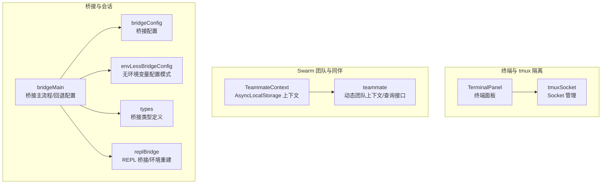
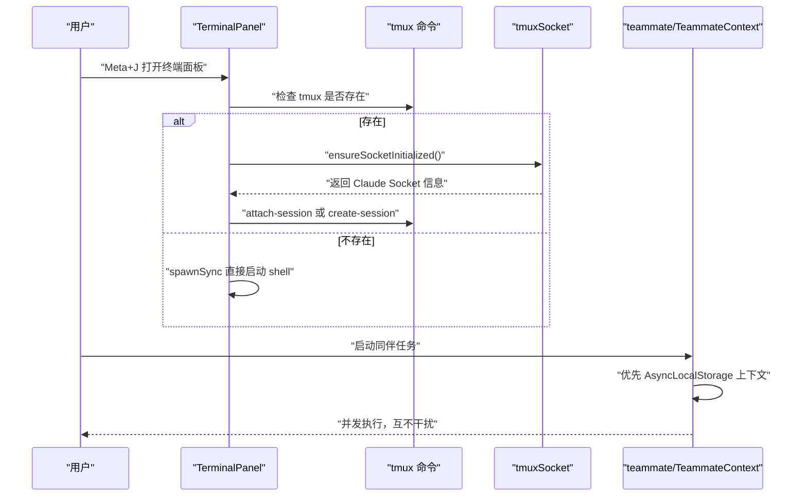
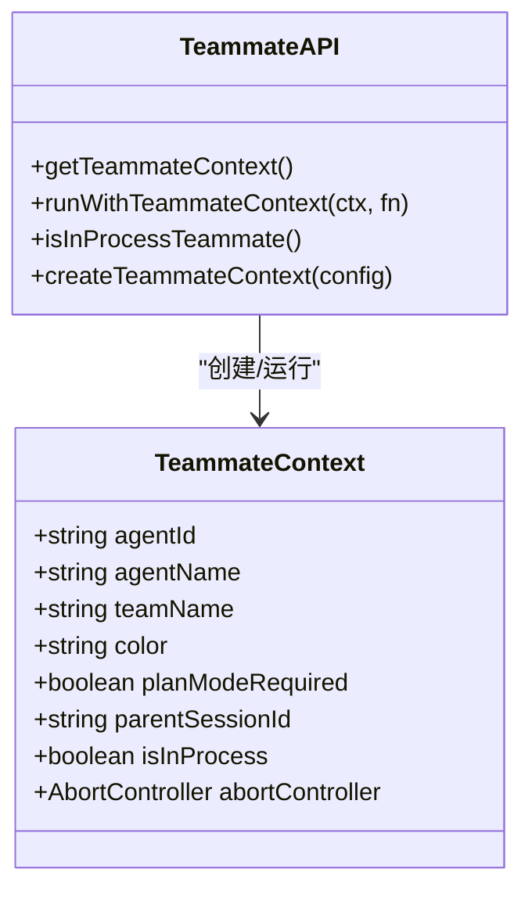
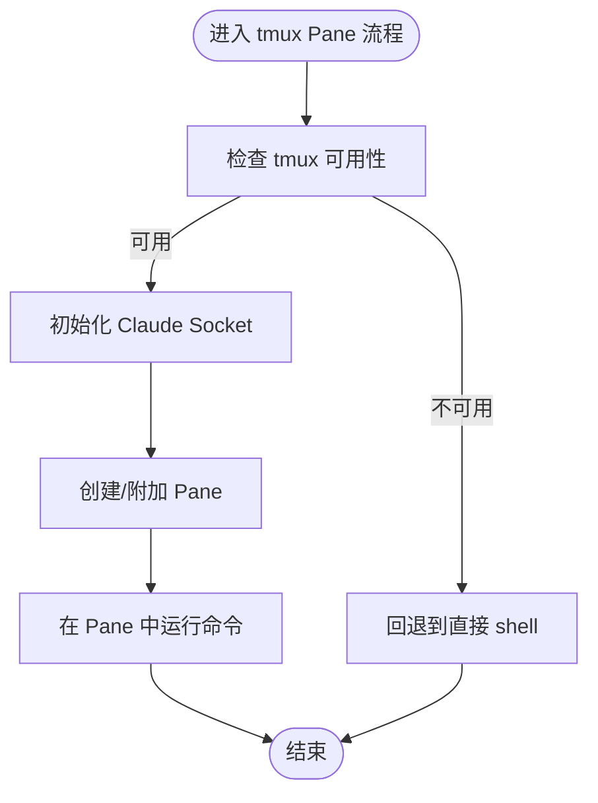
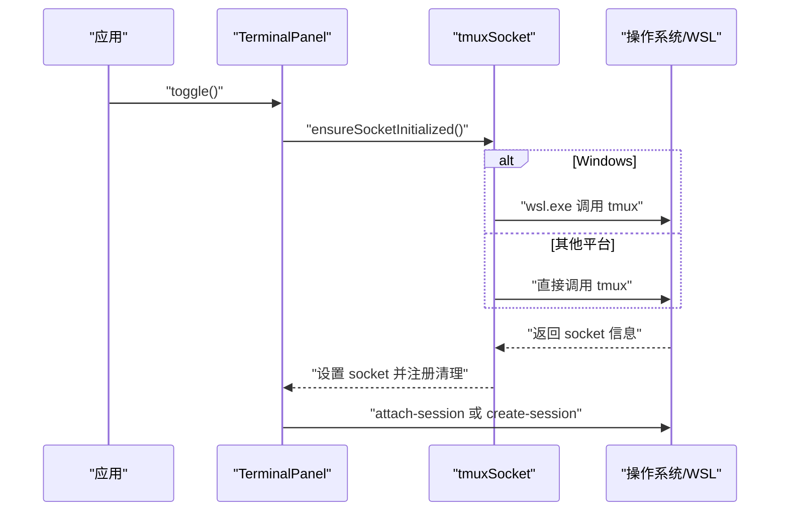
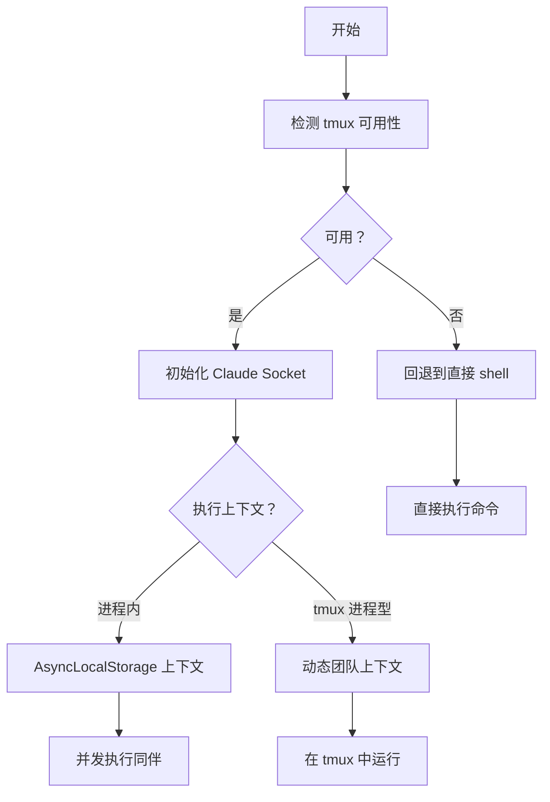
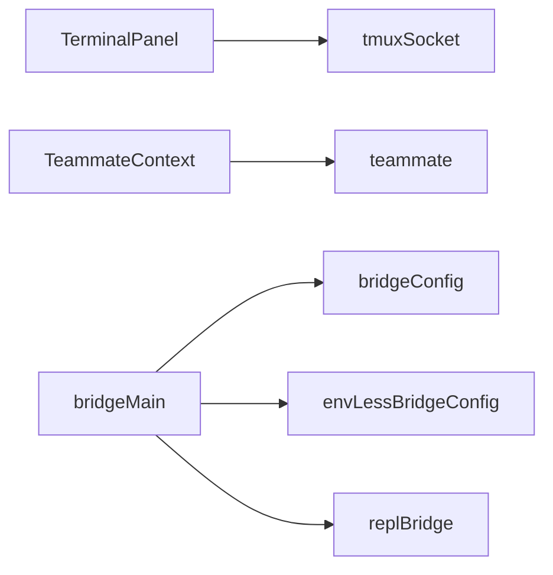

# 后端实现与选择

<cite>
**本文引用的文件**   
- [src/utils/terminalPanel.ts](file://src/utils/terminalPanel.ts)
- [src/utils/tmuxSocket.ts](file://src/utils/tmuxSocket.ts)
- [src/utils/teammateContext.ts](file://src/utils/teammateContext.ts)
- [src/utils/teammate.ts](file://src/utils/teammate.ts)
- [src/bridge/bridgeMain.ts](file://src/bridge/bridgeMain.ts)
- [src/bridge/bridgeConfig.ts](file://src/bridge/bridgeConfig.ts)
- [src/bridge/envLessBridgeConfig.ts](file://src/bridge/envLessBridgeConfig.ts)
- [src/bridge/types.ts](file://src/bridge/types.ts)
- [src/bridge/replBridge.ts](file://src/bridge/replBridge.ts)
</cite>

## 目录
1. [简介](#简介)
2. [项目结构](#项目结构)
3. [核心组件](#核心组件)
4. [架构总览](#架构总览)
5. [详细组件分析](#详细组件分析)
6. [依赖关系分析](#依赖关系分析)
7. [性能考量](#性能考量)
8. [故障排查指南](#故障排查指南)
9. [结论](#结论)
10. [附录](#附录)

## 简介
本文件系统化梳理本仓库中与“后端实现与选择”相关的机制与实现，重点覆盖以下主题：
- Swarm 支持的后端形态：进程内后端（In-Process）、Pane 后端（通过 tmux Pane 隔离）、Tmux 会话后端（通过独立 tmux 服务器隔离）
- 每种后端的实现原理、性能特征与限制条件
- 后端检测机制、自动选择策略与手动配置方法
- 不同后端的优缺点对比与选择建议
- 后端配置参数、环境要求与兼容性说明
- 切换后端的影响与注意事项

## 项目结构
围绕后端实现与选择的关键模块如下：
- 终端面板与 tmux 隔离：终端面板使用 tmux 提供持久化 shell；tmux Socket 管理确保与用户会话隔离
- Swarm 团队与同伴：通过 AsyncLocalStorage 实现进程内同伴上下文；通过动态团队上下文支持 tmux 进程型同伴
- 桥接与会话：桥接主流程、配置与回退策略，以及 REPL 桥接的环境重建逻辑

**图表来源**
- [src/utils/terminalPanel.ts:1-192](file://src/utils/terminalPanel.ts#L1-L192)
- [src/utils/tmuxSocket.ts:1-428](file://src/utils/tmuxSocket.ts#L1-L428)
- [src/utils/teammateContext.ts:1-97](file://src/utils/teammateContext.ts#L1-L97)
- [src/utils/teammate.ts:1-293](file://src/utils/teammate.ts#L1-L293)
- [src/bridge/bridgeMain.ts:59-98](file://src/bridge/bridgeMain.ts#L59-L98)
- [src/bridge/bridgeConfig.ts](file://src/bridge/bridgeConfig.ts)
- [src/bridge/envLessBridgeConfig.ts:60-84](file://src/bridge/envLessBridgeConfig.ts#L60-L84)
- [src/bridge/types.ts:81-117](file://src/bridge/types.ts#L81-L117)
- [src/bridge/replBridge.ts:576-615](file://src/bridge/replBridge.ts#L576-L615)

**章节来源**
- [src/utils/terminalPanel.ts:1-192](file://src/utils/terminalPanel.ts#L1-L192)
- [src/utils/tmuxSocket.ts:1-428](file://src/utils/tmuxSocket.ts#L1-L428)
- [src/utils/teammateContext.ts:1-97](file://src/utils/teammateContext.ts#L1-L97)
- [src/utils/teammate.ts:1-293](file://src/utils/teammate.ts#L1-L293)
- [src/bridge/bridgeMain.ts:59-98](file://src/bridge/bridgeMain.ts#L59-L98)
- [src/bridge/bridgeConfig.ts](file://src/bridge/bridgeConfig.ts)
- [src/bridge/envLessBridgeConfig.ts:60-84](file://src/bridge/envLessBridgeConfig.ts#L60-L84)
- [src/bridge/types.ts:81-117](file://src/bridge/types.ts#L81-L117)
- [src/bridge/replBridge.ts:576-615](file://src/bridge/replBridge.ts#L576-L615)

## 核心组件
- 终端面板与 tmux 隔离
  - 终端面板在首次使用时惰性创建单例实例，内部通过 tmux 提供持久化 shell；若未安装 tmux，则回退到非持久化 shell
  - tmux Socket 管理为 Claude 创建独立的 tmux 服务器与套接字，避免与用户现有 tmux 会话冲突，并在退出时清理
- Swarm 团队与同伴
  - 进程内同伴：通过 AsyncLocalStorage 为每个同伴建立隔离上下文，支持并发执行且不互相污染
  - tmux 进程型同伴：通过动态团队上下文传递同伴身份信息，优先级低于进程内同伴
- 桥接与会话
  - 桥接主流程包含连接与通用回退策略、默认最大并发等配置
  - REPL 桥接具备环境丢失后的重连与会话重建能力

**章节来源**
- [src/utils/terminalPanel.ts:50-192](file://src/utils/terminalPanel.ts#L50-L192)
- [src/utils/tmuxSocket.ts:72-246](file://src/utils/tmuxSocket.ts#L72-L246)
- [src/utils/teammateContext.ts:16-97](file://src/utils/teammateContext.ts#L16-L97)
- [src/utils/teammate.ts:40-131](file://src/utils/teammate.ts#L40-L131)
- [src/bridge/bridgeMain.ts:59-98](file://src/bridge/bridgeMain.ts#L59-L98)
- [src/bridge/replBridge.ts:576-615](file://src/bridge/replBridge.ts#L576-L615)

## 架构总览
Swarm 后端选择与运行由“上下文解析优先级 + tmux 隔离 + 桥接回退策略”共同决定：
- 上下文解析优先级：进程内同伴（AsyncLocalStorage） > 动态团队上下文（tmux 进程型同伴） > 环境变量
- tmux 隔离：终端面板与 tmux Socket 管理确保操作不会影响用户现有 tmux 会话
- 桥接回退：当环境异常或资源不足时，采用指数回退与会话重建策略维持可用性

**图表来源**
- [src/utils/terminalPanel.ts:62-171](file://src/utils/terminalPanel.ts#L62-L171)
- [src/utils/tmuxSocket.ts:208-246](file://src/utils/tmuxSocket.ts#L208-L246)
- [src/utils/teammate.ts:84-131](file://src/utils/teammate.ts#L84-L131)
- [src/utils/teammateContext.ts:47-72](file://src/utils/teammateContext.ts#L47-L72)

## 详细组件分析

### 进程内后端（In-Process）
- 实现原理
  - 使用 AsyncLocalStorage 为每个同伴维护独立上下文，避免全局状态竞争
  - 在同一进程中并发执行多个同伴，无需跨进程通信
- 性能特征
  - 低延迟、高并发：无进程间切换开销
  - 内存占用与进程内任务数量相关
- 限制条件
  - 仅限于同一进程内的并发执行
  - 需要任务生命周期管理（如中断控制器）以避免相互影响
- 适用场景
  - 需要快速并发执行、对延迟敏感的任务
  - 与主流程紧密耦合、需要共享内存状态的场景

**图表来源**
- [src/utils/teammateContext.ts:22-96](file://src/utils/teammateContext.ts#L22-L96)

**章节来源**
- [src/utils/teammateContext.ts:1-97](file://src/utils/teammateContext.ts#L1-L97)
- [src/utils/teammate.ts:84-131](file://src/utils/teammate.ts#L84-L131)

### Pane 后端（tmux Pane 隔离）
- 实现原理
  - 通过 tmux 为每个任务创建独立 Pane，实现命令与历史隔离
  - tmux Socket 管理确保 Claude 的 tmux 服务器与用户会话完全隔离
- 性能特征
  - 轻量级隔离：Pane 级别隔离，资源占用小于完整会话
  - 受 tmux 服务器性能与系统资源限制
- 限制条件
  - 需要系统安装 tmux；Windows 场景需通过 WSL
  - Pane 数量受限，过多 Pane 可能导致性能下降
- 适用场景
  - 需要命令历史与工作区隔离的小规模并发任务
  - 与终端交互频繁但不需要完整会话生命周期的场景

**图表来源**
- [src/utils/tmuxSocket.ts:151-180](file://src/utils/tmuxSocket.ts#L151-L180)
- [src/utils/tmuxSocket.ts:208-246](file://src/utils/tmuxSocket.ts#L208-L246)

**章节来源**
- [src/utils/tmuxSocket.ts:1-428](file://src/utils/tmuxSocket.ts#L1-L428)

### Tmux 会话后端（独立 tmux 服务器）
- 实现原理
  - 为每个 Claude 实例创建独立的 tmux 服务器与套接字，确保与用户现有会话完全隔离
  - 终端面板使用该隔离服务器承载持久化 shell
- 性能特征
  - 完全隔离：避免与用户 tmux 会话冲突，适合长时间运行任务
  - 资源占用较高：每个实例一个 tmux 服务器
- 限制条件
  - 需要系统安装 tmux；Windows 场景需通过 WSL
  - 退出时需清理 tmux 服务器，避免残留
- 适用场景
  - 需要长期驻留、与用户 tmux 会话完全解耦的场景
  - 多实例并行运行且希望彼此隔离的场景

**图表来源**
- [src/utils/terminalPanel.ts:154-171](file://src/utils/terminalPanel.ts#L154-L171)
- [src/utils/tmuxSocket.ts:44-70](file://src/utils/tmuxSocket.ts#L44-L70)
- [src/utils/tmuxSocket.ts:268-314](file://src/utils/tmuxSocket.ts#L268-L314)

**章节来源**
- [src/utils/terminalPanel.ts:1-192](file://src/utils/terminalPanel.ts#L1-L192)
- [src/utils/tmuxSocket.ts:1-428](file://src/utils/tmuxSocket.ts#L1-L428)

### 后端检测机制与自动选择策略
- 检测机制
  - tmux 可用性检测：按平台分别处理（Windows 通过 WSL），结果缓存
  - 终端面板检测：首次使用时检查 tmux 并尝试创建/附加会话
- 自动选择策略
  - 进程内同伴优先：通过 AsyncLocalStorage 解析当前执行上下文
  - tmux Pane/会话：在 tmux 可用时优先使用隔离的 tmux 服务器
  - 回退策略：tmux 不可用时回退到直接 shell 或其他可用路径
- 手动配置方法
  - 通过动态团队上下文注入同伴身份信息（tmux 进程型同伴）
  - 通过环境变量或配置项控制计划模式、父会话 ID 等行为

**图表来源**
- [src/utils/tmuxSocket.ts:151-180](file://src/utils/tmuxSocket.ts#L151-L180)
- [src/utils/teammate.ts:84-131](file://src/utils/teammate.ts#L84-L131)
- [src/utils/terminalPanel.ts:62-72](file://src/utils/terminalPanel.ts#L62-L72)

**章节来源**
- [src/utils/tmuxSocket.ts:142-180](file://src/utils/tmuxSocket.ts#L142-L180)
- [src/utils/teammate.ts:84-131](file://src/utils/teammate.ts#L84-L131)
- [src/utils/terminalPanel.ts:62-72](file://src/utils/terminalPanel.ts#L62-L72)

### 配置参数、环境要求与兼容性
- 配置参数（桥接与会话相关）
  - 连接与通用回退：初始延迟、上限、放弃阈值等
  - 心跳间隔与抖动：用于服务端 TTL 与刷新策略
  - 会话超时：按会话维度的超时控制
  - 无环境变量配置模式：最小/最大值约束与默认值
- 环境要求
  - tmux：Windows 通过 WSL 使用；Unix/Linux 直接使用
  - Socket 隔离：确保与用户 tmux 会话分离
- 兼容性
  - Windows：tmux 通过 WSL 代理；需正确设置 WSL_INTEROP
  - Unix/Linux：tmux 原生支持

**章节来源**
- [src/bridge/bridgeMain.ts:59-98](file://src/bridge/bridgeMain.ts#L59-L98)
- [src/bridge/envLessBridgeConfig.ts:60-84](file://src/bridge/envLessBridgeConfig.ts#L60-L84)
- [src/bridge/types.ts:81-117](file://src/bridge/types.ts#L81-L117)
- [src/utils/tmuxSocket.ts:44-70](file://src/utils/tmuxSocket.ts#L44-L70)
- [src/utils/tmuxSocket.ts:336-345](file://src/utils/tmuxSocket.ts#L336-L345)

### 后端切换的影响与注意事项
- 切换影响
  - 进程内切换：无需外部进程，但需注意上下文隔离与中断控制器管理
  - tmux 切换：涉及 Socket 初始化、Pane/会话创建与清理，可能引入额外延迟
- 注意事项
  - tmux 不可用时的回退路径必须稳定
  - 清理钩子需确保 tmux 服务器被正确销毁，避免残留
  - 计划模式与父会话 ID 的一致性，避免跨后端状态错配

**章节来源**
- [src/utils/terminalPanel.ts:125-142](file://src/utils/terminalPanel.ts#L125-L142)
- [src/utils/tmuxSocket.ts:252-266](file://src/utils/tmuxSocket.ts#L252-L266)
- [src/utils/teammate.ts:149-156](file://src/utils/teammate.ts#L149-L156)

## 依赖关系分析
- 组件耦合
  - 终端面板依赖 tmuxSocket 进行 tmux 服务器与套接字管理
  - Swarm 团队工具依赖 AsyncLocalStorage 与动态团队上下文进行身份解析
  - 桥接主流程依赖配置模块与回退策略，REPL 桥接依赖环境重建逻辑
- 外部依赖
  - tmux 命令行工具（Windows 通过 WSL）
  - 操作系统进程与套接字管理

**图表来源**
- [src/utils/terminalPanel.ts:1-192](file://src/utils/terminalPanel.ts#L1-L192)
- [src/utils/tmuxSocket.ts:1-428](file://src/utils/tmuxSocket.ts#L1-L428)
- [src/utils/teammateContext.ts:1-97](file://src/utils/teammateContext.ts#L1-L97)
- [src/utils/teammate.ts:1-293](file://src/utils/teammate.ts#L1-L293)
- [src/bridge/bridgeMain.ts:59-98](file://src/bridge/bridgeMain.ts#L59-L98)
- [src/bridge/bridgeConfig.ts](file://src/bridge/bridgeConfig.ts)
- [src/bridge/envLessBridgeConfig.ts:60-84](file://src/bridge/envLessBridgeConfig.ts#L60-L84)
- [src/bridge/replBridge.ts:576-615](file://src/bridge/replBridge.ts#L576-L615)

**章节来源**
- [src/utils/terminalPanel.ts:1-192](file://src/utils/terminalPanel.ts#L1-L192)
- [src/utils/tmuxSocket.ts:1-428](file://src/utils/tmuxSocket.ts#L1-L428)
- [src/utils/teammateContext.ts:1-97](file://src/utils/teammateContext.ts#L1-L97)
- [src/utils/teammate.ts:1-293](file://src/utils/teammate.ts#L1-L293)
- [src/bridge/bridgeMain.ts:59-98](file://src/bridge/bridgeMain.ts#L59-L98)
- [src/bridge/bridgeConfig.ts](file://src/bridge/bridgeConfig.ts)
- [src/bridge/envLessBridgeConfig.ts:60-84](file://src/bridge/envLessBridgeConfig.ts#L60-L84)
- [src/bridge/replBridge.ts:576-615](file://src/bridge/replBridge.ts#L576-L615)

## 性能考量
- 进程内后端
  - 优势：低延迟、高并发、无进程间通信开销
  - 风险：上下文污染与中断控制器管理不当可能导致任务相互影响
- tmux Pane 后端
  - 优势：轻量隔离、命令历史可追溯
  - 风险：Pane 数量过多导致资源紧张；tmux 服务器性能瓶颈
- tmux 会话后端
  - 优势：完全隔离、适合长时间运行任务
  - 风险：资源占用高、退出清理失败可能造成残留
- 桥接回退策略
  - 指数回退与会话重建提升稳定性，但可能增加响应时间

[本节为通用指导，不直接分析具体文件]

## 故障排查指南
- tmux 不可用
  - 现象：终端面板回退到直接 shell；Swarm 工具不可用
  - 排查：确认系统是否安装 tmux；Windows 用户检查 WSL 与 tmux 互操作
- tmux Socket 初始化失败
  - 现象：tmux 隔离功能不可用，命令运行无隔离
  - 排查：查看日志输出；确认 socket 名称与路径；检查权限与临时目录
- 会话重建与重连
  - 现象：环境丢失后自动重建或重连
  - 排查：检查回退配置与最大重建次数；确认网络与服务端状态

**章节来源**
- [src/utils/tmuxSocket.ts:234-246](file://src/utils/tmuxSocket.ts#L234-L246)
- [src/utils/tmuxSocket.ts:252-266](file://src/utils/tmuxSocket.ts#L252-L266)
- [src/bridge/replBridge.ts:605-615](file://src/bridge/replBridge.ts#L605-L615)

## 结论
- 进程内后端适合低延迟、高并发的同进程任务；Pane 后端适合需要轻量隔离的小规模并发；Tmux 会话后端适合需要完全隔离的长期任务
- 通过 AsyncLocalStorage 与动态团队上下文实现灵活的身份解析与优先级控制
- tmux Socket 管理确保与用户会话隔离，结合回退策略提升整体稳定性
- 选择后端时应综合考虑性能、隔离需求与平台兼容性，并在配置层面明确回退与超时策略

[本节为总结性内容，不直接分析具体文件]

## 附录
- 关键流程图与类图已在前述章节中给出，读者可据此对照源码定位实现细节
- 如需进一步了解桥接配置与类型定义，可参考桥接相关文件

[本节为补充说明，不直接分析具体文件]