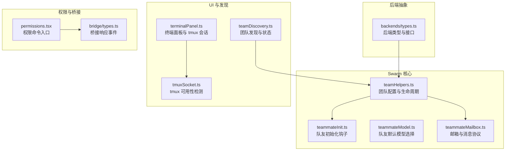
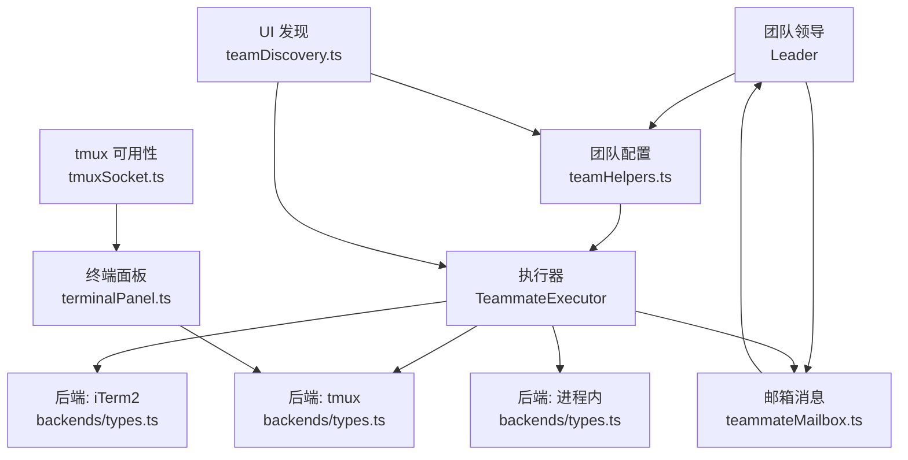
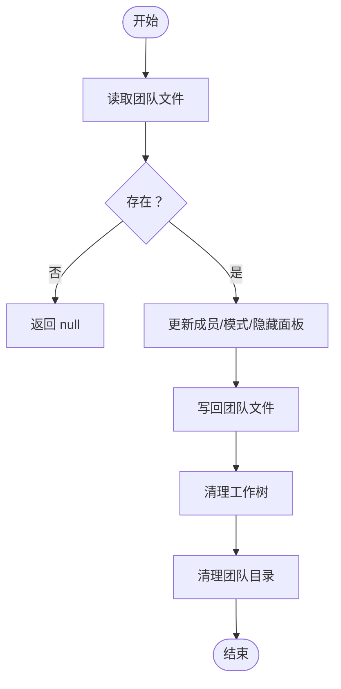
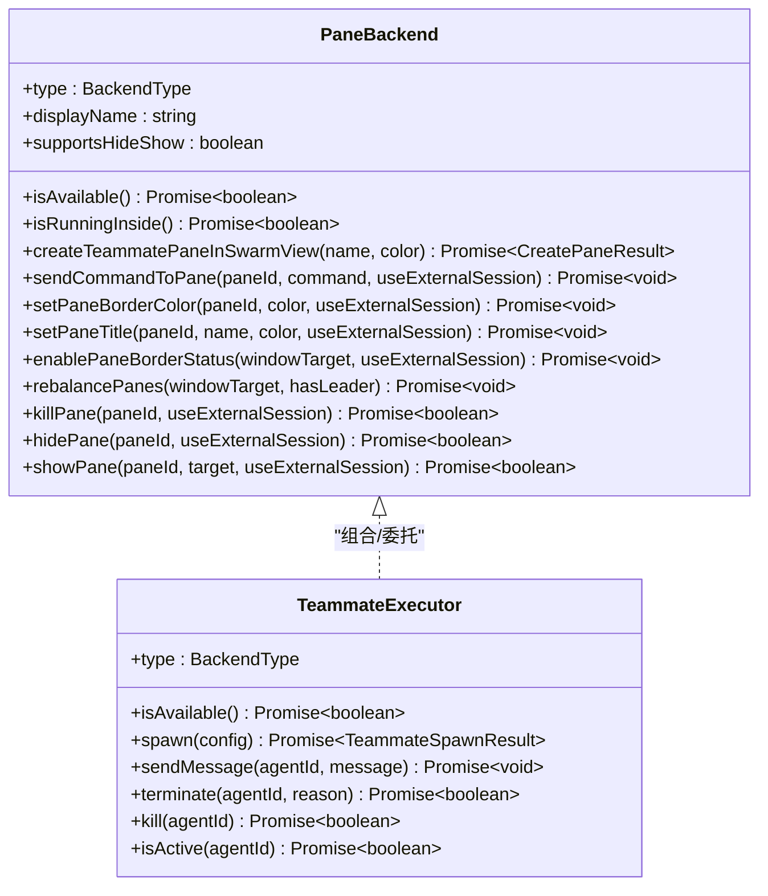
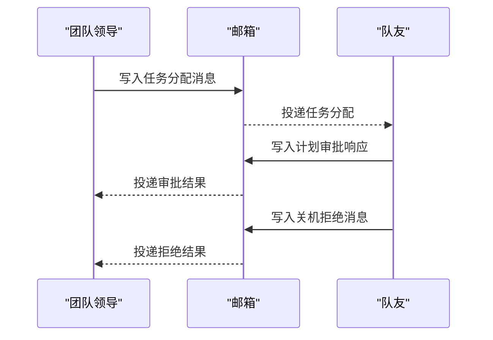
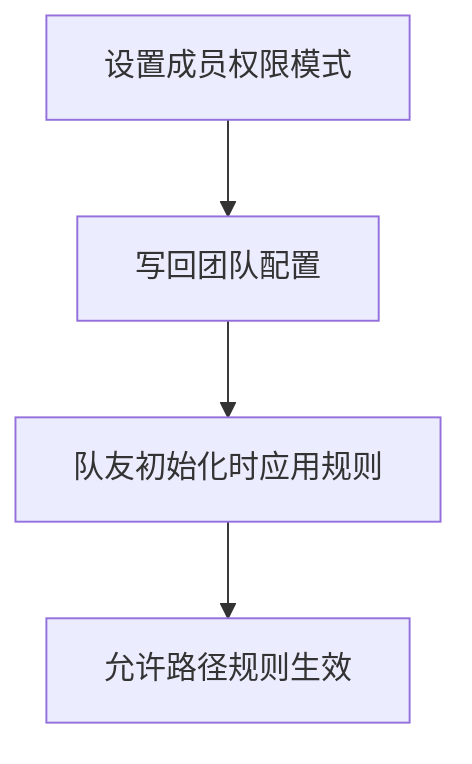
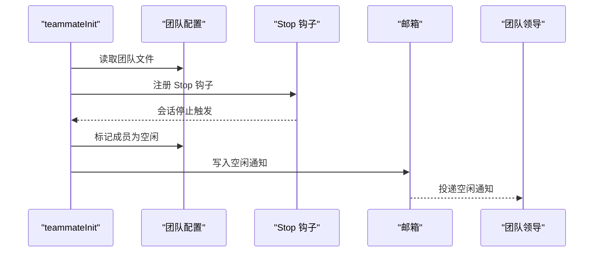
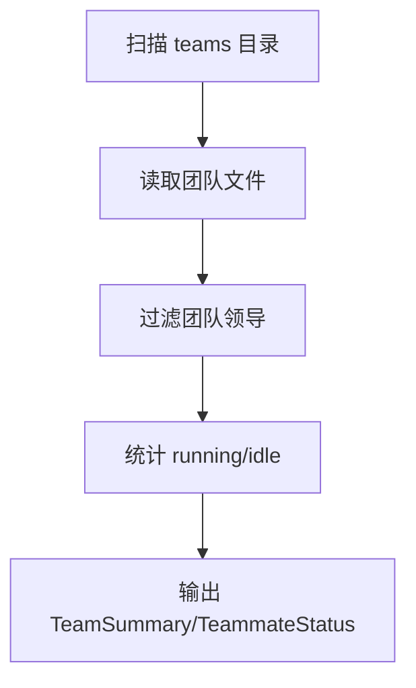
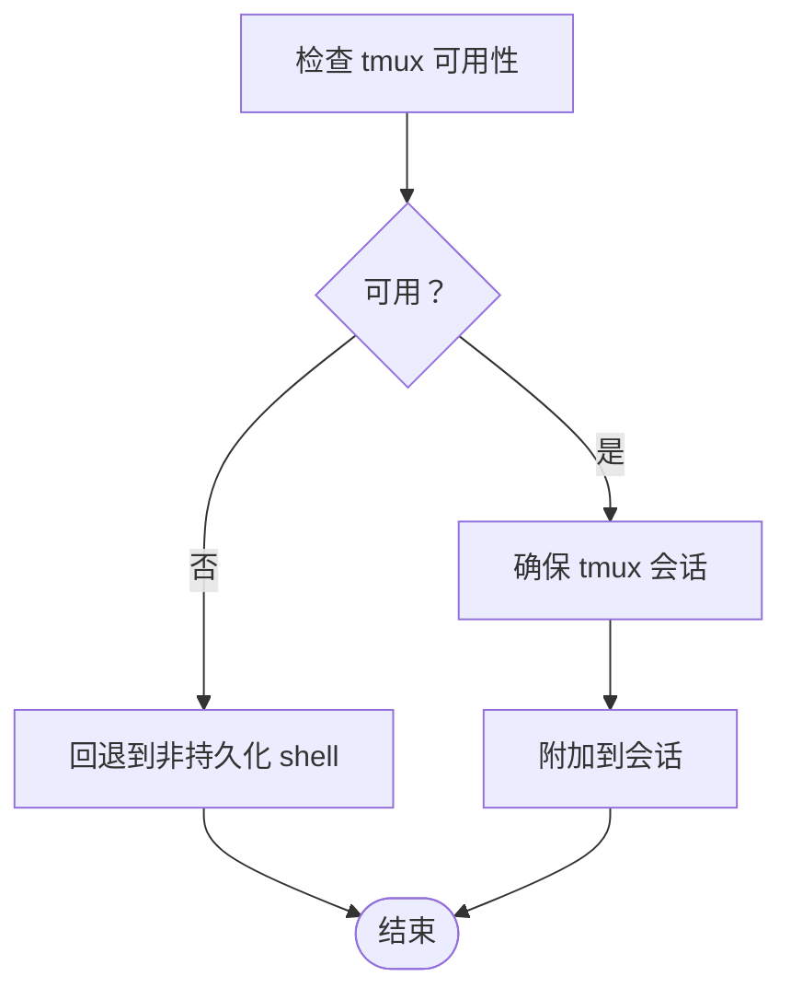
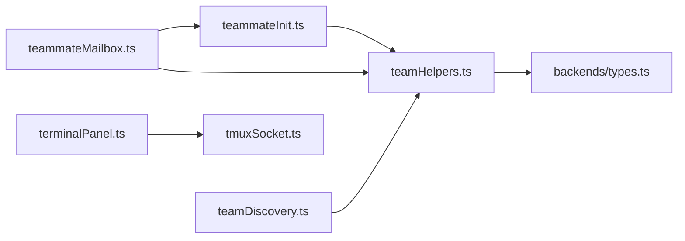

# 团队协调与编排

<cite>
**本文引用的文件**
- [src/main.tsx](file://src/main.tsx)
- [src/utils/teamDiscovery.ts](file://src/utils/teamDiscovery.ts)
- [src/utils/teammate.ts](file://src/utils/teammate.ts)
- [src/cli/print.ts](file://src/cli/print.ts)
- [src/utils/teammateMailbox.ts](file://src/utils/teammateMailbox.ts)
- [src/utils/terminalPanel.ts](file://src/utils/terminalPanel.ts)
- [src/utils/tmuxSocket.ts](file://src/utils/tmuxSocket.ts)
- [src/commands/permissions/permissions.tsx](file://src/commands/permissions/permissions.tsx)
- [src/bridge/types.ts](file://src/bridge/types.ts)
- [src/utils/swarm/teammateModel.ts](file://src/utils/swarm/teammateModel.ts)
- [src/utils/swarm/teamHelpers.ts](file://src/utils/swarm/teamHelpers.ts)
- [src/utils/swarm/backends/types.ts](file://src/utils/swarm/backends/types.ts)
- [src/utils/swarm/teammateInit.ts](file://src/utils/swarm/teammateInit.ts)
</cite>

## 目录
1. [引言](#引言)
2. [项目结构](#项目结构)
3. [核心组件](#核心组件)
4. [架构总览](#架构总览)
5. [详细组件分析](#详细组件分析)
6. [依赖关系分析](#依赖关系分析)
7. [性能考量](#性能考量)
8. [故障排查指南](#故障排查指南)
9. [结论](#结论)
10. [附录](#附录)

## 引言
本文件面向“团队协调与编排”系统，聚焦于 Swarm 模式的设计与实现，涵盖团队成员管理、任务分配与协调机制、通信协议与状态同步、冲突解决策略、多后端执行模型（进程内、Pane、Tmux）、权限控制与资源分配、性能监控以及错误处理与故障恢复。文档以仓库中的实际代码为依据，通过分层讲解与图示帮助读者快速理解并有效使用该系统。

## 项目结构
Swarm 模式相关能力主要分布在以下模块：
- 后端抽象与执行：Pane/Tmux/iTerm2/进程内等执行后端的统一接口与检测逻辑
- 团队配置与生命周期：团队文件读写、成员状态维护、会话清理
- 邮箱与消息：跨进程/跨终端的消息传递与任务分配
- 权限与模式：权限模式切换、规则应用、桥接响应事件
- UI 与发现：团队状态发现、UI 展示与交互
- 终端面板与 tmux 可用性：tmux 检测、会话管理与回退策略

**图表来源**
- [src/utils/swarm/teamHelpers.ts:1-684](file://src/utils/swarm/teamHelpers.ts#L1-L684)
- [src/utils/swarm/teammateInit.ts:1-130](file://src/utils/swarm/teammateInit.ts#L1-L130)
- [src/utils/swarm/teammateModel.ts:1-11](file://src/utils/swarm/teammateModel.ts#L1-L11)
- [src/utils/swarm/teammateMailbox.ts:916-977](file://src/utils/teammateMailbox.ts#L916-L977)
- [src/utils/swarm/backends/types.ts:1-312](file://src/utils/swarm/backends/types.ts#L1-L312)
- [src/utils/teamDiscovery.ts:1-52](file://src/utils/teamDiscovery.ts#L1-L52)
- [src/utils/terminalPanel.ts:38-171](file://src/utils/terminalPanel.ts#L38-L171)
- [src/utils/tmuxSocket.ts:142-180](file://src/utils/tmuxSocket.ts#L142-L180)
- [src/commands/permissions/permissions.tsx:1-9](file://src/commands/permissions/permissions.tsx#L1-L9)
- [src/bridge/types.ts:117-131](file://src/bridge/types.ts#L117-L131)

**章节来源**
- [src/main.tsx:68-82](file://src/main.tsx#L68-L82)
- [src/utils/teamDiscovery.ts:1-52](file://src/utils/teamDiscovery.ts#L1-L52)
- [src/utils/teammate.ts:244-292](file://src/utils/teammate.ts#L244-L292)
- [src/cli/print.ts:2571-2603](file://src/cli/print.ts#L2571-L2603)
- [src/utils/teammateMailbox.ts:916-977](file://src/utils/teammateMailbox.ts#L916-L977)
- [src/utils/terminalPanel.ts:38-171](file://src/utils/terminalPanel.ts#L38-L171)
- [src/utils/tmuxSocket.ts:142-180](file://src/utils/tmuxSocket.ts#L142-L180)
- [src/commands/permissions/permissions.tsx:1-9](file://src/commands/permissions/permissions.tsx#L1-L9)
- [src/bridge/types.ts:117-131](file://src/bridge/types.ts#L117-L131)
- [src/utils/swarm/teammateModel.ts:1-11](file://src/utils/swarm/teammateModel.ts#L1-L11)
- [src/utils/swarm/teamHelpers.ts:1-684](file://src/utils/swarm/teamHelpers.ts#L1-L684)
- [src/utils/swarm/backends/types.ts:1-312](file://src/utils/swarm/backends/types.ts#L1-L312)
- [src/utils/swarm/teammateInit.ts:1-130](file://src/utils/swarm/teammateInit.ts#L1-L130)

## 核心组件
- 团队配置与生命周期：负责团队文件的读写、成员状态变更、工作树清理、会话级团队清理等
- 后端抽象与执行：定义 PaneBackend 与 TeammateExecutor 接口，屏蔽 tmux/iTerm2/进程内差异
- 邮箱与消息协议：定义任务分配、计划审批、关机拒绝等消息格式，并提供解析与发送
- 权限与模式：支持在团队中设置成员权限模式，同步到配置文件；桥接控制响应事件
- 团队发现与 UI：扫描团队目录，聚合成员运行/空闲状态，供 UI 展示
- 终端面板与 tmux：检测 tmux 可用性，管理 tmux 会话，回退至非持久化 shell

**章节来源**
- [src/utils/swarm/teamHelpers.ts:1-684](file://src/utils/swarm/teamHelpers.ts#L1-L684)
- [src/utils/swarm/backends/types.ts:1-312](file://src/utils/swarm/backends/types.ts#L1-L312)
- [src/utils/teammateMailbox.ts:916-977](file://src/utils/teammateMailbox.ts#L916-L977)
- [src/utils/teamDiscovery.ts:1-52](file://src/utils/teamDiscovery.ts#L1-L52)
- [src/utils/terminalPanel.ts:38-171](file://src/utils/terminalPanel.ts#L38-L171)
- [src/utils/tmuxSocket.ts:142-180](file://src/utils/tmuxSocket.ts#L142-L180)

## 架构总览
Swarm 模式采用“配置驱动 + 多后端执行 + 邮箱消息”的架构：
- 配置驱动：团队文件记录成员、工作树、隐藏面板、权限模式等信息
- 多后端执行：统一抽象 TeammateExecutor，支持 tmux/iTerm2 进程内三种后端
- 消息协议：通过邮箱消息实现任务分配、状态通知、权限决策等
- 权限与模式：成员权限模式可由领导设置并同步到配置文件
- 发现与 UI：UI 侧扫描团队目录获取状态，结合后端布局进行展示

**图表来源**
- [src/utils/swarm/teamHelpers.ts:1-684](file://src/utils/swarm/teamHelpers.ts#L1-L684)
- [src/utils/swarm/backends/types.ts:1-312](file://src/utils/swarm/backends/types.ts#L1-L312)
- [src/utils/swarm/teammateMailbox.ts:916-977](file://src/utils/teammateMailbox.ts#L916-L977)
- [src/utils/teamDiscovery.ts:1-52](file://src/utils/teamDiscovery.ts#L1-L52)
- [src/utils/terminalPanel.ts:38-171](file://src/utils/terminalPanel.ts#L38-L171)
- [src/utils/tmuxSocket.ts:142-180](file://src/utils/tmuxSocket.ts#L142-L180)

## 详细组件分析

### 团队配置与生命周期（teamHelpers）
- 职责
  - 团队文件读写：同步/异步读取与写入，保证原子更新
  - 成员管理：添加/移除成员、设置权限模式、标记活跃/空闲
  - 工作树清理：优先使用 git worktree remove，失败时回退 rm -rf
  - 会话清理：注册/注销会话创建的团队，优雅退出时批量清理
- 关键数据结构
  - TeamFile：包含团队元信息、成员列表、隐藏面板、允许路径等
  - TeamAllowedPath：团队级允许路径规则
- 错误处理
  - 文件不存在返回空；IO 错误记录调试日志；清理阶段尽力而为

**图表来源**
- [src/utils/swarm/teamHelpers.ts:131-182](file://src/utils/swarm/teamHelpers.ts#L131-L182)
- [src/utils/swarm/teamHelpers.ts:492-551](file://src/utils/swarm/teamHelpers.ts#L492-L551)
- [src/utils/swarm/teamHelpers.ts:641-683](file://src/utils/swarm/teamHelpers.ts#L641-L683)

**章节来源**
- [src/utils/swarm/teamHelpers.ts:1-684](file://src/utils/swarm/teamHelpers.ts#L1-L684)

### 后端抽象与执行（backends/types）
- 职责
  - 定义 PaneBackend 接口：创建/销毁/隐藏/显示面板，设置标题与边框颜色，重排布局
  - 定义 TeammateExecutor 接口：spawn/sendMessage/terminate/kill/isActive
  - 类型守卫：区分 pane 后端与非 pane 后端
- 执行后端
  - tmux：跨平台支持，支持外部会话 socket
  - iTerm2：通过 it2 CLI 管理 split panes
  - 进程内：在同一 Node 进程内隔离上下文运行

**图表来源**
- [src/utils/swarm/backends/types.ts:39-168](file://src/utils/swarm/backends/types.ts#L39-L168)
- [src/utils/swarm/backends/types.ts:279-300](file://src/utils/swarm/backends/types.ts#L279-L300)

**章节来源**
- [src/utils/swarm/backends/types.ts:1-312](file://src/utils/swarm/backends/types.ts#L1-L312)

### 邮箱与消息协议（teammateMailbox）
- 职责
  - 定义消息类型：任务分配、计划审批响应、关机拒绝等
  - 提供解析函数：识别并解析特定消息文本
  - 提供写入与读取：向领导或队友写入消息
- 协议要点
  - 任务分配消息包含 taskId、subject、description、assignedBy、timestamp
  - 计划审批响应用于确认是否批准计划
  - 关机拒绝消息用于拒绝关闭请求

**图表来源**
- [src/utils/teammateMailbox.ts:916-977](file://src/utils/teammateMailbox.ts#L916-L977)

**章节来源**
- [src/utils/teammateMailbox.ts:916-977](file://src/utils/teammateMailbox.ts#L916-L977)

### 权限与模式（permissions + bridge）
- 职责
  - 权限命令入口：渲染权限规则列表，支持重试被拒绝的权限
  - 桥接响应事件：定义 control_response 事件结构，承载权限决策
- 应用方式
  - 领导可在 UI 中设置成员权限模式，同步到团队配置文件
  - 队友初始化时应用团队级允许路径规则

**图表来源**
- [src/commands/permissions/permissions.tsx:1-9](file://src/commands/permissions/permissions.tsx#L1-L9)
- [src/bridge/types.ts:117-131](file://src/bridge/types.ts#L117-L131)
- [src/utils/swarm/teamHelpers.ts:357-407](file://src/utils/swarm/teamHelpers.ts#L357-L407)

**章节来源**
- [src/commands/permissions/permissions.tsx:1-9](file://src/commands/permissions/permissions.tsx#L1-L9)
- [src/bridge/types.ts:117-131](file://src/bridge/types.ts#L117-L131)
- [src/utils/swarm/teamHelpers.ts:357-407](file://src/utils/swarm/teamHelpers.ts#L357-L407)

### 队友初始化与空闲通知（teammateInit）
- 职责
  - 注册 Stop 钩子：当队友会话停止时，标记成员为空闲并通知领导
  - 应用团队级允许路径规则：在启动时注入工具权限
- 行为
  - 读取团队文件，定位领导 ID 与领导名称
  - 注册 Stop 钩子，发送空闲通知消息
  - 应用 teamAllowedPaths 规则到当前会话

**图表来源**
- [src/utils/swarm/teammateInit.ts:28-129](file://src/utils/swarm/teammateInit.ts#L28-L129)

**章节来源**
- [src/utils/swarm/teammateInit.ts:1-130](file://src/utils/swarm/teammateInit.ts#L1-L130)

### 团队发现与 UI（teamDiscovery）
- 职责
  - 扫描 ~/.claude/teams/ 获取团队摘要与成员状态
  - 过滤团队领导，聚合 running/idle/unknown 状态
- 输出
  - TeamSummary：团队名、成员总数、运行中/空闲计数
  - TeammateStatus：成员名、agentId、状态、工作目录、后端类型等

**图表来源**
- [src/utils/teamDiscovery.ts:39-52](file://src/utils/teamDiscovery.ts#L39-L52)

**章节来源**
- [src/utils/teamDiscovery.ts:1-52](file://src/utils/teamDiscovery.ts#L1-L52)

### 终端面板与 tmux（terminalPanel + tmuxSocket）
- 职责
  - tmux 可用性检测：缓存检测结果，Windows 平台通过 WSL 调用
  - 终端面板：优先使用 tmux 会话，不可用时回退到直接运行 shell
  - 清理：优雅退出时尝试 kill-server，避免孤儿进程
- 场景
  - tmux 不可用：Tmux 工具与 Teammate 工具不可用，Bash 命令无 tmux 隔离

**图表来源**
- [src/utils/tmuxSocket.ts:151-180](file://src/utils/tmuxSocket.ts#L151-L180)
- [src/utils/terminalPanel.ts:154-171](file://src/utils/terminalPanel.ts#L154-L171)

**章节来源**
- [src/utils/tmuxSocket.ts:142-180](file://src/utils/tmuxSocket.ts#L142-L180)
- [src/utils/terminalPanel.ts:38-171](file://src/utils/terminalPanel.ts#L38-L171)

### 队友默认模型选择（teammateModel）
- 职责
  - 在用户未设置 teammateDefaultModel 时，提供默认模型 ID
  - 根据 API Provider 返回对应模型（如 Bedrock/Vertex/Foundry）

**章节来源**
- [src/utils/swarm/teammateModel.ts:1-11](file://src/utils/swarm/teammateModel.ts#L1-L11)

## 依赖关系分析
- 组件耦合
  - teamHelpers 与 backends/types：teamHelpers 使用后端类型守卫与 PaneBackend 判断，但不直接依赖具体实现
  - teammateInit 依赖 teamHelpers 读取配置并写回成员状态
  - teammateMailbox 作为消息中枢，被 leader 与 teammate 共同使用
- 外部依赖
  - tmux 命令与 it2 CLI（iTerm2），Windows 通过 WSL
  - 文件系统：团队目录、任务目录、工作树目录

**图表来源**
- [src/utils/swarm/teamHelpers.ts:1-684](file://src/utils/swarm/teamHelpers.ts#L1-L684)
- [src/utils/swarm/backends/types.ts:1-312](file://src/utils/swarm/backends/types.ts#L1-L312)
- [src/utils/swarm/teammateInit.ts:1-130](file://src/utils/swarm/teammateInit.ts#L1-L130)
- [src/utils/teammateMailbox.ts:916-977](file://src/utils/teammateMailbox.ts#L916-L977)
- [src/utils/teamDiscovery.ts:1-52](file://src/utils/teamDiscovery.ts#L1-L52)
- [src/utils/terminalPanel.ts:38-171](file://src/utils/terminalPanel.ts#L38-L171)
- [src/utils/tmuxSocket.ts:142-180](file://src/utils/tmuxSocket.ts#L142-L180)

**章节来源**
- [src/utils/swarm/teamHelpers.ts:1-684](file://src/utils/swarm/teamHelpers.ts#L1-L684)
- [src/utils/swarm/backends/types.ts:1-312](file://src/utils/swarm/backends/types.ts#L1-L312)
- [src/utils/swarm/teammateInit.ts:1-130](file://src/utils/swarm/teammateInit.ts#L1-L130)
- [src/utils/teammateMailbox.ts:916-977](file://src/utils/teammateMailbox.ts#L916-L977)
- [src/utils/teamDiscovery.ts:1-52](file://src/utils/teamDiscovery.ts#L1-L52)
- [src/utils/terminalPanel.ts:38-171](file://src/utils/terminalPanel.ts#L38-L171)
- [src/utils/tmuxSocket.ts:142-180](file://src/utils/tmuxSocket.ts#L142-L180)

## 性能考量
- IO 与并发
  - 团队清理采用 Promise.allSettled 并发处理多个面板/目录，减少整体耗时
  - 异步读写团队文件，避免阻塞主线程
- 资源隔离
  - tmux/iTerm2 提供隔离的终端环境，降低相互干扰
  - 进程内执行适合轻量任务，避免额外进程开销
- 日志与可观测性
  - 大量调试日志用于追踪 IO 失败、面板操作结果、权限应用情况

[本节为通用指导，无需列出具体文件来源]

## 故障排查指南
- tmux 不可用
  - 现象：Tmux 工具与 Teammate 工具不可用，Bash 命令无 tmux 隔离
  - 处理：安装 tmux 或使用 iTerm2；Windows 通过 WSL 验证 tmux 可用性
  - 参考：[tmux 可用性检测:151-180](file://src/utils/tmuxSocket.ts#L151-L180)
- 面板孤儿进程
  - 现象：异常退出后面板仍存在
  - 处理：优雅退出时调用 cleanupSessionTeams 杀死面板；必要时手动 tmux kill-server
  - 参考：[会话清理:576-634](file://src/utils/swarm/teamHelpers.ts#L576-L634)
- 邮箱消息解析失败
  - 现象：无法识别任务分配/审批/拒绝消息
  - 处理：检查消息 JSON 结构与字段；使用解析函数进行校验
  - 参考：[消息解析:916-977](file://src/utils/teammateMailbox.ts#L916-L977)
- 权限拒绝
  - 现象：工具调用被拒绝
  - 处理：通过权限命令重试；检查 teamAllowedPaths 与成员权限模式
  - 参考：[权限命令入口:1-9](file://src/commands/permissions/permissions.tsx#L1-L9)
- UI 状态不同步
  - 现象：UI 显示空闲但实际仍在运行
  - 处理：确认 Stop 钩子已注册；检查 setMemberActive 是否写回配置
  - 参考：[空闲通知与状态写回:103-128](file://src/utils/swarm/teammateInit.ts#L103-L128)

**章节来源**
- [src/utils/tmuxSocket.ts:151-180](file://src/utils/tmuxSocket.ts#L151-L180)
- [src/utils/swarm/teamHelpers.ts:576-634](file://src/utils/swarm/teamHelpers.ts#L576-L634)
- [src/utils/teammateMailbox.ts:916-977](file://src/utils/teammateMailbox.ts#L916-L977)
- [src/commands/permissions/permissions.tsx:1-9](file://src/commands/permissions/permissions.tsx#L1-L9)
- [src/utils/swarm/teammateInit.ts:103-128](file://src/utils/swarm/teammateInit.ts#L103-L128)

## 结论
Swarm 模式通过“配置驱动 + 多后端执行 + 邮箱消息”的架构实现了团队成员的统一管理与协调。后端抽象屏蔽了 tmux/iTerm2/进程内的差异，团队配置文件提供了强一致的状态存储，邮箱消息协议保障了跨进程通信的可靠性。配合权限模式与团队级允许路径规则，系统在功能开放与安全之间取得平衡。通过 tmux 可用性检测与会话清理机制，系统具备良好的容错与恢复能力。

[本节为总结性内容，无需列出具体文件来源]

## 附录
- 团队任务的创建与管理
  - 创建：通过 TeamCreateTool 或相关命令生成团队文件与初始成员
  - 监控：UI 通过 teamDiscovery 扫描团队目录，获取成员运行/空闲状态
  - 管理：通过 TeamDeleteTool 删除团队及目录；会话退出时自动清理
  - 参考：[团队发现:39-52](file://src/utils/teamDiscovery.ts#L39-L52)、[团队清理:641-683](file://src/utils/swarm/teamHelpers.ts#L641-L683)
- 团队成员的权限控制
  - 设置权限模式：领导在 UI 中设置成员权限模式，写回团队配置
  - 应用规则：队友初始化时应用 teamAllowedPaths 规则
  - 参考：[权限模式设置:357-407](file://src/utils/swarm/teamHelpers.ts#L357-L407)、[规则应用:44-79](file://src/utils/swarm/teammateInit.ts#L44-L79)
- 性能监控
  - 建议：结合调试日志与 tmux 状态查看面板占用；对高频 IO 操作进行批处理
  - 参考：[调试日志:137-141](file://src/utils/swarm/teamHelpers.ts#L137-L141)
- 错误处理与故障恢复
  - tmux 不可用：回退到非持久化 shell；Windows 通过 WSL 验证
  - 面板孤儿：优雅退出时清理；必要时手动清理
  - 参考：[回退策略:163-171](file://src/utils/terminalPanel.ts#L163-L171)、[清理流程:598-634](file://src/utils/swarm/teamHelpers.ts#L598-L634)

**章节来源**
- [src/utils/teamDiscovery.ts:39-52](file://src/utils/teamDiscovery.ts#L39-L52)
- [src/utils/swarm/teamHelpers.ts:641-683](file://src/utils/swarm/teamHelpers.ts#L641-L683)
- [src/utils/swarm/teamHelpers.ts:357-407](file://src/utils/swarm/teamHelpers.ts#L357-L407)
- [src/utils/swarm/teammateInit.ts:44-79](file://src/utils/swarm/teammateInit.ts#L44-L79)
- [src/utils/terminalPanel.ts:163-171](file://src/utils/terminalPanel.ts#L163-L171)
- [src/utils/swarm/teamHelpers.ts:598-634](file://src/utils/swarm/teamHelpers.ts#L598-L634)