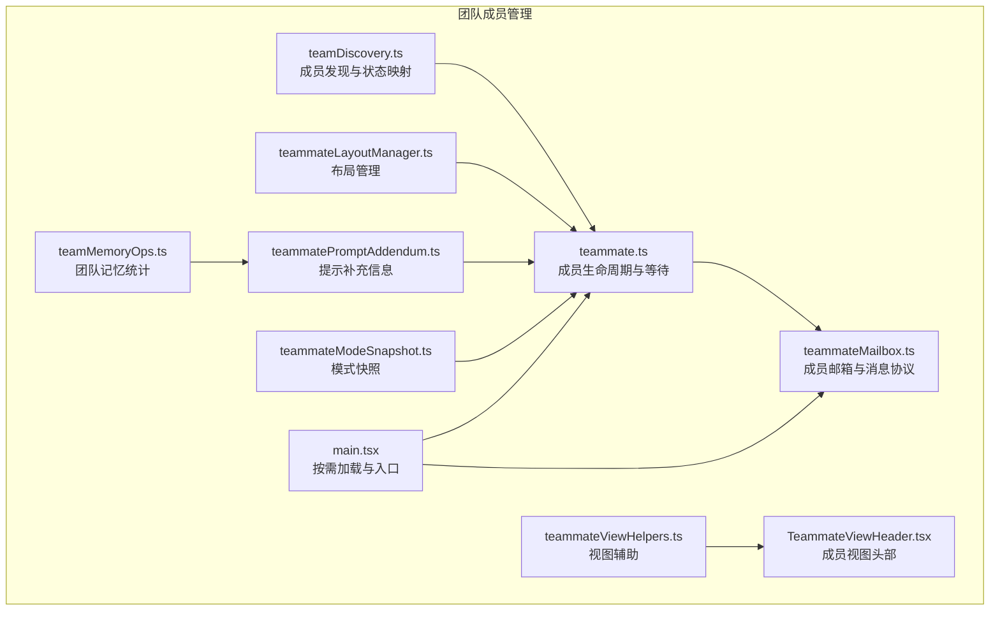
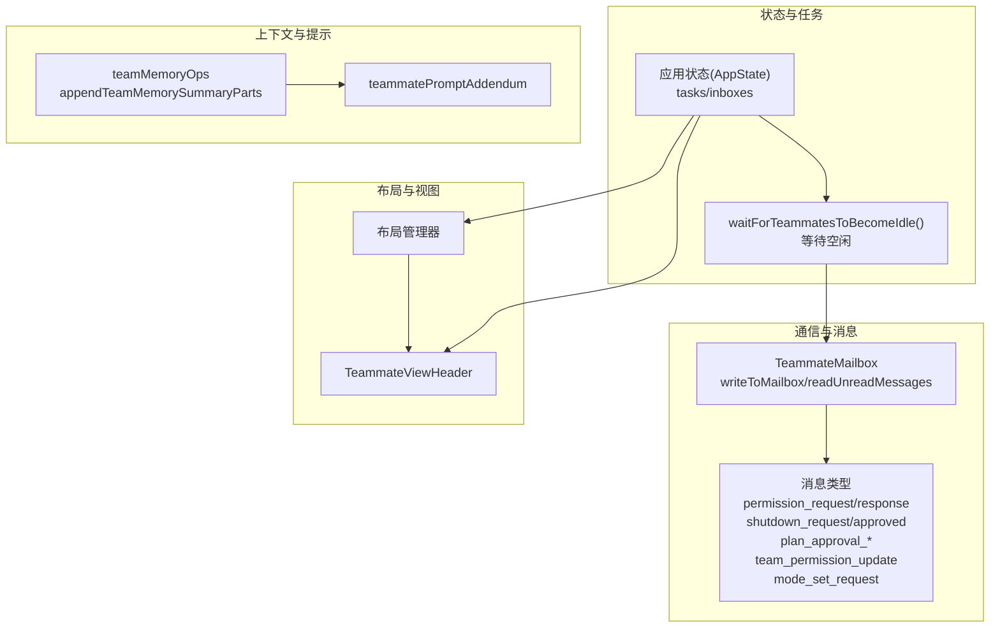
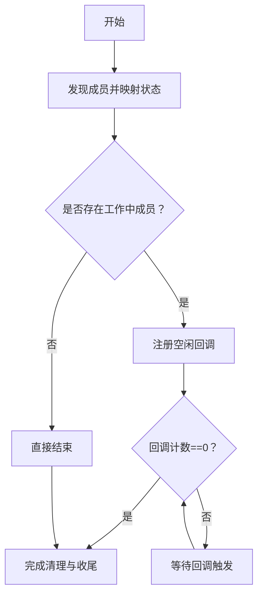
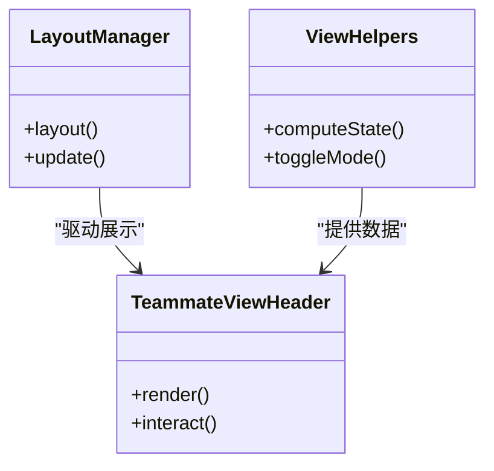
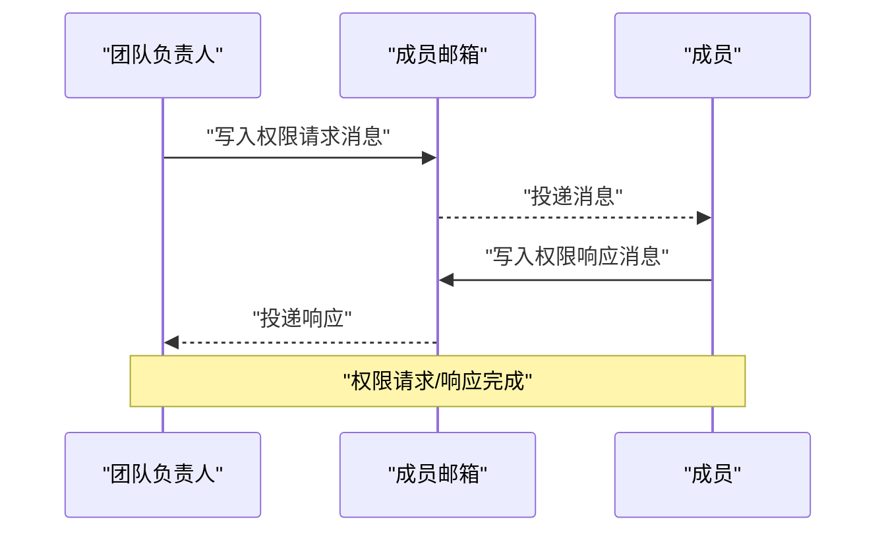
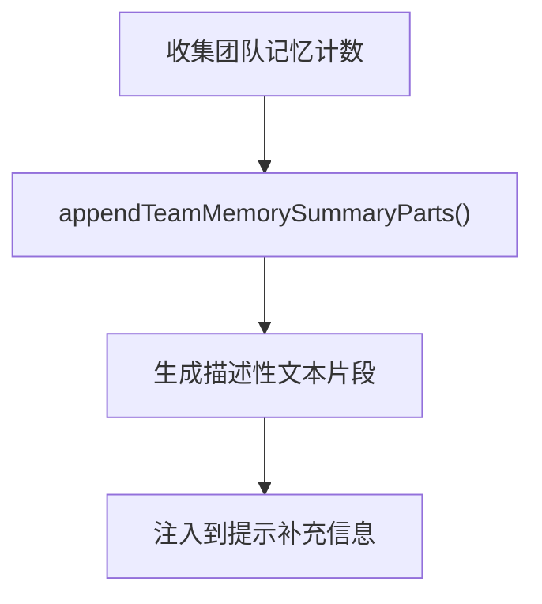
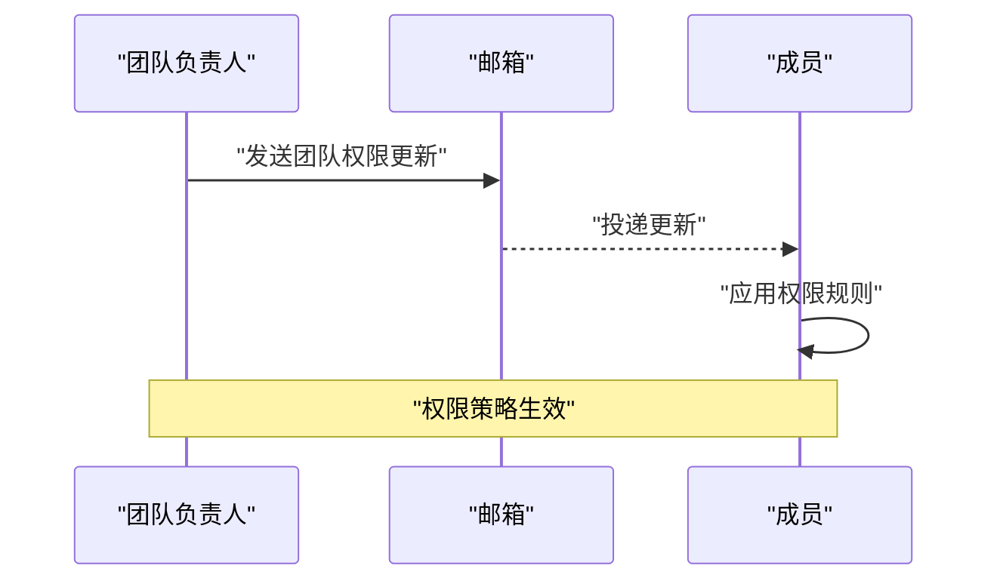
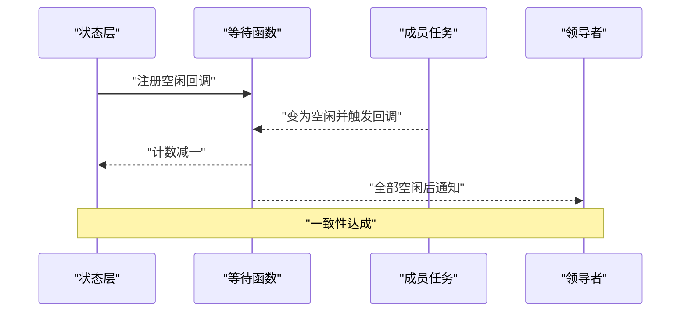
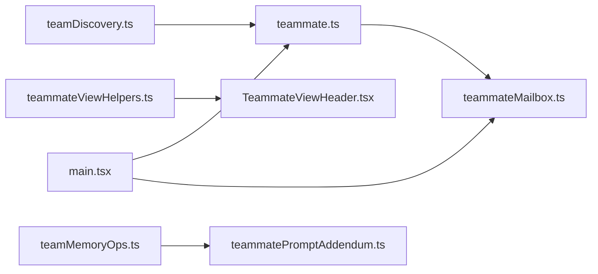

# 团队成员管理

<cite>
**本文引用的文件**
- [src/utils/teammate.ts](file://src/utils/teammate.ts)
- [src/utils/teammateMailbox.ts](file://src/utils/teammateMailbox.ts)
- [src/utils/teamDiscovery.ts](file://src/utils/teamDiscovery.ts)
- [src/utils/swarm/teammateInit.ts](file://src/utils/swarm/teammateInit.ts)
- [src/utils/swarm/teammateLayoutManager.ts](file://src/utils/swarm/teammateLayoutManager.ts)
- [src/utils/swarm/teammatePromptAddendum.ts](file://src/utils/swarm/teammatePromptAddendum.ts)
- [src/utils/swarm/backends/teammateModeSnapshot.ts](file://src/utils/swarm/backends/teammateModeSnapshot.ts)
- [src/state/teammateViewHelpers.ts](file://src/state/teammateViewHelpers.ts)
- [src/components/TeammateViewHeader.tsx](file://src/components/TeammateViewHeader.tsx)
- [src/main.tsx](file://src/main.tsx)
- [src/utils/teamMemoryOps.ts](file://src/utils/teamMemoryOps.ts)
- [src/commands/permissions/permissions.tsx](file://src/commands/permissions/permissions.tsx)
</cite>

## 目录
1. [简介](#简介)
2. [项目结构](#项目结构)
3. [核心组件](#核心组件)
4. [架构总览](#架构总览)
5. [详细组件分析](#详细组件分析)
6. [依赖关系分析](#依赖关系分析)
7. [性能考量](#性能考量)
8. [故障排除指南](#故障排除指南)
9. [结论](#结论)
10. [附录](#附录)

## 简介
本文件系统性阐述团队成员管理的设计与实现，覆盖成员生命周期（初始化、状态跟踪、清理）、布局与显示控制、交互与消息传递、权限与角色、提示补充信息生成、成员增删替换、状态同步与一致性保障等主题。内容基于仓库中的实际实现进行归纳总结，并通过图示帮助读者建立从高层到代码级的完整认知。

## 项目结构
围绕“团队成员管理”的相关模块主要分布在以下位置：
- 工具与状态：src/utils 下的 teammate.ts、teammateMailbox.ts、teamDiscovery.ts、swarm 子目录下的初始化、布局、提示补充、模式快照等工具；src/state/teammateViewHelpers.ts 提供视图辅助逻辑；src/components/TeammateViewHeader.tsx 提供头部展示组件；src/main.tsx 中对相关模块进行按需加载。
- 权限与消息：src/utils/teammateMailbox.ts 定义了多种消息类型（如权限请求/响应、关机请求/批准、计划审批、团队权限更新、模式设置请求等），并通过邮箱机制在成员间传递。
- 记忆与上下文：src/utils/teamMemoryOps.ts 提供团队记忆读写统计与摘要拼接逻辑，影响提示补充信息的生成。

**图表来源**
- [src/utils/teammate.ts:197-292](file://src/utils/teammate.ts#L197-L292)
- [src/utils/teammateMailbox.ts:110-352](file://src/utils/teammateMailbox.ts#L110-L352)
- [src/utils/teamDiscovery.ts:48-81](file://src/utils/teamDiscovery.ts#L48-L81)
- [src/utils/swarm/teammateLayoutManager.ts](file://src/utils/swarm/teammateLayoutManager.ts)
- [src/utils/swarm/teammatePromptAddendum.ts](file://src/utils/swarm/teammatePromptAddendum.ts)
- [src/utils/swarm/backends/teammateModeSnapshot.ts](file://src/utils/swarm/backends/teammateModeSnapshot.ts)
- [src/state/teammateViewHelpers.ts](file://src/state/teammateViewHelpers.ts)
- [src/components/TeammateViewHeader.tsx](file://src/components/TeammateViewHeader.tsx)
- [src/main.tsx:68-82](file://src/main.tsx#L68-L82)
- [src/utils/teamMemoryOps.ts:38-88](file://src/utils/teamMemoryOps.ts#L38-L88)

**章节来源**
- [src/main.tsx:68-82](file://src/main.tsx#L68-L82)
- [src/utils/teammate.ts:197-292](file://src/utils/teammate.ts#L197-L292)
- [src/utils/teammateMailbox.ts:110-352](file://src/utils/teammateMailbox.ts#L110-L352)
- [src/utils/teamDiscovery.ts:48-81](file://src/utils/teamDiscovery.ts#L48-L81)
- [src/state/teammateViewHelpers.ts](file://src/state/teammateViewHelpers.ts)
- [src/components/TeammateViewHeader.tsx](file://src/components/TeammateViewHeader.tsx)

## 核心组件
- 成员生命周期与等待：提供检测活跃/工作中成员、等待全部成员空闲、以及回调注册等能力，确保在退出或关闭前正确收尾。
- 邮箱与消息协议：定义并实现成员间通信的消息格式与发送/接收流程，支持权限请求、关机请求、计划审批、团队权限更新、模式设置等。
- 成员发现与状态映射：从配置文件中解析成员列表，过滤团队负责人，计算运行/空闲状态，并映射为统一的状态对象。
- 布局与显示控制：提供布局管理器与视图头部组件，支撑成员面板的可视化呈现与交互。
- 提示补充信息：结合团队记忆统计与上下文，生成成员提示补充文本，增强上下文完整性。
- 模式快照：记录与恢复成员工作模式，保障一致性与可追溯性。
- 权限与角色：通过消息协议与规则更新广播，实现权限策略的下发与执行。

**章节来源**
- [src/utils/teammate.ts:197-292](file://src/utils/teammate.ts#L197-L292)
- [src/utils/teammateMailbox.ts:485-1029](file://src/utils/teammateMailbox.ts#L485-L1029)
- [src/utils/teamDiscovery.ts:48-81](file://src/utils/teamDiscovery.ts#L48-L81)
- [src/utils/swarm/teammateLayoutManager.ts](file://src/utils/swarm/teammateLayoutManager.ts)
- [src/components/TeammateViewHeader.tsx](file://src/components/TeammateViewHeader.tsx)
- [src/utils/swarm/teammatePromptAddendum.ts](file://src/utils/swarm/teammatePromptAddendum.ts)
- [src/utils/swarm/backends/teammateModeSnapshot.ts](file://src/utils/swarm/backends/teammateModeSnapshot.ts)
- [src/utils/teamMemoryOps.ts:38-88](file://src/utils/teamMemoryOps.ts#L38-L88)

## 架构总览
下图展示了团队成员管理的关键交互：成员状态由任务层维护，通过邮箱协议进行跨成员通信，布局与视图负责展示，提示补充信息与团队记忆共同增强上下文。

**图表来源**
- [src/utils/teammate.ts:233-292](file://src/utils/teammate.ts#L233-L292)
- [src/utils/teammateMailbox.ts:110-352](file://src/utils/teammateMailbox.ts#L110-L352)
- [src/utils/teamMemoryOps.ts:38-88](file://src/utils/teamMemoryOps.ts#L38-L88)
- [src/utils/swarm/teammatePromptAddendum.ts](file://src/utils/swarm/teammatePromptAddendum.ts)
- [src/components/TeammateViewHeader.tsx](file://src/components/TeammateViewHeader.tsx)

## 详细组件分析

### 生命周期管理：初始化、状态跟踪与清理
- 初始化与发现
  - 从配置文件解析成员列表，过滤团队负责人，计算运行/空闲状态，映射为统一状态对象，便于后续展示与调度。
- 状态跟踪
  - 通过任务层维护成员任务状态（运行/空闲），并提供查询活跃/工作中成员的能力，用于决定是否需要等待。
- 清理与等待
  - 提供等待所有工作中成员变为空闲的机制：注册回调、检查竞态、在全部回调触发后 resolve，确保退出前资源释放与收尾。

**图表来源**
- [src/utils/teamDiscovery.ts:48-81](file://src/utils/teamDiscovery.ts#L48-L81)
- [src/utils/teammate.ts:233-292](file://src/utils/teammate.ts#L233-L292)

**章节来源**
- [src/utils/teamDiscovery.ts:48-81](file://src/utils/teamDiscovery.ts#L48-L81)
- [src/utils/teammate.ts:197-292](file://src/utils/teammate.ts#L197-L292)

### 布局管理、显示控制与交互
- 布局管理器
  - 负责成员面板的布局与排列，配合视图头部组件提供一致的交互体验。
- 视图头部
  - TeammateViewHeader.tsx 提供成员视图的头部展示，承载标题、状态指示与交互按钮等。
- 辅助逻辑
  - teammateViewHelpers.ts 提供视图相关的辅助函数，简化状态切换与渲染逻辑。

**图表来源**
- [src/utils/swarm/teammateLayoutManager.ts](file://src/utils/swarm/teammateLayoutManager.ts)
- [src/components/TeammateViewHeader.tsx](file://src/components/TeammateViewHeader.tsx)
- [src/state/teammateViewHelpers.ts](file://src/state/teammateViewHelpers.ts)

**章节来源**
- [src/utils/swarm/teammateLayoutManager.ts](file://src/utils/swarm/teammateLayoutManager.ts)
- [src/components/TeammateViewHeader.tsx](file://src/components/TeammateViewHeader.tsx)
- [src/state/teammateViewHelpers.ts](file://src/state/teammateViewHelpers.ts)

### 交互处理与消息协议
- 写入与读取
  - writeToMailbox 使用文件锁避免并发写入冲突，先确保收件箱存在，再加锁读取最新消息，追加新消息后写回。
  - readUnreadMessages 读取未读消息并标记已读，clearMailbox 支持清空收件箱。
- 消息类型
  - 权限请求/响应：用于向团队负责人申请工具使用权限并返回结果。
  - 关机请求/批准：领导向成员发起关机，成员批准后返回确认。
  - 计划审批请求/响应：领导请求成员对计划进行审批，成员返回批准与否及反馈。
  - 团队权限更新：广播型权限更新，应用于全体成员。
  - 模式设置请求：领导向成员推送新的权限模式。
- 解析与校验
  - 使用 Zod Schema 对消息进行安全解析，is* 类函数用于识别消息类型，确保只处理合法消息。

**图表来源**
- [src/utils/teammateMailbox.ts:134-192](file://src/utils/teammateMailbox.ts#L134-L192)
- [src/utils/teammateMailbox.ts:485-536](file://src/utils/teammateMailbox.ts#L485-L536)
- [src/utils/teammateMailbox.ts:851-863](file://src/utils/teammateMailbox.ts#L851-L863)
- [src/utils/teammateMailbox.ts:868-914](file://src/utils/teammateMailbox.ts#L868-L914)

**章节来源**
- [src/utils/teammateMailbox.ts:110-352](file://src/utils/teammateMailbox.ts#L110-L352)
- [src/utils/teammateMailbox.ts:485-1029](file://src/utils/teammateMailbox.ts#L485-L1029)

### 成员提示补充信息的生成与应用
- 团队记忆统计
  - teamMemoryOps 提供读/搜/写的计数汇总，用于生成“回忆/搜索/写下”团队记忆的描述性文本。
- 提示补充
  - teammatePromptAddendum 结合团队记忆统计与上下文，生成成员提示补充信息，提升上下文完整性与准确性。

**图表来源**
- [src/utils/teamMemoryOps.ts:38-88](file://src/utils/teamMemoryOps.ts#L38-L88)
- [src/utils/swarm/teammatePromptAddendum.ts](file://src/utils/swarm/teammatePromptAddendum.ts)

**章节来源**
- [src/utils/teamMemoryOps.ts:38-88](file://src/utils/teamMemoryOps.ts#L38-L88)
- [src/utils/swarm/teammatePromptAddendum.ts](file://src/utils/swarm/teammatePromptAddendum.ts)

### 成员权限控制、角色分配与能力标识
- 权限请求与响应
  - 通过 permission_request 与 permission_response 实现成员向负责人发起权限申请与接收结果。
- 团队权限更新
  - team_permission_update 广播型更新，包含规则集合、行为（允许/拒绝/询问）与目标会话，成员收到后更新本地权限策略。
- 模式设置
  - mode_set_request 由负责人下发新的权限模式，成员据此调整自身行为边界。
- 角色与能力
  - 角色由团队负责人分配，能力标识通过工具名称与输入参数体现；权限更新与模式设置共同约束成员行为。

**图表来源**
- [src/utils/teammateMailbox.ts:983-1013](file://src/utils/teammateMailbox.ts#L983-L1013)
- [src/utils/teammateMailbox.ts:1019-1029](file://src/utils/teammateMailbox.ts#L1019-L1029)

**章节来源**
- [src/utils/teammateMailbox.ts:485-1029](file://src/utils/teammateMailbox.ts#L485-L1029)

### 成员状态同步、冲突解决与一致性保证
- 状态同步
  - 通过任务层维护成员任务状态（运行/空闲），并在成员空闲时发送 idle_notification，携带摘要与完成状态，便于领导者汇总。
- 冲突解决
  - 邮箱写入采用文件锁，避免并发写入导致的数据损坏；读取后重新合并最新状态，减少竞态风险。
- 一致性保证
  - waitForTeammatesToBecomeIdle 在回调中逐个减少剩余计数，仅当全部回调触发后才 resolve，确保等待条件满足后再继续后续流程。
  - 模式快照（teammateModeSnapshot）记录成员模式变更历史，便于回溯与恢复。

**图表来源**
- [src/utils/teammate.ts:233-292](file://src/utils/teammate.ts#L233-L292)
- [src/utils/teammateMailbox.ts:391-430](file://src/utils/teammateMailbox.ts#L391-L430)
- [src/utils/swarm/backends/teammateModeSnapshot.ts](file://src/utils/swarm/backends/teammateModeSnapshot.ts)

**章节来源**
- [src/utils/teammate.ts:233-292](file://src/utils/teammate.ts#L233-L292)
- [src/utils/teammateMailbox.ts:391-430](file://src/utils/teammateMailbox.ts#L391-L430)
- [src/utils/swarm/backends/teammateModeSnapshot.ts](file://src/utils/swarm/backends/teammateModeSnapshot.ts)

### 添加、移除与替换操作
- 添加成员
  - 通过 teamDiscovery 的状态映射逻辑，新增成员将被纳入状态管理；布局与视图组件自动渲染新增成员。
- 移除成员
  - 可通过关机请求/批准流程使成员进入空闲并最终退出；clearMailbox 可清理其收件箱，避免残留消息干扰。
- 替换成员
  - 通过模式快照与提示补充信息的组合，可在成员替换后保持上下文连续性；权限更新广播确保新成员具备正确权限。

**章节来源**
- [src/utils/teamDiscovery.ts:48-81](file://src/utils/teamDiscovery.ts#L48-L81)
- [src/utils/teammateMailbox.ts:349-352](file://src/utils/teammateMailbox.ts#L349-L352)
- [src/utils/swarm/backends/teammateModeSnapshot.ts](file://src/utils/swarm/backends/teammateModeSnapshot.ts)
- [src/utils/swarm/teammatePromptAddendum.ts](file://src/utils/swarm/teammatePromptAddendum.ts)

## 依赖关系分析
- 模块耦合
  - teammate.ts 与 teammateMailbox.ts 强耦合：前者负责等待与状态，后者负责消息传递；二者通过邮箱协议协同。
  - teamDiscovery.ts 与 teammate.ts 协作：前者提供成员状态映射，后者据此判断等待条件。
  - teammateViewHelpers.ts 与 TeammateViewHeader.tsx 协作：前者提供数据，后者负责渲染。
  - teammatePromptAddendum.ts 依赖 teamMemoryOps.ts 的统计结果。
- 外部依赖
  - 文件锁（lockfile）用于邮箱写入的并发控制；Zod Schema 用于消息解析与校验。
- 循环依赖规避
  - main.tsx 中采用动态 require 进行按需加载，避免循环依赖问题。

**图表来源**
- [src/utils/teamDiscovery.ts:48-81](file://src/utils/teamDiscovery.ts#L48-L81)
- [src/utils/teammate.ts:233-292](file://src/utils/teammate.ts#L233-L292)
- [src/utils/teammateMailbox.ts:110-352](file://src/utils/teammateMailbox.ts#L110-L352)
- [src/state/teammateViewHelpers.ts](file://src/state/teammateViewHelpers.ts)
- [src/components/TeammateViewHeader.tsx](file://src/components/TeammateViewHeader.tsx)
- [src/utils/teamMemoryOps.ts:38-88](file://src/utils/teamMemoryOps.ts#L38-L88)
- [src/utils/swarm/teammatePromptAddendum.ts](file://src/utils/swarm/teammatePromptAddendum.ts)
- [src/main.tsx:68-82](file://src/main.tsx#L68-L82)

**章节来源**
- [src/main.tsx:68-82](file://src/main.tsx#L68-L82)
- [src/utils/teammate.ts:233-292](file://src/utils/teammate.ts#L233-L292)
- [src/utils/teammateMailbox.ts:110-352](file://src/utils/teammateMailbox.ts#L110-L352)
- [src/utils/teamDiscovery.ts:48-81](file://src/utils/teamDiscovery.ts#L48-L81)
- [src/utils/teamMemoryOps.ts:38-88](file://src/utils/teamMemoryOps.ts#L38-L88)
- [src/utils/swarm/teammatePromptAddendum.ts](file://src/utils/swarm/teammatePromptAddendum.ts)
- [src/state/teammateViewHelpers.ts](file://src/state/teammateViewHelpers.ts)
- [src/components/TeammateViewHeader.tsx](file://src/components/TeammateViewHeader.tsx)

## 性能考量
- 并发写入控制：邮箱写入使用文件锁，避免高并发场景下的数据竞争与重试风暴。
- 等待策略：等待所有工作中成员空闲时采用回调计数方式，避免轮询带来的 CPU 开销。
- 消息解析：使用 Zod Schema 进行消息解析与校验，提前失败以减少无效处理。
- 上下文生成：团队记忆统计与提示补充信息生成尽量复用已有数据，避免重复计算。

## 故障排除指南
- 邮箱写入失败
  - 现象：写入日志报错，可能因文件不存在或并发冲突。
  - 排查：确认收件箱文件创建与锁文件路径；检查锁文件是否被正确释放；查看错误码以定位具体原因。
  - 参考
    - [src/utils/teammateMailbox.ts:134-192](file://src/utils/teammateMailbox.ts#L134-L192)
- 消息解析异常
  - 现象：is* 函数无法识别消息类型。
  - 排查：确认消息文本为合法 JSON；检查字段类型与必填项；使用 Schema.safeParse 获取详细错误。
  - 参考
    - [src/utils/teammateMailbox.ts:868-914](file://src/utils/teammateMailbox.ts#L868-L914)
- 成员未按时空闲
  - 现象：等待函数不 resolve。
  - 排查：确认回调注册是否成功；检查任务层 isIdle 状态是否正确更新；验证竞态处理逻辑。
  - 参考
    - [src/utils/teammate.ts:233-292](file://src/utils/teammate.ts#L233-L292)
- 权限更新未生效
  - 现象：成员仍按旧策略执行。
  - 排查：确认 team_permission_update 是否被正确投递与解析；检查成员侧应用逻辑与缓存一致性。
  - 参考
    - [src/utils/teammateMailbox.ts:983-1013](file://src/utils/teammateMailbox.ts#L983-L1013)

**章节来源**
- [src/utils/teammateMailbox.ts:134-192](file://src/utils/teammateMailbox.ts#L134-L192)
- [src/utils/teammateMailbox.ts:868-914](file://src/utils/teammateMailbox.ts#L868-L914)
- [src/utils/teammate.ts:233-292](file://src/utils/teammate.ts#L233-L292)
- [src/utils/teammateMailbox.ts:983-1013](file://src/utils/teammateMailbox.ts#L983-L1013)

## 结论
团队成员管理通过“状态—通信—布局—上下文”的分层设计实现了清晰的职责划分：状态层负责成员生命周期与等待，通信层提供可靠的消息协议与权限控制，布局与视图层负责展示与交互，上下文层通过团队记忆与提示补充增强智能体表现。该体系在并发控制、消息解析与一致性保障方面具备稳健实现，适合在复杂协作场景中持续演进。

## 附录
- 最佳实践
  - 使用文件锁确保邮箱写入的原子性与一致性。
  - 通过模式快照与提示补充信息维持上下文连续性。
  - 严格使用 Schema 校验消息，避免非法输入引发异常。
  - 在退出或关闭前调用等待函数，确保所有成员空闲后再进行清理。
- 相关命令与入口
  - 权限规则列表命令入口，用于展示与重试权限拒绝。
  - 主入口按需加载团队成员相关模块，降低启动开销。

**章节来源**
- [src/commands/permissions/permissions.tsx:1-9](file://src/commands/permissions/permissions.tsx#L1-L9)
- [src/main.tsx:68-82](file://src/main.tsx#L68-L82)