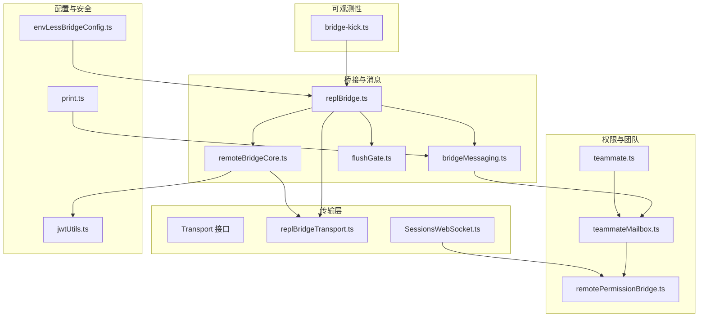
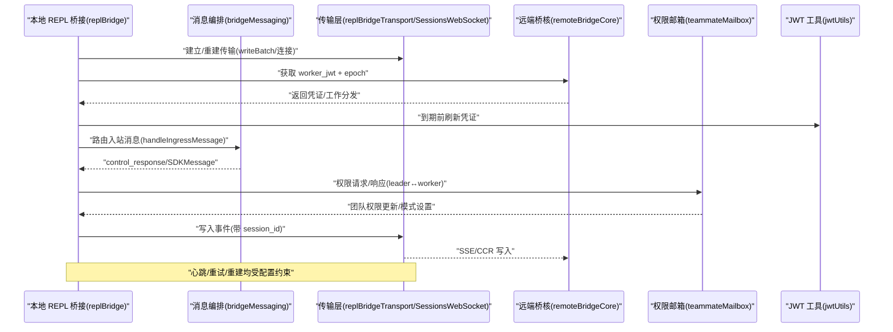
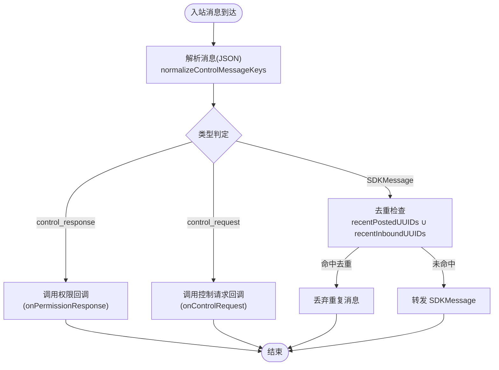
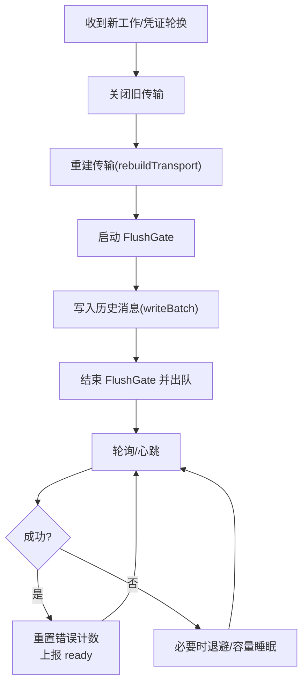
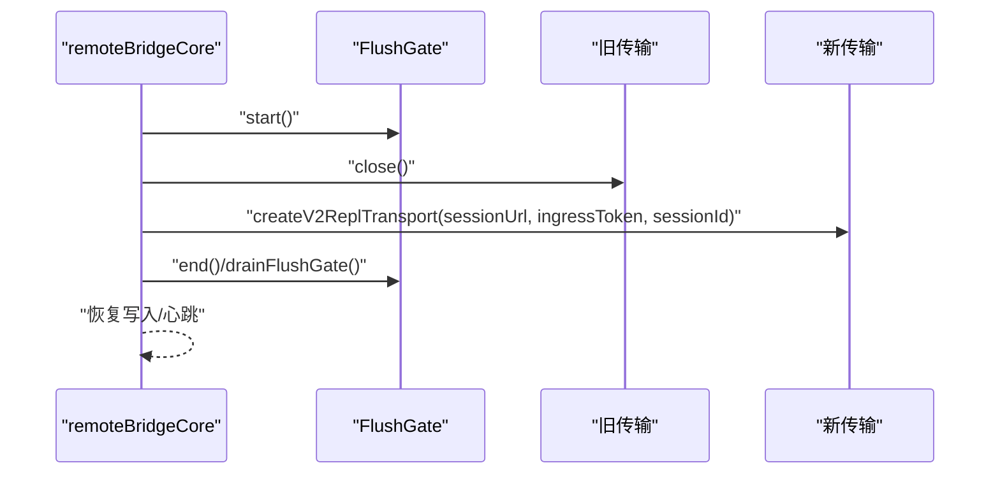
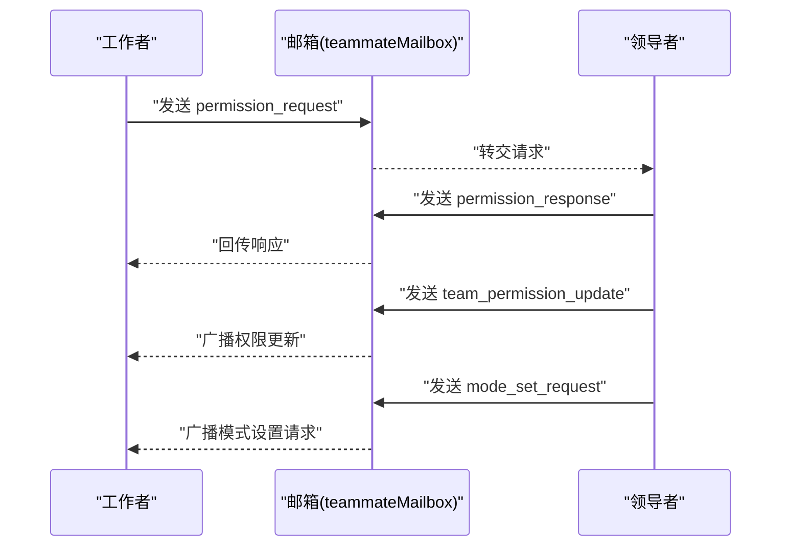
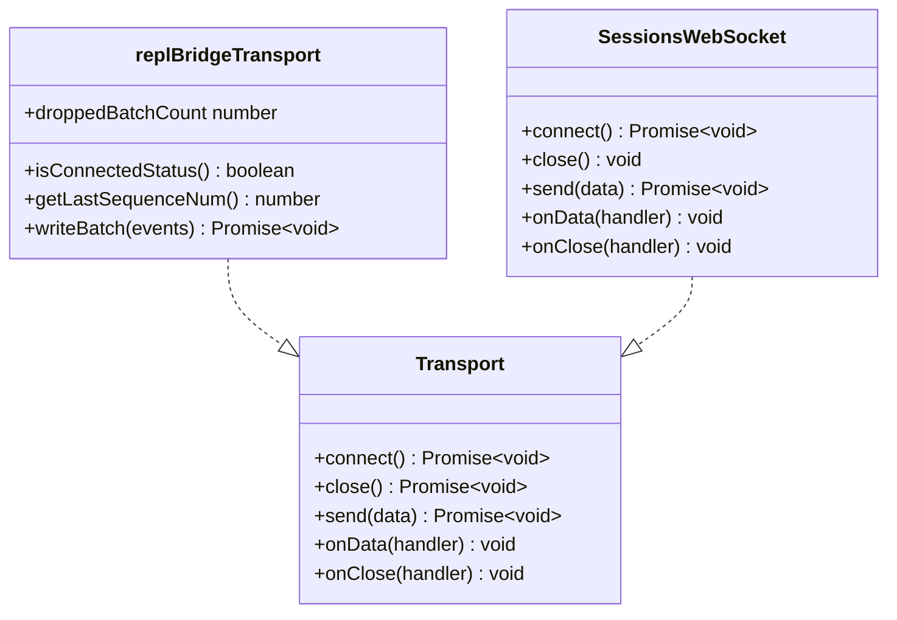
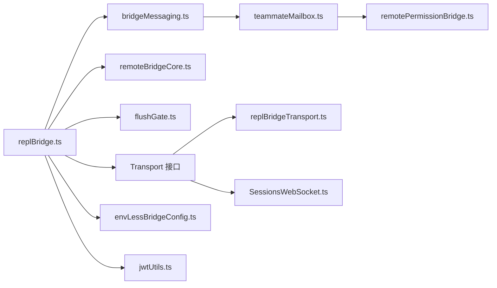

# 通信协议与同步

<cite>
**本文引用的文件**
- [docs/06-bridge.md](file://docs/06-bridge.md)
- [src/bridge/bridgeMessaging.ts](file://src/bridge/bridgeMessaging.ts)
- [src/bridge/replBridge.ts](file://src/bridge/replBridge.ts)
- [src/bridge/remoteBridgeCore.ts](file://src/bridge/remoteBridgeCore.ts)
- [src/bridge/flushGate.ts](file://src/bridge/flushGate.ts)
- [src/bridge/envLessBridgeConfig.ts](file://src/bridge/envLessBridgeConfig.ts)
- [src/bridge/replBridgeTransport.ts](file://src/bridge/replBridgeTransport.ts)
- [src/bridge/jwtUtils.ts](file://src/bridge/jwtUtils.ts)
- [src/bridge/peerSessions.ts](file://src/bridge/peerSessions.ts)
- [src/utils/teammateMailbox.ts](file://src/utils/teammateMailbox.ts)
- [src/utils/teammate.ts](file://src/utils/teammate.ts)
- [src/remote/remotePermissionBridge.ts](file://src/remote/remotePermissionBridge.ts)
- [src/remote/SessionsWebSocket.ts](file://src/remote/SessionsWebSocket.ts)
- [src/remote/sdkMessageAdapter.ts](file://src/remote/sdkMessageAdapter.ts)
- [src/commands/bridge-kick.ts](file://src/commands/bridge-kick.ts)
- [src/cli/transports/Transport.ts](file://src/cli/transports/Transport.ts)
- [src/cli/print.ts](file://src/cli/print.ts)
</cite>

## 目录
1. 引言
2. 项目结构
3. 核心组件
4. 架构总览
5. 详细组件分析
6. 依赖关系分析
7. 性能考量
8. 故障排查指南
9. 结论
10. 附录

## 引言
本文件系统性阐述团队模式下的通信协议与同步机制，覆盖消息格式、传输机制、协议版本管理、权限同步与状态同步策略、数据一致性保障、领导者权限桥接、重连与故障恢复、安全与加密、网络分区处理、消息去重与顺序保证、性能优化与监控指标等主题。内容基于仓库中的桥接与远程通信相关源码与文档进行归纳总结。

## 项目结构
围绕“通信协议与同步”的核心代码主要分布在以下模块：
- 协议与消息编排：bridgeMessaging.ts、replBridge.ts、remoteBridgeCore.ts
- 传输抽象与实现：Transport 接口、replBridgeTransport.ts、SessionsWebSocket.ts
- 权限与团队同步：teammateMailbox.ts、remotePermissionBridge.ts、teammate.ts
- 配置与重试：envLessBridgeConfig.ts、flushGate.ts
- 安全与认证：jwtUtils.ts、print.ts（OAuth 控制响应）
- 可观测性与调试：bridge-kick.ts

图表来源
- [src/bridge/replBridge.ts](file://src/bridge/replBridge.ts)
- [src/bridge/bridgeMessaging.ts](file://src/bridge/bridgeMessaging.ts)
- [src/bridge/remoteBridgeCore.ts](file://src/bridge/remoteBridgeCore.ts)
- [src/bridge/flushGate.ts](file://src/bridge/flushGate.ts)
- [src/bridge/replBridgeTransport.ts](file://src/bridge/replBridgeTransport.ts)
- [src/remote/SessionsWebSocket.ts](file://src/remote/SessionsWebSocket.ts)
- [src/utils/teammateMailbox.ts](file://src/utils/teammateMailbox.ts)
- [src/remote/remotePermissionBridge.ts](file://src/remote/remotePermissionBridge.ts)
- [src/utils/teammate.ts](file://src/utils/teammate.ts)
- [src/bridge/envLessBridgeConfig.ts](file://src/bridge/envLessBridgeConfig.ts)
- [src/bridge/jwtUtils.ts](file://src/bridge/jwtUtils.ts)
- [src/cli/print.ts](file://src/cli/print.ts)
- [src/commands/bridge-kick.ts](file://src/commands/bridge-kick.ts)

章节来源
- [docs/06-bridge.md:69-113](file://docs/06-bridge.md#L69-L113)
- [src/bridge/replBridge.ts:150-2104](file://src/bridge/replBridge.ts#L150-L2104)
- [src/bridge/bridgeMessaging.ts:124-148](file://src/bridge/bridgeMessaging.ts#L124-L148)

## 核心组件
- 协议版本与传输
  - v1（环境层方案）：HybridTransport（WebSocket 读 + HTTP POST 写），API 路径为 /v1/environments/bridge 与轮询端点。
  - v2（无环境层方案）：SSETransport（读）+ CCRClient（写到 CCR v2 端点），由门控开关 tengu_bridge_repl_v2 控制。
- 消息处理与去重
  - 入站消息类型：control_response、control_request、SDKMessage；支持回声去重与重投递去重。
- 传输与心跳
  - 心跳间隔与抖动、HTTP 超时、重试参数等在配置中严格限定范围，避免抖动与越界。
- 权限同步与团队模式
  - 领导者通过邮箱（mailbox）向成员广播权限更新与模式设置请求；工作者向领导者发起权限请求。
- 重连与恢复
  - 多级重连策略：轮询失败、401 认证失败、传输替换、环境重建等场景均有明确处理路径。
- 安全与认证
  - 使用 JWT 令牌与到期前刷新；OAuth 流程通过控制响应返回授权 URL 或标记无需用户操作。

章节来源
- [docs/06-bridge.md:69-113](file://docs/06-bridge.md#L69-L113)
- [src/bridge/bridgeMessaging.ts:124-148](file://src/bridge/bridgeMessaging.ts#L124-L148)
- [src/bridge/envLessBridgeConfig.ts:60-84](file://src/bridge/envLessBridgeConfig.ts#L60-L84)
- [src/utils/teammateMailbox.ts:485-1029](file://src/utils/teammateMailbox.ts#L485-L1029)
- [src/bridge/jwtUtils.ts](file://src/bridge/jwtUtils.ts)
- [src/cli/print.ts:3333-3373](file://src/cli/print.ts#L3333-L3373)

## 架构总览
下图展示从本地 REPL 桥接到远端 CCR 的整体交互流程，包括消息路由、权限桥接、传输重建与重连策略。

图表来源
- [src/bridge/replBridge.ts](file://src/bridge/replBridge.ts)
- [src/bridge/bridgeMessaging.ts](file://src/bridge/bridgeMessaging.ts)
- [src/bridge/remoteBridgeCore.ts](file://src/bridge/remoteBridgeCore.ts)
- [src/bridge/replBridgeTransport.ts](file://src/bridge/replBridgeTransport.ts)
- [src/remote/SessionsWebSocket.ts](file://src/remote/SessionsWebSocket.ts)
- [src/utils/teammateMailbox.ts](file://src/utils/teammateMailbox.ts)
- [src/bridge/jwtUtils.ts](file://src/bridge/jwtUtils.ts)

## 详细组件分析

### 组件A：消息编排与去重（bridgeMessaging）
- 功能要点
  - 解析入站消息，区分 control_response、control_request、SDKMessage。
  - 回声去重：基于最近已发 UUID 集合过滤自身消息。
  - 重投递去重：基于最近入站 UUID 集合过滤重复消息。
- 关键流程
  - 入站解析与类型判定。
  - 权限回调与中断请求处理。
  - 将 SDKMessage 上游转发给业务处理器。

图表来源
- [src/bridge/bridgeMessaging.ts:124-148](file://src/bridge/bridgeMessaging.ts#L124-L148)
- [src/bridge/bridgeMessaging.ts:328-371](file://src/bridge/bridgeMessaging.ts#L328-L371)

章节来源
- [src/bridge/bridgeMessaging.ts:124-148](file://src/bridge/bridgeMessaging.ts#L124-L148)
- [src/bridge/bridgeMessaging.ts:328-371](file://src/bridge/bridgeMessaging.ts#L328-L371)

### 组件B：REPL 桥接主循环与重连（replBridge）
- 功能要点
  - 心跳轮询与错误计数，成功后重置错误状态。
  - 传输替换与重建：工作重新分发或凭证轮换时关闭旧传输并重建。
  - 初始历史消息刷写与队列门控（FlushGate），确保历史与新消息有序。
  - 清理与降级：传输关闭、永久关闭、会话结束等分支处理。
- 关键流程
  - 成功轮询后重置错误计数并上报 ready。
  - 传输替换时启动 FlushGate，防止写入时序错乱。
  - 初始刷写期间记录已刷 UUID，避免重复发送。

图表来源
- [src/bridge/replBridge.ts:1952-1969](file://src/bridge/replBridge.ts#L1952-L1969)
- [src/bridge/replBridge.ts:1077-1299](file://src/bridge/replBridge.ts#L1077-L1299)
- [src/bridge/remoteBridgeCore.ts:468-493](file://src/bridge/remoteBridgeCore.ts#L468-L493)
- [src/bridge/flushGate.ts](file://src/bridge/flushGate.ts)

章节来源
- [src/bridge/replBridge.ts:1952-1969](file://src/bridge/replBridge.ts#L1952-L1969)
- [src/bridge/replBridge.ts:1077-1299](file://src/bridge/replBridge.ts#L1077-L1299)
- [src/bridge/remoteBridgeCore.ts:468-493](file://src/bridge/remoteBridgeCore.ts#L468-L493)
- [src/bridge/flushGate.ts](file://src/bridge/flushGate.ts)

### 组件C：远程桥核与传输重建（remoteBridgeCore）
- 功能要点
  - 在凭证刷新或传输重建时，必须以新 epoch 重建传输，防止 409 冲突。
  - 写入期间通过 FlushGate 阻塞，避免旧传输 epoch 导致写入失败。
- 关键流程
  - 设置重建原因、启动 FlushGate、关闭旧传输、创建新传输、恢复写入。

图表来源
- [src/bridge/remoteBridgeCore.ts:468-493](file://src/bridge/remoteBridgeCore.ts#L468-L493)
- [src/bridge/flushGate.ts](file://src/bridge/flushGate.ts)

章节来源
- [src/bridge/remoteBridgeCore.ts:468-493](file://src/bridge/remoteBridgeCore.ts#L468-L493)
- [src/bridge/flushGate.ts](file://src/bridge/flushGate.ts)

### 组件D：权限桥接与团队同步（teammateMailbox、remotePermissionBridge）
- 功能要点
  - 领导者与工作者之间的权限请求/响应消息模型。
  - 团队权限更新广播与模式设置请求。
  - 领导者对工作者的权限决策通过邮箱传递。
- 关键流程
  - 工作者构造权限请求消息并发送至领导者。
  - 领导者生成响应消息并回传；或广播团队权限更新。
  - 领导者可下发模式设置请求（如权限模式变更）。

图表来源
- [src/utils/teammateMailbox.ts:485-1029](file://src/utils/teammateMailbox.ts#L485-L1029)
- [src/remote/remotePermissionBridge.ts](file://src/remote/remotePermissionBridge.ts)
- [src/utils/teammate.ts](file://src/utils/teammate.ts)

章节来源
- [src/utils/teammateMailbox.ts:485-1029](file://src/utils/teammateMailbox.ts#L485-L1029)
- [src/remote/remotePermissionBridge.ts](file://src/remote/remotePermissionBridge.ts)
- [src/utils/teammate.ts](file://src/utils/teammate.ts)

### 组件E：传输抽象与实现（Transport 接口、replBridgeTransport、SessionsWebSocket）
- 功能要点
  - Transport 接口定义连接、关闭、发送、数据回调、关闭回调。
  - REPL 传输与远程会话 WebSocket 分别承载不同阶段的读写。
- 关键流程
  - 通过接口统一抽象，便于替换与测试。
  - v2 使用 SSE 读取与 CCRClient 写入，减少中间层开销。

图表来源
- [src/cli/transports/Transport.ts](file://src/cli/transports/Transport.ts)
- [src/bridge/replBridgeTransport.ts](file://src/bridge/replBridgeTransport.ts)
- [src/remote/SessionsWebSocket.ts](file://src/remote/SessionsWebSocket.ts)

章节来源
- [src/cli/transports/Transport.ts:1-7](file://src/cli/transports/Transport.ts#L1-L7)
- [src/bridge/replBridgeTransport.ts](file://src/bridge/replBridgeTransport.ts)
- [src/remote/SessionsWebSocket.ts](file://src/remote/SessionsWebSocket.ts)

### 组件F：协议版本管理与配置（docs/06-bridge.md、envLessBridgeConfig）
- 功能要点
  - v1 与 v2 两代协议并存，v2 通过门控开启。
  - 配置项涵盖初始化重试次数与延迟、抖动、HTTP 超时、心跳间隔与抖动、去重缓冲大小等。
- 关键流程
  - 依据门控与能力选择协议版本。
  - 所有时间参数设定上下界，防止抖动与越界。

章节来源
- [docs/06-bridge.md:69-113](file://docs/06-bridge.md#L69-L113)
- [src/bridge/envLessBridgeConfig.ts:60-84](file://src/bridge/envLessBridgeConfig.ts#L60-L84)

### 组件G：安全与认证（jwtUtils、OAuth 控制响应）
- 功能要点
  - 使用 JWT 作为传输与心跳认证载体，并在到期前主动刷新。
  - OAuth 授权流程通过控制响应返回授权 URL 或标记无需用户操作。
- 关键流程
  - 刷新逻辑在重建传输前执行，确保凭证新鲜度。
  - OAuth 流程异步完成，回调提交后通过控制响应告知调用方。

章节来源
- [src/bridge/jwtUtils.ts](file://src/bridge/jwtUtils.ts)
- [src/cli/print.ts:3333-3373](file://src/cli/print.ts#L3333-L3373)

## 依赖关系分析
- 组件耦合
  - replBridge 依赖 bridgeMessaging 进行消息路由，依赖 remoteBridgeCore 进行传输重建，依赖 flushGate 保证初始刷写顺序。
  - bridgeMessaging 与 teammateMailbox 协作实现权限桥接。
  - 传输层通过 Transport 抽象解耦具体实现。
- 外部依赖
  - 门控开关 tengu_bridge_repl_v2 控制 v2 协议启用。
  - GrowthBook 配置用于心跳轮询间隔与初始历史上限等动态调整。

图表来源
- [src/bridge/replBridge.ts](file://src/bridge/replBridge.ts)
- [src/bridge/bridgeMessaging.ts](file://src/bridge/bridgeMessaging.ts)
- [src/bridge/remoteBridgeCore.ts](file://src/bridge/remoteBridgeCore.ts)
- [src/bridge/flushGate.ts](file://src/bridge/flushGate.ts)
- [src/utils/teammateMailbox.ts](file://src/utils/teammateMailbox.ts)
- [src/remote/remotePermissionBridge.ts](file://src/remote/remotePermissionBridge.ts)
- [src/cli/transports/Transport.ts](file://src/cli/transports/Transport.ts)
- [src/bridge/replBridgeTransport.ts](file://src/bridge/replBridgeTransport.ts)
- [src/remote/SessionsWebSocket.ts](file://src/remote/SessionsWebSocket.ts)
- [src/bridge/envLessBridgeConfig.ts](file://src/bridge/envLessBridgeConfig.ts)
- [src/bridge/jwtUtils.ts](file://src/bridge/jwtUtils.ts)

## 性能考量
- 传输与心跳
  - 心跳间隔与抖动参数限制在合理区间，避免频繁轮询与抖动。
  - SSE 读取 + CCRClient 写入减少中间层，降低延迟。
- 历史刷写与顺序
  - 初始历史消息通过单次批量写入并配合 FlushGate，避免与新消息交错。
- 去重与幂等
  - 回声去重与重投递去重结合，减少重复处理与网络冗余。
- 重试与退避
  - 成功轮询后重置错误计数，失败时采用指数/固定退避，避免雪崩。

章节来源
- [src/bridge/envLessBridgeConfig.ts:60-84](file://src/bridge/envLessBridgeConfig.ts#L60-L84)
- [src/bridge/replBridge.ts:1952-1969](file://src/bridge/replBridge.ts#L1952-L1969)
- [src/bridge/flushGate.ts](file://src/bridge/flushGate.ts)
- [src/bridge/bridgeMessaging.ts:124-148](file://src/bridge/bridgeMessaging.ts#L124-L148)

## 故障排查指南
- 常见故障注入命令
  - 支持注入注册失败、轮询 404、心跳 401/404 等场景，验证重连与降级路径。
- 观测与日志
  - 重连成功后重置错误计数并上报 ready，便于定位恢复时机。
  - 传输替换时记录丢弃批次数量，辅助判断上游稳定性。
- 恢复策略
  - 401 认证失败触发凭证刷新与传输重建。
  - 会话结束（clean close）触发桥接 teardown，避免残留状态。

章节来源
- [src/commands/bridge-kick.ts:24-200](file://src/commands/bridge-kick.ts#L24-L200)
- [src/bridge/replBridge.ts:1952-1969](file://src/bridge/replBridge.ts#L1952-L1969)
- [src/bridge/replBridge.ts:1077-1299](file://src/bridge/replBridge.ts#L1077-L1299)

## 结论
该通信体系在团队模式下通过 v1/v2 双协议并存、严格的传输与心跳配置、完善的去重与顺序保障、以及基于邮箱的权限桥接，实现了高可用、可恢复且具备良好一致性的跨节点通信。配合可观测性工具与故障注入，能够快速定位问题并验证恢复路径。

## 附录
- 术语
  - 回声去重：过滤自身发出的消息 UUID。
  - 重投递去重：过滤服务器重放导致的重复入站消息。
  - FlushGate：初始刷写期间的写入门控，确保历史与新消息有序。
- 最佳实践
  - 启用 v2 协议（在门控允许时）以获得更低延迟与更少中间层。
  - 严格遵守心跳与超时配置，避免抖动与越界。
  - 在权限桥接中优先使用邮箱广播，减少点对点复杂度。
  - 对关键路径增加可观测性埋点，结合故障注入演练恢复流程。