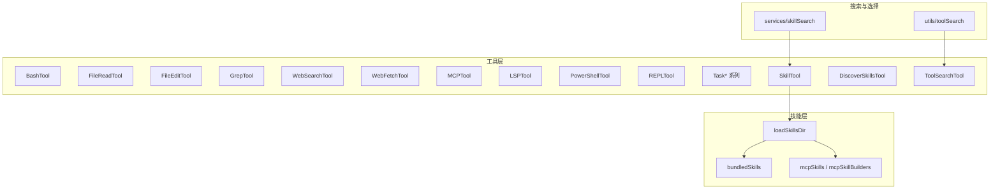
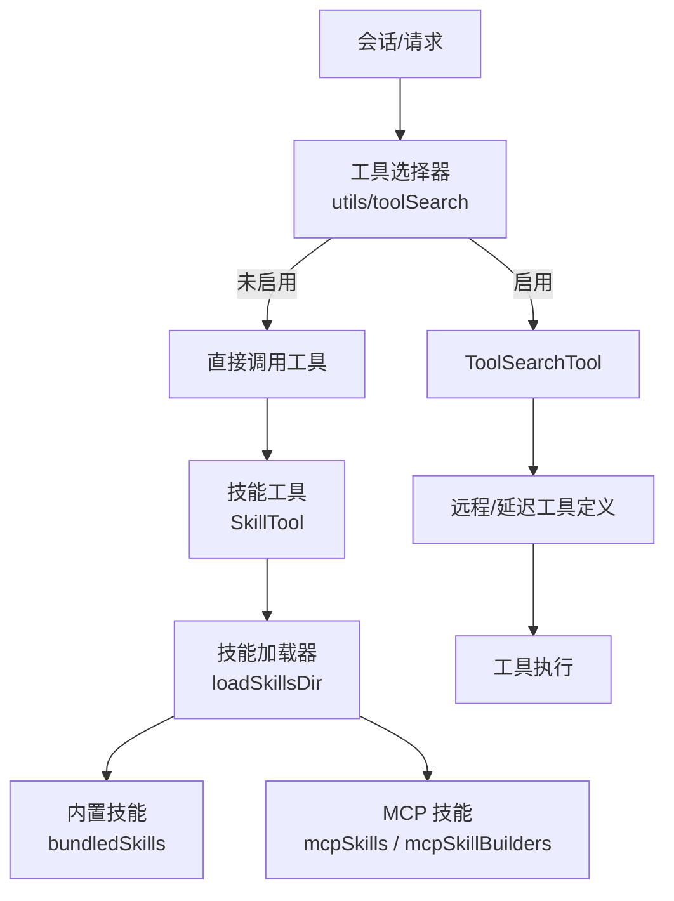
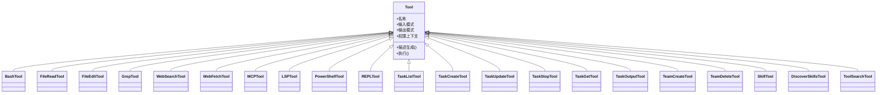
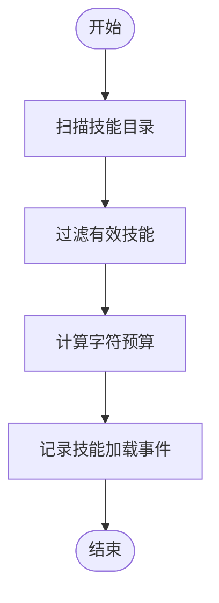
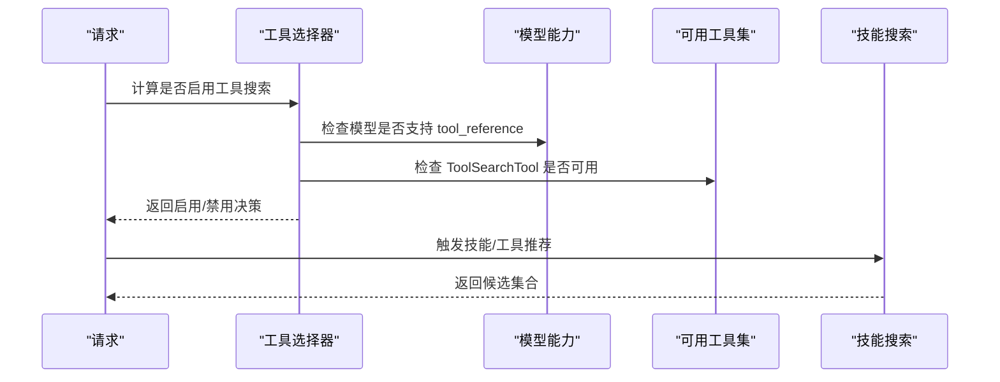
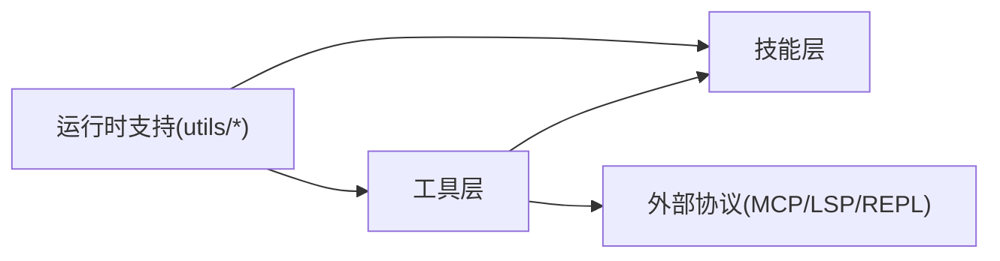

# 工具与技能系统

<cite>
**本文引用的文件**
- [src/tools.ts](file://src/tools.ts)
- [src/Tool.ts](file://src/Tool.ts)
- [src/tools/BashTool/index.ts](file://src/tools/BashTool/index.ts)
- [src/tools/FileReadTool/index.ts](file://src/tools/FileReadTool/index.ts)
- [src/tools/FileEditTool/index.ts](file://src/tools/FileEditTool/index.ts)
- [src/tools/GrepTool/index.ts](file://src/tools/GrepTool/index.ts)
- [src/tools/WebSearchTool/index.ts](file://src/tools/WebSearchTool/index.ts)
- [src/tools/WebFetchTool/index.ts](file://src/tools/WebFetchTool/index.ts)
- [src/tools/MCPTool/index.ts](file://src/tools/MCPTool/index.ts)
- [src/tools/LSPTool/index.ts](file://src/tools/LSPTool/index.ts)
- [src/tools/PowerShellTool/index.ts](file://src/tools/PowerShellTool/index.ts)
- [src/tools/REPLTool/index.ts](file://src/tools/REPLTool/index.ts)
- [src/tools/TaskListTool/index.ts](file://src/tools/TaskListTool/index.ts)
- [src/tools/TaskCreateTool/index.ts](file://src/tools/TaskCreateTool/index.ts)
- [src/tools/TaskUpdateTool/index.ts](file://src/tools/TaskUpdateTool/index.ts)
- [src/tools/TaskStopTool/index.ts](file://src/tools/TaskStopTool/index.ts)
- [src/tools/TaskGetTool/index.ts](file://src/tools/TaskGetTool/index.ts)
- [src/tools/TaskOutputTool/index.ts](file://src/tools/TaskOutputTool/index.ts)
- [src/tools/TeamCreateTool/index.ts](file://src/tools/TeamCreateTool/index.ts)
- [src/tools/TeamDeleteTool/index.ts](file://src/tools/TeamDeleteTool/index.ts)
- [src/tools/SkillTool/index.ts](file://src/tools/SkillTool/index.ts)
- [src/tools/DiscoverSkillsTool/index.ts](file://src/tools/DiscoverSkillsTool/index.ts)
- [src/tools/ToolSearchTool/index.ts](file://src/tools/ToolSearchTool/index.ts)
- [src/tools/shared/index.ts](file://src/tools/shared/index.ts)
- [src/skills/bundledSkills.ts](file://src/skills/bundledSkills.ts)
- [src/skills/loadSkillsDir.ts](file://src/skills/loadSkillsDir.ts)
- [src/skills/mcpSkills.ts](file://src/skills/mcpSkills.ts)
- [src/skills/mcpSkillBuilders.ts](file://src/skills/mcpSkillBuilders.ts)
- [src/services/skillSearch/index.ts](file://src/services/skillSearch/index.ts)
- [src/utils/toolSearch.ts](file://src/utils/toolSearch.ts)
- [src/utils/timeouts.ts](file://src/utils/timeouts.ts)
- [src/utils/windowsPaths.ts](file://src/utils/windowsPaths.ts)
- [src/utils/which.ts](file://src/utils/which.ts)
- [src/utils/telemetry/skillLoadedEvent.ts](file://src/utils/telemetry/skillLoadedEvent.ts)
- [src/constants/tools.ts](file://src/constants/tools.ts)
- [src/constants/system.ts](file://src/constants/system.ts)
- [src/hooks/useMergedTools.ts](file://src/hooks/useMergedTools.ts)
- [src/hooks/useSkillsChange.ts](file://src/hooks/useSkillsChange.ts)
- [src/entrypoints/sdk/index.ts](file://src/entrypoints/sdk/index.ts)
- [package.json](file://package.json)
</cite>

## 目录
1. [简介](#简介)
2. [项目结构](#项目结构)
3. [核心组件](#核心组件)
4. [架构总览](#架构总览)
5. [详细组件分析](#详细组件分析)
6. [依赖关系分析](#依赖关系分析)
7. [性能考量](#性能考量)
8. [故障排查指南](#故障排查指南)
9. [结论](#结论)
10. [附录](#附录)

## 简介
本文件系统性阐述 Claude Code 的“工具与技能”体系：技能的分类与组织、工具的执行机制、内置工具的能力与用法、扩展与集成方式、以及技能搜索与推荐的工作原理。目标是帮助开发者与使用者快速理解并高效利用该系统。

## 项目结构
- 工具层（src/tools）：内置工具实现与共享逻辑，覆盖文件系统、终端、网络、任务与团队协作、MCP 集成、LSP、REPL、技能调用等。
- 技能层（src/skills）：技能的打包、加载、MCP 技能构建与发现。
- 搜索与工具选择（src/utils/toolSearch.ts、src/services/skillSearch）：控制是否启用“工具搜索”（MCP 延迟定义）、模型兼容性、阈值与可用性检查。
- 运行时支持（src/utils/timeouts.ts、src/utils/windowsPaths.ts、src/utils/which.ts）：超时、平台路径与命令查找等基础设施。
- 钩子与入口（src/hooks、src/entrypoints/sdk）：工具与技能的合并、变更监听与 SDK 入口。

图表来源
- [src/tools.ts](file://src/tools.ts)
- [src/tools/BashTool/index.ts](file://src/tools/BashTool/index.ts)
- [src/tools/FileReadTool/index.ts](file://src/tools/FileReadTool/index.ts)
- [src/tools/FileEditTool/index.ts](file://src/tools/FileEditTool/index.ts)
- [src/tools/GrepTool/index.ts](file://src/tools/GrepTool/index.ts)
- [src/tools/WebSearchTool/index.ts](file://src/tools/WebSearchTool/index.ts)
- [src/tools/WebFetchTool/index.ts](file://src/tools/WebFetchTool/index.ts)
- [src/tools/MCPTool/index.ts](file://src/tools/MCPTool/index.ts)
- [src/tools/LSPTool/index.ts](file://src/tools/LSPTool/index.ts)
- [src/tools/PowerShellTool/index.ts](file://src/tools/PowerShellTool/index.ts)
- [src/tools/REPLTool/index.ts](file://src/tools/REPLTool/index.ts)
- [src/tools/TaskListTool/index.ts](file://src/tools/TaskListTool/index.ts)
- [src/tools/TaskCreateTool/index.ts](file://src/tools/TaskCreateTool/index.ts)
- [src/tools/TaskUpdateTool/index.ts](file://src/tools/TaskUpdateTool/index.ts)
- [src/tools/TaskStopTool/index.ts](file://src/tools/TaskStopTool/index.ts)
- [src/tools/TaskGetTool/index.ts](file://src/tools/TaskGetTool/index.ts)
- [src/tools/TaskOutputTool/index.ts](file://src/tools/TaskOutputTool/index.ts)
- [src/tools/SkillTool/index.ts](file://src/tools/SkillTool/index.ts)
- [src/tools/DiscoverSkillsTool/index.ts](file://src/tools/DiscoverSkillsTool/index.ts)
- [src/tools/ToolSearchTool/index.ts](file://src/tools/ToolSearchTool/index.ts)
- [src/skills/loadSkillsDir.ts](file://src/skills/loadSkillsDir.ts)
- [src/skills/bundledSkills.ts](file://src/skills/bundledSkills.ts)
- [src/skills/mcpSkills.ts](file://src/skills/mcpSkills.ts)
- [src/skills/mcpSkillBuilders.ts](file://src/skills/mcpSkillBuilders.ts)
- [src/utils/toolSearch.ts](file://src/utils/toolSearch.ts)
- [src/services/skillSearch/index.ts](file://src/services/skillSearch/index.ts)

章节来源
- [src/tools.ts](file://src/tools.ts)
- [src/skills/loadSkillsDir.ts](file://src/skills/loadSkillsDir.ts)
- [src/utils/toolSearch.ts](file://src/utils/toolSearch.ts)

## 核心组件
- 工具抽象与注册
  - 工具基类与接口定义位于工具根目录，统一规范输入/输出模式、权限上下文、描述生成与执行流程。
  - 工具注册通过集中导出模块完成，便于在运行时按需启用或禁用。
- 技能系统
  - 技能以可发现的目录结构加载，支持内置打包与外部 MCP 提供的技能。
  - 技能加载时进行预算计算与事件上报，便于会话级统计与优化。
- 工具搜索与延迟定义
  - 通过环境变量与特性开关控制是否启用“工具搜索”，并在请求前做模型兼容性与阈值检查，避免对不支持的模型造成错误。

章节来源
- [src/Tool.ts](file://src/Tool.ts)
- [src/tools.ts](file://src/tools.ts)
- [src/skills/bundledSkills.ts](file://src/skills/bundledSkills.ts)
- [src/skills/loadSkillsDir.ts](file://src/skills/loadSkillsDir.ts)
- [src/utils/toolSearch.ts](file://src/utils/toolSearch.ts)
- [src/utils/telemetry/skillLoadedEvent.ts](file://src/utils/telemetry/skillLoadedEvent.ts)

## 架构总览
工具与技能系统围绕“工具即能力”的理念设计，工具负责具体动作，技能负责更高层的组合与编排。系统通过以下机制协同工作：
- 工具层：提供原子能力（读写文件、执行命令、网络检索、任务管理、MCP/LSP/REPL 集成等）。
- 技能层：封装常用工作流，支持本地加载与远程 MCP 技能发现。
- 搜索与选择：根据模型能力、可用工具数量与阈值动态决定是否采用“工具搜索”（延迟定义）。
- 运行时支持：超时、平台路径与命令查找等基础设施保障跨平台一致性。

图表来源
- [src/utils/toolSearch.ts](file://src/utils/toolSearch.ts)
- [src/tools/ToolSearchTool/index.ts](file://src/tools/ToolSearchTool/index.ts)
- [src/tools/SkillTool/index.ts](file://src/tools/SkillTool/index.ts)
- [src/skills/loadSkillsDir.ts](file://src/skills/loadSkillsDir.ts)
- [src/skills/bundledSkills.ts](file://src/skills/bundledSkills.ts)
- [src/skills/mcpSkills.ts](file://src/skills/mcpSkills.ts)
- [src/skills/mcpSkillBuilders.ts](file://src/skills/mcpSkillBuilders.ts)

## 详细组件分析

### 工具抽象与执行机制
- 统一接口
  - 工具具备一致的输入/输出模式、权限上下文注入、描述生成与 JSON Schema 定义，便于在不同场景下复用与组合。
- 执行流程
  - 请求进入后，系统先进行工具选择与权限校验，再执行工具并返回结果；失败时提供可追踪的错误信息。
- 共享工具
  - 工具间通用逻辑集中在共享模块，减少重复实现，提升一致性。

图表来源
- [src/Tool.ts](file://src/Tool.ts)
- [src/tools.ts](file://src/tools.ts)
- [src/tools/BashTool/index.ts](file://src/tools/BashTool/index.ts)
- [src/tools/FileReadTool/index.ts](file://src/tools/FileReadTool/index.ts)
- [src/tools/FileEditTool/index.ts](file://src/tools/FileEditTool/index.ts)
- [src/tools/GrepTool/index.ts](file://src/tools/GrepTool/index.ts)
- [src/tools/WebSearchTool/index.ts](file://src/tools/WebSearchTool/index.ts)
- [src/tools/WebFetchTool/index.ts](file://src/tools/WebFetchTool/index.ts)
- [src/tools/MCPTool/index.ts](file://src/tools/MCPTool/index.ts)
- [src/tools/LSPTool/index.ts](file://src/tools/LSPTool/index.ts)
- [src/tools/PowerShellTool/index.ts](file://src/tools/PowerShellTool/index.ts)
- [src/tools/REPLTool/index.ts](file://src/tools/REPLTool/index.ts)
- [src/tools/TaskListTool/index.ts](file://src/tools/TaskListTool/index.ts)
- [src/tools/TaskCreateTool/index.ts](file://src/tools/TaskCreateTool/index.ts)
- [src/tools/TaskUpdateTool/index.ts](file://src/tools/TaskUpdateTool/index.ts)
- [src/tools/TaskStopTool/index.ts](file://src/tools/TaskStopTool/index.ts)
- [src/tools/TaskGetTool/index.ts](file://src/tools/TaskGetTool/index.ts)
- [src/tools/TaskOutputTool/index.ts](file://src/tools/TaskOutputTool/index.ts)
- [src/tools/TeamCreateTool/index.ts](file://src/tools/TeamCreateTool/index.ts)
- [src/tools/TeamDeleteTool/index.ts](file://src/tools/TeamDeleteTool/index.ts)
- [src/tools/SkillTool/index.ts](file://src/tools/SkillTool/index.ts)
- [src/tools/DiscoverSkillsTool/index.ts](file://src/tools/DiscoverSkillsTool/index.ts)
- [src/tools/ToolSearchTool/index.ts](file://src/tools/ToolSearchTool/index.ts)

章节来源
- [src/Tool.ts](file://src/Tool.ts)
- [src/tools.ts](file://src/tools.ts)
- [src/tools/shared/index.ts](file://src/tools/shared/index.ts)

### 技能系统与组织结构
- 技能分类
  - 内置技能：随应用分发，覆盖常见工作流。
  - 外部技能：通过 MCP 加载，支持远程技能发现与动态集成。
- 技能加载
  - 从指定目录扫描并加载技能，结合预算计算与事件上报，确保会话中技能可用性与资源占用可控。
- 技能发现
  - 提供“发现技能”工具，用于在会话中探索可用技能集合。

图表来源
- [src/skills/loadSkillsDir.ts](file://src/skills/loadSkillsDir.ts)
- [src/skills/bundledSkills.ts](file://src/skills/bundledSkills.ts)
- [src/skills/mcpSkills.ts](file://src/skills/mcpSkills.ts)
- [src/skills/mcpSkillBuilders.ts](file://src/skills/mcpSkillBuilders.ts)
- [src/utils/telemetry/skillLoadedEvent.ts](file://src/utils/telemetry/skillLoadedEvent.ts)

章节来源
- [src/skills/loadSkillsDir.ts](file://src/skills/loadSkillsDir.ts)
- [src/skills/bundledSkills.ts](file://src/skills/bundledSkills.ts)
- [src/skills/mcpSkills.ts](file://src/skills/mcpSkills.ts)
- [src/skills/mcpSkillBuilders.ts](file://src/skills/mcpSkillBuilders.ts)
- [src/utils/telemetry/skillLoadedEvent.ts](file://src/utils/telemetry/skillLoadedEvent.ts)

### 工具搜索与推荐
- 启用策略
  - 依据环境变量与特性开关确定模式（标准、TST、TST-Auto），并结合模型兼容性与阈值判断是否启用“工具搜索”。
- 可用性检查
  - 确保“工具搜索”工具本身在可用工具列表中，否则禁用。
- 推荐机制
  - 技能搜索服务基于会话上下文与可用工具，为用户推荐合适的技能与工具组合。

图表来源
- [src/utils/toolSearch.ts](file://src/utils/toolSearch.ts)
- [src/services/skillSearch/index.ts](file://src/services/skillSearch/index.ts)

章节来源
- [src/utils/toolSearch.ts](file://src/utils/toolSearch.ts)
- [src/services/skillSearch/index.ts](file://src/services/skillSearch/index.ts)

### 内置工具详解

#### Bash 工具
- 能力概述
  - 在受控环境中执行命令，支持超时控制、平台路径适配与安全限制。
- 关键点
  - 超时：默认与最大超时可通过环境变量配置。
  - 平台：Windows 下自动设置 Git-Bash 路径，保证一致性。
  - 命令查找：优先使用 Bun.which，否则回退到平台命令。
- 使用建议
  - 对长耗时任务设置合理超时；在 Windows 环境下确保 Git-Bash 可用。

章节来源
- [src/utils/timeouts.ts](file://src/utils/timeouts.ts)
- [src/utils/windowsPaths.ts](file://src/utils/windowsPaths.ts)
- [src/utils/which.ts](file://src/utils/which.ts)
- [src/tools/BashTool/index.ts](file://src/tools/BashTool/index.ts)

#### 文件操作工具
- FileReadTool
  - 读取文件内容，支持缓存与大小限制，避免大文件导致的性能问题。
- FileEditTool
  - 基于差异与补丁机制更新文件，支持撤销与预览，降低误操作风险。
- GrepTool
  - 在文件或目录中检索匹配项，支持正则表达式与多文件聚合展示。

章节来源
- [src/tools/FileReadTool/index.ts](file://src/tools/FileReadTool/index.ts)
- [src/tools/FileEditTool/index.ts](file://src/tools/FileEditTool/index.ts)
- [src/tools/GrepTool/index.ts](file://src/tools/GrepTool/index.ts)

#### 网络工具
- WebSearchTool
  - 提供网页搜索能力，适合信息收集与背景调研。
- WebFetchTool
  - 获取网页内容，支持解析与清洗，便于后续处理。

章节来源
- [src/tools/WebSearchTool/index.ts](file://src/tools/WebSearchTool/index.ts)
- [src/tools/WebFetchTool/index.ts](file://src/tools/WebFetchTool/index.ts)

#### 代理与集成工具
- MCPTool
  - 通过 MCP 协议与外部服务器交互，支持认证与资源读取。
- LSPTool
  - 集成语言服务器协议，提供智能提示、跳转与诊断。
- PowerShellTool
  - 在 Windows 环境下提供 PowerShell 命令执行能力。
- REPLTool
  - 提供交互式 REPL 会话，便于调试与探索。

章节来源
- [src/tools/MCPTool/index.ts](file://src/tools/MCPTool/index.ts)
- [src/tools/LSPTool/index.ts](file://src/tools/LSPTool/index.ts)
- [src/tools/PowerShellTool/index.ts](file://src/tools/PowerShellTool/index.ts)
- [src/tools/REPLTool/index.ts](file://src/tools/REPLTool/index.ts)

#### 任务与团队协作工具
- Task* 系列
  - 支持任务的创建、查询、更新、停止与输出查看，适用于自动化流水线与协作编排。
- TeamCreateTool / TeamDeleteTool
  - 团队的创建与删除，配合权限与角色管理使用。

章节来源
- [src/tools/TaskListTool/index.ts](file://src/tools/TaskListTool/index.ts)
- [src/tools/TaskCreateTool/index.ts](file://src/tools/TaskCreateTool/index.ts)
- [src/tools/TaskUpdateTool/index.ts](file://src/tools/TaskUpdateTool/index.ts)
- [src/tools/TaskStopTool/index.ts](file://src/tools/TaskStopTool/index.ts)
- [src/tools/TaskGetTool/index.ts](file://src/tools/TaskGetTool/index.ts)
- [src/tools/TaskOutputTool/index.ts](file://src/tools/TaskOutputTool/index.ts)
- [src/tools/TeamCreateTool/index.ts](file://src/tools/TeamCreateTool/index.ts)
- [src/tools/TeamDeleteTool/index.ts](file://src/tools/TeamDeleteTool/index.ts)

#### 技能工具与发现
- SkillTool
  - 调用已加载的技能，支持参数传递与结果汇总。
- DiscoverSkillsTool
  - 发现并列举当前可用技能，辅助用户选择合适的工作流。

章节来源
- [src/tools/SkillTool/index.ts](file://src/tools/SkillTool/index.ts)
- [src/tools/DiscoverSkillsTool/index.ts](file://src/tools/DiscoverSkillsTool/index.ts)

### 工具与技能的扩展机制
- 自定义工具
  - 基于工具基类实现新工具，遵循输入/输出与权限上下文规范，通过集中导出模块注册。
- 第三方工具集成
  - 通过 MCPTool 或 LSPTool 将外部服务接入系统，统一权限与日志。
- 技能扩展
  - 将新技能放入技能目录，系统自动加载；也可通过 MCP 动态发现并加载。

章节来源
- [src/Tool.ts](file://src/Tool.ts)
- [src/tools.ts](file://src/tools.ts)
- [src/skills/loadSkillsDir.ts](file://src/skills/loadSkillsDir.ts)
- [src/tools/MCPTool/index.ts](file://src/tools/MCPTool/index.ts)
- [src/tools/LSPTool/index.ts](file://src/tools/LSPTool/index.ts)

## 依赖关系分析
- 工具与技能的耦合
  - 工具层低耦合，技能层通过工具组合实现高内聚工作流。
- 外部依赖
  - MCP、LSP、REPL 等协议作为外部能力入口，系统提供适配层与权限控制。
- 环境与平台
  - 通过超时、路径与命令查找等工具保障跨平台一致性。

图表来源
- [src/tools.ts](file://src/tools.ts)
- [src/skills/loadSkillsDir.ts](file://src/skills/loadSkillsDir.ts)
- [src/utils/timeouts.ts](file://src/utils/timeouts.ts)
- [src/utils/windowsPaths.ts](file://src/utils/windowsPaths.ts)
- [src/utils/which.ts](file://src/utils/which.ts)

章节来源
- [src/tools.ts](file://src/tools.ts)
- [src/skills/loadSkillsDir.ts](file://src/skills/loadSkillsDir.ts)
- [src/utils/timeouts.ts](file://src/utils/timeouts.ts)
- [src/utils/windowsPaths.ts](file://src/utils/windowsPaths.ts)
- [src/utils/which.ts](file://src/utils/which.ts)

## 性能考量
- 工具搜索阈值
  - 通过“工具搜索”机制减少一次性发送给模型的工具描述长度，提高响应速度与成本控制。
- 超时与资源
  - Bash 工具的默认与最大超时可配置，避免长时间阻塞；文件读写工具对大文件有保护措施。
- 平台适配
  - Windows 下自动设置 Git-Bash 路径，减少跨平台差异带来的性能损耗。

章节来源
- [src/utils/toolSearch.ts](file://src/utils/toolSearch.ts)
- [src/utils/timeouts.ts](file://src/utils/timeouts.ts)
- [src/utils/windowsPaths.ts](file://src/utils/windowsPaths.ts)

## 故障排查指南
- 工具不可用
  - 检查工具是否在可用列表中，确认 ToolSearchTool 是否被允许使用。
- 模型不兼容
  - 若模型不支持 tool_reference，工具搜索会被禁用；请调整模型或关闭自动模式。
- 平台相关问题
  - Windows 环境下确认 Git-Bash 路径正确；命令查找失败时检查 PATH 与 Bun.which。
- 技能加载异常
  - 检查技能目录是否存在、权限是否正确；查看技能加载事件日志定位问题。

章节来源
- [src/utils/toolSearch.ts](file://src/utils/toolSearch.ts)
- [src/utils/windowsPaths.ts](file://src/utils/windowsPaths.ts)
- [src/utils/which.ts](file://src/utils/which.ts)
- [src/utils/telemetry/skillLoadedEvent.ts](file://src/utils/telemetry/skillLoadedEvent.ts)

## 结论
该工具与技能系统以“工具即能力、技能即工作流”为核心思想，通过统一的工具抽象、灵活的搜索与选择机制、完善的扩展与集成能力，实现了在多模型、多平台、多协议下的稳定与高效。建议在实际使用中结合会话上下文与资源预算，合理启用工具搜索与技能推荐，以获得更佳的体验与性能。

## 附录
- 配置选项
  - 工具搜索模式：通过环境变量与特性开关控制（标准、TST、TST-Auto）。
  - Bash 超时：BASH_DEFAULT_TIMEOUT_MS、BASH_MAX_TIMEOUT_MS。
  - Windows Git-Bash：CLAUDE_CODE_GIT_BASH_PATH。
- 使用示例
  - 在会话中调用 BashTool 执行命令，或使用 SkillTool 调用已加载技能。
  - 通过 DiscoverSkillsTool 查看可用技能集合。
- 最佳实践
  - 为长耗时任务设置合理超时；在 Windows 环境下确保 Git-Bash 可用；优先使用 MCP/LSP 等协议集成外部能力；定期清理与验证技能目录。

章节来源
- [src/utils/toolSearch.ts](file://src/utils/toolSearch.ts)
- [src/utils/timeouts.ts](file://src/utils/timeouts.ts)
- [src/utils/windowsPaths.ts](file://src/utils/windowsPaths.ts)
- [src/tools/SkillTool/index.ts](file://src/tools/SkillTool/index.ts)
- [src/tools/DiscoverSkillsTool/index.ts](file://src/tools/DiscoverSkillsTool/index.ts)