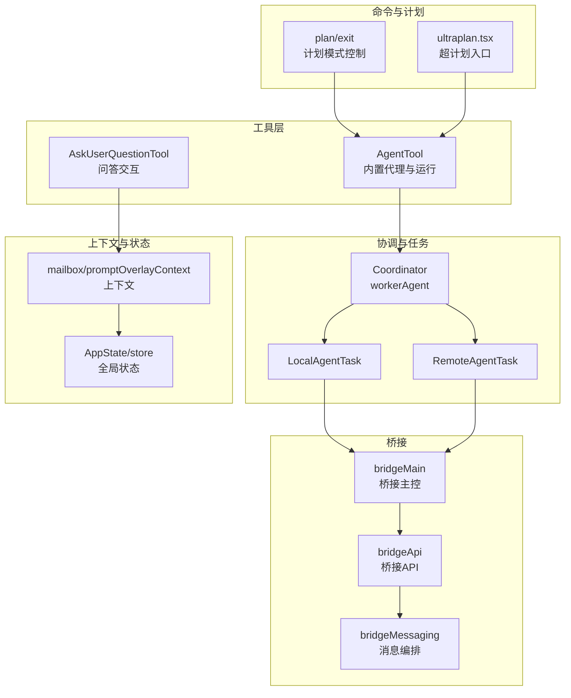
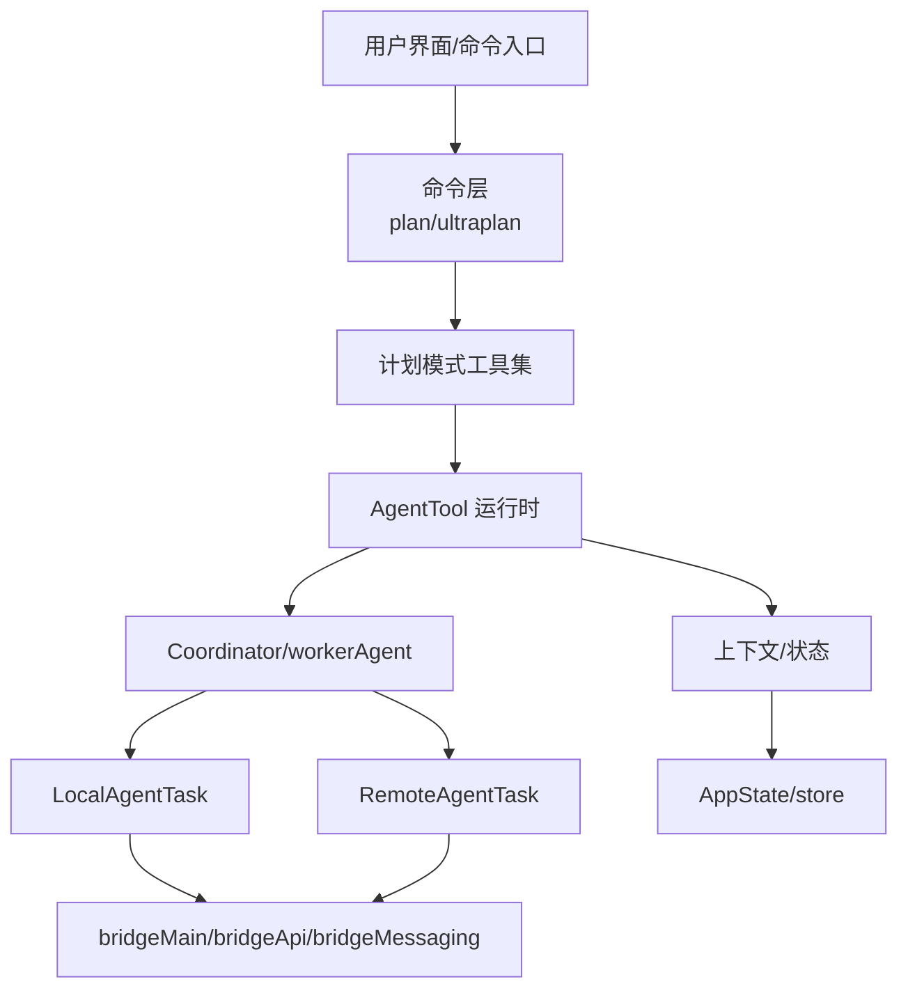
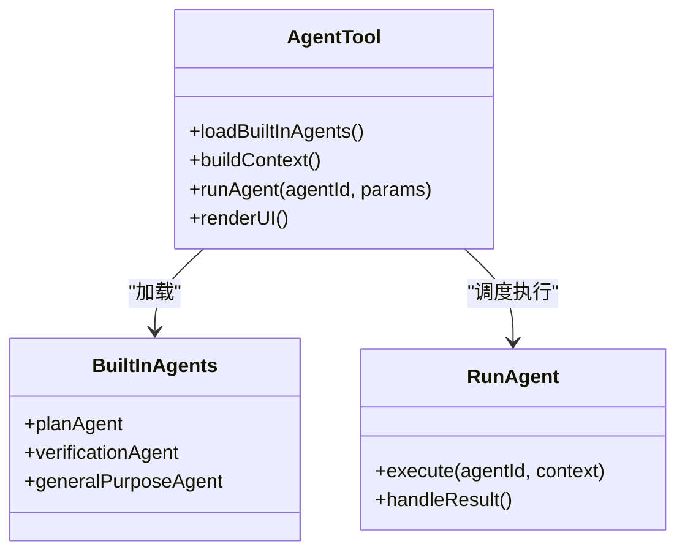
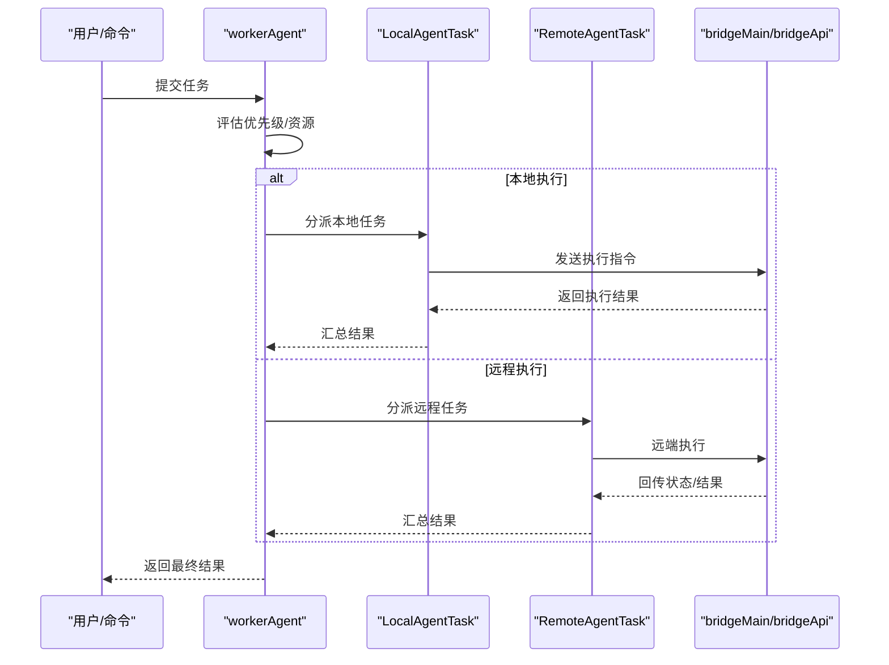
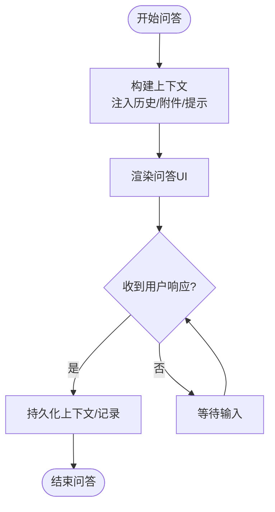
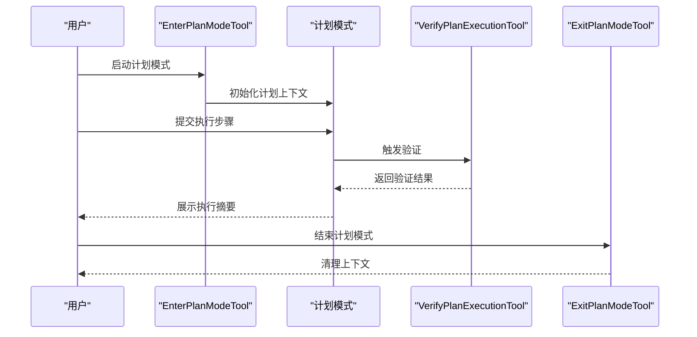
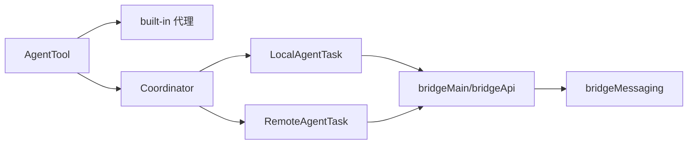

# 代理工具

<cite>
**本文引用的文件**
- [src/tools/AgentTool/AgentTool.tsx](file://src/tools/AgentTool/AgentTool.tsx)
- [src/tools/AgentTool/UI.tsx](file://src/tools/AgentTool/UI.tsx)
- [src/tools/AgentTool/runAgent.ts](file://src/tools/AgentTool/runAgent.ts)
- [src/tools/AgentTool/built-in/planAgent.ts](file://src/tools/AgentTool/built-in/planAgent.ts)
- [src/tools/AgentTool/built-in/verificationAgent.ts](file://src/tools/AgentTool/built-in/verificationAgent.ts)
- [src/tools/AgentTool/built-in/generalPurposeAgent.ts](file://src/tools/AgentTool/built-in/generalPurposeAgent.ts)
- [src/tools/AgentTool/builtInAgents.ts](file://src/tools/AgentTool/builtInAgents.ts)
- [src/tools/AskUserQuestionTool/AskUserQuestionTool.tsx](file://src/tools/AskUserQuestionTool/AskUserQuestionTool.tsx)
- [src/coordinator/workerAgent.ts](file://src/coordinator/workerAgent.ts)
- [src/tasks/LocalAgentTask.ts](file://src/tasks/LocalAgentTask.ts)
- [src/tasks/RemoteAgentTask.ts](file://src/tasks/RemoteAgentTask.ts)
- [src/bridge/bridgeMain.ts](file://src/bridge/bridgeMain.ts)
- [src/bridge/bridgeApi.ts](file://src/bridge/bridgeApi.ts)
- [src/bridge/bridgeMessaging.ts](file://src/bridge/bridgeMessaging.ts)
- [src/bridge/types.ts](file://src/bridge/types.ts)
- [src/commands/ultraplan.tsx](file://src/commands/ultraplan.tsx)
- [src/utils/ultraplan.ts](file://src/utils/ultraplan.ts)
- [src/plans.ts](file://src/plans.ts)
- [src/commands/plan/index.ts](file://src/commands/plan/index.ts)
- [src/commands/plan/exit.ts](file://src/commands/plan/exit.ts)
- [src/tools/VerifyPlanExecutionTool/VerifyPlanExecutionTool.ts](file://src/tools/VerifyPlanExecutionTool/VerifyPlanExecutionTool.ts)
- [src/tools/EnterPlanModeTool/EnterPlanModeTool.ts](file://src/tools/EnterPlanModeTool/EnterPlanModeTool.ts)
- [src/tools/ExitPlanModeTool/ExitPlanModeTool.ts](file://src/tools/ExitPlanModeTool/ExitPlanModeTool.ts)
- [src/entrypoints/sdk/agentSdkTypes.ts](file://src/entrypoints/sdk/agentSdkTypes.ts)
- [src/entrypoints/sdk/index.ts](file://src/entrypoints/sdk/index.ts)
- [src/components/agents/types.ts](file://src/components/agents/types.ts)
- [src/hooks/useTasksV2.ts](file://src/hooks/useTasksV2.ts)
- [src/hooks/useQueueProcessor.ts](file://src/hooks/useQueueProcessor.ts)
- [src/state/AppState.tsx](file://src/state/AppState.tsx)
- [src/state/store.ts](file://src/state/store.ts)
- [src/context/mailbox.tsx](file://src/context/mailbox.tsx)
- [src/context/promptOverlayContext.tsx](file://src/context/promptOverlayContext.tsx)
- [src/context/notifications.tsx](file://src/context/notifications.tsx)
- [src/services/analytics/index.ts](file://src/services/analytics/index.ts)
- [src/utils/telemetry/index.ts](file://src/utils/telemetry/index.ts)
- [src/assistant/sessionDiscovery.ts](file://src/assistant/sessionDiscovery.ts)
- [src/assistant/sessionHistory.ts](file://src/assistant/sessionHistory.ts)
- [src/commands/init.ts](file://src/commands/init.ts)
- [src/main.tsx](file://src/main.tsx)
</cite>

## 目录
1. [引言](#引言)
2. [项目结构](#项目结构)
3. [核心组件](#核心组件)
4. [架构总览](#架构总览)
5. [详细组件分析](#详细组件分析)
6. [依赖关系分析](#依赖关系分析)
7. [性能考虑](#性能考虑)
8. [故障排查指南](#故障排查指南)
9. [结论](#结论)
10. [附录](#附录)

## 引言
本文件系统性梳理代理工具的智能代理架构与工作流，重点覆盖以下方面：
- 智能代理架构：内置代理类型、运行时调度与任务执行模型
- 任务分配与执行协调：队列处理、任务生命周期与跨进程/远程执行
- 用户问答工具：交互设计与上下文管理
- 计划模式工具：工作流管理与执行验证
- 开发模板与配置：代理SDK、配置项与最佳实践
- 代理间通信协议、状态同步与故障恢复机制

## 项目结构
该仓库围绕“代理工具”形成多层模块化组织：
- 工具层（tools）：封装具体代理能力与交互工具（如 AgentTool、AskUserQuestionTool）
- 协调器（coordinator）：负责任务分派与执行协调
- 任务层（tasks）：本地/远程代理任务抽象与生命周期管理
- 桥接层（bridge）：跨进程/远程通信与消息编排
- 命令层（commands）：计划模式、代理模式等命令入口
- 上下文与状态（context/state）：会话、通知、提示框等上下文管理
- SDK与类型（entrypoints/sdk）：对外暴露的代理SDK与类型定义

图示来源
- [src/tools/AgentTool/AgentTool.tsx](file://src/tools/AgentTool/AgentTool.tsx)
- [src/tools/AskUserQuestionTool/AskUserQuestionTool.tsx](file://src/tools/AskUserQuestionTool/AskUserQuestionTool.tsx)
- [src/coordinator/workerAgent.ts](file://src/coordinator/workerAgent.ts)
- [src/tasks/LocalAgentTask.ts](file://src/tasks/LocalAgentTask.ts)
- [src/tasks/RemoteAgentTask.ts](file://src/tasks/RemoteAgentTask.ts)
- [src/bridge/bridgeMain.ts](file://src/bridge/bridgeMain.ts)
- [src/bridge/bridgeApi.ts](file://src/bridge/bridgeApi.ts)
- [src/bridge/bridgeMessaging.ts](file://src/bridge/bridgeMessaging.ts)
- [src/commands/plan/index.ts](file://src/commands/plan/index.ts)
- [src/commands/plan/exit.ts](file://src/commands/plan/exit.ts)
- [src/commands/ultraplan.tsx](file://src/commands/ultraplan.tsx)
- [src/context/mailbox.tsx](file://src/context/mailbox.tsx)
- [src/context/promptOverlayContext.tsx](file://src/context/promptOverlayContext.tsx)
- [src/state/AppState.tsx](file://src/state/AppState.tsx)
- [src/state/store.ts](file://src/state/store.ts)

章节来源
- [src/main.tsx](file://src/main.tsx)
- [src/commands/init.ts](file://src/commands/init.ts)

## 核心组件
- AgentTool：封装代理运行时、内置代理集合、运行流程与UI呈现
- AskUserQuestionTool：面向用户的问答交互工具，支持上下文注入与响应收集
- Coordinator/workerAgent：任务分派与执行协调器，驱动本地/远程任务
- LocalAgentTask/RemoteAgentTask：代理任务抽象，分别在本地或远程执行
- bridgeMain/bridgeApi/bridgeMessaging：跨进程/远程通信与消息编排
- 计划模式工具：EnterPlanModeTool/ExitPlanModeTool/VerifyPlanExecutionTool 与相关命令入口
- 上下文与状态：mailbox、promptOverlayContext、AppState/store 等

章节来源
- [src/tools/AgentTool/AgentTool.tsx](file://src/tools/AgentTool/AgentTool.tsx)
- [src/tools/AskUserQuestionTool/AskUserQuestionTool.tsx](file://src/tools/AskUserQuestionTool/AskUserQuestionTool.tsx)
- [src/coordinator/workerAgent.ts](file://src/coordinator/workerAgent.ts)
- [src/tasks/LocalAgentTask.ts](file://src/tasks/LocalAgentTask.ts)
- [src/tasks/RemoteAgentTask.ts](file://src/tasks/RemoteAgentTask.ts)
- [src/bridge/bridgeMain.ts](file://src/bridge/bridgeMain.ts)
- [src/bridge/bridgeApi.ts](file://src/bridge/bridgeApi.ts)
- [src/bridge/bridgeMessaging.ts](file://src/bridge/bridgeMessaging.ts)
- [src/commands/EnterPlanModeTool/EnterPlanModeTool.ts](file://src/commands/EnterPlanModeTool/EnterPlanModeTool.ts)
- [src/commands/ExitPlanModeTool/ExitPlanModeTool.ts](file://src/commands/ExitPlanModeTool/ExitPlanModeTool.ts)
- [src/tools/VerifyPlanExecutionTool/VerifyPlanExecutionTool.ts](file://src/tools/VerifyPlanExecutionTool/VerifyPlanExecutionTool.ts)
- [src/context/mailbox.tsx](file://src/context/mailbox.tsx)
- [src/context/promptOverlayContext.tsx](file://src/context/promptOverlayContext.tsx)
- [src/state/AppState.tsx](file://src/state/AppState.tsx)
- [src/state/store.ts](file://src/state/store.ts)

## 架构总览
代理工具采用“工具-协调-任务-桥接”的分层架构：
- 工具层负责具体能力封装（AgentTool、AskUserQuestionTool）
- 协调层负责任务分派与执行编排（workerAgent）
- 任务层抽象本地/远程执行（LocalAgentTask/RemoteAgentTask）
- 桥接层负责跨进程/远程通信（bridgeMain/bridgeApi/bridgeMessaging）
- 计划模式通过命令入口进入/退出，并结合验证工具进行执行校验
- 上下文与状态贯穿交互与持久化

图示来源
- [src/commands/ultraplan.tsx](file://src/commands/ultraplan.tsx)
- [src/commands/plan/index.ts](file://src/commands/plan/index.ts)
- [src/commands/plan/exit.ts](file://src/commands/plan/exit.ts)
- [src/tools/AgentTool/AgentTool.tsx](file://src/tools/AgentTool/AgentTool.tsx)
- [src/coordinator/workerAgent.ts](file://src/coordinator/workerAgent.ts)
- [src/tasks/LocalAgentTask.ts](file://src/tasks/LocalAgentTask.ts)
- [src/tasks/RemoteAgentTask.ts](file://src/tasks/RemoteAgentTask.ts)
- [src/bridge/bridgeMain.ts](file://src/bridge/bridgeMain.ts)
- [src/bridge/bridgeApi.ts](file://src/bridge/bridgeApi.ts)
- [src/bridge/bridgeMessaging.ts](file://src/bridge/bridgeMessaging.ts)
- [src/context/mailbox.tsx](file://src/context/mailbox.tsx)
- [src/context/promptOverlayContext.tsx](file://src/context/promptOverlayContext.tsx)
- [src/state/AppState.tsx](file://src/state/AppState.tsx)
- [src/state/store.ts](file://src/state/store.ts)

## 详细组件分析

### 智能代理架构与运行时
- 内置代理类型：包括计划代理、验证代理、通用代理等，分别承担计划生成、执行验证与通用任务处理
- 运行时流程：AgentTool 负责加载内置代理、构建运行上下文、调度执行；runAgent 提供统一的执行入口
- UI与交互：AgentTool/UI 提供可视化展示与交互入口，便于用户观察代理状态与结果

图示来源
- [src/tools/AgentTool/AgentTool.tsx](file://src/tools/AgentTool/AgentTool.tsx)
- [src/tools/AgentTool/builtInAgents.ts](file://src/tools/AgentTool/builtInAgents.ts)
- [src/tools/AgentTool/built-in/planAgent.ts](file://src/tools/AgentTool/built-in/planAgent.ts)
- [src/tools/AgentTool/built-in/verificationAgent.ts](file://src/tools/AgentTool/built-in/verificationAgent.ts)
- [src/tools/AgentTool/built-in/generalPurposeAgent.ts](file://src/tools/AgentTool/built-in/generalPurposeAgent.ts)
- [src/tools/AgentTool/runAgent.ts](file://src/tools/AgentTool/runAgent.ts)

章节来源
- [src/tools/AgentTool/AgentTool.tsx](file://src/tools/AgentTool/AgentTool.tsx)
- [src/tools/AgentTool/UI.tsx](file://src/tools/AgentTool/UI.tsx)
- [src/tools/AgentTool/builtInAgents.ts](file://src/tools/AgentTool/builtInAgents.ts)
- [src/tools/AgentTool/built-in/planAgent.ts](file://src/tools/AgentTool/built-in/planAgent.ts)
- [src/tools/AgentTool/built-in/verificationAgent.ts](file://src/tools/AgentTool/built-in/verificationAgent.ts)
- [src/tools/AgentTool/built-in/generalPurposeAgent.ts](file://src/tools/AgentTool/built-in/generalPurposeAgent.ts)
- [src/tools/AgentTool/runAgent.ts](file://src/tools/AgentTool/runAgent.ts)

### 任务分配与执行协调
- 协调器：workerAgent 负责接收任务请求，进行优先级与资源评估，分派到本地或远程任务
- 本地任务：LocalAgentTask 封装本地执行逻辑，与 bridgeMain/bridgeApi/bridgeMessaging 协作完成跨进程通信
- 远程任务：RemoteAgentTask 封装远程执行逻辑，通过桥接通道与远端对齐状态
- 队列与钩子：useQueueProcessor 与 useTasksV2 提供任务队列与处理器，保障并发与顺序一致性

图示来源
- [src/coordinator/workerAgent.ts](file://src/coordinator/workerAgent.ts)
- [src/tasks/LocalAgentTask.ts](file://src/tasks/LocalAgentTask.ts)
- [src/tasks/RemoteAgentTask.ts](file://src/tasks/RemoteAgentTask.ts)
- [src/bridge/bridgeMain.ts](file://src/bridge/bridgeMain.ts)
- [src/bridge/bridgeApi.ts](file://src/bridge/bridgeApi.ts)
- [src/hooks/useQueueProcessor.ts](file://src/hooks/useQueueProcessor.ts)
- [src/hooks/useTasksV2.ts](file://src/hooks/useTasksV2.ts)

章节来源
- [src/coordinator/workerAgent.ts](file://src/coordinator/workerAgent.ts)
- [src/tasks/LocalAgentTask.ts](file://src/tasks/LocalAgentTask.ts)
- [src/tasks/RemoteAgentTask.ts](file://src/tasks/RemoteAgentTask.ts)
- [src/bridge/bridgeMain.ts](file://src/bridge/bridgeMain.ts)
- [src/bridge/bridgeApi.ts](file://src/bridge/bridgeApi.ts)
- [src/bridge/bridgeMessaging.ts](file://src/bridge/bridgeMessaging.ts)
- [src/hooks/useQueueProcessor.ts](file://src/hooks/useQueueProcessor.ts)
- [src/hooks/useTasksV2.ts](file://src/hooks/useTasksV2.ts)

### 用户问答工具与上下文管理
- 问答工具：AskUserQuestionTool 提供与用户交互的问答能力，支持上下文注入与响应收集
- 上下文管理：mailbox 与 promptOverlayContext 提供消息与提示框上下文，确保对话连贯性与可追溯性
- 通知与状态：notifications 与 AppState/store 提供通知与全局状态，支撑问答过程中的状态同步

图示来源
- [src/tools/AskUserQuestionTool/AskUserQuestionTool.tsx](file://src/tools/AskUserQuestionTool/AskUserQuestionTool.tsx)
- [src/context/mailbox.tsx](file://src/context/mailbox.tsx)
- [src/context/promptOverlayContext.tsx](file://src/context/promptOverlayContext.tsx)
- [src/context/notifications.tsx](file://src/context/notifications.tsx)
- [src/state/AppState.tsx](file://src/state/AppState.tsx)
- [src/state/store.ts](file://src/state/store.ts)

章节来源
- [src/tools/AskUserQuestionTool/AskUserQuestionTool.tsx](file://src/tools/AskUserQuestionTool/AskUserQuestionTool.tsx)
- [src/context/mailbox.tsx](file://src/context/mailbox.tsx)
- [src/context/promptOverlayContext.tsx](file://src/context/promptOverlayContext.tsx)
- [src/context/notifications.tsx](file://src/context/notifications.tsx)
- [src/state/AppState.tsx](file://src/state/AppState.tsx)
- [src/state/store.ts](file://src/state/store.ts)

### 计划模式工具：工作流管理与执行验证
- 入口与控制：EnterPlanModeTool/ExitPlanModeTool 提供进入/退出计划模式的能力
- 执行验证：VerifyPlanExecutionTool 对已执行步骤进行验证与回溯
- 命令入口：plan/ultraplan 与相关命令提供计划模式的启动与终止流程
- 计划数据：plans.ts 与 utils/ultraplan.ts 提供计划数据结构与处理工具

图示来源
- [src/commands/EnterPlanModeTool/EnterPlanModeTool.ts](file://src/commands/EnterPlanModeTool/EnterPlanModeTool.ts)
- [src/commands/ExitPlanModeTool/ExitPlanModeTool.ts](file://src/commands/ExitPlanModeTool/ExitPlanModeTool.ts)
- [src/tools/VerifyPlanExecutionTool/VerifyPlanExecutionTool.ts](file://src/tools/VerifyPlanExecutionTool/VerifyPlanExecutionTool.ts)
- [src/commands/ultraplan.tsx](file://src/commands/ultraplan.tsx)
- [src/commands/plan/index.ts](file://src/commands/plan/index.ts)
- [src/commands/plan/exit.ts](file://src/commands/plan/exit.ts)
- [src/plans.ts](file://src/plans.ts)
- [src/utils/ultraplan.ts](file://src/utils/ultraplan.ts)

章节来源
- [src/commands/EnterPlanModeTool/EnterPlanModeTool.ts](file://src/commands/EnterPlanModeTool/EnterPlanModeTool.ts)
- [src/commands/ExitPlanModeTool/ExitPlanModeTool.ts](file://src/commands/ExitPlanModeTool/ExitPlanModeTool.ts)
- [src/tools/VerifyPlanExecutionTool/VerifyPlanExecutionTool.ts](file://src/tools/VerifyPlanExecutionTool/VerifyPlanExecutionTool.ts)
- [src/commands/ultraplan.tsx](file://src/commands/ultraplan.tsx)
- [src/commands/plan/index.ts](file://src/commands/plan/index.ts)
- [src/commands/plan/exit.ts](file://src/commands/plan/exit.ts)
- [src/plans.ts](file://src/plans.ts)
- [src/utils/ultraplan.ts](file://src/utils/ultraplan.ts)

### 代理开发模板、配置与性能优化
- 开发模板：AgentTool 提供内置代理集合与运行框架，可基于此扩展自定义代理
- 配置项：bridge/types.ts 与相关桥接配置定义了通信参数与权限策略
- 性能优化：利用队列处理器（useQueueProcessor）、任务批处理与缓存策略降低延迟与资源占用

章节来源
- [src/tools/AgentTool/AgentTool.tsx](file://src/tools/AgentTool/AgentTool.tsx)
- [src/bridge/types.ts](file://src/bridge/types.ts)
- [src/hooks/useQueueProcessor.ts](file://src/hooks/useQueueProcessor.ts)

### 代理间通信协议、状态同步与故障恢复
- 通信协议：bridgeApi/bridgeMessaging 定义消息格式与传输协议，确保跨进程/远程一致性
- 状态同步：bridgeStatusUtil 与 AppState/store 提供状态同步与持久化能力
- 故障恢复：recovery 与重试机制（如会话恢复、任务重放）提升鲁棒性

章节来源
- [src/bridge/bridgeApi.ts](file://src/bridge/bridgeApi.ts)
- [src/bridge/bridgeMessaging.ts](file://src/bridge/bridgeMessaging.ts)
- [src/bridge/bridgeStatusUtil.ts](file://src/bridge/bridgeStatusUtil.ts)
- [src/state/AppState.tsx](file://src/state/AppState.tsx)
- [src/state/store.ts](file://src/state/store.ts)
- [src/assistant/sessionDiscovery.ts](file://src/assistant/sessionDiscovery.ts)
- [src/assistant/sessionHistory.ts](file://src/assistant/sessionHistory.ts)

## 依赖关系分析
- 组件耦合：AgentTool 与 built-in 代理强耦合；Coordinator 与任务层弱耦合，通过接口解耦
- 外部依赖：bridge 作为跨进程/远程通信枢纽，承担高耦合职责
- 循环依赖：未见明显循环依赖；若新增组件需避免直接相互引用

图示来源
- [src/tools/AgentTool/AgentTool.tsx](file://src/tools/AgentTool/AgentTool.tsx)
- [src/tools/AgentTool/builtInAgents.ts](file://src/tools/AgentTool/builtInAgents.ts)
- [src/coordinator/workerAgent.ts](file://src/coordinator/workerAgent.ts)
- [src/tasks/LocalAgentTask.ts](file://src/tasks/LocalAgentTask.ts)
- [src/tasks/RemoteAgentTask.ts](file://src/tasks/RemoteAgentTask.ts)
- [src/bridge/bridgeMain.ts](file://src/bridge/bridgeMain.ts)
- [src/bridge/bridgeApi.ts](file://src/bridge/bridgeApi.ts)
- [src/bridge/bridgeMessaging.ts](file://src/bridge/bridgeMessaging.ts)

章节来源
- [src/tools/AgentTool/AgentTool.tsx](file://src/tools/AgentTool/AgentTool.tsx)
- [src/coordinator/workerAgent.ts](file://src/coordinator/workerAgent.ts)
- [src/tasks/LocalAgentTask.ts](file://src/tasks/LocalAgentTask.ts)
- [src/tasks/RemoteAgentTask.ts](file://src/tasks/RemoteAgentTask.ts)
- [src/bridge/bridgeMain.ts](file://src/bridge/bridgeMain.ts)
- [src/bridge/bridgeApi.ts](file://src/bridge/bridgeApi.ts)
- [src/bridge/bridgeMessaging.ts](file://src/bridge/bridgeMessaging.ts)

## 性能考虑
- 并发与限流：通过队列处理器与任务批处理减少阻塞，合理设置速率限制
- 缓存与复用：复用上下文与中间结果，避免重复计算
- 通信开销：桥接层尽量合并消息与批量传输，降低网络/IPC 成本
- 可观测性：集成 analytics 与 telemetry，持续监控执行耗时与错误率

## 故障排查指南
- 通信异常：检查 bridgeApi/bridgeMessaging 的连接状态与消息序列化
- 任务卡死：查看 workerAgent 的任务队列与 Local/Remote 任务状态
- 上下文丢失：确认 mailbox 与 promptOverlayContext 的生命周期与清理策略
- 性能瓶颈：启用 telemetry 与 analytics，定位热点函数与慢查询

章节来源
- [src/bridge/bridgeApi.ts](file://src/bridge/bridgeApi.ts)
- [src/bridge/bridgeMessaging.ts](file://src/bridge/bridgeMessaging.ts)
- [src/coordinator/workerAgent.ts](file://src/coordinator/workerAgent.ts)
- [src/context/mailbox.tsx](file://src/context/mailbox.tsx)
- [src/context/promptOverlayContext.tsx](file://src/context/promptOverlayContext.tsx)
- [src/services/analytics/index.ts](file://src/services/analytics/index.ts)
- [src/utils/telemetry/index.ts](file://src/utils/telemetry/index.ts)

## 结论
该代理工具以 AgentTool 为核心，配合 Coordinator、任务层与桥接层实现从计划到执行再到验证的完整闭环。通过上下文与状态管理保证交互连贯性，借助队列与桥接实现高效可靠的分布式执行。建议在扩展新代理与工具时遵循现有接口与桥接规范，确保一致的性能与可观测性。

## 附录
- 对外SDK：agentSdkTypes.ts 与入口 index.ts 提供代理SDK类型与导出
- 组件类型：components/agents/types.ts 定义代理组件类型与属性
- 会话与历史：assistant/sessionDiscovery.ts 与 sessionHistory.ts 支持会话恢复与历史检索

章节来源
- [src/entrypoints/sdk/agentSdkTypes.ts](file://src/entrypoints/sdk/agentSdkTypes.ts)
- [src/entrypoints/sdk/index.ts](file://src/entrypoints/sdk/index.ts)
- [src/components/agents/types.ts](file://src/components/agents/types.ts)
- [src/assistant/sessionDiscovery.ts](file://src/assistant/sessionDiscovery.ts)
- [src/assistant/sessionHistory.ts](file://src/assistant/sessionHistory.ts)