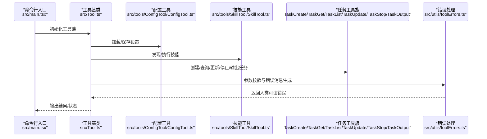
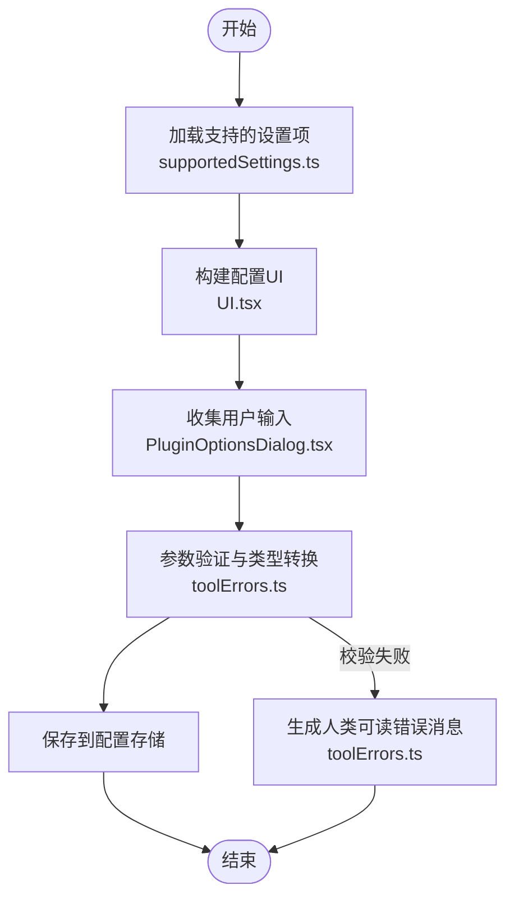
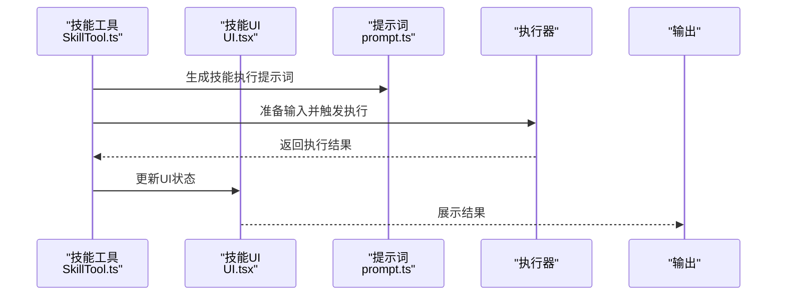
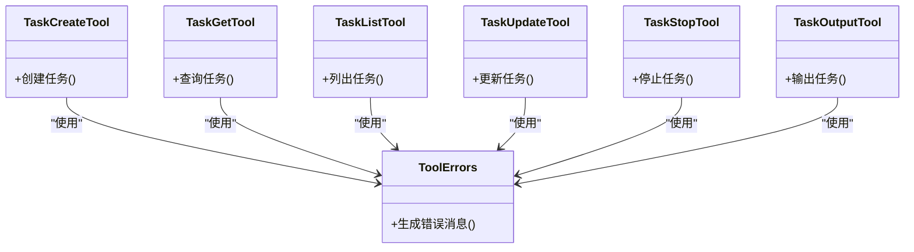
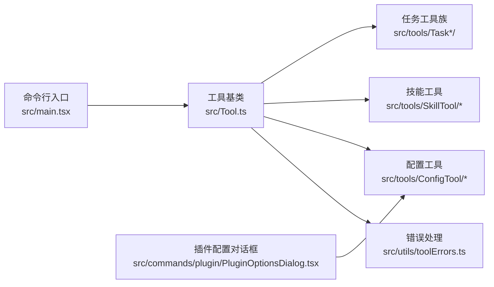

# 实用工具

<cite>
**本文引用的文件**
- [src/Tool.ts](file://src/Tool.ts)
- [src/tools/ConfigTool/ConfigTool.ts](file://src/tools/ConfigTool/ConfigTool.ts)
- [src/tools/ConfigTool/UI.tsx](file://src/tools/ConfigTool/UI.tsx)
- [src/tools/ConfigTool/supportedSettings.ts](file://src/tools/ConfigTool/supportedSettings.ts)
- [src/tools/ConfigTool/constants.ts](file://src/tools/ConfigTool/constants.ts)
- [src/tools/ConfigTool/prompt.ts](file://src/tools/ConfigTool/prompt.ts)
- [src/tools/SkillTool/SkillTool.ts](file://src/tools/SkillTool/SkillTool.ts)
- [src/tools/SkillTool/UI.tsx](file://src/tools/SkillTool/UI.tsx)
- [src/tools/SkillTool/constants.ts](file://src/tools/SkillTool/constants.ts)
- [src/tools/SkillTool/prompt.ts](file://src/tools/SkillTool/prompt.ts)
- [src/tools/TaskCreateTool/TaskCreateTool.ts](file://src/tools/TaskCreateTool/TaskCreateTool.ts)
- [src/tools/TaskCreateTool/prompt.ts](file://src/tools/TaskCreateTool/prompt.ts)
- [src/tools/TaskGetTool/TaskGetTool.ts](file://src/tools/TaskGetTool/TaskGetTool.ts)
- [src/tools/TaskGetTool/prompt.ts](file://src/tools/TaskGetTool/prompt.ts)
- [src/tools/TaskListTool/TaskListTool.ts](file://src/tools/TaskListTool/TaskListTool.ts)
- [src/tools/TaskListTool/prompt.ts](file://src/tools/TaskListTool/prompt.ts)
- [src/tools/TaskUpdateTool/TaskUpdateTool.ts](file://src/tools/TaskUpdateTool/TaskUpdateTool.ts)
- [src/tools/TaskUpdateTool/prompt.ts](file://src/tools/TaskUpdateTool/prompt.ts)
- [src/tools/TaskStopTool/TaskStopTool.ts](file://src/tools/TaskStopTool/TaskStopTool.ts)
- [src/tools/TaskStopTool/UI.tsx](file://src/tools/TaskStopTool/UI.tsx)
- [src/tools/TaskStopTool/prompt.ts](file://src/tools/TaskStopTool/prompt.ts)
- [src/tools/TaskOutputTool/TaskOutputTool.tsx](file://src/tools/TaskOutputTool/TaskOutputTool.tsx)
- [src/utils/toolErrors.ts](file://src/utils/toolErrors.ts)
- [src/commands/plugin/PluginOptionsDialog.tsx](file://src/commands/plugin/PluginOptionsDialog.tsx)
- [src/main.tsx](file://src/main.tsx)
</cite>

## 目录
1. [简介](#简介)
2. [项目结构](#项目结构)
3. [核心组件](#核心组件)
4. [架构总览](#架构总览)
5. [详细组件分析](#详细组件分析)
6. [依赖关系分析](#依赖关系分析)
7. [性能考量](#性能考量)
8. [故障排查指南](#故障排查指南)
9. [结论](#结论)
10. [附录](#附录)

## 简介
本文件系统性梳理“实用工具”的设计与实现，重点覆盖以下方面：
- 配置工具：设置管理与参数验证机制
- 技能工具：技能发现与执行流程
- 任务工具：工作流管理与进度跟踪
- 开发模板、配置选项与扩展机制
- 工具间协作模式、数据共享与状态同步策略

目标是帮助开发者快速理解工具体系的架构、行为与最佳实践，并为二次开发提供可复用的模板与规范。

## 项目结构
实用工具以“工具即能力”的理念组织，每个工具封装独立的功能边界与生命周期。整体结构遵循“按功能域分层 + 按工具类型聚合”的组织方式：
- 核心抽象：工具基类与默认行为定义
- 工具实现：配置工具、技能工具、任务工具族等
- UI 与交互：工具专属 UI 组件与对话框
- 工具错误处理：统一的参数校验与错误消息生成
- 命令入口与动态配置：命令行入口对工具链进行初始化与约束

```mermaid
graph TB
subgraph "核心抽象"
Tool["工具基类<br/>src/Tool.ts"]
end
subgraph "配置工具"
CfgTool["配置工具<br/>src/tools/ConfigTool/ConfigTool.ts"]
CfgUI["配置UI<br/>src/tools/ConfigTool/UI.tsx"]
CfgSettings["支持的设置项<br/>src/tools/ConfigTool/supportedSettings.ts"]
CfgConst["常量<br/>src/tools/ConfigTool/constants.ts"]
CfgPrompt["提示词<br/>src/tools/ConfigTool/prompt.ts"]
end
subgraph "技能工具"
SkillTool["技能工具<br/>src/tools/SkillTool/SkillTool.ts"]
SkillUI["技能UI<br/>src/tools/SkillTool/UI.tsx"]
SkillConst["常量<br/>src/tools/SkillTool/constants.ts"]
SkillPrompt["提示词<br/>src/tools/SkillTool/prompt.ts"]
end
subgraph "任务工具族"
TaskCreate["创建任务<br/>src/tools/TaskCreateTool/TaskCreateTool.ts"]
TaskGet["查询任务<br/>src/tools/TaskGetTool/TaskGetTool.ts"]
TaskList["列出任务<br/>src/tools/TaskListTool/TaskListTool.ts"]
TaskUpdate["更新任务<br/>src/tools/TaskUpdateTool/TaskUpdateTool.ts"]
TaskStop["停止任务<br/>src/tools/TaskStopTool/TaskStopTool.ts"]
TaskOutput["输出任务结果<br/>src/tools/TaskOutputTool/TaskOutputTool.tsx"]
end
subgraph "错误处理"
ToolErrors["工具错误处理<br/>src/utils/toolErrors.ts"]
end
subgraph "命令入口与动态配置"
Main["主入口<br/>src/main.tsx"]
PluginDialog["插件配置对话框<br/>src/commands/plugin/PluginOptionsDialog.tsx"]
end
Tool --> CfgTool
Tool --> SkillTool
Tool --> TaskCreate
Tool --> TaskGet
Tool --> TaskList
Tool --> TaskUpdate
Tool --> TaskStop
Tool --> TaskOutput
CfgTool --> CfgUI
CfgTool --> CfgSettings
CfgTool --> CfgConst
CfgTool --> CfgPrompt
SkillTool --> SkillUI
SkillTool --> SkillConst
SkillTool --> SkillPrompt
Main --> Tool
Main --> PluginDialog
Tool --> ToolErrors
```

图表来源
- [src/Tool.ts:716-741](file://src/Tool.ts#L716-L741)
- [src/tools/ConfigTool/ConfigTool.ts](file://src/tools/ConfigTool/ConfigTool.ts)
- [src/tools/ConfigTool/UI.tsx](file://src/tools/ConfigTool/UI.tsx)
- [src/tools/ConfigTool/supportedSettings.ts](file://src/tools/ConfigTool/supportedSettings.ts)
- [src/tools/ConfigTool/constants.ts](file://src/tools/ConfigTool/constants.ts)
- [src/tools/ConfigTool/prompt.ts](file://src/tools/ConfigTool/prompt.ts)
- [src/tools/SkillTool/SkillTool.ts](file://src/tools/SkillTool/SkillTool.ts)
- [src/tools/SkillTool/UI.tsx](file://src/tools/SkillTool/UI.tsx)
- [src/tools/SkillTool/constants.ts](file://src/tools/SkillTool/constants.ts)
- [src/tools/SkillTool/prompt.ts](file://src/tools/SkillTool/prompt.ts)
- [src/tools/TaskCreateTool/TaskCreateTool.ts](file://src/tools/TaskCreateTool/TaskCreateTool.ts)
- [src/tools/TaskGetTool/TaskGetTool.ts](file://src/tools/TaskGetTool/TaskGetTool.ts)
- [src/tools/TaskListTool/TaskListTool.ts](file://src/tools/TaskListTool/TaskListTool.ts)
- [src/tools/TaskUpdateTool/TaskUpdateTool.ts](file://src/tools/TaskUpdateTool/TaskUpdateTool.ts)
- [src/tools/TaskStopTool/TaskStopTool.ts](file://src/tools/TaskStopTool/TaskStopTool.ts)
- [src/tools/TaskOutputTool/TaskOutputTool.tsx](file://src/tools/TaskOutputTool/TaskOutputTool.tsx)
- [src/utils/toolErrors.ts:78-132](file://src/utils/toolErrors.ts#L78-L132)
- [src/main.tsx:1419-1601](file://src/main.tsx#L1419-L1601)
- [src/commands/plugin/PluginOptionsDialog.tsx:12-40](file://src/commands/plugin/PluginOptionsDialog.tsx#L12-L40)

章节来源
- [src/Tool.ts:716-741](file://src/Tool.ts#L716-L741)
- [src/main.tsx:1419-1601](file://src/main.tsx#L1419-L1601)

## 核心组件
- 工具基类与构建器
  - 工具定义与默认行为通过统一的类型与默认值集合进行约束，确保调用方始终获得完整的工具实例。
  - 关键点：默认方法可被覆写；未提供的字段由默认值填充；保留原始类型信息（含字面量类型）。
- 参数校验与错误消息
  - 对工具输入进行严格校验，自动汇总缺失参数、意外参数与类型不匹配问题，并生成可读性强的人类错误消息。
- 动态配置与企业级限制
  - 支持从命令行或文件解析 MCP 配置，具备严格模式与企业配置存在时的互斥与限制逻辑，保障安全与一致性。

章节来源
- [src/Tool.ts:716-741](file://src/Tool.ts#L716-L741)
- [src/utils/toolErrors.ts:78-132](file://src/utils/toolErrors.ts#L78-L132)
- [src/main.tsx:1419-1601](file://src/main.tsx#L1419-L1601)

## 架构总览
实用工具采用“声明式定义 + 运行时执行”的架构。工具在构建阶段完成元数据与默认行为装配，在运行阶段接收输入、执行业务逻辑、产出结果并上报进度。配置工具负责设置项的读取与持久化；技能工具负责技能的发现与执行；任务工具族负责工作流的编排与状态管理。

图表来源
- [src/main.tsx:1419-1601](file://src/main.tsx#L1419-L1601)
- [src/Tool.ts:716-741](file://src/Tool.ts#L716-L741)
- [src/tools/ConfigTool/ConfigTool.ts](file://src/tools/ConfigTool/ConfigTool.ts)
- [src/tools/SkillTool/SkillTool.ts](file://src/tools/SkillTool/SkillTool.ts)
- [src/tools/TaskCreateTool/TaskCreateTool.ts](file://src/tools/TaskCreateTool/TaskCreateTool.ts)
- [src/tools/TaskGetTool/TaskGetTool.ts](file://src/tools/TaskGetTool/TaskGetTool.ts)
- [src/tools/TaskListTool/TaskListTool.ts](file://src/tools/TaskListTool/TaskListTool.ts)
- [src/tools/TaskUpdateTool/TaskUpdateTool.ts](file://src/tools/TaskUpdateTool/TaskUpdateTool.ts)
- [src/tools/TaskStopTool/TaskStopTool.ts](file://src/tools/TaskStopTool/TaskStopTool.ts)
- [src/tools/TaskOutputTool/TaskOutputTool.tsx](file://src/tools/TaskOutputTool/TaskOutputTool.tsx)
- [src/utils/toolErrors.ts:78-132](file://src/utils/toolErrors.ts#L78-L132)

## 详细组件分析

### 配置工具：设置管理与参数验证
- 职责
  - 提供设置项的读取、更新与持久化能力
  - 通过 UI 与常量定义支持的设置项，结合提示词驱动用户交互
- 关键实现要点
  - 设置项定义与类型约束：集中于支持设置项文件，便于统一维护与扩展
  - UI 交互：基于对话框收集用户输入，处理敏感字段的预填与保存策略
  - 参数验证：在保存前进行类型转换与布尔值解析，避免空字符串导致的误判
- 错误处理
  - 当工具输入不符合预期时，使用统一的错误消息生成器输出清晰的提示

图表来源
- [src/tools/ConfigTool/supportedSettings.ts](file://src/tools/ConfigTool/supportedSettings.ts)
- [src/tools/ConfigTool/UI.tsx](file://src/tools/ConfigTool/UI.tsx)
- [src/commands/plugin/PluginOptionsDialog.tsx:12-40](file://src/commands/plugin/PluginOptionsDialog.tsx#L12-L40)
- [src/utils/toolErrors.ts:78-132](file://src/utils/toolErrors.ts#L78-L132)

章节来源
- [src/tools/ConfigTool/ConfigTool.ts](file://src/tools/ConfigTool/ConfigTool.ts)
- [src/tools/ConfigTool/UI.tsx](file://src/tools/ConfigTool/UI.tsx)
- [src/tools/ConfigTool/supportedSettings.ts](file://src/tools/ConfigTool/supportedSettings.ts)
- [src/tools/ConfigTool/constants.ts](file://src/tools/ConfigTool/constants.ts)
- [src/tools/ConfigTool/prompt.ts](file://src/tools/ConfigTool/prompt.ts)
- [src/commands/plugin/PluginOptionsDialog.tsx:12-40](file://src/commands/plugin/PluginOptionsDialog.tsx#L12-L40)
- [src/utils/toolErrors.ts:78-132](file://src/utils/toolErrors.ts#L78-L132)

### 技能工具：技能发现与执行流程
- 职责
  - 发现可用技能并将其注入到会话中
  - 执行技能时传递上下文与参数，返回执行结果
- 关键实现要点
  - 技能发现：通过工具接口扫描与注册可用技能
  - 执行流程：准备提示词、构造输入、调用执行器、处理输出
  - UI 反馈：提供可视化界面展示技能状态与结果

图表来源
- [src/tools/SkillTool/SkillTool.ts](file://src/tools/SkillTool/SkillTool.ts)
- [src/tools/SkillTool/UI.tsx](file://src/tools/SkillTool/UI.tsx)
- [src/tools/SkillTool/prompt.ts](file://src/tools/SkillTool/prompt.ts)

章节来源
- [src/tools/SkillTool/SkillTool.ts](file://src/tools/SkillTool/SkillTool.ts)
- [src/tools/SkillTool/UI.tsx](file://src/tools/SkillTool/UI.tsx)
- [src/tools/SkillTool/constants.ts](file://src/tools/SkillTool/constants.ts)
- [src/tools/SkillTool/prompt.ts](file://src/tools/SkillTool/prompt.ts)

### 任务工具族：工作流管理与进度跟踪
- 职责
  - 创建任务：解析输入、生成任务描述与初始状态
  - 查询任务：根据 ID 获取任务详情与进度
  - 列出任务：按条件筛选与分页展示任务
  - 更新任务：变更任务状态、参数或输出
  - 停止任务：中断执行中的任务
  - 输出任务：导出任务结果与日志
- 关键实现要点
  - 输入参数校验：统一使用工具错误处理模块生成清晰的错误消息
  - 进度跟踪：在工具内部维护进度状态，通过 UI 或回调反馈给用户
  - 一致性：所有任务工具共享同一套错误处理与提示词约定

图表来源
- [src/tools/TaskCreateTool/TaskCreateTool.ts](file://src/tools/TaskCreateTool/TaskCreateTool.ts)
- [src/tools/TaskGetTool/TaskGetTool.ts](file://src/tools/TaskGetTool/TaskGetTool.ts)
- [src/tools/TaskListTool/TaskListTool.ts](file://src/tools/TaskListTool/TaskListTool.ts)
- [src/tools/TaskUpdateTool/TaskUpdateTool.ts](file://src/tools/TaskUpdateTool/TaskUpdateTool.ts)
- [src/tools/TaskStopTool/TaskStopTool.ts](file://src/tools/TaskStopTool/TaskStopTool.ts)
- [src/tools/TaskOutputTool/TaskOutputTool.tsx](file://src/tools/TaskOutputTool/TaskOutputTool.tsx)
- [src/utils/toolErrors.ts:78-132](file://src/utils/toolErrors.ts#L78-L132)

章节来源
- [src/tools/TaskCreateTool/TaskCreateTool.ts](file://src/tools/TaskCreateTool/TaskCreateTool.ts)
- [src/tools/TaskCreateTool/prompt.ts](file://src/tools/TaskCreateTool/prompt.ts)
- [src/tools/TaskGetTool/TaskGetTool.ts](file://src/tools/TaskGetTool/TaskGetTool.ts)
- [src/tools/TaskGetTool/prompt.ts](file://src/tools/TaskGetTool/prompt.ts)
- [src/tools/TaskListTool/TaskListTool.ts](file://src/tools/TaskListTool/TaskListTool.ts)
- [src/tools/TaskListTool/prompt.ts](file://src/tools/TaskListTool/prompt.ts)
- [src/tools/TaskUpdateTool/TaskUpdateTool.ts](file://src/tools/TaskUpdateTool/TaskUpdateTool.ts)
- [src/tools/TaskUpdateTool/prompt.ts](file://src/tools/TaskUpdateTool/prompt.ts)
- [src/tools/TaskStopTool/TaskStopTool.ts](file://src/tools/TaskStopTool/TaskStopTool.ts)
- [src/tools/TaskStopTool/UI.tsx](file://src/tools/TaskStopTool/UI.tsx)
- [src/tools/TaskStopTool/prompt.ts](file://src/tools/TaskStopTool/prompt.ts)
- [src/tools/TaskOutputTool/TaskOutputTool.tsx](file://src/tools/TaskOutputTool/TaskOutputTool.tsx)
- [src/utils/toolErrors.ts:78-132](file://src/utils/toolErrors.ts#L78-L132)

### 工具开发模板、配置选项与扩展机制
- 开发模板
  - 使用工具基类定义工具元数据与默认行为，仅覆写必要的方法
  - 将 UI 与提示词拆分为独立文件，便于维护与测试
- 配置选项
  - 通过支持设置项文件集中定义可配置项，配合 UI 与对话框完成交互
  - 敏感字段在重新配置时避免被空值覆盖，保持已有配置的安全性
- 扩展机制
  - 新增工具时遵循统一的输入/输出与错误处理约定
  - 在命令行入口处进行动态配置解析与企业配置限制检查，确保全局一致性

章节来源
- [src/Tool.ts:716-741](file://src/Tool.ts#L716-L741)
- [src/tools/ConfigTool/ConfigTool.ts](file://src/tools/ConfigTool/ConfigTool.ts)
- [src/commands/plugin/PluginOptionsDialog.tsx:12-40](file://src/commands/plugin/PluginOptionsDialog.tsx#L12-L40)
- [src/main.tsx:1419-1601](file://src/main.tsx#L1419-L1601)

### 工具间协作模式、数据共享与状态同步
- 协作模式
  - 配置工具为其他工具提供统一的设置访问；技能工具与任务工具通过会话上下文共享能力
  - 任务工具族之间通过公共的状态模型与进度事件进行协作
- 数据共享
  - 通过工具基类的默认行为与错误处理模块实现跨工具的一致性
  - UI 组件作为状态的唯一真相源，工具仅负责读取与更新
- 状态同步
  - 任务工具在执行过程中定期上报进度；停止与输出工具用于终止与导出当前状态

章节来源
- [src/Tool.ts:716-741](file://src/Tool.ts#L716-L741)
- [src/tools/TaskCreateTool/TaskCreateTool.ts](file://src/tools/TaskCreateTool/TaskCreateTool.ts)
- [src/tools/TaskStopTool/TaskStopTool.ts](file://src/tools/TaskStopTool/TaskStopTool.ts)
- [src/tools/TaskOutputTool/TaskOutputTool.tsx](file://src/tools/TaskOutputTool/TaskOutputTool.tsx)

## 依赖关系分析
- 组件耦合
  - 工具基类与错误处理模块是所有工具的共同依赖，保证一致的输入校验与错误消息风格
  - 配置工具与任务工具族分别依赖各自的 UI 与提示词模块
- 外部依赖
  - 命令行入口负责动态配置解析与企业配置限制，影响工具的可用性与行为
- 循环依赖
  - 当前结构未见循环导入；各工具模块保持单向依赖

图表来源
- [src/Tool.ts:716-741](file://src/Tool.ts#L716-L741)
- [src/utils/toolErrors.ts:78-132](file://src/utils/toolErrors.ts#L78-L132)
- [src/main.tsx:1419-1601](file://src/main.tsx#L1419-L1601)
- [src/commands/plugin/PluginOptionsDialog.tsx:12-40](file://src/commands/plugin/PluginOptionsDialog.tsx#L12-L40)

章节来源
- [src/Tool.ts:716-741](file://src/Tool.ts#L716-L741)
- [src/utils/toolErrors.ts:78-132](file://src/utils/toolErrors.ts#L78-L132)
- [src/main.tsx:1419-1601](file://src/main.tsx#L1419-L1601)
- [src/commands/plugin/PluginOptionsDialog.tsx:12-40](file://src/commands/plugin/PluginOptionsDialog.tsx#L12-L40)

## 性能考量
- 输入校验前置：在工具执行前完成参数校验，减少无效调用带来的开销
- UI 与工具解耦：UI 仅负责状态展示，工具专注于计算，降低渲染压力
- 任务进度批量化：批量上报进度与状态，避免频繁 UI 刷新
- 企业配置限制：通过严格模式与企业配置检查，避免不必要的动态配置解析与冲突

## 故障排查指南
- 参数校验失败
  - 现象：工具报错，提示缺少必要参数、提供了意外参数或类型不匹配
  - 排查：对照工具输入 schema，确认必填字段与类型；使用统一错误消息生成器定位问题
- 配置保存异常
  - 现象：重新配置后敏感字段被清空或未生效
  - 排查：确认对话框的保存逻辑对敏感字段的空值处理策略；避免用空值覆盖已有值
- 动态配置与企业配置冲突
  - 现象：启用严格模式或存在企业配置时，动态 MCP 配置被拒绝
  - 排查：检查企业配置的存在性与动态配置的服务器类型是否受限

章节来源
- [src/utils/toolErrors.ts:78-132](file://src/utils/toolErrors.ts#L78-L132)
- [src/commands/plugin/PluginOptionsDialog.tsx:12-40](file://src/commands/plugin/PluginOptionsDialog.tsx#L12-L40)
- [src/main.tsx:1419-1601](file://src/main.tsx#L1419-L1601)

## 结论
实用工具体系通过统一的工具基类、严格的参数校验与清晰的错误消息、以及模块化的 UI 与提示词，实现了高内聚、低耦合的能力组合。配置工具、技能工具与任务工具族分别承担设置管理、能力发现与工作流编排的核心职责，配合命令行入口的动态配置与企业配置限制，形成完整且可扩展的工具生态。

## 附录
- 快速参考
  - 工具基类与默认行为：[src/Tool.ts:716-741](file://src/Tool.ts#L716-L741)
  - 配置工具：设置项、UI、常量与提示词
    - [src/tools/ConfigTool/ConfigTool.ts](file://src/tools/ConfigTool/ConfigTool.ts)
    - [src/tools/ConfigTool/UI.tsx](file://src/tools/ConfigTool/UI.tsx)
    - [src/tools/ConfigTool/supportedSettings.ts](file://src/tools/ConfigTool/supportedSettings.ts)
    - [src/tools/ConfigTool/constants.ts](file://src/tools/ConfigTool/constants.ts)
    - [src/tools/ConfigTool/prompt.ts](file://src/tools/ConfigTool/prompt.ts)
  - 技能工具：发现与执行
    - [src/tools/SkillTool/SkillTool.ts](file://src/tools/SkillTool/SkillTool.ts)
    - [src/tools/SkillTool/UI.tsx](file://src/tools/SkillTool/UI.tsx)
    - [src/tools/SkillTool/constants.ts](file://src/tools/SkillTool/constants.ts)
    - [src/tools/SkillTool/prompt.ts](file://src/tools/SkillTool/prompt.ts)
  - 任务工具族：创建、查询、列出、更新、停止、输出
    - [src/tools/TaskCreateTool/TaskCreateTool.ts](file://src/tools/TaskCreateTool/TaskCreateTool.ts)
    - [src/tools/TaskCreateTool/prompt.ts](file://src/tools/TaskCreateTool/prompt.ts)
    - [src/tools/TaskGetTool/TaskGetTool.ts](file://src/tools/TaskGetTool/TaskGetTool.ts)
    - [src/tools/TaskGetTool/prompt.ts](file://src/tools/TaskGetTool/prompt.ts)
    - [src/tools/TaskListTool/TaskListTool.ts](file://src/tools/TaskListTool/TaskListTool.ts)
    - [src/tools/TaskListTool/prompt.ts](file://src/tools/TaskListTool/prompt.ts)
    - [src/tools/TaskUpdateTool/TaskUpdateTool.ts](file://src/tools/TaskUpdateTool/TaskUpdateTool.ts)
    - [src/tools/TaskUpdateTool/prompt.ts](file://src/tools/TaskUpdateTool/prompt.ts)
    - [src/tools/TaskStopTool/TaskStopTool.ts](file://src/tools/TaskStopTool/TaskStopTool.ts)
    - [src/tools/TaskStopTool/UI.tsx](file://src/tools/TaskStopTool/UI.tsx)
    - [src/tools/TaskStopTool/prompt.ts](file://src/tools/TaskStopTool/prompt.ts)
    - [src/tools/TaskOutputTool/TaskOutputTool.tsx](file://src/tools/TaskOutputTool/TaskOutputTool.tsx)
  - 错误处理：统一参数校验与错误消息生成
    - [src/utils/toolErrors.ts:78-132](file://src/utils/toolErrors.ts#L78-L132)
  - 命令入口与动态配置：解析与限制
    - [src/main.tsx:1419-1601](file://src/main.tsx#L1419-L1601)
  - 插件配置对话框：敏感字段处理与保存策略
    - [src/commands/plugin/PluginOptionsDialog.tsx:12-40](file://src/commands/plugin/PluginOptionsDialog.tsx#L12-L40)