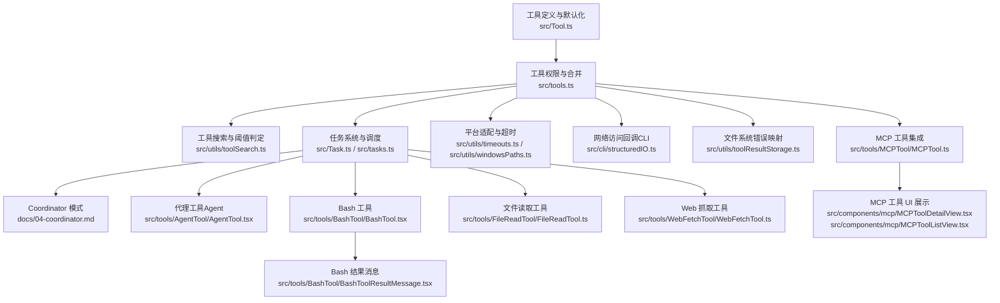
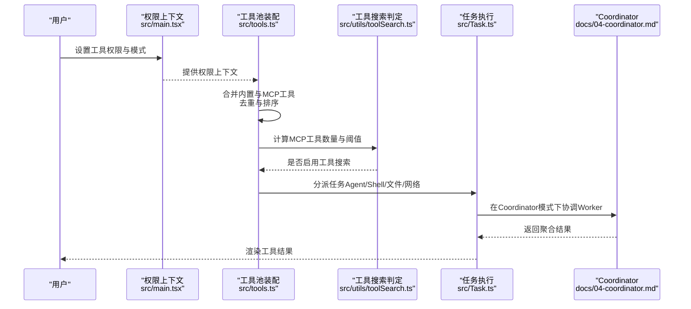
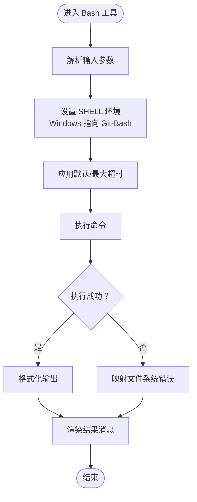
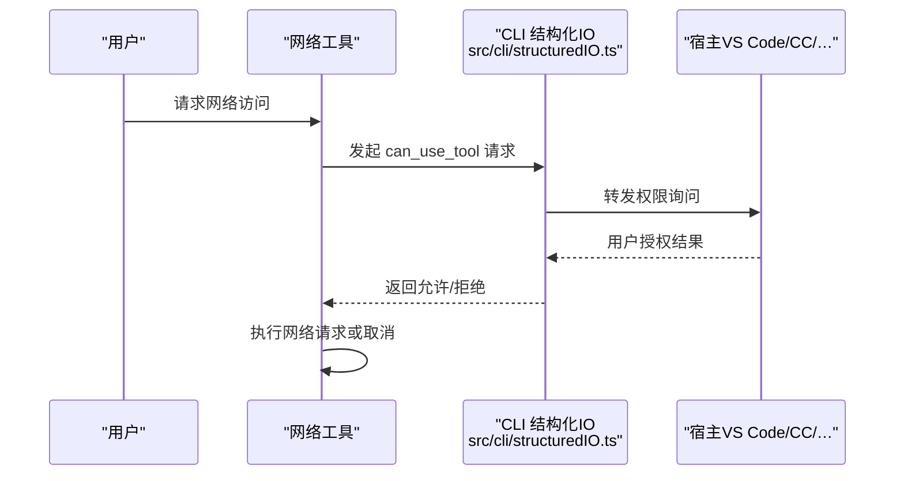
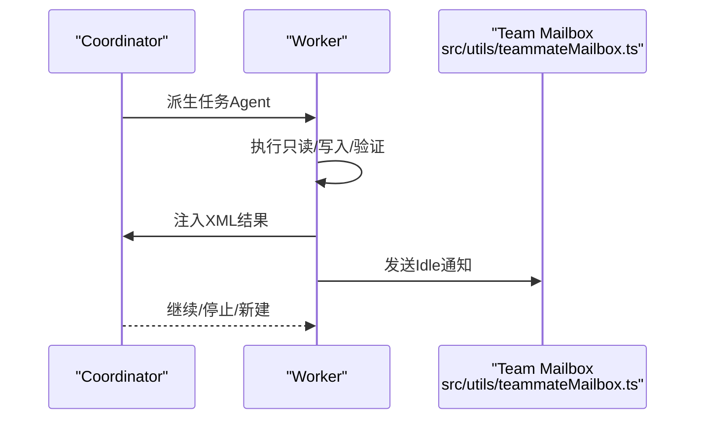
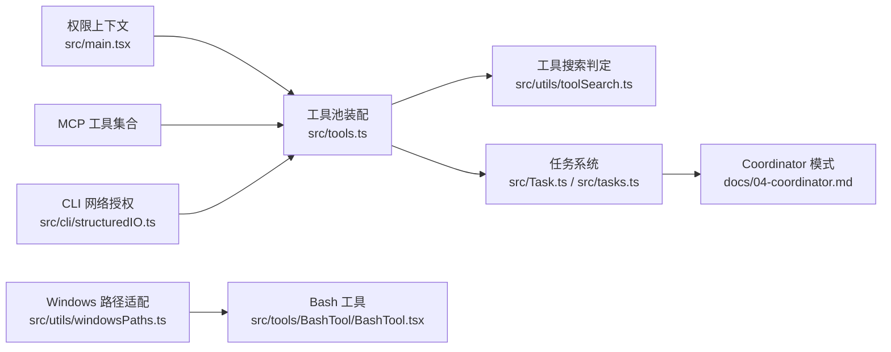

# 工具分类与实现

<cite>
**本文引用的文件**   
- [src/Tool.ts](file://src/Tool.ts)
- [src/tools.ts](file://src/tools.ts)
- [src/utils/toolSearch.ts](file://src/utils/toolSearch.ts)
- [src/utils/timeouts.ts](file://src/utils/timeouts.ts)
- [src/utils/windowsPaths.ts](file://src/utils/windowsPaths.ts)
- [src/utils/toolResultStorage.ts](file://src/utils/toolResultStorage.ts)
- [src/cli/structuredIO.ts](file://src/cli/structuredIO.ts)
- [src/main.tsx](file://src/main.tsx)
- [src/commands/add-dir/validation.ts](file://src/commands/add-dir/validation.ts)
- [src/tasks.ts](file://src/tasks.ts)
- [src/Task.ts](file://src/Task.ts)
- [src/utils/teammateMailbox.ts](file://src/utils/teammateMailbox.ts)
- [src/utils/uuid.ts](file://src/utils/uuid.ts)
- [docs/04-coordinator.md](file://docs/04-coordinator.md)
- [src/tools/BashTool/BashTool.tsx](file://src/tools/BashTool/BashTool.tsx)
- [src/tools/BashTool/BashToolResultMessage.tsx](file://src/tools/BashTool/BashToolResultMessage.tsx)
- [src/tools/FileReadTool/FileReadTool.ts](file://src/tools/FileReadTool/FileReadTool.ts)
- [src/tools/WebFetchTool/WebFetchTool.ts](file://src/tools/WebFetchTool/WebFetchTool.ts)
- [src/tools/AgentTool/AgentTool.tsx](file://src/tools/AgentTool/AgentTool.tsx)
- [src/tools/MCPTool/MCPTool.ts](file://src/tools/MCPTool/MCPTool.ts)
- [src/components/mcp/MCPToolDetailView.tsx](file://src/components/mcp/MCPToolDetailView.tsx)
- [src/components/mcp/MCPToolListView.tsx](file://src/components/mcp/MCPToolListView.tsx)
</cite>

## 目录
1. [引言](#引言)
2. [项目结构](#项目结构)
3. [核心组件](#核心组件)
4. [架构总览](#架构总览)
5. [详细组件分析](#详细组件分析)
6. [依赖分析](#依赖分析)
7. [性能考虑](#性能考虑)
8. [故障排查指南](#故障排查指南)
9. [结论](#结论)
10. [附录](#附录)

## 引言
本文件系统性梳理 Claude Code 工具体系的分类、实现与运行机制，覆盖系统工具、应用工具、网络工具、代理工具等类别，并深入解释 Bash 工具的命令解析与执行、文件操作工具的文件系统抽象、网络工具的请求处理以及代理工具的任务协调。同时提供开发模板、最佳实践与性能优化建议，帮助开发者在保证安全与稳定性的前提下高效扩展工具生态。

## 项目结构
工具系统围绕“工具定义—权限与合并—执行—结果呈现”这一主线组织，主要模块包括：
- 工具定义与默认化：统一的工具接口与默认行为
- 权限与合并：内置工具与 MCP 工具的筛选、去重与排序
- 执行与调度：任务系统与 Coordinator 模式的编排
- 结果与展示：工具结果存储、错误映射与 UI 展示
- 平台适配：超时控制、Windows 路径转换等

图示来源
- [src/Tool.ts:744-774](file://src/Tool.ts#L744-L774)
- [src/tools.ts:325-389](file://src/tools.ts#L325-L389)
- [src/utils/toolSearch.ts:367-392](file://src/utils/toolSearch.ts#L367-L392)
- [src/Task.ts:1-57](file://src/Task.ts#L1-L57)
- [src/tasks.ts:17-39](file://src/tasks.ts#L17-L39)
- [src/utils/timeouts.ts:1-39](file://src/utils/timeouts.ts#L1-L39)
- [src/utils/windowsPaths.ts:87-117](file://src/utils/windowsPaths.ts#L87-L117)
- [src/cli/structuredIO.ts:723-753](file://src/cli/structuredIO.ts#L723-L753)
- [src/utils/toolResultStorage.ts:1014-1040](file://src/utils/toolResultStorage.ts#L1014-L1040)
- [src/tools/MCPTool/MCPTool.ts](file://src/tools/MCPTool/MCPTool.ts)
- [src/components/mcp/MCPToolDetailView.tsx](file://src/components/mcp/MCPToolDetailView.tsx)
- [src/components/mcp/MCPToolListView.tsx](file://src/components/mcp/MCPToolListView.tsx)
- [src/tools/AgentTool/AgentTool.tsx](file://src/tools/AgentTool/AgentTool.tsx)
- [src/tools/BashTool/BashTool.tsx](file://src/tools/BashTool/BashTool.tsx)
- [src/tools/BashTool/BashToolResultMessage.tsx](file://src/tools/BashTool/BashToolResultMessage.tsx)
- [src/tools/FileReadTool/FileReadTool.ts](file://src/tools/FileReadTool/FileReadTool.ts)
- [src/tools/WebFetchTool/WebFetchTool.ts](file://src/tools/WebFetchTool/WebFetchTool.ts)

章节来源
- [src/Tool.ts:744-774](file://src/Tool.ts#L744-L774)
- [src/tools.ts:325-389](file://src/tools.ts#L325-L389)

## 核心组件
- 工具接口与默认化
  - 工具接口定义了统一的生命周期方法、权限检查、并发特性标记与 UI 名称等字段；通过构建器填充安全默认，避免调用方重复判断。
  - 关键点：默认允许权限检查、非并发安全、非只读、非破坏性等，确保在缺少显式声明时采取保守策略。
- 工具池装配与去重
  - 将内置工具与 MCP 工具合并，按名称去重且内置工具优先；对 MCP 工具进行拒绝规则过滤，保证策略一致性。
  - 排序采用本地化比较，保持提示缓存稳定性。
- 工具搜索与阈值
  - 在特定模型支持的前提下，结合 MCP 工具数量与自动模式阈值，动态启用工具搜索（MCP 工具延迟定义）。
- 任务系统与状态
  - 任务类型涵盖本地/远程 Agent、本地 Shell、Dream、可选的本地工作流与监控 MCP；任务状态机包含终止态保护，防止向已结束任务注入消息。
- 平台适配与安全
  - Bash 默认与最大超时可通过环境变量配置；Windows 下设置 SHELL 指向 Git-Bash；文件系统错误映射为可读消息；CLI 中通过 can_use_tool 协议处理沙箱网络访问授权。

章节来源
- [src/Tool.ts:669-774](file://src/Tool.ts#L669-L774)
- [src/tools.ts:325-389](file://src/tools.ts#L325-L389)
- [src/utils/toolSearch.ts:226-252](file://src/utils/toolSearch.ts#L226-L252)
- [src/utils/toolSearch.ts:367-392](file://src/utils/toolSearch.ts#L367-L392)
- [src/Task.ts:1-57](file://src/Task.ts#L1-L57)
- [src/tasks.ts:17-39](file://src/tasks.ts#L17-L39)
- [src/utils/timeouts.ts:1-39](file://src/utils/timeouts.ts#L1-L39)
- [src/utils/windowsPaths.ts:87-117](file://src/utils/windowsPaths.ts#L87-L117)
- [src/utils/toolResultStorage.ts:1014-1040](file://src/utils/toolResultStorage.ts#L1014-L1040)
- [src/cli/structuredIO.ts:723-753](file://src/cli/structuredIO.ts#L723-L753)

## 架构总览
工具系统采用“定义—合并—执行—反馈”的闭环设计。工具定义层提供一致接口；权限与合并层确保安全可控；执行层通过任务系统与 Coordinator 模式实现多 Agent 协作；结果层将执行结果与错误信息标准化并反馈到 UI。

图示来源
- [src/main.tsx:1750-1777](file://src/main.tsx#L1750-L1777)
- [src/tools.ts:325-389](file://src/tools.ts#L325-L389)
- [src/utils/toolSearch.ts:367-392](file://src/utils/toolSearch.ts#L367-L392)
- [src/Task.ts:1-57](file://src/Task.ts#L1-L57)
- [docs/04-coordinator.md:1-110](file://docs/04-coordinator.md#L1-L110)

## 详细组件分析

### 系统工具
- 特点
  - 通常由系统内置，具备高权限与高风险特征，需严格权限校验与最小暴露原则。
  - 支持并发安全标记与只读/破坏性标记，便于调度器与 UI 做出正确决策。
- 实现模式
  - 使用工具构建器填充默认行为，显式覆盖敏感方法（如权限检查）。
  - 在启动阶段初始化权限上下文，移除过度宽泛的 Shell 规则，保障安全基线。
- 开发模板
  - 定义工具接口字段，覆盖 checkPermissions 与 isReadOnly/isDestructive 标记。
  - 在 getTools 中按模式过滤，必要时加入 deny 规则。
- 最佳实践
  - 明确工具的只读/写入语义，避免误判导致并发冲突。
  - 对外部系统调用增加超时与重试策略，结合日志追踪。
- 性能优化
  - 对频繁调用的只读工具启用缓存与批量处理。
  - 合理拆分工具职责，减少单工具负担。

章节来源
- [src/Tool.ts:744-774](file://src/Tool.ts#L744-L774)
- [src/main.tsx:1750-1777](file://src/main.tsx#L1750-L1777)

### 应用工具
- 特点
  - 面向 IDE/终端/文件系统等应用层能力，典型如 Bash、文件读写、Agent 协作等。
- Bash 工具
  - 命令解析与执行
    - 解析输入参数，构造命令行，设置 SHELL 环境变量（Windows 下指向 Git-Bash），应用默认与最大超时。
    - 执行过程中支持中断与进度反馈，结果以结构化消息呈现。
  - 平台适配
    - Windows 路径转换与 UNC/MSYS2 路径兼容，POSIX 路径到 Windows 路径的映射。
  - 错误处理
    - 文件系统错误映射为人类可读消息，便于 UI 呈现与用户诊断。
- 文件读取工具
  - 文件系统抽象
    - 通过统一的文件读取接口封装底层 FS 调用，屏蔽平台差异。
    - 对目录添加校验与工作区限制，避免越权访问。
- Agent 工具
  - 任务协调
    - 在 Coordinator 模式下派生 Worker，通过消息与状态机协调任务生命周期。
    - 生成唯一 Agent ID，确保任务可追踪与幂等。
- 开发模板
  - Bash：参数解析 → 环境准备 → 执行与超时控制 → 结果与错误映射 → UI 展示。
  - 文件工具：路径校验 → 权限检查 → 读取/写入 → 错误映射 → 结果返回。
  - Agent：任务建模 → 状态机驱动 → 消息传递 → 结束通知。
- 最佳实践
  - Bash：合理设置超时，避免长时间阻塞；对敏感命令进行白名单校验。
  - 文件：严格工作区边界，避免跨目录访问；对大文件采用流式处理。
  - Agent：明确任务粒度，避免过细导致调度开销过大。
- 性能优化
  - Bash：复用进程池、批量化命令、缓存常用脚本。
  - 文件：增量读取、缓存元数据、压缩传输。
  - Agent：并行只读任务、串行写入任务、任务合并。

图示来源
- [src/tools/BashTool/BashTool.tsx](file://src/tools/BashTool/BashTool.tsx)
- [src/tools/BashTool/BashToolResultMessage.tsx](file://src/tools/BashTool/BashToolResultMessage.tsx)
- [src/utils/timeouts.ts:1-39](file://src/utils/timeouts.ts#L1-L39)
- [src/utils/windowsPaths.ts:87-117](file://src/utils/windowsPaths.ts#L87-L117)
- [src/utils/toolResultStorage.ts:1014-1040](file://src/utils/toolResultStorage.ts#L1014-L1040)

章节来源
- [src/tools/BashTool/BashTool.tsx](file://src/tools/BashTool/BashTool.tsx)
- [src/tools/BashTool/BashToolResultMessage.tsx](file://src/tools/BashTool/BashToolResultMessage.tsx)
- [src/utils/timeouts.ts:1-39](file://src/utils/timeouts.ts#L1-L39)
- [src/utils/windowsPaths.ts:87-117](file://src/utils/windowsPaths.ts#L87-L117)
- [src/utils/toolResultStorage.ts:1014-1040](file://src/utils/toolResultStorage.ts#L1014-L1040)
- [src/tools/FileReadTool/FileReadTool.ts](file://src/tools/FileReadTool/FileReadTool.ts)
- [src/commands/add-dir/validation.ts:45-93](file://src/commands/add-dir/validation.ts#L45-L93)
- [src/utils/uuid.ts:19-27](file://src/utils/uuid.ts#L19-L27)

### 网络工具
- 特点
  - 用于网页抓取、资源访问与外部服务交互，涉及网络权限与安全策略。
- 实现模式
  - 通过 CLI 的 can_use_tool 控制请求转发至宿主进行用户授权确认。
  - MCP 工具可作为网络能力的扩展来源，统一纳入工具池与权限系统。
- 开发模板
  - 定义网络访问参数与目标主机，触发权限询问，接收授权结果后执行请求。
- 最佳实践
  - 严格限定域名与端口范围，避免开放性网络访问。
  - 对请求进行速率限制与缓存，降低对外部服务的压力。
- 性能优化
  - 复用连接、压缩传输、批量请求；对静态资源使用 CDN。

图示来源
- [src/cli/structuredIO.ts:723-753](file://src/cli/structuredIO.ts#L723-L753)
- [src/tools/MCPTool/MCPTool.ts](file://src/tools/MCPTool/MCPTool.ts)

章节来源
- [src/cli/structuredIO.ts:723-753](file://src/cli/structuredIO.ts#L723-L753)
- [src/tools/MCPTool/MCPTool.ts](file://src/tools/MCPTool/MCPTool.ts)

### 代理工具（Agent）
- 特点
  - 用于派生 Worker 执行具体任务，配合 Coordinator 模式实现多 Agent 并行协作。
- 实现模式
  - 任务建模：定义任务类型、状态与生命周期；通过状态机驱动任务推进。
  - 通信机制：Worker 以 XML 形式向 Coordinator 汇报状态与结果；Idle 通知用于回收与再分配。
  - 并发管理：只读任务可并行，写操作按文件组互斥，验证任务可与其他区域并行。
- 开发模板
  - 定义任务类型与状态机；实现派生与消息路由；在终止态发送 Idle 通知。
- 最佳实践
  - 禁止甩锅式委派：Coordinator 自己做综合分析，Worker 不依赖上下文。
  - 明确“完成”标准与具体修改点，避免歧义。
- 性能优化
  - 并行只读、串行写入；任务合并与去重；合理拆分任务粒度。

图示来源
- [docs/04-coordinator.md:1-110](file://docs/04-coordinator.md#L1-L110)
- [src/utils/teammateMailbox.ts:391-430](file://src/utils/teammateMailbox.ts#L391-L430)
- [src/Task.ts:1-57](file://src/Task.ts#L1-L57)

章节来源
- [docs/04-coordinator.md:1-110](file://docs/04-coordinator.md#L1-L110)
- [src/utils/teammateMailbox.ts:391-430](file://src/utils/teammateMailbox.ts#L391-L430)
- [src/Task.ts:1-57](file://src/Task.ts#L1-L57)

## 依赖分析
- 组件耦合
  - 工具池装配依赖权限上下文与 MCP 工具集合，二者共同决定可用工具集。
  - 工具搜索启用与否取决于模型能力、工具数量与阈值，影响提示缓存与推理成本。
  - 任务系统与 Coordinator 模式强耦合，任务状态机与消息协议贯穿执行链路。
- 外部依赖
  - CLI 协议用于网络权限授权；MCP 工具作为外部能力扩展；平台适配库处理 Windows/POSIX 差异。
- 循环依赖规避
  - 工具与任务均通过函数式装配与类型约束避免循环导入；任务类型集中定义于 Task.ts。

图示来源
- [src/main.tsx:1750-1777](file://src/main.tsx#L1750-L1777)
- [src/tools.ts:325-389](file://src/tools.ts#L325-L389)
- [src/utils/toolSearch.ts:367-392](file://src/utils/toolSearch.ts#L367-L392)
- [src/Task.ts:1-57](file://src/Task.ts#L1-L57)
- [src/tasks.ts:17-39](file://src/tasks.ts#L17-L39)
- [src/cli/structuredIO.ts:723-753](file://src/cli/structuredIO.ts#L723-L753)
- [src/utils/windowsPaths.ts:87-117](file://src/utils/windowsPaths.ts#L87-L117)
- [src/tools/BashTool/BashTool.tsx](file://src/tools/BashTool/BashTool.tsx)

章节来源
- [src/tools.ts:325-389](file://src/tools.ts#L325-L389)
- [src/utils/toolSearch.ts:367-392](file://src/utils/toolSearch.ts#L367-L392)
- [src/cli/structuredIO.ts:723-753](file://src/cli/structuredIO.ts#L723-L753)

## 性能考虑
- 工具搜索与提示缓存
  - 工具搜索会引入额外的提示与缓存计算，应结合模型能力与工具数量阈值谨慎启用。
- Bash 执行
  - 合理设置默认与最大超时，避免长时间阻塞；对敏感命令进行白名单与参数校验。
- 文件系统
  - 对大文件采用流式读取与增量处理；缓存元数据与目录索引；限制工作区范围。
- 网络请求
  - 复用连接与压缩传输；对静态资源使用缓存与 CDN；限制速率与并发。
- 任务调度
  - 并行只读、串行写入；任务合并与去重；根据文件区域划分互斥。

## 故障排查指南
- Bash 执行失败
  - 检查 SHELL 环境变量与 Windows 路径映射；核对超时设置；查看文件系统错误映射。
- 文件访问异常
  - 校验工作区边界与目录存在性；关注权限与只读文件系统错误。
- 网络访问被拒
  - 确认 can_use_tool 授权流程是否正常；检查宿主侧权限策略。
- Coordinator 任务卡顿
  - 检查任务状态机与消息注入时机；确认终止态保护逻辑；核对 Worker 并发策略。

章节来源
- [src/utils/windowsPaths.ts:87-117](file://src/utils/windowsPaths.ts#L87-L117)
- [src/utils/toolResultStorage.ts:1014-1040](file://src/utils/toolResultStorage.ts#L1014-L1040)
- [src/cli/structuredIO.ts:723-753](file://src/cli/structuredIO.ts#L723-L753)
- [src/Task.ts:27-29](file://src/Task.ts#L27-L29)

## 结论
Claude Code 工具系统通过统一的工具接口、严格的权限与合并策略、灵活的任务编排与结果呈现，实现了从系统工具到应用工具、网络工具与代理工具的完整能力谱系。遵循本文提供的分类、实现模式、开发模板与最佳实践，可在保证安全性与稳定性的前提下高效扩展工具生态，并针对不同场景进行性能优化。

## 附录
- 开发模板速查
  - Bash 工具：参数解析 → 环境准备 → 执行与超时 → 结果与错误映射 → UI 展示
  - 文件工具：路径校验 → 权限检查 → 读取/写入 → 错误映射 → 结果返回
  - Agent 工具：任务建模 → 状态机驱动 → 消息传递 → 结束通知
- 扩展开发指南
  - 新增工具：实现工具接口与默认化，覆盖权限检查与并发标记；在 getTools 中注册并在必要时加入 deny 规则。
  - 扩展 MCP：通过 MCPTool 包装外部能力，纳入工具池与权限系统；提供 UI 展示组件。
  - 平台适配：关注 Windows/POSIX 差异，统一路径转换与环境变量设置。