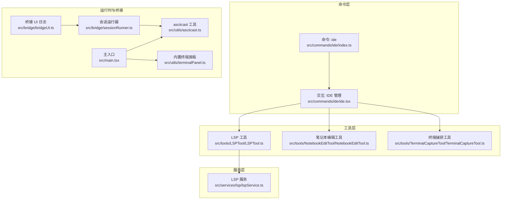
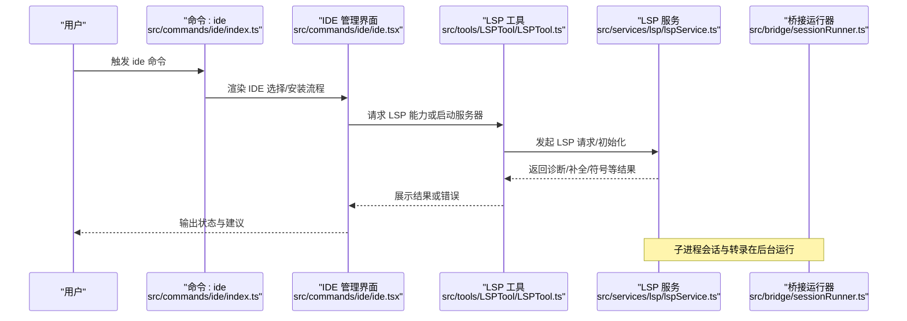
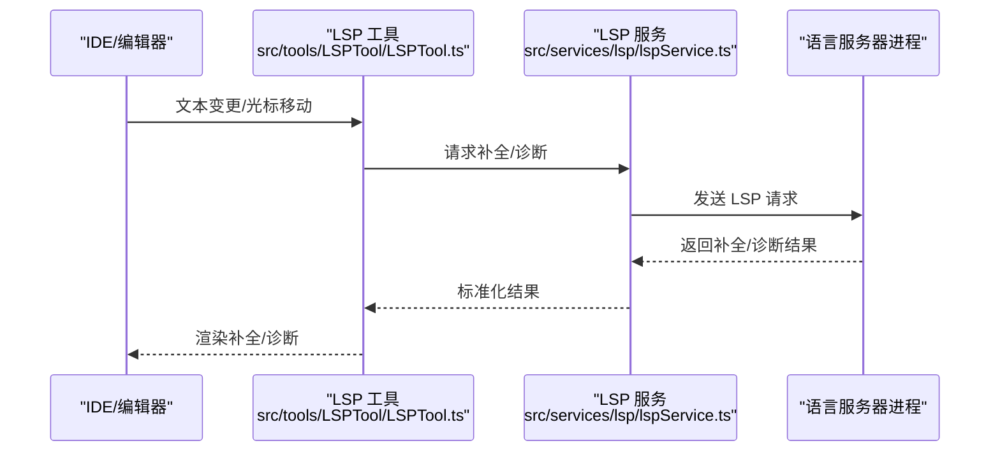
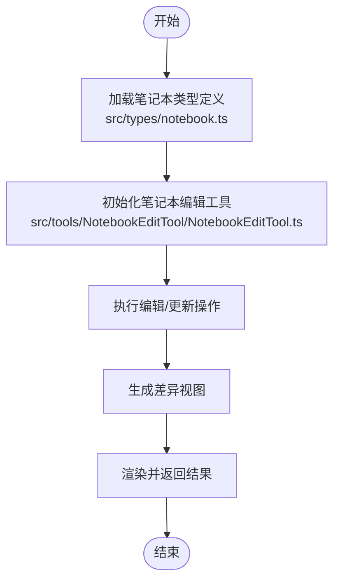
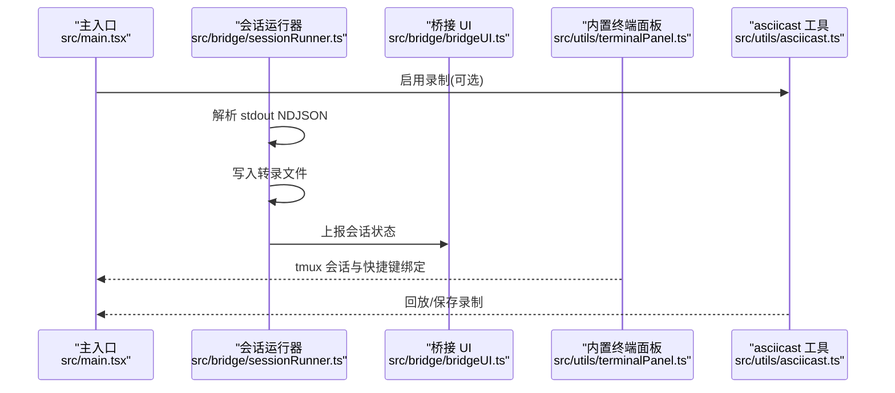
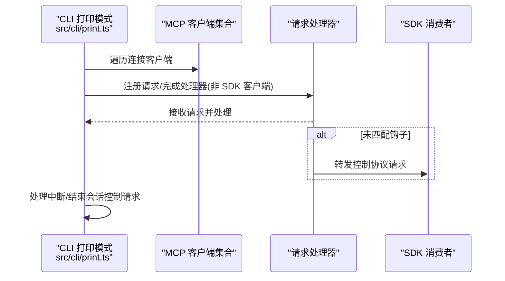
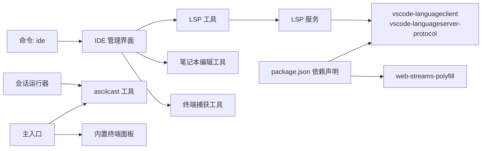

# 开发工具

<cite>
**本文引用的文件**
- [src/commands/ide/ide.tsx](file://src/commands/ide/ide.tsx)
- [src/commands/ide/index.ts](file://src/commands/ide/index.ts)
- [src/tools/LSPTool/LSPTool.ts](file://src/tools/LSPTool/LSPTool.ts)
- [src/services/lsp/lspService.ts](file://src/services/lsp/lspService.ts)
- [src/tools/NotebookEditTool/NotebookEditTool.ts](file://src/tools/NotebookEditTool/NotebookEditTool.ts)
- [src/types/notebook.ts](file://src/types/notebook.ts)
- [src/tools/TerminalCaptureTool/TerminalCaptureTool.ts](file://src/tools/TerminalCaptureTool/TerminalCaptureTool.ts)
- [src/utils/asciicast.ts](file://src/utils/asciicast.ts)
- [src/utils/terminalPanel.ts](file://src/utils/terminalPanel.ts)
- [src/bridge/sessionRunner.ts](file://src/bridge/sessionRunner.ts)
- [src/bridge/bridgeUI.ts](file://src/bridge/bridgeUI.ts)
- [src/main.tsx](file://src/main.tsx)
- [src/cli/print.ts](file://src/cli/print.ts)
- [src/commands/plugin/PluginErrors.tsx](file://src/commands/plugin/PluginErrors.tsx)
- [package.json](file://package.json)
- [src/utils/telemetry/perfettoTracing.ts](file://src/utils/telemetry/perfettoTracing.ts)
- [src/utils/warningHandler.ts](file://src/utils/warningHandler.ts)
</cite>

## 目录
1. [简介](#简介)
2. [项目结构](#项目结构)
3. [核心组件](#核心组件)
4. [架构总览](#架构总览)
5. [详细组件分析](#详细组件分析)
6. [依赖关系分析](#依赖关系分析)
7. [性能考虑](#性能考虑)
8. [故障排查指南](#故障排查指南)
9. [结论](#结论)
10. [附录](#附录)

## 简介
本文件系统性梳理“开发工具”相关能力，覆盖以下主题：
- LSP 工具：语言服务器协议集成、代码补全与诊断
- 笔记本编辑工具：文档格式支持与内容管理
- 终端捕获工具：会话录制与回放
- 集成模板、调试技巧与性能优化
- IDE 集成、插件扩展与自定义开发支持

目标是帮助开发者快速理解并高效使用这些工具，同时为二次开发提供清晰的参考路径。

## 项目结构
围绕“开发工具”的关键目录与文件如下：
- 命令层（命令入口与交互）
  - src/commands/ide/ide.tsx：IDE 检测、安装与连接流程
  - src/commands/ide/index.ts：命令注册
- 工具层（具体功能实现）
  - src/tools/LSPTool/LSPTool.ts：LSP 能力封装与调用
  - src/tools/NotebookEditTool/NotebookEditTool.ts：笔记本编辑工具
  - src/tools/TerminalCaptureTool/TerminalCaptureTool.ts：终端捕获工具
- 服务层（后台能力）
  - src/services/lsp/lspService.ts：LSP 服务编排
- 类型与配置
  - src/types/notebook.ts：笔记本数据模型
  - package.json：外部依赖（如 vscode-languageclient、vscode-languageserver-protocol）
- 运行时与桥接
  - src/main.tsx：主入口，含终端录制开关
  - src/utils/asciicast.ts：asciicast 录制与回放
  - src/utils/terminalPanel.ts：内置终端面板（tmux 支持）
  - src/bridge/sessionRunner.ts：子进程会话运行与转录
  - src/bridge/bridgeUI.ts：桥接 UI 日志与状态
- CLI 打印模式
  - src/cli/print.ts：打印模式下的 MCP 客户端与提示建议处理
- 插件错误与诊断
  - src/commands/plugin/PluginErrors.tsx：插件/IDE/LSP 错误消息与指引
- 性能与稳定性
  - src/utils/telemetry/perfettoTracing.ts：工具执行与 API 调用追踪
  - src/utils/warningHandler.ts：全局警告处理与抑制策略

图表来源
- [src/commands/ide/index.ts:1-11](file://src/commands/ide/index.ts#L1-L11)
- [src/commands/ide/ide.tsx:19-504](file://src/commands/ide/ide.tsx#L19-L504)
- [src/tools/LSPTool/LSPTool.ts](file://src/tools/LSPTool/LSPTool.ts)
- [src/tools/NotebookEditTool/NotebookEditTool.ts](file://src/tools/NotebookEditTool/NotebookEditTool.ts)
- [src/tools/TerminalCaptureTool/TerminalCaptureTool.ts](file://src/tools/TerminalCaptureTool/TerminalCaptureTool.ts)
- [src/services/lsp/lspService.ts](file://src/services/lsp/lspService.ts)
- [src/main.tsx:2217-2235](file://src/main.tsx#L2217-L2235)
- [src/utils/asciicast.ts](file://src/utils/asciicast.ts)
- [src/utils/terminalPanel.ts:1-123](file://src/utils/terminalPanel.ts#L1-L123)
- [src/bridge/sessionRunner.ts:333-375](file://src/bridge/sessionRunner.ts#L333-L375)
- [src/bridge/bridgeUI.ts:301-386](file://src/bridge/bridgeUI.ts#L301-L386)

章节来源
- [src/commands/ide/index.ts:1-11](file://src/commands/ide/index.ts#L1-L11)
- [src/commands/ide/ide.tsx:19-504](file://src/commands/ide/ide.tsx#L19-L504)
- [src/main.tsx:2217-2235](file://src/main.tsx#L2217-L2235)

## 核心组件
- IDE 集成与管理
  - 自动检测已安装 IDE 及其扩展/插件状态
  - 提供安装向导与一键连接当前 IDE
  - 动态 MCP 配置与 IDE URL 匹配
- LSP 工具
  - 封装语言服务器生命周期与请求处理
  - 支持补全、诊断、符号跳转等标准 LSP 能力
  - 错误分类与重试策略
- 笔记本编辑工具
  - 支持多格式笔记本内容管理
  - 提供编辑、差异展示与权限控制
- 终端捕获工具
  - 会话级终端输入输出录制
  - 支持 asciicast 回放与 tmux 内置终端面板
- 运行时桥接
  - 子进程会话管理、NDJSON 解析与转录
  - 详细的 UI 日志与状态上报

章节来源
- [src/commands/ide/ide.tsx:19-504](file://src/commands/ide/ide.tsx#L19-L504)
- [src/tools/LSPTool/LSPTool.ts](file://src/tools/LSPTool/LSPTool.ts)
- [src/tools/NotebookEditTool/NotebookEditTool.ts](file://src/tools/NotebookEditTool/NotebookEditTool.ts)
- [src/tools/TerminalCaptureTool/TerminalCaptureTool.ts](file://src/tools/TerminalCaptureTool/TerminalCaptureTool.ts)
- [src/bridge/sessionRunner.ts:333-375](file://src/bridge/sessionRunner.ts#L333-L375)
- [src/bridge/bridgeUI.ts:301-386](file://src/bridge/bridgeUI.ts#L301-L386)

## 架构总览
下图展示了从命令到工具、服务与运行时的整体交互：

图表来源
- [src/commands/ide/index.ts:1-11](file://src/commands/ide/index.ts#L1-L11)
- [src/commands/ide/ide.tsx:19-504](file://src/commands/ide/ide.tsx#L19-L504)
- [src/tools/LSPTool/LSPTool.ts](file://src/tools/LSPTool/LSPTool.ts)
- [src/services/lsp/lspService.ts](file://src/services/lsp/lspService.ts)
- [src/bridge/sessionRunner.ts:333-375](file://src/bridge/sessionRunner.ts#L333-L375)

## 详细组件分析

### LSP 工具：语言服务器协议集成、补全与诊断
- 设计要点
  - 工具封装：统一 LSP 请求入口，屏蔽底层协议细节
  - 服务编排：通过 LSP 服务模块协调语言服务器生命周期与能力发现
  - 错误处理：对配置无效、启动失败、崩溃、超时、请求失败等进行分类与提示
- 关键流程
  - 启动与连接：根据配置启动语言服务器，建立通信通道
  - 补全与诊断：触发文本变更后请求补全列表与诊断信息
  - 结果渲染：将诊断与补全结果反馈给 IDE 或 UI 组件
- 诊断与补全的数据流

图表来源
- [src/tools/LSPTool/LSPTool.ts](file://src/tools/LSPTool/LSPTool.ts)
- [src/services/lsp/lspService.ts](file://src/services/lsp/lspService.ts)

章节来源
- [src/tools/LSPTool/LSPTool.ts](file://src/tools/LSPTool/LSPTool.ts)
- [src/services/lsp/lspService.ts](file://src/services/lsp/lspService.ts)
- [src/commands/plugin/PluginErrors.tsx:43-68](file://src/commands/plugin/PluginErrors.tsx#L43-L68)

### 笔记本编辑工具：文档格式支持与内容管理
- 能力概述
  - 多格式支持：围绕笔记本类型定义进行内容解析与编辑
  - 编辑与差异：提供编辑、差异展示与权限控制
  - 数据模型：以类型定义约束笔记本结构与字段
- 关键点
  - 工具入口负责调用编辑逻辑，并与权限组件协作
  - 类型定义确保跨模块一致的数据契约

图表来源
- [src/types/notebook.ts](file://src/types/notebook.ts)
- [src/tools/NotebookEditTool/NotebookEditTool.ts](file://src/tools/NotebookEditTool/NotebookEditTool.ts)

章节来源
- [src/types/notebook.ts](file://src/types/notebook.ts)
- [src/tools/NotebookEditTool/NotebookEditTool.ts](file://src/tools/NotebookEditTool/NotebookEditTool.ts)

### 终端捕获工具：会话录制与回放
- 录制机制
  - 主入口可按需启用 asciicast 录制
  - 子进程会话运行器将 stdout 作为 NDJSON 流解析并写入转录文件
  - 桥接 UI 提供会话开始/完成/失败的日志输出
- 回放与面板
  - asciicast 支持回放
  - 内置终端面板基于 tmux 实现持久化 shell 会话，Meta+J 快速切换

图表来源
- [src/main.tsx:2217-2235](file://src/main.tsx#L2217-L2235)
- [src/bridge/sessionRunner.ts:333-375](file://src/bridge/sessionRunner.ts#L333-L375)
- [src/bridge/bridgeUI.ts:301-386](file://src/bridge/bridgeUI.ts#L301-L386)
- [src/utils/terminalPanel.ts:1-123](file://src/utils/terminalPanel.ts#L1-L123)
- [src/utils/asciicast.ts](file://src/utils/asciicast.ts)

章节来源
- [src/main.tsx:2217-2235](file://src/main.tsx#L2217-L2235)
- [src/bridge/sessionRunner.ts:333-375](file://src/bridge/sessionRunner.ts#L333-L375)
- [src/bridge/bridgeUI.ts:301-386](file://src/bridge/bridgeUI.ts#L301-L386)
- [src/utils/terminalPanel.ts:1-123](file://src/utils/terminalPanel.ts#L1-L123)
- [src/utils/asciicast.ts](file://src/utils/asciicast.ts)

### IDE 集成与 MCP 打印模式
- IDE 集成
  - 自动检测可用 IDE 与扩展状态，支持一键安装与连接
  - 当无 IDE 扩展但存在运行中的 IDE 时，引导安装并提示重启
- 打印模式下的 MCP 客户端
  - 注册请求/完成处理器，优先匹配钩子；若无响应则转发至 SDK 消费者
  - 支持中断与结束会话控制请求，清理建议状态

图表来源
- [src/cli/print.ts:1253-2862](file://src/cli/print.ts#L1253-L2862)

章节来源
- [src/commands/ide/ide.tsx:475-504](file://src/commands/ide/ide.tsx#L475-L504)
- [src/cli/print.ts:1253-2862](file://src/cli/print.ts#L1253-L2862)

## 依赖关系分析
- 外部依赖
  - vscode-languageclient 与 vscode-languageserver-protocol：LSP 协议栈
  - web-streams-polyfill：流式处理兼容
- 内部耦合
  - 命令层依赖 UI 组件与工具层
  - 工具层依赖服务层与类型定义
  - 运行时依赖桥接模块与 UI 日志

图表来源
- [package.json](file://package.json)
- [src/commands/ide/index.ts:1-11](file://src/commands/ide/index.ts#L1-L11)
- [src/commands/ide/ide.tsx:19-504](file://src/commands/ide/ide.tsx#L19-L504)
- [src/tools/LSPTool/LSPTool.ts](file://src/tools/LSPTool/LSPTool.ts)
- [src/services/lsp/lspService.ts](file://src/services/lsp/lspService.ts)
- [src/main.tsx:2217-2235](file://src/main.tsx#L2217-L2235)
- [src/utils/asciicast.ts](file://src/utils/asciicast.ts)
- [src/utils/terminalPanel.ts:1-123](file://src/utils/terminalPanel.ts#L1-L123)
- [src/bridge/sessionRunner.ts:333-375](file://src/bridge/sessionRunner.ts#L333-L375)

章节来源
- [package.json](file://package.json)
- [src/commands/ide/index.ts:1-11](file://src/commands/ide/index.ts#L1-L11)
- [src/commands/ide/ide.tsx:19-504](file://src/commands/ide/ide.tsx#L19-L504)

## 性能考虑
- 工具执行追踪
  - 使用 Perfetto 追踪工具执行开始/结束事件，记录耗时、成功状态与错误信息
- 警告处理
  - 初始化全局警告处理器，区分内外部环境，减少不必要输出
- 建议实践
  - 在高频调用场景中缓存 LSP 查询结果
  - 控制 asciicast 录制粒度，避免大体积转录文件
  - 合理设置 tmux 会话参数，平衡持久化与资源占用

章节来源
- [src/utils/telemetry/perfettoTracing.ts:642-763](file://src/utils/telemetry/perfettoTracing.ts#L642-L763)
- [src/utils/warningHandler.ts:43-75](file://src/utils/warningHandler.ts#L43-L75)

## 故障排查指南
- 插件/IDE/LSP 错误
  - 配置无效、启动失败、崩溃、超时、请求失败等均有明确错误类型与提示
  - 提供常见问题指引（如路径检查、网络/Git 凭据、超时与网络错误等）
- 建议排查步骤
  - 确认 IDE 扩展/插件已正确安装且版本兼容
  - 查看桥接 UI 的会话日志，定位失败节点
  - 检查 asciicast 录制是否开启，确认转录文件可读
  - 对 LSP 问题，查看服务侧日志与 stderr 缓冲

章节来源
- [src/commands/plugin/PluginErrors.tsx:43-68](file://src/commands/plugin/PluginErrors.tsx#L43-L68)
- [src/bridge/bridgeUI.ts:301-386](file://src/bridge/bridgeUI.ts#L301-L386)
- [src/bridge/sessionRunner.ts:333-375](file://src/bridge/sessionRunner.ts#L333-L375)

## 结论
本仓库围绕“开发工具”提供了从 IDE 集成、LSP 能力、笔记本编辑到终端捕获的完整链路。通过命令层、工具层、服务层与运行时桥接的协同，既满足日常开发效率需求，也为二次开发与扩展留出清晰接口。建议在实际使用中结合性能追踪与错误指引，持续优化体验。

## 附录
- 集成模板与最佳实践
  - IDE 集成：遵循自动检测与安装流程，确保扩展/插件状态可见
  - LSP 集成：利用工具层封装统一请求，配合服务层进行能力编排
  - 笔记本编辑：严格遵守类型定义，确保内容一致性
  - 终端捕获：按需启用 asciicast，合理管理转录文件与 tmux 会话
- 调试技巧
  - 使用桥接 UI 日志定位会话阶段问题
  - 在打印模式下观察 MCP 客户端请求处理链路
  - 启用警告处理器，减少噪声干扰
- 性能优化
  - 利用 Perfetto 追踪工具执行耗时热点
  - 控制录制粒度，避免大文件影响回放性能