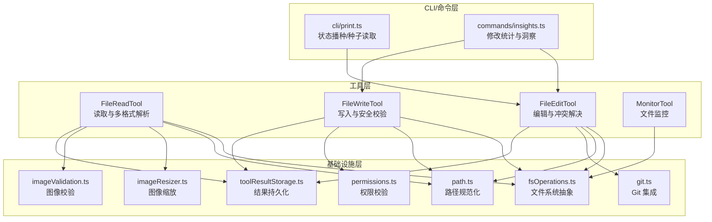
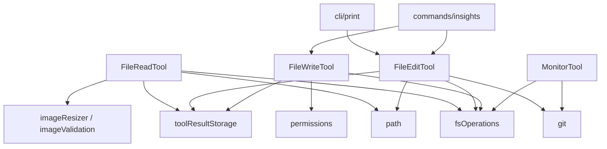
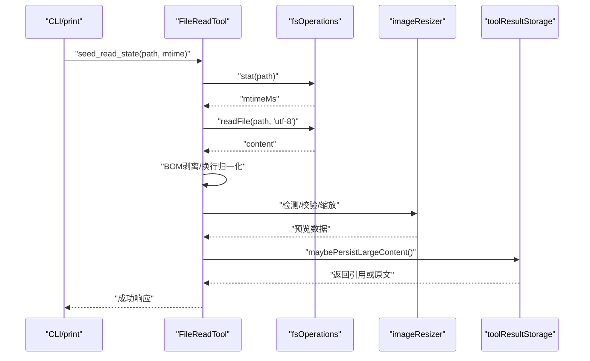
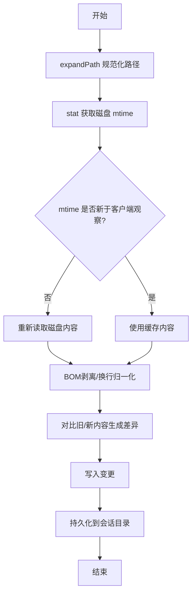
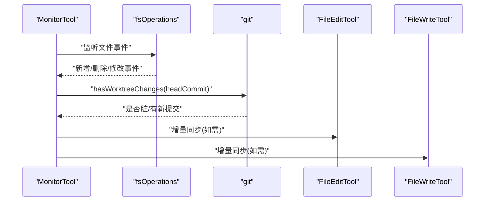
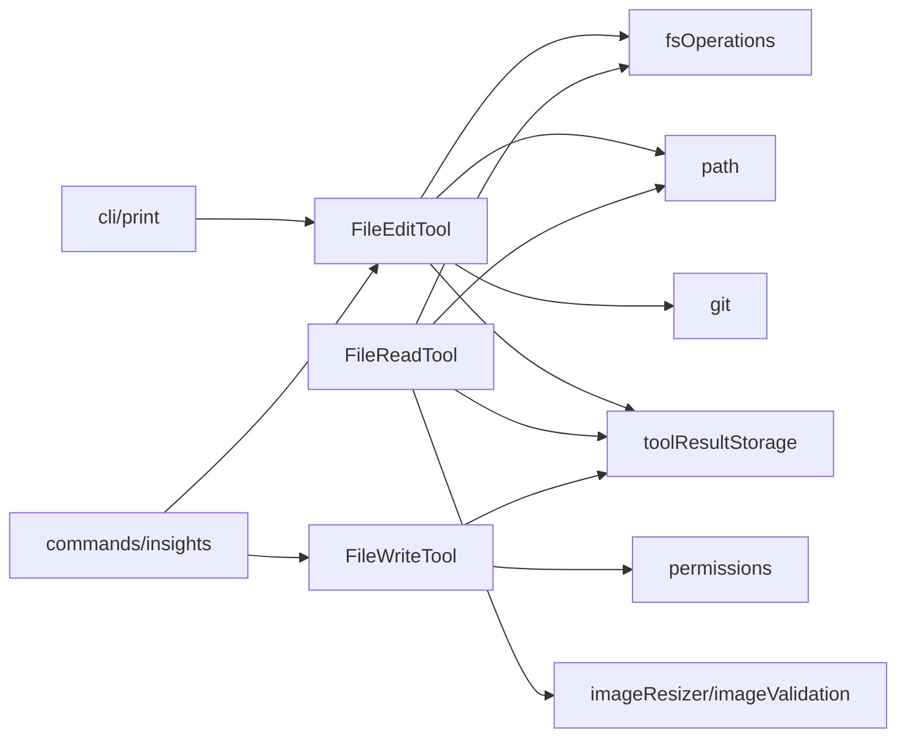

# 文件操作工具

<cite>
**本文引用的文件**
- [src/tools/FileEditTool/FileEditTool.ts](file://src/tools/FileEditTool/FileEditTool.ts)
- [src/tools/FileEditTool/constants.ts](file://src/tools/FileEditTool/constants.ts)
- [src/tools/FileEditTool/prompt.ts](file://src/tools/FileEditTool/prompt.ts)
- [src/tools/FileEditTool/types.ts](file://src/tools/FileEditTool/types.ts)
- [src/tools/FileEditTool/utils.ts](file://src/tools/FileEditTool/utils.ts)
- [src/tools/FileReadTool/FileReadTool.ts](file://src/tools/FileReadTool/FileReadTool.ts)
- [src/tools/FileReadTool/imageProcessor.ts](file://src/tools/FileReadTool/imageProcessor.ts)
- [src/tools/FileReadTool/limits.ts](file://src/tools/FileReadTool/limits.ts)
- [src/tools/FileReadTool/prompt.ts](file://src/tools/FileReadTool/prompt.ts)
- [src/tools/FileWriteTool/FileWriteTool.ts](file://src/tools/FileWriteTool/FileWriteTool.ts)
- [src/tools/FileWriteTool/prompt.ts](file://src/tools/FileWriteTool/prompt.ts)
- [src/tools/MonitorTool/MonitorTool.ts](file://src/tools/MonitorTool/MonitorTool.ts)
- [src/utils/fileRead.ts](file://src/utils/fileRead.ts)
- [src/utils/fsOperations.ts](file://src/utils/fsOperations.ts)
- [src/utils/git.ts](file://src/utils/git.ts)
- [src/utils/imageResizer.ts](file://src/utils/imageResizer.ts)
- [src/utils/imageValidation.ts](file://src/utils/imageValidation.ts)
- [src/utils/path.ts](file://src/utils/path.ts)
- [src/utils/permissions.ts](file://src/utils/permissions.ts)
- [src/utils/toolResultStorage.ts](file://src/utils/toolResultStorage.ts)
- [src/cli/print.ts](file://src/cli/print.ts)
- [src/commands/insights.ts](file://src/commands/insights.ts)
- [src/utils/worktree.ts](file://src/utils/worktree.ts)
- [src/setup.ts](file://src/setup.ts)
</cite>

## 目录
1. [简介](#简介)
2. [项目结构](#项目结构)
3. [核心组件](#核心组件)
4. [架构总览](#架构总览)
5. [详细组件分析](#详细组件分析)
6. [依赖关系分析](#依赖关系分析)
7. [性能考量](#性能考量)
8. [故障排查指南](#故障排查指南)
9. [结论](#结论)
10. [附录](#附录)

## 简介
本文件面向“文件操作工具”的设计与实现，聚焦以下目标：
- 深入解释文件编辑工具的文件系统抽象、编辑模式与冲突解决机制
- 详细说明文件读取工具的多格式支持、图像处理与大小限制
- 解释文件写入工具的安全验证与权限检查
- 提供文件操作工具的开发模板、性能优化与错误处理策略
- 包含文件监控、增量更新与版本控制集成

## 项目结构
文件操作工具由三大核心工具组成：文件读取(FileReadTool)、文件编辑(FileEditTool)、文件写入(FileWriteTool)，以及一个通用的文件监控(MonitorTool)。它们共享统一的文件系统抽象层与权限/安全校验模块，并通过 CLI 与命令行交互进行状态播种与结果持久化。

**图示来源**
- [src/tools/FileReadTool/FileReadTool.ts](file://src/tools/FileReadTool/FileReadTool.ts)
- [src/tools/FileEditTool/FileEditTool.ts](file://src/tools/FileEditTool/FileEditTool.ts)
- [src/tools/FileWriteTool/FileWriteTool.ts](file://src/tools/FileWriteTool/FileWriteTool.ts)
- [src/tools/MonitorTool/MonitorTool.ts](file://src/tools/MonitorTool/MonitorTool.ts)
- [src/utils/fsOperations.ts](file://src/utils/fsOperations.ts)
- [src/utils/path.ts](file://src/utils/path.ts)
- [src/utils/git.ts](file://src/utils/git.ts)
- [src/utils/imageResizer.ts](file://src/utils/imageResizer.ts)
- [src/utils/imageValidation.ts](file://src/utils/imageValidation.ts)
- [src/utils/permissions.ts](file://src/utils/permissions.ts)
- [src/utils/toolResultStorage.ts](file://src/utils/toolResultStorage.ts)
- [src/cli/print.ts](file://src/cli/print.ts)
- [src/commands/insights.ts](file://src/commands/insights.ts)

**章节来源**
- [src/tools/FileReadTool/FileReadTool.ts](file://src/tools/FileReadTool/FileReadTool.ts)
- [src/tools/FileEditTool/FileEditTool.ts](file://src/tools/FileEditTool/FileEditTool.ts)
- [src/tools/FileWriteTool/FileWriteTool.ts](file://src/tools/FileWriteTool/FileWriteTool.ts)
- [src/tools/MonitorTool/MonitorTool.ts](file://src/tools/MonitorTool/MonitorTool.ts)
- [src/utils/fsOperations.ts](file://src/utils/fsOperations.ts)
- [src/utils/path.ts](file://src/utils/path.ts)
- [src/utils/git.ts](file://src/utils/git.ts)
- [src/utils/imageResizer.ts](file://src/utils/imageResizer.ts)
- [src/utils/imageValidation.ts](file://src/utils/imageValidation.ts)
- [src/utils/permissions.ts](file://src/utils/permissions.ts)
- [src/utils/toolResultStorage.ts](file://src/utils/toolResultStorage.ts)
- [src/cli/print.ts](file://src/cli/print.ts)
- [src/commands/insights.ts](file://src/commands/insights.ts)

## 核心组件
- 文件读取工具(FileReadTool)
  - 支持文本与多种二进制格式（含图像）的读取与解析
  - 内置大小限制与超大内容落盘策略
  - 图像处理链路：格式检测、尺寸校验、缩放与预览
- 文件编辑工具(FileEditTool)
  - 基于文件系统抽象的编辑模式，支持精确替换与增量变更
  - 冲突解决：时间戳比较、内容归一化、缓存一致性
  - 结果持久化与会话隔离
- 文件写入工具(FileWriteTool)
  - 安全校验：路径合法性、权限检查、危险路径阻断
  - 权限模式与沙箱环境下的降级策略
- 文件监控工具(MonitorTool)
  - 基于文件系统事件的增量更新与版本控制集成
  - Git 工作树变更检测与提交边界管理

**章节来源**
- [src/tools/FileReadTool/FileReadTool.ts](file://src/tools/FileReadTool/FileReadTool.ts)
- [src/tools/FileEditTool/FileEditTool.ts](file://src/tools/FileEditTool/FileEditTool.ts)
- [src/tools/FileWriteTool/FileWriteTool.ts](file://src/tools/FileWriteTool/FileWriteTool.ts)
- [src/tools/MonitorTool/MonitorTool.ts](file://src/tools/MonitorTool/MonitorTool.ts)

## 架构总览
文件操作工具采用分层架构：
- 工具层：FileReadTool、FileEditTool、FileWriteTool、MonitorTool
- 基础设施层：文件系统抽象(fsOperations)、路径(path)、Git(git)、图像(imageResizer、imageValidation)
- 安全与存储：权限(permissions)、结果持久化(toolResultStorage)
- 交互层：CLI(cli/print)、命令行洞察(commands/insights)

**图示来源**
- [src/tools/FileReadTool/FileReadTool.ts](file://src/tools/FileReadTool/FileReadTool.ts)
- [src/tools/FileEditTool/FileEditTool.ts](file://src/tools/FileEditTool/FileEditTool.ts)
- [src/tools/FileWriteTool/FileWriteTool.ts](file://src/tools/FileWriteTool/FileWriteTool.ts)
- [src/tools/MonitorTool/MonitorTool.ts](file://src/tools/MonitorTool/MonitorTool.ts)
- [src/utils/fsOperations.ts](file://src/utils/fsOperations.ts)
- [src/utils/path.ts](file://src/utils/path.ts)
- [src/utils/git.ts](file://src/utils/git.ts)
- [src/utils/imageResizer.ts](file://src/utils/imageResizer.ts)
- [src/utils/imageValidation.ts](file://src/utils/imageValidation.ts)
- [src/utils/permissions.ts](file://src/utils/permissions.ts)
- [src/utils/toolResultStorage.ts](file://src/utils/toolResultStorage.ts)
- [src/cli/print.ts](file://src/cli/print.ts)
- [src/commands/insights.ts](file://src/commands/insights.ts)

## 详细组件分析

### 文件读取工具(FileReadTool)
- 多格式支持
  - 文本文件按 UTF-8 读取，剥离 BOM 并统一换行符为 LF
  - 图像文件通过 base64 数据流进行格式推断与校验
- 图像处理
  - 使用图像处理器对大图进行尺寸校验与缩放，生成预览
  - 对不规范的媒体类型字段进行标准化，确保跨客户端兼容
- 大小限制与落盘
  - 超过阈值的内容不被截断，而是持久化到磁盘，返回引用以避免内存压力
- 与 CLI 的协作
  - 在客户端观察到文件状态后，通过“种子读取”接口在服务端重新读取并缓存，保证一致性

**图示来源**
- [src/cli/print.ts](file://src/cli/print.ts)
- [src/tools/FileReadTool/FileReadTool.ts](file://src/tools/FileReadTool/FileReadTool.ts)
- [src/utils/fsOperations.ts](file://src/utils/fsOperations.ts)
- [src/utils/imageResizer.ts](file://src/utils/imageResizer.ts)
- [src/utils/toolResultStorage.ts](file://src/utils/toolResultStorage.ts)

**章节来源**
- [src/tools/FileReadTool/FileReadTool.ts](file://src/tools/FileReadTool/FileReadTool.ts)
- [src/tools/FileReadTool/imageProcessor.ts](file://src/tools/FileReadTool/imageProcessor.ts)
- [src/tools/FileReadTool/limits.ts](file://src/tools/FileReadTool/limits.ts)
- [src/tools/FileReadTool/prompt.ts](file://src/tools/FileReadTool/prompt.ts)
- [src/utils/toolResultStorage.ts](file://src/utils/toolResultStorage.ts)
- [src/cli/print.ts](file://src/cli/print.ts)

### 文件编辑工具(FileEditTool)
- 文件系统抽象
  - 统一路径规范化与展开，避免相对路径与波浪号差异导致的键缺失
  - 通过缓存与时间戳维护一致性，防止“观察到的旧内容”污染后续编辑
- 编辑模式与冲突解决
  - 内容归一化：Windows 换行统一为 LF，便于比较
  - 时间戳比较：仅在磁盘 mtime 不早于客户端观察时才播种，否则强制重新读取
  - 缓存一致性：当磁盘内容与缓存时间戳不一致时，触发重读并生成差异
- 结果持久化
  - 将编辑结果写入会话目录，支持 JSON/文本两种格式，便于回溯与审计

**图示来源**
- [src/cli/print.ts](file://src/cli/print.ts)
- [src/tools/FileEditTool/FileEditTool.ts](file://src/tools/FileEditTool/FileEditTool.ts)
- [src/utils/fsOperations.ts](file://src/utils/fsOperations.ts)

**章节来源**
- [src/tools/FileEditTool/FileEditTool.ts](file://src/tools/FileEditTool/FileEditTool.ts)
- [src/tools/FileEditTool/constants.ts](file://src/tools/FileEditTool/constants.ts)
- [src/tools/FileEditTool/prompt.ts](file://src/tools/FileEditTool/prompt.ts)
- [src/tools/FileEditTool/types.ts](file://src/tools/FileEditTool/types.ts)
- [src/tools/FileEditTool/utils.ts](file://src/tools/FileEditTool/utils.ts)
- [src/cli/print.ts](file://src/cli/print.ts)

### 文件写入工具(FileWriteTool)
- 安全验证
  - 路径合法性检查：禁止越权访问与危险路径（如根目录）
  - 权限模式校验：在“绕过权限”模式下，拒绝以 root/sudo 运行且非沙箱环境
  - 沙箱降级：在受限环境中自动降低权限与功能范围
- 权限检查
  - 严格区分可写目录与受保护路径，必要时提示用户授权或调整配置
- 结果持久化
  - 将写入结果以会话隔离的方式保存，便于后续审计与回滚

**图示来源**
- [src/tools/FileWriteTool/FileWriteTool.ts](file://src/tools/FileWriteTool/FileWriteTool.ts)
- [src/tools/FileWriteTool/prompt.ts](file://src/tools/FileWriteTool/prompt.ts)
- [src/utils/permissions.ts](file://src/utils/permissions.ts)
- [src/utils/toolResultStorage.ts](file://src/utils/toolResultStorage.ts)
- [src/setup.ts](file://src/setup.ts)

**章节来源**
- [src/tools/FileWriteTool/FileWriteTool.ts](file://src/tools/FileWriteTool/FileWriteTool.ts)
- [src/tools/FileWriteTool/prompt.ts](file://src/tools/FileWriteTool/prompt.ts)
- [src/utils/permissions.ts](file://src/utils/permissions.ts)
- [src/utils/toolResultStorage.ts](file://src/utils/toolResultStorage.ts)
- [src/setup.ts](file://src/setup.ts)

### 文件监控工具(MonitorTool)
- 增量更新
  - 基于文件系统事件的实时监控，识别新增、删除与修改
  - 与编辑/写入工具协同，仅对受影响文件进行增量处理
- 版本控制集成
  - 与 Git 工作树联动：检测未提交更改与新提交，决定是否保留或清理工作树
  - 提供提交边界管理，避免误删或覆盖他人提交

**图示来源**
- [src/tools/MonitorTool/MonitorTool.ts](file://src/tools/MonitorTool/MonitorTool.ts)
- [src/utils/fsOperations.ts](file://src/utils/fsOperations.ts)
- [src/utils/git.ts](file://src/utils/git.ts)
- [src/utils/worktree.ts](file://src/utils/worktree.ts)

**章节来源**
- [src/tools/MonitorTool/MonitorTool.ts](file://src/tools/MonitorTool/MonitorTool.ts)
- [src/utils/fsOperations.ts](file://src/utils/fsOperations.ts)
- [src/utils/git.ts](file://src/utils/git.ts)
- [src/utils/worktree.ts](file://src/utils/worktree.ts)

## 依赖关系分析
- 工具间耦合
  - FileEditTool 与 MonitorTool 共享文件系统抽象与 Git 集成
  - FileReadTool 与 FileWriteTool 共享路径规范化与结果持久化
- 外部依赖
  - 图像处理依赖 sharp 及其平台适配包
  - CLI 与命令行交互用于状态播种与结果审计

**图示来源**
- [src/tools/FileEditTool/FileEditTool.ts](file://src/tools/FileEditTool/FileEditTool.ts)
- [src/tools/FileReadTool/FileReadTool.ts](file://src/tools/FileReadTool/FileReadTool.ts)
- [src/tools/FileWriteTool/FileWriteTool.ts](file://src/tools/FileWriteTool/FileWriteTool.ts)
- [src/utils/fsOperations.ts](file://src/utils/fsOperations.ts)
- [src/utils/path.ts](file://src/utils/path.ts)
- [src/utils/git.ts](file://src/utils/git.ts)
- [src/utils/imageResizer.ts](file://src/utils/imageResizer.ts)
- [src/utils/imageValidation.ts](file://src/utils/imageValidation.ts)
- [src/utils/permissions.ts](file://src/utils/permissions.ts)
- [src/utils/toolResultStorage.ts](file://src/utils/toolResultStorage.ts)
- [src/cli/print.ts](file://src/cli/print.ts)
- [src/commands/insights.ts](file://src/commands/insights.ts)

**章节来源**
- [src/tools/FileEditTool/FileEditTool.ts](file://src/tools/FileEditTool/FileEditTool.ts)
- [src/tools/FileReadTool/FileReadTool.ts](file://src/tools/FileReadTool/FileReadTool.ts)
- [src/tools/FileWriteTool/FileWriteTool.ts](file://src/tools/FileWriteTool/FileWriteTool.ts)
- [src/utils/fsOperations.ts](file://src/utils/fsOperations.ts)
- [src/utils/path.ts](file://src/utils/path.ts)
- [src/utils/git.ts](file://src/utils/git.ts)
- [src/utils/imageResizer.ts](file://src/utils/imageResizer.ts)
- [src/utils/imageValidation.ts](file://src/utils/imageValidation.ts)
- [src/utils/permissions.ts](file://src/utils/permissions.ts)
- [src/utils/toolResultStorage.ts](file://src/utils/toolResultStorage.ts)
- [src/cli/print.ts](file://src/cli/print.ts)
- [src/commands/insights.ts](file://src/commands/insights.ts)

## 性能考量
- 读取路径
  - 文本读取前先做 BOM 剥离与换行归一化，减少后续比较成本
  - 大文件走落盘策略，避免内存峰值
- 编辑路径
  - 通过时间戳与缓存一致性判断，避免重复读取
  - 归一化内容后再比较，提高差异计算效率
- 写入路径
  - 权限检查前置，失败早返回，减少 IO 成本
  - 在沙箱环境下启用降级策略，保持可用性
- 监控路径
  - 事件驱动的增量更新，仅处理受影响文件
  - Git 变更检测采用轻量命令组合，失败即保守处理

[本节为通用性能建议，无需特定文件引用]

## 故障排查指南
- “文件未读取”或“内容为空”
  - 检查客户端观察时间与磁盘 mtime 的关系；若磁盘更新早于观察，需强制重新读取
  - 确认 BOM 与换行符是否被正确归一化
- “图像无法显示或格式错误”
  - 校验 base64 数据与媒体类型字段，确保标准化后的 media_type 存在
  - 检查图像尺寸与格式是否符合限制
- “写入被拒绝”
  - 确认路径是否在允许范围内，避免危险路径
  - 若处于“绕过权限”模式，请确认当前运行环境与权限级别
- “监控未生效”
  - 检查文件系统事件监听是否正常
  - 确认 Git 工作树状态：是否存在未提交更改或新提交

**章节来源**
- [src/cli/print.ts](file://src/cli/print.ts)
- [src/bridge/inboundMessages.ts](file://src/bridge/inboundMessages.ts)
- [src/utils/imageResizer.ts](file://src/utils/imageResizer.ts)
- [src/utils/permissions.ts](file://src/utils/permissions.ts)
- [src/utils/worktree.ts](file://src/utils/worktree.ts)

## 结论
文件操作工具通过清晰的分层设计与严格的权限/安全校验，在保证易用性的同时兼顾了安全性与可维护性。编辑工具的冲突解决与监控工具的增量更新，使得在复杂场景下也能稳定地进行文件变更与版本控制集成。

[本节为总结性内容，无需特定文件引用]

## 附录

### 开发模板与最佳实践
- 文件系统抽象
  - 所有路径必须经过规范化与展开，避免相对路径与波浪号差异
  - 读取前统一换行符，写入前进行必要的格式校验
- 编辑模式
  - 优先使用缓存与时间戳一致性判断，避免重复读取
  - 对比前进行内容归一化，减少误判
- 写入安全
  - 权限检查前置，失败早返回
  - 在沙箱或受限环境中启用降级策略
- 监控与版本控制
  - 增量更新优先，批量处理时注意事务性
  - Git 变更检测失败时采取保守策略，避免破坏工作树

[本节为通用指导，无需特定文件引用]