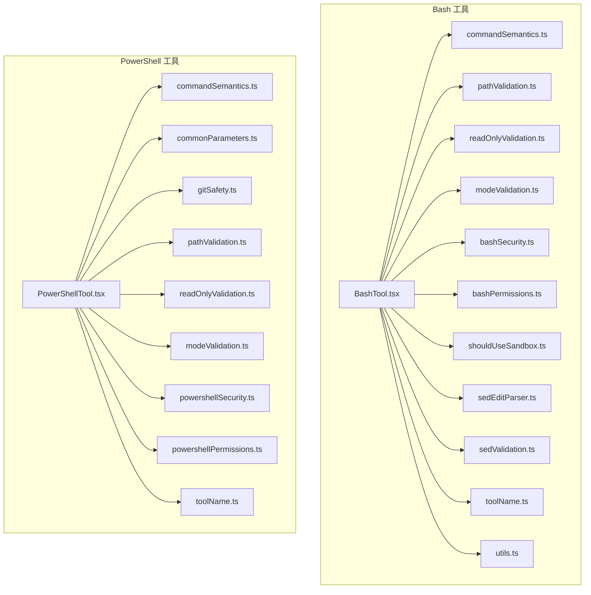
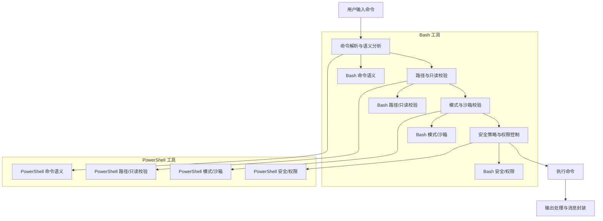
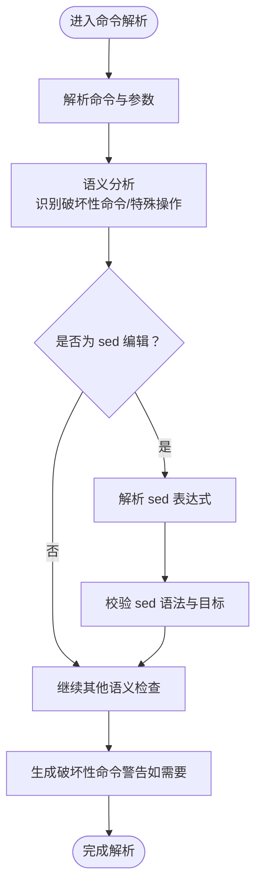
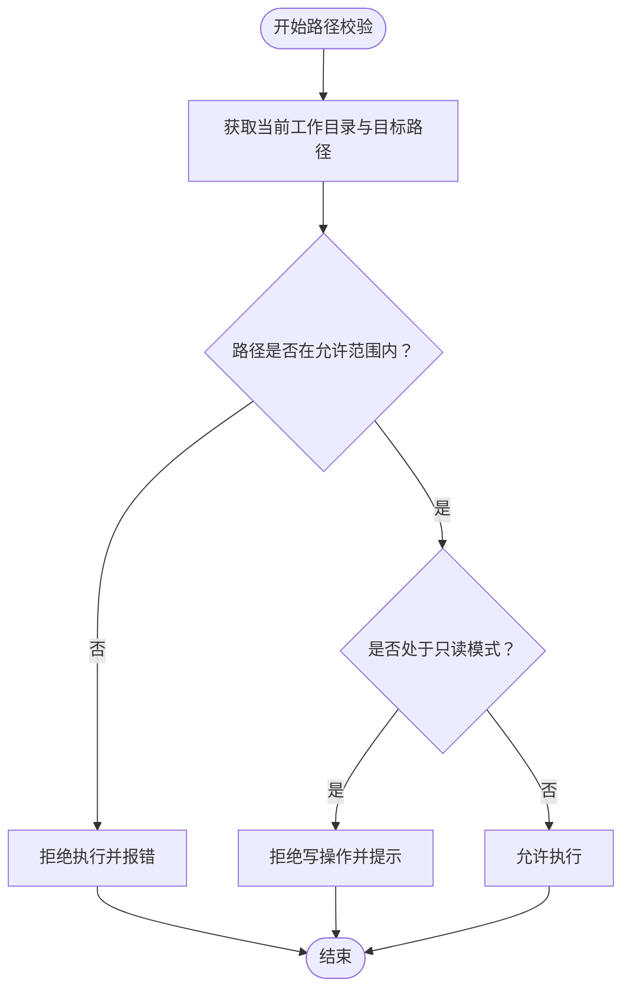
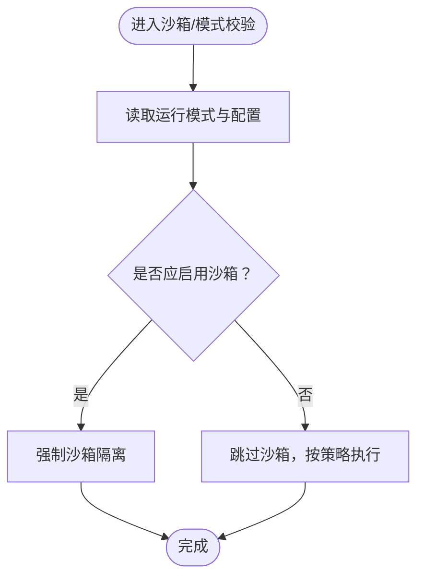
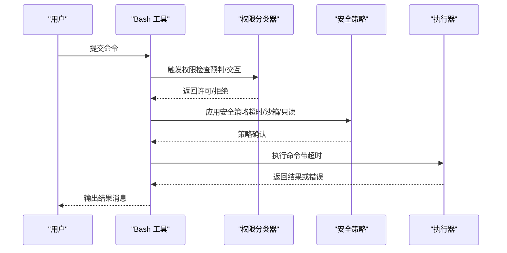
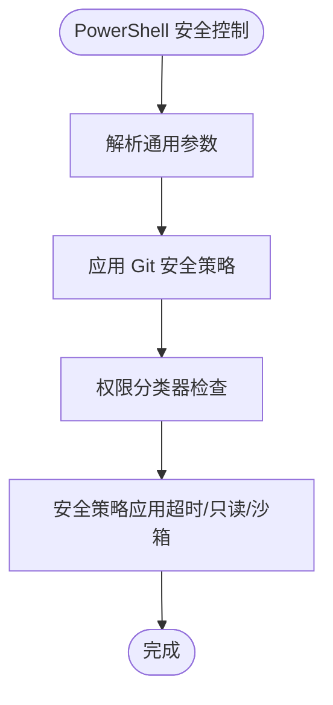
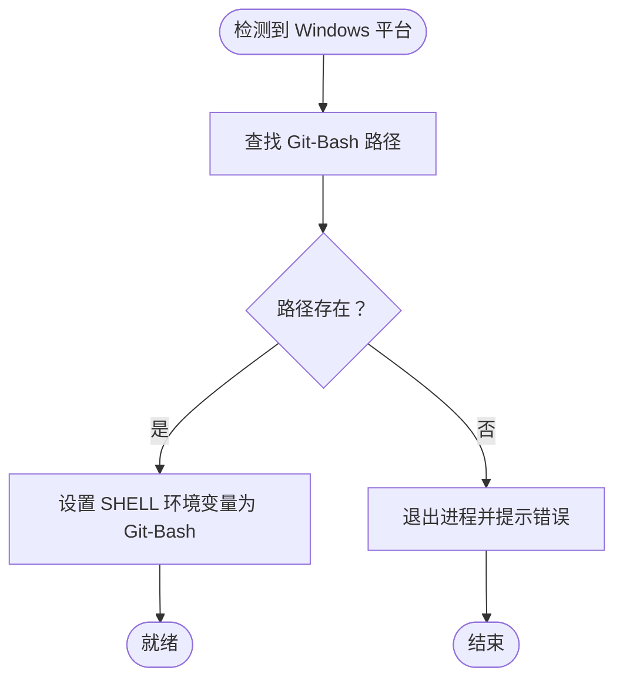
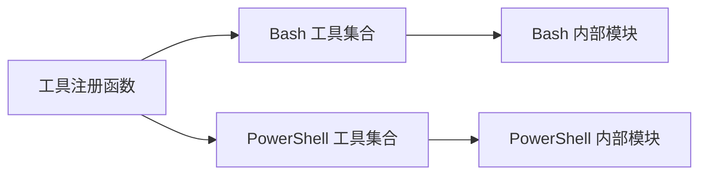

# 系统工具

<cite>
**本文引用的文件**
- [src/tools/BashTool/BashTool.tsx](file://src/tools/BashTool/BashTool.tsx)
- [src/tools/BashTool/commandSemantics.ts](file://src/tools/BashTool/commandSemantics.ts)
- [src/tools/BashTool/pathValidation.ts](file://src/tools/BashTool/pathValidation.ts)
- [src/tools/BashTool/readOnlyValidation.ts](file://src/tools/BashTool/readOnlyValidation.ts)
- [src/tools/BashTool/modeValidation.ts](file://src/tools/BashTool/modeValidation.ts)
- [src/tools/BashTool/bashSecurity.ts](file://src/tools/BashTool/bashSecurity.ts)
- [src/tools/BashTool/bashPermissions.ts](file://src/tools/BashTool/bashPermissions.ts)
- [src/tools/BashTool/shouldUseSandbox.ts](file://src/tools/BashTool/shouldUseSandbox.ts)
- [src/tools/BashTool/sedEditParser.ts](file://src/tools/BashTool/sedEditParser.ts)
- [src/tools/BashTool/sedValidation.ts](file://src/tools/BashTool/sedValidation.ts)
- [src/tools/BashTool/toolName.ts](file://src/tools/BashTool/toolName.ts)
- [src/tools/BashTool/utils.ts](file://src/tools/BashTool/utils.ts)
- [src/tools/PowerShellTool/PowerShellTool.tsx](file://src/tools/PowerShellTool/PowerShellTool.tsx)
- [src/tools/PowerShellTool/commandSemantics.ts](file://src/tools/PowerShellTool/commandSemantics.ts)
- [src/tools/PowerShellTool/commonParameters.ts](file://src/tools/PowerShellTool/commonParameters.ts)
- [src/tools/PowerShellTool/gitSafety.ts](file://src/tools/PowerShellTool/gitSafety.ts)
- [src/tools/PowerShellTool/pathValidation.ts](file://src/tools/PowerShellTool/pathValidation.ts)
- [src/tools/PowerShellTool/readOnlyValidation.ts](file://src/tools/PowerShellTool/readOnlyValidation.ts)
- [src/tools/PowerShellTool/modeValidation.ts](file://src/tools/PowerShellTool/modeValidation.ts)
- [src/tools/PowerShellTool/powershellSecurity.ts](file://src/tools/PowerShellTool/powershellSecurity.ts)
- [src/tools/PowerShellTool/powershellPermissions.ts](file://src/tools/PowerShellTool/powershellPermissions.ts)
- [src/tools/PowerShellTool/toolName.ts](file://src/tools/PowerShellTool/toolName.ts)
- [src/utils/timeouts.ts](file://src/utils/timeouts.ts)
- [src/utils/windowsPaths.ts](file://src/utils/windowsPaths.ts)
- [src/tools.ts](file://src/tools.ts)
</cite>

## 目录
1. [引言](#引言)
2. [项目结构](#项目结构)
3. [核心组件](#核心组件)
4. [架构总览](#架构总览)
5. [详细组件分析](#详细组件分析)
6. [依赖关系分析](#依赖关系分析)
7. [性能考量](#性能考量)
8. [故障排除指南](#故障排除指南)
9. [结论](#结论)
10. [附录](#附录)

## 引言
本文件面向系统工具（Bash 工具与 PowerShell 工具）的开发者与使用者，系统化阐述命令解析、执行机制、安全控制与权限管理。重点覆盖以下方面：
- 命令语义分析：识别破坏性命令、解析 sed 编辑、校验路径与只读模式
- 路径验证与沙箱隔离：限制工作目录与可访问路径，结合只读模式与沙箱开关
- 安全控制：超时、权限分类器、破坏性命令警告、Git 安全策略
- 输出处理：结果消息封装与展示
- 开发模板与最佳实践：命令解析流程、安全基线、性能优化
- 跨平台兼容：Windows 下 Git-Bash 兼容与环境变量设置
- 错误恢复策略：超时、异常捕获与回退

## 项目结构
系统工具位于 src/tools 目录下，分别提供 BashTool 与 PowerShellTool 两大子模块。每个子模块内含命令解析、路径与只读校验、模式与沙箱判断、安全策略、权限与提示等文件。

图表来源
- [src/tools/BashTool/BashTool.tsx](file://src/tools/BashTool/BashTool.tsx)
- [src/tools/BashTool/commandSemantics.ts](file://src/tools/BashTool/commandSemantics.ts)
- [src/tools/BashTool/pathValidation.ts](file://src/tools/BashTool/pathValidation.ts)
- [src/tools/BashTool/readOnlyValidation.ts](file://src/tools/BashTool/readOnlyValidation.ts)
- [src/tools/BashTool/modeValidation.ts](file://src/tools/BashTool/modeValidation.ts)
- [src/tools/BashTool/bashSecurity.ts](file://src/tools/BashTool/bashSecurity.ts)
- [src/tools/BashTool/bashPermissions.ts](file://src/tools/BashTool/bashPermissions.ts)
- [src/tools/BashTool/shouldUseSandbox.ts](file://src/tools/BashTool/shouldUseSandbox.ts)
- [src/tools/BashTool/sedEditParser.ts](file://src/tools/BashTool/sedEditParser.ts)
- [src/tools/BashTool/sedValidation.ts](file://src/tools/BashTool/sedValidation.ts)
- [src/tools/BashTool/toolName.ts](file://src/tools/BashTool/toolName.ts)
- [src/tools/BashTool/utils.ts](file://src/tools/BashTool/utils.ts)
- [src/tools/PowerShellTool/PowerShellTool.tsx](file://src/tools/PowerShellTool/PowerShellTool.tsx)
- [src/tools/PowerShellTool/commandSemantics.ts](file://src/tools/PowerShellTool/commandSemantics.ts)
- [src/tools/PowerShellTool/commonParameters.ts](file://src/tools/PowerShellTool/commonParameters.ts)
- [src/tools/PowerShellTool/gitSafety.ts](file://src/tools/PowerShellTool/gitSafety.ts)
- [src/tools/PowerShellTool/pathValidation.ts](file://src/tools/PowerShellTool/pathValidation.ts)
- [src/tools/PowerShellTool/readOnlyValidation.ts](file://src/tools/PowerShellTool/readOnlyValidation.ts)
- [src/tools/PowerShellTool/modeValidation.ts](file://src/tools/PowerShellTool/modeValidation.ts)
- [src/tools/PowerShellTool/powershellSecurity.ts](file://src/tools/PowerShellTool/powershellSecurity.ts)
- [src/tools/PowerShellTool/powershellPermissions.ts](file://src/tools/PowerShellTool/powershellPermissions.ts)
- [src/tools/PowerShellTool/toolName.ts](file://src/tools/PowerShellTool/toolName.ts)

章节来源
- [src/tools.ts:271-298](file://src/tools.ts#L271-L298)

## 核心组件
- Bash 工具：负责在 Bash 环境中解析与执行命令，进行路径与只读校验、破坏性命令警告、沙箱选择与安全策略应用，并将结果以统一的消息格式返回。
- PowerShell 工具：负责在 PowerShell 环境中解析与执行命令，进行路径与只读校验、破坏性命令警告、Git 安全策略与权限控制，并将结果以统一的消息格式返回。
- 工具名称与工具注册：通过工具名称常量与工具注册逻辑，确保工具在系统中被正确识别与调用。

章节来源
- [src/tools/BashTool/toolName.ts](file://src/tools/BashTool/toolName.ts)
- [src/tools/PowerShellTool/toolName.ts](file://src/tools/PowerShellTool/toolName.ts)
- [src/tools.ts:271-298](file://src/tools.ts#L271-L298)

## 架构总览
系统工具采用“命令解析—权限与安全—执行—输出”的分层架构。Bash 与 PowerShell 工具共享相似的职责边界，但在具体实现上针对各自 Shell 的特性进行适配。

图表来源
- [src/tools/BashTool/BashTool.tsx](file://src/tools/BashTool/BashTool.tsx)
- [src/tools/BashTool/commandSemantics.ts](file://src/tools/BashTool/commandSemantics.ts)
- [src/tools/BashTool/pathValidation.ts](file://src/tools/BashTool/pathValidation.ts)
- [src/tools/BashTool/readOnlyValidation.ts](file://src/tools/BashTool/readOnlyValidation.ts)
- [src/tools/BashTool/modeValidation.ts](file://src/tools/BashTool/modeValidation.ts)
- [src/tools/BashTool/bashSecurity.ts](file://src/tools/BashTool/bashSecurity.ts)
- [src/tools/BashTool/bashPermissions.ts](file://src/tools/BashTool/bashPermissions.ts)
- [src/tools/BashTool/shouldUseSandbox.ts](file://src/tools/BashTool/shouldUseSandbox.ts)
- [src/tools/PowerShellTool/PowerShellTool.tsx](file://src/tools/PowerShellTool/PowerShellTool.tsx)
- [src/tools/PowerShellTool/commandSemantics.ts](file://src/tools/PowerShellTool/commandSemantics.ts)
- [src/tools/PowerShellTool/pathValidation.ts](file://src/tools/PowerShellTool/pathValidation.ts)
- [src/tools/PowerShellTool/readOnlyValidation.ts](file://src/tools/PowerShellTool/readOnlyValidation.ts)
- [src/tools/PowerShellTool/modeValidation.ts](file://src/tools/PowerShellTool/modeValidation.ts)
- [src/tools/PowerShellTool/powershellSecurity.ts](file://src/tools/PowerShellTool/powershellSecurity.ts)
- [src/tools/PowerShellTool/powershellPermissions.ts](file://src/tools/PowerShellTool/powershellPermissions.ts)

## 详细组件分析

### Bash 工具

#### 命令解析与语义分析
- 作用：识别命令类型、参数与潜在破坏性操作；支持 sed 编辑解析与校验。
- 关键点：对常见破坏性命令进行标记与警告；解析 sed 表达式，确保替换语法与目标路径安全。

图表来源
- [src/tools/BashTool/commandSemantics.ts](file://src/tools/BashTool/commandSemantics.ts)
- [src/tools/BashTool/sedEditParser.ts](file://src/tools/BashTool/sedEditParser.ts)
- [src/tools/BashTool/sedValidation.ts](file://src/tools/BashTool/sedValidation.ts)

章节来源
- [src/tools/BashTool/commandSemantics.ts](file://src/tools/BashTool/commandSemantics.ts)
- [src/tools/BashTool/sedEditParser.ts](file://src/tools/BashTool/sedEditParser.ts)
- [src/tools/BashTool/sedValidation.ts](file://src/tools/BashTool/sedValidation.ts)

#### 路径验证与只读模式
- 作用：限制命令可访问的路径范围，避免越权写入；在只读模式下拒绝写操作。
- 关键点：基于当前工作目录与白名单路径进行校验；对写类操作进行只读模式拦截。

图表来源
- [src/tools/BashTool/pathValidation.ts](file://src/tools/BashTool/pathValidation.ts)
- [src/tools/BashTool/readOnlyValidation.ts](file://src/tools/BashTool/readOnlyValidation.ts)

章节来源
- [src/tools/BashTool/pathValidation.ts](file://src/tools/BashTool/pathValidation.ts)
- [src/tools/BashTool/readOnlyValidation.ts](file://src/tools/BashTool/readOnlyValidation.ts)

#### 模式与沙箱校验
- 作用：根据运行模式与配置决定是否启用沙箱隔离，降低高风险命令的影响面。
- 关键点：沙箱开关判断、模式约束与权限上下文联动。

图表来源
- [src/tools/BashTool/modeValidation.ts](file://src/tools/BashTool/modeValidation.ts)
- [src/tools/BashTool/shouldUseSandbox.ts](file://src/tools/BashTool/shouldUseSandbox.ts)

章节来源
- [src/tools/BashTool/modeValidation.ts](file://src/tools/BashTool/modeValidation.ts)
- [src/tools/BashTool/shouldUseSandbox.ts](file://src/tools/BashTool/shouldUseSandbox.ts)

#### 安全控制与权限
- 作用：超时控制、权限分类器、破坏性命令警告、安全策略应用。
- 关键点：默认与最大 Bash 超时配置；交互式/预判式权限检查；破坏性命令提示。

图表来源
- [src/tools/BashTool/bashPermissions.ts](file://src/tools/BashTool/bashPermissions.ts)
- [src/tools/BashTool/bashSecurity.ts](file://src/tools/BashTool/bashSecurity.ts)
- [src/utils/timeouts.ts](file://src/utils/timeouts.ts)

章节来源
- [src/tools/BashTool/bashPermissions.ts](file://src/tools/BashTool/bashPermissions.ts)
- [src/tools/BashTool/bashSecurity.ts](file://src/tools/BashTool/bashSecurity.ts)
- [src/utils/timeouts.ts](file://src/utils/timeouts.ts)

#### 输出处理
- 作用：将执行结果封装为统一的消息格式，便于前端展示与后续处理。
- 关键点：结果消息组件与工具输出格式规范。

章节来源
- [src/tools/BashTool/BashTool.tsx](file://src/tools/BashTool/BashTool.tsx)
- [src/tools/BashTool/BashToolResultMessage.tsx](file://src/tools/BashTool/BashToolResultMessage.tsx)

### PowerShell 工具

#### 命令解析与语义分析
- 作用：解析 PowerShell 命令与参数，识别破坏性操作与 Git 相关命令。
- 关键点：PowerShell 特有的参数与管道语法；对 Git 命令的安全性进行额外校验。

章节来源
- [src/tools/PowerShellTool/commandSemantics.ts](file://src/tools/PowerShellTool/commandSemantics.ts)
- [src/tools/PowerShellTool/commonParameters.ts](file://src/tools/PowerShellTool/commonParameters.ts)

#### 路径验证与只读模式
- 作用：与 Bash 工具类似，限制路径访问并阻止只读模式下的写操作。
- 关键点：针对 PowerShell 的路径语义进行适配。

章节来源
- [src/tools/PowerShellTool/pathValidation.ts](file://src/tools/PowerShellTool/pathValidation.ts)
- [src/tools/PowerShellTool/readOnlyValidation.ts](file://src/tools/PowerShellTool/readOnlyValidation.ts)

#### 模式与沙箱校验
- 作用：根据运行模式与配置决定是否启用沙箱隔离。
- 关键点：与 Bash 工具一致的沙箱策略与模式约束。

章节来源
- [src/tools/PowerShellTool/modeValidation.ts](file://src/tools/PowerShellTool/modeValidation.ts)

#### 安全控制与权限
- 作用：应用 PowerShell 安全策略、权限控制与破坏性命令警告。
- 关键点：Git 安全策略（gitSafety）、权限分类器与安全策略模块。

图表来源
- [src/tools/PowerShellTool/gitSafety.ts](file://src/tools/PowerShellTool/gitSafety.ts)
- [src/tools/PowerShellTool/powershellPermissions.ts](file://src/tools/PowerShellTool/powershellPermissions.ts)
- [src/tools/PowerShellTool/powershellSecurity.ts](file://src/tools/PowerShellTool/powershellSecurity.ts)

章节来源
- [src/tools/PowerShellTool/gitSafety.ts](file://src/tools/PowerShellTool/gitSafety.ts)
- [src/tools/PowerShellTool/powershellPermissions.ts](file://src/tools/PowerShellTool/powershellPermissions.ts)
- [src/tools/PowerShellTool/powershellSecurity.ts](file://src/tools/PowerShellTool/powershellSecurity.ts)

#### 输出处理
- 作用：将执行结果封装为统一的消息格式，便于前端展示与后续处理。
- 关键点：结果消息组件与工具输出格式规范。

章节来源
- [src/tools/PowerShellTool/PowerShellTool.tsx](file://src/tools/PowerShellTool/PowerShellTool.tsx)

### 跨平台兼容性与环境设置
- Windows 下通过设置 SHELL 环境变量指向 Git-Bash，确保 Bash 工具在 Windows 上可用。
- 提供 Git-Bash 路径探测与存在性检查，必要时退出进程以避免不可预期行为。

图表来源
- [src/utils/windowsPaths.ts:87-117](file://src/utils/windowsPaths.ts#L87-L117)

章节来源
- [src/utils/windowsPaths.ts:87-117](file://src/utils/windowsPaths.ts#L87-L117)

## 依赖关系分析
- 工具注册：通过工具注册函数返回 Bash、PowerShell 及其他工具集合，支持简单模式与协调者模式下的工具裁剪。
- 组件耦合：Bash 与 PowerShell 工具内部模块高度内聚，分别依赖各自的解析、校验与安全模块；两者共享工具名称与工具注册入口。

图表来源
- [src/tools.ts:271-298](file://src/tools.ts#L271-L298)

章节来源
- [src/tools.ts:271-298](file://src/tools.ts#L271-L298)

## 性能考量
- 超时控制：提供默认与最大 Bash 超时配置，避免长时间阻塞；建议根据任务复杂度调整环境变量。
- I/O 与缓冲：合理设置输出缓冲与流处理，避免大输出导致内存压力。
- 权限预检：通过预判式权限检查减少无效执行次数，提升响应速度。
- 沙箱隔离：在高风险场景启用沙箱，降低系统级开销与副作用。

章节来源
- [src/utils/timeouts.ts:1-39](file://src/utils/timeouts.ts#L1-L39)

## 故障排除指南
- 命令被拒绝：检查路径是否在允许范围内、是否处于只读模式、是否触发破坏性命令警告。
- 权限不足：确认权限分类器是否已授权，必要时走交互式审批流程。
- 超时失败：调整 BASH_DEFAULT_TIMEOUT_MS 或 BASH_MAX_TIMEOUT_MS 环境变量。
- Windows 下无法执行 Bash：确认 Git-Bash 路径存在且 SHELL 环境变量已设置。

章节来源
- [src/tools/BashTool/pathValidation.ts](file://src/tools/BashTool/pathValidation.ts)
- [src/tools/BashTool/readOnlyValidation.ts](file://src/tools/BashTool/readOnlyValidation.ts)
- [src/tools/BashTool/bashPermissions.ts](file://src/tools/BashTool/bashPermissions.ts)
- [src/utils/timeouts.ts:1-39](file://src/utils/timeouts.ts#L1-L39)
- [src/utils/windowsPaths.ts:87-117](file://src/utils/windowsPaths.ts#L87-L117)

## 结论
Bash 与 PowerShell 工具通过“命令解析—路径与只读校验—模式与沙箱—安全与权限—执行—输出”的完整链路，实现了跨平台、可审计、可恢复的系统命令执行能力。建议在生产环境中严格启用沙箱与只读模式、合理配置超时、完善权限审批与破坏性命令警告，以获得更高的安全性与稳定性。

## 附录

### 开发模板与最佳实践
- 命令解析流程
  - 解析命令与参数
  - 进行语义分析（识别破坏性命令、sed 编辑等）
  - 应用路径与只读校验
  - 判断模式与沙箱策略
  - 触发权限检查与安全策略
  - 执行并捕获输出
  - 封装为统一消息格式
- 安全最佳实践
  - 默认启用只读模式与沙箱
  - 对破坏性命令进行显式警告
  - 使用权限分类器进行预判与交互式审批
  - 合理设置超时，防止长时间阻塞
- 性能优化技巧
  - 预判权限减少无效执行
  - 控制输出大小，避免内存峰值
  - 在 Windows 使用 Git-Bash 时缓存路径探测结果
- 跨平台兼容性
  - Windows 设置 SHELL 指向 Git-Bash
  - 针对不同 Shell 的路径与参数差异进行适配
- 错误恢复策略
  - 超时自动终止并返回错误信息
  - 捕获异常并进行降级输出
  - 在权限不足时引导用户进行授权