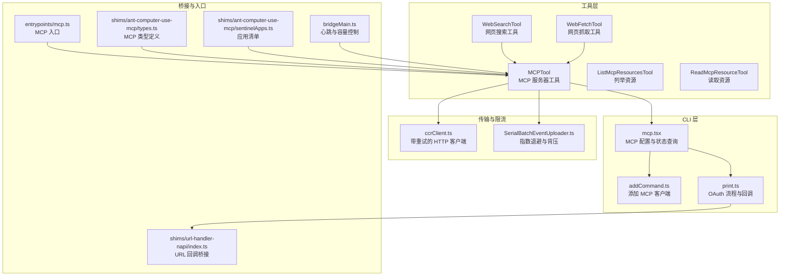
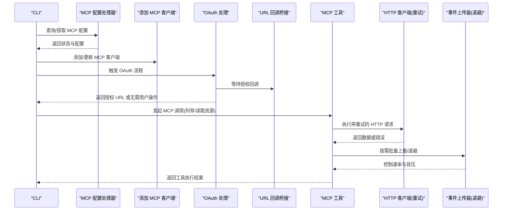
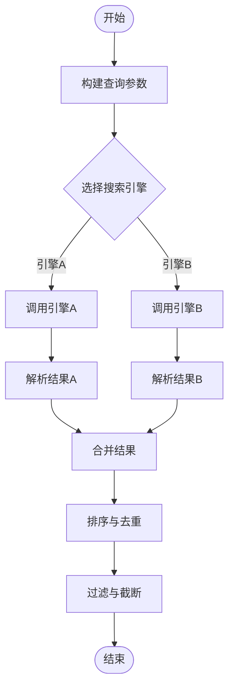
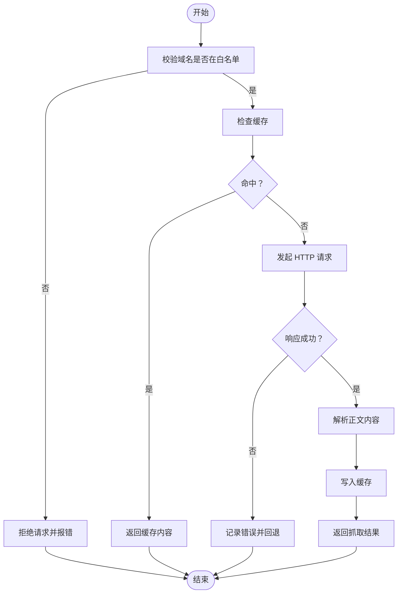
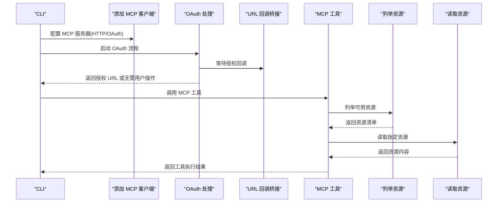
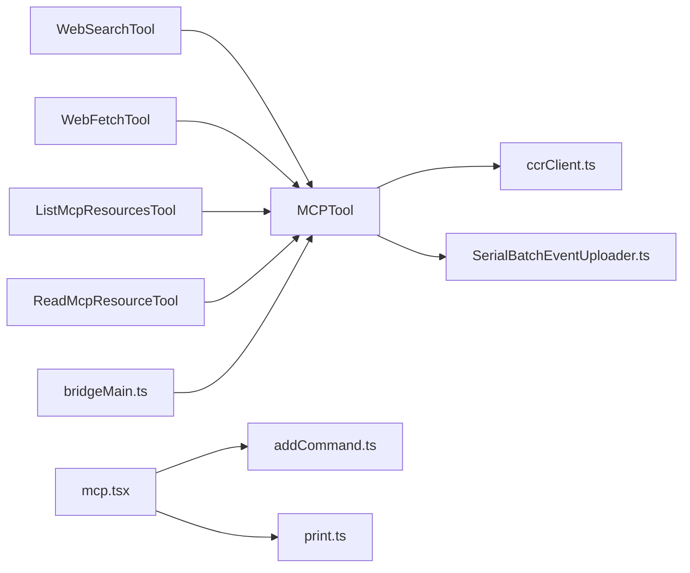

# 网络工具

<cite>
**本文引用的文件**
- [WebSearchTool.ts](file://src/tools/WebSearchTool/WebSearchTool.ts)
- [WebFetchTool.ts](file://src/tools/WebFetchTool/WebFetchTool.ts)
- [MCPTool.ts](file://src/tools/MCPTool/MCPTool.ts)
- [ListMcpResourcesTool.ts](file://src/tools/ListMcpResourcesTool/ListMcpResourcesTool.ts)
- [ReadMcpResourceTool.ts](file://src/tools/ReadMcpResourceTool/ReadMcpResourceTool.ts)
- [mcp.tsx](file://src/cli/handlers/mcp.tsx)
- [addCommand.ts](file://src/commands/mcp/addCommand.ts)
- [print.ts](file://src/cli/print.ts)
- [ccrClient.ts](file://src/cli/transports/ccrClient.ts)
- [SerialBatchEventUploader.ts](file://src/cli/transports/SerialBatchEventUploader.ts)
- [bridgeMain.ts](file://src/bridge/bridgeMain.ts)
- [index.ts](file://shims/url-handler-napi/index.ts)
- [init.ts](file://src/entrypoints/mcp.ts)
- [types.ts](file://shims/ant-computer-use-mcp/types.ts)
- [sentinelApps.ts](file://shims/ant-computer-use-mcp/sentinelApps.ts)
</cite>

## 目录
1. [简介](#简介)
2. [项目结构](#项目结构)
3. [核心组件](#核心组件)
4. [架构总览](#架构总览)
5. [详细组件分析](#详细组件分析)
6. [依赖关系分析](#依赖关系分析)
7. [性能考虑](#性能考虑)
8. [故障排查指南](#故障排查指南)
9. [结论](#结论)
10. [附录](#附录)

## 简介
本文件系统性梳理与网络相关的核心工具，包括网页搜索工具、网页抓取工具以及 MCP（Model Context Protocol）资源工具。内容覆盖以下方面：
- 网页搜索工具：搜索引擎集成方式、查询参数与结果排序机制
- 网页抓取工具：HTTP 请求处理、缓存策略与预批准域名管理
- MCP 资源工具：协议支持、认证流程与客户端配置
- 开发模板、安全最佳实践与性能优化技巧
- 并发控制、重试机制与速率限制处理

## 项目结构
网络工具主要分布在 tools 目录下的专用工具实现中，并通过 CLI 和桥接层进行统一接入与管理。

图表来源
- [WebSearchTool.ts](file://src/tools/WebSearchTool/WebSearchTool.ts)
- [WebFetchTool.ts](file://src/tools/WebFetchTool/WebFetchTool.ts)
- [MCPTool.ts](file://src/tools/MCPTool/MCPTool.ts)
- [ListMcpResourcesTool.ts](file://src/tools/ListMcpResourcesTool/ListMcpResourcesTool.ts)
- [ReadMcpResourceTool.ts](file://src/tools/ReadMcpResourceTool/ReadMcpResourceTool.ts)
- [mcp.tsx](file://src/cli/handlers/mcp.tsx)
- [addCommand.ts](file://src/commands/mcp/addCommand.ts)
- [print.ts](file://src/cli/print.ts)
- [ccrClient.ts](file://src/cli/transports/ccrClient.ts)
- [SerialBatchEventUploader.ts](file://src/cli/transports/SerialBatchEventUploader.ts)
- [bridgeMain.ts](file://src/bridge/bridgeMain.ts)
- [index.ts](file://shims/url-handler-napi/index.ts)
- [init.ts](file://src/entrypoints/mcp.ts)
- [types.ts](file://shims/ant-computer-use-mcp/types.ts)
- [sentinelApps.ts](file://shims/ant-computer-use-mcp/sentinelApps.ts)

章节来源
- [WebSearchTool.ts](file://src/tools/WebSearchTool/WebSearchTool.ts)
- [WebFetchTool.ts](file://src/tools/WebFetchTool/WebFetchTool.ts)
- [MCPTool.ts](file://src/tools/MCPTool/MCPTool.ts)
- [ListMcpResourcesTool.ts](file://src/tools/ListMcpResourcesTool/ListMcpResourcesTool.ts)
- [ReadMcpResourceTool.ts](file://src/tools/ReadMcpResourceTool/ReadMcpResourceTool.ts)
- [mcp.tsx](file://src/cli/handlers/mcp.tsx)
- [addCommand.ts](file://src/commands/mcp/addCommand.ts)
- [print.ts](file://src/cli/print.ts)
- [ccrClient.ts](file://src/cli/transports/ccrClient.ts)
- [SerialBatchEventUploader.ts](file://src/cli/transports/SerialBatchEventUploader.ts)
- [bridgeMain.ts](file://src/bridge/bridgeMain.ts)
- [index.ts](file://shims/url-handler-napi/index.ts)
- [init.ts](file://src/entrypoints/mcp.ts)
- [types.ts](file://shims/ant-computer-use-mcp/types.ts)
- [sentinelApps.ts](file://shims/ant-computer-use-mcp/sentinelApps.ts)

## 核心组件
- 网页搜索工具：封装搜索引擎调用、参数构建与结果排序逻辑
- 网页抓取工具：负责 HTTP 请求、响应解析、缓存命中与预批准域名校验
- MCP 资源工具：支持列举与读取远端资源，配合认证与重连机制
- CLI 与桥接：提供 MCP 配置、健康检查、OAuth 流程与回调处理
- 传输与限流：统一的重试、退避与背压策略，保障稳定性

章节来源
- [WebSearchTool.ts](file://src/tools/WebSearchTool/WebSearchTool.ts)
- [WebFetchTool.ts](file://src/tools/WebFetchTool/WebFetchTool.ts)
- [MCPTool.ts](file://src/tools/MCPTool/MCPTool.ts)
- [ListMcpResourcesTool.ts](file://src/tools/ListMcpResourcesTool/ListMcpResourcesTool.ts)
- [ReadMcpResourceTool.ts](file://src/tools/ReadMcpResourceTool/ReadMcpResourceTool.ts)
- [mcp.tsx](file://src/cli/handlers/mcp.tsx)
- [addCommand.ts](file://src/commands/mcp/addCommand.ts)
- [print.ts](file://src/cli/print.ts)
- [ccrClient.ts](file://src/cli/transports/ccrClient.ts)
- [SerialBatchEventUploader.ts](file://src/cli/transports/SerialBatchEventUploader.ts)
- [bridgeMain.ts](file://src/bridge/bridgeMain.ts)

## 架构总览
下图展示从 CLI 到 MCP 工具链的整体交互，包括认证、重连与资源访问路径。

图表来源
- [mcp.tsx](file://src/cli/handlers/mcp.tsx)
- [addCommand.ts](file://src/commands/mcp/addCommand.ts)
- [print.ts](file://src/cli/print.ts)
- [index.ts](file://shims/url-handler-napi/index.ts)
- [MCPTool.ts](file://src/tools/MCPTool/MCPTool.ts)
- [ccrClient.ts](file://src/cli/transports/ccrClient.ts)
- [SerialBatchEventUploader.ts](file://src/cli/transports/SerialBatchEventUploader.ts)

## 详细组件分析

### 网页搜索工具（WebSearchTool）
职责与特性
- 封装搜索引擎调用，负责关键词拼装、查询参数标准化与结果排序
- 支持多引擎切换与排序策略配置
- 输出结构化结果，便于上层工具进一步处理

关键点
- 引擎集成：通过统一接口对接不同搜索引擎，屏蔽差异
- 排序机制：基于相关性、时效性与权威度等维度进行综合排序
- 结果过滤：可按域名白名单、语言偏好等进行二次筛选

图表来源
- [WebSearchTool.ts](file://src/tools/WebSearchTool/WebSearchTool.ts)

章节来源
- [WebSearchTool.ts](file://src/tools/WebSearchTool/WebSearchTool.ts)

### 网页抓取工具（WebFetchTool）
职责与特性
- 执行 HTTP 请求，解析响应并提取正文内容
- 实现缓存命中与失效策略，减少重复请求
- 域名白名单校验，仅允许预批准域名访问

关键点
- 请求处理：设置超时、User-Agent、自定义头部
- 缓存策略：命中则直接返回缓存；未命中则请求后写入缓存
- 预批准域名：对目标 URL 进行域名匹配，拒绝不在白名单内的请求
- 错误处理：区分网络错误、解析错误与业务错误，分别记录与回退

图表来源
- [WebFetchTool.ts](file://src/tools/WebFetchTool/WebFetchTool.ts)

章节来源
- [WebFetchTool.ts](file://src/tools/WebFetchTool/WebFetchTool.ts)

### MCP 资源工具（MCPTool、ListMcpResourcesTool、ReadMcpResourceTool）
职责与特性
- MCPTool：统一的 MCP 服务器接入与调用入口
- ListMcpResourcesTool：列举可用资源列表
- ReadMcpResourceTool：读取指定资源内容

认证与重连
- OAuth 流程：CLI 触发授权，等待回调 URL，必要时自动重连
- 回调处理：通过 URL 回调桥接接收授权完成信号
- 重连策略：授权完成后自动重建连接并刷新工具注册

图表来源
- [addCommand.ts](file://src/commands/mcp/addCommand.ts)
- [print.ts](file://src/cli/print.ts)
- [index.ts](file://shims/url-handler-napi/index.ts)
- [MCPTool.ts](file://src/tools/MCPTool/MCPTool.ts)
- [ListMcpResourcesTool.ts](file://src/tools/ListMcpResourcesTool/ListMcpResourcesTool.ts)
- [ReadMcpResourceTool.ts](file://src/tools/ReadMcpResourceTool/ReadMcpResourceTool.ts)

章节来源
- [MCPTool.ts](file://src/tools/MCPTool/MCPTool.ts)
- [ListMcpResourcesTool.ts](file://src/tools/ListMcpResourcesTool/ListMcpResourcesTool.ts)
- [ReadMcpResourceTool.ts](file://src/tools/ReadMcpResourceTool/ReadMcpResourceTool.ts)
- [addCommand.ts](file://src/commands/mcp/addCommand.ts)
- [print.ts](file://src/cli/print.ts)
- [index.ts](file://shims/url-handler-napi/index.ts)

## 依赖关系分析
- 工具层依赖 MCP 工具作为统一入口，结合 CLI 的配置与认证能力
- 传输层提供统一的 HTTP 客户端与事件上传器，内置重试与退避策略
- 桥接层负责心跳与容量控制，避免过载与认证失败导致的死循环

图表来源
- [WebSearchTool.ts](file://src/tools/WebSearchTool/WebSearchTool.ts)
- [WebFetchTool.ts](file://src/tools/WebFetchTool/WebFetchTool.ts)
- [MCPTool.ts](file://src/tools/MCPTool/MCPTool.ts)
- [ListMcpResourcesTool.ts](file://src/tools/ListMcpResourcesTool/ListMcpResourcesTool.ts)
- [ReadMcpResourceTool.ts](file://src/tools/ReadMcpResourceTool/ReadMcpResourceTool.ts)
- [mcp.tsx](file://src/cli/handlers/mcp.tsx)
- [addCommand.ts](file://src/commands/mcp/addCommand.ts)
- [print.ts](file://src/cli/print.ts)
- [ccrClient.ts](file://src/cli/transports/ccrClient.ts)
- [SerialBatchEventUploader.ts](file://src/cli/transports/SerialBatchEventUploader.ts)
- [bridgeMain.ts](file://src/bridge/bridgeMain.ts)

章节来源
- [WebSearchTool.ts](file://src/tools/WebSearchTool/WebSearchTool.ts)
- [WebFetchTool.ts](file://src/tools/WebFetchTool/WebFetchTool.ts)
- [MCPTool.ts](file://src/tools/MCPTool/MCPTool.ts)
- [ListMcpResourcesTool.ts](file://src/tools/ListMcpResourcesTool/ListMcpResourcesTool.ts)
- [ReadMcpResourceTool.ts](file://src/tools/ReadMcpResourceTool/ReadMcpResourceTool.ts)
- [mcp.tsx](file://src/cli/handlers/mcp.tsx)
- [addCommand.ts](file://src/commands/mcp/addCommand.ts)
- [print.ts](file://src/cli/print.ts)
- [ccrClient.ts](file://src/cli/transports/ccrClient.ts)
- [SerialBatchEventUploader.ts](file://src/cli/transports/SerialBatchEventUploader.ts)
- [bridgeMain.ts](file://src/bridge/bridgeMain.ts)

## 性能考虑
- 并发控制
  - 使用心跳与容量控制避免过载，确保在高并发场景下稳定运行
  - 参考心跳循环中的轮询间隔与容量唤醒机制
- 重试机制
  - 统一的指数退避与抖动策略，降低服务器压力与“惊群效应”
  - 对特定状态码进行特殊处理（如 409 冲突），并提供最大延迟上限
- 速率限制
  - 优先使用服务器返回的 Retry-After 提示，结合抖动与上限控制
  - 在批量事件上传中采用背压与睡眠策略，平滑突发流量
- 缓存与预热
  - 抓取工具的缓存命中可显著降低请求次数
  - 启动阶段的后台预取可提升首次响应速度

章节来源
- [bridgeMain.ts](file://src/bridge/bridgeMain.ts)
- [ccrClient.ts](file://src/cli/transports/ccrClient.ts)
- [SerialBatchEventUploader.ts](file://src/cli/transports/SerialBatchEventUploader.ts)
- [WebFetchTool.ts](file://src/tools/WebFetchTool/WebFetchTool.ts)

## 故障排查指南
常见问题与定位建议
- MCP 服务器不可达或认证失败
  - 使用 CLI 获取 MCP 配置与健康状态，确认服务器地址与权限
  - 若出现认证失败，检查 OAuth 流程是否完成，回调是否正确触发
- 请求超时或频繁重试
  - 检查网络环境与代理设置，确认 User-Agent 与自定义头部是否合规
  - 关注指数退避与抖动是否生效，避免短时间大量重试
- 速率限制与 429/Retry-After
  - 依据服务器提示的 Retry-After 进行退避，叠加随机抖动
  - 设置最大延迟上限，防止长时间阻塞
- 域名未被批准导致抓取失败
  - 核对预批准域名列表，确保目标站点在白名单内
  - 如需新增域名，请走合规审批流程后再启用

章节来源
- [mcp.tsx](file://src/cli/handlers/mcp.tsx)
- [print.ts](file://src/cli/print.ts)
- [ccrClient.ts](file://src/cli/transports/ccrClient.ts)
- [SerialBatchEventUploader.ts](file://src/cli/transports/SerialBatchEventUploader.ts)
- [WebFetchTool.ts](file://src/tools/WebFetchTool/WebFetchTool.ts)

## 结论
本文件从架构与实现两个层面梳理了网络工具体系：网页搜索与抓取工具提供了稳健的检索与内容获取能力；MCP 资源工具通过统一入口与认证流程实现了跨服务的资源访问。配合完善的重试、退避与速率限制策略，系统在复杂网络环境下仍能保持高可靠与高性能。

## 附录
- 开发模板建议
  - 工具类：遵循“输入参数校验 -> 调用外部服务 -> 结果解析 -> 缓存/日志”的标准流程
  - MCP 工具：统一使用 MCPTool 作为入口，按需扩展列举与读取资源的子工具
  - 安全基线：强制域名白名单、最小权限认证、严格的超时与重试策略
- 最佳实践
  - 明确的错误分类与可观测性埋点，便于快速定位问题
  - 在高并发场景下启用心跳与容量控制，避免雪崩
  - 对外部依赖进行降级与熔断设计，保证主流程可用
- 性能优化
  - 合理设置缓存 TTL 与失效策略，平衡新鲜度与成本
  - 使用指数退避+抖动应对瞬时峰值，避免集中式重试
  - 对批量任务采用背压与分批处理，平滑流量波动