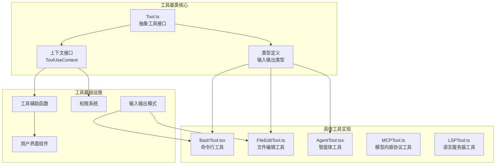
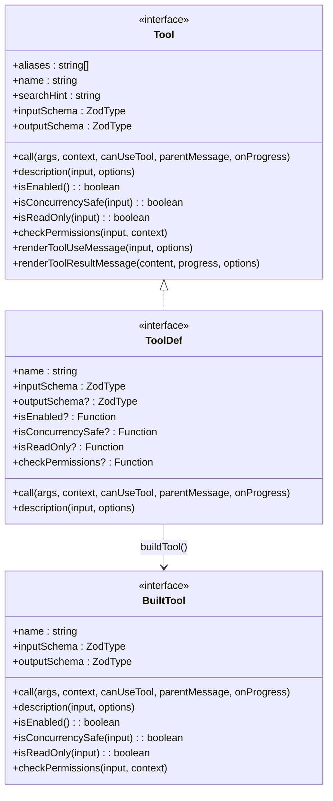
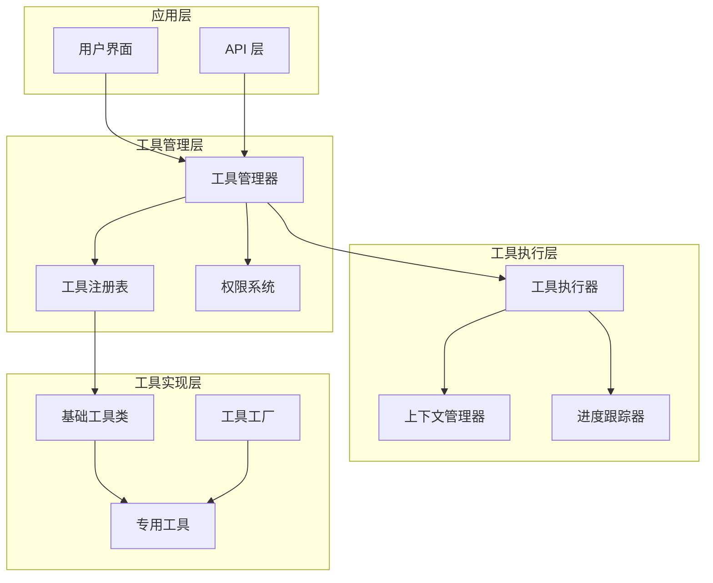
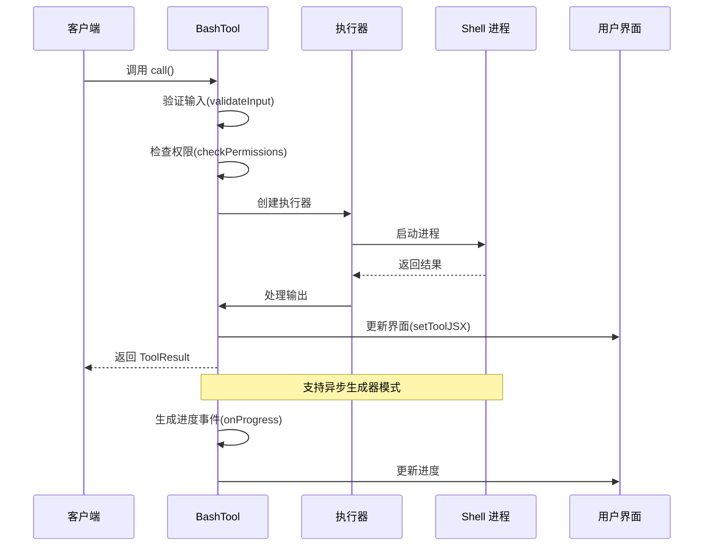
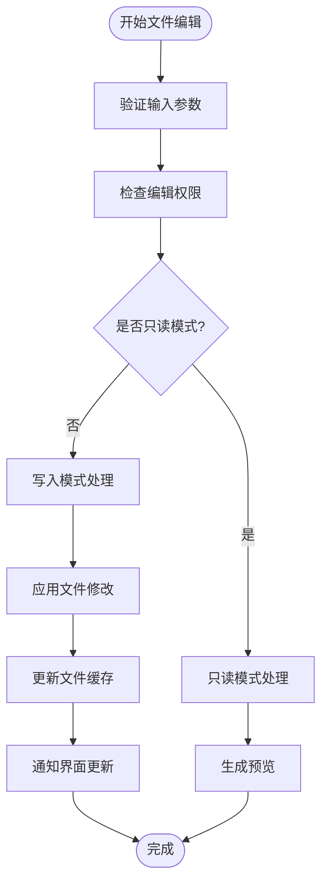
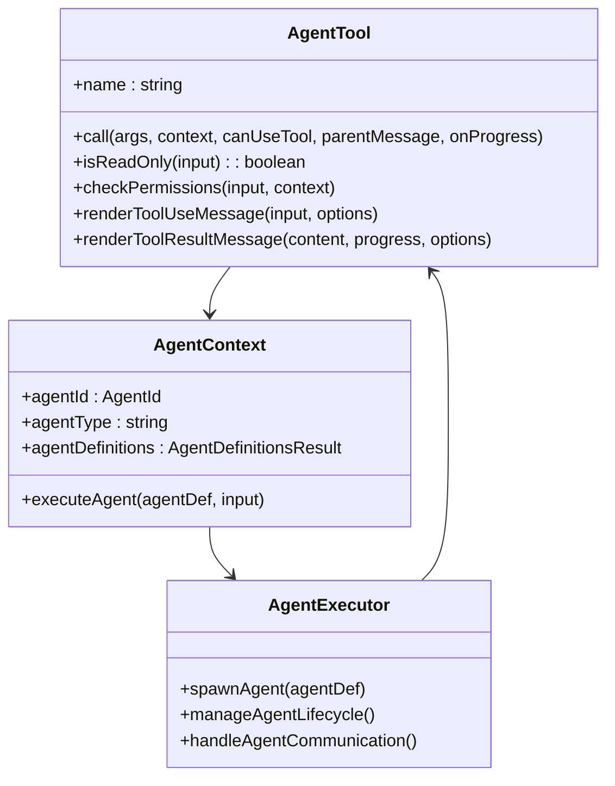
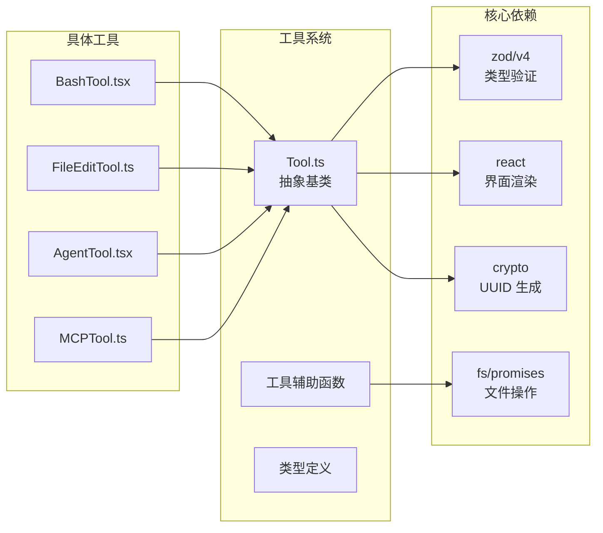

# 工具基类设计

<cite>
**本文档引用的文件**
- [Tool.ts](file://src/Tool.ts)
- [BashTool.tsx](file://src/tools/BashTool/BashTool.tsx)
- [bashCommandHelpers.ts](file://src/tools/BashTool/bashCommandHelpers.ts)
- [FileEditTool.ts](file://src/tools/FileEditTool/FileEditTool.ts)
- [AgentTool.tsx](file://src/tools/AgentTool/AgentTool.tsx)
</cite>

## 目录
1. [简介](#简介)
2. [项目结构](#项目结构)
3. [核心组件](#核心组件)
4. [架构概览](#架构概览)
5. [详细组件分析](#详细组件分析)
6. [依赖关系分析](#依赖关系分析)
7. [性能考虑](#性能考虑)
8. [故障排除指南](#故障排除指南)
9. [结论](#结论)

## 简介

本文档深入分析了 Claude Code 代码库中的工具基类设计，重点研究了 `src/Tool.ts` 中定义的抽象工具接口。该设计为所有工具提供了统一的抽象层，支持工具的初始化、执行、清理和元数据管理。通过分析具体的工具实现（如 BashTool、FileEditTool、AgentTool），我们可以理解工具基类的设计理念、扩展模式和最佳实践。

## 项目结构

工具系统在代码库中采用模块化组织方式：

**图表来源**
- [Tool.ts:1-793](file://src/Tool.ts#L1-L793)
- [BashTool.tsx:1-1144](file://src/tools/BashTool/BashTool.tsx#L1-L1144)

**章节来源**
- [Tool.ts:1-793](file://src/Tool.ts#L1-L793)

## 核心组件

### 抽象工具接口定义

工具基类通过 TypeScript 泛型系统提供了强大的类型安全保证：

**图表来源**
- [Tool.ts:362-695](file://src/Tool.ts#L362-L695)
- [Tool.ts:721-792](file://src/Tool.ts#L721-L792)

### 工具上下文系统

工具执行环境通过 `ToolUseContext` 提供了丰富的运行时信息：

| 上下文属性 | 类型 | 描述 |
|-----------|------|------|
| `options` | ToolOptions | 工具执行选项配置 |
| `abortController` | AbortController | 取消信号控制器 |
| `readFileState` | FileStateCache | 文件状态缓存 |
| `setAppState` | Function | 应用状态更新函数 |
| `handleElicitation` | Function | URL 引导处理函数 |
| `setToolJSX` | SetToolJSXFn | 工具界面更新函数 |

**章节来源**
- [Tool.ts:158-300](file://src/Tool.ts#L158-L300)

## 架构概览

工具系统的整体架构体现了分层设计原则：

**图表来源**
- [Tool.ts:783-792](file://src/Tool.ts#L783-L792)

## 详细组件分析

### BashTool 实现分析

BashTool 是工具基类的最佳实践示例，展示了完整的工具实现模式：

**图表来源**
- [BashTool.tsx:624-825](file://src/tools/BashTool/BashTool.tsx#L624-L825)
- [BashTool.tsx:826-1144](file://src/tools/BashTool/BashTool.tsx#L826-L1144)

#### BashTool 关键特性

1. **输入验证系统**：通过 `validateInput` 方法实现命令安全检查
2. **权限控制系统**：集成复杂的权限检查逻辑
3. **进度跟踪机制**：支持实时进度反馈
4. **输出处理优化**：自动处理大输出文件持久化

**章节来源**
- [BashTool.tsx:420-825](file://src/tools/BashTool/BashTool.tsx#L420-L825)

### FileEditTool 组件分析

FileEditTool 展示了文件操作工具的典型实现模式：

**图表来源**
- [FileEditTool.ts:1-500](file://src/tools/FileEditTool/FileEditTool.ts#L1-L500)

**章节来源**
- [FileEditTool.ts:1-500](file://src/tools/FileEditTool/FileEditTool.ts#L1-L500)

### AgentTool 架构分析

AgentTool 代表了复杂工具的实现模式：

**图表来源**
- [AgentTool.tsx:1-300](file://src/tools/AgentTool/AgentTool.tsx#L1-L300)

**章节来源**
- [AgentTool.tsx:1-300](file://src/tools/AgentTool/AgentTool.tsx#L1-L300)

## 依赖关系分析

工具系统的关键依赖关系如下：

**图表来源**
- [Tool.ts:1-14](file://src/Tool.ts#L1-L14)
- [BashTool.tsx:1-52](file://src/tools/BashTool/BashTool.tsx#L1-L52)

**章节来源**
- [Tool.ts:1-14](file://src/Tool.ts#L1-L14)

## 性能考虑

### 工具执行性能优化

1. **异步执行模式**：支持异步生成器模式，避免阻塞主线程
2. **内存管理**：大输出文件自动持久化到磁盘
3. **缓存机制**：文件状态缓存减少重复读取
4. **并发控制**：工具并发安全性检查

### 内存优化策略

| 优化策略 | 实现方式 | 性能收益 |
|---------|----------|----------|
| 输出截断 | `maxResultSizeChars` 限制 | 减少内存占用 |
| 文件持久化 | 大输出自动落盘 | 避免内存溢出 |
| 缓存管理 | LRU 缓存策略 | 提高访问速度 |
| 并发控制 | `isConcurrencySafe` 检查 | 防止资源竞争 |

## 故障排除指南

### 常见问题及解决方案

1. **工具执行超时**
   - 检查 `timeout` 参数设置
   - 验证网络连接状态
   - 查看日志获取详细错误信息

2. **权限拒绝**
   - 检查 `checkPermissions` 返回值
   - 验证用户权限配置
   - 查看权限规则匹配情况

3. **内存不足**
   - 检查 `maxResultSizeChars` 设置
   - 监控输出大小
   - 实施分块处理策略

**章节来源**
- [Tool.ts:95-101](file://src/Tool.ts#L95-L101)

## 结论

工具基类设计展现了优秀的软件工程实践：

1. **类型安全**：通过 TypeScript 泛型确保编译时类型检查
2. **扩展性**：清晰的抽象接口支持各种工具类型的实现
3. **可维护性**：模块化设计便于工具功能的独立开发和测试
4. **性能优化**：内置的性能监控和优化策略
5. **用户体验**：完善的进度反馈和错误处理机制

该设计为构建复杂工具系统提供了坚实的基础，既满足了当前需求，又为未来的功能扩展预留了充足的空间。