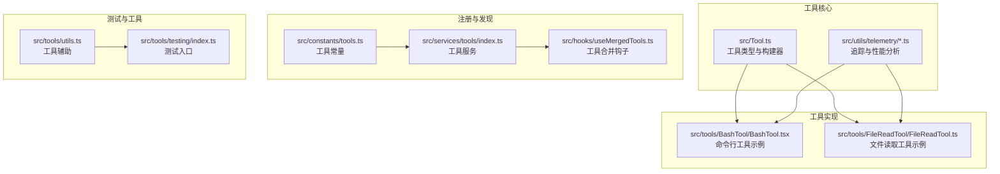
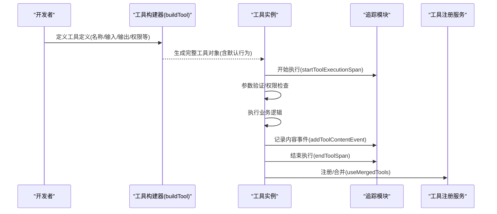
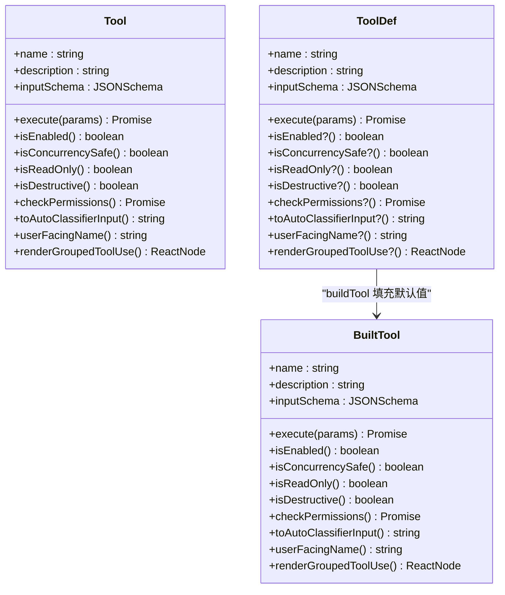
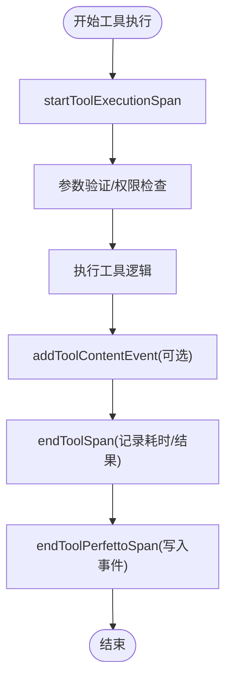
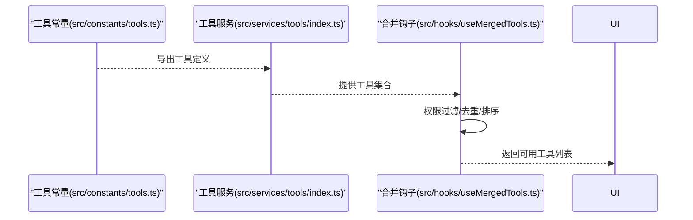
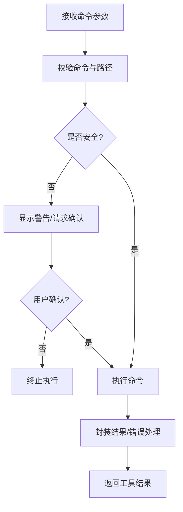
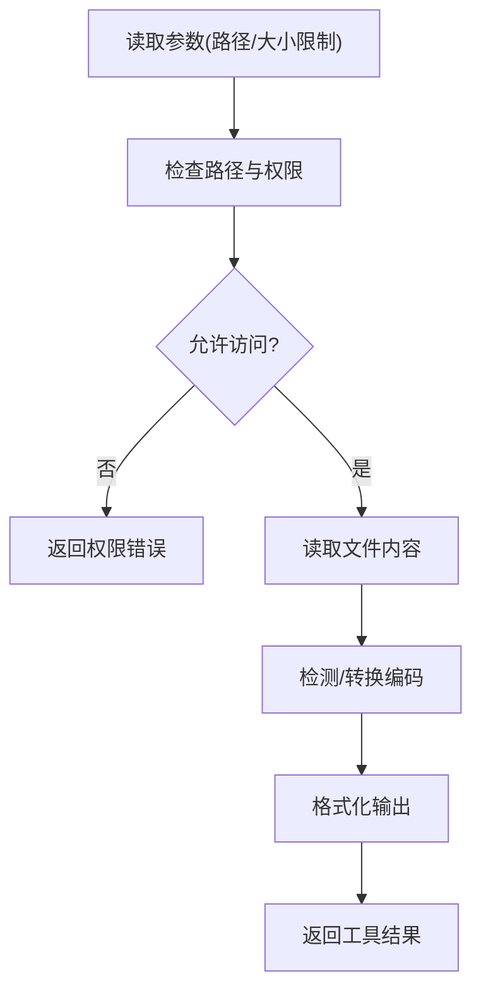
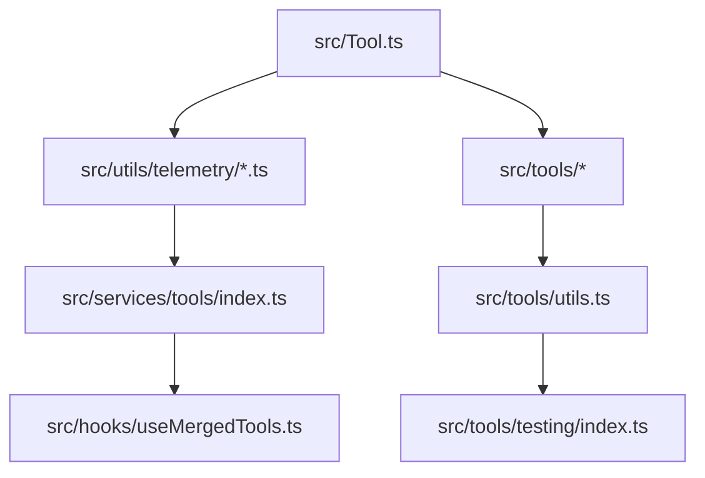

# 工具开发指南

<cite>
**本文档引用的文件**
- [src/Tool.ts](file://src/Tool.ts)
- [src/utils/telemetry/sessionTracing.ts](file://src/utils/telemetry/sessionTracing.ts)
- [src/utils/telemetry/perfettoTracing.ts](file://src/utils/telemetry/perfettoTracing.ts)
- [src/tools/BashTool/BashTool.tsx](file://src/tools/BashTool/BashTool.tsx)
- [src/tools/FileReadTool/FileReadTool.ts](file://src/tools/FileReadTool/FileReadTool.ts)
- [src/utils/toolSearch.ts](file://src/utils/toolSearch.ts)
- [src/constants/tools.ts](file://src/constants/tools.ts)
- [src/services/tools/index.ts](file://src/services/tools/index.ts)
- [src/hooks/useMergedTools.ts](file://src/hooks/useMergedTools.ts)
- [src/tools/utils.ts](file://src/tools/utils.ts)
- [src/tools/testing/index.ts](file://src/tools/testing/index.ts)
- [package.json](file://package.json)
- [tsconfig.json](file://tsconfig.json)
</cite>

## 目录
1. [简介](#简介)
2. [项目结构](#项目结构)
3. [核心组件](#核心组件)
4. [架构概览](#架构概览)
5. [详细组件分析](#详细组件分析)
6. [依赖关系分析](#依赖关系分析)
7. [性能考虑](#性能考虑)
8. [故障排除指南](#故障排除指南)
9. [结论](#结论)
10. [附录](#附录)

## 简介
本指南面向希望在本项目中开发自定义工具的开发者，系统阐述工具接口实现、参数验证与结果处理、最佳实践（错误处理、日志记录、性能优化）、测试策略（单元测试与集成测试）、模板代码与常用模式、文档编写与版本管理、调试技巧与性能分析方法。通过深入解析现有工具实现与基础设施，帮助您快速构建高质量、可维护的工具。

## 项目结构
工具相关的核心代码分布在以下区域：
- 核心工具类型与构建器：src/Tool.ts
- 工具执行追踪与性能分析：src/utils/telemetry/sessionTracing.ts、src/utils/telemetry/perfettoTracing.ts
- 具体工具实现示例：src/tools/BashTool/BashTool.tsx、src/tools/FileReadTool/FileReadTool.ts
- 工具注册与合并机制：src/constants/tools.ts、src/services/tools/index.ts、src/hooks/useMergedTools.ts
- 工具辅助工具与测试：src/tools/utils.ts、src/tools/testing/index.ts
- 项目配置：package.json、tsconfig.json

**图表来源**
- [src/Tool.ts:669-792](file://src/Tool.ts#L669-L792)
- [src/utils/telemetry/sessionTracing.ts:574-833](file://src/utils/telemetry/sessionTracing.ts#L574-L833)
- [src/utils/telemetry/perfettoTracing.ts:696-763](file://src/utils/telemetry/perfettoTracing.ts#L696-L763)
- [src/tools/BashTool/BashTool.tsx](file://src/tools/BashTool/BashTool.tsx)
- [src/tools/FileReadTool/FileReadTool.ts](file://src/tools/FileReadTool/FileReadTool.ts)
- [src/constants/tools.ts](file://src/constants/tools.ts)
- [src/services/tools/index.ts](file://src/services/tools/index.ts)
- [src/hooks/useMergedTools.ts](file://src/hooks/useMergedTools.ts)
- [src/tools/utils.ts](file://src/tools/utils.ts)
- [src/tools/testing/index.ts](file://src/tools/testing/index.ts)

**章节来源**
- [src/Tool.ts:669-792](file://src/Tool.ts#L669-L792)
- [src/utils/telemetry/sessionTracing.ts:574-833](file://src/utils/telemetry/sessionTracing.ts#L574-L833)
- [src/utils/telemetry/perfettoTracing.ts:696-763](file://src/utils/telemetry/perfettoTracing.ts#L696-L763)
- [src/tools/BashTool/BashTool.tsx](file://src/tools/BashTool/BashTool.tsx)
- [src/tools/FileReadTool/FileReadTool.ts](file://src/tools/FileReadTool/FileReadTool.ts)
- [src/constants/tools.ts](file://src/constants/tools.ts)
- [src/services/tools/index.ts](file://src/services/tools/index.ts)
- [src/hooks/useMergedTools.ts](file://src/hooks/useMergedTools.ts)
- [src/tools/utils.ts](file://src/tools/utils.ts)
- [src/tools/testing/index.ts](file://src/tools/testing/index.ts)

## 核心组件
- 工具类型与构建器：定义工具的标准接口、默认行为与类型安全的构建过程，确保所有工具具备一致的生命周期与能力声明。
- 追踪与性能分析：提供工具执行的开始/结束事件、用户阻塞等待、内容事件记录与性能指标收集，支持 OpenTelemetry 与 Perfetto。
- 工具注册与合并：通过常量与服务层统一管理工具集合，并在运行时进行合并与过滤，便于权限控制与动态加载。
- 工具实现示例：命令行工具与文件操作工具展示了参数校验、权限检查、错误处理与结果格式化的标准做法。

**章节来源**
- [src/Tool.ts:669-792](file://src/Tool.ts#L669-L792)
- [src/utils/telemetry/sessionTracing.ts:574-833](file://src/utils/telemetry/sessionTracing.ts#L574-L833)
- [src/utils/telemetry/perfettoTracing.ts:696-763](file://src/utils/telemetry/perfettoTracing.ts#L696-L763)
- [src/constants/tools.ts](file://src/constants/tools.ts)
- [src/services/tools/index.ts](file://src/services/tools/index.ts)
- [src/hooks/useMergedTools.ts](file://src/hooks/useMergedTools.ts)

## 架构概览
工具开发遵循“类型驱动 + 追踪可观测 + 注册发现”的架构模式。工具通过构建器获得默认能力，执行期间由追踪模块记录性能与内容事件，最终在服务层完成注册与合并。

**图表来源**
- [src/Tool.ts:783-792](file://src/Tool.ts#L783-L792)
- [src/utils/telemetry/sessionTracing.ts:626-736](file://src/utils/telemetry/sessionTracing.ts#L626-L736)
- [src/utils/telemetry/perfettoTracing.ts:696-763](file://src/utils/telemetry/perfettoTracing.ts#L696-L763)
- [src/hooks/useMergedTools.ts](file://src/hooks/useMergedTools.ts)

## 详细组件分析

### 工具接口与构建器
- 类型安全：通过 ToolDef 与 BuiltTool 的类型映射，确保工具定义的可选字段被正确填充默认值，同时保留调用方提供的具体类型信息。
- 默认行为：工具具备启用状态、并发安全性、只读/破坏性标记、权限检查、自动分类输入、用户可见名称等默认实现，减少重复代码。
- 渲染扩展：支持单个工具使用渲染与分组渲染，便于 UI 层按需展示。

**图表来源**
- [src/Tool.ts:669-792](file://src/Tool.ts#L669-L792)

**章节来源**
- [src/Tool.ts:669-792](file://src/Tool.ts#L669-L792)

### 追踪与性能分析
- 工具执行跨度：startToolExecutionSpan/startToolSpan/endToolSpan 提供完整的工具执行生命周期追踪，支持持续时间、结果令牌数与实验性结果属性。
- 用户阻塞跨度：endToolBlockedOnUserSpan 记录工具因用户输入而阻塞的时间线，便于分析交互延迟。
- 内容事件：addToolContentEvent 在开启内容日志时记录工具输出，自动截断过长内容并保留原始长度信息。
- Perfetto 集成：startToolPerfettoSpan/endToolPerfettoSpan 将工具执行事件写入 Perfetto 流程，包含成功状态、错误信息与耗时。

**图表来源**
- [src/utils/telemetry/sessionTracing.ts:626-736](file://src/utils/telemetry/sessionTracing.ts#L626-L736)
- [src/utils/telemetry/perfettoTracing.ts:696-763](file://src/utils/telemetry/perfettoTracing.ts#L696-L763)

**章节来源**
- [src/utils/telemetry/sessionTracing.ts:574-833](file://src/utils/telemetry/sessionTracing.ts#L574-L833)
- [src/utils/telemetry/perfettoTracing.ts:696-763](file://src/utils/telemetry/perfettoTracing.ts#L696-L763)

### 工具注册与合并机制
- 常量层：src/constants/tools.ts 统一声明工具集合与元数据。
- 服务层：src/services/tools/index.ts 负责工具的装配与导出。
- 合并钩子：src/hooks/useMergedTools.ts 在运行时根据权限与上下文合并工具集，支持动态增删与去重。

**图表来源**
- [src/constants/tools.ts](file://src/constants/tools.ts)
- [src/services/tools/index.ts](file://src/services/tools/index.ts)
- [src/hooks/useMergedTools.ts](file://src/hooks/useMergedTools.ts)

**章节来源**
- [src/constants/tools.ts](file://src/constants/tools.ts)
- [src/services/tools/index.ts](file://src/services/tools/index.ts)
- [src/hooks/useMergedTools.ts](file://src/hooks/useMergedTools.ts)

### 工具实现示例：命令行工具
- 参数校验：对命令语句进行语法与路径合法性检查，避免危险操作。
- 权限与安全：区分只读与破坏性命令，必要时弹出确认提示或限制执行范围。
- 结果处理：将命令输出标准化为工具结果块，支持进度消息与错误回传。

**图表来源**
- [src/tools/BashTool/BashTool.tsx](file://src/tools/BashTool/BashTool.tsx)

**章节来源**
- [src/tools/BashTool/BashTool.tsx](file://src/tools/BashTool/BashTool.tsx)

### 工具实现示例：文件读取工具
- 输入限制：对读取大小、文件类型与路径进行限制，防止资源滥用。
- 输出格式：将文件内容转换为适合后续工具使用的结构化输出。
- 错误处理：捕获文件不存在、权限不足、编码异常等场景并给出明确反馈。

**图表来源**
- [src/tools/FileReadTool/FileReadTool.ts](file://src/tools/FileReadTool/FileReadTool.ts)

**章节来源**
- [src/tools/FileReadTool/FileReadTool.ts](file://src/tools/FileReadTool/FileReadTool.ts)

### 工具搜索与诊断
- 动态池变更：当延迟工具池发生变化时，记录新增/移除的工具清单与上下文信息，便于问题定位与统计分析。
- 诊断事件：通过日志事件记录扫描上下文、附件类型等信息，辅助排查工具不可见或失效的问题。

**章节来源**
- [src/utils/toolSearch.ts:665-706](file://src/utils/toolSearch.ts#L665-L706)

## 依赖关系分析
工具开发涉及的关键依赖与耦合点：
- 工具类型与构建器：作为所有工具的契约，提供统一的默认行为与类型约束。
- 追踪模块：与工具执行强耦合，负责性能与内容观测，不应影响工具核心逻辑。
- 注册与合并：与权限系统、UI 层紧密关联，需要保持稳定的 API 以降低耦合度。
- 示例工具：展示最佳实践，应尽量复用通用工具函数与安全检查逻辑。

**图表来源**
- [src/Tool.ts:669-792](file://src/Tool.ts#L669-L792)
- [src/utils/telemetry/sessionTracing.ts:574-833](file://src/utils/telemetry/sessionTracing.ts#L574-L833)
- [src/utils/telemetry/perfettoTracing.ts:696-763](file://src/utils/telemetry/perfettoTracing.ts#L696-L763)
- [src/services/tools/index.ts](file://src/services/tools/index.ts)
- [src/hooks/useMergedTools.ts](file://src/hooks/useMergedTools.ts)
- [src/tools/utils.ts](file://src/tools/utils.ts)
- [src/tools/testing/index.ts](file://src/tools/testing/index.ts)

**章节来源**
- [src/Tool.ts:669-792](file://src/Tool.ts#L669-L792)
- [src/utils/telemetry/sessionTracing.ts:574-833](file://src/utils/telemetry/sessionTracing.ts#L574-L833)
- [src/utils/telemetry/perfettoTracing.ts:696-763](file://src/utils/telemetry/perfettoTracing.ts#L696-L763)
- [src/services/tools/index.ts](file://src/services/tools/index.ts)
- [src/hooks/useMergedTools.ts](file://src/hooks/useMergedTools.ts)
- [src/tools/utils.ts](file://src/tools/utils.ts)
- [src/tools/testing/index.ts](file://src/tools/testing/index.ts)

## 性能考虑
- 使用追踪模块记录工具执行耗时与结果令牌数，便于识别慢工具与高开销操作。
- 对大文本输出进行截断与长度标注，避免日志膨胀。
- 合理设置并发安全标志，避免不必要的串行化导致性能退化。
- 在命令行工具中优先使用沙箱或只读模式，减少破坏性操作带来的重试成本。

[本节为通用指导，无需列出章节来源]

## 故障排除指南
- 工具不可见：检查工具池变更日志与扫描上下文，确认工具是否被延迟或移除。
- 执行阻塞：查看用户阻塞跨度与 Perfetto 事件，定位用户确认环节的瓶颈。
- 内容过大：启用内容日志并观察截断标记，调整输出策略或分页处理。
- 权限问题：核对权限检查与安全策略，确保只读/破坏性命令的正确标记。

**章节来源**
- [src/utils/toolSearch.ts:665-706](file://src/utils/toolSearch.ts#L665-L706)
- [src/utils/telemetry/sessionTracing.ts:574-833](file://src/utils/telemetry/sessionTracing.ts#L574-L833)
- [src/utils/telemetry/perfettoTracing.ts:696-763](file://src/utils/telemetry/perfettoTracing.ts#L696-L763)

## 结论
通过类型驱动的工具构建器、完善的追踪与性能分析体系、以及规范的注册与合并机制，本项目为工具开发提供了坚实的基础。遵循本文档中的最佳实践与模板模式，可以高效地实现高质量、可维护且可观测的工具。

[本节为总结性内容，无需列出章节来源]

## 附录

### 工具开发最佳实践清单
- 接口实现：使用 buildTool 构建工具，明确输入/输出与权限标记。
- 参数验证：在 execute 前进行严格校验，拒绝非法参数。
- 错误处理：捕获并格式化错误，提供清晰的错误码与恢复建议。
- 日志记录：仅在开启内容日志时记录输出，注意截断与隐私。
- 性能优化：避免阻塞式 IO，合理使用并发与缓存。
- 可观测性：始终包裹在追踪跨度内，记录耗时与结果令牌数。

[本节为通用指导，无需列出章节来源]

### 测试策略
- 单元测试：针对工具的 execute 方法与边界条件编写测试，覆盖正常与异常路径。
- 集成测试：模拟工具在真实环境中的调用链路，验证权限、追踪与 UI 渲染。
- 回归测试：在工具池变更时运行回归脚本，确保无意外影响。

**章节来源**
- [src/tools/testing/index.ts](file://src/tools/testing/index.ts)

### 模板代码与常用模式
- 工具模板：参考命令行工具与文件读取工具的实现，复用参数校验与结果封装。
- 权限模式：使用只读/破坏性标记与权限检查钩子，确保安全执行。
- 追踪模式：在工具执行前后分别记录开始/结束事件，必要时添加内容事件。

**章节来源**
- [src/tools/BashTool/BashTool.tsx](file://src/tools/BashTool/BashTool.tsx)
- [src/tools/FileReadTool/FileReadTool.ts](file://src/tools/FileReadTool/FileReadTool.ts)
- [src/utils/telemetry/sessionTracing.ts:626-736](file://src/utils/telemetry/sessionTracing.ts#L626-L736)

### 文档编写与版本管理
- 文档：为每个工具编写简要描述、输入输出示例与注意事项。
- 版本：遵循语义化版本，变更追踪与发布说明。
- 发布：通过 CI/CD 自动化打包与发布，确保一致性与可追溯性。

**章节来源**
- [package.json](file://package.json)
- [tsconfig.json](file://tsconfig.json)