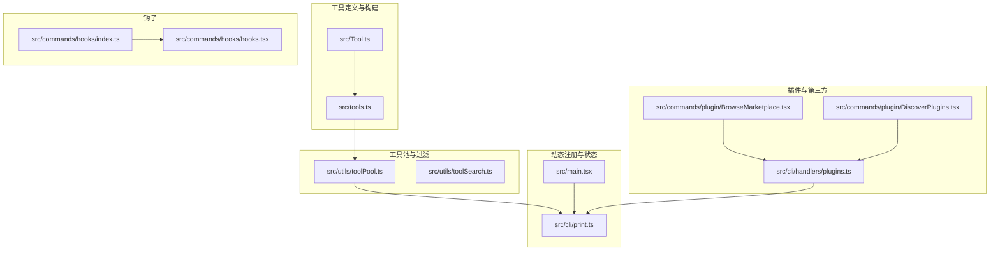
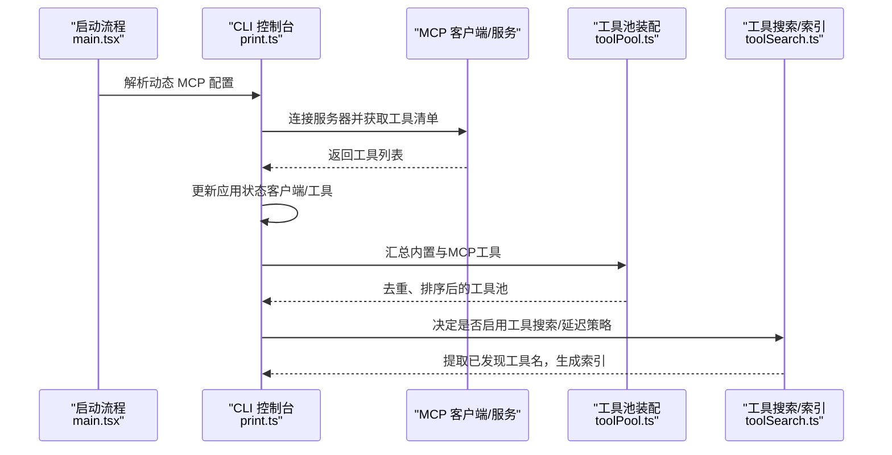
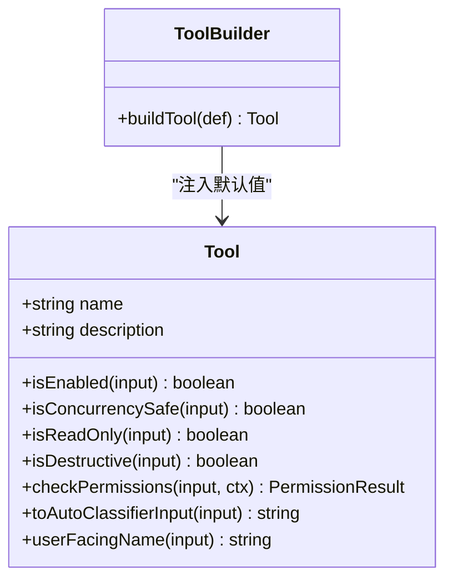
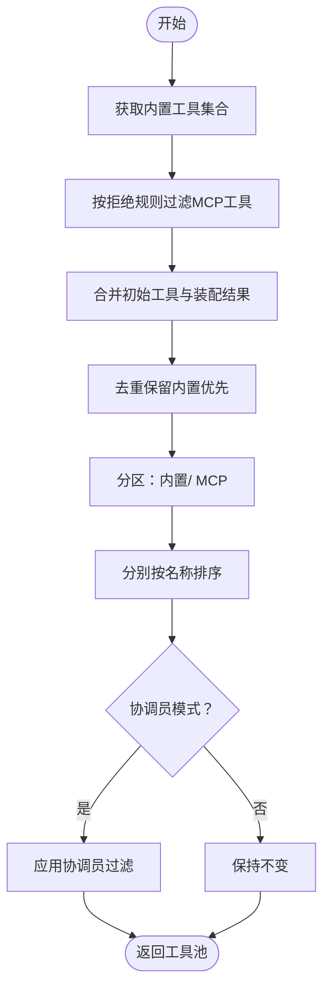
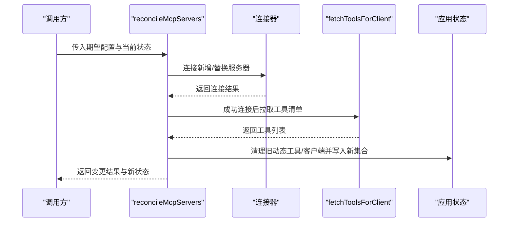
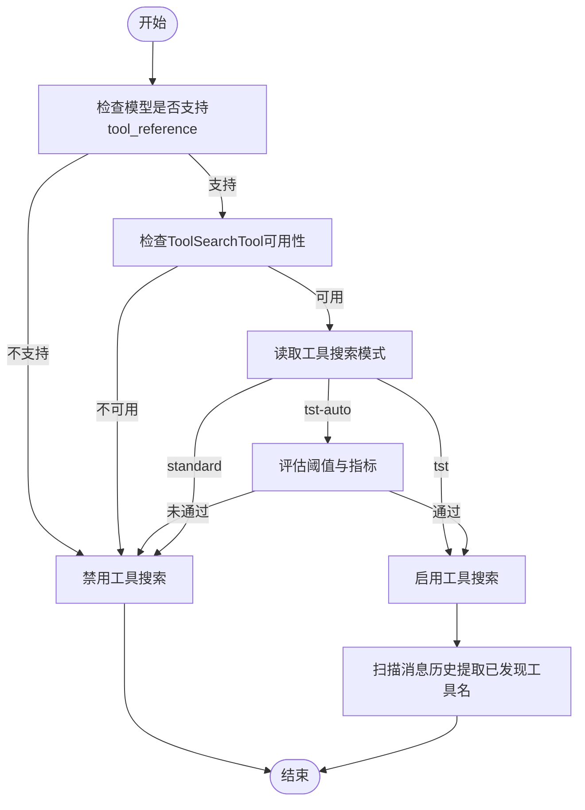
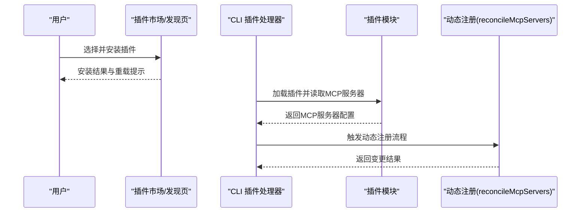
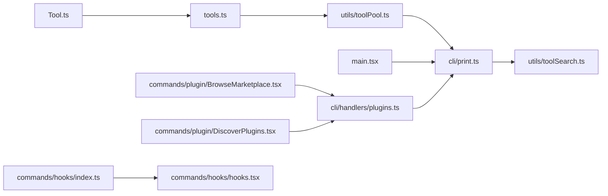

# 工具注册与发现

<cite>
**本文引用的文件**
- [src/Tool.ts](file://src/Tool.ts)
- [src/tools.ts](file://src/tools.ts)
- [src/utils/toolSearch.ts](file://src/utils/toolSearch.ts)
- [src/utils/toolPool.ts](file://src/utils/toolPool.ts)
- [src/cli/print.ts](file://src/cli/print.ts)
- [src/main.tsx](file://src/main.tsx)
- [src/commands/plugin/BrowseMarketplace.tsx](file://src/commands/plugin/BrowseMarketplace.tsx)
- [src/commands/plugin/DiscoverPlugins.tsx](file://src/commands/plugin/DiscoverPlugins.tsx)
- [src/cli/handlers/plugins.ts](file://src/cli/handlers/plugins.ts)
- [src/commands/hooks/hooks.tsx](file://src/commands/hooks/hooks.tsx)
- [src/commands/hooks/index.ts](file://src/commands/hooks/index.ts)
</cite>

## 目录
1. [简介](#简介)
2. [项目结构](#项目结构)
3. [核心组件](#核心组件)
4. [架构总览](#架构总览)
5. [详细组件分析](#详细组件分析)
6. [依赖关系分析](#依赖关系分析)
7. [性能考量](#性能考量)
8. [故障排查指南](#故障排查指南)
9. [结论](#结论)
10. [附录](#附录)

## 简介
本文件系统化阐述 Claude Code 的“工具注册与发现”机制，覆盖以下主题：
- 工具的自动发现、动态加载与注册流程
- 工具元数据收集、验证与索引
- 依赖解析、版本管理与兼容性检查
- 工具注册标准流程、钩子机制与生命周期管理
- 插件工具的集成方式与第三方工具接入规范
- 工具的热重载机制
- 工具搜索索引、分类标签与推荐算法

## 项目结构
围绕工具注册与发现的关键目录与文件：
- 工具定义与构建：src/Tool.ts、src/tools.ts
- 工具池合并与过滤：src/utils/toolPool.ts
- 动态 MCP 工具注册与状态更新：src/cli/print.ts
- 启动时动态 MCP 配置解析：src/main.tsx
- 插件市场与安装流程（含 MCP 服务器暴露）：src/commands/plugin/*.tsx
- 插件加载与错误聚合：src/cli/handlers/plugins.ts
- 工具搜索模式与索引：src/utils/toolSearch.ts
- 钩子命令入口：src/commands/hooks/*

**图表来源**
- [src/Tool.ts](file://src/Tool.ts)
- [src/tools.ts](file://src/tools.ts)
- [src/utils/toolPool.ts](file://src/utils/toolPool.ts)
- [src/utils/toolSearch.ts](file://src/utils/toolSearch.ts)
- [src/cli/print.ts](file://src/cli/print.ts)
- [src/main.tsx](file://src/main.tsx)
- [src/commands/plugin/BrowseMarketplace.tsx](file://src/commands/plugin/BrowseMarketplace.tsx)
- [src/commands/plugin/DiscoverPlugins.tsx](file://src/commands/plugin/DiscoverPlugins.tsx)
- [src/cli/handlers/plugins.ts](file://src/cli/handlers/plugins.ts)
- [src/commands/hooks/index.ts](file://src/commands/hooks/index.ts)
- [src/commands/hooks/hooks.tsx](file://src/commands/hooks/hooks.tsx)

**章节来源**
- [src/Tool.ts](file://src/Tool.ts)
- [src/tools.ts](file://src/tools.ts)
- [src/utils/toolPool.ts](file://src/utils/toolPool.ts)
- [src/utils/toolSearch.ts](file://src/utils/toolSearch.ts)
- [src/cli/print.ts](file://src/cli/print.ts)
- [src/main.tsx](file://src/main.tsx)
- [src/commands/plugin/BrowseMarketplace.tsx](file://src/commands/plugin/BrowseMarketplace.tsx)
- [src/commands/plugin/DiscoverPlugins.tsx](file://src/commands/plugin/DiscoverPlugins.tsx)
- [src/cli/handlers/plugins.ts](file://src/cli/handlers/plugins.ts)
- [src/commands/hooks/index.ts](file://src/commands/hooks/index.ts)
- [src/commands/hooks/hooks.tsx](file://src/commands/hooks/hooks.tsx)

## 核心组件
- 工具定义与默认值：通过统一的构建器与默认配置，确保工具具备一致的元数据与行为基线。
- 工具池装配：将内置工具与 MCP 工具合并、去重、排序，并按权限上下文过滤。
- 动态 MCP 注册：在运行时根据配置变更进行连接、拉取工具清单、更新应用状态。
- 工具搜索与索引：基于模型能力与环境开关，决定是否启用工具搜索与延迟工具策略；从消息历史中提取已发现工具名，形成搜索索引。
- 插件与第三方：插件可声明 MCP 服务器，安装后由 CLI 处理加载与错误聚合，并触发动态注册。

**章节来源**
- [src/Tool.ts](file://src/Tool.ts)
- [src/tools.ts](file://src/tools.ts)
- [src/utils/toolPool.ts](file://src/utils/toolPool.ts)
- [src/utils/toolSearch.ts](file://src/utils/toolSearch.ts)
- [src/cli/print.ts](file://src/cli/print.ts)
- [src/cli/handlers/plugins.ts](file://src/cli/handlers/plugins.ts)

## 架构总览
下图展示从启动到动态注册、再到工具池装配与使用的整体流程。

**图表来源**
- [src/main.tsx](file://src/main.tsx)
- [src/cli/print.ts](file://src/cli/print.ts)
- [src/utils/toolPool.ts](file://src/utils/toolPool.ts)
- [src/utils/toolSearch.ts](file://src/utils/toolSearch.ts)

## 详细组件分析

### 组件一：工具定义与构建（buildTool 与默认值）
- 设计要点
  - 使用类型级“默认填充”策略，保证工具对象在缺少可选方法时仍具备安全默认值（如启用状态、并发安全性、只读标记等）。
  - 通过构建器函数集中注入默认实现，避免分散的空值判断与兜底逻辑。
- 关键行为
  - 默认启用、非并发安全、非破坏性、允许通用权限处理、用户可见名为工具名本身。
  - 允许调用方仅提供差异化的字段，其余由默认值补齐。
- 生命周期
  - 在工具导出阶段即完成标准化，后续使用无需重复校验默认项。

**图表来源**
- [src/Tool.ts](file://src/Tool.ts)

**章节来源**
- [src/Tool.ts](file://src/Tool.ts)

### 组件二：工具池装配与去重（assembleToolPool 与 mergeAndFilterTools）
- 设计要点
  - 将内置工具与 MCP 工具合并，内置工具优先，避免 MCP 覆盖内置语义。
  - 支持按权限上下文过滤内置工具，同时对 MCP 工具执行“拒绝规则”过滤。
  - 对工具数组进行去重与稳定排序，保证提示缓存命中率与一致性。
- 关键流程
  - 获取内置工具集合（受模式过滤影响）
  - 过滤 MCP 工具（拒绝规则）
  - 合并初始工具（如 REPL 中的额外工具）并去重
  - 分区排序：内置前缀 + MCP 后缀，名称排序
  - 协调员模式下进一步过滤
- 性能与稳定性
  - 去重与排序为 O(n log n)，在工具规模可控范围内开销可接受
  - 内置工具前缀保持，有利于服务端提示缓存策略

**图表来源**
- [src/utils/toolPool.ts](file://src/utils/toolPool.ts)
- [src/tools.ts](file://src/tools.ts)

**章节来源**
- [src/utils/toolPool.ts](file://src/utils/toolPool.ts)
- [src/tools.ts](file://src/tools.ts)

### 组件三：动态 MCP 工具注册与状态更新（reconcileMcpServers 与应用状态）
- 设计要点
  - 根据期望配置与当前状态计算新增、移除与替换操作，避免不必要的重启。
  - 对连接失败的服务器记录错误信息，支持后续重连与状态恢复。
  - 在应用状态中清理旧的动态工具与客户端，写入新的工具与客户端集合。
- 关键流程
  - 计算待删除/新增/替换的服务器集合
  - 逐个建立连接并拉取工具清单
  - 构建新配置映射
  - 原子性地更新应用状态中的 MCP 客户端与工具
- 生命周期
  - 新增：连接成功后拉取工具并加入工具池
  - 替换：检测配置变化后断开旧连接、建立新连接并刷新工具
  - 移除：从状态中剔除对应客户端与工具前缀

**图表来源**
- [src/cli/print.ts](file://src/cli/print.ts)

**章节来源**
- [src/cli/print.ts](file://src/cli/print.ts)

### 组件四：启动时动态 MCP 配置解析（main.tsx）
- 设计要点
  - 在主进程启动时解析传入的动态 MCP 配置字符串或文件路径，进行格式化与校验。
  - 将解析后的配置转换为作用域配置并进入后续注册流程。
- 关键流程
  - 输入预处理（去空白、过滤空串）
  - 逐项解析并收集错误
  - 转换为作用域配置并参与后续注册

**章节来源**
- [src/main.tsx](file://src/main.tsx)

### 组件五：工具搜索与索引（工具搜索模式、延迟工具与消息历史扫描）
- 设计要点
  - 模型能力检测：基于特征开关与模型名称模式，判断是否支持 tool_reference。
  - 搜索模式决策：支持“始终启用”“自动阈值”“标准禁用”三种模式，结合环境变量与特征开关。
  - 延迟工具池变更：当工具池发生新增/移除时，记录诊断事件并输出变更摘要。
  - 消息历史扫描：从消息历史中提取 tool_reference 中的工具名，形成“已发现工具集”，用于后续请求时的工具筛选。
- 关键流程
  - 判断模型是否支持 tool_reference
  - 检查 ToolSearchTool 可用性
  - 根据模式决策是否启用工具搜索
  - 自动模式下评估阈值与指标
  - 扫描消息历史提取工具名并写入索引

**图表来源**
- [src/utils/toolSearch.ts](file://src/utils/toolSearch.ts)

**章节来源**
- [src/utils/toolSearch.ts](file://src/utils/toolSearch.ts)

### 组件六：插件工具集成与第三方接入（插件市场、安装与 MCP 服务器暴露）
- 设计要点
  - 插件市场与发现页面支持批量安装插件，安装完成后提示执行重载以激活。
  - CLI 插件处理器负责聚合加载错误、解析插件标识、尝试加载插件并提取其 MCP 服务器配置。
  - 加载错误会以结构化形式回显，便于用户定位问题。
- 关键流程
  - 用户选择插件并发起安装
  - CLI 处理安装结果并汇总成功/失败详情
  - 加载插件并读取其 MCP 服务器配置
  - 触发动态注册流程（与上述 reconcileMcpServers 一致）

**图表来源**
- [src/commands/plugin/BrowseMarketplace.tsx](file://src/commands/plugin/BrowseMarketplace.tsx)
- [src/commands/plugin/DiscoverPlugins.tsx](file://src/commands/plugin/DiscoverPlugins.tsx)
- [src/cli/handlers/plugins.ts](file://src/cli/handlers/plugins.ts)
- [src/cli/print.ts](file://src/cli/print.ts)

**章节来源**
- [src/commands/plugin/BrowseMarketplace.tsx](file://src/commands/plugin/BrowseMarketplace.tsx)
- [src/commands/plugin/DiscoverPlugins.tsx](file://src/commands/plugin/DiscoverPlugins.tsx)
- [src/cli/handlers/plugins.ts](file://src/cli/handlers/plugins.ts)
- [src/cli/print.ts](file://src/cli/print.ts)

### 组件七：钩子机制与生命周期（工具事件钩子入口）
- 设计要点
  - 提供本地 JSX 命令入口，用于查看工具事件相关的钩子配置。
  - 命令加载时获取当前工具权限上下文，列出可用工具名称供配置界面使用。
- 生命周期
  - 命令加载时初始化并渲染配置菜单
  - 退出回调触发清理与状态保存

**章节来源**
- [src/commands/hooks/index.ts](file://src/commands/hooks/index.ts)
- [src/commands/hooks/hooks.tsx](file://src/commands/hooks/hooks.tsx)

## 依赖关系分析
- 工具定义层依赖于构建器与默认值策略，确保所有工具具备一致的元数据与行为基线。
- 工具池装配层依赖于工具池合并与过滤工具，以及内置工具集合。
- 动态注册层依赖于 CLI 控制台与应用状态，负责连接 MCP 服务器并拉取工具清单。
- 工具搜索层依赖于模型能力检测、特征开关与消息历史扫描。
- 插件层依赖于 CLI 插件处理器与动态注册流程，实现第三方工具的接入。

**图表来源**
- [src/Tool.ts](file://src/Tool.ts)
- [src/tools.ts](file://src/tools.ts)
- [src/utils/toolPool.ts](file://src/utils/toolPool.ts)
- [src/utils/toolSearch.ts](file://src/utils/toolSearch.ts)
- [src/cli/print.ts](file://src/cli/print.ts)
- [src/main.tsx](file://src/main.tsx)
- [src/commands/plugin/BrowseMarketplace.tsx](file://src/commands/plugin/BrowseMarketplace.tsx)
- [src/commands/plugin/DiscoverPlugins.tsx](file://src/commands/plugin/DiscoverPlugins.tsx)
- [src/cli/handlers/plugins.ts](file://src/cli/handlers/plugins.ts)
- [src/commands/hooks/index.ts](file://src/commands/hooks/index.ts)
- [src/commands/hooks/hooks.tsx](file://src/commands/hooks/hooks.tsx)

**章节来源**
- [src/Tool.ts](file://src/Tool.ts)
- [src/tools.ts](file://src/tools.ts)
- [src/utils/toolPool.ts](file://src/utils/toolPool.ts)
- [src/utils/toolSearch.ts](file://src/utils/toolSearch.ts)
- [src/cli/print.ts](file://src/cli/print.ts)
- [src/main.tsx](file://src/main.tsx)
- [src/commands/plugin/BrowseMarketplace.tsx](file://src/commands/plugin/BrowseMarketplace.tsx)
- [src/commands/plugin/DiscoverPlugins.tsx](file://src/commands/plugin/DiscoverPlugins.tsx)
- [src/cli/handlers/plugins.ts](file://src/cli/handlers/plugins.ts)
- [src/commands/hooks/index.ts](file://src/commands/hooks/index.ts)
- [src/commands/hooks/hooks.tsx](file://src/commands/hooks/hooks.tsx)

## 性能考量
- 工具池装配
  - 去重与排序复杂度为 O(n log n)，建议控制工具总量与分批装配。
  - 内置工具前缀保持有助于服务端提示缓存命中，减少重复计算。
- 动态注册
  - 采用“变更对比 + 序列化调用”的策略，避免并发冲突带来的重复连接与资源浪费。
  - 连接失败的服务器记录错误，便于快速定位与重试。
- 工具搜索
  - 模式决策与阈值评估应尽量复用已有上下文，避免重复扫描消息历史。
  - 已发现工具集的提取应限制扫描范围，防止大消息体导致性能退化。

## 故障排查指南
- 动态 MCP 注册失败
  - 检查服务器配置是否正确、网络连通性与认证状态。
  - 查看错误映射表，定位具体失败原因并重试或调整配置。
- 工具搜索未生效
  - 确认模型是否支持 tool_reference，检查特征开关与环境变量。
  - 确保 ToolSearchTool 可用且未被拒绝规则过滤。
- 插件安装后未出现工具
  - 执行重载命令以激活新安装的插件。
  - 检查插件加载错误日志，确认 MCP 服务器配置是否正确暴露。
- 工具池异常
  - 排查内置工具与 MCP 工具的命名冲突，确认去重与排序逻辑是否符合预期。

**章节来源**
- [src/cli/print.ts](file://src/cli/print.ts)
- [src/utils/toolSearch.ts](file://src/utils/toolSearch.ts)
- [src/cli/handlers/plugins.ts](file://src/cli/handlers/plugins.ts)

## 结论
Claude Code 的工具注册与发现体系以“统一工具定义与默认值”为基础，通过“工具池装配与过滤”实现内置与外部工具的一致化管理；借助“动态 MCP 注册与状态更新”实现运行时的自动发现与热重载；配合“工具搜索与索引”与“插件生态”，形成从内到外、从静态到动态的完整工具生命周期闭环。该体系兼顾安全性（权限与拒绝规则）、可扩展性（插件与第三方接入）与可观测性（错误聚合与诊断事件），为复杂场景下的工具治理提供了稳健支撑。

## 附录
- 工具注册标准流程
  - 定义工具：使用构建器注入默认值，确保最小必要字段。
  - 装配工具池：合并内置与 MCP 工具，去重与排序，按权限上下文过滤。
  - 动态注册：解析配置、连接服务器、拉取工具清单、更新应用状态。
  - 搜索索引：根据模型能力与模式决策启用工具搜索，扫描消息历史提取已发现工具名。
  - 插件接入：插件暴露 MCP 服务器，安装后由 CLI 处理加载与错误聚合，触发动态注册。
- 钩子机制与生命周期
  - 命令入口加载工具权限上下文，渲染配置菜单；退出时清理并保存状态。
- 热重载机制
  - 通过动态注册流程的“变更对比 + 序列化调用”，在不中断会话的前提下平滑替换或移除工具。