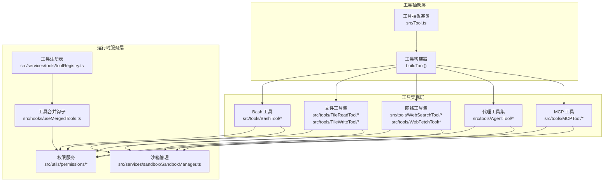
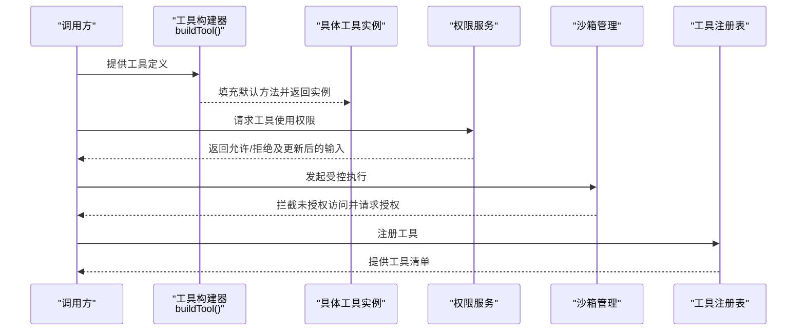
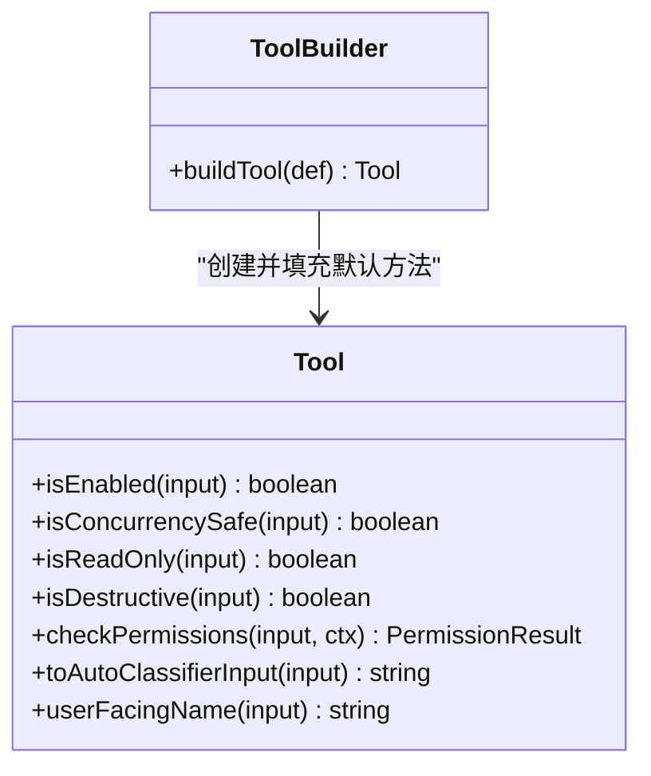
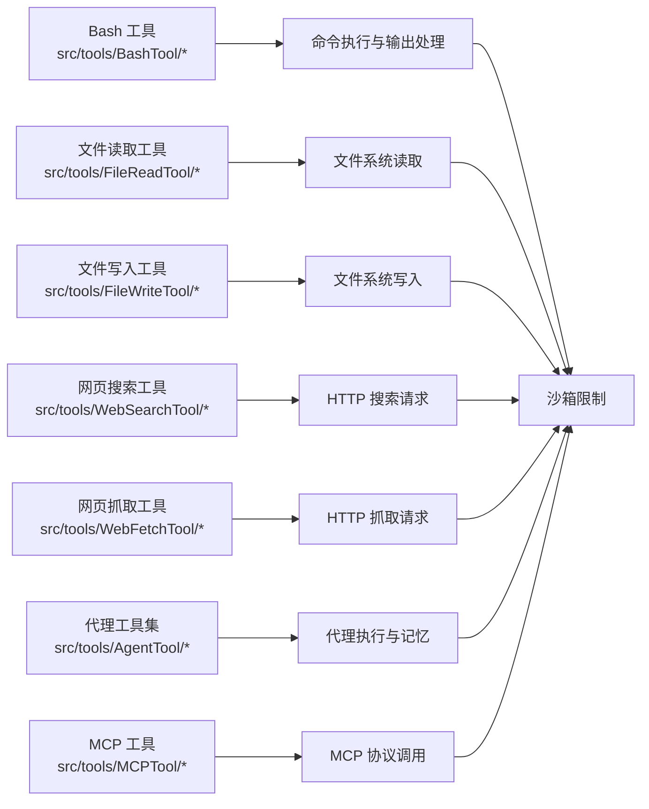
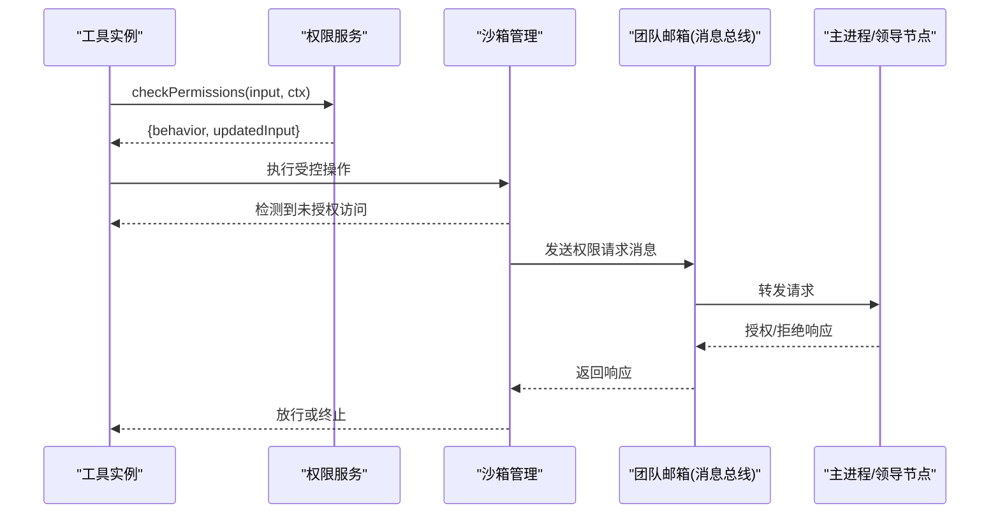
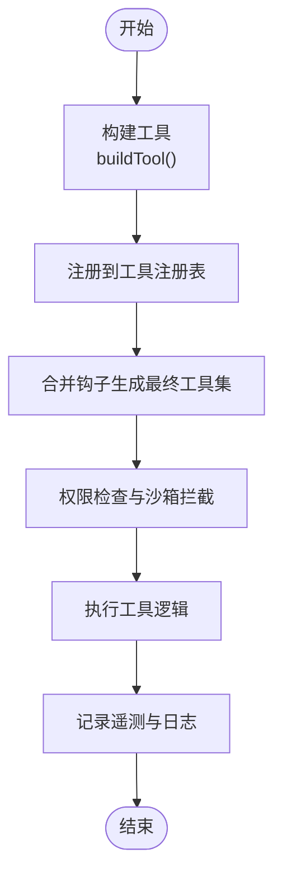
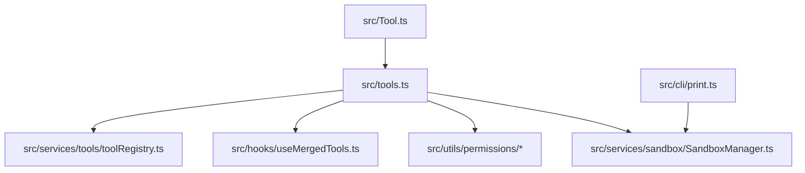

# 工具系统架构

<cite>
**本文档引用的文件**
- [src/Tool.ts](file://src/Tool.ts)
- [src/tools.ts](file://src/tools.ts)
- [src/tools/BashTool/bashCommandHelpers.ts](file://src/tools/BashTool/bashCommandHelpers.ts)
- [src/tools/AgentTool/builtInAgents.ts](file://src/tools/AgentTool/builtInAgents.ts)
- [src/tools/AgentTool/runAgent.ts](file://src/tools/AgentTool/runAgent.ts)
- [src/tools/FileReadTool/fileReadTool.ts](file://src/tools/FileReadTool/fileReadTool.ts)
- [src/tools/FileWriteTool/fileWriteTool.ts](file://src/tools/FileWriteTool/fileWriteTool.ts)
- [src/tools/WebSearchTool/webSearchTool.ts](file://src/tools/WebSearchTool/webSearchTool.ts)
- [src/tools/WebFetchTool/webFetchTool.ts](file://src/tools/WebFetchTool/webFetchTool.ts)
- [src/tools/MCPTool/mcpTool.ts](file://src/tools/MCPTool/mcpTool.ts)
- [src/services/tools/toolRegistry.ts](file://src/services/tools/toolRegistry.ts)
- [src/hooks/useMergedTools.ts](file://src/hooks/useMergedTools.ts)
- [src/utils/permissions/useCanUseTool.tsx](file://src/utils/permissions/useCanUseTool.tsx)
- [src/components/permissions/ToolPermissionDialog.tsx](file://src/components/permissions/ToolPermissionDialog.tsx)
- [src/services/sandbox/SandboxManager.ts](file://src/services/sandbox/SandboxManager.ts)
- [src/cli/print.ts](file://src/cli/print.ts)
- [src/utils/telemetry/sessionTracing.ts](file://src/utils/telemetry/sessionTracing.ts)
- [src/utils/teammateMailbox.ts](file://src/utils/teammateMailbox.ts)
- [src/commands/sandbox-toggle/sandbox-toggle.tsx](file://src/commands/sandbox-toggle/sandbox-toggle.tsx)
</cite>

## 目录
1. [简介](#简介)
2. [项目结构](#项目结构)
3. [核心组件](#核心组件)
4. [架构总览](#架构总览)
5. [详细组件分析](#详细组件分析)
6. [依赖关系分析](#依赖关系分析)
7. [性能考虑](#性能考虑)
8. [故障排除指南](#故障排除指南)
9. [结论](#结论)

## 简介
本文件系统性阐述 Claude Code 工具系统的架构设计与实现机制，覆盖工具抽象基类、工具接口定义、工具生命周期管理、工具分类体系、权限控制与安全沙箱、资源限制、工具开发标准流程（接口实现、参数验证、结果处理）、注册机制、依赖注入以及错误处理策略。目标是帮助开发者快速理解并高效扩展工具生态。

## 项目结构
工具系统围绕统一的工具抽象与构建器展开，按功能域划分为 Bash 工具、文件操作工具、网络工具、代理工具（Agent）与 MCP 工具等模块；权限与沙箱在运行时进行动态校验与拦截；注册与合并机制确保工具集合的可发现性与一致性。

**图表来源**
- [src/Tool.ts](file://src/Tool.ts)
- [src/tools.ts](file://src/tools.ts)
- [src/services/tools/toolRegistry.ts](file://src/services/tools/toolRegistry.ts)
- [src/hooks/useMergedTools.ts](file://src/hooks/useMergedTools.ts)
- [src/services/sandbox/SandboxManager.ts](file://src/services/sandbox/SandboxManager.ts)

**章节来源**
- [src/Tool.ts](file://src/Tool.ts)
- [src/tools.ts](file://src/tools.ts)

## 核心组件
- 工具抽象基类与构建器：提供统一的工具定义形状、默认方法填充与类型安全的构建流程，确保所有工具具备一致的生命周期钩子与权限接口。
- 工具实现：按领域划分的具体工具，均通过构建器完成标准化装配。
- 权限与沙箱：在工具执行前进行权限判定与网络/文件访问拦截，保障运行安全。
- 注册与合并：集中注册工具清单，通过合并钩子生成最终可用工具集。

**章节来源**
- [src/Tool.ts](file://src/Tool.ts)
- [src/services/tools/toolRegistry.ts](file://src/services/tools/toolRegistry.ts)
- [src/hooks/useMergedTools.ts](file://src/hooks/useMergedTools.ts)

## 架构总览
工具系统采用“抽象基类 + 构建器 + 领域实现 + 运行时服务”的分层架构。工具在构建阶段即获得默认行为（如只读、并发安全、破坏性标记、权限检查），在运行阶段由权限与沙箱服务协同拦截与授权，最终通过注册表与合并钩子暴露给上层调用方。

**图表来源**
- [src/Tool.ts](file://src/Tool.ts)
- [src/utils/permissions/useCanUseTool.tsx](file://src/utils/permissions/useCanUseTool.tsx)
- [src/services/sandbox/SandboxManager.ts](file://src/services/sandbox/SandboxManager.ts)
- [src/services/tools/toolRegistry.ts](file://src/services/tools/toolRegistry.ts)

## 详细组件分析

### 工具抽象与构建器
- 抽象基类与工具定义：工具定义接受输入/输出泛型与进度数据泛型，提供类型级的默认值填充与运行时合并。
- 默认方法：包含启用状态、并发安全性、只读/破坏性标记、权限检查、自动分类输入与用户可见名称等默认实现，保证工具最小可用契约。
- 构建器：将默认值与用户提供的定义进行浅合并，确保调用端无需处理缺失字段。

**图表来源**
- [src/Tool.ts](file://src/Tool.ts)

**章节来源**
- [src/Tool.ts](file://src/Tool.ts)

### 工具分类体系与实现要点
- Bash 工具：封装命令执行、环境变量与工作目录管理，支持超时与输出捕获，结合沙箱限制网络与文件访问。
- 文件操作工具：读取/写入文件，提供路径解析、权限校验与内容编码处理。
- 网络工具：网页搜索与抓取，包含请求头、重试与速率限制策略，配合沙箱拦截非白名单主机。
- 代理工具（Agent）：内置通用代理与专用代理，支持子代理派生、记忆与状态恢复。
- MCP 工具：对接外部 MCP 服务器，统一工具协议与结果格式化。

**图表来源**
- [src/tools/BashTool/bashCommandHelpers.ts](file://src/tools/BashTool/bashCommandHelpers.ts)
- [src/tools/FileReadTool/fileReadTool.ts](file://src/tools/FileReadTool/fileReadTool.ts)
- [src/tools/FileWriteTool/fileWriteTool.ts](file://src/tools/FileWriteTool/fileWriteTool.ts)
- [src/tools/WebSearchTool/webSearchTool.ts](file://src/tools/WebSearchTool/webSearchTool.ts)
- [src/tools/WebFetchTool/webFetchTool.ts](file://src/tools/WebFetchTool/webFetchTool.ts)
- [src/tools/AgentTool/builtInAgents.ts](file://src/tools/AgentTool/builtInAgents.ts)
- [src/tools/AgentTool/runAgent.ts](file://src/tools/AgentTool/runAgent.ts)
- [src/tools/MCPTool/mcpTool.ts](file://src/tools/MCPTool/mcpTool.ts)

**章节来源**
- [src/tools/BashTool/bashCommandHelpers.ts](file://src/tools/BashTool/bashCommandHelpers.ts)
- [src/tools/FileReadTool/fileReadTool.ts](file://src/tools/FileReadTool/fileReadTool.ts)
- [src/tools/FileWriteTool/fileWriteTool.ts](file://src/tools/FileWriteTool/fileWriteTool.ts)
- [src/tools/WebSearchTool/webSearchTool.ts](file://src/tools/WebSearchTool/webSearchTool.ts)
- [src/tools/WebFetchTool/webFetchTool.ts](file://src/tools/WebFetchTool/webFetchTool.ts)
- [src/tools/AgentTool/builtInAgents.ts](file://src/tools/AgentTool/builtInAgents.ts)
- [src/tools/AgentTool/runAgent.ts](file://src/tools/AgentTool/runAgent.ts)
- [src/tools/MCPTool/mcpTool.ts](file://src/tools/MCPTool/mcpTool.ts)

### 权限控制系统与安全沙箱
- 权限检查：工具在执行前调用权限服务，返回允许/拒绝与更新后的输入，确保敏感操作得到明确授权。
- 沙箱拦截：当检测到未授权的网络或文件访问时，沙箱会通过消息总线向主进程发起权限请求，等待批准后放行。
- CLI 启动：启动时若沙箱不可用且强制要求，则直接拒绝启动；否则提示沙箱禁用并继续运行。

**图表来源**
- [src/utils/permissions/useCanUseTool.tsx](file://src/utils/permissions/useCanUseTool.tsx)
- [src/services/sandbox/SandboxManager.ts](file://src/services/sandbox/SandboxManager.ts)
- [src/utils/teammateMailbox.ts](file://src/utils/teammateMailbox.ts)
- [src/cli/print.ts](file://src/cli/print.ts)

**章节来源**
- [src/utils/permissions/useCanUseTool.tsx](file://src/utils/permissions/useCanUseTool.tsx)
- [src/services/sandbox/SandboxManager.ts](file://src/services/sandbox/SandboxManager.ts)
- [src/utils/teammateMailbox.ts](file://src/utils/teammateMailbox.ts)
- [src/cli/print.ts](file://src/cli/print.ts)

### 工具生命周期管理
- 构建阶段：通过构建器填充默认方法，确保工具具备最小可用能力。
- 注册阶段：工具注册表收集所有已构建工具，形成全局可用清单。
- 使用阶段：合并钩子将内置与插件工具整合，提供统一查询与调用入口。
- 执行阶段：权限与沙箱介入，执行受控操作并记录遥测信息。

**图表来源**
- [src/Tool.ts](file://src/Tool.ts)
- [src/services/tools/toolRegistry.ts](file://src/services/tools/toolRegistry.ts)
- [src/hooks/useMergedTools.ts](file://src/hooks/useMergedTools.ts)
- [src/utils/telemetry/sessionTracing.ts](file://src/utils/telemetry/sessionTracing.ts)

**章节来源**
- [src/Tool.ts](file://src/Tool.ts)
- [src/services/tools/toolRegistry.ts](file://src/services/tools/toolRegistry.ts)
- [src/hooks/useMergedTools.ts](file://src/hooks/useMergedTools.ts)
- [src/utils/telemetry/sessionTracing.ts](file://src/utils/telemetry/sessionTracing.ts)

### 工具开发标准流程
- 实现工具接口：定义输入/输出类型与进度数据类型，提供必要的业务方法。
- 使用构建器：通过构建器传入自定义实现，自动获得默认方法与类型安全保证。
- 参数验证：在工具内部对输入进行严格校验，必要时利用权限服务更新输入。
- 结果处理：统一返回结构化结果，支持错误包装与进度回调。
- 注册与测试：将工具注册到注册表并通过合并钩子集成，编写单元与集成测试覆盖关键路径。

**章节来源**
- [src/Tool.ts](file://src/Tool.ts)
- [src/tools.ts](file://src/tools.ts)

## 依赖关系分析
- 工具抽象层依赖于构建器以提供默认行为与类型推断。
- 工具实现层依赖于权限服务与沙箱管理，确保执行安全。
- 注册与合并机制依赖于工具清单与上下文选择器，形成最终可用工具集。
- CLI 层负责沙箱初始化与不可用时的降级提示。

**图表来源**
- [src/Tool.ts](file://src/Tool.ts)
- [src/tools.ts](file://src/tools.ts)
- [src/services/tools/toolRegistry.ts](file://src/services/tools/toolRegistry.ts)
- [src/hooks/useMergedTools.ts](file://src/hooks/useMergedTools.ts)
- [src/utils/permissions/useCanUseTool.tsx](file://src/utils/permissions/useCanUseTool.tsx)
- [src/services/sandbox/SandboxManager.ts](file://src/services/sandbox/SandboxManager.ts)
- [src/cli/print.ts](file://src/cli/print.ts)

**章节来源**
- [src/Tool.ts](file://src/Tool.ts)
- [src/tools.ts](file://src/tools.ts)
- [src/services/tools/toolRegistry.ts](file://src/services/tools/toolRegistry.ts)
- [src/hooks/useMergedTools.ts](file://src/hooks/useMergedTools.ts)
- [src/utils/permissions/useCanUseTool.tsx](file://src/utils/permissions/useCanUseTool.tsx)
- [src/services/sandbox/SandboxManager.ts](file://src/services/sandbox/SandboxManager.ts)
- [src/cli/print.ts](file://src/cli/print.ts)

## 性能考虑
- 并发安全：默认假设工具不具备并发安全性，避免共享状态引发竞态；需要并发安全的工具应显式声明。
- 只读优先：默认假设工具可能产生副作用，只读工具需明确标注以启用更严格的沙箱策略。
- 沙箱开销：沙箱拦截与权限请求存在额外延迟，建议在批量任务中合并请求与复用会话。
- 遥测与追踪：通过统一的追踪器记录工具执行时间与异常，便于定位性能瓶颈。

## 故障排除指南
- 沙箱不可用：CLI 启动时若沙箱不可用且强制要求，将直接退出；否则会打印警告并继续运行。可通过沙箱切换命令检查依赖与平台限制。
- 权限被拒：工具执行被权限服务拒绝时，检查工具是否正确实现权限检查与输入更新；确认用户授权流程是否完成。
- 网络访问失败：沙箱拦截未授权主机时，检查 MCP 或网络工具的白名单配置；通过消息总线确认授权请求是否到达主进程。

**章节来源**
- [src/cli/print.ts](file://src/cli/print.ts)
- [src/commands/sandbox-toggle/sandbox-toggle.tsx](file://src/commands/sandbox-toggle/sandbox-toggle.tsx)
- [src/utils/teammateMailbox.ts](file://src/utils/teammateMailbox.ts)

## 结论
Claude Code 工具系统通过统一的抽象与构建器、严格的权限与沙箱控制、完善的注册与合并机制，实现了高内聚、低耦合、可扩展的工具生态。遵循本文档的开发流程与最佳实践，可以快速构建安全、可靠且易于维护的工具实现。