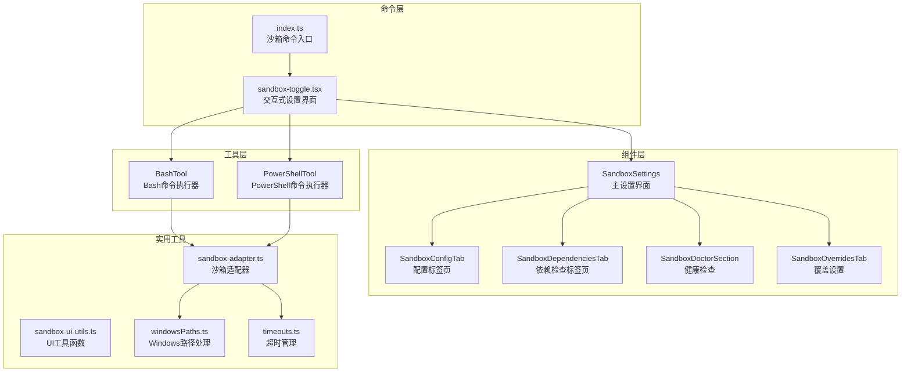
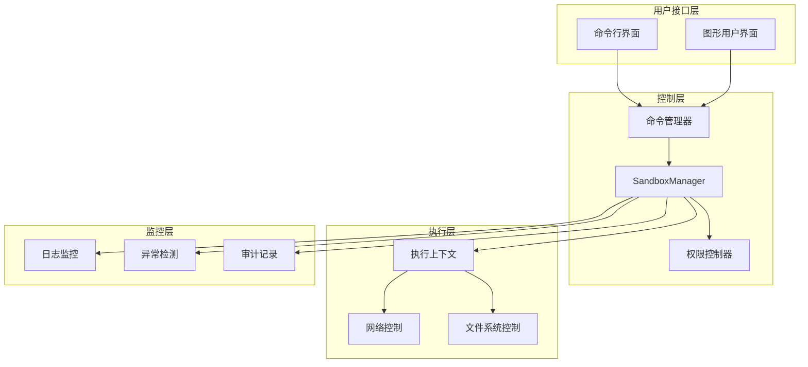
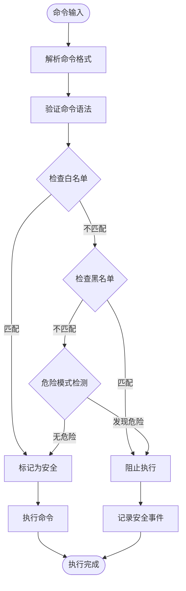
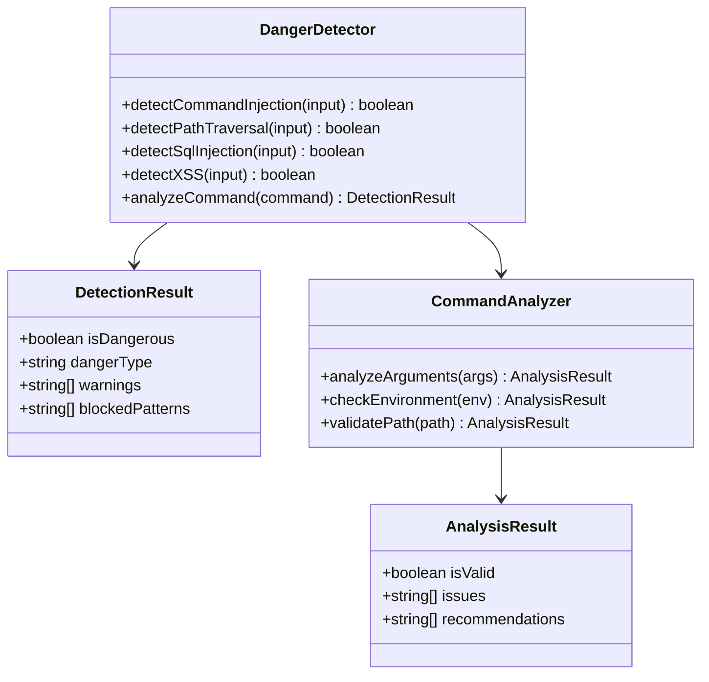
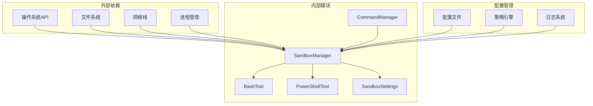

# 安全沙箱机制

<cite>
**本文档引用的文件**
- [src/commands/sandbox-toggle/index.ts](file://src/commands/sandbox-toggle/index.ts)
- [src/commands/sandbox-toggle/sandbox-toggle.tsx](file://src/commands/sandbox-toggle/sandbox-toggle.tsx)
- [src/commands.ts](file://src/commands.ts)
- [src/main.tsx](file://src/main.tsx)
- [src/utils/timeouts.ts](file://src/utils/timeouts.ts)
- [src/setup.ts](file://src/setup.ts)
- [src/cli/print.ts](file://src/cli/print.ts)
- [src/utils/windowsPaths.ts](file://src/utils/windowsPaths.ts)
- [src/tools/BashTool/BashTool.tsx](file://src/tools/BashTool/BashTool.tsx)
- [src/tools/PowerShellTool/PowerShellTool.tsx](file://src/tools/PowerShellTool/PowerShellTool.tsx)
- [src/components/sandbox/SandboxSettings.tsx](file://src/components/sandbox/SandboxSettings.tsx)
- [src/components/sandbox/SandboxConfigTab.tsx](file://src/components/sandbox/SandboxConfigTab.tsx)
- [src/components/sandbox/SandboxDependenciesTab.tsx](file://src/components/sandbox/SandboxDependenciesTab.tsx)
- [src/components/sandbox/SandboxDoctorSection.tsx](file://src/components/sandbox/SandboxDoctorSection.tsx)
- [src/components/sandbox/SandboxOverridesTab.tsx](file://src/components/sandbox/SandboxOverridesTab.tsx)
</cite>

## 目录
1. [简介](#简介)
2. [项目结构](#项目结构)
3. [核心组件](#核心组件)
4. [架构概览](#架构概览)
5. [详细组件分析](#详细组件分析)
6. [依赖关系分析](#依赖关系分析)
7. [性能考虑](#性能考虑)
8. [故障排除指南](#故障排除指南)
9. [结论](#结论)

## 简介

安全沙箱机制是 Claude Code 中的核心安全防护体系，旨在为命令执行提供多层保护，防止潜在的安全威胁和意外破坏。该机制通过命令安全过滤、危险模式检测和执行环境隔离等手段，确保用户在使用终端命令时的安全性。

本系统支持多种平台和shell环境，包括 Bash 和 PowerShell，并提供了灵活的配置选项来适应不同的安全需求。通过白名单管理、黑名单策略以及实时监控功能，系统能够有效识别和阻止潜在的危险操作。

## 项目结构

安全沙箱机制在项目中的组织结构如下：

**图表来源**
- [src/commands/sandbox-toggle/index.ts:1-50](file://src/commands/sandbox-toggle/index.ts#L1-L50)
- [src/commands/sandbox-toggle/sandbox-toggle.tsx:22-58](file://src/commands/sandbox-toggle/sandbox-toggle.tsx#L22-L58)
- [src/tools/BashTool/BashTool.tsx](file://src/tools/BashTool/BashTool.tsx)
- [src/tools/PowerShellTool/PowerShellTool.tsx](file://src/tools/PowerShellTool/PowerShellTool.tsx)

**章节来源**
- [src/commands/sandbox-toggle/index.ts:1-50](file://src/commands/sandbox-toggle/index.ts#L1-L50)
- [src/commands/sandbox-toggle/sandbox-toggle.tsx:22-58](file://src/commands/sandbox-toggle/sandbox-toggle.tsx#L22-L58)

## 核心组件

### 沙箱管理器 (SandboxManager)

沙箱管理器是整个安全沙箱系统的核心协调者，负责：

- **状态管理**：跟踪沙箱启用状态、自动允许模式和降级策略
- **平台检测**：验证当前平台是否支持沙箱功能
- **依赖检查**：确保所有必需的沙箱组件正常工作
- **策略应用**：实施安全策略和权限控制

### 命令执行器

系统提供专门的命令执行器来处理不同类型的shell命令：

- **BashTool**：处理 Bash 命令，支持参数验证和危险模式检测
- **PowerShellTool**：处理 PowerShell 命令，提供类似的安全保护机制

### 配置界面

交互式配置界面提供了完整的沙箱设置管理：

- **SandboxSettings**：主设置界面，集成所有配置选项
- **SandboxConfigTab**：核心配置管理
- **SandboxDependenciesTab**：依赖项检查和安装指导
- **SandboxDoctorSection**：健康状态诊断
- **SandboxOverridesTab**：高级覆盖设置

**章节来源**
- [src/components/sandbox/SandboxSettings.tsx](file://src/components/sandbox/SandboxSettings.tsx)
- [src/components/sandbox/SandboxConfigTab.tsx](file://src/components/sandbox/SandboxConfigTab.tsx)
- [src/components/sandbox/SandboxDependenciesTab.tsx](file://src/components/sandbox/SandboxDependenciesTab.tsx)
- [src/components/sandbox/SandboxDoctorSection.tsx](file://src/components/sandbox/SandboxDoctorSection.tsx)
- [src/components/sandbox/SandboxOverridesTab.tsx](file://src/components/sandbox/SandboxOverridesTab.tsx)

## 架构概览

安全沙箱系统的整体架构采用分层设计，确保各组件之间的职责清晰分离：

**图表来源**
- [src/commands/sandbox-toggle/index.ts:5-48](file://src/commands/sandbox-toggle/index.ts#L5-L48)
- [src/commands/sandbox-toggle/sandbox-toggle.tsx:43-44](file://src/commands/sandbox-toggle/sandbox-toggle.tsx#L43-L44)

## 详细组件分析

### 命令安全过滤机制

命令安全过滤是沙箱系统的核心功能之一，通过多层次的验证确保命令执行的安全性：

**图表来源**
- [src/commands/sandbox-toggle/sandbox-toggle.tsx:48-58](file://src/commands/sandbox-toggle/sandbox-toggle.tsx#L48-L58)

#### Bash 命令安全过滤

Bash 命令的安全过滤包括：

- **参数验证**：检查命令参数的有效性和安全性
- **路径解析**：验证文件路径的合法性
- **环境变量检查**：确保环境变量不会被恶意利用
- **重定向防护**：防止危险的文件重定向操作

#### PowerShell 命令安全过滤

PowerShell 命令的安全过滤具有以下特点：

- **脚本块验证**：检查 PowerShell 脚本块的安全性
- **执行策略控制**：应用适当的执行策略
- **远程签名验证**：验证远程脚本的签名
- **历史记录保护**：防止敏感信息泄露

**章节来源**
- [src/tools/BashTool/BashTool.tsx](file://src/tools/BashTool/BashTool.tsx)
- [src/tools/PowerShellTool/PowerShellTool.tsx](file://src/tools/PowerShellTool/PowerShellTool.tsx)

### 危险模式检测系统

危险模式检测系统能够识别和阻止潜在的恶意或危险操作：

**图表来源**
- [src/tools/BashTool/BashTool.tsx](file://src/tools/BashTool/BashTool.tsx)
- [src/tools/PowerShellTool/PowerShellTool.tsx](file://src/tools/PowerShellTool/PowerShellTool.tsx)

### 执行环境隔离

执行环境隔离确保命令在受控环境中运行，防止对主机系统的访问：

#### 网络隔离

网络隔离通过以下机制实现：

- **出站连接控制**：限制命令的网络访问能力
- **DNS 解析限制**：控制域名解析请求
- **端口扫描防护**：检测和阻止端口扫描活动
- **代理服务器支持**：支持企业网络环境下的代理配置

#### 文件系统隔离

文件系统隔离包括：

- **根目录限制**：限制命令只能访问指定目录
- **符号链接防护**：防止通过符号链接访问受限区域
- **权限继承控制**：确保命令无法继承宿主权限
- **临时文件管理**：安全地处理临时文件和缓存

#### 进程隔离

进程隔离机制：

- **进程树限制**：防止子进程逃逸到父进程空间
- **资源限制**：控制CPU、内存和I/O使用
- **信号处理**：限制对进程信号的访问
- **会话隔离**：确保每个命令在独立的会话中运行

**章节来源**
- [src/utils/timeouts.ts:1-39](file://src/utils/timeouts.ts#L1-L39)
- [src/setup.ts:395-414](file://src/setup.ts#L395-L414)

### 安全配置选项

系统提供了丰富的安全配置选项：

#### 沙箱启用策略

- **自动启用**：根据平台和配置自动启用沙箱
- **手动控制**：允许用户手动启用或禁用沙箱
- **条件启用**：基于特定条件动态启用沙箱

#### 白名单管理

白名单系统支持：

- **精确匹配**：完全匹配的命令允许执行
- **通配符支持**：支持通配符模式匹配
- **参数验证**：允许同时验证命令和参数
- **动态更新**：支持运行时更新白名单规则

#### 黑名单策略

黑名单系统包括：

- **精确阻断**：完全阻断的命令
- **模式匹配**：基于模式的阻断规则
- **危险级别分类**：按危险程度分类管理
- **自动更新**：定期更新黑名单数据库

#### 超时管理

超时管理系统：

- **默认超时**：标准的命令执行超时时间
- **最大超时**：最长允许的执行时间
- **环境变量配置**：支持通过环境变量调整超时
- **动态调整**：根据命令复杂度动态调整

**章节来源**
- [src/utils/timeouts.ts:12-39](file://src/utils/timeouts.ts#L12-L39)
- [src/utils/windowsPaths.ts:87-117](file://src/utils/windowsPaths.ts#L87-L117)

### 安全事件监控

安全事件监控系统提供实时的安全事件检测和报告：

#### 异常行为检测

异常行为检测包括：

- **执行频率监控**：检测异常频繁的命令执行
- **资源使用异常**：监控CPU、内存和磁盘使用异常
- **网络活动异常**：检测异常的网络连接模式
- **文件访问模式**：监控异常的文件访问行为

#### 审计功能

审计系统记录：

- **命令执行日志**：详细记录每次命令执行
- **权限变更历史**：跟踪权限设置的变更
- **安全事件报告**：生成安全事件摘要
- **合规性报告**：满足合规要求的审计记录

#### 实时告警

实时告警机制：

- **邮件通知**：严重安全事件的邮件告警
- **桌面通知**：系统托盘通知
- **日志记录**：详细的事件日志
- **自动响应**：可配置的自动响应策略

**章节来源**
- [src/cli/print.ts:598-626](file://src/cli/print.ts#L598-L626)
- [src/main.tsx:1750-1777](file://src/main.tsx#L1750-L1777)

## 依赖关系分析

安全沙箱系统的依赖关系体现了模块化设计的优势：

**图表来源**
- [src/commands/sandbox-toggle/index.ts:1-3](file://src/commands/sandbox-toggle/index.ts#L1-L3)
- [src/commands.ts](file://src/commands.ts#L336)

### 组件耦合度分析

系统采用了低耦合的设计原则：

- **SandboxManager** 作为中央协调器，与其他组件松散耦合
- **工具类组件** 专注于特定功能，职责单一
- **配置组件** 提供统一的配置接口
- **监控组件** 独立于业务逻辑之外

### 循环依赖避免

系统通过以下方式避免循环依赖：

- **单向数据流**：从上到下的数据传递
- **接口抽象**：通过接口定义组件边界
- **事件驱动**：使用事件机制解耦组件通信
- **工厂模式**：延迟对象创建时机

**章节来源**
- [src/commands.ts:327-346](file://src/commands.ts#L327-L346)

## 性能考虑

安全沙箱系统在保证安全性的同时，也注重性能优化：

### 启动性能

- **懒加载**：非关键功能按需加载
- **缓存策略**：合理使用缓存减少重复计算
- **异步初始化**：避免阻塞主线程
- **渐进式启用**：逐步启用安全检查功能

### 运行时性能

- **最小化开销**：安全检查尽量轻量级
- **批量处理**：合并相似的安全检查
- **智能缓存**：缓存昂贵的操作结果
- **资源池化**：复用连接和资源

### 内存管理

- **及时释放**：及时清理不再使用的资源
- **内存池**：预分配常用大小的内存块
- **垃圾回收优化**：减少GC停顿时间
- **弱引用**：避免不必要的强引用

## 故障排除指南

### 常见问题诊断

#### 沙箱无法启动

可能原因和解决方案：

- **依赖缺失**：检查必要的系统组件是否安装
- **权限不足**：确保有足够的权限启用沙箱
- **平台不支持**：确认当前平台是否支持沙箱功能
- **配置冲突**：检查是否有冲突的配置设置

#### 命令执行失败

常见原因：

- **白名单配置错误**：检查命令是否在白名单中
- **参数验证失败**：验证命令参数的正确性
- **路径解析问题**：确认文件路径的有效性
- **环境变量污染**：检查环境变量的安全性

#### 性能问题

性能问题排查：

- **超时设置过短**：适当增加超时时间
- **资源限制过严**：调整资源使用限制
- **监控开销过大**：优化监控配置
- **日志过多**：减少不必要的日志记录

### 调试工具

系统提供了多种调试工具：

- **详细日志**：启用详细日志模式查看完整执行过程
- **状态检查**：检查沙箱的当前状态和配置
- **依赖验证**：验证所有依赖项的可用性
- **性能分析**：分析安全检查的性能影响

**章节来源**
- [src/cli/print.ts:598-626](file://src/cli/print.ts#L598-L626)
- [src/commands/sandbox-toggle/sandbox-toggle.tsx:22-58](file://src/commands/sandbox-toggle/sandbox-toggle.tsx#L22-L58)

## 结论

安全沙箱机制为 Claude Code 提供了全面的安全保护，通过多层次的安全防护、灵活的配置选项和完善的监控审计功能，有效降低了命令执行的风险。

系统的主要优势包括：

- **模块化设计**：清晰的组件分离和职责划分
- **灵活配置**：支持多种安全策略和配置选项
- **实时监控**：提供持续的安全事件检测和报告
- **跨平台支持**：支持多种操作系统和shell环境
- **性能优化**：在保证安全性的同时注重性能表现

未来可以进一步改进的方向：

- **机器学习增强**：引入AI技术提升异常检测准确性
- **云原生支持**：增强对容器化和云环境的支持
- **合规性增强**：满足更多行业标准和法规要求
- **用户体验优化**：简化配置流程，提升易用性

通过持续的改进和完善，安全沙箱机制将继续为用户提供可靠的安全保障。