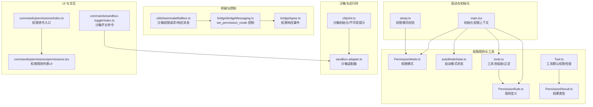
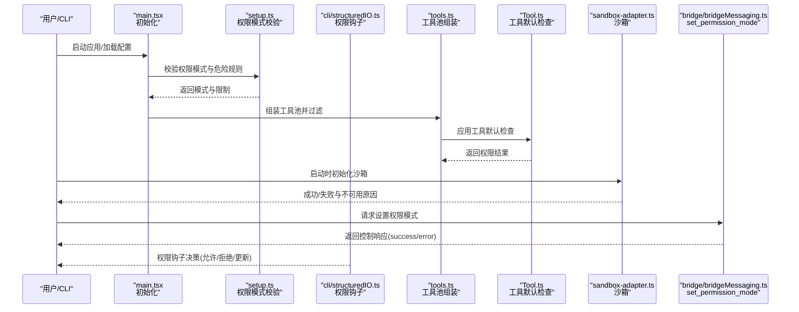
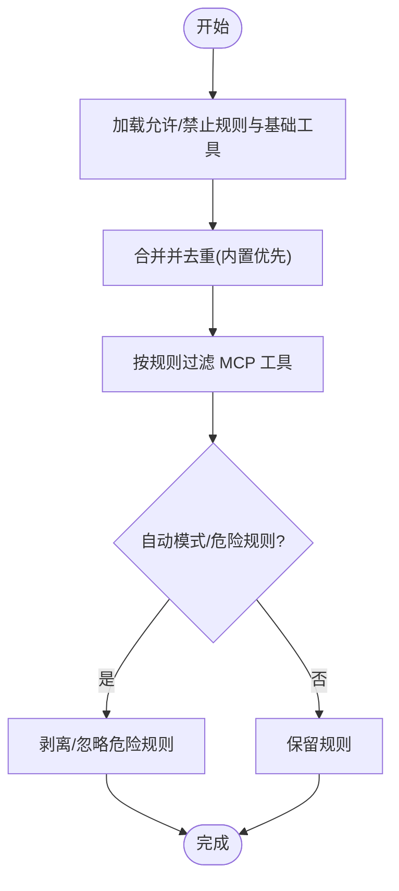
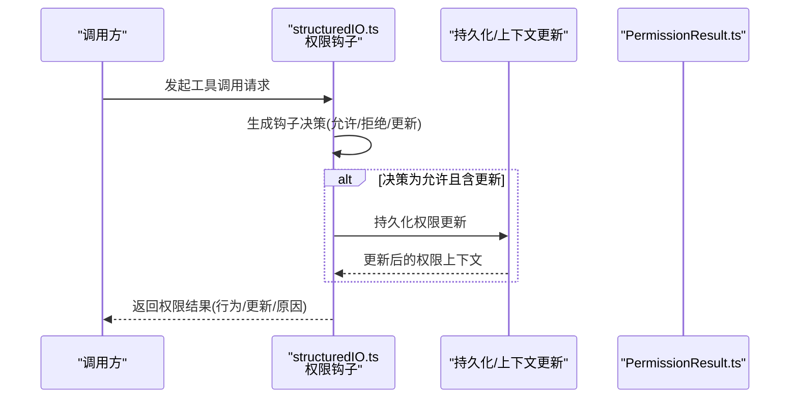
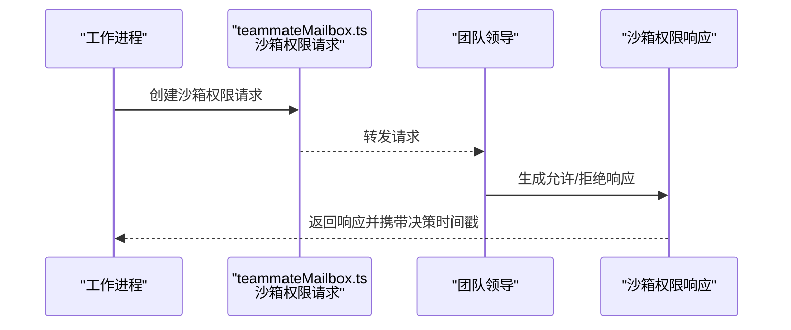
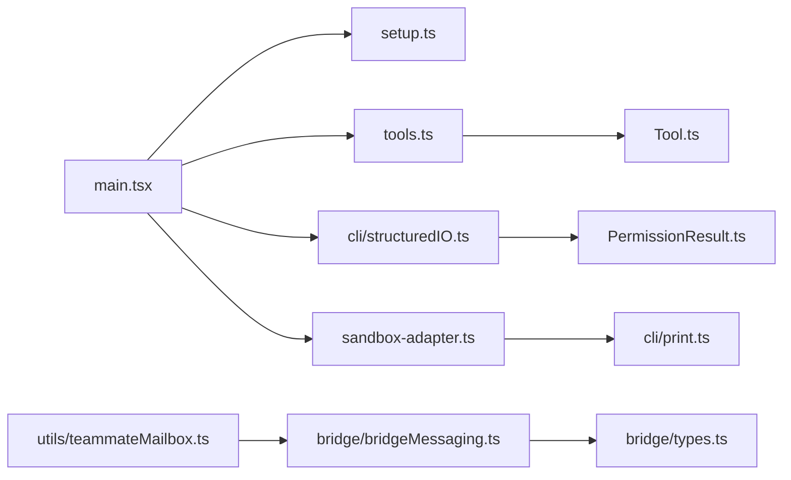

# 权限与安全控制

<cite>
**本文引用的文件**
- [src/main.tsx](file://src/main.tsx)
- [src/setup.ts](file://src/setup.ts)
- [src/cli/print.ts](file://src/cli/print.ts)
- [src/tools.ts](file://src/tools.ts)
- [src/Tool.ts](file://src/Tool.ts)
- [src/cli/structuredIO.ts](file://src/cli/structuredIO.ts)
- [src/commands/permissions/index.ts](file://src/commands/permissions/index.ts)
- [src/commands/permissions/permissions.tsx](file://src/commands/permissions/permissions.tsx)
- [src/commands/sandbox-toggle/index.ts](file://src/commands/sandbox-toggle/index.ts)
- [src/commands.ts](file://src/commands.ts)
- [src/bridge/bridgeMessaging.ts](file://src/bridge/bridgeMessaging.ts)
- [src/bridge/types.ts](file://src/bridge/types.ts)
- [src/utils/teammateMailbox.ts](file://src/utils/teammateMailbox.ts)
- [src/utils/timeouts.ts](file://src/utils/timeouts.ts)
- [src/utils/permissions/PermissionMode.ts](file://src/utils/permissions/PermissionMode.ts)
- [src/utils/permissions/PermissionResult.ts](file://src/utils/permissions/PermissionResult.ts)
- [src/utils/permissions/PermissionRule.ts](file://src/utils/permissions/PermissionRule.ts)
- [src/utils/permissions/PermissionUpdate.ts](file://src/utils/permissions/PermissionUpdate.ts)
- [src/utils/permissions/autoModeState.ts](file://src/utils/permissions/autoModeState.ts)
- [src/utils/permissions/bashClassifier.ts](file://src/utils/permissions/bashClassifier.ts)
- [src/utils/permissions/dangerousPatterns.ts](file://src/utils/permissions/dangerousPatterns.ts)
- [src/utils/permissions/bypassPermissionsKillswitch.ts](file://src/utils/permissions/bypassPermissionsKillswitch.ts)
- [src/utils/permissions/classifierDecision.ts](file://src/utils/permissions/classifierDecision.ts)
- [src/utils/permissions/classifierShared.ts](file://src/utils/permissions/classifierShared.ts)
- [src/utils/permissions/PermissionPromptToolResultSchema.ts](file://src/utils/permissions/PermissionPromptToolResultSchema.ts)
- [src/utils/sandbox/sandbox-adapter.ts](file://src/utils/sandbox/sandbox-adapter.ts)
- [src/commands/security-review.ts](file://src/commands/security-review.ts)
- [src/bridge/debugUtils.ts](file://src/bridge/debugUtils.ts)
- [docs/07-feature-gates.md](file://docs/07-feature-gates.md)
</cite>

## 目录
1. [引言](#引言)
2. [项目结构](#项目结构)
3. [核心组件](#核心组件)
4. [架构总览](#架构总览)
5. [详细组件分析](#详细组件分析)
6. [依赖关系分析](#依赖关系分析)
7. [性能考量](#性能考量)
8. [故障排查指南](#故障排查指南)
9. [结论](#结论)
10. [附录](#附录)

## 引言
本文件系统性梳理 Claude Code 的权限与安全控制体系，覆盖权限分类、权限检查机制、权限决策流程、工具类型权限要求（尤其是 Bash/PowerShell 的文件系统、网络与进程执行权限）、安全沙箱机制、命令白名单与危险操作防护、权限规则配置、权限提升流程、审计日志与调试脱敏、以及权限绕过机制、紧急停用开关与安全事件响应策略。目标是帮助开发者与运维人员在理解现有实现的基础上，正确配置与扩展安全能力。

## 项目结构
围绕权限与安全的关键目录与文件：
- 权限规则与上下文：src/utils/permissions/*、src/tools.ts、src/Tool.ts
- 权限模式与自动模式：src/utils/permissions/PermissionMode.ts、src/utils/permissions/autoModeState.ts、src/utils/permissions/classifierDecision.ts
- 沙箱与运行时：src/utils/sandbox/sandbox-adapter.ts、src/cli/print.ts
- 命令与桥接：src/commands.ts、src/bridge/bridgeMessaging.ts、src/bridge/types.ts
- 用户界面与交互：src/commands/permissions/、src/commands/sandbox-toggle/index.ts
- 安全审查与调试：src/commands/security-review.ts、src/bridge/debugUtils.ts
- 特性开关与远程控制：docs/07-feature-gates.md

图表来源
- [src/main.tsx:1750-1777](file://src/main.tsx#L1750-L1777)
- [src/setup.ts:395-414](file://src/setup.ts#L395-L414)
- [src/utils/permissions/PermissionRule.ts](file://src/utils/permissions/PermissionRule.ts)
- [src/utils/permissions/PermissionResult.ts](file://src/utils/permissions/PermissionResult.ts)
- [src/utils/permissions/PermissionMode.ts](file://src/utils/permissions/PermissionMode.ts)
- [src/utils/permissions/autoModeState.ts](file://src/utils/permissions/autoModeState.ts)
- [src/Tool.ts:743-774](file://src/Tool.ts#L743-L774)
- [src/tools.ts:253-352](file://src/tools.ts#L253-L352)
- [src/utils/sandbox/sandbox-adapter.ts](file://src/utils/sandbox/sandbox-adapter.ts)
- [src/cli/print.ts:598-626](file://src/cli/print.ts#L598-L626)
- [src/bridge/bridgeMessaging.ts:328-371](file://src/bridge/bridgeMessaging.ts#L328-L371)
- [src/bridge/types.ts:117-131](file://src/bridge/types.ts#L117-L131)
- [src/utils/teammateMailbox.ts:538-645](file://src/utils/teammateMailbox.ts#L538-L645)
- [src/commands/permissions/index.ts:1-11](file://src/commands/permissions/index.ts#L1-L11)
- [src/commands/permissions/permissions.tsx:1-9](file://src/commands/permissions/permissions.tsx#L1-L9)
- [src/commands/sandbox-toggle/index.ts:1-50](file://src/commands/sandbox-toggle/index.ts#L1-L50)

章节来源
- [src/main.tsx:1750-1777](file://src/main.tsx#L1750-L1777)
- [src/setup.ts:395-414](file://src/setup.ts#L395-L414)
- [src/cli/print.ts:598-626](file://src/cli/print.ts#L598-L626)
- [src/commands/permissions/index.ts:1-11](file://src/commands/permissions/index.ts#L1-L11)
- [src/commands/sandbox-toggle/index.ts:1-50](file://src/commands/sandbox-toggle/index.ts#L1-L50)

## 核心组件
- 权限规则与结果
  - 规则定义：用于描述允许/拒绝某类工具或输入的规则集，支持通配与前缀匹配等。
  - 结果类型：统一的权限决策结果，包含行为（允许/拒绝/更新输入）、更新后的输入、决策原因等。
- 权限模式与自动模式
  - 权限模式：普通、绕过、自动模式等，影响规则生效范围与危险规则的处理策略。
  - 自动模式状态：在特定特性开关开启时，对危险规则进行裁剪或限制。
- 工具权限检查
  - 工具默认检查：所有工具默认采用“允许”策略，具体工具可覆盖以实现更严格限制。
  - 工具池组装：根据权限上下文过滤内置与 MCP 工具，去重并优先内置工具。
- 沙箱与运行时
  - 沙箱适配器：封装平台沙箱能力，提供初始化、不可用原因查询、依赖检查等。
  - CLI 初始化：在启动阶段尝试初始化沙箱，若依赖缺失则按策略提示或终止。
- 桥接与控制
  - set_permission_mode 控制：通过桥接协议设置权限模式，返回成功/错误响应。
  - 沙箱权限请求/响应消息：跨进程/跨组件传递网络访问许可请求与响应。
- UI 与交互
  - 权限命令：列出与管理权限规则，支持重试被拒的权限请求。
  - 沙箱开关命令：展示当前沙箱状态与可配置项。

章节来源
- [src/utils/permissions/PermissionRule.ts](file://src/utils/permissions/PermissionRule.ts)
- [src/utils/permissions/PermissionResult.ts](file://src/utils/permissions/PermissionResult.ts)
- [src/utils/permissions/PermissionMode.ts](file://src/utils/permissions/PermissionMode.ts)
- [src/utils/permissions/autoModeState.ts](file://src/utils/permissions/autoModeState.ts)
- [src/Tool.ts:743-774](file://src/Tool.ts#L743-L774)
- [src/tools.ts:253-352](file://src/tools.ts#L253-L352)
- [src/utils/sandbox/sandbox-adapter.ts](file://src/utils/sandbox/sandbox-adapter.ts)
- [src/cli/print.ts:598-626](file://src/cli/print.ts#L598-L626)
- [src/bridge/bridgeMessaging.ts:328-371](file://src/bridge/bridgeMessaging.ts#L328-L371)
- [src/utils/teammateMailbox.ts:538-645](file://src/utils/teammateMailbox.ts#L538-L645)
- [src/commands/permissions/index.ts:1-11](file://src/commands/permissions/index.ts#L1-L11)
- [src/commands/permissions/permissions.tsx:1-9](file://src/commands/permissions/permissions.tsx#L1-L9)
- [src/commands/sandbox-toggle/index.ts:1-50](file://src/commands/sandbox-toggle/index.ts#L1-L50)

## 架构总览
权限与安全控制贯穿启动、工具选择、运行时决策与沙箱拦截等环节。整体流程如下：

图表来源
- [src/main.tsx:1750-1777](file://src/main.tsx#L1750-L1777)
- [src/setup.ts:395-414](file://src/setup.ts#L395-L414)
- [src/cli/structuredIO.ts:808-859](file://src/cli/structuredIO.ts#L808-L859)
- [src/tools.ts:253-352](file://src/tools.ts#L253-L352)
- [src/Tool.ts:743-774](file://src/Tool.ts#L743-L774)
- [src/utils/sandbox/sandbox-adapter.ts](file://src/utils/sandbox/sandbox-adapter.ts)
- [src/bridge/bridgeMessaging.ts:328-371](file://src/bridge/bridgeMessaging.ts#L328-L371)

## 详细组件分析

### 权限分类与规则
- 规则类型
  - 工具级规则：针对具体工具名称或前缀（如 MCP 服务器前缀）进行允许/拒绝。
  - 输入级规则：基于工具输入内容的条件匹配（例如危险模式检测）。
  - 模式级规则：在自动模式下对危险规则进行裁剪或忽略。
- 规则来源与合并
  - CLI/配置传入的允许/禁止列表与基础工具集合合并。
  - MCP 工具在进入模型可见集合之前即按规则过滤，避免泄露。
- 危险规则处理
  - 对于外部用户（ant=external），过度宽泛的 Bash/PowerShell 规则会被忽略或移除。
  - 自动模式下，危险规则可能被剥离，降低误用风险。

图表来源
- [src/tools.ts:253-352](file://src/tools.ts#L253-L352)
- [src/main.tsx:1750-1777](file://src/main.tsx#L1750-L1777)

章节来源
- [src/utils/permissions/PermissionRule.ts](file://src/utils/permissions/PermissionRule.ts)
- [src/utils/permissions/dangerousPatterns.ts](file://src/utils/permissions/dangerousPatterns.ts)
- [src/utils/permissions/autoModeState.ts](file://src/utils/permissions/autoModeState.ts)
- [src/main.tsx:1750-1777](file://src/main.tsx#L1750-L1777)
- [src/tools.ts:253-352](file://src/tools.ts#L253-L352)

### 权限检查机制与决策流程
- 工具默认检查
  - 所有工具默认“允许”，具体工具可覆盖以实现更严格的检查。
- 权限钩子
  - 在工具调用前，可通过钩子生成“允许/拒绝/更新输入”的决策；若提供更新，会持久化并即时更新权限上下文。
- 权限结果
  - 统一的权限结果类型承载行为、更新后的输入与决策原因，便于审计与回溯。

图表来源
- [src/Tool.ts:743-774](file://src/Tool.ts#L743-L774)
- [src/cli/structuredIO.ts:808-859](file://src/cli/structuredIO.ts#L808-L859)
- [src/utils/permissions/PermissionResult.ts](file://src/utils/permissions/PermissionResult.ts)

章节来源
- [src/Tool.ts:743-774](file://src/Tool.ts#L743-L774)
- [src/cli/structuredIO.ts:808-859](file://src/cli/structuredIO.ts#L808-L859)
- [src/utils/permissions/PermissionResult.ts](file://src/utils/permissions/PermissionResult.ts)

### 不同工具类型的权限要求
- Bash/PowerShell 工具
  - 文件系统权限：受沙箱限制；在未启用沙箱时，需谨慎配置规则，避免过度宽泛。
  - 网络访问权限：沙箱运行时检测到非允许主机访问时，通过邮箱消息向团队领导发起许可请求。
  - 进程执行权限：默认允许，但可通过规则与自动模式裁剪危险命令。
- 其他工具
  - 文件读写、网络检索、浏览器/桌面集成等工具均遵循统一的权限检查与规则过滤流程。

章节来源
- [src/utils/teammateMailbox.ts:538-645](file://src/utils/teammateMailbox.ts#L538-L645)
- [src/utils/permissions/bashClassifier.ts](file://src/utils/permissions/bashClassifier.ts)
- [src/tools.ts:253-352](file://src/tools.ts#L253-L352)

### 安全沙箱机制、命令白名单与危险操作防护
- 沙箱初始化与不可用提示
  - 启动时尝试初始化沙箱；若依赖缺失且强制要求，则直接退出；否则发出警告提示。
- 命令白名单
  - 通过规则系统实现工具白名单/黑名单；MCP 工具在进入模型可见集合前即被过滤。
- 危险操作防护
  - 自动模式下剥离危险规则；外部用户场景忽略过度宽泛的 Bash/PowerShell 规则。
  - Bash 命令分类器与危险模式检测辅助决策。

章节来源
- [src/cli/print.ts:598-626](file://src/cli/print.ts#L598-L626)
- [src/utils/sandbox/sandbox-adapter.ts](file://src/utils/sandbox/sandbox-adapter.ts)
- [src/utils/permissions/bashClassifier.ts](file://src/utils/permissions/bashClassifier.ts)
- [src/utils/permissions/dangerousPatterns.ts](file://src/utils/permissions/dangerousPatterns.ts)
- [src/main.tsx:1750-1777](file://src/main.tsx#L1750-L1777)

### 权限规则配置方法、权限提升流程与审计日志
- 配置方法
  - 通过命令列出与管理权限规则；支持重试被拒的权限请求。
  - CLI 启动时可传入允许/禁止列表与基础工具集合，参与初始权限上下文构建。
- 权限提升流程
  - 权限钩子可返回“始终允许”的更新，持久化后即时生效。
- 审计与日志
  - 权限结果包含决策原因；调试日志支持敏感信息脱敏与长度截断，避免泄露。

章节来源
- [src/commands/permissions/index.ts:1-11](file://src/commands/permissions/index.ts#L1-L11)
- [src/commands/permissions/permissions.tsx:1-9](file://src/commands/permissions/permissions.tsx#L1-L9)
- [src/cli/structuredIO.ts:808-859](file://src/cli/structuredIO.ts#L808-L859)
- [src/bridge/debugUtils.ts:1-43](file://src/bridge/debugUtils.ts#L1-L43)

### 权限绕过机制、紧急停用开关与安全事件响应
- 绕过机制
  - 权限模式可设置为“绕过”，但存在环境限制（例如非沙箱下的 root/sudo 会被拒绝）。
  - 提供紧急停用开关以阻止危险行为。
- 安全事件响应
  - 沙箱违规与网络许可请求通过专用消息在团队成员间流转，支持批准/拒绝与审计追踪。
  - 桥接协议支持设置权限模式的控制响应，便于远程控制与审计。

图表来源
- [src/utils/teammateMailbox.ts:538-645](file://src/utils/teammateMailbox.ts#L538-L645)
- [src/bridge/bridgeMessaging.ts:328-371](file://src/bridge/bridgeMessaging.ts#L328-L371)
- [src/bridge/types.ts:117-131](file://src/bridge/types.ts#L117-L131)

章节来源
- [src/setup.ts:395-414](file://src/setup.ts#L395-L414)
- [src/utils/permissions/bypassPermissionsKillswitch.ts](file://src/utils/permissions/bypassPermissionsKillswitch.ts)
- [src/utils/teammateMailbox.ts:538-645](file://src/utils/teammateMailbox.ts#L538-L645)
- [src/bridge/bridgeMessaging.ts:328-371](file://src/bridge/bridgeMessaging.ts#L328-L371)
- [src/bridge/types.ts:117-131](file://src/bridge/types.ts#L117-L131)

## 依赖关系分析
- 启动阶段
  - main.tsx 负责初始化工具权限上下文，处理危险与过度宽泛规则。
  - setup.ts 校验权限模式与环境限制（如 root/sudo）。
- 运行时
  - tools.ts 组装工具池并过滤 MCP 工具。
  - Tool.ts 提供工具默认检查策略。
  - cli/structuredIO.ts 提供权限钩子与结果持久化。
- 沙箱与桥接
  - sandbox-adapter.ts 封装沙箱能力；cli/print.ts 在启动时初始化。
  - bridge/bridgeMessaging.ts 与 bridge/types.ts 提供 set_permission_mode 控制与权限响应事件。

图表来源
- [src/main.tsx:1750-1777](file://src/main.tsx#L1750-L1777)
- [src/setup.ts:395-414](file://src/setup.ts#L395-L414)
- [src/tools.ts:253-352](file://src/tools.ts#L253-L352)
- [src/Tool.ts:743-774](file://src/Tool.ts#L743-L774)
- [src/cli/structuredIO.ts:808-859](file://src/cli/structuredIO.ts#L808-L859)
- [src/utils/sandbox/sandbox-adapter.ts](file://src/utils/sandbox/sandbox-adapter.ts)
- [src/cli/print.ts:598-626](file://src/cli/print.ts#L598-L626)
- [src/bridge/bridgeMessaging.ts:328-371](file://src/bridge/bridgeMessaging.ts#L328-L371)
- [src/bridge/types.ts:117-131](file://src/bridge/types.ts#L117-L131)
- [src/utils/teammateMailbox.ts:538-645](file://src/utils/teammateMailbox.ts#L538-L645)

章节来源
- [src/main.tsx:1750-1777](file://src/main.tsx#L1750-L1777)
- [src/setup.ts:395-414](file://src/setup.ts#L395-L414)
- [src/cli/print.ts:598-626](file://src/cli/print.ts#L598-L626)
- [src/bridge/bridgeMessaging.ts:328-371](file://src/bridge/bridgeMessaging.ts#L328-L371)
- [src/bridge/types.ts:117-131](file://src/bridge/types.ts#L117-L131)
- [src/utils/teammateMailbox.ts:538-645](file://src/utils/teammateMailbox.ts#L538-L645)

## 性能考量
- Bash 超时控制
  - 默认与最大超时可通过环境变量配置，确保长时间运行命令不会阻塞系统。
- 沙箱初始化开销
  - 启动阶段的沙箱初始化与依赖检查可能带来额外开销，建议在 CI/本地开发中合理配置依赖与策略。

章节来源
- [src/utils/timeouts.ts:1-39](file://src/utils/timeouts.ts#L1-L39)
- [src/cli/print.ts:598-626](file://src/cli/print.ts#L598-L626)

## 故障排查指南
- 沙箱不可用
  - 若沙箱依赖缺失，启动时会给出不可用原因；若强制要求则直接退出；否则发出警告。
- 权限钩子异常
  - 权限钩子返回“允许”时可附带输入更新与权限更新，若失败需检查持久化与上下文更新逻辑。
- 权限绕过受限
  - 在非沙箱环境下使用 root/sudo 或危险跳过权限选项会被拒绝，需调整运行环境或关闭绕过。
- 审计与脱敏
  - 调试日志支持敏感字段脱敏与长度截断，避免泄露高价值信息。

章节来源
- [src/cli/print.ts:598-626](file://src/cli/print.ts#L598-L626)
- [src/cli/structuredIO.ts:808-859](file://src/cli/structuredIO.ts#L808-L859)
- [src/setup.ts:395-414](file://src/setup.ts#L395-L414)
- [src/bridge/debugUtils.ts:1-43](file://src/bridge/debugUtils.ts#L1-L43)

## 结论
Claude Code 的权限与安全控制以“规则驱动 + 沙箱强约束 + 权限钩子 + 自动模式裁剪”为核心设计，既保证了灵活性，又强化了安全性。通过 CLI/命令行与 UI 的权限管理、桥接协议的远程控制、以及沙箱违规与网络许可的消息化处理，形成了从规则到执行再到审计的闭环。建议在生产环境中启用沙箱、审慎配置 Bash/PowerShell 规则、利用自动模式裁剪危险规则，并结合特性开关与紧急停用机制实现可控的安全升级与应急处置。

## 附录
- 特性开关与远程控制
  - 文档列举了安全与合规相关的特性开关，可用于远程控制与灰度发布。
- 安全审查清单
  - 提供安全审查的常见不构成漏洞的场景与前置判例，有助于快速定位真实风险。

章节来源
- [docs/07-feature-gates.md:30-186](file://docs/07-feature-gates.md#L30-L186)
- [src/commands/security-review.ts:154-168](file://src/commands/security-review.ts#L154-L168)