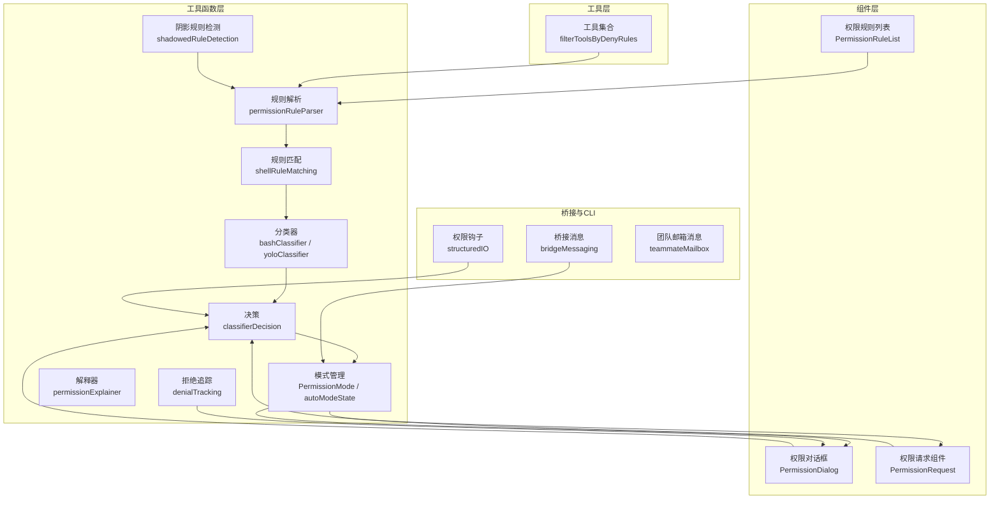
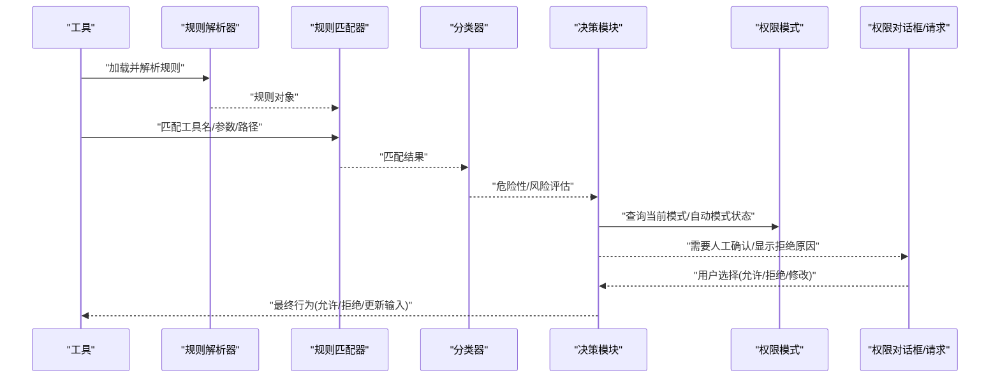
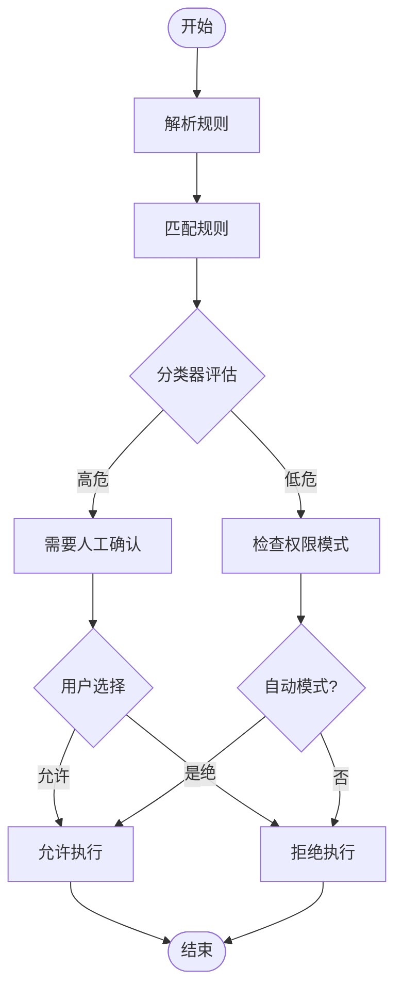
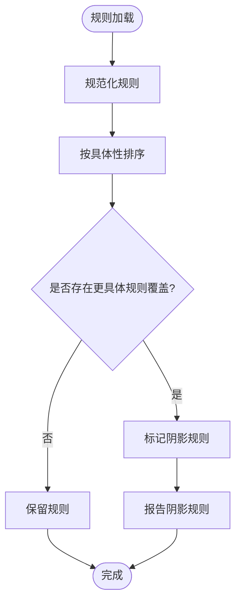
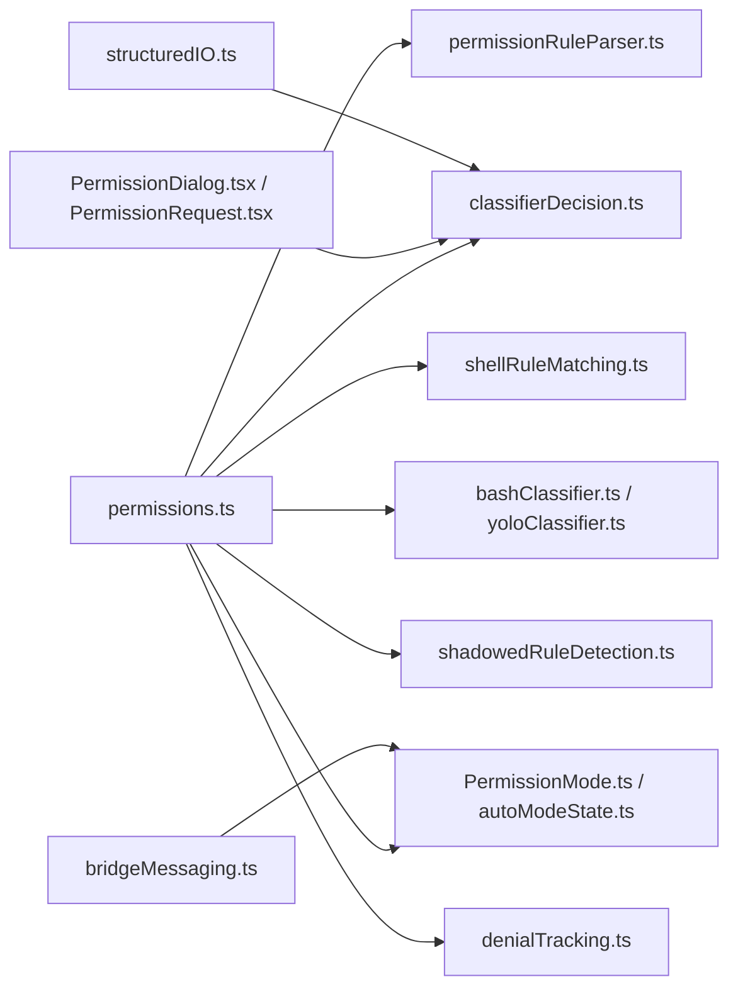

# 权限检查机制

<cite>
**本文档引用的文件**
- [src/utils/permissions/permissions.ts](file://src/utils/permissions/permissions.ts)
- [src/utils/permissions/shadowedRuleDetection.ts](file://src/utils/permissions/shadowedRuleDetection.ts)
- [src/utils/permissions/classifierDecision.ts](file://src/utils/permissions/classifierDecision.ts)
- [src/utils/permissions/bashClassifier.ts](file://src/utils/permissions/bashClassifier.ts)
- [src/utils/permissions/yoloClassifier.ts](file://src/utils/permissions/yoloClassifier.ts)
- [src/utils/permissions/shellRuleMatching.ts](file://src/utils/permissions/shellRuleMatching.ts)
- [src/utils/permissions/dangerousPatterns.ts](file://src/utils/permissions/dangerousPatterns.ts)
- [src/utils/permissions/permissionRuleParser.ts](file://src/utils/permissions/permissionRuleParser.ts)
- [src/utils/permissions/PermissionMode.ts](file://src/utils/permissions/PermissionMode.ts)
- [src/utils/permissions/autoModeState.ts](file://src/utils/permissions/autoModeState.ts)
- [src/utils/permissions/permissionExplainer.ts](file://src/utils/permissions/permissionExplainer.ts)
- [src/utils/permissions/denialTracking.ts](file://src/utils/permissions/denialTracking.ts)
- [src/components/permissions/rules/PermissionRuleList.tsx](file://src/components/permissions/rules/PermissionRuleList.tsx)
- [src/components/permissions/PermissionDialog.tsx](file://src/components/permissions/PermissionDialog.tsx)
- [src/components/permissions/PermissionRequest.tsx](file://src/components/permissions/PermissionRequest.tsx)
- [src/hooks/toolPermission/useCanUseTool.tsx](file://src/hooks/toolPermission/useCanUseTool.tsx)
- [src/tools.ts](file://src/tools.ts)
- [src/bridge/bridgeMessaging.ts](file://src/bridge/bridgeMessaging.ts)
- [src/cli/structuredIO.ts](file://src/cli/structuredIO.ts)
- [src/utils/teammateMailbox.ts](file://src/utils/teammateMailbox.ts)
</cite>

## 目录
1. [简介](#简介)
2. [项目结构](#项目结构)
3. [核心组件](#核心组件)
4. [架构总览](#架构总览)
5. [详细组件分析](#详细组件分析)
6. [依赖关系分析](#依赖关系分析)
7. [性能考虑](#性能考虑)
8. [故障排除指南](#故障排除指南)
9. [结论](#结论)

## 简介
本文件系统性阐述该代码库中的权限检查机制，覆盖权限分类器决策流程、规则匹配算法、权限冲突检测、阴影规则检测、权限模式推导以及优先级策略，并提供流程图与决策树示例，同时给出性能优化、缓存策略与错误处理建议。

## 项目结构
权限相关代码主要分布在以下区域：
- 工具层：工具过滤与运行时权限检查（工具侧）
- 工具函数层：规则解析、匹配、分类器、模式管理与解释器
- 组件层：权限规则列表、权限对话框、权限请求组件
- 桥接与CLI：跨进程/远程权限控制消息与钩子集成
- 钩子层：工具使用前的权限请求钩子与自动模式状态

图表来源
- [src/tools.ts:253-269](file://src/tools.ts#L253-L269)
- [src/utils/permissions/permissionRuleParser.ts](file://src/utils/permissions/permissionRuleParser.ts)
- [src/utils/permissions/shellRuleMatching.ts](file://src/utils/permissions/shellRuleMatching.ts)
- [src/utils/permissions/bashClassifier.ts](file://src/utils/permissions/bashClassifier.ts)
- [src/utils/permissions/yoloClassifier.ts](file://src/utils/permissions/yoloClassifier.ts)
- [src/utils/permissions/classifierDecision.ts](file://src/utils/permissions/classifierDecision.ts)
- [src/utils/permissions/PermissionMode.ts](file://src/utils/permissions/PermissionMode.ts)
- [src/utils/permissions/autoModeState.ts](file://src/utils/permissions/autoModeState.ts)
- [src/utils/permissions/permissionExplainer.ts](file://src/utils/permissions/permissionExplainer.ts)
- [src/utils/permissions/shadowedRuleDetection.ts](file://src/utils/permissions/shadowedRuleDetection.ts)
- [src/utils/permissions/denialTracking.ts](file://src/utils/permissions/denialTracking.ts)
- [src/components/permissions/rules/PermissionRuleList.tsx](file://src/components/permissions/rules/PermissionRuleList.tsx)
- [src/components/permissions/PermissionDialog.tsx](file://src/components/permissions/PermissionDialog.tsx)
- [src/components/permissions/PermissionRequest.tsx](file://src/components/permissions/PermissionRequest.tsx)
- [src/bridge/bridgeMessaging.ts:328-371](file://src/bridge/bridgeMessaging.ts#L328-L371)
- [src/cli/structuredIO.ts:808-859](file://src/cli/structuredIO.ts#L808-L859)
- [src/utils/teammateMailbox.ts:485-536](file://src/utils/teammateMailbox.ts#L485-L536)

章节来源
- [src/tools.ts:253-269](file://src/tools.ts#L253-L269)
- [src/utils/permissions/permissionRuleParser.ts](file://src/utils/permissions/permissionRuleParser.ts)
- [src/utils/permissions/shellRuleMatching.ts](file://src/utils/permissions/shellRuleMatching.ts)
- [src/utils/permissions/bashClassifier.ts](file://src/utils/permissions/bashClassifier.ts)
- [src/utils/permissions/yoloClassifier.ts](file://src/utils/permissions/yoloClassifier.ts)
- [src/utils/permissions/classifierDecision.ts](file://src/utils/permissions/classifierDecision.ts)
- [src/utils/permissions/PermissionMode.ts](file://src/utils/permissions/PermissionMode.ts)
- [src/utils/permissions/autoModeState.ts](file://src/utils/permissions/autoModeState.ts)
- [src/utils/permissions/permissionExplainer.ts](file://src/utils/permissions/permissionExplainer.ts)
- [src/utils/permissions/shadowedRuleDetection.ts](file://src/utils/permissions/shadowedRuleDetection.ts)
- [src/utils/permissions/denialTracking.ts](file://src/utils/permissions/denialTracking.ts)
- [src/components/permissions/rules/PermissionRuleList.tsx](file://src/components/permissions/rules/PermissionRuleList.tsx)
- [src/components/permissions/PermissionDialog.tsx](file://src/components/permissions/PermissionDialog.tsx)
- [src/components/permissions/PermissionRequest.tsx](file://src/components/permissions/PermissionRequest.tsx)
- [src/bridge/bridgeMessaging.ts:328-371](file://src/bridge/bridgeMessaging.ts#L328-L371)
- [src/cli/structuredIO.ts:808-859](file://src/cli/structuredIO.ts#L808-L859)
- [src/utils/teammateMailbox.ts:485-536](file://src/utils/teammateMailbox.ts#L485-L536)

## 核心组件
- 规则解析与匹配
  - 解析器负责将用户输入的规则字符串转换为内部规则对象，支持通配符、前缀、命名空间等语法。
  - 匹配器对工具名、命令行参数、工作目录等进行匹配，返回命中规则集。
- 分类器与决策
  - Bash分类器与YOLO分类器分别针对不同场景（如命令行工具）进行危险性评估。
  - 决策模块综合规则匹配结果与分类器输出，生成允许/拒绝/需要人工确认的最终决策。
- 权限模式与自动模式
  - 权限模式管理器维护当前模式（如严格、宽松、自动），并根据策略切换。
  - 自动模式状态机在满足条件时自动放行，减少交互成本。
- 阴影规则检测
  - 检测被更具体规则覆盖的“阴影”规则，避免无效或误导性规则生效。
- 拒绝追踪与解释
  - 记录拒绝原因与上下文，提供可读的解释信息帮助用户理解与调整规则。
- UI与交互
  - 权限规则列表、权限对话框与权限请求组件构成用户交互面，支持规则增删改查与即时反馈。

章节来源
- [src/utils/permissions/permissionRuleParser.ts](file://src/utils/permissions/permissionRuleParser.ts)
- [src/utils/permissions/shellRuleMatching.ts](file://src/utils/permissions/shellRuleMatching.ts)
- [src/utils/permissions/bashClassifier.ts](file://src/utils/permissions/bashClassifier.ts)
- [src/utils/permissions/yoloClassifier.ts](file://src/utils/permissions/yoloClassifier.ts)
- [src/utils/permissions/classifierDecision.ts](file://src/utils/permissions/classifierDecision.ts)
- [src/utils/permissions/PermissionMode.ts](file://src/utils/permissions/PermissionMode.ts)
- [src/utils/permissions/autoModeState.ts](file://src/utils/permissions/autoModeState.ts)
- [src/utils/permissions/shadowedRuleDetection.ts](file://src/utils/permissions/shadowedRuleDetection.ts)
- [src/utils/permissions/denialTracking.ts](file://src/utils/permissions/denialTracking.ts)
- [src/utils/permissions/permissionExplainer.ts](file://src/utils/permissions/permissionExplainer.ts)
- [src/components/permissions/rules/PermissionRuleList.tsx](file://src/components/permissions/rules/PermissionRuleList.tsx)
- [src/components/permissions/PermissionDialog.tsx](file://src/components/permissions/PermissionDialog.tsx)
- [src/components/permissions/PermissionRequest.tsx](file://src/components/permissions/PermissionRequest.tsx)

## 架构总览
下图展示从工具调用到最终决策的关键路径，涵盖规则解析、匹配、分类器评估、模式切换与用户交互。

图表来源
- [src/utils/permissions/permissionRuleParser.ts](file://src/utils/permissions/permissionRuleParser.ts)
- [src/utils/permissions/shellRuleMatching.ts](file://src/utils/permissions/shellRuleMatching.ts)
- [src/utils/permissions/bashClassifier.ts](file://src/utils/permissions/bashClassifier.ts)
- [src/utils/permissions/yoloClassifier.ts](file://src/utils/permissions/yoloClassifier.ts)
- [src/utils/permissions/classifierDecision.ts](file://src/utils/permissions/classifierDecision.ts)
- [src/utils/permissions/PermissionMode.ts](file://src/utils/permissions/PermissionMode.ts)
- [src/utils/permissions/autoModeState.ts](file://src/utils/permissions/autoModeState.ts)
- [src/components/permissions/PermissionDialog.tsx](file://src/components/permissions/PermissionDialog.tsx)
- [src/components/permissions/PermissionRequest.tsx](file://src/components/permissions/PermissionRequest.tsx)

## 详细组件分析

### 权限分类器与决策流程
- 分类器职责
  - Bash分类器：识别潜在危险的命令行模式，结合危险模式库进行判定。
  - YOLO分类器：基于轻量规则快速评估，适用于大规模工具筛选。
- 决策流程
  - 输入：工具名、参数、工作目录、当前权限上下文。
  - 步骤：规则匹配 → 分类器评估 → 模式判断 → 用户交互（如需）→ 输出最终行为。
- 决策树示例（概念性）

图表来源
- [src/utils/permissions/bashClassifier.ts](file://src/utils/permissions/bashClassifier.ts)
- [src/utils/permissions/yoloClassifier.ts](file://src/utils/permissions/yoloClassifier.ts)
- [src/utils/permissions/classifierDecision.ts](file://src/utils/permissions/classifierDecision.ts)
- [src/utils/permissions/PermissionMode.ts](file://src/utils/permissions/PermissionMode.ts)
- [src/utils/permissions/autoModeState.ts](file://src/utils/permissions/autoModeState.ts)

章节来源
- [src/utils/permissions/bashClassifier.ts](file://src/utils/permissions/bashClassifier.ts)
- [src/utils/permissions/yoloClassifier.ts](file://src/utils/permissions/yoloClassifier.ts)
- [src/utils/permissions/classifierDecision.ts](file://src/utils/permissions/classifierDecision.ts)
- [src/utils/permissions/PermissionMode.ts](file://src/utils/permissions/PermissionMode.ts)
- [src/utils/permissions/autoModeState.ts](file://src/utils/permissions/autoModeState.ts)

### 规则匹配算法与阴影规则检测
- 规则匹配
  - 支持前缀匹配、通配符、命名空间隔离（如MCP服务器前缀）。
  - 对工具名、完整命令行、工作目录进行多维匹配。
- 阴影规则检测
  - 当存在更具体的规则覆盖较宽泛规则时，标记为阴影规则，提示用户清理冗余规则。
- 算法流程

图表来源
- [src/utils/permissions/shadowedRuleDetection.ts](file://src/utils/permissions/shadowedRuleDetection.ts)
- [src/utils/permissions/permissionRuleParser.ts](file://src/utils/permissions/permissionRuleParser.ts)
- [src/utils/permissions/shellRuleMatching.ts](file://src/utils/permissions/shellRuleMatching.ts)

章节来源
- [src/utils/permissions/shadowedRuleDetection.ts](file://src/utils/permissions/shadowedRuleDetection.ts)
- [src/utils/permissions/permissionRuleParser.ts](file://src/utils/permissions/permissionRuleParser.ts)
- [src/utils/permissions/shellRuleMatching.ts](file://src/utils/permissions/shellRuleMatching.ts)

### 权限模式推导与优先级
- 模式推导
  - 基于当前环境、历史拒绝次数、工具类型与分类器结果动态推导下一模式。
- 优先级策略
  - 显式规则优先于隐式默认；更具体规则优先于更宽泛规则；自动模式在满足条件时优先放行。
- 切换控制
  - 通过桥接消息设置权限模式，若回调未注册则返回错误以避免静默失败。

章节来源
- [src/utils/permissions/getNextPermissionMode.ts](file://src/utils/permissions/getNextPermissionMode.ts)
- [src/utils/permissions/PermissionMode.ts](file://src/utils/permissions/PermissionMode.ts)
- [src/bridge/bridgeMessaging.ts:328-371](file://src/bridge/bridgeMessaging.ts#L328-L371)

### 工具过滤与运行时检查
- 工具过滤
  - 在工具列表构建阶段即剔除被显式拒绝的工具，避免进入后续流程。
- 运行时检查
  - 钩子在工具实际执行前进行权限请求，支持自动放行与持久化更新。

章节来源
- [src/tools.ts:253-269](file://src/tools.ts#L253-L269)
- [src/cli/structuredIO.ts:808-859](file://src/cli/structuredIO.ts#L808-L859)

### 用户界面与交互
- 权限规则列表：展示现有规则、最近拒绝记录、工作区目录管理。
- 权限对话框与请求组件：在需要时弹出，提供解释、修改建议与重试选项。
- 团队协作消息：用于跨代理的权限请求与响应。

章节来源
- [src/components/permissions/rules/PermissionRuleList.tsx](file://src/components/permissions/rules/PermissionRuleList.tsx)
- [src/components/permissions/PermissionDialog.tsx](file://src/components/permissions/PermissionDialog.tsx)
- [src/components/permissions/PermissionRequest.tsx](file://src/components/permissions/PermissionRequest.tsx)
- [src/utils/teammateMailbox.ts:485-536](file://src/utils/teammateMailbox.ts#L485-L536)

## 依赖关系分析

图表来源
- [src/utils/permissions/permissions.ts](file://src/utils/permissions/permissions.ts)
- [src/utils/permissions/permissionRuleParser.ts](file://src/utils/permissions/permissionRuleParser.ts)
- [src/utils/permissions/shellRuleMatching.ts](file://src/utils/permissions/shellRuleMatching.ts)
- [src/utils/permissions/bashClassifier.ts](file://src/utils/permissions/bashClassifier.ts)
- [src/utils/permissions/yoloClassifier.ts](file://src/utils/permissions/yoloClassifier.ts)
- [src/utils/permissions/classifierDecision.ts](file://src/utils/permissions/classifierDecision.ts)
- [src/utils/permissions/PermissionMode.ts](file://src/utils/permissions/PermissionMode.ts)
- [src/utils/permissions/autoModeState.ts](file://src/utils/permissions/autoModeState.ts)
- [src/utils/permissions/shadowedRuleDetection.ts](file://src/utils/permissions/shadowedRuleDetection.ts)
- [src/utils/permissions/denialTracking.ts](file://src/utils/permissions/denialTracking.ts)
- [src/components/permissions/PermissionDialog.tsx](file://src/components/permissions/PermissionDialog.tsx)
- [src/components/permissions/PermissionRequest.tsx](file://src/components/permissions/PermissionRequest.tsx)
- [src/cli/structuredIO.ts:808-859](file://src/cli/structuredIO.ts#L808-L859)
- [src/bridge/bridgeMessaging.ts:328-371](file://src/bridge/bridgeMessaging.ts#L328-L371)

章节来源
- [src/utils/permissions/permissions.ts](file://src/utils/permissions/permissions.ts)
- [src/utils/permissions/permissionRuleParser.ts](file://src/utils/permissions/permissionRuleParser.ts)
- [src/utils/permissions/shellRuleMatching.ts](file://src/utils/permissions/shellRuleMatching.ts)
- [src/utils/permissions/bashClassifier.ts](file://src/utils/permissions/bashClassifier.ts)
- [src/utils/permissions/yoloClassifier.ts](file://src/utils/permissions/yoloClassifier.ts)
- [src/utils/permissions/classifierDecision.ts](file://src/utils/permissions/classifierDecision.ts)
- [src/utils/permissions/PermissionMode.ts](file://src/utils/permissions/PermissionMode.ts)
- [src/utils/permissions/autoModeState.ts](file://src/utils/permissions/autoModeState.ts)
- [src/utils/permissions/shadowedRuleDetection.ts](file://src/utils/permissions/shadowedRuleDetection.ts)
- [src/utils/permissions/denialTracking.ts](file://src/utils/permissions/denialTracking.ts)
- [src/components/permissions/PermissionDialog.tsx](file://src/components/permissions/PermissionDialog.tsx)
- [src/components/permissions/PermissionRequest.tsx](file://src/components/permissions/PermissionRequest.tsx)
- [src/cli/structuredIO.ts:808-859](file://src/cli/structuredIO.ts#L808-L859)
- [src/bridge/bridgeMessaging.ts:328-371](file://src/bridge/bridgeMessaging.ts#L328-L371)

## 性能考虑
- 缓存策略
  - 规则匹配结果缓存：对相同工具名与参数组合的结果进行短期缓存，避免重复计算。
  - 分类器输出缓存：对已评估过的命令行片段进行缓存，降低重复分类成本。
- 批量处理
  - 工具过滤阶段一次性剔除黑名单工具，减少后续流程负担。
- 早期短路
  - 显式拒绝规则优先处理，避免进入复杂匹配与分类流程。
- 异步与并发
  - 权限请求钩子采用异步流式处理，结合并发钩子以提升吞吐。

## 故障排除指南
- 常见问题
  - 规则不生效：检查是否存在阴影规则或更具体规则覆盖。
  - 自动模式未触发：确认自动模式状态机条件是否满足，以及权限模式是否被手动强制。
  - 钩子未生效：确认钩子注册与回调是否正确配置。
- 错误处理
  - 桥接设置权限模式失败：当回调未注册时返回明确错误，避免静默失败。
  - 拒绝追踪：记录拒绝原因与上下文，便于定位与修复。

章节来源
- [src/bridge/bridgeMessaging.ts:328-371](file://src/bridge/bridgeMessaging.ts#L328-L371)
- [src/utils/permissions/denialTracking.ts](file://src/utils/permissions/denialTracking.ts)
- [src/utils/permissions/shadowedRuleDetection.ts](file://src/utils/permissions/shadowedRuleDetection.ts)

## 结论
该权限检查机制通过“规则解析—匹配—分类器—决策—模式—交互”的闭环设计，在保证安全性的同时兼顾易用性。阴影规则检测与拒绝追踪提升了可观测性与可维护性；自动模式与钩子集成提供了灵活的扩展点。建议在生产环境中结合缓存与批量处理策略进一步优化性能，并持续完善规则解释与可视化工具以提升用户体验。