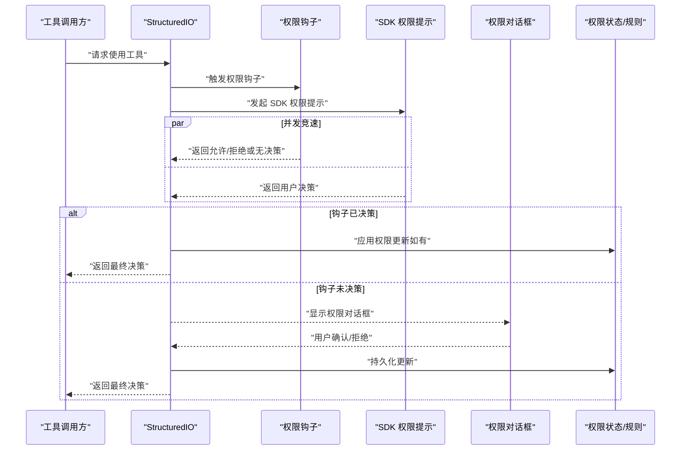
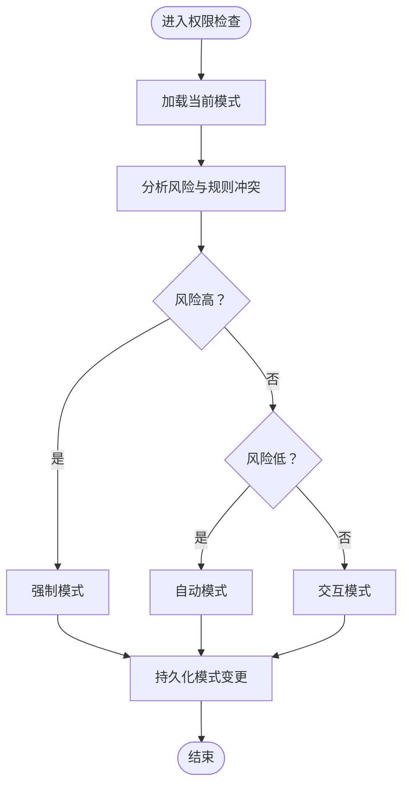
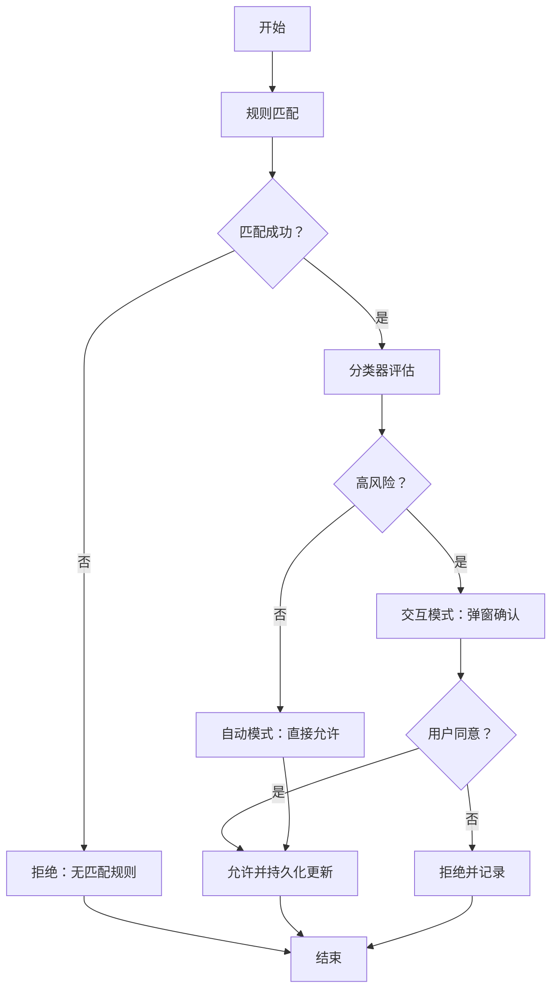
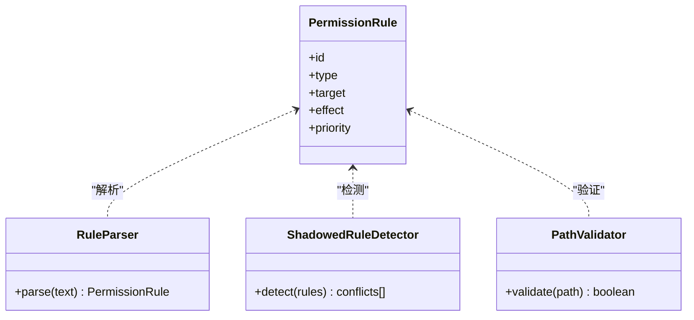
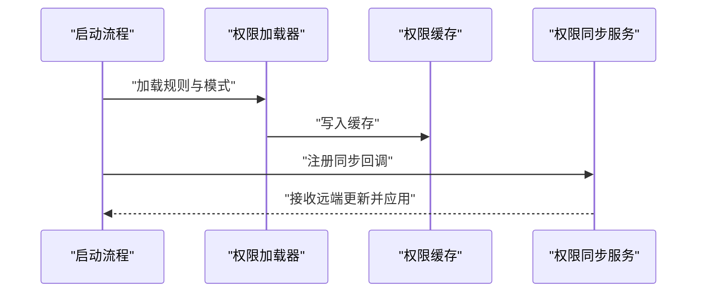
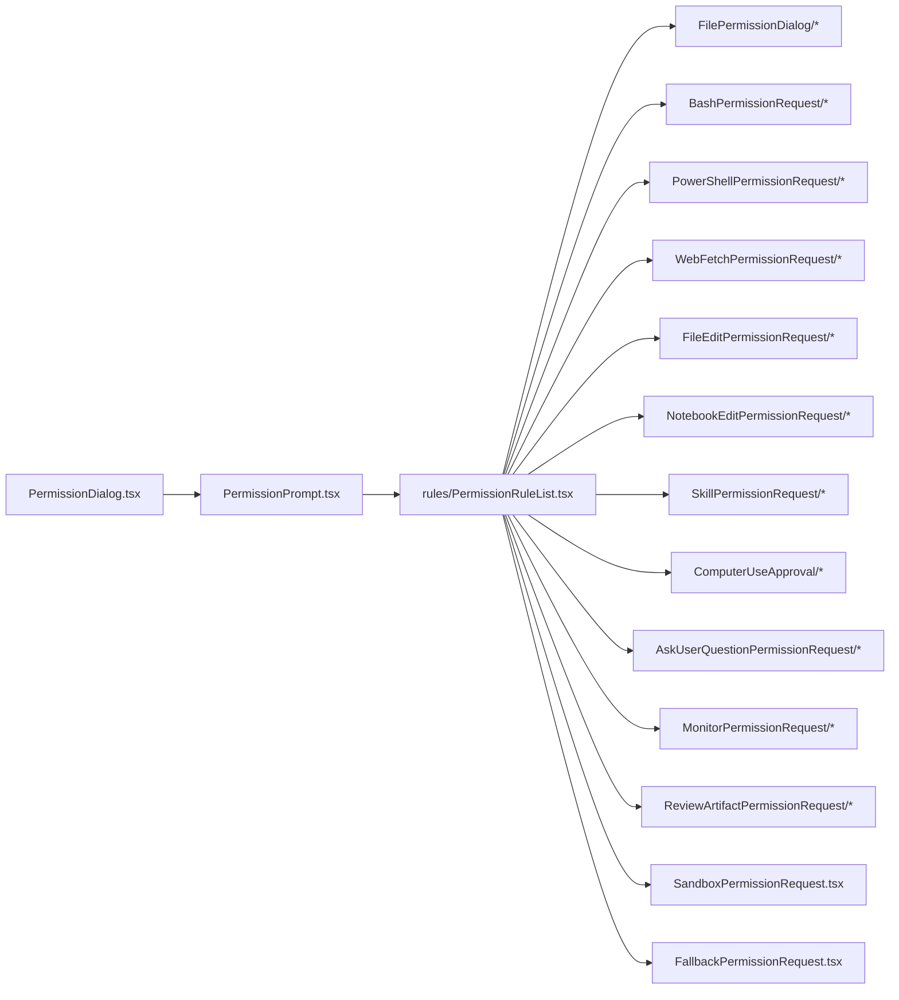
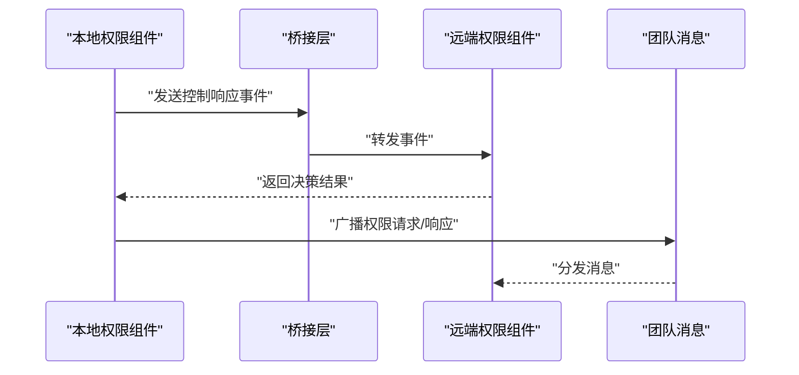
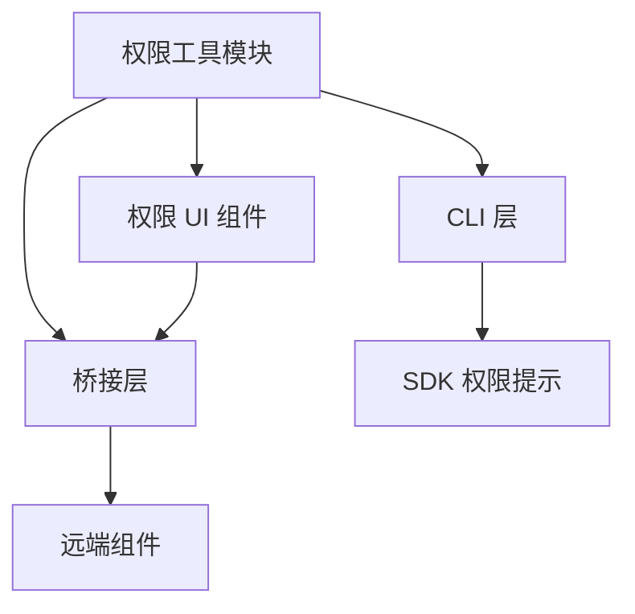

# 权限系统概览

<cite>
**本文档引用的文件**
- [src/utils/permissions/PermissionMode.ts](file://src/utils/permissions/PermissionMode.ts)
- [src/utils/permissions/PermissionResult.ts](file://src/utils/permissions/PermissionResult.ts)
- [src/utils/permissions/permissions.ts](file://src/utils/permissions/permissions.ts)
- [src/utils/permissions/autoModeState.ts](file://src/utils/permissions/autoModeState.ts)
- [src/utils/permissions/permissionSetup.ts](file://src/utils/permissions/permissionSetup.ts)
- [src/utils/permissions/permissionsLoader.ts](file://src/utils/permissions/permissionsLoader.ts)
- [src/utils/permissions/shadowedRuleDetection.ts](file://src/utils/permissions/shadowedRuleDetection.ts)
- [src/utils/permissions/denialTracking.ts](file://src/utils/permissions/denialTracking.ts)
- [src/utils/permissions/getNextPermissionMode.ts](file://src/utils/permissions/getNextPermissionMode.ts)
- [src/utils/permissions/permissionExplainer.ts](file://src/utils/permissions/permissionExplainer.ts)
- [src/utils/permissions/yoloClassifier.ts](file://src/utils/permissions/yoloClassifier.ts)
- [src/utils/permissions/bypassPermissionsKillswitch.ts](file://src/utils/permissions/bypassPermissionsKillswitch.ts)
- [src/utils/permissions/PermissionUpdate.ts](file://src/utils/permissions/PermissionUpdate.ts)
- [src/utils/permissions/PermissionUpdateSchema.ts](file://src/utils/permissions/PermissionUpdateSchema.ts)
- [src/utils/permissions/PermissionPromptToolResultSchema.ts](file://src/utils/permissions/PermissionPromptToolResultSchema.ts)
- [src/utils/permissions/PermissionRule.ts](file://src/utils/permissions/PermissionRule.ts)
- [src/utils/permissions/permissionRuleParser.ts](file://src/utils/permissions/permissionRuleParser.ts)
- [src/utils/permissions/pathValidation.ts](file://src/utils/permissions/pathValidation.ts)
- [src/utils/permissions/shellRuleMatching.ts](file://src/utils/permissions/shellRuleMatching.ts)
- [src/utils/permissions/filesystem.ts](file://src/utils/permissions/filesystem.ts)
- [src/utils/permissions/dangerousPatterns.ts](file://src/utils/permissions/dangerousPatterns.ts)
- [src/utils/permissions/classifierShared.ts](file://src/utils/permissions/classifierShared.ts)
- [src/utils/permissions/bashClassifier.ts](file://src/utils/permissions/bashClassifier.ts)
- [src/utils/permissions/yolo-classifier-prompts/auto_mode_system_prompt.txt](file://src/utils/permissions/yolo-classifier-prompts/auto_mode_system_prompt.txt)
- [src/utils/permissions/yolo-classifier-prompts/permissions_anthropic.txt](file://src/utils/permissions/yolo-classifier-prompts/permissions_anthropic.txt)
- [src/utils/permissions/yolo-classifier-prompts/permissions_external.txt](file://src/utils/permissions/yolo-classifier-prompts/permissions_external.txt)
- [src/components/permissions/PermissionDialog.tsx](file://src/components/permissions/PermissionDialog.tsx)
- [src/components/permissions/PermissionPrompt.tsx](file://src/components/permissions/PermissionPrompt.tsx)
- [src/components/permissions/rules/PermissionRuleList.tsx](file://src/components/permissions/rules/PermissionRuleList.tsx)
- [src/components/permissions/FilePermissionDialog/useFilePermissionDialog.ts](file://src/components/permissions/FilePermissionDialog/useFilePermissionDialog.ts)
- [src/components/permissions/BashPermissionRequest/BashPermissionRequest.tsx](file://src/components/permissions/BashPermissionRequest/BashPermissionRequest.tsx)
- [src/components/permissions/PowerShellPermissionRequest/PowerShellPermissionRequest.tsx](file://src/components/permissions/PowerShellPermissionRequest/PowerShellPermissionRequest.tsx)
- [src/components/permissions/WebFetchPermissionRequest/WebFetchPermissionRequest.tsx](file://src/components/permissions/WebFetchPermissionRequest/WebFetchPermissionRequest.tsx)
- [src/components/permissions/FileEditPermissionRequest/FileEditPermissionRequest.tsx](file://src/components/permissions/FileEditPermissionRequest/FileEditPermissionRequest.tsx)
- [src/components/permissions/NotebookEditPermissionRequest/NotebookEditPermissionRequest.tsx](file://src/components/permissions/NotebookEditPermissionRequest/NotebookEditPermissionRequest.tsx)
- [src/components/permissions/SkillPermissionRequest/SkillPermissionRequest.tsx](file://src/components/permissions/SkillPermissionRequest/SkillPermissionRequest.tsx)
- [src/components/permissions/ComputerUseApproval/ComputerUseApproval.tsx](file://src/components/permissions/ComputerUseApproval/ComputerUseApproval.tsx)
- [src/components/permissions/AskUserQuestionPermissionRequest/AskUserQuestionPermissionRequest.tsx](file://src/components/permissions/AskUserQuestionPermissionRequest/AskUserQuestionPermissionRequest.tsx)
- [src/components/permissions/MonitorPermissionRequest/MonitorPermissionRequest.tsx](file://src/components/permissions/MonitorPermissionRequest/MonitorPermissionRequest.tsx)
- [src/components/permissions/ReviewArtifactPermissionRequest/ReviewArtifactPermissionRequest.tsx](file://src/components/permissions/ReviewArtifactPermissionRequest/ReviewArtifactPermissionRequest.tsx)
- [src/components/permissions/SandboxPermissionRequest.tsx](file://src/components/permissions/SandboxPermissionRequest.tsx)
- [src/components/permissions/FallbackPermissionRequest.tsx](file://src/components/permissions/FallbackPermissionRequest.tsx)
- [src/components/permissions/WorkerPendingPermission.tsx](file://src/components/permissions/WorkerPendingPermission.tsx)
- [src/components/permissions/WorkerBadge.tsx](file://src/components/permissions/WorkerBadge.tsx)
- [src/components/permissions/hooks.ts](file://src/components/permissions/hooks.ts)
- [src/components/permissions/utils.ts](file://src/components/permissions/utils.ts)
- [src/components/permissions/shellPermissionHelpers.tsx](file://src/components/permissions/shellPermissionHelpers.tsx)
- [src/components/permissions/useShellPermissionFeedback.ts](file://src/components/permissions/useShellPermissionFeedback.ts)
- [src/bridge/types.ts](file://src/bridge/types.ts)
- [src/bridge/bridgePermissionCallbacks.ts](file://src/bridge/bridgePermissionCallbacks.ts)
- [src/bridge/remoteBridgeCore.ts](file://src/bridge/remoteBridgeCore.ts)
- [src/bridge/inboundMessages.ts](file://src/bridge/inboundMessages.ts)
- [src/bridge/outboundMessages.ts](file://src/bridge/outboundMessages.ts)
- [src/remote/remotePermissionBridge.ts](file://src/remote/remotePermissionBridge.ts)
- [src/remote/sdkMessageAdapter.ts](file://src/remote/sdkMessageAdapter.ts)
- [src/services/swarm/permissionSync.ts](file://src/services/swarm/permissionSync.ts)
- [src/hooks/toolPermission/permissionLogging.ts](file://src/hooks/toolPermission/permissionLogging.ts)
- [src/cli/structuredIO.ts](file://src/cli/structuredIO.ts)
- [src/utils/teammateMailbox.ts](file://src/utils/teammateMailbox.ts)
- [src/types/permissions.ts](file://src/types/permissions.ts)
</cite>

## 目录
1. [简介](#简介)
2. [项目结构](#项目结构)
3. [核心组件](#核心组件)
4. [架构总览](#架构总览)
5. [详细组件分析](#详细组件分析)
6. [依赖关系分析](#依赖关系分析)
7. [性能考虑](#性能考虑)
8. [故障排除指南](#故障排除指南)
9. [结论](#结论)

## 简介
本文件为 Claude Code 权限系统的概览性技术文档，面向开发者与产品人员，系统阐述权限模式分类（自动模式、交互模式、强制模式）、权限决策流程、权限状态管理、权限结果类型、权限模式切换机制、权限继承关系，以及权限初始化、缓存与同步策略。文档同时提供整体架构图与组件交互关系，并通过序列图与流程图展示关键流程。

## 项目结构
权限系统围绕「规则引擎」和「请求-响应」两条主线构建：规则引擎负责解析与匹配用户定义的权限规则；请求-响应负责在工具调用前进行权限决策与用户交互。前端组件负责呈现权限对话框与规则列表；后端桥接层负责与远端环境通信；CLI 层负责在命令行场景下的权限提示与并发决策。

```mermaid
graph TB
subgraph "前端组件"
PD["PermissionDialog.tsx"]
PP["PermissionPrompt.tsx"]
PRL["rules/PermissionRuleList.tsx"]
FPD["FilePermissionDialog/*"]
BPR["BashPermissionRequest/*"]
SPR["PowerShellPermissionRequest/*"]
WFR["WebFetchPermissionRequest/*"]
FER["FileEditPermissionRequest/*"]
NER["NotebookEditPermissionRequest/*"]
SKR["SkillPermissionRequest/*"]
CUR["ComputerUseApproval/*"]
AQR["AskUserQuestionPermissionRequest/*"]
MPR["MonitorPermissionRequest/*"]
RAR["ReviewArtifactPermissionRequest/*"]
SPRQ["SandboxPermissionRequest.tsx"]
FPR["FallbackPermissionRequest.tsx"]
end
subgraph "权限规则与决策"
PR["PermissionRule.ts"]
PRS["permissionRuleParser.ts"]
PS["permissions.ts"]
PM["PermissionMode.ts"]
PER["PermissionResult.ts"]
PU["PermissionUpdate.ts"]
PUS["PermissionUpdateSchema.ts"]
YC["yoloClassifier.ts"]
end
subgraph "桥接与远程"
BT["bridge/types.ts"]
BPC["bridgePermissionCallbacks.ts"]
RBC["remoteBridgeCore.ts"]
IM["inboundMessages.ts"]
OM["outboundMessages.ts"]
RP["remotePermissionBridge.ts"]
SMA["sdkMessageAdapter.ts"]
end
subgraph "CLI 与消息"
SIO["cli/structuredIO.ts"]
TM["teammateMailbox.ts"]
end
PD --> PP
PRL --> PR
PR --> PRS
PS --> PER
PS --> PM
PS --> PU
YC --> PS
PP --> BT
PP --> BPC
PP --> RP
SIO --> PP
SIO --> YC
RP --> SMA
IM --> PP
OM --> PP
TM --> PP
```

图表来源
- [src/components/permissions/PermissionDialog.tsx](file://src/components/permissions/PermissionDialog.tsx)
- [src/components/permissions/PermissionPrompt.tsx](file://src/components/permissions/PermissionPrompt.tsx)
- [src/components/permissions/rules/PermissionRuleList.tsx](file://src/components/permissions/rules/PermissionRuleList.tsx)
- [src/utils/permissions/PermissionRule.ts](file://src/utils/permissions/PermissionRule.ts)
- [src/utils/permissions/permissionRuleParser.ts](file://src/utils/permissions/permissionRuleParser.ts)
- [src/utils/permissions/permissions.ts](file://src/utils/permissions/permissions.ts)
- [src/utils/permissions/PermissionMode.ts](file://src/utils/permissions/PermissionMode.ts)
- [src/utils/permissions/PermissionResult.ts](file://src/utils/permissions/PermissionResult.ts)
- [src/utils/permissions/PermissionUpdate.ts](file://src/utils/permissions/PermissionUpdate.ts)
- [src/utils/permissions/PermissionUpdateSchema.ts](file://src/utils/permissions/PermissionUpdateSchema.ts)
- [src/utils/permissions/yoloClassifier.ts](file://src/utils/permissions/yoloClassifier.ts)
- [src/bridge/types.ts](file://src/bridge/types.ts)
- [src/bridge/bridgePermissionCallbacks.ts](file://src/bridge/bridgePermissionCallbacks.ts)
- [src/bridge/remoteBridgeCore.ts](file://src/bridge/remoteBridgeCore.ts)
- [src/bridge/inboundMessages.ts](file://src/bridge/inboundMessages.ts)
- [src/bridge/outboundMessages.ts](file://src/bridge/outboundMessages.ts)
- [src/remote/remotePermissionBridge.ts](file://src/remote/remotePermissionBridge.ts)
- [src/remote/sdkMessageAdapter.ts](file://src/remote/sdkMessageAdapter.ts)
- [src/cli/structuredIO.ts](file://src/cli/structuredIO.ts)
- [src/utils/teammateMailbox.ts](file://src/utils/teammateMailbox.ts)

章节来源
- [src/components/permissions/PermissionDialog.tsx](file://src/components/permissions/PermissionDialog.tsx)
- [src/utils/permissions/permissions.ts](file://src/utils/permissions/permissions.ts)
- [src/bridge/types.ts](file://src/bridge/types.ts)

## 核心组件
- 权限模式与结果
  - 模式：自动模式、交互模式、强制模式。模式由系统根据规则与历史拒绝情况动态选择或由用户配置决定。
  - 结果：允许、拒绝、建议更新规则等。结果包含决策原因、阻断路径、建议等元信息。
- 规则引擎
  - 规则定义与解析：支持路径/文件/命令/技能等多维规则，解析器将规则文本转换为可执行的匹配逻辑。
  - 规则匹配：对工具输入进行路径校验、危险模式检测、shell 命令匹配等。
- 决策与提示
  - 自动决策：基于分类器与规则快速判定。
  - 交互决策：弹出权限对话框，允许用户确认或调整。
  - 强制决策：严格遵循规则，不允许绕过。
- 状态与持久化
  - 权限状态：当前模式、最近拒绝记录、规则集快照。
  - 更新持久化：权限更新通过 Schema 验证后写入存储，触发上下文刷新。
- 远程与桥接
  - 本地与远端桥接：通过控制响应事件与消息适配器实现跨进程/跨设备的权限决策。
  - CLI 场景：在命令行中并发等待钩子与 SDK 提示，以最快者为准。

章节来源
- [src/utils/permissions/PermissionMode.ts](file://src/utils/permissions/PermissionMode.ts)
- [src/utils/permissions/PermissionResult.ts](file://src/utils/permissions/PermissionResult.ts)
- [src/utils/permissions/PermissionRule.ts](file://src/utils/permissions/PermissionRule.ts)
- [src/utils/permissions/permissionRuleParser.ts](file://src/utils/permissions/permissionRuleParser.ts)
- [src/utils/permissions/permissions.ts](file://src/utils/permissions/permissions.ts)
- [src/utils/permissions/PermissionUpdate.ts](file://src/utils/permissions/PermissionUpdate.ts)
- [src/utils/permissions/PermissionUpdateSchema.ts](file://src/utils/permissions/PermissionUpdateSchema.ts)
- [src/bridge/types.ts](file://src/bridge/types.ts)
- [src/bridge/bridgePermissionCallbacks.ts](file://src/bridge/bridgePermissionCallbacks.ts)
- [src/remote/remotePermissionBridge.ts](file://src/remote/remotePermissionBridge.ts)
- [src/cli/structuredIO.ts](file://src/cli/structuredIO.ts)

## 架构总览
下图展示了从工具调用到权限决策与用户交互的整体流程，涵盖自动/交互/强制三种模式的切换与并发决策。

图表来源
- [src/cli/structuredIO.ts](file://src/cli/structuredIO.ts)
- [src/components/permissions/PermissionDialog.tsx](file://src/components/permissions/PermissionDialog.tsx)
- [src/utils/permissions/permissions.ts](file://src/utils/permissions/permissions.ts)

## 详细组件分析

### 权限模式与切换机制
- 模式定义
  - 自动模式：基于规则与分类器快速决策，适合低风险场景。
  - 交互模式：遇到模糊或高风险时弹窗确认，兼顾安全与效率。
  - 强制模式：严格遵循规则，不允许绕过，适合合规要求高的环境。
- 切换策略
  - 基于历史拒绝次数与规则冲突程度动态提升模式等级。
  - 用户可通过设置覆盖默认模式。
  - 系统提供模式升级/降级的启发式逻辑，避免过度保护或不足保护。

图表来源
- [src/utils/permissions/PermissionMode.ts](file://src/utils/permissions/PermissionMode.ts)
- [src/utils/permissions/getNextPermissionMode.ts](file://src/utils/permissions/getNextPermissionMode.ts)
- [src/utils/permissions/denialTracking.ts](file://src/utils/permissions/denialTracking.ts)

章节来源
- [src/utils/permissions/PermissionMode.ts](file://src/utils/permissions/PermissionMode.ts)
- [src/utils/permissions/getNextPermissionMode.ts](file://src/utils/permissions/getNextPermissionMode.ts)
- [src/utils/permissions/denialTracking.ts](file://src/utils/permissions/denialTracking.ts)

### 权限结果类型与决策流程
- 结果类型
  - 允许：直接放行，可能附带更新后的输入。
  - 拒绝：阻止工具调用，提供拒绝原因与阻断路径。
  - 建议：提示用户调整规则或输入，或提供一键修复选项。
- 决策流程
  - 规则匹配 → 分类器评估 → 钩子优先 → 用户交互 → 结果持久化。

图表来源
- [src/utils/permissions/PermissionResult.ts](file://src/utils/permissions/PermissionResult.ts)
- [src/utils/permissions/permissions.ts](file://src/utils/permissions/permissions.ts)
- [src/utils/permissions/yoloClassifier.ts](file://src/utils/permissions/yoloClassifier.ts)

章节来源
- [src/utils/permissions/PermissionResult.ts](file://src/utils/permissions/PermissionResult.ts)
- [src/utils/permissions/permissions.ts](file://src/utils/permissions/permissions.ts)
- [src/utils/permissions/yoloClassifier.ts](file://src/utils/permissions/yoloClassifier.ts)

### 权限规则与继承关系
- 规则定义
  - 支持路径白名单/黑名单、文件扩展名、命令关键字、技能名称等维度。
  - 规则具备层级与优先级，避免相互冲突。
- 继承与合并
  - 工作区规则继承全局规则，局部规则优先于全局规则。
  - 规则冲突检测与去重，防止重复授权导致的安全隐患。
- 解析与验证
  - 解析器将自然语言规则转换为内部表达式。
  - 路径验证确保规则指向有效文件/目录。

图表来源
- [src/utils/permissions/PermissionRule.ts](file://src/utils/permissions/PermissionRule.ts)
- [src/utils/permissions/permissionRuleParser.ts](file://src/utils/permissions/permissionRuleParser.ts)
- [src/utils/permissions/pathValidation.ts](file://src/utils/permissions/pathValidation.ts)
- [src/utils/permissions/shadowedRuleDetection.ts](file://src/utils/permissions/shadowedRuleDetection.ts)

章节来源
- [src/utils/permissions/PermissionRule.ts](file://src/utils/permissions/PermissionRule.ts)
- [src/utils/permissions/permissionRuleParser.ts](file://src/utils/permissions/permissionRuleParser.ts)
- [src/utils/permissions/pathValidation.ts](file://src/utils/permissions/pathValidation.ts)
- [src/utils/permissions/shadowedRuleDetection.ts](file://src/utils/permissions/shadowedRuleDetection.ts)

### 权限初始化、缓存与同步
- 初始化
  - 启动时加载权限规则与模式配置，建立初始权限上下文。
- 缓存
  - 对规则匹配结果与分类器判断进行短期缓存，减少重复计算。
- 同步
  - 在团队成员间同步权限更新，保持一致性。
  - 远端桥接层负责跨设备/跨会话的状态同步。

图表来源
- [src/utils/permissions/permissionsLoader.ts](file://src/utils/permissions/permissionsLoader.ts)
- [src/utils/permissions/autoModeState.ts](file://src/utils/permissions/autoModeState.ts)
- [src/services/swarm/permissionSync.ts](file://src/services/swarm/permissionSync.ts)

章节来源
- [src/utils/permissions/permissionsLoader.ts](file://src/utils/permissions/permissionsLoader.ts)
- [src/utils/permissions/autoModeState.ts](file://src/utils/permissions/autoModeState.ts)
- [src/services/swarm/permissionSync.ts](file://src/services/swarm/permissionSync.ts)

### 前端权限对话框与规则管理
- 权限对话框
  - 提供清晰的权限说明、操作预览与确认/拒绝按钮。
- 规则列表
  - 支持添加/删除工作区目录、查看最近拒绝记录、编辑规则。
- 工具专用请求组件
  - Bash、PowerShell、WebFetch、FileEdit、NotebookEdit、Skill、ComputerUse、AskUserQuestion、Monitor、ReviewArtifact 等工具均对应专用的权限请求组件，确保最小暴露面与最佳用户体验。

图表来源
- [src/components/permissions/PermissionDialog.tsx](file://src/components/permissions/PermissionDialog.tsx)
- [src/components/permissions/PermissionPrompt.tsx](file://src/components/permissions/PermissionPrompt.tsx)
- [src/components/permissions/rules/PermissionRuleList.tsx](file://src/components/permissions/rules/PermissionRuleList.tsx)
- [src/components/permissions/BashPermissionRequest/BashPermissionRequest.tsx](file://src/components/permissions/BashPermissionRequest/BashPermissionRequest.tsx)
- [src/components/permissions/PowerShellPermissionRequest/PowerShellPermissionRequest.tsx](file://src/components/permissions/PowerShellPermissionRequest/PowerShellPermissionRequest.tsx)
- [src/components/permissions/WebFetchPermissionRequest/WebFetchPermissionRequest.tsx](file://src/components/permissions/WebFetchPermissionRequest/WebFetchPermissionRequest.tsx)
- [src/components/permissions/FileEditPermissionRequest/FileEditPermissionRequest.tsx](file://src/components/permissions/FileEditPermissionRequest/FileEditPermissionRequest.tsx)
- [src/components/permissions/NotebookEditPermissionRequest/NotebookEditPermissionRequest.tsx](file://src/components/permissions/NotebookEditPermissionRequest/NotebookEditPermissionRequest.tsx)
- [src/components/permissions/SkillPermissionRequest/SkillPermissionRequest.tsx](file://src/components/permissions/SkillPermissionRequest/SkillPermissionRequest.tsx)
- [src/components/permissions/ComputerUseApproval/ComputerUseApproval.tsx](file://src/components/permissions/ComputerUseApproval/ComputerUseApproval.tsx)
- [src/components/permissions/AskUserQuestionPermissionRequest/AskUserQuestionPermissionRequest.tsx](file://src/components/permissions/AskUserQuestionPermissionRequest/AskUserQuestionPermissionRequest.tsx)
- [src/components/permissions/MonitorPermissionRequest/MonitorPermissionRequest.tsx](file://src/components/permissions/MonitorPermissionRequest/MonitorPermissionRequest.tsx)
- [src/components/permissions/ReviewArtifactPermissionRequest/ReviewArtifactPermissionRequest.tsx](file://src/components/permissions/ReviewArtifactPermissionRequest/ReviewArtifactPermissionRequest.tsx)
- [src/components/permissions/SandboxPermissionRequest.tsx](file://src/components/permissions/SandboxPermissionRequest.tsx)
- [src/components/permissions/FallbackPermissionRequest.tsx](file://src/components/permissions/FallbackPermissionRequest.tsx)

章节来源
- [src/components/permissions/PermissionDialog.tsx](file://src/components/permissions/PermissionDialog.tsx)
- [src/components/permissions/PermissionPrompt.tsx](file://src/components/permissions/PermissionPrompt.tsx)
- [src/components/permissions/rules/PermissionRuleList.tsx](file://src/components/permissions/rules/PermissionRuleList.tsx)
- [src/components/permissions/BashPermissionRequest/BashPermissionRequest.tsx](file://src/components/permissions/BashPermissionRequest/BashPermissionRequest.tsx)
- [src/components/permissions/PowerShellPermissionRequest/PowerShellPermissionRequest.tsx](file://src/components/permissions/PowerShellPermissionRequest/PowerShellPermissionRequest.tsx)
- [src/components/permissions/WebFetchPermissionRequest/WebFetchPermissionRequest.tsx](file://src/components/permissions/WebFetchPermissionRequest/WebFetchPermissionRequest.tsx)
- [src/components/permissions/FileEditPermissionRequest/FileEditPermissionRequest.tsx](file://src/components/permissions/FileEditPermissionRequest/FileEditPermissionRequest.tsx)
- [src/components/permissions/NotebookEditPermissionRequest/NotebookEditPermissionRequest.tsx](file://src/components/permissions/NotebookEditPermissionRequest/NotebookEditPermissionRequest.tsx)
- [src/components/permissions/SkillPermissionRequest/SkillPermissionRequest.tsx](file://src/components/permissions/SkillPermissionRequest/SkillPermissionRequest.tsx)
- [src/components/permissions/ComputerUseApproval/ComputerUseApproval.tsx](file://src/components/permissions/ComputerUseApproval/ComputerUseApproval.tsx)
- [src/components/permissions/AskUserQuestionPermissionRequest/AskUserQuestionPermissionRequest.tsx](file://src/components/permissions/AskUserQuestionPermissionRequest/AskUserQuestionPermissionRequest.tsx)
- [src/components/permissions/MonitorPermissionRequest/MonitorPermissionRequest.tsx](file://src/components/permissions/MonitorPermissionRequest/MonitorPermissionRequest.tsx)
- [src/components/permissions/ReviewArtifactPermissionRequest/ReviewArtifactPermissionRequest.tsx](file://src/components/permissions/ReviewArtifactPermissionRequest/ReviewArtifactPermissionRequest.tsx)
- [src/components/permissions/SandboxPermissionRequest.tsx](file://src/components/permissions/SandboxPermissionRequest.tsx)
- [src/components/permissions/FallbackPermissionRequest.tsx](file://src/components/permissions/FallbackPermissionRequest.tsx)

### 桥接与远程权限
- 控制响应事件
  - 通过桥接层发送控制响应事件，携带权限决策结果。
- 远端桥接
  - 远端核心负责与远端设备/会话通信，消息适配器负责协议转换。
- 团队消息
  - 权限请求/响应消息通过团队邮箱机制在成员间传递。

图表来源
- [src/bridge/types.ts](file://src/bridge/types.ts)
- [src/bridge/bridgePermissionCallbacks.ts](file://src/bridge/bridgePermissionCallbacks.ts)
- [src/bridge/remoteBridgeCore.ts](file://src/bridge/remoteBridgeCore.ts)
- [src/remote/remotePermissionBridge.ts](file://src/remote/remotePermissionBridge.ts)
- [src/remote/sdkMessageAdapter.ts](file://src/remote/sdkMessageAdapter.ts)
- [src/utils/teammateMailbox.ts](file://src/utils/teammateMailbox.ts)

章节来源
- [src/bridge/types.ts](file://src/bridge/types.ts)
- [src/bridge/bridgePermissionCallbacks.ts](file://src/bridge/bridgePermissionCallbacks.ts)
- [src/bridge/remoteBridgeCore.ts](file://src/bridge/remoteBridgeCore.ts)
- [src/remote/remotePermissionBridge.ts](file://src/remote/remotePermissionBridge.ts)
- [src/remote/sdkMessageAdapter.ts](file://src/remote/sdkMessageAdapter.ts)
- [src/utils/teammateMailbox.ts](file://src/utils/teammateMailbox.ts)

### 分类器与自动模式
- 自动模式系统提示词
  - 包含系统提示词、内部权限提示词、外部权限提示词三类模板，用于训练与推理。
- 分类器
  - 基于规则与模板对工具调用进行快速分类，决定是否需要交互或强制模式。
- Bash 分类器
  - 针对 Bash 工具的特殊规则匹配与风险评估。

章节来源
- [src/utils/permissions/yolo-classifier-prompts/auto_mode_system_prompt.txt](file://src/utils/permissions/yolo-classifier-prompts/auto_mode_system_prompt.txt)
- [src/utils/permissions/yolo-classifier-prompts/permissions_anthropic.txt](file://src/utils/permissions/yolo-classifier-prompts/permissions_anthropic.txt)
- [src/utils/permissions/yolo-classifier-prompts/permissions_external.txt](file://src/utils/permissions/yolo-classifier-prompts/permissions_external.txt)
- [src/utils/permissions/yoloClassifier.ts](file://src/utils/permissions/yoloClassifier.ts)
- [src/utils/permissions/bashClassifier.ts](file://src/utils/permissions/bashClassifier.ts)

## 依赖关系分析
- 组件内聚与耦合
  - 规则解析与匹配模块相对独立，便于替换与扩展。
  - 决策模块与 UI 组件松耦合，通过事件与回调交互。
- 外部依赖
  - 桥接层依赖远端设备/会话能力；CLI 依赖钩子与 SDK 协议。
- 循环依赖
  - 通过接口与回调避免循环依赖，保持模块边界清晰。

图表来源
- [src/utils/permissions/permissions.ts](file://src/utils/permissions/permissions.ts)
- [src/components/permissions/PermissionDialog.tsx](file://src/components/permissions/PermissionDialog.tsx)
- [src/bridge/bridgePermissionCallbacks.ts](file://src/bridge/bridgePermissionCallbacks.ts)
- [src/cli/structuredIO.ts](file://src/cli/structuredIO.ts)

章节来源
- [src/utils/permissions/permissions.ts](file://src/utils/permissions/permissions.ts)
- [src/components/permissions/PermissionDialog.tsx](file://src/components/permissions/PermissionDialog.tsx)
- [src/bridge/bridgePermissionCallbacks.ts](file://src/bridge/bridgePermissionCallbacks.ts)
- [src/cli/structuredIO.ts](file://src/cli/structuredIO.ts)

## 性能考虑
- 缓存策略
  - 对规则匹配与分类器结果进行短期缓存，降低重复计算开销。
- 并发优化
  - CLI 场景下并发等待钩子与 SDK 提示，以最快者为准，减少等待时间。
- 规则优化
  - 使用阴影规则检测与去重，避免冗余规则影响性能。
- I/O 优化
  - 远端同步采用增量更新与批量处理，减少网络传输。

## 故障排除指南
- 常见问题
  - 权限对话框不出现：检查钩子是否返回允许/拒绝，或 SDK 是否被正确触发。
  - 模式未按预期切换：检查历史拒绝计数与规则冲突检测逻辑。
  - 远端权限不同步：检查桥接层与消息适配器配置。
- 排查步骤
  - 查看权限日志与决策原因。
  - 验证规则解析与路径有效性。
  - 确认权限更新是否持久化并应用到上下文。

章节来源
- [src/hooks/toolPermission/permissionLogging.ts](file://src/hooks/toolPermission/permissionLogging.ts)
- [src/utils/permissions/denialTracking.ts](file://src/utils/permissions/denialTracking.ts)
- [src/utils/permissions/shadowedRuleDetection.ts](file://src/utils/permissions/shadowedRuleDetection.ts)

## 结论
Claude Code 的权限系统通过「规则引擎 + 决策层 + UI 交互 + 桥接层」的分层设计，在保证安全性的同时兼顾易用性。系统支持自动/交互/强制三种模式，具备完善的规则解析、冲突检测、缓存与同步机制，并提供了丰富的工具专用权限请求组件。未来可在规则可视化、更细粒度的权限继承与审计方面进一步增强。