# 权限规则系统

<cite>
**本文档引用的文件**
- [src/utils/permissions/PermissionRule.ts](file://src/utils/permissions/PermissionRule.ts)
- [src/utils/permissions/permissions.ts](file://src/utils/permissions/permissions.ts)
- [src/utils/permissions/permissionsLoader.ts](file://src/utils/permissions/permissionsLoader.ts)
- [src/utils/permissions/permissionSetup.ts](file://src/utils/permissions/permissionSetup.ts)
- [src/utils/permissions/pathValidation.ts](file://src/utils/permissions/pathValidation.ts)
- [src/utils/permissions/shadowedRuleDetection.ts](file://src/utils/permissions/shadowedRuleDetection.ts)
- [src/utils/permissions/permissionRuleParser.ts](file://src/utils/permissions/permissionRuleParser.ts)
- [src/utils/permissions/PermissionUpdate.ts](file://src/utils/permissions/PermissionUpdate.ts)
- [src/utils/permissions/PermissionUpdateSchema.ts](file://src/utils/permissions/PermissionUpdateSchema.ts)
- [src/utils/permissions/PermissionMode.ts](file://src/utils/permissions/PermissionMode.ts)
- [src/utils/permissions/dangerousPatterns.ts](file://src/utils/permissions/dangerousPatterns.ts)
- [src/utils/permissions/yoloClassifier.ts](file://src/utils/permissions/yoloClassifier.ts)
- [src/bridge/bridgePermissionCallbacks.ts](file://src/bridge/bridgePermissionCallbacks.ts)
- [src/cli/structuredIO.ts](file://src/cli/structuredIO.ts)
- [src/commands/permissions/permissions.tsx](file://src/commands/permissions/permissions.tsx)
- [src/components/permissions/rules/PermissionRuleList.tsx](file://src/components/permissions/rules/PermissionRuleList.tsx)
- [src/components/permissions/FilesystemPermissionRequest/FilesystemPermissionRequest.tsx](file://src/components/permissions/FilesystemPermissionRequest/FilesystemPermissionRequest.tsx)
- [src/components/permissions/WebFetchPermissionRequest/WebFetchPermissionRequest.tsx](file://src/components/permissions/WebFetchPermissionRequest/WebFetchPermissionRequest.tsx)
- [src/tools/BashTool/pathValidation.ts](file://src/tools/BashTool/pathValidation.ts)
- [src/tools/PowerShellTool/pathValidation.ts](file://src/tools/PowerShellTool/pathValidation.ts)
- [src/services/policyLimits/policyLimits.ts](file://src/services/policyLimits/policyLimits.ts)
- [src/hooks/toolPermission/useCanUseTool.tsx](file://src/hooks/toolPermission/useCanUseTool.tsx)
</cite>

## 目录
1. [简介](#简介)
2. [项目结构](#项目结构)
3. [核心组件](#核心组件)
4. [架构概览](#架构概览)
5. [详细组件分析](#详细组件分析)
6. [依赖关系分析](#依赖关系分析)
7. [性能考虑](#性能考虑)
8. [故障排除指南](#故障排除指南)
9. [结论](#结论)

## 简介

权限规则系统是 Claude Code 中的核心安全机制，负责控制工具使用、文件系统访问和网络请求。该系统采用分层设计，通过规则定义、解析、执行和缓存机制确保在开发环境中的安全操作。

系统主要功能包括：
- 定义和管理权限规则
- 验证路径和文件系统权限
- 控制网络访问权限
- 处理权限请求和响应
- 提供用户友好的权限界面

## 项目结构

权限规则系统分布在多个目录中，采用模块化设计：

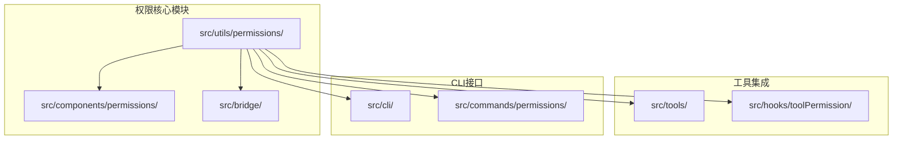

**图表来源**
- [src/utils/permissions/PermissionRule.ts:1-50](file://src/utils/permissions/PermissionRule.ts#L1-L50)
- [src/components/permissions/rules/PermissionRuleList.tsx:1-30](file://src/components/permissions/rules/PermissionRuleList.tsx#L1-L30)

**章节来源**
- [src/utils/permissions/PermissionRule.ts:1-100](file://src/utils/permissions/PermissionRule.ts#L1-L100)
- [src/components/permissions/rules/PermissionRuleList.tsx:1-50](file://src/components/permissions/rules/PermissionRuleList.tsx#L1-L50)

## 核心组件

### 权限规则定义

权限规则系统的核心是规则定义和管理机制：

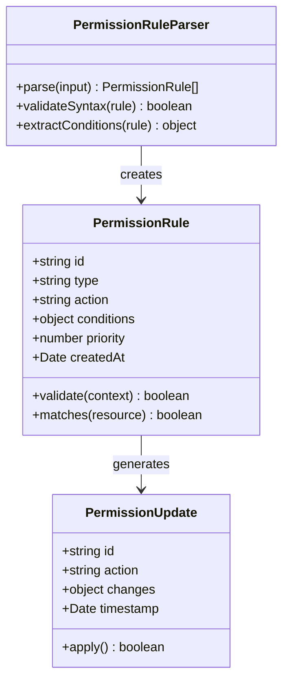

**图表来源**
- [src/utils/permissions/PermissionRule.ts:1-80](file://src/utils/permissions/PermissionRule.ts#L1-L80)
- [src/utils/permissions/permissionRuleParser.ts:1-60](file://src/utils/permissions/permissionRuleParser.ts#L1-L60)
- [src/utils/permissions/PermissionUpdate.ts:1-50](file://src/utils/permissions/PermissionUpdate.ts#L1-L50)

### 权限模式管理

系统支持多种权限模式，每种模式对应不同的安全级别：

| 模式 | 描述 | 特点 |
|------|------|------|
| 自动模式 | 基于AI分类器自动决策 | 最低人工干预 |
| 严格模式 | 所有请求都需要明确批准 | 最高安全性 |
| 放宽模式 | 预批准常见操作 | 平衡安全性和便利性 |
| 绕过模式 | 完全跳过权限检查 | 仅用于特殊场景 |

**章节来源**
- [src/utils/permissions/PermissionMode.ts:1-80](file://src/utils/permissions/PermissionMode.ts#L1-L80)
- [src/utils/permissions/permissions.ts:1-120](file://src/utils/permissions/permissions.ts#L1-L120)

## 架构概览

权限规则系统采用分层架构，从底层的规则引擎到顶层的用户界面：

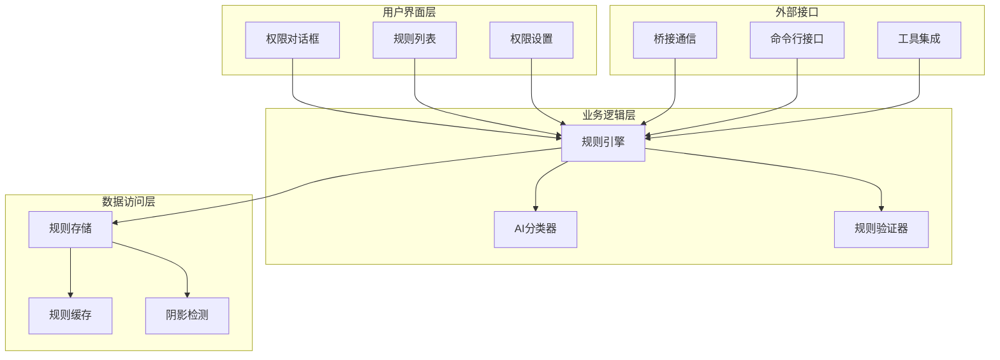

**图表来源**
- [src/utils/permissions/permissionsLoader.ts:1-80](file://src/utils/permissions/permissionsLoader.ts#L1-L80)
- [src/utils/permissions/permissionSetup.ts:1-100](file://src/utils/permissions/permissionSetup.ts#L1-L100)
- [src/bridge/bridgePermissionCallbacks.ts:1-43](file://src/bridge/bridgePermissionCallbacks.ts#L1-L43)

## 详细组件分析

### 规则定义格式

权限规则采用统一的数据结构定义：

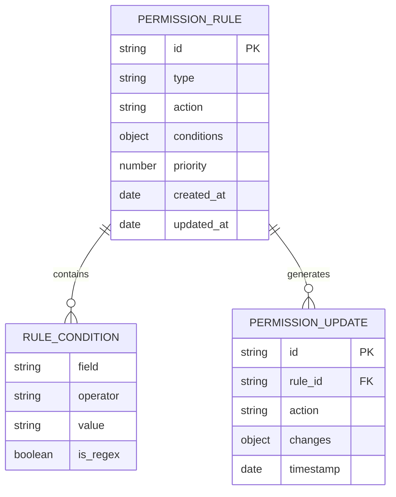

**图表来源**
- [src/utils/permissions/PermissionRule.ts:1-100](file://src/utils/permissions/PermissionRule.ts#L1-L100)
- [src/utils/permissions/PermissionUpdate.ts:1-80](file://src/utils/permissions/PermissionUpdate.ts#L1-L80)

### 解析机制

规则解析器负责将用户输入转换为可执行的规则对象：

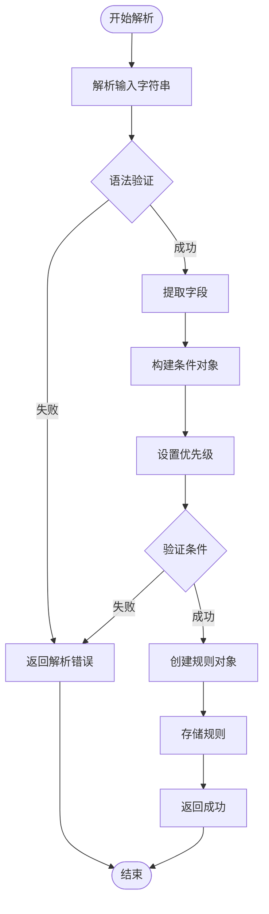

**图表来源**
- [src/utils/permissions/permissionRuleParser.ts:1-120](file://src/utils/permissions/permissionRuleParser.ts#L1-L120)

**章节来源**
- [src/utils/permissions/permissionRuleParser.ts:1-200](file://src/utils/permissions/permissionRuleParser.ts#L1-L200)

### 执行流程

权限检查的执行流程如下：

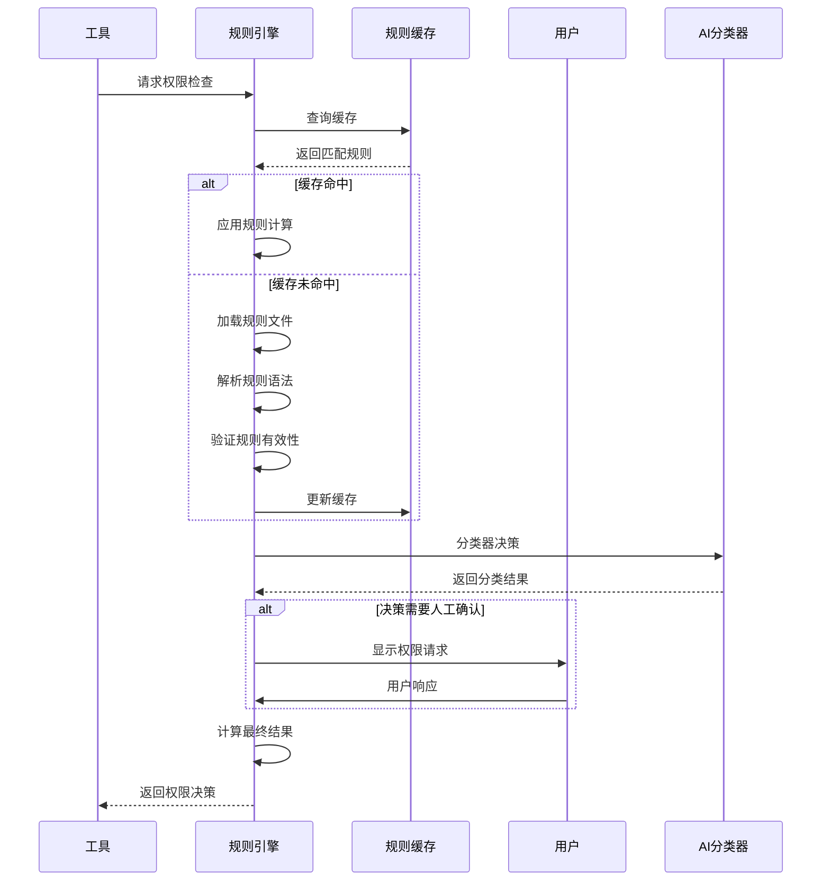

**图表来源**
- [src/utils/permissions/permissions.ts:1-200](file://src/utils/permissions/permissions.ts#L1-L200)
- [src/utils/permissions/permissionsLoader.ts:1-150](file://src/utils/permissions/permissionsLoader.ts#L1-L150)

**章节来源**
- [src/utils/permissions/permissions.ts:1-300](file://src/utils/permissions/permissions.ts#L1-L300)

### 路径验证规则

路径验证是文件系统权限控制的核心组件：

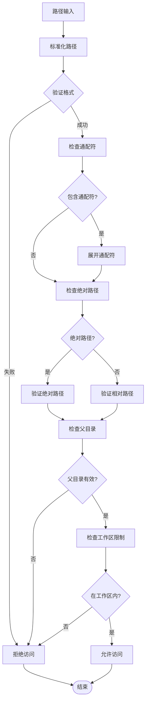

**图表来源**
- [src/utils/permissions/pathValidation.ts:1-150](file://src/utils/permissions/pathValidation.ts#L1-L150)
- [src/utils/permissions/shadowedRuleDetection.ts:1-80](file://src/utils/permissions/shadowedRuleDetection.ts#L1-L80)

**章节来源**
- [src/utils/permissions/pathValidation.ts:1-200](file://src/utils/permissions/pathValidation.ts#L1-L200)

### 文件系统权限规则

文件系统权限规则提供了细粒度的文件访问控制：

| 规则类型 | 条件字段 | 操作类型 | 示例场景 |
|----------|----------|----------|----------|
| 文件读取 | path, filename, extension | 允许/拒绝 | 读取配置文件 |
| 文件写入 | path, workspace, parent | 允许/拒绝 | 修改源代码 |
| 文件删除 | path, recursive | 允许/拒绝 | 清理临时文件 |
| 目录访问 | path, depth | 允许/拒绝 | 遍历项目结构 |

**章节来源**
- [src/components/permissions/FilesystemPermissionRequest/FilesystemPermissionRequest.tsx:1-120](file://src/components/permissions/FilesystemPermissionRequest/FilesystemPermissionRequest.tsx#L1-L120)

### 网络访问规则

网络访问控制确保只允许受信任的连接：

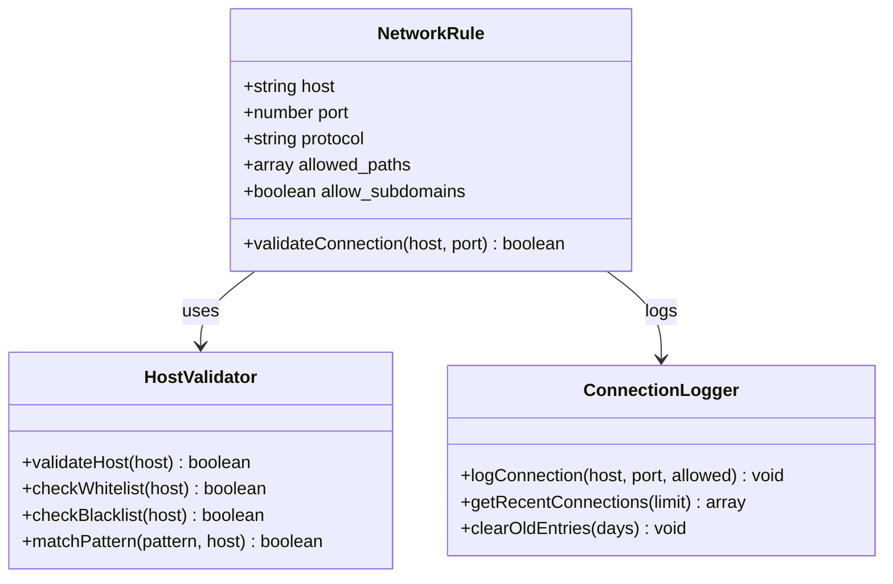

**图表来源**
- [src/components/permissions/WebFetchPermissionRequest/WebFetchPermissionRequest.tsx:1-100](file://src/components/permissions/WebFetchPermissionRequest/WebFetchPermissionRequest.tsx#L1-L100)

**章节来源**
- [src/components/permissions/WebFetchPermissionRequest/WebFetchPermissionRequest.tsx:1-150](file://src/components/permissions/WebFetchPermissionRequest/WebFetchPermissionRequest.tsx#L1-L150)

### 权限规则配置示例

以下是一些常见的权限规则配置示例：

**文件系统规则示例：**
```
# 允许读取所有 .txt 文件
rule: file-read
conditions:
  path: "*.txt"
  action: read
priority: 10

# 拒绝删除根目录文件
rule: file-delete
conditions:
  path: "/"
  action: delete
priority: 100
```

**网络访问规则示例：**
```
# 允许访问特定域名
rule: network-access
conditions:
  host: "api.github.com"
  protocol: "https"
priority: 5

# 拒绝所有其他网络请求
rule: default-deny
conditions:
  action: "network"
priority: 100
```

### 规则优先级机制

规则优先级决定了多个规则同时适用时的处理顺序：

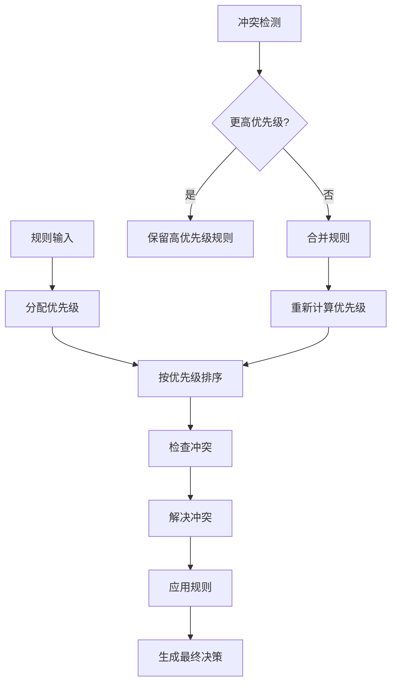

**图表来源**
- [src/utils/permissions/permissions.ts:1-250](file://src/utils/permissions/permissions.ts#L1-L250)

**章节来源**
- [src/utils/permissions/permissions.ts:1-350](file://src/utils/permissions/permissions.ts#L1-L350)

### 规则加载流程

规则加载采用延迟加载和缓存策略：

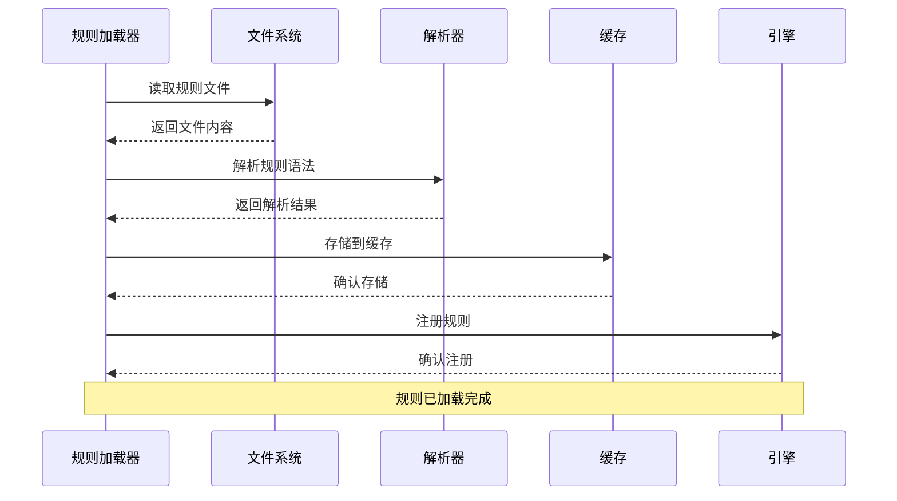

**图表来源**
- [src/utils/permissions/permissionsLoader.ts:1-120](file://src/utils/permissions/permissionsLoader.ts#L1-L120)

**章节来源**
- [src/utils/permissions/permissionsLoader.ts:1-200](file://src/utils/permissions/permissionsLoader.ts#L1-L200)

### 规则缓存策略

系统实现了多层缓存机制以提高性能：

| 缓存层级 | 类型 | 作用 | 过期时间 |
|----------|------|------|----------|
| 内存缓存 | 规则对象 | 快速访问 | 进程生命周期 |
| 文件缓存 | 序列化规则 | 持久化存储 | 手动清理 |
| LRU缓存 | 最近使用 | 内存优化 | 1000条记录 |
| 预编译缓存 | 正则表达式 | 性能优化 | 规则变更时重置 |

**章节来源**
- [src/utils/permissions/permissionsLoader.ts:1-150](file://src/utils/permissions/permissionsLoader.ts#L1-L150)

### 规则更新机制

规则更新采用增量更新策略：

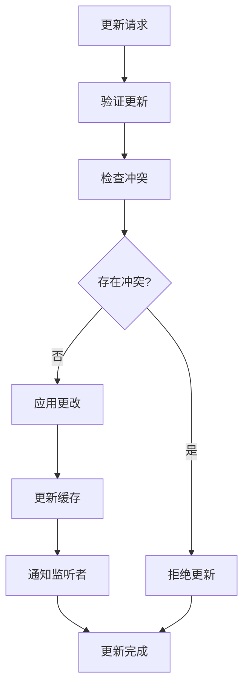

**图表来源**
- [src/utils/permissions/PermissionUpdate.ts:1-120](file://src/utils/permissions/PermissionUpdate.ts#L1-L120)

**章节来源**
- [src/utils/permissions/PermissionUpdate.ts:1-200](file://src/utils/permissions/PermissionUpdate.ts#L1-L200)

### 规则继承、合并和冲突解决

系统支持规则的继承和合并机制：

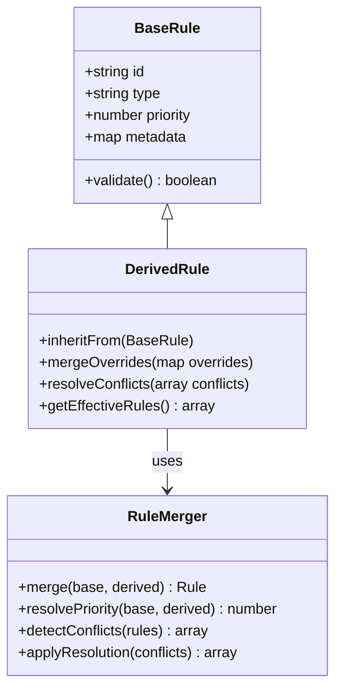

**图表来源**
- [src/utils/permissions/PermissionRule.ts:1-150](file://src/utils/permissions/PermissionRule.ts#L1-L150)

**章节来源**
- [src/utils/permissions/PermissionRule.ts:1-200](file://src/utils/permissions/PermissionRule.ts#L1-L200)

## 依赖关系分析

权限规则系统与其他组件的依赖关系：

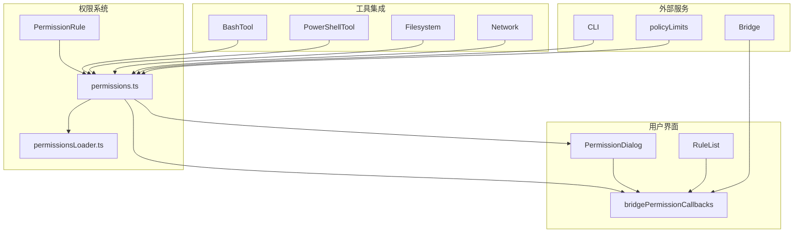

**图表来源**
- [src/utils/permissions/permissions.ts:1-100](file://src/utils/permissions/permissions.ts#L1-L100)
- [src/bridge/bridgePermissionCallbacks.ts:1-43](file://src/bridge/bridgePermissionCallbacks.ts#L1-L43)

**章节来源**
- [src/utils/permissions/permissions.ts:1-200](file://src/utils/permissions/permissions.ts#L1-L200)
- [src/bridge/bridgePermissionCallbacks.ts:1-43](file://src/bridge/bridgePermissionCallbacks.ts#L1-L43)

## 性能考虑

权限规则系统在设计时充分考虑了性能因素：

### 缓存策略
- 使用LRU缓存减少重复解析
- 实现规则预编译避免重复正则匹配
- 采用内存映射文件加速规则加载

### 并发处理
- 规则引擎支持并发查询
- 使用异步加载避免阻塞主线程
- 实现规则更新的原子操作

### 内存管理
- 定期清理过期规则缓存
- 实现规则对象池减少GC压力
- 优化规则存储结构

## 故障排除指南

### 常见问题及解决方案

**问题1：规则不生效**
- 检查规则优先级设置
- 验证规则语法正确性
- 确认规则缓存是否更新

**问题2：权限请求频繁弹出**
- 检查规则匹配逻辑
- 调整AI分类器阈值
- 优化规则优先级

**问题3：性能问题**
- 清理规则缓存
- 检查规则数量
- 优化规则复杂度

**章节来源**
- [src/utils/permissions/permissions.ts:1-150](file://src/utils/permissions/permissions.ts#L1-L150)

### 调试工具

系统提供了多种调试工具：

- 权限决策日志记录
- 规则匹配跟踪
- 性能指标监控
- AI分类器输出分析

## 结论

权限规则系统通过其模块化设计和分层架构，为 Claude Code 提供了强大而灵活的安全控制机制。系统不仅支持复杂的规则定义和执行，还提供了完善的用户界面和调试工具。

关键优势包括：
- 灵活的规则定义格式
- 高效的解析和执行机制  
- 完善的缓存和性能优化
- 友好的用户交互体验
- 强大的扩展性和维护性

未来可以进一步优化的方向包括：
- 更智能的AI分类器训练
- 更精细的规则匹配算法
- 更完善的审计和监控功能
- 更丰富的规则类型和操作