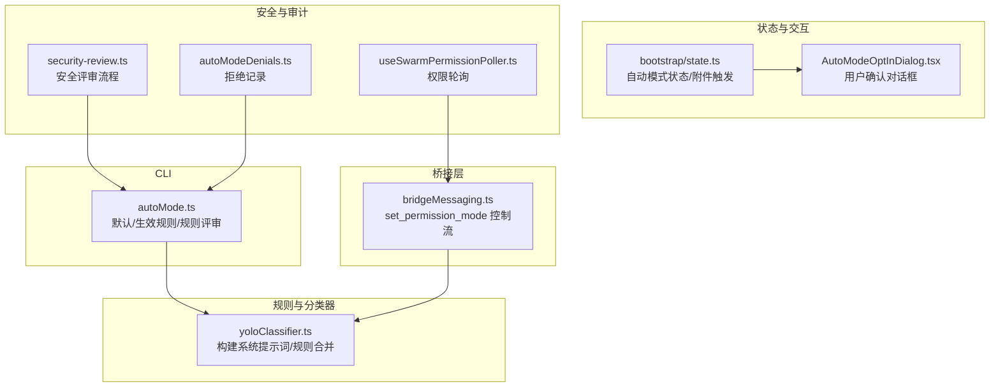
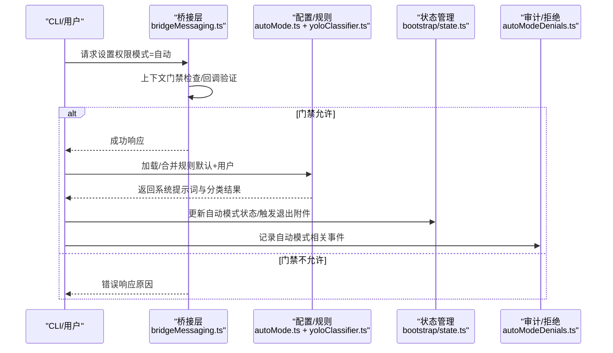
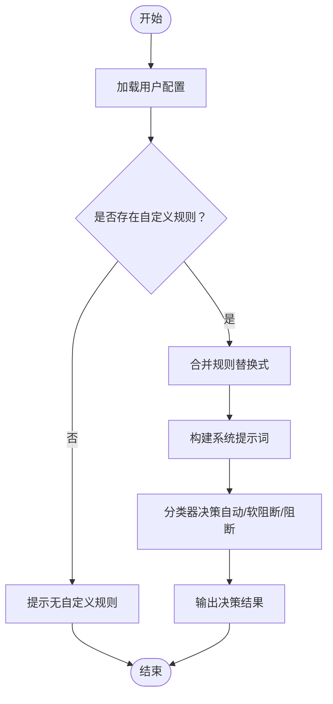
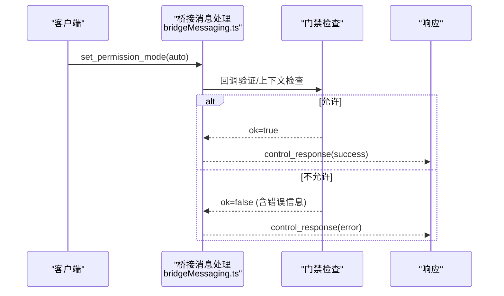
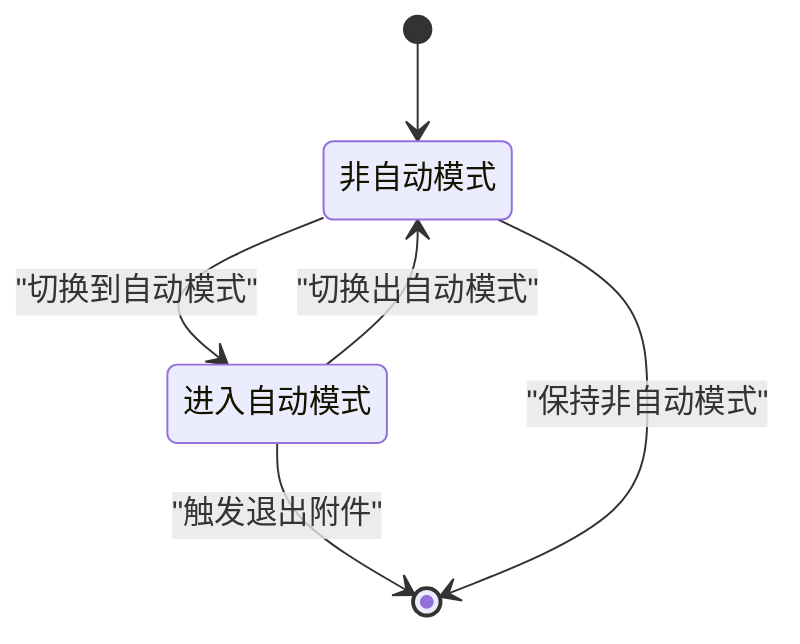
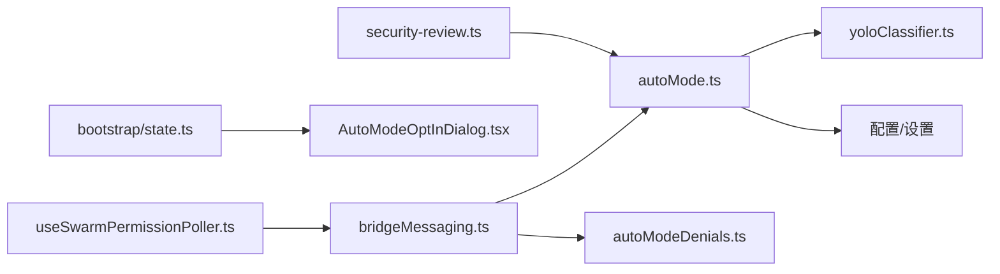

# 自动模式安全

<cite>
**本文引用的文件**
- [src/utils/permissions/yoloClassifier.ts](file://src/utils/permissions/yoloClassifier.ts)
- [src/cli/handlers/autoMode.ts](file://src/cli/handlers/autoMode.ts)
- [src/bridge/bridgeMessaging.ts](file://src/bridge/bridgeMessaging.ts)
- [src/cli/print.ts](file://src/cli/print.ts)
- [src/utils/autoModeDenials.ts](file://src/utils/autoModeDenials.ts)
- [src/components/AutoModeOptInDialog.tsx](file://src/components/AutoModeOptInDialog.tsx)
- [src/hooks/useSwarmPermissionPoller.ts](file://src/hooks/useSwarmPermissionPoller.ts)
- [src/commands/security-review.ts](file://src/commands/security-review.ts)
- [src/bootstrap/state.ts](file://src/bootstrap/state.ts)
</cite>

## 目录
1. [简介](#简介)
2. [项目结构](#项目结构)
3. [核心组件](#核心组件)
4. [架构总览](#架构总览)
5. [详细组件分析](#详细组件分析)
6. [依赖关系分析](#依赖关系分析)
7. [性能考量](#性能考量)
8. [故障排查指南](#故障排查指南)
9. [结论](#结论)
10. [附录](#附录)

## 简介
本文件系统性阐述“自动模式”的安全机制与风险控制策略，覆盖以下方面：
- YOLO 分类器在自动模式中的工作原理与规则体系
- 自动权限决策流程与紧急停用机制
- 自动模式状态管理、权限提升流程与安全边界控制
- 配置项、风险评估指标与安全阈值建议
- 故障恢复、手动干预与安全审计能力

自动模式通过“AI 分类器 + 用户规则 + 外部默认规则”三者协作，实现对工具调用的自动审批或阻断，并在必要时要求人工确认。为确保安全，系统在多个层面设置了门禁、回退与审计能力。

## 项目结构
围绕自动模式安全的关键模块分布如下：
- 规则与分类器：位于权限工具链中，负责构建系统提示词、解析用户自定义规则并生成分类结果
- CLI 子命令：提供查看默认规则、合并生效规则、评审自定义规则的能力
- 桥接层：处理外部请求（如设置权限模式），并进行上下文感知的门禁校验
- 状态与交互：记录自动模式切换状态、触发退出附件、引导用户确认
- 安全与审计：提供安全评审命令、拒绝记录与权限轮询钩子

图表来源
- [src/utils/permissions/yoloClassifier.ts](file://src/utils/permissions/yoloClassifier.ts)
- [src/cli/handlers/autoMode.ts](file://src/cli/handlers/autoMode.ts)
- [src/bridge/bridgeMessaging.ts](file://src/bridge/bridgeMessaging.ts)
- [src/bootstrap/state.ts](file://src/bootstrap/state.ts)
- [src/components/AutoModeOptInDialog.tsx](file://src/components/AutoModeOptInDialog.tsx)
- [src/commands/security-review.ts](file://src/commands/security-review.ts)
- [src/utils/autoModeDenials.ts](file://src/utils/autoModeDenials.ts)
- [src/hooks/useSwarmPermissionPoller.ts](file://src/hooks/useSwarmPermissionPoller.ts)

章节来源
- [src/utils/permissions/yoloClassifier.ts](file://src/utils/permissions/yoloClassifier.ts)
- [src/cli/handlers/autoMode.ts](file://src/cli/handlers/autoMode.ts)
- [src/bridge/bridgeMessaging.ts](file://src/bridge/bridgeMessaging.ts)
- [src/bootstrap/state.ts](file://src/bootstrap/state.ts)
- [src/components/AutoModeOptInDialog.tsx](file://src/components/AutoModeOptInDialog.tsx)
- [src/commands/security-review.ts](file://src/commands/security-review.ts)
- [src/utils/autoModeDenials.ts](file://src/utils/autoModeDenials.ts)
- [src/hooks/useSwarmPermissionPoller.ts](file://src/hooks/useSwarmPermissionPoller.ts)

## 核心组件
- YOLO 分类器与规则系统
  - 负责将用户自定义规则与外部默认规则合并，构建系统提示词，驱动 LLM 对工具调用进行自动审批/阻断判断
  - 支持三个规则段落：allow（自动批准）、soft_deny（软阻断，需人工确认）、environment（环境上下文）
- CLI 自动模式子命令
  - 提供查看默认规则、查看生效规则（用户覆盖默认）、评审自定义规则的功能
- 权限模式切换与门禁
  - 桥接层接收“设置权限模式”请求，执行上下文门禁检查，返回成功或错误响应
  - 在特定特性开关未启用时，禁止切换到自动模式
- 状态与交互
  - 记录自动模式切换状态，避免快速切换导致重复通知；在退出自动模式时触发退出附件
  - 引导用户进行首次确认（Opt-In）以明确授权范围
- 安全与审计
  - 提供安全评审流程，帮助识别潜在注入、数据暴露等风险
  - 维护自动模式拒绝记录，便于审计与回溯
  - 权限轮询钩子用于在集群/多实例场景下同步权限状态

章节来源
- [src/utils/permissions/yoloClassifier.ts](file://src/utils/permissions/yoloClassifier.ts)
- [src/cli/handlers/autoMode.ts](file://src/cli/handlers/autoMode.ts)
- [src/bridge/bridgeMessaging.ts](file://src/bridge/bridgeMessaging.ts)
- [src/bootstrap/state.ts](file://src/bootstrap/state.ts)
- [src/components/AutoModeOptInDialog.tsx](file://src/components/AutoModeOptInDialog.tsx)
- [src/commands/security-review.ts](file://src/commands/security-review.ts)
- [src/utils/autoModeDenials.ts](file://src/utils/autoModeDenials.ts)
- [src/hooks/useSwarmPermissionPoller.ts](file://src/hooks/useSwarmPermissionPoller.ts)

## 架构总览
自动模式安全架构由“规则构建—决策—门禁—状态—审计”五条主线构成，形成闭环：

图表来源
- [src/bridge/bridgeMessaging.ts](file://src/bridge/bridgeMessaging.ts)
- [src/cli/handlers/autoMode.ts](file://src/cli/handlers/autoMode.ts)
- [src/utils/permissions/yoloClassifier.ts](file://src/utils/permissions/yoloClassifier.ts)
- [src/bootstrap/state.ts](file://src/bootstrap/state.ts)
- [src/utils/autoModeDenials.ts](file://src/utils/autoModeDenials.ts)

## 详细组件分析

### YOLO 分类器与规则系统
- 规则来源与合并语义
  - 默认规则来自外部模板；用户规则按“替换式”覆盖对应段落
  - 生效规则 = 用户提供的 allow/soft_deny/environment 替换默认对应段落
- 系统提示词构建
  - 将合并后的规则注入到分类器系统提示词中，作为 LLM 决策依据
- 规则评审
  - CLI 提供评审入口，对比用户自定义规则与默认规则，输出可操作建议

图表来源
- [src/cli/handlers/autoMode.ts](file://src/cli/handlers/autoMode.ts)
- [src/utils/permissions/yoloClassifier.ts](file://src/utils/permissions/yoloClassifier.ts)

章节来源
- [src/cli/handlers/autoMode.ts](file://src/cli/handlers/autoMode.ts)
- [src/utils/permissions/yoloClassifier.ts](file://src/utils/permissions/yoloClassifier.ts)

### 权限模式切换与门禁
- 门禁检查点
  - 当请求切换到自动模式且未启用相应特性开关时，直接拒绝
  - 桥接层在回调未注册时，返回错误而非静默失败，保证一致性
- 响应与回退
  - 成功时返回控制响应；失败时携带具体错误原因
- 与 CLI 的配合
  - CLI 在门禁不满足时，向输出队列写入错误控制响应

图表来源
- [src/bridge/bridgeMessaging.ts](file://src/bridge/bridgeMessaging.ts)
- [src/cli/print.ts](file://src/cli/print.ts)

章节来源
- [src/bridge/bridgeMessaging.ts](file://src/bridge/bridgeMessaging.ts)
- [src/cli/print.ts](file://src/cli/print.ts)

### 状态管理与安全边界
- 状态更新
  - 切换到自动模式时清除可能的退出附件标记，避免重复通知
  - 切换出自动模式时触发退出附件，提醒用户当前会话已退出自动模式
- 安全边界
  - 快速切换保护：同一时刻仅保留一次退出附件，防止并发状态污染
  - 首次进入自动模式的粘滞提示，确保用户明确授权范围

图表来源
- [src/bootstrap/state.ts](file://src/bootstrap/state.ts)

章节来源
- [src/bootstrap/state.ts](file://src/bootstrap/state.ts)

### 手动干预与紧急停用
- 手动干预
  - 软阻断（soft_deny）规则使某些动作被阻断并要求人工确认
  - CLI 提供规则评审，帮助用户识别潜在冲突与模糊规则
- 紧急停用
  - 通过桥接层的门禁检查与错误响应，可在运行时阻止自动模式生效
  - 若回调未注册，强制返回错误，避免静默失败带来的不可控状态

章节来源
- [src/cli/handlers/autoMode.ts](file://src/cli/handlers/autoMode.ts)
- [src/bridge/bridgeMessaging.ts](file://src/bridge/bridgeMessaging.ts)

### 安全审计与拒绝记录
- 审计流程
  - 安全评审命令提供系统化方法论，从仓库上下文研究、对比分析到漏洞评估
- 拒绝记录
  - 维护自动模式下的拒绝事件，支持后续审计与回溯

章节来源
- [src/commands/security-review.ts](file://src/commands/security-review.ts)
- [src/utils/autoModeDenials.ts](file://src/utils/autoModeDenials.ts)

### 用户确认与交互
- 首次确认对话框
  - 在用户首次进入自动模式时弹出确认对话框，确保其理解授权范围与潜在风险

章节来源
- [src/components/AutoModeOptInDialog.tsx](file://src/components/AutoModeOptInDialog.tsx)

### 权限轮询与多实例一致性
- 权限轮询钩子
  - 在集群或多实例环境中，通过轮询确保权限状态一致，避免因节点差异导致的策略漂移

章节来源
- [src/hooks/useSwarmPermissionPoller.ts](file://src/hooks/useSwarmPermissionPoller.ts)

## 依赖关系分析
自动模式安全相关模块之间的依赖关系如下：

图表来源
- [src/cli/handlers/autoMode.ts](file://src/cli/handlers/autoMode.ts)
- [src/utils/permissions/yoloClassifier.ts](file://src/utils/permissions/yoloClassifier.ts)
- [src/bridge/bridgeMessaging.ts](file://src/bridge/bridgeMessaging.ts)
- [src/utils/autoModeDenials.ts](file://src/utils/autoModeDenials.ts)
- [src/bootstrap/state.ts](file://src/bootstrap/state.ts)
- [src/components/AutoModeOptInDialog.tsx](file://src/components/AutoModeOptInDialog.tsx)
- [src/commands/security-review.ts](file://src/commands/security-review.ts)
- [src/hooks/useSwarmPermissionPoller.ts](file://src/hooks/useSwarmPermissionPoller.ts)

章节来源
- [src/cli/handlers/autoMode.ts](file://src/cli/handlers/autoMode.ts)
- [src/utils/permissions/yoloClassifier.ts](file://src/utils/permissions/yoloClassifier.ts)
- [src/bridge/bridgeMessaging.ts](file://src/bridge/bridgeMessaging.ts)
- [src/utils/autoModeDenials.ts](file://src/utils/autoModeDenials.ts)
- [src/bootstrap/state.ts](file://src/bootstrap/state.ts)
- [src/components/AutoModeOptInDialog.tsx](file://src/components/AutoModeOptInDialog.tsx)
- [src/commands/security-review.ts](file://src/commands/security-review.ts)
- [src/hooks/useSwarmPermissionPoller.ts](file://src/hooks/useSwarmPermissionPoller.ts)

## 性能考量
- 规则构建与系统提示词注入属于轻量级文本处理，开销主要取决于模型选择与提示词长度
- 评审流程通过独立查询接口执行，避免阻塞主权限流
- 门禁检查与状态更新均为内存级操作，对性能影响极小
- 建议
  - 控制自定义规则数量与复杂度，减少提示词长度
  - 使用更合适的模型参数以平衡准确性与延迟
  - 在高并发场景下，结合权限轮询钩子确保一致性

## 故障排查指南
- 无法切换到自动模式
  - 检查特性开关是否启用；若未启用，桥接层会返回错误原因
  - 确认回调已正确注册；未注册时会返回“不受支持”的错误
- 规则评审无输出
  - 确认存在自定义规则；否则 CLI 会提示无自定义规则
  - 检查评审接口可用性与网络连通性
- 自动模式状态异常
  - 检查状态更新逻辑是否被触发；关注快速切换保护与退出附件标记
- 审计与拒绝记录缺失
  - 确认拒绝记录模块正常运行；必要时重试或查看日志

章节来源
- [src/bridge/bridgeMessaging.ts](file://src/bridge/bridgeMessaging.ts)
- [src/cli/print.ts](file://src/cli/print.ts)
- [src/cli/handlers/autoMode.ts](file://src/cli/handlers/autoMode.ts)
- [src/bootstrap/state.ts](file://src/bootstrap/state.ts)
- [src/utils/autoModeDenials.ts](file://src/utils/autoModeDenials.ts)

## 结论
自动模式通过“规则 + 分类器 + 门禁 + 状态 + 审计”的组合拳，在提升自动化效率的同时，严格控制了权限边界与风险暴露面。建议在生产环境中：
- 明确自定义规则范围，定期评审规则质量
- 启用并维护拒绝记录与安全审计流程
- 在多实例环境下使用权限轮询钩子，确保策略一致性
- 通过门禁与手动干预机制，保留紧急停用通道

## 附录

### 自动模式配置选项与建议
- 规则段落
  - allow：自动批准的动作清单
  - soft_deny：软阻断的动作清单（需要人工确认）
  - environment：环境上下文描述，辅助分类器决策
- 合并与覆盖
  - 用户规则按段落替换默认规则；空段落回退到默认
- 风险评估指标与阈值建议
  - 规则冲突率：建议低于 5%
  - 软阻断比例：建议不超过总动作数的 10%
  - 评审通过率：建议不低于 90%
  - 审计覆盖率：建议 100% 记录拒绝事件

章节来源
- [src/cli/handlers/autoMode.ts](file://src/cli/handlers/autoMode.ts)
- [src/utils/permissions/yoloClassifier.ts](file://src/utils/permissions/yoloClassifier.ts)
- [src/commands/security-review.ts](file://src/commands/security-review.ts)
- [src/utils/autoModeDenials.ts](file://src/utils/autoModeDenials.ts)