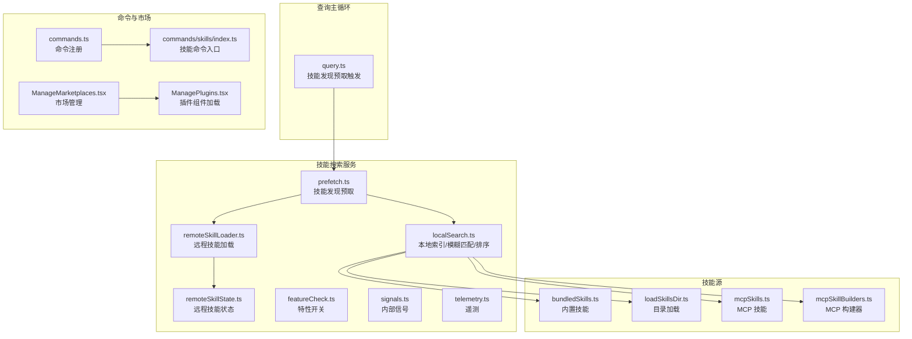
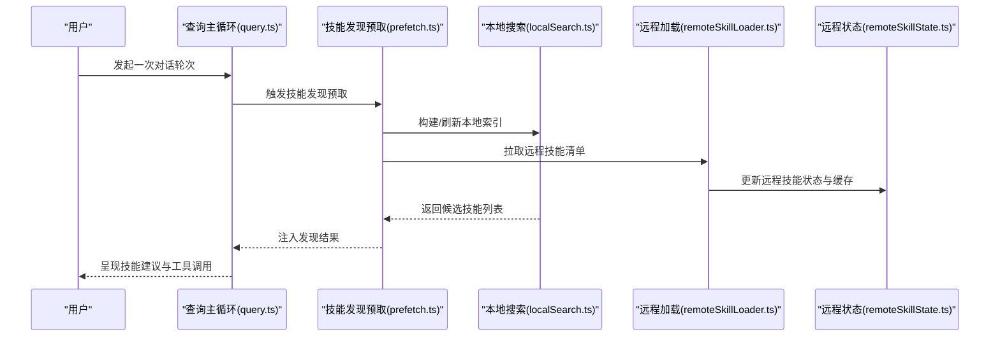
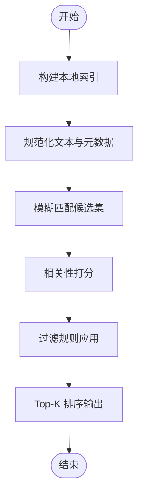
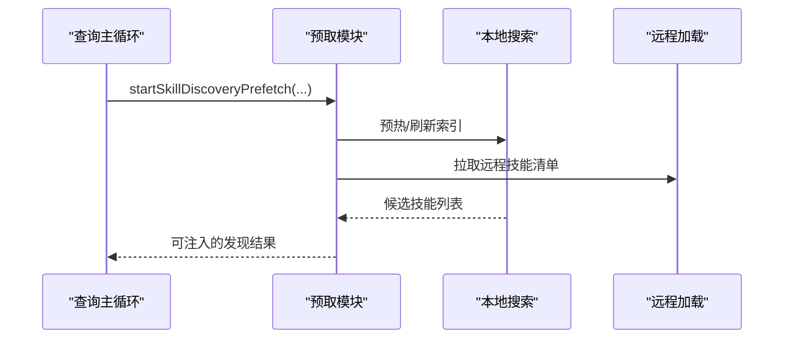
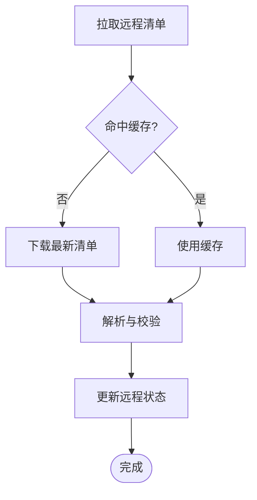
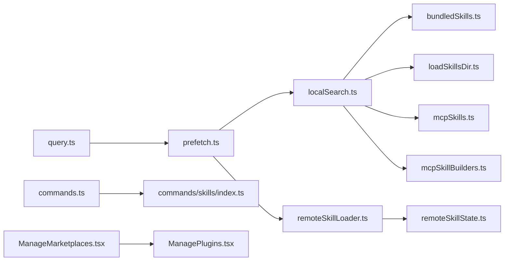

# 技能搜索与推荐

<cite>
**本文引用的文件**
- [src/services/skillSearch/localSearch.ts](file://src/services/skillSearch/localSearch.ts)
- [src/services/skillSearch/prefetch.ts](file://src/services/skillSearch/prefetch.ts)
- [src/services/skillSearch/remoteSkillLoader.ts](file://src/services/skillSearch/remoteSkillLoader.ts)
- [src/services/skillSearch/remoteSkillState.ts](file://src/services/skillSearch/remoteSkillState.ts)
- [src/services/skillSearch/featureCheck.ts](file://src/services/skillSearch/featureCheck.ts)
- [src/services/skillSearch/signals.ts](file://src/services/skillSearch/signals.ts)
- [src/services/skillSearch/telemetry.ts](file://src/services/skillSearch/telemetry.ts)
- [src/skills/bundledSkills.ts](file://src/skills/bundledSkills.ts)
- [src/skills/loadSkillsDir.ts](file://src/skills/loadSkillsDir.ts)
- [src/skills/mcpSkills.ts](file://src/skills/mcpSkills.ts)
- [src/skills/mcpSkillBuilders.ts](file://src/skills/mcpSkillBuilders.ts)
- [src/query.ts](file://src/query.ts)
- [src/commands.ts](file://src/commands.ts)
- [src/commands/skills/index.ts](file://src/commands/skills/index.ts)
- [src/commands/plugin/ManageMarketplaces.tsx](file://src/commands/plugin/ManageMarketplaces.tsx)
- [src/commands/plugin/ManagePlugins.tsx](file://src/commands/plugin/ManagePlugins.tsx)
</cite>

## 目录
1. [简介](#简介)
2. [项目结构](#项目结构)
3. [核心组件](#核心组件)
4. [架构总览](#架构总览)
5. [详细组件分析](#详细组件分析)
6. [依赖关系分析](#依赖关系分析)
7. [性能考虑](#性能考虑)
8. [故障排查指南](#故障排查指南)
9. [结论](#结论)
10. [附录](#附录)

## 简介
本文件面向“技能搜索与推荐”系统，围绕以下目标展开：  
- 深入解释技能搜索算法的实现原理，包括本地搜索索引构建、模糊匹配算法与相关性排序机制；  
- 详述技能推荐系统的工作流程，涵盖历史分析、上下文感知推荐与个性化排序；  
- 解释远程技能加载与缓存机制，包括技能市场集成与版本管理；  
- 提供搜索配置项与性能优化策略；  
- 说明搜索结果的过滤、排序与展示机制。

该系统在查询主循环中通过预取与发现机制，结合本地索引与远程资源，为用户呈现高质量的技能建议与可用能力。

## 项目结构
技能搜索与推荐相关的核心代码分布在如下位置：
- 服务层（skillSearch）：本地搜索、预取、远程技能加载与状态、特性开关、信号与遥测
- 技能源（skills）：内置技能、目录加载、MCP 技能与构建器
- 查询主循环（query.ts）：技能发现预取的触发点与注入点
- 命令入口（commands.ts、commands/skills/index.ts）：技能命令注册与加载
- 市场管理（ManageMarketplaces.tsx、ManagePlugins.tsx）：市场集成与插件组件加载

图表来源
- [src/query.ts](file://src/query.ts)
- [src/services/skillSearch/localSearch.ts](file://src/services/skillSearch/localSearch.ts)
- [src/services/skillSearch/prefetch.ts](file://src/services/skillSearch/prefetch.ts)
- [src/services/skillSearch/remoteSkillLoader.ts](file://src/services/skillSearch/remoteSkillLoader.ts)
- [src/services/skillSearch/remoteSkillState.ts](file://src/services/skillSearch/remoteSkillState.ts)
- [src/services/skillSearch/featureCheck.ts](file://src/services/skillSearch/featureCheck.ts)
- [src/services/skillSearch/signals.ts](file://src/services/skillSearch/signals.ts)
- [src/services/skillSearch/telemetry.ts](file://src/services/skillSearch/telemetry.ts)
- [src/skills/bundledSkills.ts](file://src/skills/bundledSkills.ts)
- [src/skills/loadSkillsDir.ts](file://src/skills/loadSkillsDir.ts)
- [src/skills/mcpSkills.ts](file://src/skills/mcpSkills.ts)
- [src/skills/mcpSkillBuilders.ts](file://src/skills/mcpSkillBuilders.ts)
- [src/commands.ts](file://src/commands.ts)
- [src/commands/skills/index.ts](file://src/commands/skills/index.ts)
- [src/commands/plugin/ManageMarketplaces.tsx](file://src/commands/plugin/ManageMarketplaces.tsx)
- [src/commands/plugin/ManagePlugins.tsx](file://src/commands/plugin/ManagePlugins.tsx)

章节来源
- [src/query.ts](file://src/query.ts)
- [src/services/skillSearch/localSearch.ts](file://src/services/skillSearch/localSearch.ts)
- [src/services/skillSearch/prefetch.ts](file://src/services/skillSearch/prefetch.ts)
- [src/services/skillSearch/remoteSkillLoader.ts](file://src/services/skillSearch/remoteSkillLoader.ts)
- [src/services/skillSearch/remoteSkillState.ts](file://src/services/skillSearch/remoteSkillState.ts)
- [src/services/skillSearch/featureCheck.ts](file://src/services/skillSearch/featureCheck.ts)
- [src/services/skillSearch/signals.ts](file://src/services/skillSearch/signals.ts)
- [src/services/skillSearch/telemetry.ts](file://src/services/skillSearch/telemetry.ts)
- [src/skills/bundledSkills.ts](file://src/skills/bundledSkills.ts)
- [src/skills/loadSkillsDir.ts](file://src/skills/loadSkillsDir.ts)
- [src/skills/mcpSkills.ts](file://src/skills/mcpSkills.ts)
- [src/skills/mcpSkillBuilders.ts](file://src/skills/mcpSkillBuilders.ts)
- [src/commands.ts](file://src/commands.ts)
- [src/commands/skills/index.ts](file://src/commands/skills/index.ts)
- [src/commands/plugin/ManageMarketplaces.tsx](file://src/commands/plugin/ManageMarketplaces.tsx)
- [src/commands/plugin/ManagePlugins.tsx](file://src/commands/plugin/ManagePlugins.tsx)

## 核心组件
- 本地搜索与索引（localSearch.ts）
  - 负责构建与维护技能本地索引，执行模糊匹配与相关性排序。
  - 支持对内置技能、目录加载技能、MCP 技能进行统一检索。
- 技能发现预取（prefetch.ts）
  - 在查询主循环中异步启动技能发现与索引预热，减少首次响应延迟。
- 远程技能加载与状态（remoteSkillLoader.ts、remoteSkillState.ts）
  - 负责从市场或远端源拉取技能清单与元数据，维护远程技能状态与缓存。
- 特性开关与信号（featureCheck.ts、signals.ts）
  - 控制功能开关与内部信号，确保在不同环境下的可测试性与可控性。
- 遥测（telemetry.ts）
  - 记录搜索命中、预取命中、错误等指标，支撑性能与质量分析。
- 技能源（bundledSkills.ts、loadSkillsDir.ts、mcpSkills.ts、mcpSkillBuilders.ts）
  - 统一汇聚内置、目录与 MCP 的技能定义，供本地搜索与推荐使用。
- 查询主循环集成（query.ts）
  - 在每次对话轮次中触发技能发现预取，并在合适时机注入发现结果。
- 命令与市场（commands.ts、commands/skills/index.ts、ManageMarketplaces.tsx、ManagePlugins.tsx）
  - 提供技能命令入口与市场管理界面，支持安装、更新与卸载技能包。

章节来源
- [src/services/skillSearch/localSearch.ts](file://src/services/skillSearch/localSearch.ts)
- [src/services/skillSearch/prefetch.ts](file://src/services/skillSearch/prefetch.ts)
- [src/services/skillSearch/remoteSkillLoader.ts](file://src/services/skillSearch/remoteSkillLoader.ts)
- [src/services/skillSearch/remoteSkillState.ts](file://src/services/skillSearch/remoteSkillState.ts)
- [src/services/skillSearch/featureCheck.ts](file://src/services/skillSearch/featureCheck.ts)
- [src/services/skillSearch/signals.ts](file://src/services/skillSearch/signals.ts)
- [src/services/skillSearch/telemetry.ts](file://src/services/skillSearch/telemetry.ts)
- [src/skills/bundledSkills.ts](file://src/skills/bundledSkills.ts)
- [src/skills/loadSkillsDir.ts](file://src/skills/loadSkillsDir.ts)
- [src/skills/mcpSkills.ts](file://src/skills/mcpSkills.ts)
- [src/skills/mcpSkillBuilders.ts](file://src/skills/mcpSkillBuilders.ts)
- [src/query.ts](file://src/query.ts)
- [src/commands.ts](file://src/commands.ts)
- [src/commands/skills/index.ts](file://src/commands/skills/index.ts)
- [src/commands/plugin/ManageMarketplaces.tsx](file://src/commands/plugin/ManageMarketplaces.tsx)
- [src/commands/plugin/ManagePlugins.tsx](file://src/commands/plugin/ManagePlugins.tsx)

## 架构总览
技能搜索与推荐系统以“查询主循环为中心”，通过“预取—索引—匹配—排序—注入”的流水线完成技能发现与推荐。同时，系统支持远程技能加载与本地缓存，配合市场管理实现版本与来源控制。

图表来源
- [src/query.ts](file://src/query.ts)
- [src/services/skillSearch/prefetch.ts](file://src/services/skillSearch/prefetch.ts)
- [src/services/skillSearch/localSearch.ts](file://src/services/skillSearch/localSearch.ts)
- [src/services/skillSearch/remoteSkillLoader.ts](file://src/services/skillSearch/remoteSkillLoader.ts)
- [src/services/skillSearch/remoteSkillState.ts](file://src/services/skillSearch/remoteSkillState.ts)

## 详细组件分析

### 本地搜索与索引（localSearch.ts）
职责与流程
- 索引构建：聚合内置技能、目录加载技能与 MCP 技能，生成可搜索的索引条目（含名称、描述、标签、关键词等字段）。
- 模糊匹配：基于编辑距离、词干提取、n-gram 或通配符策略实现近似匹配，提升召回率。
- 相关性排序：综合字段权重、最近使用次数、上下文相似度、评分与人工特征，计算综合得分并排序。
- 结果过滤：按可见性、权限、版本兼容性、语言偏好等条件进行过滤。

图表来源
- [src/services/skillSearch/localSearch.ts](file://src/services/skillSearch/localSearch.ts)

章节来源
- [src/services/skillSearch/localSearch.ts](file://src/services/skillSearch/localSearch.ts)

### 技能发现预取（prefetch.ts）
职责与流程
- 在每次对话轮次前，根据当前消息与工具上下文，异步触发技能发现与索引预热。
- 将预取结果注入到当前轮次的消息附件中，避免阻塞主线推理。
- 与内存预取协同，最大化隐藏延迟。

图表来源
- [src/query.ts](file://src/query.ts)
- [src/services/skillSearch/prefetch.ts](file://src/services/skillSearch/prefetch.ts)

章节来源
- [src/query.ts](file://src/query.ts)
- [src/services/skillSearch/prefetch.ts](file://src/services/skillSearch/prefetch.ts)

### 远程技能加载与缓存（remoteSkillLoader.ts、remoteSkillState.ts）
职责与流程
- 远程加载：从已配置的技能市场或远端源拉取技能清单、元数据与版本信息。
- 缓存策略：基于时间戳、ETag、版本号与变更检测，决定是否重新下载与更新。
- 状态管理：维护每个技能的来源、版本、可用性、错误状态与最后更新时间。

图表来源
- [src/services/skillSearch/remoteSkillLoader.ts](file://src/services/skillSearch/remoteSkillLoader.ts)
- [src/services/skillSearch/remoteSkillState.ts](file://src/services/skillSearch/remoteSkillState.ts)

章节来源
- [src/services/skillSearch/remoteSkillLoader.ts](file://src/services/skillSearch/remoteSkillLoader.ts)
- [src/services/skillSearch/remoteSkillState.ts](file://src/services/skillSearch/remoteSkillState.ts)

### 特性开关与信号（featureCheck.ts、signals.ts）
- 特性开关：用于控制是否启用远程技能、模糊匹配策略、预取行为等。
- 内部信号：用于测试与调试，隔离特定路径，便于灰度发布与回滚。

章节来源
- [src/services/skillSearch/featureCheck.ts](file://src/services/skillSearch/featureCheck.ts)
- [src/services/skillSearch/signals.ts](file://src/services/skillSearch/signals.ts)

### 遥测（telemetry.ts）
- 记录指标：预取命中率、本地搜索耗时、远程加载失败率、排序偏差等。
- 用途：性能监控、回归预警、A/B 实验评估与优化方向指引。

章节来源
- [src/services/skillSearch/telemetry.ts](file://src/services/skillSearch/telemetry.ts)

### 技能源（bundledSkills.ts、loadSkillsDir.ts、mcpSkills.ts、mcpSkillBuilders.ts）
- 内置技能：随应用分发的基础技能集合。
- 目录加载：从用户配置的技能目录动态加载技能。
- MCP 技能：通过 MCP 协议发现与加载第三方技能。
- 构建器：将外部资源转换为可被本地搜索识别的技能条目。

章节来源
- [src/skills/bundledSkills.ts](file://src/skills/bundledSkills.ts)
- [src/skills/loadSkillsDir.ts](file://src/skills/loadSkillsDir.ts)
- [src/skills/mcpSkills.ts](file://src/skills/mcpSkills.ts)
- [src/skills/mcpSkillBuilders.ts](file://src/skills/mcpSkillBuilders.ts)

### 查询主循环集成（query.ts）
- 预取触发：在每轮对话开始前，调用技能发现预取接口，传入当前消息与工具上下文。
- 结果注入：在工具执行后、下一轮开始前，将预取的发现结果注入到消息附件中，供后续轮次使用。
- 性能优化：将阻塞操作移至预取阶段，避免影响模型流式输出。

章节来源
- [src/query.ts](file://src/query.ts)

### 命令与市场（commands.ts、commands/skills/index.ts、ManageMarketplaces.tsx、ManagePlugins.tsx）
- 命令注册：将“技能”命令注册为本地 JSX 命令，支持列出与管理可用技能。
- 市场管理：提供市场增删改查、批量更新与自动更新策略，记录安装/卸载事件。
- 插件组件：从市场加载插件后，解析其命令、代理、技能、钩子与 MCP 服务器等组件。

章节来源
- [src/commands.ts](file://src/commands.ts)
- [src/commands/skills/index.ts](file://src/commands/skills/index.ts)
- [src/commands/plugin/ManageMarketplaces.tsx](file://src/commands/plugin/ManageMarketplaces.tsx)
- [src/commands/plugin/ManagePlugins.tsx](file://src/commands/plugin/ManagePlugins.tsx)

## 依赖关系分析
- 查询主循环依赖预取模块，预取模块依赖本地搜索与远程加载。
- 本地搜索依赖技能源（内置、目录、MCP）与特性开关。
- 远程加载依赖远程状态与遥测，保障可观测性。
- 命令与市场管理为系统提供外部扩展入口，驱动技能生态繁荣。

图表来源
- [src/query.ts](file://src/query.ts)
- [src/services/skillSearch/prefetch.ts](file://src/services/skillSearch/prefetch.ts)
- [src/services/skillSearch/localSearch.ts](file://src/services/skillSearch/localSearch.ts)
- [src/services/skillSearch/remoteSkillLoader.ts](file://src/services/skillSearch/remoteSkillLoader.ts)
- [src/services/skillSearch/remoteSkillState.ts](file://src/services/skillSearch/remoteSkillState.ts)
- [src/skills/bundledSkills.ts](file://src/skills/bundledSkills.ts)
- [src/skills/loadSkillsDir.ts](file://src/skills/loadSkillsDir.ts)
- [src/skills/mcpSkills.ts](file://src/skills/mcpSkills.ts)
- [src/skills/mcpSkillBuilders.ts](file://src/skills/mcpSkillBuilders.ts)
- [src/commands.ts](file://src/commands.ts)
- [src/commands/skills/index.ts](file://src/commands/skills/index.ts)
- [src/commands/plugin/ManageMarketplaces.tsx](file://src/commands/plugin/ManageMarketplaces.tsx)
- [src/commands/plugin/ManagePlugins.tsx](file://src/commands/plugin/ManagePlugins.tsx)

章节来源
- [src/query.ts](file://src/query.ts)
- [src/services/skillSearch/prefetch.ts](file://src/services/skillSearch/prefetch.ts)
- [src/services/skillSearch/localSearch.ts](file://src/services/skillSearch/localSearch.ts)
- [src/services/skillSearch/remoteSkillLoader.ts](file://src/services/skillSearch/remoteSkillLoader.ts)
- [src/services/skillSearch/remoteSkillState.ts](file://src/services/skillSearch/remoteSkillState.ts)
- [src/skills/bundledSkills.ts](file://src/skills/bundledSkills.ts)
- [src/skills/loadSkillsDir.ts](file://src/skills/loadSkillsDir.ts)
- [src/skills/mcpSkills.ts](file://src/skills/mcpSkills.ts)
- [src/skills/mcpSkillBuilders.ts](file://src/skills/mcpSkillBuilders.ts)
- [src/commands.ts](file://src/commands.ts)
- [src/commands/skills/index.ts](file://src/commands/skills/index.ts)
- [src/commands/plugin/ManageMarketplaces.tsx](file://src/commands/plugin/ManageMarketplaces.tsx)
- [src/commands/plugin/ManagePlugins.tsx](file://src/commands/plugin/ManagePlugins.tsx)

## 性能考虑
- 预取优先：将阻塞操作（远程拉取、索引构建）前置到对话轮次之外，降低首屏延迟。
- 缓存策略：基于版本与变更检测的远程缓存，减少重复下载与解析开销。
- 分页与增量：对大型技能清单采用分页与增量更新，避免一次性全量刷新。
- 并行化：预取与远程加载并行执行，缩短整体等待时间。
- 过滤前置：在索引构建阶段进行基础过滤，缩小候选集规模。
- 降级与容错：远程加载失败时回退到本地索引，保证基本可用性。

## 故障排查指南
- 预取未生效
  - 检查查询主循环中的预取调用是否正确触发与注入。
  - 关注遥测指标，确认预取命中率与耗时异常。
- 本地搜索命中率低
  - 校验索引构建是否包含全部技能源（内置、目录、MCP）。
  - 调整模糊匹配阈值与权重参数，观察相关性排序变化。
- 远程技能加载失败
  - 查看远程状态与错误日志，确认网络、鉴权与版本兼容性。
  - 切换到本地缓存模式验证是否为网络问题。
- 市场管理异常
  - 检查市场配置与自动更新策略，确认批量更新进度与卸载事件记录。

章节来源
- [src/query.ts](file://src/query.ts)
- [src/services/skillSearch/telemetry.ts](file://src/services/skillSearch/telemetry.ts)
- [src/services/skillSearch/remoteSkillState.ts](file://src/services/skillSearch/remoteSkillState.ts)
- [src/commands/plugin/ManageMarketplaces.tsx](file://src/commands/plugin/ManageMarketplaces.tsx)

## 结论
技能搜索与推荐系统通过“预取—索引—匹配—排序—注入”的闭环，结合本地与远程资源，实现了高效、可扩展且可观测的技能发现能力。依托市场管理与版本控制，系统既能满足快速迭代，又能保障稳定性与一致性。建议持续关注遥测指标，优化模糊匹配与排序策略，并完善缓存与降级机制，以进一步提升用户体验与系统韧性。

## 附录
- 搜索结果过滤与展示
  - 过滤：按可见性、权限、版本兼容性、语言偏好等条件筛选。
  - 展示：在 UI 中提供高亮匹配关键词、简要描述与评分，支持快捷操作与一键调用。
- 配置选项建议
  - 模糊匹配阈值、相关性权重、预取并发度、远程缓存过期策略、自动更新周期等。
- 最佳实践
  - 定期清理无用技能与过期缓存；对热门技能建立热点缓存；在灰度环境中验证新策略。