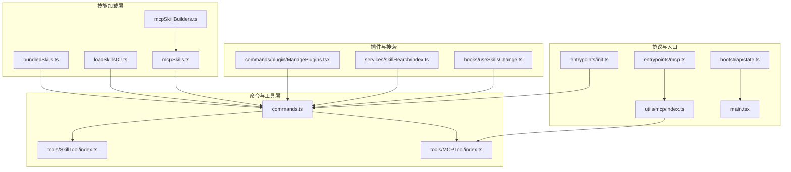
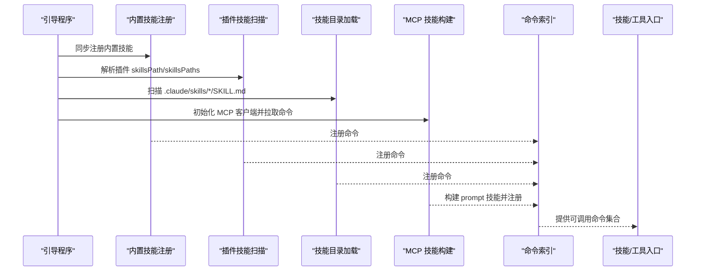
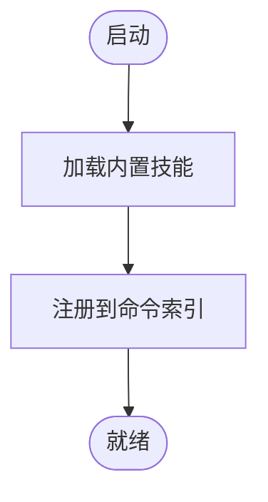
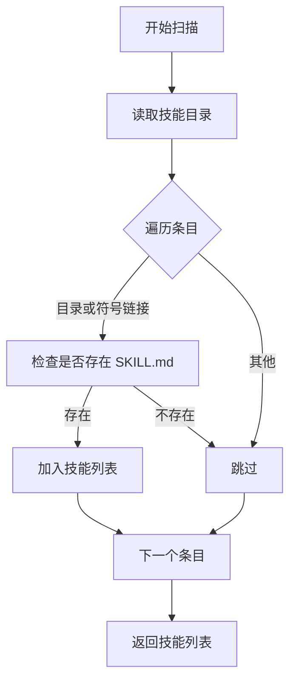
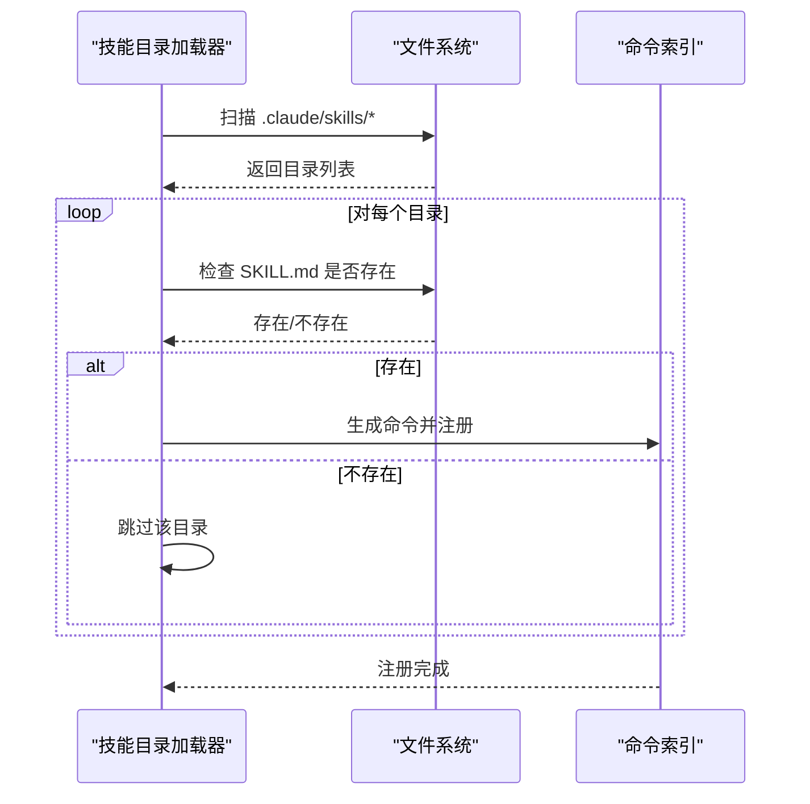
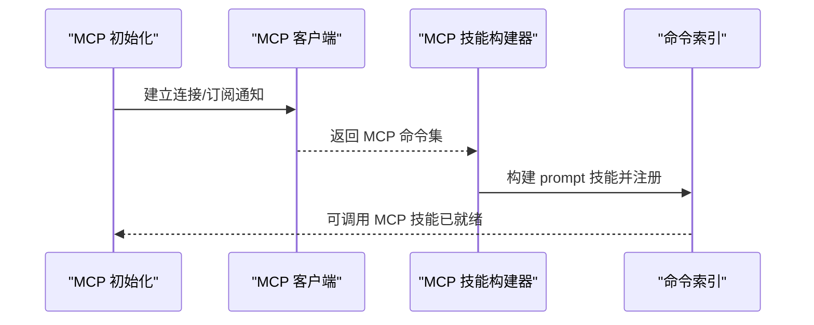
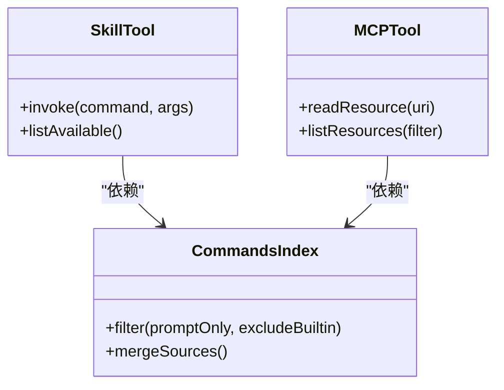
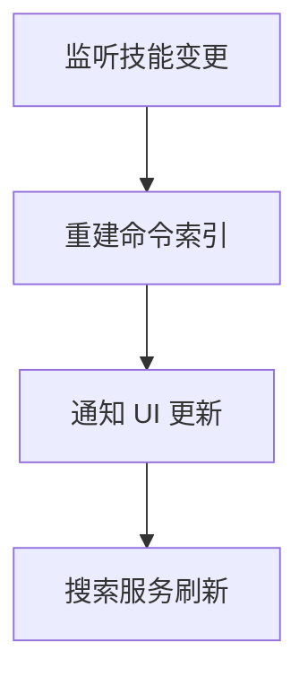
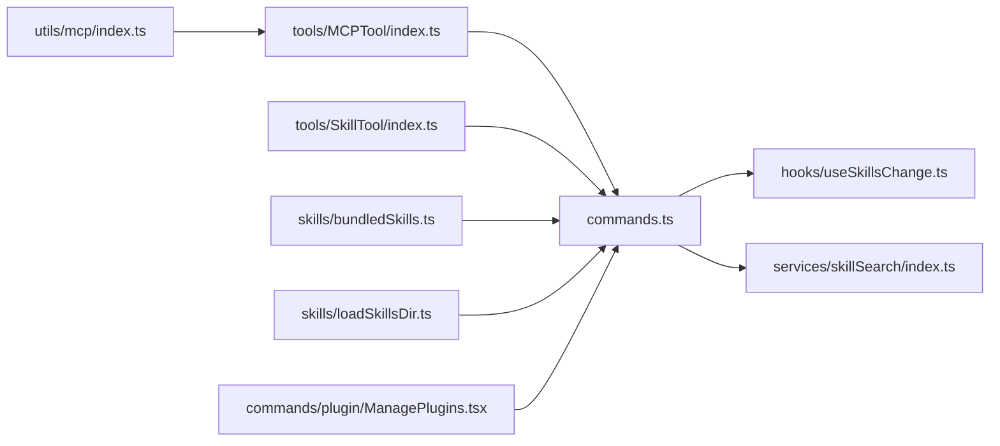

# 技能架构设计

<cite>
**本文引用的文件**
- [src/skills/bundledSkills.ts](file://src/skills/bundledSkills.ts)
- [src/skills/loadSkillsDir.ts](file://src/skills/loadSkillsDir.ts)
- [src/skills/mcpSkillBuilders.ts](file://src/skills/mcpSkillBuilders.ts)
- [src/skills/mcpSkills.ts](file://src/skills/mcpSkills.ts)
- [src/commands.ts](file://src/commands.ts)
- [src/commands/plugin/ManagePlugins.tsx](file://src/commands/plugin/ManagePlugins.tsx)
- [src/tools/SkillTool/index.ts](file://src/tools/SkillTool/index.ts)
- [src/tools/MCPTool/index.ts](file://src/tools/MCPTool/index.ts)
- [src/services/skillSearch/index.ts](file://src/services/skillSearch/index.ts)
- [src/hooks/useSkillsChange.ts](file://src/hooks/useSkillsChange.ts)
- [src/hooks/useMergedCommands.ts](file://src/hooks/useMergedCommands.ts)
- [src/hooks/useMergedTools.ts](file://src/hooks/useMergedTools.ts)
- [src/utils/skills/index.ts](file://src/utils/skills/index.ts)
- [src/utils/mcp/index.ts](file://src/utils/mcp/index.ts)
- [src/constants/tools.ts](file://src/constants/tools.ts)
- [src/constants/system.ts](file://src/constants/system.ts)
- [src/bootstrap/state.ts](file://src/bootstrap/state.ts)
- [src/main.tsx](file://src/main.tsx)
- [src/entrypoints/init.ts](file://src/entrypoints/init.ts)
- [src/entrypoints/mcp.ts](file://src/entrypoints/mcp.ts)
- [docs/04-coordinator.md](file://docs/04-coordinator.md)
</cite>

## 目录
1. [引言](#引言)
2. [项目结构](#项目结构)
3. [核心组件](#核心组件)
4. [架构总览](#架构总览)
5. [详细组件分析](#详细组件分析)
6. [依赖关系分析](#依赖关系分析)
7. [性能考虑](#性能考虑)
8. [故障排查指南](#故障排查指南)
9. [结论](#结论)
10. [附录](#附录)

## 引言
本文件系统性阐述 Claude Code 技能系统的整体架构与实现细节，覆盖技能的分类体系、组织结构、加载与注册流程、与工具系统的集成方式，以及通过 MCP 协议进行扩展的设计与落地。文档还提供技能开发最佳实践、版本管理与依赖处理建议，以及性能优化要点，帮助开发者高效构建与维护高质量技能。

## 项目结构
技能系统围绕“内置技能”“插件技能”“MCP 技能”三大来源展开，并通过统一的命令索引与工具层进行编排。关键目录与文件如下：
- 技能加载与注册：src/skills/*.ts
- 命令聚合与过滤：src/commands.ts
- 插件技能扫描：src/commands/plugin/ManagePlugins.tsx
- 技能工具入口：src/tools/SkillTool/*
- MCP 工具入口：src/tools/MCPTool/*
- 搜索与变更钩子：src/services/skillSearch/*、src/hooks/useSkillsChange.ts
- MCP 协议适配：src/utils/mcp/index.ts
- 常量与系统配置：src/constants/tools.ts、src/constants/system.ts
- 入口与引导：src/entrypoints/init.ts、src/entrypoints/mcp.ts、src/bootstrap/state.ts、src/main.tsx

图表来源
- [src/skills/bundledSkills.ts](file://src/skills/bundledSkills.ts)
- [src/skills/loadSkillsDir.ts](file://src/skills/loadSkillsDir.ts)
- [src/skills/mcpSkillBuilders.ts](file://src/skills/mcpSkillBuilders.ts)
- [src/skills/mcpSkills.ts](file://src/skills/mcpSkills.ts)
- [src/commands.ts](file://src/commands.ts)
- [src/tools/SkillTool/index.ts](file://src/tools/SkillTool/index.ts)
- [src/tools/MCPTool/index.ts](file://src/tools/MCPTool/index.ts)
- [src/commands/plugin/ManagePlugins.tsx](file://src/commands/plugin/ManagePlugins.tsx)
- [src/services/skillSearch/index.ts](file://src/services/skillSearch/index.ts)
- [src/hooks/useSkillsChange.ts](file://src/hooks/useSkillsChange.ts)
- [src/utils/mcp/index.ts](file://src/utils/mcp/index.ts)
- [src/entrypoints/init.ts](file://src/entrypoints/init.ts)
- [src/entrypoints/mcp.ts](file://src/entrypoints/mcp.ts)
- [src/bootstrap/state.ts](file://src/bootstrap/state.ts)
- [src/main.tsx](file://src/main.tsx)

章节来源
- [src/skills/bundledSkills.ts](file://src/skills/bundledSkills.ts)
- [src/skills/loadSkillsDir.ts](file://src/skills/loadSkillsDir.ts)
- [src/skills/mcpSkillBuilders.ts](file://src/skills/mcpSkillBuilders.ts)
- [src/skills/mcpSkills.ts](file://src/skills/mcpSkills.ts)
- [src/commands.ts](file://src/commands.ts)
- [src/commands/plugin/ManagePlugins.tsx](file://src/commands/plugin/ManagePlugins.tsx)
- [src/tools/SkillTool/index.ts](file://src/tools/SkillTool/index.ts)
- [src/tools/MCPTool/index.ts](file://src/tools/MCPTool/index.ts)
- [src/services/skillSearch/index.ts](file://src/services/skillSearch/index.ts)
- [src/hooks/useSkillsChange.ts](file://src/hooks/useSkillsChange.ts)
- [src/utils/mcp/index.ts](file://src/utils/mcp/index.ts)
- [src/entrypoints/init.ts](file://src/entrypoints/init.ts)
- [src/entrypoints/mcp.ts](file://src/entrypoints/mcp.ts)
- [src/bootstrap/state.ts](file://src/bootstrap/state.ts)
- [src/main.tsx](file://src/main.tsx)

## 核心组件
- 内置技能注册：在启动阶段同步注册，确保模型可立即调用。
- 插件技能扫描：从插件声明的 skillsPath/skillsPaths 中发现并列出技能目录。
- 技能目录加载：扫描用户项目下的 .claude/skills/<skill>/SKILL.md，动态生成命令。
- MCP 技能构建：基于 MCP 提供的命令能力，构建 prompt 类型技能并纳入索引。
- 技能工具与 MCP 工具：统一暴露为可被模型调用的 prompt 命令，支持过滤与展示。
- 搜索与变更：提供技能搜索服务与变更钩子，驱动 UI 与索引更新。

章节来源
- [src/skills/bundledSkills.ts](file://src/skills/bundledSkills.ts)
- [src/skills/loadSkillsDir.ts](file://src/skills/loadSkillsDir.ts)
- [src/skills/mcpSkillBuilders.ts](file://src/skills/mcpSkillBuilders.ts)
- [src/skills/mcpSkills.ts](file://src/skills/mcpSkills.ts)
- [src/commands.ts](file://src/commands.ts)
- [src/commands/plugin/ManagePlugins.tsx](file://src/commands/plugin/ManagePlugins.tsx)
- [src/tools/SkillTool/index.ts](file://src/tools/SkillTool/index.ts)
- [src/tools/MCPTool/index.ts](file://src/tools/MCPTool/index.ts)
- [src/services/skillSearch/index.ts](file://src/services/skillSearch/index.ts)
- [src/hooks/useSkillsChange.ts](file://src/hooks/useSkillsChange.ts)

## 架构总览
技能系统采用“多源聚合 + 统一索引 + 工具编排”的分层架构：
- 数据源层：内置技能、插件技能、技能目录、MCP 技能
- 聚合层：commands.ts 负责收集与过滤，形成可被模型调用的命令集合
- 编排层：SkillTool/MCPTool 将命令转化为模型可用的 prompt 调用
- 扩展层：MCP 协议桥接外部服务器，实现跨域能力扩展
- UI 层：搜索与变更钩子驱动界面更新与交互

图表来源
- [src/bootstrap/state.ts](file://src/bootstrap/state.ts)
- [src/skills/bundledSkills.ts](file://src/skills/bundledSkills.ts)
- [src/commands/plugin/ManagePlugins.tsx](file://src/commands/plugin/ManagePlugins.tsx)
- [src/skills/loadSkillsDir.ts](file://src/skills/loadSkillsDir.ts)
- [src/skills/mcpSkills.ts](file://src/skills/mcpSkills.ts)
- [src/commands.ts](file://src/commands.ts)
- [src/tools/SkillTool/index.ts](file://src/tools/SkillTool/index.ts)
- [src/tools/MCPTool/index.ts](file://src/tools/MCPTool/index.ts)

## 详细组件分析

### 内置技能加载与管理
- 注册时机：在应用启动时同步完成，保证命令可用性与一致性。
- 注册内容：包含固定名称、描述、参数等元信息，统一纳入命令索引。
- 版本与依赖：内置技能通常不随外部依赖变化，版本管理以仓库发布为准；如需扩展，建议通过插件化或 MCP 机制引入。

图表来源
- [src/skills/bundledSkills.ts](file://src/skills/bundledSkills.ts)
- [src/bootstrap/state.ts](file://src/bootstrap/state.ts)

章节来源
- [src/skills/bundledSkills.ts](file://src/skills/bundledSkills.ts)
- [src/bootstrap/state.ts](file://src/bootstrap/state.ts)

### 插件技能的发现与注册
- 发现机制：读取插件声明的 skillsPath 或 skillsPaths，遍历目录，仅保留包含 SKILL.md 的目录作为技能。
- 错误处理：对读取失败或权限问题进行降级处理，不影响其他组件加载。
- 结果输出：返回技能目录名列表，供上层命令索引合并。

图表来源
- [src/commands/plugin/ManagePlugins.tsx](file://src/commands/plugin/ManagePlugins.tsx)

章节来源
- [src/commands/plugin/ManagePlugins.tsx](file://src/commands/plugin/ManagePlugins.tsx)

### 技能目录解析与注册
- 目录规范：每个技能位于独立目录，包含 SKILL.md 文件，作为技能定义与描述。
- 加载流程：扫描 .claude/skills 下的所有子目录，识别 SKILL.md，生成命令对象并注册到索引。
- 过滤策略：仅纳入可被模型调用的 prompt 命令，排除禁用项与内置来源。

图表来源
- [src/skills/loadSkillsDir.ts](file://src/skills/loadSkillsDir.ts)
- [src/commands.ts](file://src/commands.ts)

章节来源
- [src/skills/loadSkillsDir.ts](file://src/skills/loadSkillsDir.ts)
- [src/commands.ts](file://src/commands.ts)

### MCP 协议与技能扩展
- 协议适配：通过 utils/mcp/index.ts 建立与 MCP 服务器的连接，订阅通知与请求处理。
- 技能构建：基于 MCP 返回的命令集，构建 prompt 类型技能，标记来源为 mcp，纳入命令索引。
- 过滤与展示：仅展示允许模型调用且非禁用的 MCP 技能，避免污染用户可见列表。

图表来源
- [src/entrypoints/mcp.ts](file://src/entrypoints/mcp.ts)
- [src/utils/mcp/index.ts](file://src/utils/mcp/index.ts)
- [src/skills/mcpSkillBuilders.ts](file://src/skills/mcpSkillBuilders.ts)
- [src/skills/mcpSkills.ts](file://src/skills/mcpSkills.ts)
- [src/commands.ts](file://src/commands.ts)

章节来源
- [src/entrypoints/mcp.ts](file://src/entrypoints/mcp.ts)
- [src/utils/mcp/index.ts](file://src/utils/mcp/index.ts)
- [src/skills/mcpSkillBuilders.ts](file://src/skills/mcpSkillBuilders.ts)
- [src/skills/mcpSkills.ts](file://src/skills/mcpSkills.ts)
- [src/commands.ts](file://src/commands.ts)

### 与工具系统的集成
- 技能工具：将所有可调用的 prompt 命令（含技能与传统命令）统一包装为 SkillTool，供模型选择与调用。
- MCP 工具：封装 MCP 命令为工具，支持远程资源读取、列表查询等能力。
- 常量与系统配置：通过 constants/tools.ts 与 constants/system.ts 统一管理工具行为与限制。

图表来源
- [src/tools/SkillTool/index.ts](file://src/tools/SkillTool/index.ts)
- [src/tools/MCPTool/index.ts](file://src/tools/MCPTool/index.ts)
- [src/commands.ts](file://src/commands.ts)
- [src/constants/tools.ts](file://src/constants/tools.ts)
- [src/constants/system.ts](file://src/constants/system.ts)

章节来源
- [src/tools/SkillTool/index.ts](file://src/tools/SkillTool/index.ts)
- [src/tools/MCPTool/index.ts](file://src/tools/MCPTool/index.ts)
- [src/commands.ts](file://src/commands.ts)
- [src/constants/tools.ts](file://src/constants/tools.ts)
- [src/constants/system.ts](file://src/constants/system.ts)

### 搜索与变更钩子
- 搜索服务：提供技能检索能力，支持关键词匹配与排序，辅助用户快速定位所需技能。
- 变更钩子：useSkillsChange.ts 在技能目录或 MCP 服务器发生变化时触发索引重建与 UI 更新。

图表来源
- [src/hooks/useSkillsChange.ts](file://src/hooks/useSkillsChange.ts)
- [src/services/skillSearch/index.ts](file://src/services/skillSearch/index.ts)
- [src/commands.ts](file://src/commands.ts)

章节来源
- [src/hooks/useSkillsChange.ts](file://src/hooks/useSkillsChange.ts)
- [src/services/skillSearch/index.ts](file://src/services/skillSearch/index.ts)
- [src/commands.ts](file://src/commands.ts)

## 依赖关系分析
- 组件耦合：commands.ts 是核心聚合点，向上游提供统一命令集合；向下游暴露给 SkillTool/MCPTool。
- 外部依赖：MCP 协议依赖 utils/mcp/index.ts；插件技能依赖插件声明的路径；技能目录依赖文件系统。
- 循环依赖：当前设计通过“先加载后注册”的顺序避免循环依赖；MCP 初始化在入口处集中处理。

图表来源
- [src/utils/mcp/index.ts](file://src/utils/mcp/index.ts)
- [src/tools/MCPTool/index.ts](file://src/tools/MCPTool/index.ts)
- [src/tools/SkillTool/index.ts](file://src/tools/SkillTool/index.ts)
- [src/skills/bundledSkills.ts](file://src/skills/bundledSkills.ts)
- [src/skills/loadSkillsDir.ts](file://src/skills/loadSkillsDir.ts)
- [src/commands/plugin/ManagePlugins.tsx](file://src/commands/plugin/ManagePlugins.tsx)
- [src/commands.ts](file://src/commands.ts)
- [src/hooks/useSkillsChange.ts](file://src/hooks/useSkillsChange.ts)
- [src/services/skillSearch/index.ts](file://src/services/skillSearch/index.ts)

章节来源
- [src/utils/mcp/index.ts](file://src/utils/mcp/index.ts)
- [src/tools/MCPTool/index.ts](file://src/tools/MCPTool/index.ts)
- [src/tools/SkillTool/index.ts](file://src/tools/SkillTool/index.ts)
- [src/skills/bundledSkills.ts](file://src/skills/bundledSkills.ts)
- [src/skills/loadSkillsDir.ts](file://src/skills/loadSkillsDir.ts)
- [src/commands/plugin/ManagePlugins.tsx](file://src/commands/plugin/ManagePlugins.tsx)
- [src/commands.ts](file://src/commands.ts)
- [src/hooks/useSkillsChange.ts](file://src/hooks/useSkillsChange.ts)
- [src/services/skillSearch/index.ts](file://src/services/skillSearch/index.ts)

## 性能考虑
- 异步加载：插件技能与 MCP 技能采用异步加载并在 Promise 中捕错，避免阻塞主线程。
- 缓存与去重：命令索引应避免重复注册同一技能；对 MCP 服务器列表进行去重与增量更新。
- I/O 优化：技能目录扫描尽量批量处理，减少 stat 次数；对不可访问目录进行短路跳过。
- 过滤前置：在进入工具层前完成过滤，缩小后续处理的数据规模。
- 并发控制：MCP 服务器初始化与命令注册可并发进行，但需注意资源上限与速率限制。

## 故障排查指南
- 技能未显示
  - 检查 SKILL.md 是否存在于技能目录根下
  - 确认命令类型为 prompt 且未禁用模型调用
  - 查看插件声明的 skillsPath/skillsPaths 是否正确
- MCP 技能不可用
  - 确认 MCP 服务器已连接并返回有效命令
  - 检查 disableModelInvocation 与 loadedFrom 标记
- 插件技能扫描失败
  - 查看目录权限与文件系统异常日志
  - 确保插件清单中 skillsPath/skillsPaths 正确
- UI 不更新
  - 触发 useSkillsChange 钩子或重新加载命令索引
  - 检查搜索服务是否刷新成功

章节来源
- [src/commands.ts](file://src/commands.ts)
- [src/commands/plugin/ManagePlugins.tsx](file://src/commands/plugin/ManagePlugins.tsx)
- [src/hooks/useSkillsChange.ts](file://src/hooks/useSkillsChange.ts)
- [src/services/skillSearch/index.ts](file://src/services/skillSearch/index.ts)

## 结论
Claude Code 的技能系统通过“内置 + 插件 + 目录 + MCP”多源聚合，结合命令索引与工具层编排，实现了灵活、可扩展且易于维护的技能生态。MCP 协议为外部能力接入提供了标准化接口，配合搜索与变更钩子，进一步提升了用户体验与开发效率。遵循本文的最佳实践与约束，可确保技能在功能完整性、性能与可维护性之间取得平衡。

## 附录

### 技能分类与组织
- 分类维度
  - 来源：内置、插件、目录、MCP
  - 类型：prompt（可被模型调用）、其他（如工具/脚本）
  - 状态：启用/禁用、可被模型调用/不可调用
- 组织结构
  - 目录：.claude/skills/<skill>/SKILL.md
  - 插件：skillsPath/skillsPaths 声明
  - MCP：服务器命令集动态构建

章节来源
- [src/skills/loadSkillsDir.ts](file://src/skills/loadSkillsDir.ts)
- [src/commands/plugin/ManagePlugins.tsx](file://src/commands/plugin/ManagePlugins.tsx)
- [src/skills/mcpSkills.ts](file://src/skills/mcpSkills.ts)

### 技能开发最佳实践
- 模板与配置
  - 使用 SKILL.md 定义技能名称、目的、参数与示例
  - 明确命令类型与是否允许模型调用
  - 为插件技能提供 skillsPath/skillsPaths 清单
- 测试方法
  - 单元测试：验证命令生成与过滤逻辑
  - 集成测试：模拟 MCP 服务器与文件系统场景
  - 用户验收：在真实项目中验证技能效果
- 版本管理与依赖
  - 内置技能：随仓库发布版本管理
  - 插件技能：通过插件版本与清单管理
  - MCP 技能：通过服务器版本与能力声明管理
- 性能优化
  - 异步加载与错误隔离
  - 增量更新与缓存命中
  - I/O 批量化与短路跳过

章节来源
- [src/skills/loadSkillsDir.ts](file://src/skills/loadSkillsDir.ts)
- [src/commands/plugin/ManagePlugins.tsx](file://src/commands/plugin/ManagePlugins.tsx)
- [src/skills/mcpSkills.ts](file://src/skills/mcpSkills.ts)
- [src/commands.ts](file://src/commands.ts)