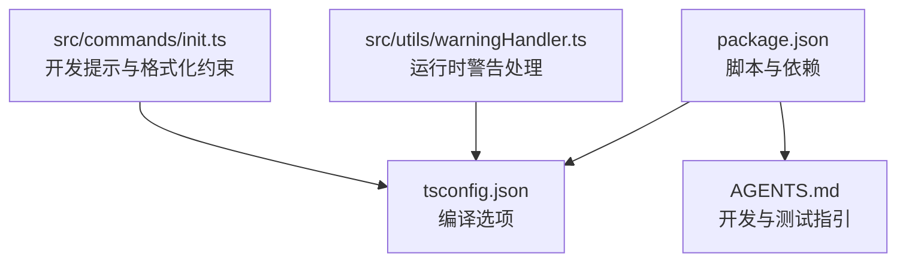
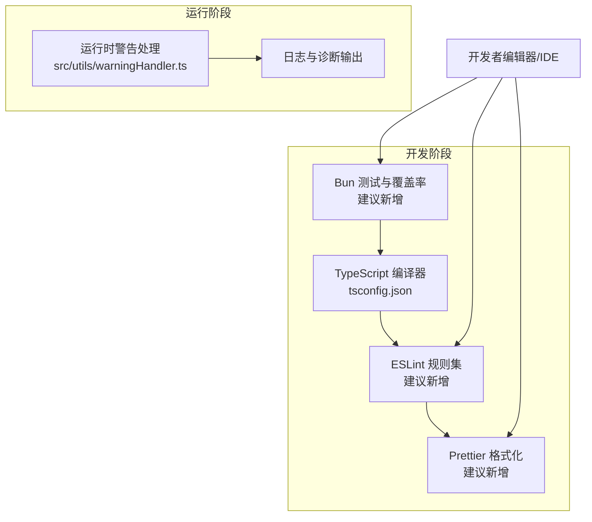
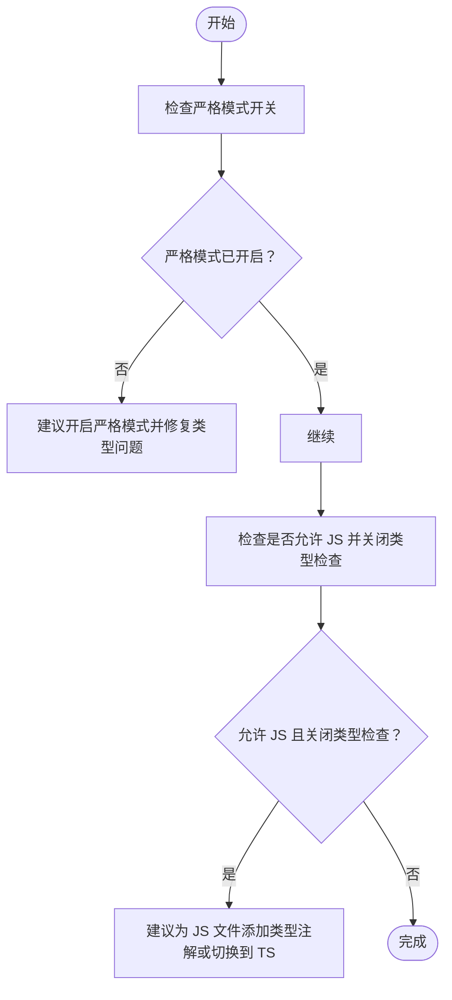
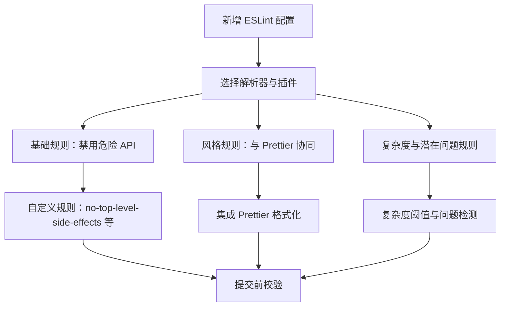

# 代码质量工具

<cite>
**本文引用的文件**
- [package.json](file://package.json)
- [tsconfig.json](file://tsconfig.json)
- [AGENTS.md](file://AGENTS.md)
- [src/utils/warningHandler.ts](file://src/utils/warningHandler.ts)
- [src/commands/init.ts](file://src/commands/init.ts)
</cite>

## 目录
1. [简介](#简介)
2. [项目结构](#项目结构)
3. [核心组件](#核心组件)
4. [架构总览](#架构总览)
5. [详细组件分析](#详细组件分析)
6. [依赖关系分析](#依赖关系分析)
7. [性能考量](#性能考量)
8. [故障排查指南](#故障排查指南)
9. [结论](#结论)
10. [附录](#附录)

## 简介
本文件系统性梳理 Claude Code 项目的代码质量工具链，覆盖以下方面：
- ESLint 配置与规则（含自定义规则与代码风格）
- TypeScript 类型检查配置与使用（严格模式与类型推导优化）
- 代码覆盖率工具配置与报告生成
- 静态代码分析（复杂度与潜在问题检测）
- 代码格式化工具配置与自动化格式化流程
- 代码审查清单与质量门禁建议

说明：当前仓库未发现集中式的 ESLint、Prettier 或测试/覆盖率脚本；本文在无证据不臆测的前提下，基于现有配置与实践给出可落地的实施建议与最佳实践。

## 项目结构
围绕代码质量的关键文件与位置如下：
- 根级包管理与脚本：package.json
- TypeScript 编译配置：tsconfig.json
- 开发与测试指引：AGENTS.md
- 运行时警告处理与调试：src/utils/warningHandler.ts
- 开发提示与格式化约束：src/commands/init.ts

**图表来源**
- [package.json:1-102](file://package.json#L1-L102)
- [tsconfig.json:1-30](file://tsconfig.json#L1-L30)
- [AGENTS.md:1-25](file://AGENTS.md#L1-L25)
- [src/utils/warningHandler.ts:1-75](file://src/utils/warningHandler.ts#L1-L75)
- [src/commands/init.ts:110-131](file://src/commands/init.ts#L110-L131)

**章节来源**
- [package.json:1-102](file://package.json#L1-L102)
- [tsconfig.json:1-30](file://tsconfig.json#L1-L30)
- [AGENTS.md:1-25](file://AGENTS.md#L1-L25)
- [src/utils/warningHandler.ts:1-75](file://src/utils/warningHandler.ts#L1-L75)
- [src/commands/init.ts:110-131](file://src/commands/init.ts#L110-L131)

## 核心组件
- TypeScript 类型检查与编译
  - 当前启用：允许 JavaScript、关闭 JS 类型检查、启用 JSX、严格模式关闭
  - 建议：逐步开启严格模式并完善类型注解，以提升类型安全与推导质量
- ESLint 与 Prettier
  - 当前仓库未发现集中式配置或脚本；可在本地或 CI 中补充
- 覆盖率与测试
  - 根级未暴露 lint/test 脚本；建议引入 Bun 测试与覆盖率工具
- 静态分析与复杂度
  - 可通过 ESLint 插件与自定义规则实现复杂度阈值与潜在问题检测
- 格式化与自动化
  - 可结合 Prettier 与编辑器钩子实现保存即格式化

**章节来源**
- [tsconfig.json:1-30](file://tsconfig.json#L1-L30)
- [AGENTS.md:13-25](file://AGENTS.md#L13-L25)

## 架构总览
下图展示代码质量工具在项目中的角色与交互：

**图表来源**
- [tsconfig.json:1-30](file://tsconfig.json#L1-L30)
- [src/utils/warningHandler.ts:1-75](file://src/utils/warningHandler.ts#L1-L75)

## 详细组件分析

### TypeScript 类型检查配置与使用
- 当前配置要点
  - 目标与模块：ESNext
  - 模块解析：bundler
  - 允许 JavaScript：是；对 JS 执行类型检查：否
  - JSX：react-jsx
  - 严格模式：关闭
  - 路径别名：src/*
  - 类型声明：bun
- 影响与建议
  - 严格模式关闭可能降低类型安全；建议逐步开启并完善类型注解
  - 允许 JS 但关闭类型检查会放大潜在错误；建议配合 ESLint 规则弥补
  - JSX 启用需确保 React 类型正确安装

**图表来源**
- [tsconfig.json:1-30](file://tsconfig.json#L1-L30)

**章节来源**
- [tsconfig.json:1-30](file://tsconfig.json#L1-L30)

### ESLint 配置与规则设置
- 现状
  - 根级未发现集中式 ESLint 配置与脚本
  - 存在第三方依赖中包含 ESLint 与相关插件的记录
- 建议
  - 新增配置文件（如 .eslintrc 或 eslint.config.mjs），统一规则与扩展
  - 推荐启用：
    - @typescript-eslint/eslint-plugin 与 @typescript-eslint/parser
    - eslint-config-prettier 与 eslint-plugin-prettier（与 Prettier 协同）
    - 自定义规则：例如 no-top-level-side-effects、no-sync-fs（参考仓库内注释示例）
  - 规则优先级：基础规则（禁用危险 API）、风格规则（与 Prettier 协同）、复杂度与潜在问题规则

**图表来源**
- [package.json:33-99](file://package.json#L33-L99)

**章节来源**
- [package.json:33-99](file://package.json#L33-L99)

### 代码覆盖率工具配置与报告生成
- 现状
  - 根级未暴露 lint/test 脚本；未见覆盖率配置
- 建议
  - 使用 Bun 测试作为执行器，结合覆盖率收集（如 Istanbul 或 Bun 内置覆盖率）
  - 在 CI 中生成报告并设置阈值门禁（语句、分支、函数、行）
  - 将覆盖率纳入 PR 审查清单

**章节来源**
- [AGENTS.md:13-25](file://AGENTS.md#L13-L25)

### 静态代码分析（复杂度与潜在问题）
- 建议
  - 复杂度：通过 ESLint 规则限制函数圈复杂度与嵌套层级
  - 潜在问题：禁用 eval、with、console 等；启用 no-implicit-*、no-unsafe-* 等规则
  - 自定义规则：结合业务场景增加 no-top-level-side-effects、no-sync-fs 等

**章节来源**
- [src/commands/init.ts:110-131](file://src/commands/init.ts#L110-L131)

### 代码格式化工具配置与自动化流程
- 现状
  - 未发现集中式 Prettier 配置
- 建议
  - 新增 Prettier 配置，与 ESLint 的 prettier 规则协同
  - 在编辑器中启用保存即格式化
  - 通过 Husky/Git Hooks 在提交前自动格式化

**章节来源**
- [src/commands/init.ts:110-131](file://src/commands/init.ts#L110-L131)

### 代码审查清单与质量门禁
- 审查清单（建议）
  - 通过 ESLint 与 TypeScript 类型检查
  - 通过单元/集成测试（Bun 测试）
  - 覆盖率达标（语句/分支/函数/行）
  - 无高危复杂度函数
  - 无 console、eval、with 等危险用法
  - 无未处理的警告（运行时）
- 质量门禁（建议）
  - CI 中强制执行上述检查
  - PR 必须通过所有门禁才可合并

**章节来源**
- [AGENTS.md:13-25](file://AGENTS.md#L13-L25)
- [src/utils/warningHandler.ts:1-75](file://src/utils/warningHandler.ts#L1-L75)

## 依赖关系分析
- TypeScript 与 ESLint/Prettier 的耦合度
  - ESLint 需要 @typescript-eslint/parser 解析 TS/TSX
  - Prettier 与 ESLint 的冲突通过 eslint-config-prettier 解决
- 运行时警告处理
  - 通过 src/utils/warningHandler.ts 统一处理 Node.js 警告，避免干扰用户

**图表来源**
- [tsconfig.json:1-30](file://tsconfig.json#L1-L30)
- [src/utils/warningHandler.ts:1-75](file://src/utils/warningHandler.ts#L1-L75)

**章节来源**
- [tsconfig.json:1-30](file://tsconfig.json#L1-L30)
- [src/utils/warningHandler.ts:1-75](file://src/utils/warningHandler.ts#L1-L75)

## 性能考量
- 类型检查成本
  - 严格模式与更严格的类型规则会增加编译时间；建议分模块增量检查或缓存
- ESLint 性能
  - 启用缓存与忽略大型依赖目录；按需启用复杂度规则
- 覆盖率与测试
  - 使用并行测试与最小化测试集；仅对变更模块进行覆盖率检查

## 故障排查指南
- 运行时警告过多
  - 检查 src/utils/warningHandler.ts 的初始化逻辑，确认是否移除了默认警告处理器
  - 对于内部开发构建，保留必要的警告以便调试
- ESLint 报错与 Prettier 冲突
  - 确保 eslint-config-prettier 已启用，且 Prettier 作为最后格式化步骤
- TypeScript 类型错误
  - 逐步开启严格模式，优先修复关键类型问题；为 JS 文件补充类型注解

**章节来源**
- [src/utils/warningHandler.ts:1-75](file://src/utils/warningHandler.ts#L1-L75)
- [tsconfig.json:1-30](file://tsconfig.json#L1-L30)

## 结论
- 当前仓库缺少集中式的 ESLint、Prettier 与测试/覆盖率配置
- 建议从“规则统一、格式化协同、测试与覆盖率、运行时警告治理”四方面入手，建立完整的质量工具链
- 逐步将质量门禁纳入 CI，确保每次变更均满足既定标准

## 附录
- 开发与测试指引参考：AGENTS.md
- 包管理与脚本参考：package.json
- TypeScript 编译配置参考：tsconfig.json
- 运行时警告处理参考：src/utils/warningHandler.ts
- 开发提示与格式化约束参考：src/commands/init.ts