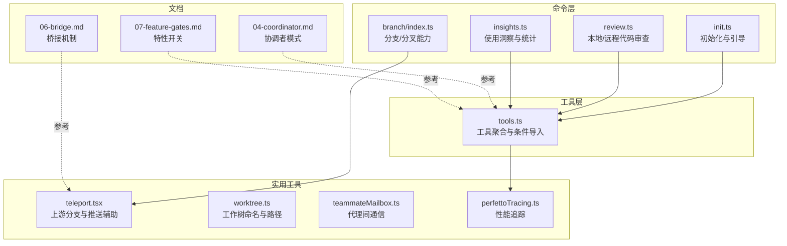
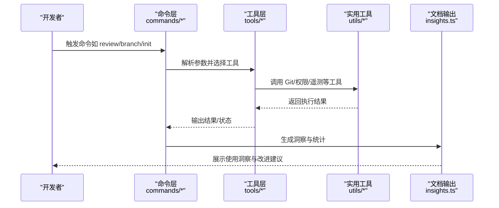
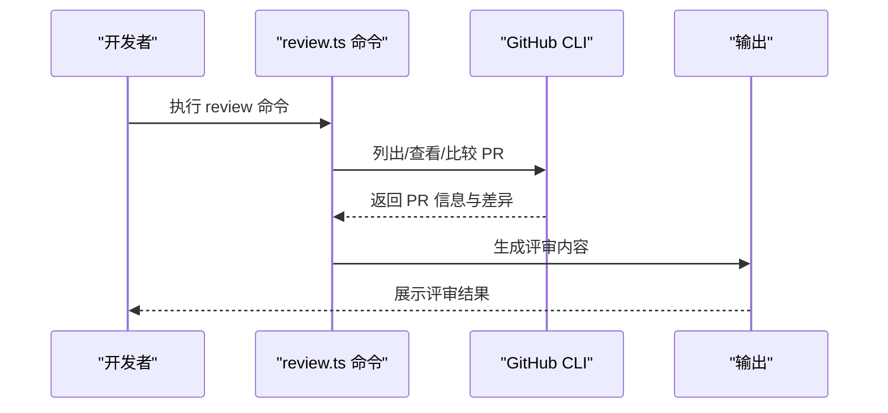
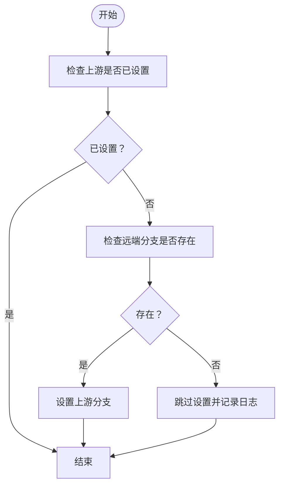
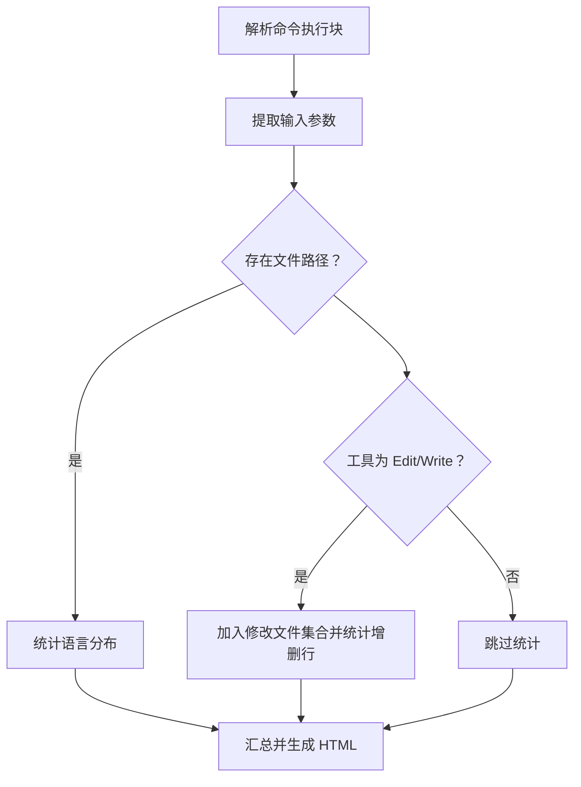
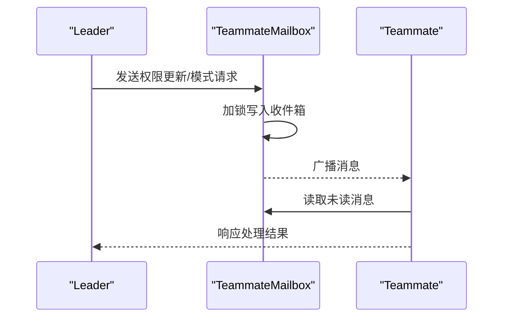
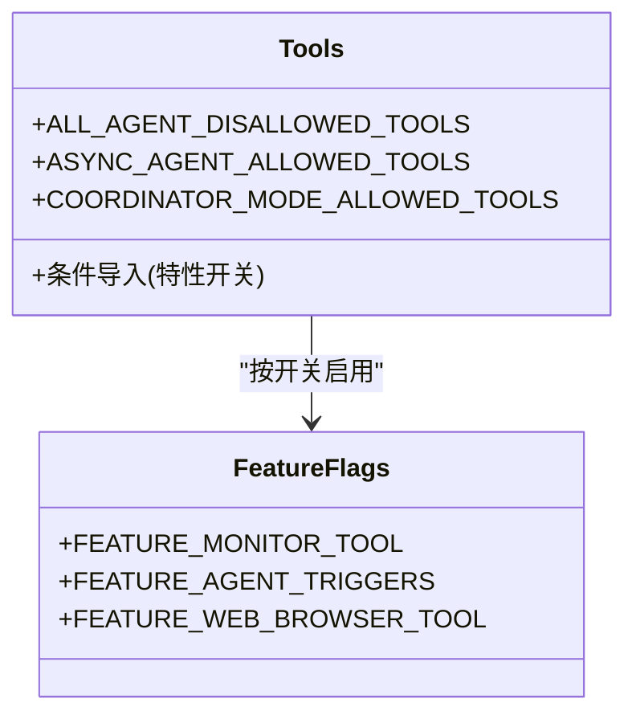
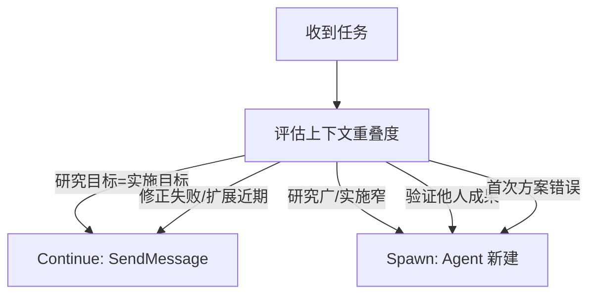
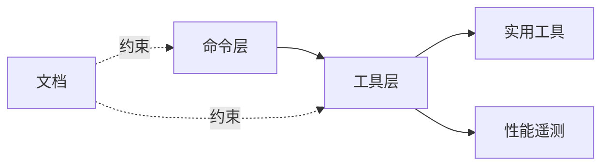

# 开发流程与最佳实践

<cite>
**本文引用的文件**
- [package.json](file://package.json)
- [tsconfig.json](file://tsconfig.json)
- [src/commands/init.ts](file://src/commands/init.ts)
- [src/commands/review.ts](file://src/commands/review.ts)
- [src/commands/branch/index.ts](file://src/commands/branch/index.ts)
- [src/utils/teleport.tsx](file://src/utils/teleport.tsx)
- [src/utils/worktree.ts](file://src/utils/worktree.ts)
- [src/utils/teammateMailbox.ts](file://src/utils/teammateMailbox.ts)
- [src/tools.ts](file://src/tools.ts)
- [src/commands/insights.ts](file://src/commands/insights.ts)
- [src/utils/telemetry/perfettoTracing.ts](file://src/utils/telemetry/perfettoTracing.ts)
- [docs/04-coordinator.md](file://docs/04-coordinator.md)
- [docs/06-bridge.md](file://docs/06-bridge.md)
- [docs/07-feature-gates.md](file://docs/07-feature-gates.md)
- [AGENTS.md](file://AGENTS.md)
</cite>

## 目录
1. [引言](#引言)
2. [项目结构](#项目结构)
3. [核心组件](#核心组件)
4. [架构总览](#架构总览)
5. [详细组件分析](#详细组件分析)
6. [依赖关系分析](#依赖关系分析)
7. [性能考量](#性能考量)
8. [故障排查指南](#故障排查指南)
9. [结论](#结论)
10. [附录](#附录)

## 引言
本文件面向 Claude Code 团队与协作开发者，系统化梳理从代码编写到部署发布的完整开发流程，明确代码审查标准、版本控制最佳实践、持续集成与持续部署（CI/CD）自动化流程、团队协作与沟通规范，并提供提升开发效率的技巧与工具建议。内容基于仓库中的命令实现、工具模块、文档与遥测代码进行归纳总结，帮助新成员快速上手并保持高质量交付节奏。

## 项目结构
该项目采用以功能域与职责分层相结合的组织方式：
- 命令层（commands）：封装 CLI 与交互式命令，如初始化、分支、审查、洞察等，统一对外暴露能力入口。
- 工具层（tools）：抽象可复用的原子能力（如 Bash、文件读写、搜索、终端捕获等），支持按需加载与特性开关。
- 服务与桥接（bridge/server/services）：负责与外部系统（如 GitHub、桌面端、远程会话）交互。
- 组件与 UI（components/）：前端组件与交互逻辑。
- 实用工具（utils/）：通用工具函数，覆盖 Git、权限、遥测、工作树、邮箱通信等。
- 文档（docs/）：产品与模式文档，如协调者模式、桥接机制、特性开关等。

图表来源
- [src/commands/init.ts:48-131](file://src/commands/init.ts#L48-L131)
- [src/commands/review.ts:1-57](file://src/commands/review.ts#L1-L57)
- [src/commands/branch/index.ts:1-14](file://src/commands/branch/index.ts#L1-L14)
- [src/utils/teleport.tsx:211-246](file://src/utils/teleport.tsx#L211-L246)
- [src/utils/worktree.ts:204-227](file://src/utils/worktree.ts#L204-L227)
- [src/utils/teammateMailbox.ts:110-125](file://src/utils/teammateMailbox.ts#L110-L125)
- [src/tools.ts:24-120](file://src/tools.ts#L24-L120)
- [src/commands/insights.ts:552-582](file://src/commands/insights.ts#L552-L582)
- [src/utils/telemetry/perfettoTracing.ts:696-763](file://src/utils/telemetry/perfettoTracing.ts#L696-L763)
- [docs/04-coordinator.md:58-110](file://docs/04-coordinator.md#L58-L110)
- [docs/06-bridge.md](file://docs/06-bridge.md)
- [docs/07-feature-gates.md](file://docs/07-feature-gates.md)

章节来源
- [package.json](file://package.json)
- [tsconfig.json](file://tsconfig.json)

## 核心组件
- 初始化与引导：通过初始化命令收集项目信息，生成或优化 CLAUDE.md 与技能配置，确保 AI 协作者对项目有准确认知。
- 代码审查：提供本地审查与远程“UltraReview”两种路径，前者纯本地，后者通过网页端运行并具备更强验证能力。
- 分支与工作树：支持在当前对话点创建分支；工作树命名扁平化避免冲突，便于隔离实验性变更。
- 洞察与统计：统计语言分布、修改文件数、增删行数等，用于复盘与反馈闭环。
- 性能遥测：以 Perfetto 形式记录工具执行跨度，便于定位瓶颈与评估效果。
- 代理间通信：通过“邮箱”机制在团队成员之间传递消息与权限更新，保障一致性与安全性。
- 特性开关：通过特性门控控制功能启用，保证演进可控与灰度发布。

章节来源
- [src/commands/init.ts:48-131](file://src/commands/init.ts#L48-L131)
- [src/commands/review.ts:1-57](file://src/commands/review.ts#L1-L57)
- [src/commands/branch/index.ts:1-14](file://src/commands/branch/index.ts#L1-L14)
- [src/utils/worktree.ts:204-227](file://src/utils/worktree.ts#L204-L227)
- [src/commands/insights.ts:552-582](file://src/commands/insights.ts#L552-L582)
- [src/utils/telemetry/perfettoTracing.ts:696-763](file://src/utils/telemetry/perfettoTracing.ts#L696-L763)
- [src/utils/teammateMailbox.ts:110-125](file://src/utils/teammateMailbox.ts#L110-L125)
- [docs/07-feature-gates.md](file://docs/07-feature-gates.md)

## 架构总览
下图展示了从命令触发到工具执行、再到遥测与文档产出的关键流转：

图表来源
- [src/commands/review.ts:33-57](file://src/commands/review.ts#L33-L57)
- [src/commands/branch/index.ts:4-12](file://src/commands/branch/index.ts#L4-L12)
- [src/commands/init.ts:48-131](file://src/commands/init.ts#L48-L131)
- [src/tools.ts:24-120](file://src/tools.ts#L24-L120)
- [src/utils/teleport.tsx:211-246](file://src/utils/teleport.tsx#L211-L246)
- [src/commands/insights.ts:552-582](file://src/commands/insights.ts#L552-L582)

## 详细组件分析

### 代码审查流程（本地与远程）
- 本地审查：通过 review 命令调用本地逻辑，结合 GitHub CLI 获取 PR 列表、详情与差异，形成评审意见。
- 远程 UltraReview：在网页端运行，具备更严格的验证能力，适合高风险变更的深度校验。
- 审查命令定义与启用条件：命令对象包含名称、描述、进度提示、是否启用等元数据，支持按特性开关控制。

图表来源
- [src/commands/review.ts:9-57](file://src/commands/review.ts#L9-L57)

章节来源
- [src/commands/review.ts:1-57](file://src/commands/review.ts#L1-L57)

### 分支与工作树（Git 辅助）
- 分支命令：在当前对话点创建分支，支持别名与特性开关控制。
- 上游设置：自动检测并设置上游分支，若远端存在则绑定，否则跳过，避免阻塞主流程。
- 工作树命名：将嵌套斜杠转换为安全字符，避免 Git 与文件系统冲突；工作树目录位于 .claude/worktrees 下。

图表来源
- [src/utils/teleport.tsx:211-246](file://src/utils/teleport.tsx#L211-L246)

章节来源
- [src/commands/branch/index.ts:1-14](file://src/commands/branch/index.ts#L1-L14)
- [src/utils/teleport.tsx:211-246](file://src/utils/teleport.tsx#L211-L246)
- [src/utils/worktree.ts:204-227](file://src/utils/worktree.ts#L204-L227)

### 使用洞察与统计（Insights）
- 统计维度：按语言统计文件数量、跟踪被编辑/写入的文件集合、计算增删行数。
- 输出格式：HTML 结构化展示，支持折叠与证据链展示，便于团队内反馈与改进。

图表来源
- [src/commands/insights.ts:552-582](file://src/commands/insights.ts#L552-L582)

章节来源
- [src/commands/insights.ts:552-582](file://src/commands/insights.ts#L552-L582)

### 代理间通信（Teammate Mailbox）
- 未读消息读取：过滤未读消息，便于及时响应。
- 写入与加锁：通过文件锁避免并发写入冲突。
- 权限更新广播：支持团队权限更新与模式切换请求的消息化传播。

图表来源
- [src/utils/teammateMailbox.ts:110-125](file://src/utils/teammateMailbox.ts#L110-L125)
- [src/utils/teammateMailbox.ts:983-1013](file://src/utils/teammateMailbox.ts#L983-L1013)

章节来源
- [src/utils/teammateMailbox.ts:110-125](file://src/utils/teammateMailbox.ts#L110-L125)
- [src/utils/teammateMailbox.ts:983-1013](file://src/utils/teammateMailbox.ts#L983-L1013)

### 工具聚合与特性开关
- 工具聚合：集中导出各类工具，支持按特性开关与环境变量条件加载，减少冷启动开销并避免循环依赖。
- 特性门控：通过特性开关控制高级工具（如监控、远程触发、浏览器工具等）的可用性，便于灰度与回滚。

图表来源
- [src/tools.ts:24-120](file://src/tools.ts#L24-L120)
- [docs/07-feature-gates.md](file://docs/07-feature-gates.md)

章节来源
- [src/tools.ts:24-120](file://src/tools.ts#L24-L120)
- [docs/07-feature-gates.md](file://docs/07-feature-gates.md)

### 协调者模式与并发管理
- 通信协议：Worker 执行结果以 XML 注入对话流，包含任务 ID、状态、摘要、结果与用量。
- 并发策略：只读任务自由并行；写操作同一组文件串行；验证任务可与不同文件区域并行。
- 决策规则：根据上下文重叠度决定继续现有 Worker 或新建 Worker，避免甩锅式委派，要求 Prompt 具备具体路径、行号与完成标准。

图表来源
- [docs/04-coordinator.md:58-110](file://docs/04-coordinator.md#L58-L110)

章节来源
- [docs/04-coordinator.md:58-110](file://docs/04-coordinator.md#L58-L110)

## 依赖关系分析
- 命令到工具：命令层通过工具层实现具体能力，工具层再依赖实用工具与遥测模块。
- 特性开关：工具与功能启用受特性开关与环境变量控制，降低耦合度并提升可维护性。
- 文档与实践：文档（如协调者模式、桥接机制、特性开关）为命令与工具设计提供约束与参考。

图表来源
- [src/commands/review.ts:33-57](file://src/commands/review.ts#L33-L57)
- [src/tools.ts:24-120](file://src/tools.ts#L24-L120)
- [src/utils/telemetry/perfettoTracing.ts:696-763](file://src/utils/telemetry/perfettoTracing.ts#L696-L763)
- [docs/04-coordinator.md:58-110](file://docs/04-coordinator.md#L58-L110)
- [docs/06-bridge.md](file://docs/06-bridge.md)
- [docs/07-feature-gates.md](file://docs/07-feature-gates.md)

章节来源
- [src/commands/review.ts:33-57](file://src/commands/review.ts#L33-L57)
- [src/tools.ts:24-120](file://src/tools.ts#L24-L120)
- [src/utils/telemetry/perfettoTracing.ts:696-763](file://src/utils/telemetry/perfettoTracing.ts#L696-L763)
- [docs/04-coordinator.md:58-110](file://docs/04-coordinator.md#L58-L110)
- [docs/06-bridge.md](file://docs/06-bridge.md)
- [docs/07-feature-gates.md](file://docs/07-feature-gates.md)

## 性能考量
- 工具执行跨度：通过 Perfetto 记录工具开始/结束时间、成功状态、错误信息与结果 token 数，便于定位耗时环节。
- 条件导入：按特性开关延迟加载工具，减少首屏与冷启动成本。
- 并发与串行：遵循只读并行、写操作串行的原则，避免资源竞争导致的性能退化。

章节来源
- [src/utils/telemetry/perfettoTracing.ts:696-763](file://src/utils/telemetry/perfettoTracing.ts#L696-L763)
- [src/tools.ts:24-120](file://src/tools.ts#L24-L120)
- [docs/04-coordinator.md:74-81](file://docs/04-coordinator.md#L74-L81)

## 故障排查指南
- 审查命令异常：确认本地审查前置条件（如 GitHub CLI 可用性）与远程审查的启用状态。
- 分支上游问题：若上游未设置导致推送失败，优先检查远端分支是否存在并尝试自动设置。
- 工作树冲突：当出现 D/F 冲突或子工作树被误删，检查命名扁平化规则与目录层级。
- 代理间通信：若消息未送达或重复，检查收件箱锁文件与未读消息过滤逻辑。
- 性能异常：通过 Perfetto 事件定位耗时工具与错误原因，结合日志与指标进行根因分析。

章节来源
- [src/commands/review.ts:33-57](file://src/commands/review.ts#L33-L57)
- [src/utils/teleport.tsx:211-246](file://src/utils/teleport.tsx#L211-L246)
- [src/utils/worktree.ts:204-227](file://src/utils/worktree.ts#L204-L227)
- [src/utils/teammateMailbox.ts:110-125](file://src/utils/teammateMailbox.ts#L110-L125)
- [src/utils/telemetry/perfettoTracing.ts:696-763](file://src/utils/telemetry/perfettoTracing.ts#L696-L763)

## 结论
本文件基于仓库实际实现与文档，构建了从命令到工具、从 Git 辅助到遥测与文档产出的完整开发流程视图。建议团队在日常工作中坚持：以命令为入口、以工具为基石、以特性开关为边界、以文档为约束、以遥测为依据，持续迭代质量与效率。

## 附录

### 版本控制最佳实践（基于仓库能力）
- 分支策略：在当前对话点创建分支进行实验，使用扁平化命名避免冲突；默认分支作为主干，特性分支用于隔离变更。
- 提交消息：建议包含变更类型、影响范围与简要说明，配合审查命令与洞察统计形成可追溯的变更轨迹。
- 合并流程：优先使用审查命令进行同行评审，确保变更符合项目约定与质量标准后再合并。

章节来源
- [src/commands/branch/index.ts:1-14](file://src/commands/branch/index.ts#L1-L14)
- [src/utils/worktree.ts:204-227](file://src/utils/worktree.ts#L204-L227)
- [src/commands/review.ts:33-57](file://src/commands/review.ts#L33-L57)
- [src/commands/insights.ts:552-582](file://src/commands/insights.ts#L552-L582)

### 代码审查标准流程与检查清单
- 标准流程：列出/查看/比较 PR → 生成评审内容 → 输出评审结果。
- 检查清单：正确性、风格与约定、性能影响、测试覆盖、安全考虑、可维护性与可读性。

章节来源
- [src/commands/review.ts:9-57](file://src/commands/review.ts#L9-L57)

### 持续集成与持续部署（CI/CD）建议
- 建议在 CI 中集成：安装依赖、类型检查、单元/集成测试、覆盖率统计、静态分析与打包产物校验。
- 部署策略：采用特性开关与灰度发布，结合性能遥测与使用洞察评估变更影响，逐步扩大发布范围。

章节来源
- [src/utils/telemetry/perfettoTracing.ts:696-763](file://src/utils/telemetry/perfettoTracing.ts#L696-L763)
- [docs/07-feature-gates.md](file://docs/07-feature-gates.md)

### 团队协作与沟通规范
- 代理间通信：通过邮箱机制传递权限更新与模式请求，确保一致性与可审计性。
- 文档驱动：以文档约束命令与工具行为，减少歧义与返工。

章节来源
- [src/utils/teammateMailbox.ts:110-125](file://src/utils/teammateMailbox.ts#L110-L125)
- [docs/04-coordinator.md:58-110](file://docs/04-coordinator.md#L58-L110)
- [docs/06-bridge.md](file://docs/06-bridge.md)

### 开发效率提升技巧与工具推荐
- 使用初始化命令快速建立 AI 协作者对项目的理解，减少上下文切换成本。
- 借助洞察统计与性能遥测，聚焦高价值改进点。
- 通过特性开关与条件导入，按需启用高级能力，缩短开发周期。

章节来源
- [src/commands/init.ts:48-131](file://src/commands/init.ts#L48-L131)
- [src/commands/insights.ts:552-582](file://src/commands/insights.ts#L552-L582)
- [src/tools.ts:24-120](file://src/tools.ts#L24-L120)
- [src/utils/telemetry/perfettoTracing.ts:696-763](file://src/utils/telemetry/perfettoTracing.ts#L696-L763)