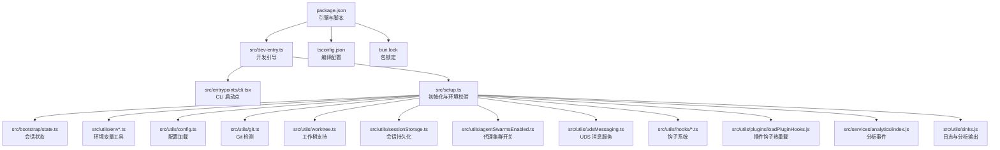
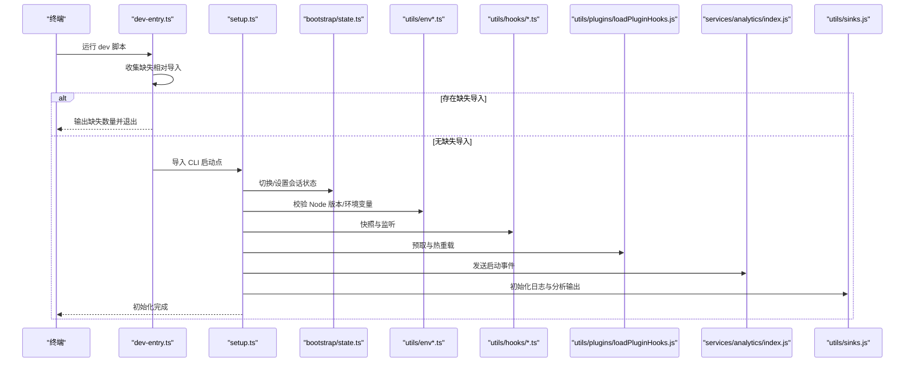
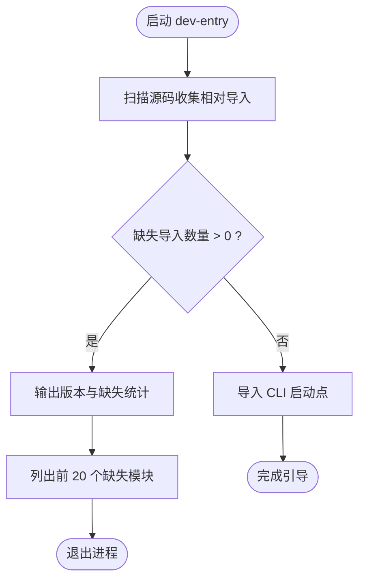
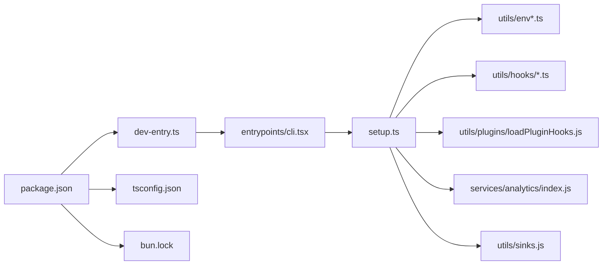

# 开发环境配置

<cite>
**本文档引用的文件**
- [package.json](file://package.json)
- [tsconfig.json](file://tsconfig.json)
- [bun.lock](file://bun.lock)
- [src/dev-entry.ts](file://src/dev-entry.ts)
- [src/setup.ts](file://src/setup.ts)
- [src/entrypoints/cli.tsx](file://src/entrypoints/cli.tsx)
- [src/bootstrap/state.ts](file://src/bootstrap/state.ts)
- [src/utils/env.ts](file://src/utils/env.ts)
- [src/utils/envUtils.ts](file://src/utils/envUtils.ts)
- [src/utils/envDynamic.ts](file://src/utils/envDynamic.ts)
- [src/utils/config.ts](file://src/utils/config.ts)
- [src/utils/git.ts](file://src/utils/git.ts)
- [src/utils/worktree.ts](file://src/utils/worktree.ts)
- [src/utils/sessionStorage.ts](file://src/utils/sessionStorage.ts)
- [src/utils/agentSwarmsEnabled.ts](file://src/utils/agentSwarmsEnabled.ts)
- [src/utils/udsMessaging.ts](file://src/utils/udsMessaging.ts)
- [src/utils/hooks/fileChangedWatcher.ts](file://src/utils/hooks/fileChangedWatcher.ts)
- [src/utils/hooks/hooksConfigSnapshot.ts](file://src/utils/hooks/hooksConfigSnapshot.ts)
- [src/utils/hooks.ts](file://src/utils/hooks.ts)
- [src/utils/swarm/backends/teammateModeSnapshot.js](file://src/utils/swarm/backends/teammateModeSnapshot.js)
- [src/utils/appleTerminalBackup.js](file://src/utils/appleTerminalBackup.js)
- [src/utils/iTermBackup.js](file://src/utils/iTermBackup.js)
- [src/utils/log.js](file://src/utils/log.js)
- [src/utils/diagLogs.js](file://src/utils/diagLogs.js)
- [src/utils/startupProfiler.js](file://src/utils/startupProfiler.js)
- [src/utils/sinks.js](file://src/utils/sinks.js)
- [src/services/analytics/index.js](file://src/services/analytics/index.js)
- [src/utils/plugins/loadPluginHooks.js](file://src/utils/plugins/loadPluginHooks.js)
- [src/utils/sessionFileAccessHooks.js](file://src/utils/sessionFileAccessHooks.js)
- [src/services/teamMemorySync/watcher.js](file://src/services/teamMemorySync/watcher.js)
- [src/utils/attributionHooks.js](file://src/utils/attributionHooks.js)
- [src/constants/systemPromptSections.js](file://src/constants/systemPromptSections.js)
- [src/utils/releaseNotes.js](file://src/utils/releaseNotes.js)
- [src/utils/logoV2Utils.js](file://src/utils/logoV2Utils.js)
- [src/utils/nativeInstaller/index.js](file://src/utils/nativeInstaller/index.js)
- [src/utils/Shell.js](file://src/utils/Shell.js)
- [src/utils/cwd.js](file://src/utils/cwd.js)
- [src/utils/auth.js](file://src/utils/auth.js)
- [src/utils/claudemd.js](file://src/utils/claudemd.js)
- [src/utils/permissions/PermissionMode.js](file://src/utils/permissions/PermissionMode.js)
- [src/utils/plans.js](file://src/utils/plans.js)
- [src/utils/telemetry/index.js](file://src/utils/telemetry/index.js)
- [src/utils/telemetry/internalLogging.js](file://src/utils/telemetry/internalLogging.js)
- [src/utils/telemetry/diagnosticTracking.js](file://src/utils/telemetry/diagnosticTracking.js)
- [src/utils/telemetry/rateLimitMessages.js](file://src/utils/telemetry/rateLimitMessages.js)
- [src/utils/telemetry/rateLimitMocking.js](file://src/utils/telemetry/rateLimitMocking.js)
- [src/utils/telemetry/tokenEstimation.js](file://src/utils/telemetry/tokenEstimation.js)
- [src/utils/telemetry/vcr.js](file://src/utils/telemetry/vcr.js)
- [src/utils/telemetry/voice.js](file://src/utils/telemetry/voice.js)
- [src/utils/telemetry/voiceKeyterms.js](file://src/utils/telemetry/voiceKeyterms.js)
- [src/utils/telemetry/voiceStreamSTT.js](file://src/utils/telemetry/voiceStreamSTT.js)
- [src/utils/telemetry/preventSleep.js](file://src/utils/telemetry/preventSleep.js)
- [src/utils/telemetry/notifier.js](file://src/utils/telemetry/notifier.js)
- [src/utils/telemetry/mockRateLimits.js](file://src/utils/telemetry/mockRateLimits.js)
- [src/utils/telemetry/awaySummary.ts](file://src/utils/telemetry/awaySummary.ts)
- [src/utils/telemetry/claudeAiLimits.ts](file://src/utils/telemetry/claudeAiLimits.ts)
- [src/utils/telemetry/claudeAiLimitsHook.ts](file://src/utils/telemetry/claudeAiLimitsHook.ts)
- [src/utils/telemetry/internalLogging.ts](file://src/utils/telemetry/internalLogging.ts)
- [src/utils/telemetry/diagnosticTracking.ts](file://src/utils/telemetry/diagnosticTracking.ts)
- [src/utils/telemetry/rateLimitMessages.ts](file://src/utils/telemetry/rateLimitMessages.ts)
- [src/utils/telemetry/rateLimitMocking.ts](file://src/utils/telemetry/rateLimitMocking.ts)
- [src/utils/telemetry/tokenEstimation.ts](file://src/utils/telemetry/tokenEstimation.ts)
- [src/utils/telemetry/vcr.ts](file://src/utils/telemetry/vcr.ts)
- [src/utils/telemetry/voice.ts](file://src/utils/telemetry/voice.ts)
- [src/utils/telemetry/voiceKeyterms.ts](file://src/utils/telemetry/voiceKeyterms.ts)
- [src/utils/telemetry/voiceStreamSTT.ts](file://src/utils/telemetry/voiceStreamSTT.ts)
- [src/utils/telemetry/preventSleep.ts](file://src/utils/telemetry/preventSleep.ts)
- [src/utils/telemetry/notifier.ts](file://src/utils/telemetry/notifier.ts)
- [src/utils/telemetry/mockRateLimits.ts](file://src/utils/telemetry/mockRateLimits.ts)
- [src/utils/telemetry/awaySummary.ts](file://src/utils/telemetry/awaySummary.ts)
- [src/utils/telemetry/claudeAiLimits.ts](file://src/utils/telemetry/claudeAiLimits.ts)
- [src/utils/telemetry/claudeAiLimitsHook.ts](file://src/utils/telemetry/claudeAiLimitsHook.ts)
- [src/utils/telemetry/internalLogging.ts](file://src/utils/telemetry/internalLogging.ts)
- [src/utils/telemetry/diagnosticTracking.ts](file://src/utils/telemetry/diagnosticTracking.ts)
- [src/utils/telemetry/rateLimitMessages.ts](file://src/utils/telemetry/rateLimitMessages.ts)
- [src/utils/telemetry/rateLimitMocking.ts](file://src/utils/telemetry/rateLimitMocking.ts)
- [src/utils/telemetry/tokenEstimation.ts](file://src/utils/telemetry/tokenEstimation.ts)
- [src/utils/telemetry/vcr.ts](file://src/utils/telemetry/vcr.ts)
- [src/utils/telemetry/voice.ts](file://src/utils/telemetry/voice.ts)
- [src/utils/telemetry/voiceKeyterms.ts](file://src/utils/telemetry/voiceKeyterms.ts)
- [src/utils/telemetry/voiceStreamSTT.ts](file://src/utils/telemetry/voiceStreamSTT.ts)
- [src/utils/telemetry/preventSleep.ts](file://src/utils/telemetry/preventSleep.ts)
- [src/utils/telemetry/notifier.ts](file://src/utils/telemetry/notifier.ts)
- [src/utils/telemetry/mockRateLimits.ts](file://src/utils/telemetry/mockRateLimits.ts)
- [src/utils/telemetry/awaySummary.ts](file://src/utils/telemetry/awaySummary.ts)
- [src/utils/telemetry/claudeAiLimits.ts](file://src/utils/telemetry/claudeAiLimits.ts)
- [src/utils/telemetry/claudeAiLimitsHook.ts](file://src/utils/telemetry/claudeAiLimitsHook.ts)
- [src/utils/telemetry/internalLogging.ts](file://src/utils/telemetry/internalLogging.ts)
- [src/utils/telemetry/diagnosticTracking.ts](file://src/utils/telemetry/diagnosticTracking.ts)
- [src/utils/telemetry/rateLimitMessages.ts](file://src/utils/telemetry/rateLimitMessages.ts)
- [src/utils/telemetry/rateLimitMocking.ts](file://src/utils/telemetry/rateLimitMocking.ts)
- [src/utils/telemetry/tokenEstimation.ts](file://src/utils/telemetry/tokenEstimation.ts)
- [src/utils/telemetry/vcr.ts](file://src/utils/telemetry/vcr.ts)
- [src/utils/telemetry/voice.ts](file://src/utils/telemetry/voice.ts)
- [src/utils/telemetry/voiceKeyterms.ts](file://src/utils/telemetry/voiceKeyterms.ts)
- [src/utils/telemetry/voiceStreamSTT.ts](file://src/utils/telemetry/voiceStreamSTT.ts)
- [src/utils/telemetry/preventSleep.ts](file://src/utils/telemetry/preventSleep.ts)
- [src/utils/telemetry/notifier.ts](file://src/utils/telemetry/notifier.ts)
- [src/utils/telemetry/mockRateLimits.ts](file://src/utils/telemetry/mockRateLimits.ts)
- [src/utils/telemetry/awaySummary.ts](file://src/utils/telemetry/awaySummary.ts)
- [src/utils/telemetry/claudeAiLimits.ts](file://src/utils/telemetry/claudeAiLimits.ts)
- [src/utils/telemetry/claudeAiLimitsHook.ts](file://src/utils/telemetry/claudeAiLimitsHook.ts)
- [src/utils/telemetry/internalLogging.ts](file://src/utils/telemetry/internalLogging.ts)
- [src/utils/telemetry/diagnosticTracking.ts](file://src/utils/telemetry/diagnosticTracking.ts)
- [src/utils/telemetry/rateLimitMessages.ts](file://src/utils/telemetry/rateLimitMessages.ts)
- [src/utils/telemetry/rateLimitMocking.ts](file://src/utils/telemetry/rateLimitMocking.ts)
- [src/utils/telemetry/tokenEstimation.ts](file://src/utils/telemetry/tokenEstimation.ts)
- [src/utils/telemetry/vcr.ts](file://src/utils/telemetry/vcr.ts)
- [src/utils/telemetry/voice.ts](file://src/utils/telemetry/voice.ts)
- [src/utils/telemetry/voiceKeyterms.ts](file://src/utils/telemetry/voiceKeyterms.ts)
- [src/utils/telemetry/voiceStreamSTT.ts](file://src/utils/telemetry/voiceStreamSTT.ts)
- [src/utils/telemetry/preventSleep.ts](file://src/utils/telemetry/preventSleep.ts)
- [src/utils/telemetry/notifier.ts](file://src/utils/telemetry/notifier.ts)
- [src/utils/telemetry/mockRateLimits.ts](file://src/utils/telemetry/mockRateLimits.ts)
- [src/utils/telemetry/awaySummary.ts](file://src/utils/telemetry/awaySummary.ts)
- [src/utils/telemetry/claudeAiLimits.ts](file://src/utils/telemetry/claudeAiLimits.ts)
- [src/utils/telemetry/claudeAiLimitsHook.ts](file://src/utils/telemetry/claudeAiLimitsHook.ts)
- [src/utils/telemetry/internalLogging.ts](file://src/utils/telemetry/internalLogging.ts)
- [src/utils/telemetry/diagnosticTracking.ts](file://src/utils/telemetry/diagnosticTracking.ts)
- [src/utils/telemetry/rateLimitMessages.ts](file://src/utils/telemetry/rateLimitMessages.ts)
- [src/utils/telemetry/rateLimitMocking.ts](file://src/utils/telemetry/rateLimitMocking.ts)
- [src/utils/telemetry/tokenEstimation.ts](file://src/utils/telemetry/tokenEstimation.ts)
- [src/utils/telemetry/vcr.ts](file://src/utils/telemetry/vcr.ts)
- [src/utils/telemetry/voice.ts](file://src/utils/telemetry/voice.ts)
- [src/utils/telemetry/voiceKeyterms.ts](file://src/utils/telemetry/voiceKeyterms.ts)
- [src/utils/telemetry/voiceStreamSTT.ts](file://src/utils/telemetry/voiceStreamSTT.ts)
- [src/utils/telemetry/preventSleep.ts](file://src/utils/telemetry/preventSleep.ts)
- [src/utils/telemetry/notifier.ts](file://src/utils/telemetry/notifier.ts)
- [src/utils/telemetry/mockRateLimits.ts](file://src/utils/telemetry/mockRateLimits.ts)
- [src/utils/telemetry/awaySummary.ts](file://src/utils/telemetry/awaySummary.ts)
- [src/utils/telemetry/claudeAiLimits.ts](file://src/utils/telemetry/claudeAiLimits.ts)
- [src/utils/telemetry/claudeAiLimitsHook.ts](file://src/utils/telemetry/claudeAiLimitsHook.ts)
- [src/utils/telemetry/internalLogging.ts](file://src/utils/telemetry/internalLogging.ts)
- [src/utils/telemetry/diagnosticTracking.ts](file://src/utils/telemetry/diagnosticTracking.ts)
- [src/utils/telemetry/rateLimitMessages.ts](file://src/utils/telemetry/rateLimitMessages.ts)
- [src/utils/telemetry/rateLimitMocking.ts](file://src/utils/telemetry/rateLimitMocking.ts)
- [src/utils/telemetry/tokenEstimation.ts](file://src/utils/telemetry/tokenEstimation.ts)
- [src/utils/telemetry/vcr.ts](file://src/utils/telemetry/vcr.ts)
- [src/utils/telemetry/voice.ts](file://src/utils/telemetry/voice.ts)
- [src/utils/telemetry/voiceKeyterms.ts](file://src/utils/telemetry/voiceKeyterms.ts)
- [src/utils/telemetry/voiceStreamSTT.ts](file://src/utils/telemetry/voiceStreamSTT.ts)
- [src/utils/telemetry/preventSleep.ts](file://src/utils/telemetry/preventSleep.ts)
- [src/utils/telemetry/notifier.ts](file://src/utils/telemetry/notifier.ts)
- [src/utils/telemetry/mockRateLimits.ts](file://src/utils/telemetry/mockRateLimits.ts)
- [src/utils/telemetry/awaySummary.ts](file://src/utils/telemetry/awaySummary.ts......
</cite>

## 目录
1. [简介](#简介)
2. [项目结构](#项目结构)
3. [核心组件](#核心组件)
4. [架构总览](#架构总览)
5. [详细组件分析](#详细组件分析)
6. [依赖关系分析](#依赖关系分析)
7. [性能考虑](#性能考虑)
8. [故障排除指南](#故障排除指南)
9. [结论](#结论)
10. [附录](#附录)

## 简介
本文件面向 Claude Code 的开发者，提供从零到一的开发环境搭建指南。内容涵盖：
- 版本要求：Node.js、Bun、TypeScript（基于工程配置）
- IDE 集成建议（扩展、调试、工作区设置）
- 开发服务器启动流程、热重载与自动重启机制
- 环境变量配置与开发/生产模式差异
- 常见问题与故障排除

## 项目结构
该仓库采用模块化组织，核心入口通过 dev 入口脚本进行引导，随后进入 CLI 主程序。TypeScript 编译器选项与 Bun 包管理器共同定义了运行时与构建时的约束。

图表来源
- [package.json:1-102](file://package.json#L1-L102)
- [tsconfig.json:1-30](file://tsconfig.json#L1-L30)
- [bun.lock:1-658](file://bun.lock#L1-L658)
- [src/dev-entry.ts:1-149](file://src/dev-entry.ts#L1-L149)
- [src/setup.ts:1-478](file://src/setup.ts#L1-L478)

章节来源
- [package.json:1-102](file://package.json#L1-L102)
- [tsconfig.json:1-30](file://tsconfig.json#L1-L30)
- [bun.lock:1-658](file://bun.lock#L1-L658)
- [src/dev-entry.ts:1-149](file://src/dev-entry.ts#L1-L149)
- [src/setup.ts:1-478](file://src/setup.ts#L1-L478)

## 核心组件
- 版本与包管理
  - 引擎要求：Node.js >= 24.0.0；Bun >= 1.3.5
  - 脚本：dev、start、version 均指向 dev 入口
- TypeScript 编译
  - 目标与模块：ESNext；解析器：bundler；启用 JSX；路径映射至 src/*
- 开发引导
  - dev 入口负责缺失相对导入检测与转发至 CLI 主程序
- 初始化流程
  - setup.ts 完成环境校验、会话状态、钩子快照、插件预取、分析事件等

章节来源
- [package.json:16-24](file://package.json#L16-L24)
- [tsconfig.json:2-23](file://tsconfig.json#L2-L23)
- [src/dev-entry.ts:101-149](file://src/dev-entry.ts#L101-L149)
- [src/setup.ts:56-478](file://src/setup.ts#L56-L478)

## 架构总览
下图展示从命令行到主程序的启动序列，以及关键初始化阶段：

图表来源
- [src/dev-entry.ts:101-149](file://src/dev-entry.ts#L101-L149)
- [src/setup.ts:56-478](file://src/setup.ts#L56-L478)
- [src/bootstrap/state.ts](file://src/bootstrap/state.ts)
- [src/utils/env.ts](file://src/utils/env.ts)
- [src/utils/envUtils.ts](file://src/utils/envUtils.ts)
- [src/utils/envDynamic.ts](file://src/utils/envDynamic.ts)
- [src/utils/hooks/fileChangedWatcher.ts](file://src/utils/hooks/fileChangedWatcher.ts)
- [src/utils/hooks/hooksConfigSnapshot.ts](file://src/utils/hooks/hooksConfigSnapshot.ts)
- [src/utils/plugins/loadPluginHooks.js](file://src/utils/plugins/loadPluginHooks.js)
- [src/services/analytics/index.js](file://src/services/analytics/index.js)
- [src/utils/sinks.js](file://src/utils/sinks.js)

## 详细组件分析

### 版本与包管理器要求
- Node.js：要求版本满足 engines.node >= 24.0.0
- Bun：要求版本满足 engines.bun >= 1.3.5
- 包管理器：packageManager 指定使用 bun@1.3.5
- 脚本入口：dev、start、version 均指向 src/dev-entry.ts

章节来源
- [package.json:16-24](file://package.json#L16-L24)
- [package.json:10-11](file://package.json#L10-L11)

### TypeScript 编译配置
- 目标与模块：ESNext
- 解析策略：bundler
- JSX：react-jsx
- 类型：包含 bun 类型声明
- 路径映射：src/* 映射到源码根目录

章节来源
- [tsconfig.json:2-23](file://tsconfig.json#L2-L23)

### 开发引导与缺失导入检查
- 功能：扫描源码中的相对导入，统计缺失项
- 行为：当存在缺失导入时，输出工作区状态与前 20 个缺失项，并提示等待恢复
- 正常流程：缺失为 0 时，转发到 CLI 启动点

图表来源
- [src/dev-entry.ts:68-99](file://src/dev-entry.ts#L68-L99)
- [src/dev-entry.ts:101-149](file://src/dev-entry.ts#L101-L149)

章节来源
- [src/dev-entry.ts:68-99](file://src/dev-entry.ts#L68-L99)
- [src/dev-entry.ts:101-149](file://src/dev-entry.ts#L101-L149)

### 初始化流程与关键阶段
- 环境校验：Node 版本检查（< 18 会报错并退出）
- 会话状态：切换/设置会话 ID、工作树、项目根目录
- 钩子系统：捕获钩子配置快照、初始化文件变更监听
- 插件预取：预取命令与插件钩子，设置热重载
- 分析与日志：发送启动事件、初始化 sinks
- 权限与安全：权限模式校验、沙箱/容器限制
- 终端备份恢复：iTerm2、Terminal.app 备份恢复

```mermaid
flowchart TD
S(["setup() 入口"]) --> Check["Node 版本检查"]
Check --> State["设置会话/工作树/项目根目录"]
State --> HooksSnap["捕获钩子配置快照"]
HooksSnap --> Watch["初始化文件变更监听"]
Watch --> Prefetch["预取命令/插件钩子"]
Prefetch --> Hot["设置插件钩子热重载"]
Hot --> Analytics["发送启动事件"]
Analytics --> Sinks["初始化日志与分析输出"]
Sinks --> Perm["权限模式与安全校验"]
Perm --> Term["终端备份恢复"]
Term --> Done(["初始化完成"])
```

图表来源
- [src/setup.ts:56-478](file://src/setup.ts#L56-L478)
- [src/utils/hooks/fileChangedWatcher.ts](file://src/utils/hooks/fileChangedWatcher.ts)
- [src/utils/hooks/hooksConfigSnapshot.ts](file://src/utils/hooks/hooksConfigSnapshot.ts)
- [src/utils/plugins/loadPluginHooks.js](file://src/utils/plugins/loadPluginHooks.js)
- [src/services/analytics/index.js](file://src/services/analytics/index.js)
- [src/utils/sinks.js](file://src/utils/sinks.js)
- [src/utils/agentSwarmsEnabled.ts](file://src/utils/agentSwarmsEnabled.ts)
- [src/utils/udsMessaging.ts](file://src/utils/udsMessaging.ts)
- [src/utils/appleTerminalBackup.js](file://src/utils/appleTerminalBackup.js)
- [src/utils/iTermBackup.js](file://src/utils/iTermBackup.js)

章节来源
- [src/setup.ts:56-478](file://src/setup.ts#L56-L478)

### 工作树与 tmux 集成
- 支持在 Git 或非 Git 环境中创建工作树
- 可选 tmux 会话创建与命名
- 切换工作树后更新项目根目录与钩子快照

章节来源
- [src/utils/worktree.ts](file://src/utils/worktree.ts)
- [src/utils/sessionStorage.ts](file://src/utils/sessionStorage.ts)
- [src/utils/hooks/hooksConfigSnapshot.ts](file://src/utils/hooks/hooksConfigSnapshot.ts)

### 环境变量与模式差异
- NODE_ENV：用于测试分支跳过完整初始化
- 权限模式：bypassPermissions 仅在特定沙箱且无网络访问条件下允许
- Bare 模式：简化初始化，跳过部分后台任务与分析
- UDS 消息服务：在 Mac/Linux 上默认启用，可通过参数覆盖
- 插件安装同步：当 CLAUDE_CODE_SYNC_PLUGIN_INSTALL 设置时，跳过插件预取以避免竞态

章节来源
- [src/setup.ts:444-446](file://src/setup.ts#L444-L446)
- [src/setup.ts:396-442](file://src/setup.ts#L396-L442)
- [src/setup.ts:89-102](file://src/setup.ts#L89-L102)
- [src/setup.ts:315-329](file://src/setup.ts#L315-L329)

### 开发服务器与热重载机制
- 插件钩子热重载：通过 loadPluginHooks.js 设置热重载监听
- 文件变更监听：初始化文件变更观察器，配合钩子快照
- 启动性能：使用性能探针记录关键阶段耗时

章节来源
- [src/utils/plugins/loadPluginHooks.js](file://src/utils/plugins/loadPluginHooks.js)
- [src/utils/hooks/fileChangedWatcher.ts](file://src/utils/hooks/fileChangedWatcher.ts)
- [src/utils/startupProfiler.js](file://src/utils/startupProfiler.js)

## 依赖关系分析
- 包管理器：Bun（packageManager 与 lockfile）
- TypeScript：编译目标 ESNext，bundler 解析器
- CLI 入口：dev-entry.ts -> CLI 启动点
- 初始化链路：setup.ts 串联状态、环境、钩子、插件、分析与日志

图表来源
- [package.json:1-102](file://package.json#L1-L102)
- [tsconfig.json:1-30](file://tsconfig.json#L1-L30)
- [bun.lock:1-658](file://bun.lock#L1-L658)
- [src/dev-entry.ts:1-149](file://src/dev-entry.ts#L1-L149)
- [src/entrypoints/cli.tsx](file://src/entrypoints/cli.tsx)
- [src/setup.ts:1-478](file://src/setup.ts#L1-L478)

章节来源
- [package.json:1-102](file://package.json#L1-L102)
- [tsconfig.json:1-30](file://tsconfig.json#L1-L30)
- [bun.lock:1-658](file://bun.lock#L1-L658)
- [src/dev-entry.ts:1-149](file://src/dev-entry.ts#L1-L149)
- [src/setup.ts:1-478](file://src/setup.ts#L1-L478)

## 性能考虑
- 插件预取与热重载：在非 Bare 模式下预取命令与插件钩子，减少首次渲染延迟
- 钩子快照：捕获钩子配置快照，避免隐藏修改导致的额外开销
- 启动性能探针：记录关键阶段耗时，便于定位瓶颈
- 终端备份恢复：仅在交互式会话中执行，避免非交互场景的额外开销

章节来源
- [src/setup.ts:308-394](file://src/setup.ts#L308-L394)
- [src/utils/startupProfiler.js](file://src/utils/startupProfiler.js)

## 故障排除指南
- Node.js 版本过低
  - 现象：启动时报错并退出
  - 处理：升级 Node.js 至 18 或更高版本（工程要求 24+）
- 缺失相对导入
  - 现象：dev 入口输出缺失导入数量与前 20 项
  - 处理：补齐缺失模块或等待恢复，直至缺失为 0
- 权限模式限制
  - 现象：在 root/sudo 或非沙箱且有网络访问时拒绝 bypass
  - 处理：在 Docker/Bubblewrap/IS_SANDBOX 环境且无网络访问时使用
- 终端备份恢复失败
  - 现象：iTerm2/Terminal.app 备份恢复失败
  - 处理：按提示手动恢复备份配置
- 插件安装竞态
  - 现象：同步安装插件时与预取竞争
  - 处理：设置 CLAUDE_CODE_SYNC_PLUGIN_INSTALL 跳过预取，待安装完成后刷新状态

章节来源
- [src/setup.ts:69-79](file://src/setup.ts#L69-L79)
- [src/dev-entry.ts:131-144](file://src/dev-entry.ts#L131-L144)
- [src/setup.ts:396-442](file://src/setup.ts#L396-L442)
- [src/utils/iTermBackup.js](file://src/utils/iTermBackup.js)
- [src/utils/appleTerminalBackup.js](file://src/utils/appleTerminalBackup.js)
- [src/setup.ts:315-329](file://src/setup.ts#L315-L329)

## 结论
本指南基于工程配置与源码实现，明确了 Claude Code 的开发环境搭建步骤、版本要求、初始化流程与故障排除要点。遵循上述步骤可快速建立稳定可靠的开发环境，并利用热重载与性能探针提升开发效率。

## 附录
- IDE 推荐扩展（通用实践）
  - TypeScript/JavaScript 支持：确保启用 TS/JS 语言特性
  - ESLint/Prettier：统一代码风格与质量
  - GitLens：增强 Git 体验
  - Bun 支持：若 IDE 提供 Bun 运行器，可直接运行 dev 脚本
- VS Code 调试配置（示例思路）
  - 启动类型：Node.js
  - 运行文件：src/dev-entry.ts
  - 环境变量：根据需要设置 NODE_ENV、权限模式等
  - 启动参数：传入 --version 或 --help 进行验证
- 工作区设置（示例思路）
  - 将 TypeScript 编译器设置为使用项目内 tsconfig.json
  - 启用路径映射，确保 import 路径解析正确
  - 使用 Bun 作为默认包管理器与运行器