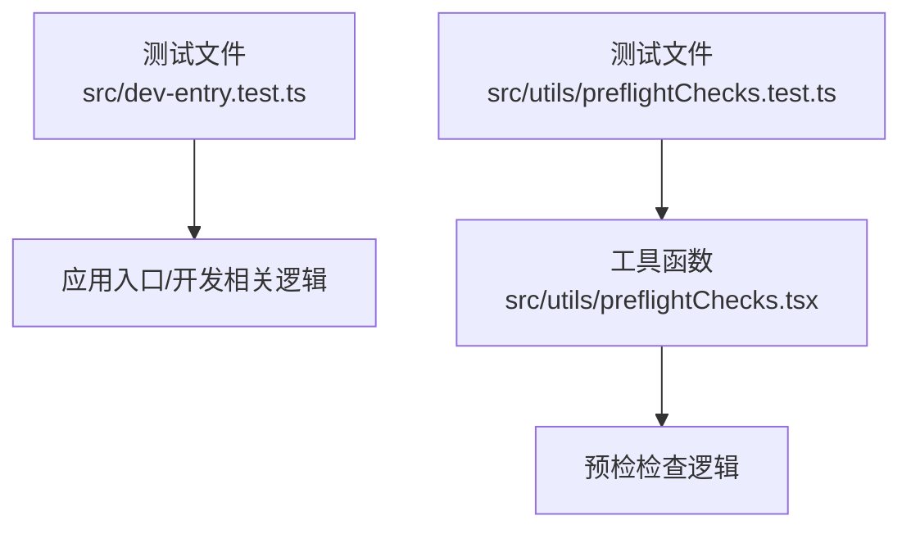
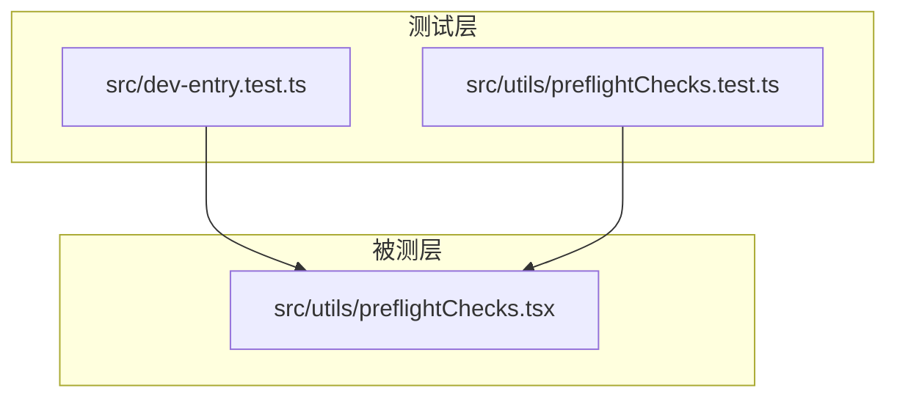
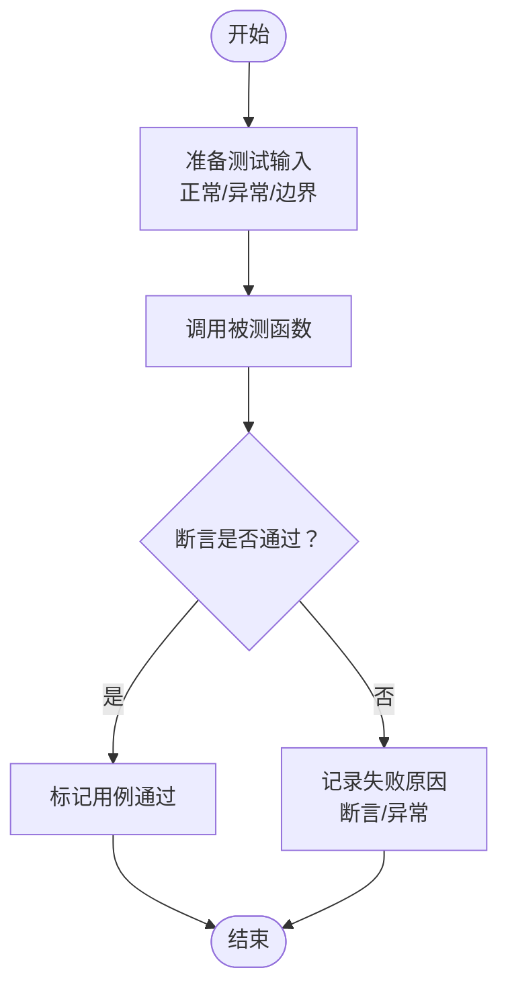
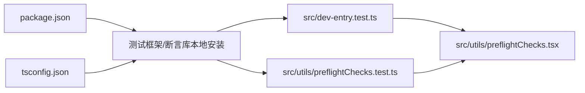

# 单元测试

<cite>
**本文引用的文件**
- [src/dev-entry.test.ts](file://src/dev-entry.test.ts)
- [src/utils/preflightChecks.test.ts](file://src/utils/preflightChecks.test.ts)
- [src/utils/preflightChecks.tsx](file://src/utils/preflightChecks.tsx)
- [package.json](file://package.json)
- [tsconfig.json](file://tsconfig.json)
</cite>

## 目录
1. [引言](#引言)
2. [项目结构](#项目结构)
3. [核心组件](#核心组件)
4. [架构总览](#架构总览)
5. [详细组件分析](#详细组件分析)
6. [依赖分析](#依赖分析)
7. [性能考虑](#性能考虑)
8. [故障排查指南](#故障排查指南)
9. [结论](#结论)
10. [附录](#附录)

## 引言
本文件面向 Claude Code 的单元测试实践，系统性阐述如何在该项目中编写与组织单元测试，覆盖工具函数测试、服务层测试与组件测试三大维度。文档基于仓库中已存在的测试文件与典型测试场景，给出可操作的测试策略、模拟对象（Mock）与测试数据准备方法，并提供测试覆盖率统计与提升建议。

## 项目结构
- 测试文件分布
  - 工具函数测试：位于 src/utils 下，如 [src/utils/preflightChecks.test.ts](file://src/utils/preflightChecks.test.ts)。
  - 应用入口与开发相关测试：位于 src 根目录，如 [src/dev-entry.test.ts](file://src/dev-entry.test.ts)。
- 测试运行与配置
  - 项目使用 TypeScript 编译与类型检查，测试框架未在仓库根配置中显式声明，但可通过包管理脚本或本地安装方式启用（见“附录”）。
  - 测试文件命名遵循以 .test.ts 结尾的约定，便于与构建工具识别。

图表来源
- [src/dev-entry.test.ts](file://src/dev-entry.test.ts)
- [src/utils/preflightChecks.test.ts](file://src/utils/preflightChecks.test.ts)
- [src/utils/preflightChecks.tsx](file://src/utils/preflightChecks.tsx)

章节来源
- [src/dev-entry.test.ts](file://src/dev-entry.test.ts)
- [src/utils/preflightChecks.test.ts](file://src/utils/preflightChecks.test.ts)
- [src/utils/preflightChecks.tsx](file://src/utils/preflightChecks.tsx)

## 核心组件
- 预检检查工具测试
  - 目标：验证预检检查函数在不同输入条件下的行为，确保关键前置条件被正确评估。
  - 关键点：参数化输入、边界值、异常路径、异步行为（如需要）。
- 开发入口测试
  - 目标：验证开发模式下的入口逻辑、初始化流程与错误处理。
  - 关键点：环境变量、配置加载、异常捕获与降级策略。

章节来源
- [src/utils/preflightChecks.test.ts](file://src/utils/preflightChecks.test.ts)
- [src/dev-entry.test.ts](file://src/dev-entry.test.ts)

## 架构总览
下图展示了测试文件与其被测模块之间的关系，体现测试驱动的分层结构：

图表来源
- [src/dev-entry.test.ts](file://src/dev-entry.test.ts)
- [src/utils/preflightChecks.test.ts](file://src/utils/preflightChecks.test.ts)
- [src/utils/preflightChecks.tsx](file://src/utils/preflightChecks.tsx)

## 详细组件分析

### 预检检查工具测试
- 覆盖范围
  - 输入参数合法性校验
  - 环境状态判断（如网络、权限、配置）
  - 异常与边界条件处理
- 建议的测试用例设计
  - 正常路径：满足所有前置条件时返回预期结果。
  - 异常路径：缺少必要配置、权限不足、网络不可达等。
  - 边界路径：空值、极小/极大阈值、特殊字符等。
- 模拟对象与测试数据
  - 使用 Mock 对外部依赖（如网络请求、文件系统）进行隔离。
  - 通过参数化测试覆盖多组输入组合。
- 断言策略
  - 行为断言：验证函数调用次数、参数传递、返回值。
  - 状态断言：验证副作用（如日志输出、错误抛出）。
- 可视化流程（算法实现流程）

图表来源
- [src/utils/preflightChecks.test.ts](file://src/utils/preflightChecks.test.ts)
- [src/utils/preflightChecks.tsx](file://src/utils/preflightChecks.tsx)

章节来源
- [src/utils/preflightChecks.test.ts](file://src/utils/preflightChecks.test.ts)
- [src/utils/preflightChecks.tsx](file://src/utils/preflightChecks.tsx)

### 开发入口测试
- 覆盖范围
  - 初始化顺序与依赖注入
  - 错误捕获与降级
  - 环境适配（开发/生产）
- 建议的测试用例设计
  - 正常启动：所有依赖可用，无异常。
  - 失败启动：依赖缺失或配置错误，验证错误传播与提示。
- 模拟对象与测试数据
  - Mock 全局对象（如 window、process.env）、第三方 SDK 初始化。
  - 使用替身对象替换真实网络或文件访问。
- 断言策略
  - 行为断言：关键初始化步骤按序执行。
  - 状态断言：错误分支触发正确的错误回调或日志。

章节来源
- [src/dev-entry.test.ts](file://src/dev-entry.test.ts)

### 组件测试（概念性指导）
- 适用场景
  - React 组件（如消息列表、设置面板）的渲染与交互行为。
- 建议方法
  - 使用测试渲染器（如基于 React 的测试库）挂载组件，模拟 props 与上下文。
  - 通过用户事件模拟（点击、输入）验证交互逻辑。
  - 断言 DOM 结构、样式类名、可访问性属性。
- 注意事项
  - 将组件与业务逻辑解耦，优先测试纯函数与 Hook。
  - 对副作用（网络、存储）进行 Mock。

（本节为通用指导，不直接分析具体文件）

## 依赖分析
- 内部依赖
  - 测试文件依赖被测模块（如工具函数、入口逻辑）。
- 外部依赖
  - 测试框架与断言库（如 Jest、vitest）通常通过包管理脚本或本地安装启用。
  - TypeScript 类型定义与编译配置由 tsconfig.json 提供支持。
- 依赖可视化

图表来源
- [package.json](file://package.json)
- [tsconfig.json](file://tsconfig.json)
- [src/dev-entry.test.ts](file://src/dev-entry.test.ts)
- [src/utils/preflightChecks.test.ts](file://src/utils/preflightChecks.test.ts)
- [src/utils/preflightChecks.tsx](file://src/utils/preflightChecks.tsx)

章节来源
- [package.json](file://package.json)
- [tsconfig.json](file://tsconfig.json)
- [src/dev-entry.test.ts](file://src/dev-entry.test.ts)
- [src/utils/preflightChecks.test.ts](file://src/utils/preflightChecks.test.ts)
- [src/utils/preflightChecks.tsx](file://src/utils/preflightChecks.tsx)

## 性能考虑
- 测试执行效率
  - 合理拆分测试文件，避免单文件过大导致加载时间过长。
  - 使用并行执行能力（若测试框架支持），减少整体耗时。
- 资源占用
  - 对外部依赖进行 Mock，避免真实网络或磁盘 IO。
  - 控制测试数据规模，仅保留必要的最小集合。
- 可维护性
  - 保持测试命名清晰，使用语义化描述（如 describe/it 的标题）。
  - 将公共的 Mock 与辅助函数抽取到测试工具模块，复用与维护更高效。

（本节为通用指导，不直接分析具体文件）

## 故障排查指南
- 常见问题
  - 测试无法运行：确认测试框架已安装且脚本可用；检查 tsconfig 与模块解析配置。
  - Mock 不生效：确保在 import 之前完成 Mock 注入；避免循环依赖导致的覆盖失效。
  - 异步测试超时：合理设置超时时间；对 Promise 进行 await 或返回 Promise。
- 定位手段
  - 在失败用例中添加日志断言，定位具体断言点。
  - 使用最小化用例复现问题，逐步缩小范围。
- 修复建议
  - 明确边界条件与异常路径，补充缺失的用例。
  - 对复杂逻辑进行拆分，提高可测试性与可维护性。

（本节为通用指导，不直接分析具体文件）

## 结论
本项目已具备基础的单元测试实践，主要集中在工具函数与开发入口层面。建议后续扩展至组件与服务层，完善 Mock 策略与测试数据准备，建立统一的断言与覆盖率标准，持续提升测试质量与工程化水平。

（本节为总结性内容，不直接分析具体文件）

## 附录
- 测试框架与脚本
  - 项目未在根配置中显式声明测试框架，建议通过包管理脚本或本地安装启用（例如 Jest 或 vitest）。可在 package.json 中新增或调整 test 脚本，并根据需要配置覆盖率收集。
- TypeScript 支持
  - tsconfig.json 提供编译与类型检查配置，确保测试文件可被正确识别与编译。
- 覆盖率统计与要求
  - 建议在测试框架中启用覆盖率统计（如 Istanbul/Jest 覆盖率），设定关键模块的最低覆盖率阈值（如 80%），并定期审查未覆盖路径，补齐用例。

章节来源
- [package.json](file://package.json)
- [tsconfig.json](file://tsconfig.json)