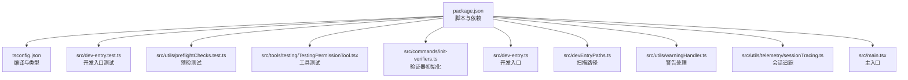
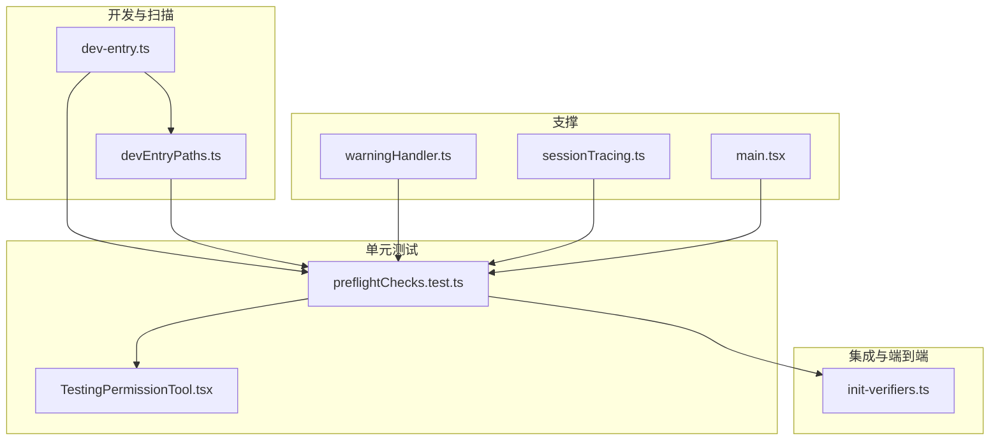
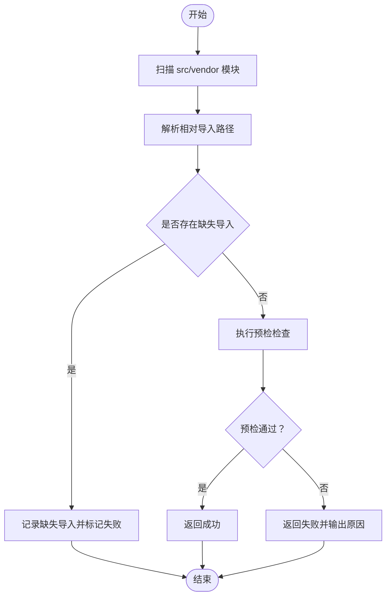
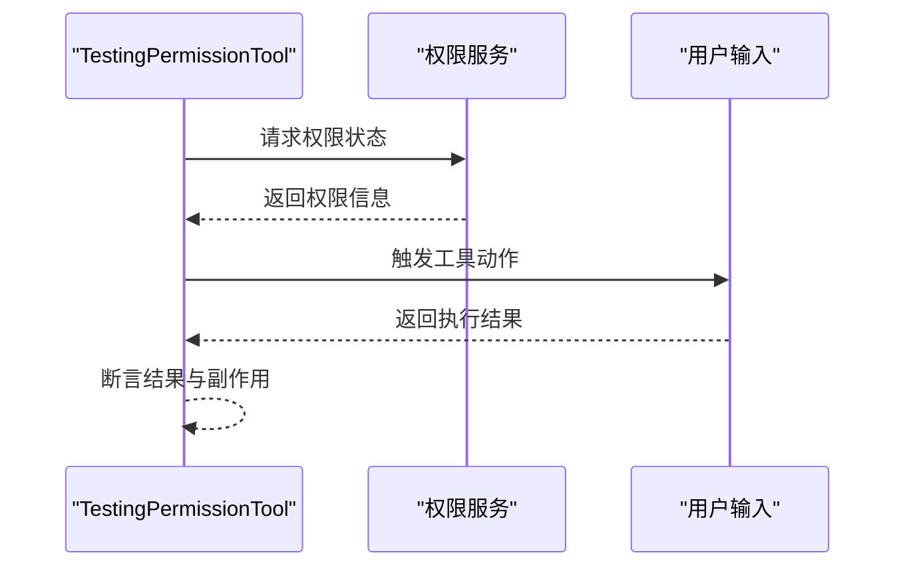
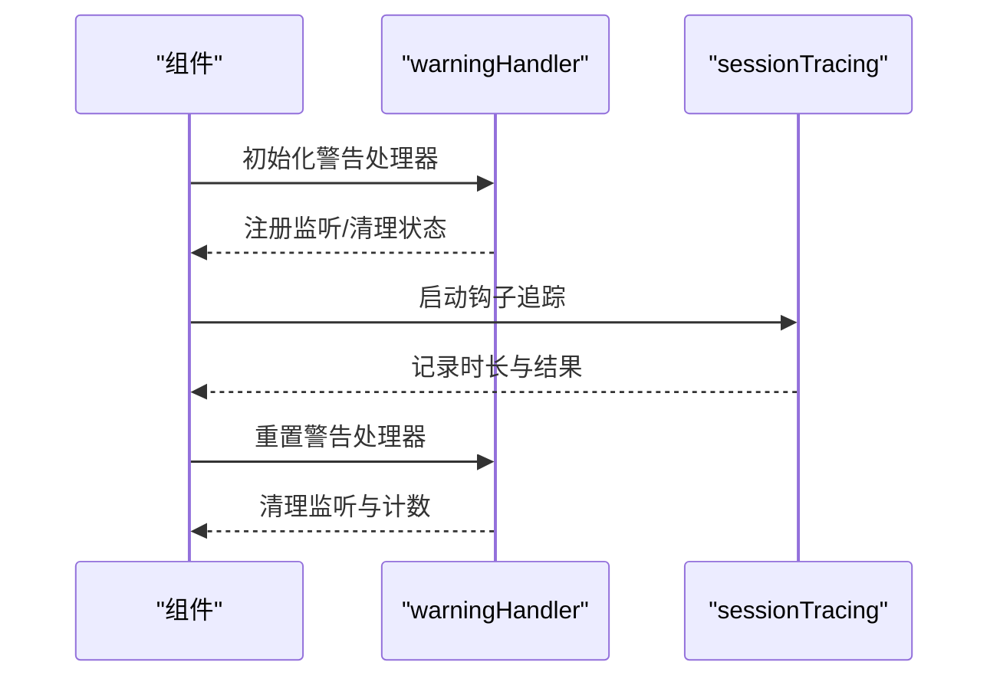
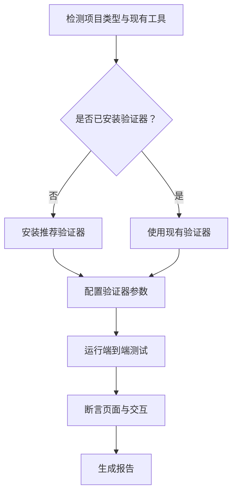
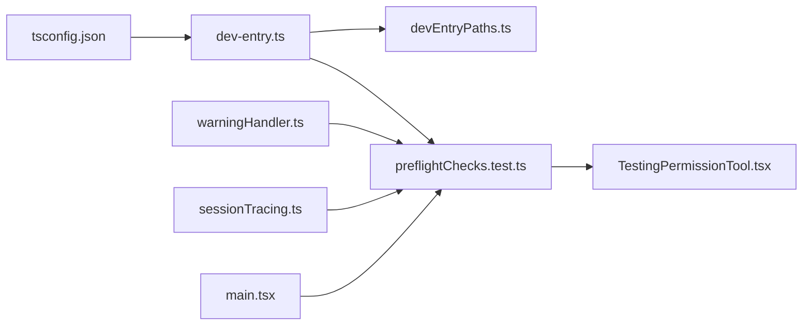

# 测试框架

<cite>
**本文引用的文件**
- [package.json](file://package.json)
- [tsconfig.json](file://tsconfig.json)
- [dev-entry.test.ts](file://src/dev-entry.test.ts)
- [preflightChecks.test.ts](file://src/utils/preflightChecks.test.ts)
- [TestingPermissionTool.tsx](file://src/tools/testing/TestingPermissionTool.tsx)
- [init-verifiers.ts](file://src/commands/init-verifiers.ts)
- [devEntryPaths.ts](file://src/devEntryPaths.ts)
- [dev-entry.ts](file://src/dev-entry.ts)
- [warningHandler.ts](file://src/utils/warningHandler.ts)
- [sessionTracing.ts](file://src/utils/telemetry/sessionTracing.ts)
- [main.tsx](file://src/main.tsx)
</cite>

## 目录
1. [引言](#引言)
2. [项目结构](#项目结构)
3. [核心组件](#核心组件)
4. [架构总览](#架构总览)
5. [详细组件分析](#详细组件分析)
6. [依赖分析](#依赖分析)
7. [性能考虑](#性能考虑)
8. [故障排查指南](#故障排查指南)
9. [结论](#结论)
10. [附录](#附录)

## 引言
本文件系统性梳理 Claude Code 的测试框架与实践，覆盖测试环境配置、测试套件组织、单元测试（工具测试、服务测试、组件测试）、集成测试（API 测试、插件测试、端到端测试）的设计与实现要点，以及测试数据准备、模拟对象使用、测试覆盖率统计与报告生成、最佳实践与自动化测试流程配置。文档面向不同技术背景读者，既提供高层概览也给出代码级参考路径。

## 项目结构
- 测试运行器与配置
  - 使用 Bun 运行时与 TypeScript 编译配置，测试入口位于 src 目录下。
  - 根目录存在 package.json，用于管理脚本与依赖；tsconfig.json 提供编译选项与类型支持。
- 测试文件分布
  - 单元测试：src/utils/preflightChecks.test.ts 等。
  - 开发辅助与验证：src/dev-entry.test.ts、src/dev-entry.ts、src/devEntryPaths.ts。
  - 工具测试：src/tools/testing/TestingPermissionTool.tsx。
  - 验证器初始化：src/commands/init-verifiers.ts。
  - 警告处理与追踪：src/utils/warningHandler.ts、src/utils/telemetry/sessionTracing.ts。
  - 入口与调试：src/main.tsx。

图表来源
- [package.json](file://package.json)
- [tsconfig.json](file://tsconfig.json)
- [dev-entry.test.ts](file://src/dev-entry.test.ts)
- [preflightChecks.test.ts](file://src/utils/preflightChecks.test.ts)
- [TestingPermissionTool.tsx](file://src/tools/testing/TestingPermissionTool.tsx)
- [init-verifiers.ts](file://src/commands/init-verifiers.ts)
- [dev-entry.ts](file://src/dev-entry.ts)
- [devEntryPaths.ts](file://src/devEntryPaths.ts)
- [warningHandler.ts](file://src/utils/warningHandler.ts)
- [sessionTracing.ts](file://src/utils/telemetry/sessionTracing.ts)
- [main.tsx](file://src/main.tsx)

章节来源
- [package.json](file://package.json)
- [tsconfig.json](file://tsconfig.json)

## 核心组件
- 测试运行与编译
  - 使用 Bun 运行时执行测试，TypeScript 作为源码语言，tsconfig.json 提供严格/宽松的编译选项与别名映射。
- 开发入口与扫描
  - dev-entry.ts 与 devEntryPaths.ts 负责扫描 src 与 vendor 目录，收集缺失导入与模块路径，辅助测试发现与定位。
- 预检测试
  - preflightChecks.test.ts 提供基础运行前检查逻辑的单元测试，确保关键前置条件满足。
- 工具测试
  - TestingPermissionTool.tsx 展示了工具层的测试模式与权限模拟策略，便于对交互式工具进行行为验证。
- 验证器初始化
  - init-verifiers.ts 描述了针对不同应用类型的验证器选择与安装流程，为端到端测试提供基础设施。
- 警告处理与追踪
  - warningHandler.ts 控制 Node.js 警告输出，便于在测试中稳定化日志；sessionTracing.ts 提供可选的钩子执行追踪能力，便于诊断性能与异常。
- 主入口与调试
  - main.tsx 中包含调试检测逻辑，避免在调试状态下执行某些测试或流程，保证测试稳定性。

章节来源
- [dev-entry.ts](file://src/dev-entry.ts)
- [devEntryPaths.ts](file://src/devEntryPaths.ts)
- [preflightChecks.test.ts](file://src/utils/preflightChecks.test.ts)
- [TestingPermissionTool.tsx](file://src/tools/testing/TestingPermissionTool.tsx)
- [init-verifiers.ts](file://src/commands/init-verifiers.ts)
- [warningHandler.ts](file://src/utils/warningHandler.ts)
- [sessionTracing.ts](file://src/utils/telemetry/sessionTracing.ts)
- [main.tsx](file://src/main.tsx)

## 架构总览
测试体系围绕“开发入口扫描—预检—工具/组件—服务/API—端到端”分层设计，结合警告处理与会话追踪，形成从单元到端到端的闭环。

图表来源
- [dev-entry.ts](file://src/dev-entry.ts)
- [devEntryPaths.ts](file://src/devEntryPaths.ts)
- [preflightChecks.test.ts](file://src/utils/preflightChecks.test.ts)
- [TestingPermissionTool.tsx](file://src/tools/testing/TestingPermissionTool.tsx)
- [init-verifiers.ts](file://src/commands/init-verifiers.ts)
- [warningHandler.ts](file://src/utils/warningHandler.ts)
- [sessionTracing.ts](file://src/utils/telemetry/sessionTracing.ts)
- [main.tsx](file://src/main.tsx)

## 详细组件分析

### 单元测试：预检与开发入口
- 目标
  - 验证运行前检查逻辑与开发入口扫描功能，确保测试环境一致性。
- 关键点
  - 预检测试：覆盖常见前置条件判断，如路径、依赖、环境变量等。
  - 开发入口扫描：通过 devEntryPaths 扫描 src 与 vendor，识别缺失导入与模块解析问题。
- 建议
  - 将扫描结果纳入 CI，提前暴露模块解析错误。
  - 对预检失败场景增加断言与错误消息验证。

图表来源
- [dev-entry.ts](file://src/dev-entry.ts)
- [devEntryPaths.ts](file://src/devEntryPaths.ts)
- [preflightChecks.test.ts](file://src/utils/preflightChecks.test.ts)

章节来源
- [dev-entry.ts](file://src/dev-entry.ts)
- [devEntryPaths.ts](file://src/devEntryPaths.ts)
- [preflightChecks.test.ts](file://src/utils/preflightChecks.test.ts)

### 工具测试：TestingPermissionTool
- 目标
  - 验证工具层交互与权限控制逻辑，确保工具在受限或模拟环境下仍能正确响应。
- 关键点
  - 权限模拟：通过工具接口模拟权限状态，验证工具在不同权限下的行为分支。
  - 交互验证：对工具调用链路进行断言，确保输入输出符合预期。
- 建议
  - 为每个工具建立独立测试套件，覆盖正常、异常与边界场景。
  - 使用最小化模拟对象，隔离外部依赖。

图表来源
- [TestingPermissionTool.tsx](file://src/tools/testing/TestingPermissionTool.tsx)

章节来源
- [TestingPermissionTool.tsx](file://src/tools/testing/TestingPermissionTool.tsx)

### 组件测试：警告处理与追踪
- 目标
  - 在组件层面验证警告处理与会话追踪的稳定性与可观测性。
- 关键点
  - 警告处理：初始化与重置逻辑，避免重复监听与噪声输出。
  - 会话追踪：钩子执行时长与结果统计，仅在启用时生效。
- 建议
  - 在组件测试中注入不同环境变量，验证调试与非调试模式的行为差异。
  - 结合追踪数据生成可视化报告，辅助性能回归分析。

图表来源
- [warningHandler.ts](file://src/utils/warningHandler.ts)
- [sessionTracing.ts](file://src/utils/telemetry/sessionTracing.ts)

章节来源
- [warningHandler.ts](file://src/utils/warningHandler.ts)
- [sessionTracing.ts](file://src/utils/telemetry/sessionTracing.ts)

### 集成测试：验证器初始化与端到端
- 目标
  - 基于 init-verifiers.ts 的思路，设计浏览器自动化与 HTTP 接口的集成测试方案。
- 关键点
  - 验证器选择：根据项目类型（Web 应用、CLI、API 服务）自动推荐或安装 Playwright、Chrome DevTools MCP 或 Claude Chrome Extension。
  - 端到端流程：启动开发服务器、加载页面、执行交互、断言结果。
- 建议
  - 将验证器安装与配置纳入 CI 步骤，确保测试环境一致性。
  - 对关键页面与交互建立快照或断言，防止 UI 回归。

图表来源
- [init-verifiers.ts](file://src/commands/init-verifiers.ts)

章节来源
- [init-verifiers.ts](file://src/commands/init-verifiers.ts)

### API 测试与插件测试
- API 测试
  - 建议使用 HTTP 客户端库对后端接口进行请求/响应断言，覆盖正常、异常与边界场景。
  - 对认证、速率限制与错误码进行专项测试。
- 插件测试
  - 针对插件生命周期（加载、初始化、卸载）与事件回调进行断言。
  - 使用沙箱或隔离环境运行插件，避免对宿主造成影响。

[本节为通用指导，不直接分析具体文件，故无章节来源]

### 端到端测试
- 设计要点
  - 页面导航、表单提交、异步加载与错误提示。
  - 与真实浏览器或 MCP 通道交互，确保跨平台一致性。
- 实施建议
  - 使用 Headless 模式提升执行效率；在 CI 中开启可视化回放。
  - 对关键路径建立快照对比，降低维护成本。

[本节为通用指导，不直接分析具体文件，故无章节来源]

## 依赖分析
- 测试运行时
  - Bun 提供快速的测试执行环境；TypeScript 提供类型安全与智能提示。
- 关键依赖关系
  - dev-entry.ts 依赖 devEntryPaths.ts 的扫描结果。
  - 预检测试依赖开发入口扫描与路径解析。
  - 工具测试依赖工具接口与权限服务。
  - 警告处理与追踪为上层组件提供可观测性支撑。
  - 主入口的调试检测逻辑影响测试执行时机。

图表来源
- [tsconfig.json](file://tsconfig.json)
- [dev-entry.ts](file://src/dev-entry.ts)
- [devEntryPaths.ts](file://src/devEntryPaths.ts)
- [preflightChecks.test.ts](file://src/utils/preflightChecks.test.ts)
- [TestingPermissionTool.tsx](file://src/tools/testing/TestingPermissionTool.tsx)
- [warningHandler.ts](file://src/utils/warningHandler.ts)
- [sessionTracing.ts](file://src/utils/telemetry/sessionTracing.ts)
- [main.tsx](file://src/main.tsx)

章节来源
- [tsconfig.json](file://tsconfig.json)
- [dev-entry.ts](file://src/dev-entry.ts)
- [devEntryPaths.ts](file://src/devEntryPaths.ts)
- [preflightChecks.test.ts](file://src/utils/preflightChecks.test.ts)
- [TestingPermissionTool.tsx](file://src/tools/testing/TestingPermissionTool.tsx)
- [warningHandler.ts](file://src/utils/warningHandler.ts)
- [sessionTracing.ts](file://src/utils/telemetry/sessionTracing.ts)
- [main.tsx](file://src/main.tsx)

## 性能考虑
- 测试执行
  - 使用 Bun 并行执行测试，减少冷启动开销。
  - 将耗时任务（如浏览器安装、依赖下载）前置到 CI 缓存步骤。
- 可观测性
  - 启用会话追踪以捕获关键路径耗时，结合日志定位瓶颈。
  - 通过警告处理统一日志输出，避免噪声干扰性能指标。
- 资源隔离
  - 在端到端测试中使用独立进程或容器，避免资源争用。

[本节提供一般性建议，不直接分析具体文件，故无章节来源]

## 故障排查指南
- 调试模式阻断
  - 若在调试模式下测试被阻断，检查主入口的调试检测逻辑，确认是否因 Inspector 激活导致退出。
- 警告噪声
  - 使用警告处理初始化与重置函数，移除默认 Node.js 警告处理器或仅保留开发环境警告。
- 追踪数据缺失
  - 确认追踪开关状态，仅在启用时记录时长与结果，并清理活跃追踪集合。

章节来源
- [main.tsx](file://src/main.tsx)
- [warningHandler.ts](file://src/utils/warningHandler.ts)
- [sessionTracing.ts](file://src/utils/telemetry/sessionTracing.ts)

## 结论
Claude Code 的测试框架以 Bun 与 TypeScript 为基础，结合开发入口扫描、预检测试、工具与组件测试，以及基于 init-verifiers.ts 的端到端验证器初始化思路，形成了从单元到端到端的完整测试体系。通过合理的模拟对象、测试数据准备与可观测性支撑，能够有效保障质量与稳定性。建议在 CI 中固化验证器安装与测试执行流程，并持续优化覆盖率与报告生成。

## 附录
- 测试覆盖率与报告
  - 建议在 CI 中集成覆盖率统计与报告生成，结合仓库缓存与矩阵构建，提升反馈速度。
- 自动化测试流程
  - 将开发入口扫描、预检测试、工具与组件测试、端到端测试串联为流水线阶段，按优先级与失败策略进行短路与重试。

[本节为通用指导，不直接分析具体文件，故无章节来源]