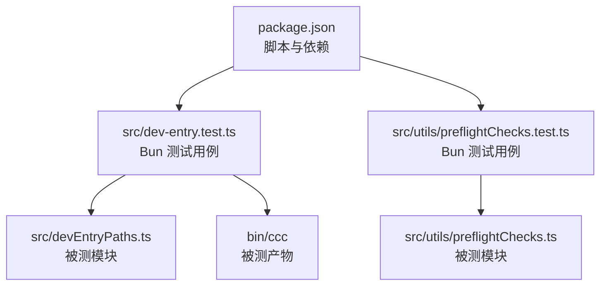
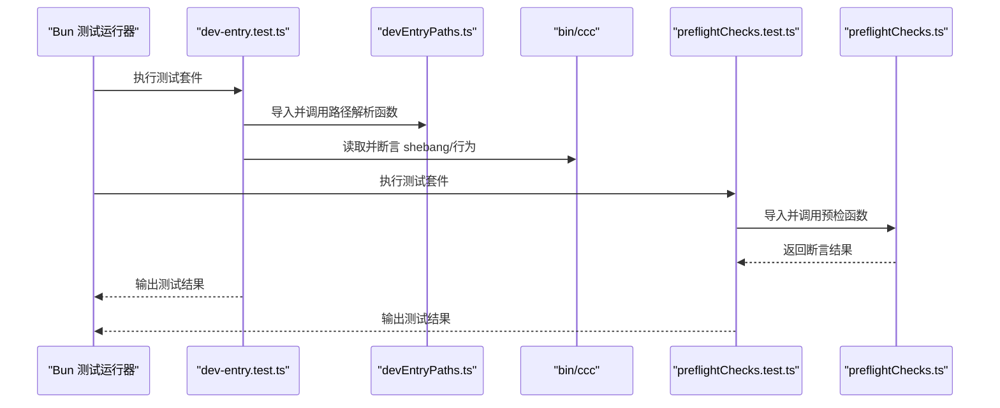
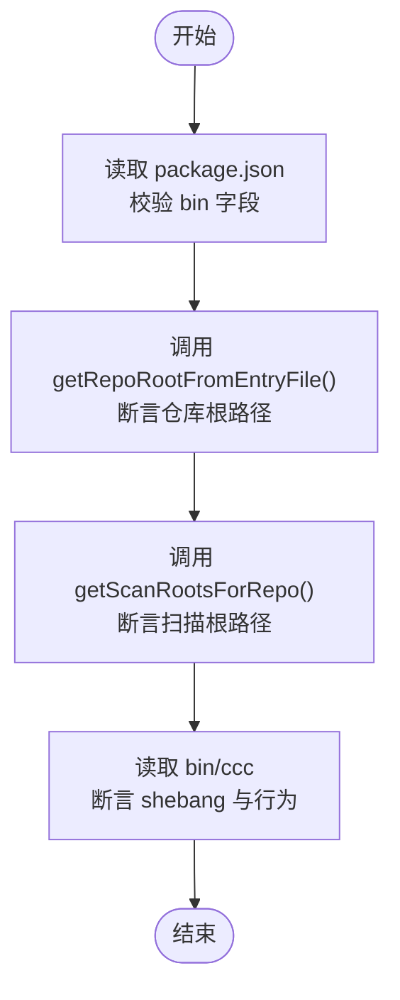
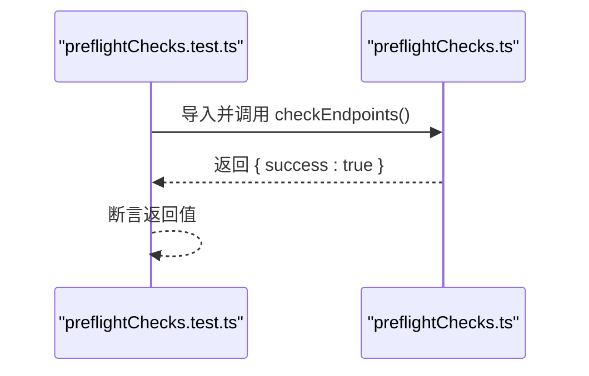
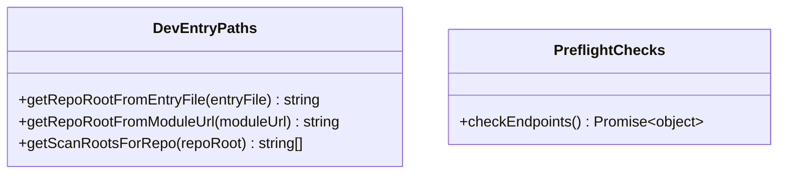
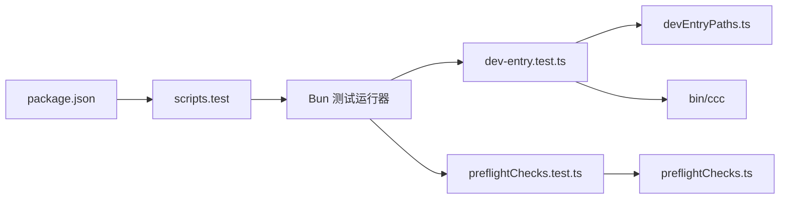

# 测试配置

<cite>
**本文引用的文件**
- [package.json](file://package.json)
- [src/dev-entry.test.ts](file://src/dev-entry.test.ts)
- [src/utils/preflightChecks.test.ts](file://src/utils/preflightChecks.test.ts)
- [src/devEntryPaths.ts](file://src/devEntryPaths.ts)
- [src/utils/preflightChecks.ts](file://src/utils/preflightChecks.ts)
- [bin/ccc](file://bin/ccc)
</cite>

## 目录
1. [简介](#简介)
2. [项目结构](#项目结构)
3. [核心组件](#核心组件)
4. [架构总览](#架构总览)
5. [详细组件分析](#详细组件分析)
6. [依赖关系分析](#依赖关系分析)
7. [性能考虑](#性能考虑)
8. [故障排查指南](#故障排查指南)
9. [结论](#结论)
10. [附录](#附录)

## 简介
本文件面向 Claude Code 项目的测试配置与实践，聚焦以下目标：
- 解释当前仓库中已有的测试实现（基于 Bun 的内置测试运行器）与可扩展方向
- 说明如何在现有基础上添加测试框架、测试脚本与工具集成
- 介绍 package.json 中与测试相关的配置项与命令
- 提供测试覆盖率配置与报告生成的建议方案
- 给出测试环境搭建步骤、依赖管理策略以及在持续集成中的自动化测试流程建议

需要特别说明的是：当前仓库根目录的 package.json 并未声明测试脚本或测试依赖；实际的测试用例位于 src 目录下，采用 Bun 内置的测试运行器进行执行。本文将围绕这些事实展开，并给出可落地的扩展建议。

## 项目结构
与测试相关的关键位置如下：
- 根目录 package.json：定义包元信息与脚本入口，但不包含测试脚本
- src 目录：包含若干测试文件，例如 dev-entry.test.ts、utils/preflightChecks.test.ts
- src/devEntryPaths.ts：被测试用例导入以验证路径解析逻辑
- src/utils/preflightChecks.ts：被测试用例调用以验证预检逻辑
- bin/ccc：被测试用例断言其 shebang 与行为特征

图表来源
- [package.json](file://package.json)
- [src/dev-entry.test.ts](file://src/dev-entry.test.ts)
- [src/utils/preflightChecks.test.ts](file://src/utils/preflightChecks.test.ts)
- [src/devEntryPaths.ts](file://src/devEntryPaths.ts)
- [src/utils/preflightChecks.ts](file://src/utils/preflightChecks.ts)
- [bin/ccc](file://bin/ccc)

章节来源
- [package.json](file://package.json)
- [src/dev-entry.test.ts](file://src/dev-entry.test.ts)
- [src/utils/preflightChecks.test.ts](file://src/utils/preflightChecks.test.ts)

## 核心组件
- 测试运行器：Bun 内置的测试运行器（bun:test），无需额外安装即可直接使用
- 被测模块：
  - devEntryPaths.ts：提供仓库根路径推导与扫描根路径构建能力
  - preflightChecks.ts：提供启动前连通性检查能力
- 测试用例：
  - dev-entry.test.ts：验证包二进制暴露、入口路径解析、扫描根路径与启动器 shebang 行为
  - preflightChecks.test.ts：验证预检检查返回值

章节来源
- [src/dev-entry.test.ts](file://src/dev-entry.test.ts)
- [src/utils/preflightChecks.test.ts](file://src/utils/preflightChecks.test.ts)
- [src/devEntryPaths.ts](file://src/devEntryPaths.ts)
- [src/utils/preflightChecks.ts](file://src/utils/preflightChecks.ts)
- [bin/ccc](file://bin/ccc)

## 架构总览
下图展示了测试执行的总体流程：测试文件通过 Bun 运行器加载被测模块并断言结果。

图表来源
- [src/dev-entry.test.ts](file://src/dev-entry.test.ts)
- [src/devEntryPaths.ts](file://src/devEntryPaths.ts)
- [bin/ccc](file://bin/ccc)
- [src/utils/preflightChecks.test.ts](file://src/utils/preflightChecks.test.ts)
- [src/utils/preflightChecks.ts](file://src/utils/preflightChecks.ts)

## 详细组件分析

### 组件一：dev-entry 测试套件
该套件用于验证开发入口打包与启动器行为，覆盖以下要点：
- 包清单是否正确暴露 ccc 启动器
- 入口文件路径解析是否能正确推导仓库根
- 扫描根路径是否按约定指向 src 与 vendor
- 启动器 shebang 是否为 bun 且不会切换工作目录

图表来源
- [src/dev-entry.test.ts](file://src/dev-entry.test.ts)
- [src/devEntryPaths.ts](file://src/devEntryPaths.ts)
- [bin/ccc](file://bin/ccc)

章节来源
- [src/dev-entry.test.ts](file://src/dev-entry.test.ts)
- [src/devEntryPaths.ts](file://src/devEntryPaths.ts)
- [bin/ccc](file://bin/ccc)

### 组件二：预检检查测试套件
该套件用于验证启动前连通性检查的行为，确保在测试环境下返回成功状态。

图表来源
- [src/utils/preflightChecks.test.ts](file://src/utils/preflightChecks.test.ts)
- [src/utils/preflightChecks.ts](file://src/utils/preflightChecks.ts)

章节来源
- [src/utils/preflightChecks.test.ts](file://src/utils/preflightChecks.test.ts)
- [src/utils/preflightChecks.ts](file://src/utils/preflightChecks.ts)

### 组件三：被测模块概览
- devEntryPaths.ts：提供仓库根路径解析与扫描根路径构建
- preflightChecks.ts：提供启动前连通性检查

图表来源
- [src/devEntryPaths.ts](file://src/devEntryPaths.ts)
- [src/utils/preflightChecks.ts](file://src/utils/preflightChecks.ts)

章节来源
- [src/devEntryPaths.ts](file://src/devEntryPaths.ts)
- [src/utils/preflightChecks.ts](file://src/utils/preflightChecks.ts)

## 依赖关系分析
- 测试运行器：由 Bun 内置提供，无需额外安装
- 测试脚本：当前 package.json 未声明测试脚本；如需统一入口，可在 scripts 字段新增 test 命令
- 被测模块：devEntryPaths.ts 与 preflightChecks.ts 分别被对应测试文件导入
- 产物校验：dev-entry.test.ts 对 bin/ccc 的 shebang 与行为进行断言

图表来源
- [package.json](file://package.json)
- [src/dev-entry.test.ts](file://src/dev-entry.test.ts)
- [src/utils/preflightChecks.test.ts](file://src/utils/preflightChecks.test.ts)
- [src/devEntryPaths.ts](file://src/devEntryPaths.ts)
- [src/utils/preflightChecks.ts](file://src/utils/preflightChecks.ts)
- [bin/ccc](file://bin/ccc)

章节来源
- [package.json](file://package.json)
- [src/dev-entry.test.ts](file://src/dev-entry.test.ts)
- [src/utils/preflightChecks.test.ts](file://src/utils/preflightChecks.test.ts)

## 性能考虑
- 使用 Bun 内置测试运行器具有较低开销，适合快速迭代
- 将测试拆分为小而独立的用例，避免不必要的模块热加载
- 在 CI 中仅运行变更相关的测试集，减少整体执行时间

## 故障排查指南
- 测试无法找到模块
  - 检查被测模块的导出与导入路径是否正确
  - 确认测试文件与被测模块在同一仓库根路径下，避免相对路径错误
- 启动器 shebang 断言失败
  - 确认 bin/ccc 的 shebang 是否为 “#!/usr/bin/env bun”
  - 避免在启动器中包含切换工作目录的逻辑
- 预检检查返回异常
  - 确认网络访问权限与代理设置
  - 在测试环境中允许预检检查返回成功以绕过外部依赖

章节来源
- [src/dev-entry.test.ts](file://src/dev-entry.test.ts)
- [src/utils/preflightChecks.test.ts](file://src/utils/preflightChecks.test.ts)
- [bin/ccc](file://bin/ccc)

## 结论
- 当前仓库采用 Bun 内置测试运行器，测试脚本未在 package.json 中集中声明
- 已有测试用例覆盖了关键的打包与启动器行为、预检检查逻辑
- 建议在 package.json 中补充统一的测试脚本，并引入覆盖率与报告生成机制，以提升测试可观测性与质量保障

## 附录

### A. 测试环境搭建与依赖管理
- 运行时要求
  - Node.js 版本：满足 engines 字段要求
  - 包管理器：Bun（版本见 engines）
- 安装与运行
  - 使用 Bun 运行测试：在项目根目录执行 Bun 测试运行器对 src 下的测试文件进行扫描与执行
  - 如需统一入口，可在 package.json 的 scripts 字段新增 test 命令，指向 Bun 测试运行器

章节来源
- [package.json](file://package.json)

### B. package.json 中的测试相关配置说明
- 当前状态
  - 未声明 test 脚本
  - 未声明测试依赖（如 @types/node、vitest、jest 等）
- 建议新增
  - 在 scripts 中添加 test 命令，指向 Bun 测试运行器
  - 若未来迁移到其他测试框架，再引入相应依赖

章节来源
- [package.json](file://package.json)

### C. 测试命令与执行方式
- 当前做法
  - 直接使用 Bun 测试运行器扫描 src 下的测试文件
- 推荐做法（可选）
  - 在 scripts 中新增 test 命令，统一入口便于 CI 集成
  - 可结合 --coverage 与 --reporter 参数生成覆盖率与报告（若后续引入覆盖率工具）

章节来源
- [src/dev-entry.test.ts](file://src/dev-entry.test.ts)
- [src/utils/preflightChecks.test.ts](file://src/utils/preflightChecks.test.ts)

### D. 测试覆盖率配置与报告生成（建议方案）
- 方案一：Bun 内置覆盖率
  - 使用 Bun 的覆盖率支持生成报告，适用于当前测试运行器
- 方案二：迁移至 Vitest/Jest（可选）
  - 引入 vitest 或 jest 作为测试框架，配合相应覆盖率插件与报告生成器
  - 在 CI 中输出多种格式报告（如 HTML、文本、JSON），便于团队评审与质量门禁

说明：以上为通用建议，具体实施需根据团队技术栈与 CI 环境选择合适方案。

### E. 持续集成中的测试配置与自动化流程（建议）
- 触发条件
  - PR/MR 合并请求、主干推送、定时全量回归
- 步骤建议
  - 安装依赖（Bun）
  - 运行测试（统一入口或默认扫描）
  - 生成覆盖率与报告
  - 上传报告到 CI 平台或质量平台
- 可视化
  - 在 CI 日志中展示测试结果与覆盖率趋势
  - 失败时自动标注问题与回滚建议