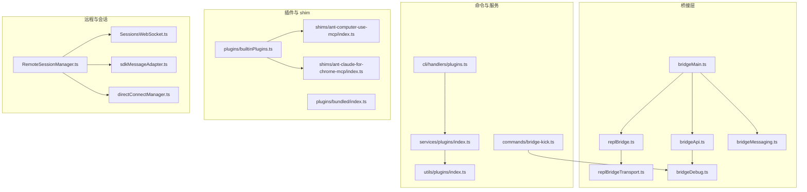
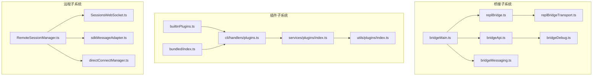
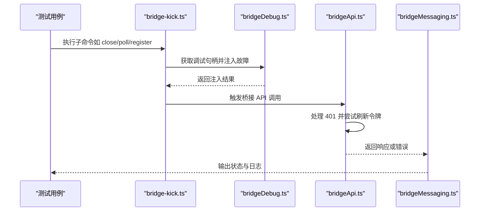
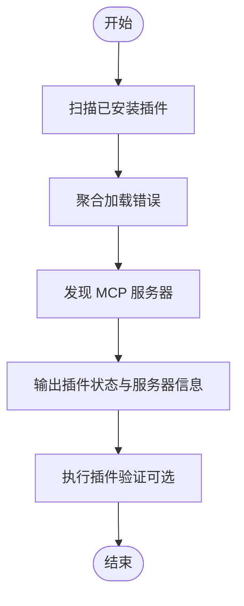
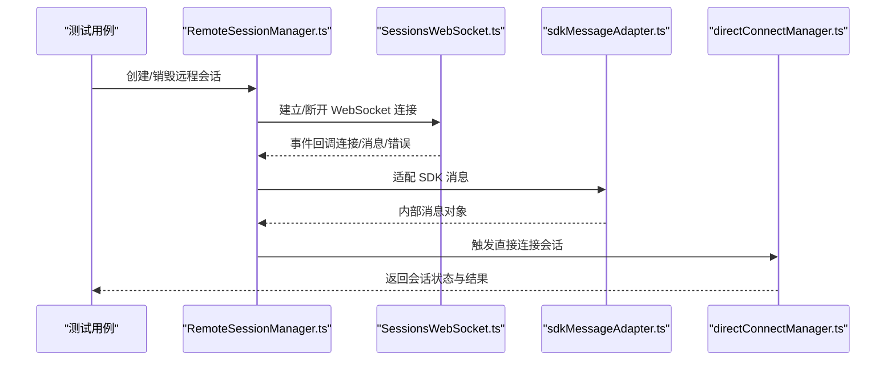
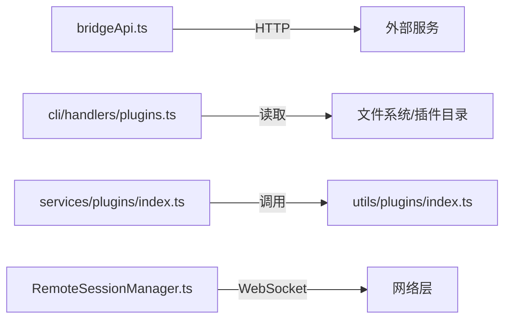

# 集成测试

<cite>
**本文引用的文件**
- [package.json](file://package.json)
- [tsconfig.json](file://tsconfig.json)
- [docs/06-bridge.md](file://docs/06-bridge.md)
- [src/bridge/bridgeApi.ts](file://src/bridge/bridgeApi.ts)
- [src/bridge/bridgeMain.ts](file://src/bridge/bridgeMain.ts)
- [src/bridge/replBridge.ts](file://src/bridge/replBridge.ts)
- [src/bridge/replBridgeTransport.ts](file://src/bridge/replBridgeTransport.ts)
- [src/bridge/bridgeMessaging.ts](file://src/bridge/bridgeMessaging.ts)
- [src/bridge/bridgeDebug.ts](file://src/bridge/bridgeDebug.ts)
- [src/bridge/bridgeEnabled.ts](file://src/bridge/bridgeEnabled.ts)
- [src/bridge/bridgeConfig.ts](file://src/bridge/bridgeConfig.ts)
- [src/bridge/initReplBridge.ts](file://src/bridge/initReplBridge.ts)
- [src/bridge/sessionRunner.ts](file://src/bridge/sessionRunner.ts)
- [src/bridge/bridgePointer.ts](file://src/bridge/bridgePointer.ts)
- [src/bridge/workSecret.ts](file://src/bridge/workSecret.ts)
- [src/bridge/jwtUtils.ts](file://src/bridge/jwtUtils.ts)
- [src/bridge/trustedDevice.ts](file://src/bridge/trustedDevice.ts)
- [src/commands/bridge-kick.ts](file://src/commands/bridge-kick.ts)
- [src/cli/handlers/plugins.ts](file://src/cli/handlers/plugins.ts)
- [src/commands/plugin/ValidatePlugin.tsx](file://src/commands/plugin/ValidatePlugin.tsx)
- [src/services/plugins/index.ts](file://src/services/plugins/index.ts)
- [src/utils/plugins/index.ts](file://src/utils/plugins/index.ts)
- [src/plugins/builtinPlugins.ts](file://src/plugins/builtinPlugins.ts)
- [src/plugins/bundled/index.ts](file://src/plugins/bundled/index.ts)
- [shims/ant-computer-use-mcp/index.ts](file://shims/ant-computer-use-mcp/index.ts)
- [shims/ant-computer-use-mcp/types.ts](file://shims/ant-computer-use-mcp/types.ts)
- [shims/ant-computer-use-mcp/sentinelApps.ts](file://shims/ant-computer-use-mcp/sentinelApps.ts)
- [shims/ant-claude-for-chrome-mcp/index.ts](file://shims/ant-claude-for-chrome-mcp/index.ts)
- [shims/ant-computer-use-input/index.ts](file://shims/ant-computer-use-input/index.ts)
- [shims/color-diff-napi/index.ts](file://shims/color-diff-napi/index.ts)
- [shims/modifiers-napi/index.ts](file://shims/modifiers-napi/index.ts)
- [shims/url-handler-napi/index.ts](file://shims/url-handler-napi/index.ts)
- [src/remote/RemoteSessionManager.ts](file://src/remote/RemoteSessionManager.ts)
- [src/remote/SessionsWebSocket.ts](file://src/remote/SessionsWebSocket.ts)
- [src/remote/sdkMessageAdapter.ts](file://src/remote/sdkMessageAdapter.ts)
- [src/remote/remotePermissionBridge.ts](file://src/remote/remotePermissionBridge.ts)
- [src/server/createDirectConnectSession.ts](file://src/server/createDirectConnectSession.ts)
- [src/server/directConnectManager.ts](file://src/server/directConnectManager.ts)
- [src/server/types.ts](file://src/server/types.ts)
- [src/utils/mcp/index.ts](file://src/utils/mcp/index.ts)
- [src/utils/computerUse/index.ts](file://src/utils/computerUse/index.ts)
- [src/utils/claudeInChrome/index.ts](file://src/utils/claudeInChrome/index.ts)
- [src/hooks/useReplBridge.tsx](file://src/hooks/useReplBridge.tsx)
- [src/hooks/useRemoteSession.ts](file://src/hooks/useRemoteSession.ts)
- [src/hooks/useMergedClients.ts](file://src/hooks/useMergedClients.ts)
- [src/hooks/useMergedCommands.ts](file://src/hooks/useMergedCommands.ts)
- [src/hooks/useMergedTools.ts](file://src/hooks/useMergedTools.ts)
- [src/hooks/notifs/index.ts](file://src/hooks/notifs/index.ts)
- [src/tasks/LocalMainSessionTask.ts](file://src/tasks/LocalMainSessionTask.ts)
- [src/tasks/RemoteAgentTask.ts](file://src/tasks/RemoteAgentTask.ts)
- [src/tools/MCPTool/index.ts](file://src/tools/MCPTool/index.ts)
- [src/tools/ReadMcpResourceTool/index.ts](file://src/tools/ReadMcpResourceTool/index.ts)
- [src/tools/ListMcpResourcesTool/index.ts](file://src/tools/ListMcpResourcesTool/index.ts)
- [src/tools/MonitorTool/index.ts](file://src/tools/MonitorTool/index.ts)
- [src/tools/SendMessageTool/index.ts](file://src/tools/SendMessageTool/index.ts)
- [src/tools/RemoteTriggerTool/index.ts](file://src/tools/RemoteTriggerTool/index.ts)
- [src/services/mcp/index.ts](file://src/services/mcp/index.ts)
- [src/services/mcpServerApproval.tsx](file://src/services/mcpServerApproval.tsx)
- [src/skills/mcpSkills.ts](file://src/skills/mcpSkills.ts)
- [src/skills/mcpSkillBuilders.ts](file://src/skills/mcpSkillBuilders.ts)
- [src/skills/bundledSkills.ts](file://src/skills/bundledSkills.ts)
- [src/skills/loadSkillsDir.ts](file://src/skills/loadSkillsDir.ts)
- [src/migrations/migrateOpusToOpus1m.ts](file://src/migrations/migrateOpusToOpus1m.ts)
- [src/migrations/migrateSonnet45ToSonnet46.ts](file://src/migrations/migrateSonnet45ToSonnet46.ts)
- [src/migrations/migrateReplBridgeEnabledToRemoteControlAtStartup.ts](file://src/migrations/migrateReplBridgeEnabledToRemoteControlAtStartup.ts)
- [src/migrations/resetProToOpusDefault.ts](file://src/migrations/resetProToOpusDefault.ts)
</cite>

## 目录
1. [引言](#引言)
2. [项目结构](#项目结构)
3. [核心组件](#核心组件)
4. [架构总览](#架构总览)
5. [详细组件分析](#详细组件分析)
6. [依赖关系分析](#依赖关系分析)
7. [性能考虑](#性能考虑)
8. [故障排查指南](#故障排查指南)
9. [结论](#结论)
10. [附录](#附录)

## 引言
本文件面向 Claude Code 的集成测试设计与实现，覆盖插件系统测试、API 接口测试与桥接功能测试三大主题。文档从系统架构出发，梳理组件间交互与数据流，解释外部依赖的模拟策略与测试环境配置，并给出可操作的测试示例路径与数据准备/清理策略，帮助测试人员在真实与可控的环境中验证跨模块行为。

## 项目结构
Claude Code 采用以“功能域”为主的组织方式：bridge（桥接）、commands（命令）、services（服务）、tools（工具）、plugins（插件）、shims（桥接层封装）等。测试应围绕这些模块之间的协作进行，重点验证：
- 插件系统的加载、注册、错误处理与 MCP 服务器发现
- 桥接层的初始化、消息路由、传输抽象与故障注入
- 远程会话与权限桥接、直接连接管理与 SDK 消息适配

图表来源
- [src/bridge/bridgeMain.ts:1-200](file://src/bridge/bridgeMain.ts#L1-L200)
- [src/bridge/bridgeApi.ts:1-200](file://src/bridge/bridgeApi.ts#L1-L200)
- [src/bridge/replBridge.ts:1-200](file://src/bridge/replBridge.ts#L1-L200)
- [src/bridge/replBridgeTransport.ts:1-200](file://src/bridge/replBridgeTransport.ts#L1-L200)
- [src/bridge/bridgeMessaging.ts:1-200](file://src/bridge/bridgeMessaging.ts#L1-L200)
- [src/bridge/bridgeDebug.ts:1-150](file://src/bridge/bridgeDebug.ts#L1-L150)
- [src/commands/bridge-kick.ts:1-120](file://src/commands/bridge-kick.ts#L1-L120)
- [src/cli/handlers/plugins.ts:1-250](file://src/cli/handlers/plugins.ts#L1-L250)
- [src/services/plugins/index.ts:1-200](file://src/services/plugins/index.ts#L1-L200)
- [src/utils/plugins/index.ts:1-200](file://src/utils/plugins/index.ts#L1-L200)
- [src/plugins/builtinPlugins.ts:1-200](file://src/plugins/builtinPlugins.ts#L1-L200)
- [src/plugins/bundled/index.ts:1-200](file://src/plugins/bundled/index.ts#L1-L200)
- [shims/ant-computer-use-mcp/index.ts:1-200](file://shims/ant-computer-use-mcp/index.ts#L1-L200)
- [shims/ant-claude-for-chrome-mcp/index.ts:1-200](file://shims/ant-claude-for-chrome-mcp/index.ts#L1-L200)
- [src/remote/RemoteSessionManager.ts:1-200](file://src/remote/RemoteSessionManager.ts#L1-L200)
- [src/remote/SessionsWebSocket.ts:1-200](file://src/remote/SessionsWebSocket.ts#L1-L200)
- [src/remote/sdkMessageAdapter.ts:1-200](file://src/remote/sdkMessageAdapter.ts#L1-L200)
- [src/server/directConnectManager.ts:1-200](file://src/server/directConnectManager.ts#L1-L200)

章节来源
- [docs/06-bridge.md:207-224](file://docs/06-bridge.md#L207-L224)
- [tsconfig.json:1-29](file://tsconfig.json#L1-L29)

## 核心组件
- 桥接核心与 API
  - bridgeMain.ts：桥接服务器主循环与状态机入口
  - bridgeApi.ts：REST API 客户端，含鉴权刷新与重试逻辑
  - replBridge.ts：REPL 内嵌桥接核心
  - replBridgeTransport.ts：传输层抽象（v1/v2）
  - bridgeMessaging.ts：消息解析、路由、去重
  - bridgeDebug.ts：故障注入与调试钩子
- 插件系统
  - cli/handlers/plugins.ts：插件列表、加载错误聚合、MCP 服务器发现
  - services/plugins/index.ts 与 utils/plugins/index.ts：插件加载与工具函数
  - plugins/builtinPlugins.ts 与 plugins/bundled/index.ts：内置与打包插件
  - shims/*：对第三方能力的封装与桥接
- 远程与会话
  - RemoteSessionManager.ts、SessionsWebSocket.ts、sdkMessageAdapter.ts：远程会话生命周期与消息适配
  - directConnectManager.ts：直接连接管理

章节来源
- [src/bridge/bridgeMain.ts:1-200](file://src/bridge/bridgeMain.ts#L1-L200)
- [src/bridge/bridgeApi.ts:113-147](file://src/bridge/bridgeApi.ts#L113-L147)
- [src/bridge/replBridge.ts:1-200](file://src/bridge/replBridge.ts#L1-L200)
- [src/bridge/replBridgeTransport.ts:1-200](file://src/bridge/replBridgeTransport.ts#L1-L200)
- [src/bridge/bridgeMessaging.ts:1-200](file://src/bridge/bridgeMessaging.ts#L1-L200)
- [src/bridge/bridgeDebug.ts:77-110](file://src/bridge/bridgeDebug.ts#L77-L110)
- [src/cli/handlers/plugins.ts:199-238](file://src/cli/handlers/plugins.ts#L199-L238)
- [src/services/plugins/index.ts:1-200](file://src/services/plugins/index.ts#L1-L200)
- [src/utils/plugins/index.ts:1-200](file://src/utils/plugins/index.ts#L1-L200)
- [src/plugins/builtinPlugins.ts:1-200](file://src/plugins/builtinPlugins.ts#L1-L200)
- [src/plugins/bundled/index.ts:1-200](file://src/plugins/bundled/index.ts#L1-L200)
- [shims/ant-computer-use-mcp/index.ts:1-200](file://shims/ant-computer-use-mcp/index.ts#L1-L200)
- [shims/ant-claude-for-chrome-mcp/index.ts:1-200](file://shims/ant-claude-for-chrome-mcp/index.ts#L1-L200)
- [src/remote/RemoteSessionManager.ts:1-200](file://src/remote/RemoteSessionManager.ts#L1-L200)
- [src/remote/SessionsWebSocket.ts:1-200](file://src/remote/SessionsWebSocket.ts#L1-L200)
- [src/remote/sdkMessageAdapter.ts:1-200](file://src/remote/sdkMessageAdapter.ts#L1-L200)
- [src/server/directConnectManager.ts:1-200](file://src/server/directConnectManager.ts#L1-L200)

## 架构总览
下图展示了桥接、插件与远程会话三类核心子系统之间的交互关系与数据流向。

图表来源
- [src/bridge/bridgeMain.ts:1-200](file://src/bridge/bridgeMain.ts#L1-L200)
- [src/bridge/bridgeApi.ts:1-200](file://src/bridge/bridgeApi.ts#L1-L200)
- [src/bridge/replBridge.ts:1-200](file://src/bridge/replBridge.ts#L1-L200)
- [src/bridge/replBridgeTransport.ts:1-200](file://src/bridge/replBridgeTransport.ts#L1-L200)
- [src/bridge/bridgeMessaging.ts:1-200](file://src/bridge/bridgeMessaging.ts#L1-L200)
- [src/bridge/bridgeDebug.ts:1-150](file://src/bridge/bridgeDebug.ts#L1-L150)
- [src/cli/handlers/plugins.ts:1-250](file://src/cli/handlers/plugins.ts#L1-L250)
- [src/services/plugins/index.ts:1-200](file://src/services/plugins/index.ts#L1-L200)
- [src/utils/plugins/index.ts:1-200](file://src/utils/plugins/index.ts#L1-L200)
- [src/plugins/builtinPlugins.ts:1-200](file://src/plugins/builtinPlugins.ts#L1-L200)
- [src/plugins/bundled/index.ts:1-200](file://src/plugins/bundled/index.ts#L1-L200)
- [src/remote/RemoteSessionManager.ts:1-200](file://src/remote/RemoteSessionManager.ts#L1-L200)
- [src/remote/SessionsWebSocket.ts:1-200](file://src/remote/SessionsWebSocket.ts#L1-L200)
- [src/remote/sdkMessageAdapter.ts:1-200](file://src/remote/sdkMessageAdapter.ts#L1-L200)
- [src/server/directConnectManager.ts:1-200](file://src/server/directConnectManager.ts#L1-L200)

## 详细组件分析

### 桥接功能测试
目标：验证桥接初始化、消息路由、传输抽象、故障注入与 API 行为一致性。

- 初始化与主循环
  - 通过 bridgeMain.ts 启动桥接主循环，观察状态切换与事件分发
  - 使用 bridgeDebug.ts 提供的故障注入接口，模拟关闭、心跳失败、注册失败等场景
  - 参考路径：[bridgeMain.ts:1-200](file://src/bridge/bridgeMain.ts#L1-L200)、[bridgeDebug.ts:77-110](file://src/bridge/bridgeDebug.ts#L77-L110)

- API 行为与鉴权刷新
  - 在 bridgeApi.ts 中验证 401 鉴权刷新流程与重试逻辑
  - 参考路径：[bridgeApi.ts:113-147](file://src/bridge/bridgeApi.ts#L113-L147)

- 传输与消息
  - replBridgeTransport.ts 抽象 v1/v2 传输；replBridge.ts 作为内嵌桥接核心
  - bridgeMessaging.ts 负责消息解析、路由与去重
  - 参考路径：[replBridgeTransport.ts:1-200](file://src/bridge/replBridgeTransport.ts#L1-L200)、[replBridge.ts:1-200](file://src/bridge/replBridge.ts#L1-L200)、[bridgeMessaging.ts:1-200](file://src/bridge/bridgeMessaging.ts#L1-L200)

- 故障注入与调试
  - bridge-kick.ts 提供桥接调试命令，支持关闭连接、心跳失败、注册失败等注入
  - 参考路径：[bridge-kick.ts:40-74](file://src/commands/bridge-kick.ts#L40-L74)、[bridgeDebug.ts:77-110](file://src/bridge/bridgeDebug.ts#L77-L110)

图表来源
- [src/commands/bridge-kick.ts:40-74](file://src/commands/bridge-kick.ts#L40-L74)
- [src/bridge/bridgeDebug.ts:77-110](file://src/bridge/bridgeDebug.ts#L77-L110)
- [src/bridge/bridgeApi.ts:113-147](file://src/bridge/bridgeApi.ts#L113-L147)
- [src/bridge/bridgeMessaging.ts:1-200](file://src/bridge/bridgeMessaging.ts#L1-L200)

章节来源
- [src/bridge/bridgeMain.ts:1-200](file://src/bridge/bridgeMain.ts#L1-L200)
- [src/bridge/bridgeApi.ts:113-147](file://src/bridge/bridgeApi.ts#L113-L147)
- [src/bridge/replBridge.ts:1-200](file://src/bridge/replBridge.ts#L1-L200)
- [src/bridge/replBridgeTransport.ts:1-200](file://src/bridge/replBridgeTransport.ts#L1-L200)
- [src/bridge/bridgeMessaging.ts:1-200](file://src/bridge/bridgeMessaging.ts#L1-L200)
- [src/bridge/bridgeDebug.ts:77-110](file://src/bridge/bridgeDebug.ts#L77-L110)
- [src/commands/bridge-kick.ts:40-74](file://src/commands/bridge-kick.ts#L40-L74)

### 插件系统测试
目标：验证插件安装、加载、错误聚合、MCP 服务器发现与插件间交互。

- 插件列表与错误聚合
  - cli/handlers/plugins.ts 聚合加载错误并输出插件状态与 MCP 服务器信息
  - 参考路径：[plugins.ts:199-238](file://src/cli/handlers/plugins.ts#L199-L238)

- 插件加载与工具函数
  - services/plugins/index.ts 与 utils/plugins/index.ts 提供加载与工具函数
  - 参考路径：[services/plugins/index.ts:1-200](file://src/services/plugins/index.ts#L1-L200)、[utils/plugins/index.ts:1-200](file://src/utils/plugins/index.ts#L1-L200)

- 内置与打包插件
  - plugins/builtinPlugins.ts 与 plugins/bundled/index.ts 管理内置与打包插件
  - 参考路径：[builtinPlugins.ts:1-200](file://src/plugins/builtinPlugins.ts#L1-L200)、[bundled/index.ts:1-200](file://src/plugins/bundled/index.ts#L1-L200)

- 插件验证工具
  - commands/plugin/ValidatePlugin.tsx 提供插件验证 UI 与退出码
  - 参考路径：[ValidatePlugin.tsx:58-97](file://src/commands/plugin/ValidatePlugin.tsx#L58-L97)

图表来源
- [src/cli/handlers/plugins.ts:199-238](file://src/cli/handlers/plugins.ts#L199-L238)
- [src/services/plugins/index.ts:1-200](file://src/services/plugins/index.ts#L1-L200)
- [src/utils/plugins/index.ts:1-200](file://src/utils/plugins/index.ts#L1-L200)
- [src/plugins/builtinPlugins.ts:1-200](file://src/plugins/builtinPlugins.ts#L1-L200)
- [src/plugins/bundled/index.ts:1-200](file://src/plugins/bundled/index.ts#L1-L200)
- [src/commands/plugin/ValidatePlugin.tsx:58-97](file://src/commands/plugin/ValidatePlugin.tsx#L58-L97)

章节来源
- [src/cli/handlers/plugins.ts:199-238](file://src/cli/handlers/plugins.ts#L199-L238)
- [src/services/plugins/index.ts:1-200](file://src/services/plugins/index.ts#L1-L200)
- [src/utils/plugins/index.ts:1-200](file://src/utils/plugins/index.ts#L1-L200)
- [src/plugins/builtinPlugins.ts:1-200](file://src/plugins/builtinPlugins.ts#L1-L200)
- [src/plugins/bundled/index.ts:1-200](file://src/plugins/bundled/index.ts#L1-L200)
- [src/commands/plugin/ValidatePlugin.tsx:58-97](file://src/commands/plugin/ValidatePlugin.tsx#L58-L97)

### 远程会话与桥接测试
目标：验证远程会话生命周期、权限桥接、SDK 消息适配与直接连接管理。

- 远程会话管理
  - RemoteSessionManager.ts 统一管理远程会话；SessionsWebSocket.ts 提供 WebSocket 通道
  - 参考路径：[RemoteSessionManager.ts:1-200](file://src/remote/RemoteSessionManager.ts#L1-L200)、[SessionsWebSocket.ts:1-200](file://src/remote/SessionsWebSocket.ts#L1-L200)

- SDK 消息适配
  - sdkMessageAdapter.ts 将 SDK 消息转换为内部格式
  - 参考路径：[sdkMessageAdapter.ts:1-200](file://src/remote/sdkMessageAdapter.ts#L1-L200)

- 直接连接管理
  - directConnectManager.ts 管理直接连接会话
  - 参考路径：[directConnectManager.ts:1-200](file://src/server/directConnectManager.ts#L1-L200)

图表来源
- [src/remote/RemoteSessionManager.ts:1-200](file://src/remote/RemoteSessionManager.ts#L1-L200)
- [src/remote/SessionsWebSocket.ts:1-200](file://src/remote/SessionsWebSocket.ts#L1-L200)
- [src/remote/sdkMessageAdapter.ts:1-200](file://src/remote/sdkMessageAdapter.ts#L1-L200)
- [src/server/directConnectManager.ts:1-200](file://src/server/directConnectManager.ts#L1-L200)

章节来源
- [src/remote/RemoteSessionManager.ts:1-200](file://src/remote/RemoteSessionManager.ts#L1-L200)
- [src/remote/SessionsWebSocket.ts:1-200](file://src/remote/SessionsWebSocket.ts#L1-L200)
- [src/remote/sdkMessageAdapter.ts:1-200](file://src/remote/sdkMessageAdapter.ts#L1-L200)
- [src/server/directConnectManager.ts:1-200](file://src/server/directConnectManager.ts#L1-L200)

## 依赖关系分析
- 模块耦合
  - bridge 子系统内部高内聚，对外通过 bridgeApi.ts 与外部系统交互
  - 插件系统通过 CLI 层与服务层解耦，便于独立测试
  - 远程子系统通过统一的会话管理器与适配器降低耦合度
- 外部依赖
  - 测试中建议使用内存态或本地回环服务替代真实网络依赖
  - 对于 MCP 服务器与浏览器自动化工具，可通过 stub 或本地 mock 实现

图表来源
- [src/bridge/bridgeApi.ts:1-200](file://src/bridge/bridgeApi.ts#L1-L200)
- [src/cli/handlers/plugins.ts:1-250](file://src/cli/handlers/plugins.ts#L1-L250)
- [src/services/plugins/index.ts:1-200](file://src/services/plugins/index.ts#L1-L200)
- [src/utils/plugins/index.ts:1-200](file://src/utils/plugins/index.ts#L1-L200)
- [src/remote/RemoteSessionManager.ts:1-200](file://src/remote/RemoteSessionManager.ts#L1-L200)

章节来源
- [src/bridge/bridgeApi.ts:1-200](file://src/bridge/bridgeApi.ts#L1-L200)
- [src/cli/handlers/plugins.ts:1-250](file://src/cli/handlers/plugins.ts#L1-L250)
- [src/services/plugins/index.ts:1-200](file://src/services/plugins/index.ts#L1-L200)
- [src/utils/plugins/index.ts:1-200](file://src/utils/plugins/index.ts#L1-L200)
- [src/remote/RemoteSessionManager.ts:1-200](file://src/remote/RemoteSessionManager.ts#L1-L200)

## 性能考虑
- 桥接层
  - 减少不必要的消息去重与路由计算，优先在传输层做缓存
  - 控制 API 重试次数与退避策略，避免雪崩效应
- 插件系统
  - 批量加载与懒加载结合，减少冷启动时间
  - 对 MCP 服务器发现进行缓存与失效控制
- 远程会话
  - WebSocket 心跳与断线重连策略需平衡实时性与资源占用

## 故障排查指南
- 桥接故障注入
  - 使用 bridge-kick.ts 的子命令触发特定故障，结合 bridgeDebug.ts 的注入逻辑定位问题
  - 参考路径：[bridge-kick.ts:40-74](file://src/commands/bridge-kick.ts#L40-L74)、[bridgeDebug.ts:77-110](file://src/bridge/bridgeDebug.ts#L77-L110)
- API 401 与重试
  - 若出现鉴权失败，检查 bridgeApi.ts 的刷新回调是否正确设置
  - 参考路径：[bridgeApi.ts:113-147](file://src/bridge/bridgeApi.ts#L113-L147)
- 插件加载错误
  - 通过 cli/handlers/plugins.ts 的错误聚合输出定位具体插件与错误类型
  - 参考路径：[plugins.ts:199-238](file://src/cli/handlers/plugins.ts#L199-L238)
- 远程会话异常
  - 检查 RemoteSessionManager.ts 的会话状态与 SessionsWebSocket.ts 的事件回调
  - 参考路径：[RemoteSessionManager.ts:1-200](file://src/remote/RemoteSessionManager.ts#L1-L200)、[SessionsWebSocket.ts:1-200](file://src/remote/SessionsWebSocket.ts#L1-L200)

章节来源
- [src/commands/bridge-kick.ts:40-74](file://src/commands/bridge-kick.ts#L40-L74)
- [src/bridge/bridgeDebug.ts:77-110](file://src/bridge/bridgeDebug.ts#L77-L110)
- [src/bridge/bridgeApi.ts:113-147](file://src/bridge/bridgeApi.ts#L113-L147)
- [src/cli/handlers/plugins.ts:199-238](file://src/cli/handlers/plugins.ts#L199-L238)
- [src/remote/RemoteSessionManager.ts:1-200](file://src/remote/RemoteSessionManager.ts#L1-L200)
- [src/remote/SessionsWebSocket.ts:1-200](file://src/remote/SessionsWebSocket.ts#L1-L200)

## 结论
通过对桥接、插件与远程会话三大子系统的集成测试设计，可以有效验证组件间的交互与数据流。建议在测试中优先使用故障注入与本地 mock，确保测试的稳定性与可重复性；同时建立完善的测试数据准备与清理策略，保障测试环境的一致性与隔离性。

## 附录

### 测试环境配置与外部依赖模拟
- 测试运行时
  - 使用 Bun 或 Node 运行测试，确保 TypeScript 编译与模块解析一致
  - 参考路径：[package.json](file://package.json)、[tsconfig.json:1-29](file://tsconfig.json#L1-L29)
- 外部依赖模拟
  - 桥接 API：使用内存态 HTTP 服务器或本地回环服务
  - MCP 服务器：使用本地 mock 或 stub 实现
  - 浏览器自动化：使用无头模式或本地模拟器
- 测试数据准备与清理
  - 插件测试：准备临时插件目录与安装清单，测试后清理
  - 桥接测试：准备临时配置与工作密钥，测试后回收
  - 远程会话测试：准备临时会话 ID 与权限令牌，测试后撤销

章节来源
- [package.json](file://package.json)
- [tsconfig.json:1-29](file://tsconfig.json#L1-L29)