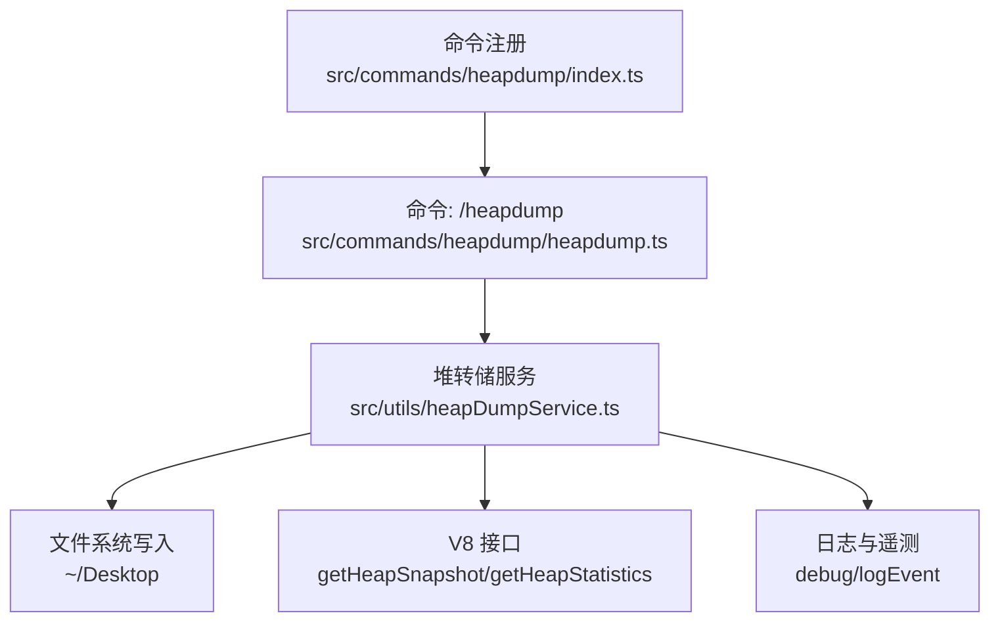
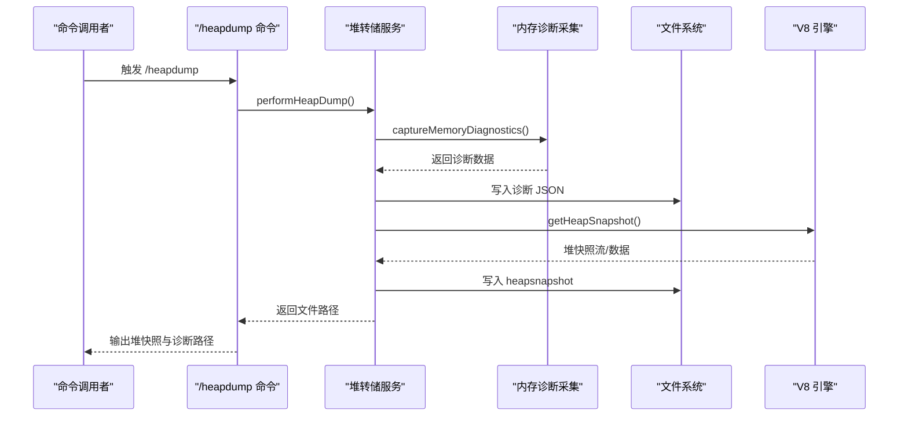
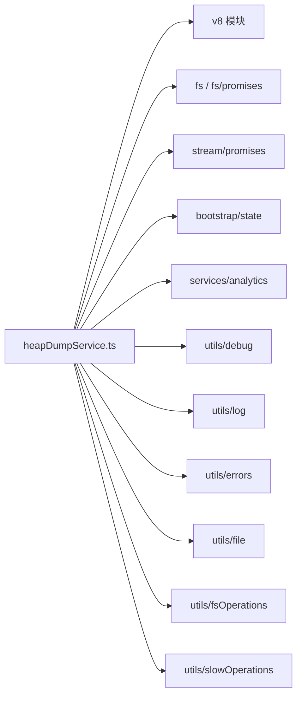

# 堆转储服务

<cite>
**本文档引用的文件**
- [src/utils/heapDumpService.ts](file://src/utils/heapDumpService.ts)
- [src/commands/heapdump/heapdump.ts](file://src/commands/heapdump/heapdump.ts)
- [src/commands/heapdump/index.ts](file://src/commands/heapdump/index.ts)
</cite>

## 目录
1. [简介](#简介)
2. [项目结构](#项目结构)
3. [核心组件](#核心组件)
4. [架构总览](#架构总览)
5. [详细组件分析](#详细组件分析)
6. [依赖分析](#依赖分析)
7. [性能考虑](#性能考虑)
8. [故障排查指南](#故障排查指南)
9. [结论](#结论)
10. [附录](#附录)

## 简介
本文件系统性介绍 Claude Code 的堆转储服务，涵盖其工作原理、使用场景、触发条件、输出文件格式与内容、以及如何结合外部工具进行内存泄漏检测与内存使用分析。该服务通过命令触发，生成 V8 堆快照（.heapsnapshot）与伴随的内存诊断 JSON 文件，并记录遥测事件，便于定位 V8 堆内泄漏或宿主进程中的原生内存泄漏。

## 项目结构
堆转储能力由命令层与服务层协同实现：
- 命令层：提供对外可见的 /heapdump 命令入口，负责调用服务并返回结果路径。
- 服务层：封装堆转储与内存诊断采集逻辑，确保在写入堆快照前先写入诊断数据，避免大堆快照序列化失败导致无诊断信息可用。



图表来源
- [src/commands/heapdump/heapdump.ts:1-18](file://src/commands/heapdump/heapdump.ts#L1-L18)
- [src/utils/heapDumpService.ts:1-304](file://src/utils/heapDumpService.ts#L1-L304)
- [src/commands/heapdump/index.ts:1-13](file://src/commands/heapdump/index.ts#L1-L13)

章节来源
- [src/commands/heapdump/heapdump.ts:1-18](file://src/commands/heapdump/heapdump.ts#L1-L18)
- [src/commands/heapdump/index.ts:1-13](file://src/commands/heapdump/index.ts#L1-L13)
- [src/utils/heapDumpService.ts:1-304](file://src/utils/heapDumpService.ts#L1-L304)

## 核心组件
- 命令处理器：接收 /heapdump 调用，调用服务执行堆转储，返回堆快照与诊断文件路径。
- 堆转储服务：采集内存诊断数据、写入诊断 JSON、生成 V8 堆快照、记录遥测事件。
- 诊断数据模型：包含时间戳、会话 ID、触发方式、增长速率、V8 堆统计、句柄与请求计数、平台与版本等。

章节来源
- [src/commands/heapdump/heapdump.ts:1-18](file://src/commands/heapdump/heapdump.ts#L1-L18)
- [src/utils/heapDumpService.ts:25-82](file://src/utils/heapDumpService.ts#L25-L82)
- [src/utils/heapDumpService.ts:88-212](file://src/utils/heapDumpService.ts#L88-L212)
- [src/utils/heapDumpService.ts:221-278](file://src/utils/heapDumpService.ts#L221-L278)

## 架构总览
堆转储流程的关键点：
- 先采集诊断数据，再写入堆快照，以保证即使堆快照序列化失败也能保留诊断信息。
- 在 Bun 运行时采用同步写入策略，避免跨线程传递超大字符串带来的额外开销；随后主动触发 GC 释放快照占用内存。
- 将诊断 JSON 与堆快照写入用户桌面目录，文件名包含会话 ID 与序号后缀（自动转储时）。



图表来源
- [src/commands/heapdump/heapdump.ts:3-17](file://src/commands/heapdump/heapdump.ts#L3-L17)
- [src/utils/heapDumpService.ts:221-278](file://src/utils/heapDumpService.ts#L221-L278)
- [src/utils/heapDumpService.ts:284-303](file://src/utils/heapDumpService.ts#L284-L303)

## 详细组件分析

### 组件一：命令层（/heapdump）
- 功能职责：作为对外接口，调用堆转储服务，处理错误并返回两个文件路径（堆快照与诊断 JSON）。
- 关键行为：
  - 成功：返回堆快照与诊断文件绝对路径。
  - 失败：返回错误文本，不抛出异常。
- 隐藏属性：命令标记为隐藏，表明其主要用于内部调试与支持场景。

章节来源
- [src/commands/heapdump/heapdump.ts:1-18](file://src/commands/heapdump/heapdump.ts#L1-L18)
- [src/commands/heapdump/index.ts:3-12](file://src/commands/heapdump/index.ts#L3-L12)

### 组件二：堆转储服务（performHeapDump）
- 功能职责：统一协调诊断采集与堆快照生成，确保诊断先行，提升可靠性。
- 关键流程：
  - 采集诊断：调用 captureMemoryDiagnostics 获取内存与运行时状态。
  - 写入诊断：以严格权限写入诊断 JSON，便于后续分析。
  - 生成快照：根据运行时选择异步流式或同步写入方式，Bun 下强制 GC 以释放快照内存。
  - 记录遥测：上报成功/失败与触发类型。
- 错误处理：捕获异常并记录，返回错误信息，同时上报失败遥测。

```mermaid
flowchart TD
START(["开始"]) --> CAP["采集内存诊断"]
CAP --> WRITE_DIAG["写入诊断 JSON"]
WRITE_DIAG --> RUNTIME{"运行时判断"}
RUNTIME --> |Bun| SYNC_WRITE["同步写入 heapsnapshot 并触发 GC"]
RUNTIME --> |Node/Bun(非同步路径)| STREAM_WRITE["流式写入 heapsnapshot"]
SYNC_WRITE --> LOG_EVT["记录成功遥测"]
STREAM_WRITE --> LOG_EVT
LOG_EVT --> END(["结束"])
```

图表来源
- [src/utils/heapDumpService.ts:221-278](file://src/utils/heapDumpService.ts#L221-L278)
- [src/utils/heapDumpService.ts:284-303](file://src/utils/heapDumpService.ts#L284-L303)

章节来源
- [src/utils/heapDumpService.ts:221-278](file://src/utils/heapDumpService.ts#L221-L278)
- [src/utils/heapDumpService.ts:284-303](file://src/utils/heapDumpService.ts#L284-L303)

### 组件三：内存诊断采集（captureMemoryDiagnostics）
- 功能职责：围绕进程内存、V8 堆统计、资源使用、活跃句柄/请求、平台特性（如 Linux smaps_rollup、文件描述符）等维度收集指标。
- 指标要点：
  - 内存用量：heapUsed、heapTotal、external、arrayBuffers、rss。
  - V8 堆统计：heapSizeLimit、mallocedMemory、peakMallocedMemory、detachedContexts、nativeContexts。
  - 增长速率：bytesPerSecond、mbPerHour。
  - 运行时状态：activeHandles、activeRequests、openFileDescriptors（Linux/macOS）。
  - 分析建议：基于阈值与计数给出潜在泄漏提示与建议。
- 可移植性：对不支持的 API（如 getHeapSpaceStatistics 在某些运行时不可用）进行降级处理。

章节来源
- [src/utils/heapDumpService.ts:88-212](file://src/utils/heapDumpService.ts#L88-L212)

### 组件四：诊断数据模型（MemoryDiagnostics）
- 结构组成：包含时间戳、会话 ID、触发方式、转储序号、运行时、内存用量、增长速率、V8 堆统计、堆空间分布、资源使用、活跃句柄/请求、文件描述符、分析结论、平台与版本等字段。
- 用途：作为堆快照生成的“元数据”，帮助分析人员快速定位泄漏类别（V8 堆 vs 原生内存）与趋势。

章节来源
- [src/utils/heapDumpService.ts:32-82](file://src/utils/heapDumpService.ts#L32-L82)

## 依赖分析
- 外部依赖
  - v8：用于获取堆统计、堆空间统计与堆快照流。
  - fs/fs/promises：文件系统读写与目录创建。
  - stream/promises：流式管道写入，保障错误时的清理。
- 内部依赖
  - bootstrap/state：获取会话 ID。
  - services/analytics：记录遥测事件。
  - utils/debug、utils/log、utils/errors：调试日志、错误转换与错误日志。
  - utils/file、utils/fsOperations：桌面目录解析与文件系统抽象。
  - utils/slowOperations：JSON 序列化工具。



图表来源
- [src/utils/heapDumpService.ts:6-23](file://src/utils/heapDumpService.ts#L6-L23)

章节来源
- [src/utils/heapDumpService.ts:6-23](file://src/utils/heapDumpService.ts#L6-L23)

## 性能考虑
- 诊断先行：在写入堆快照前先写入诊断 JSON，避免大堆快照序列化失败导致无诊断信息。
- Bun 特化：在 Bun 中采用同步写入并随后触发 GC，减少跨线程字符串克隆与内存压力。
- 流式写入：在其他运行时使用流式管道，自动处理错误清理。
- I/O 权限：诊断 JSON 使用严格权限写入，避免被意外修改。
- 遥测上报：成功/失败均上报，便于观测与告警。

章节来源
- [src/utils/heapDumpService.ts:228-253](file://src/utils/heapDumpService.ts#L228-L253)
- [src/utils/heapDumpService.ts:284-303](file://src/utils/heapDumpService.ts#L284-L303)
- [src/utils/heapDumpService.ts:259-276](file://src/utils/heapDumpService.ts#L259-L276)

## 故障排查指南
- 常见问题
  - 堆快照过大导致序列化失败：由于先写入诊断 JSON，仍可获得诊断信息；若仍失败，检查磁盘空间与权限。
  - Bun 运行时下生成超大快照：同步写入避免了字符串克隆，但可能占用较多内存；建议在空闲时段触发。
  - 诊断 JSON 写入失败：检查桌面目录权限与磁盘配额。
- 定位步骤
  - 查看命令返回的两个路径，确认诊断 JSON 是否存在。
  - 若诊断 JSON 存在而堆快照缺失，优先检查 V8 快照生成阶段的日志与错误。
  - 对比诊断 JSON 中的“潜在泄漏”列表与“建议”，结合堆快照进一步分析。
- 相关遥测
  - 事件名称：tengu_heap_dump
  - 字段：triggerManual、triggerAuto15GB、dumpNumber、success

章节来源
- [src/utils/heapDumpService.ts:259-276](file://src/utils/heapDumpService.ts#L259-L276)
- [src/utils/heapDumpService.ts:266-277](file://src/utils/heapDumpService.ts#L266-L277)

## 结论
堆转储服务通过“诊断先行”的设计，在保证诊断信息可用的前提下生成 V8 堆快照，并在 Bun 与 Node 等不同运行时下采用适配策略，兼顾稳定性与性能。配合诊断 JSON 的丰富指标与遥测事件，能够有效辅助内存泄漏检测与内存使用分析。

## 附录

### 堆转储文件格式与内容
- 堆快照（.heapsnapshot）
  - 由 V8 引擎生成，包含对象引用关系、保留集、字符串表等，供专业分析工具（如 Chrome DevTools、Edge DevTools、Heap Snapshot Viewer 等）打开与分析。
- 诊断 JSON（-diagnostics.json）
  - 包含时间戳、会话 ID、触发方式、转储序号、运行时、内存用量、增长速率、V8 堆统计、堆空间分布、资源使用、活跃句柄/请求、文件描述符、分析结论、平台与版本等字段。
  - 作用：辅助判断泄漏类别（V8 堆 vs 原生内存）、评估增长趋势、识别潜在泄漏信号（如 detachedContexts、activeHandles、nativeMemory > heap、高增长速率、过多文件描述符等）。

章节来源
- [src/utils/heapDumpService.ts:32-82](file://src/utils/heapDumpService.ts#L32-L82)
- [src/utils/heapDumpService.ts:88-212](file://src/utils/heapDumpService.ts#L88-L212)

### 使用场景与触发条件
- 手动触发
  - 通过 /heapdump 命令手动生成堆转储与诊断。
- 自动触发
  - 当前代码中定义了“auto-1.5GB”触发类型，可用于自动监控与转储（具体触发逻辑未在已读文件中体现，可在上层模块扩展）。
- 典型使用场景
  - 内存泄漏检测：结合诊断 JSON 的“潜在泄漏”列表与堆快照的对象图分析，定位无法释放的对象与引用链。
  - 内存使用分析：查看增长速率、V8 堆空间分布、原生内存占比，评估是否需要调整内存策略或优化数据结构。

章节来源
- [src/utils/heapDumpService.ts:39-40](file://src/utils/heapDumpService.ts#L39-L40)
- [src/utils/heapDumpService.ts:135-160](file://src/utils/heapDumpService.ts#L135-L160)

### 与外部内存分析工具的集成
- 工具推荐
  - Chrome DevTools/Edge DevTools：导入 .heapsnapshot 进行对象图与保留集分析。
  - Heap Snapshot Viewer：轻量级本地分析器。
  - Node.js 内置分析：结合诊断 JSON 的 V8 堆统计与堆空间分布，定位碎片化与空间膨胀。
- 集成步骤
  - 从命令返回路径复制 .heapsnapshot 与 -diagnostics.json 到分析环境。
  - 先阅读诊断 JSON 的“潜在泄漏”与“建议”，再打开堆快照进行深度分析。
  - 如在 Linux/macOS 上，可结合诊断 JSON 中的 smaps_rollup 与 openFileDescriptors，排查原生内存泄漏。

章节来源
- [src/utils/heapDumpService.ts:207-208](file://src/utils/heapDumpService.ts#L207-L208)
- [src/utils/heapDumpService.ts:113-127](file://src/utils/heapDumpService.ts#L113-L127)