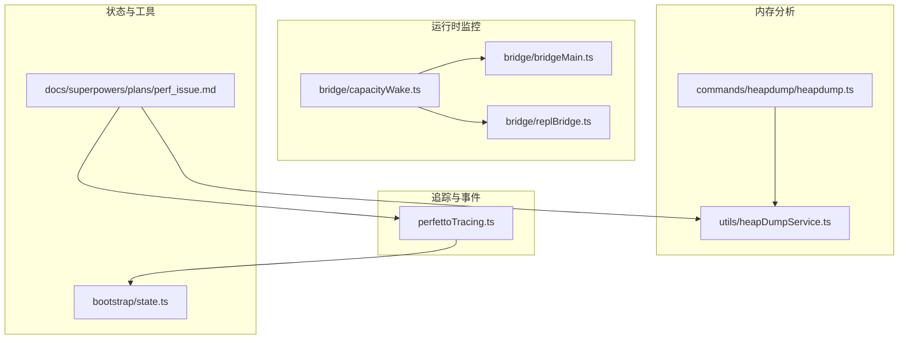
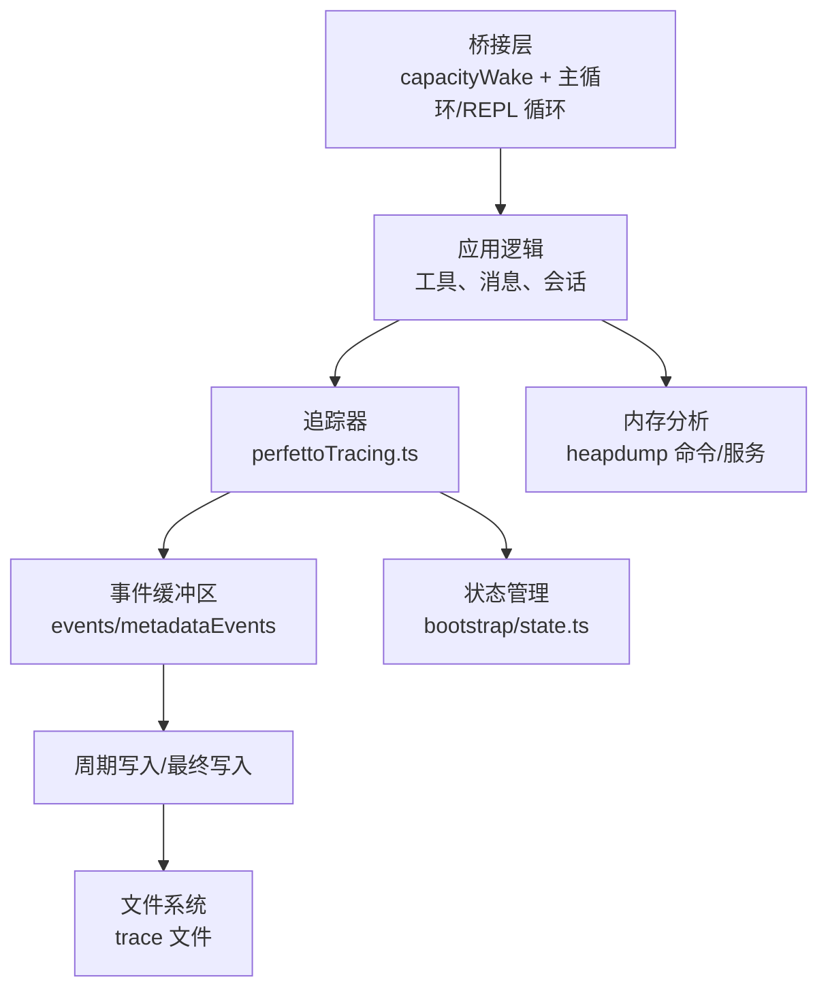
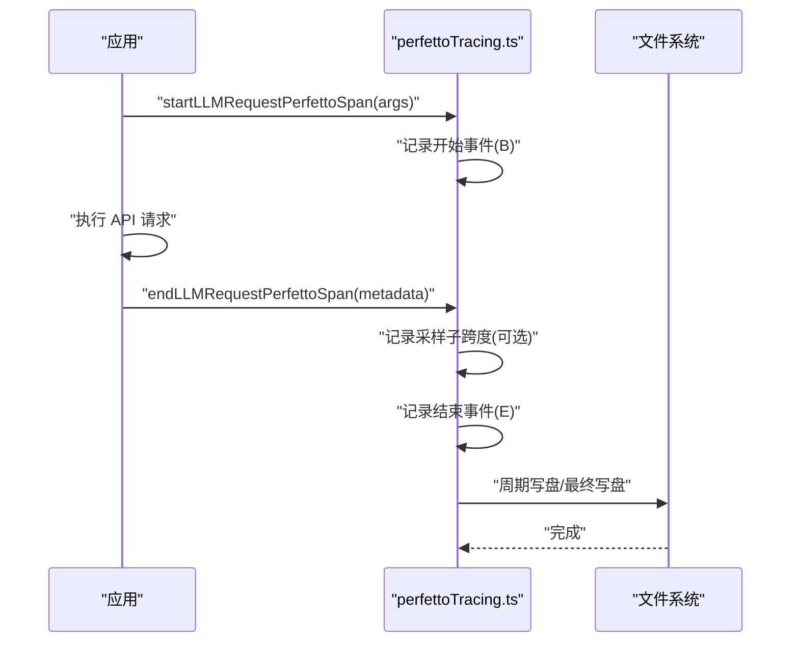
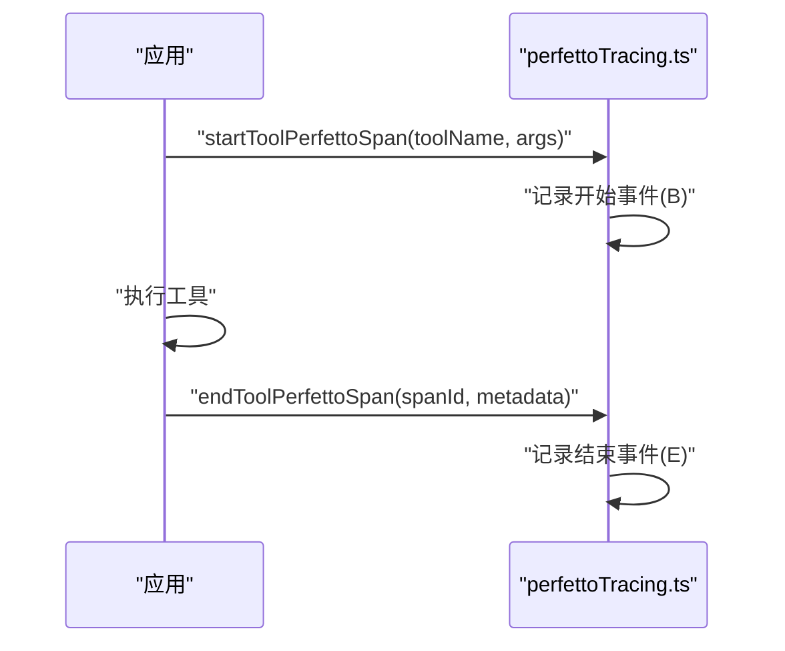
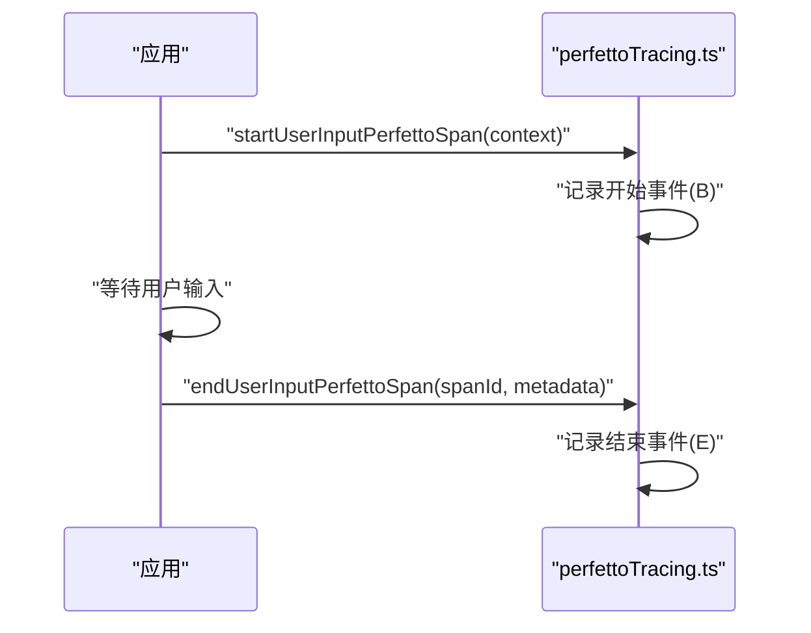
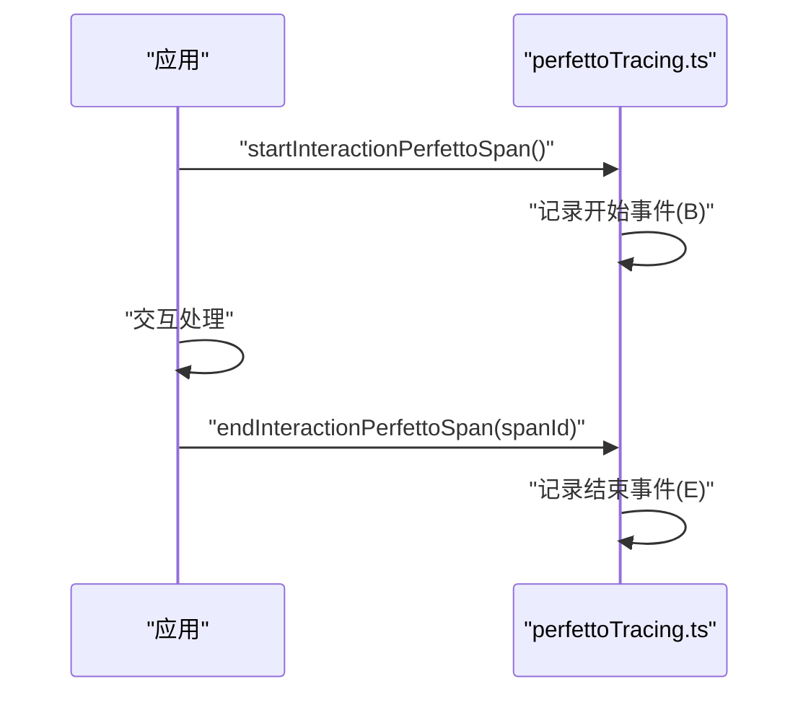
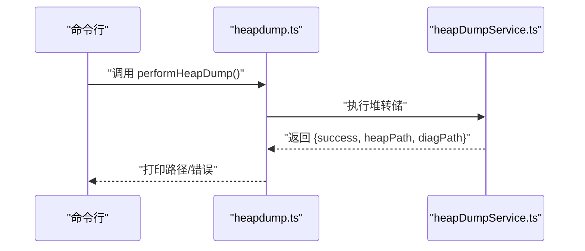
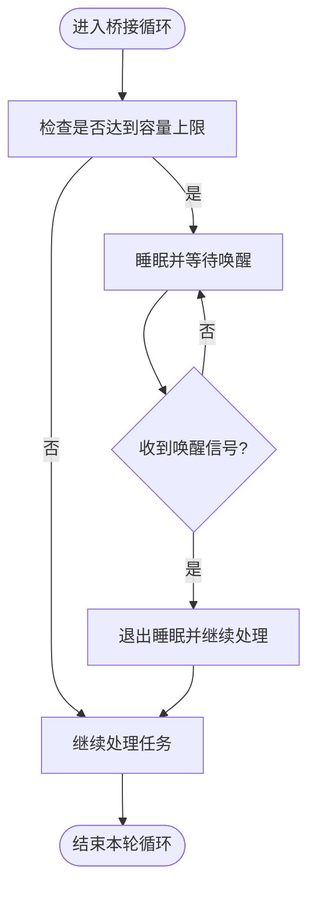
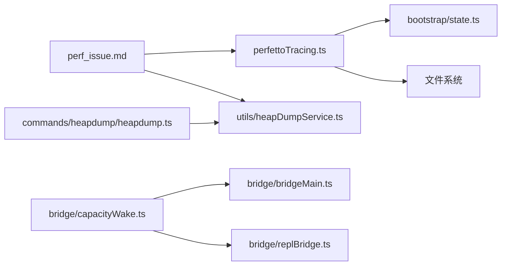

# 性能分析器

<cite>
**本文引用的文件**
- [perfettoTracing.ts](file://src/utils/telemetry/perfettoTracing.ts)
- [heapdump.ts](file://src/commands/heapdump/heapdump.ts)
- [heapDumpService.ts](file://src/utils/heapDumpService.ts)
- [state.ts](file://src/bootstrap/state.ts)
- [capacityWake.ts](file://src/bridge/capacityWake.ts)
- [replBridge.ts](file://src/bridge/replBridge.ts)
- [bridgeMain.ts](file://src/bridge/bridgeMain.ts)
- [perf_issue.md](file://docs/superpowers/plans/perf_issue.md)
</cite>

## 目录
1. [简介](#简介)
2. [项目结构](#项目结构)
3. [核心组件](#核心组件)
4. [架构总览](#架构总览)
5. [详细组件分析](#详细组件分析)
6. [依赖关系分析](#依赖关系分析)
7. [性能考量](#性能考量)
8. [故障排查指南](#故障排查指南)
9. [结论](#结论)
10. [附录](#附录)

## 简介
本文件系统性梳理 Claude Code 的性能分析能力与实现，覆盖以下方面：
- 运行时性能追踪：基于 Perfetto 的事件追踪（事件流、采样、元数据）。
- CPU 性能分析：通过事件时序定位长耗时阶段、热点函数与瓶颈。
- 内存使用分析：堆转储与诊断输出，辅助泄漏与碎片问题定位。
- 运行时监控：事件循环与桥接层容量唤醒机制，异步与并发行为观测。
- 实践建议：如何解读追踪结果并制定优化策略。

## 项目结构
与性能分析相关的关键模块分布如下：
- 追踪与事件生成：src/utils/telemetry/perfettoTracing.ts
- 堆转储命令入口：src/commands/heapdump/heapdump.ts
- 堆转储服务：src/utils/heapDumpService.ts
- 慢操作状态管理：src/bootstrap/state.ts
- 桥接层容量唤醒：src/bridge/capacityWake.ts
- 桥接主循环与 REPL 循环：src/bridge/replBridge.ts、src/bridge/bridgeMain.ts
- 性能问题模板与定位思路：docs/superpowers/plans/perf_issue.md

**图表来源**
- [perfettoTracing.ts](file://src/utils/telemetry/perfettoTracing.ts)
- [heapdump.ts](file://src/commands/heapdump/heapdump.ts)
- [heapDumpService.ts](file://src/utils/heapDumpService.ts)
- [state.ts](file://src/bootstrap/state.ts)
- [capacityWake.ts](file://src/bridge/capacityWake.ts)
- [replBridge.ts](file://src/bridge/replBridge.ts)
- [bridgeMain.ts](file://src/bridge/bridgeMain.ts)
- [perf_issue.md](file://docs/superpowers/plans/perf_issue.md)

**章节来源**
- [perfettoTracing.ts](file://src/utils/telemetry/perfettoTracing.ts)
- [heapdump.ts](file://src/commands/heapdump/heapdump.ts)
- [heapDumpService.ts](file://src/utils/heapDumpService.ts)
- [state.ts](file://src/bootstrap/state.ts)
- [capacityWake.ts](file://src/bridge/capacityWake.ts)
- [replBridge.ts](file://src/bridge/replBridge.ts)
- [bridgeMain.ts](file://src/bridge/bridgeMain.ts)
- [perf_issue.md](file://docs/superpowers/plans/perf_issue.md)

## 核心组件
- Perfetto 事件追踪器：提供 API 调用、工具执行、用户输入等待、交互等事件的开始/结束记录，并支持周期性落盘与最终落盘。
- 慢操作状态：维护一个带 TTL 的慢操作列表，用于 UI 层展示与轮询更新。
- 堆转储：提供命令入口与服务实现，生成堆快照与诊断信息。
- 桥接层容量唤醒：在高负载或队列满时阻塞并可被唤醒，便于观察事件循环压力。
- 文档化的问题定位流程：提供系统化的性能问题排查步骤与关注点。

**章节来源**
- [perfettoTracing.ts](file://src/utils/telemetry/perfettoTracing.ts)
- [state.ts](file://src/bootstrap/state.ts)
- [heapdump.ts](file://src/commands/heapdump/heapdump.ts)
- [heapDumpService.ts](file://src/utils/heapDumpService.ts)
- [capacityWake.ts](file://src/bridge/capacityWake.ts)
- [perf_issue.md](file://docs/superpowers/plans/perf_issue.md)

## 架构总览
下图展示了性能分析器在系统中的位置与交互：

**图表来源**
- [perfettoTracing.ts](file://src/utils/telemetry/perfettoTracing.ts)
- [heapdump.ts](file://src/commands/heapdump/heapdump.ts)
- [heapDumpService.ts](file://src/utils/heapDumpService.ts)
- [state.ts](file://src/bootstrap/state.ts)
- [capacityWake.ts](file://src/bridge/capacityWake.ts)
- [replBridge.ts](file://src/bridge/replBridge.ts)
- [bridgeMain.ts](file://src/bridge/bridgeMain.ts)

## 详细组件分析

### Perfetto 事件追踪器
- 设计要点
  - 事件模型：采用 Perfetto 事件格式，包含名称、类别、时间戳、进程/线程标识、参数与阶段标记（开始/结束/元数据）。
  - 全局状态：启用开关、输出路径、事件数组上限、挂起跨度集合、代理注册表、启动时间、写盘定时器与陈旧跨度清理定时器。
  - 代理层次：每个代理映射到唯一进程/线程 ID，支持父子关系元数据，便于 UI 分组与层级展示。
  - 事件边界：以“开始/结束”成对事件记录跨度；同时支持“采样”子跨度，用于细粒度统计（如首 token 到末 token 的采样窗口）。
  - 写盘策略：周期性写盘（避免长时间驻留内存），并在最终退出时进行一次完整落盘，保证崩溃场景下的数据完整性。
  - 容错：写盘异常仅记录日志，不中断会话；后续周期写盘或最终写盘会重试。

- 关键流程（API 调用）

**图表来源**
- [perfettoTracing.ts](file://src/utils/telemetry/perfettoTracing.ts)

- 关键流程（工具执行）

**图表来源**
- [perfettoTracing.ts](file://src/utils/telemetry/perfettoTracing.ts)

- 关键流程（用户输入等待）

**图表来源**
- [perfettoTracing.ts](file://src/utils/telemetry/perfettoTracing.ts)

- 关键流程（交互）

**图表来源**
- [perfettoTracing.ts](file://src/utils/telemetry/perfettoTracing.ts)

- 数据结构与复杂度
  - 事件数组上限：固定上限，命中时按规则淘汰旧事件，摊销 O(1)。
  - 挂起跨度：Map 结构，按 spanId 快速查找与删除，平均 O(1)。
  - 代理注册：Map 结构，按 agentId 映射进程/线程 ID，平均 O(1)。
  - 写盘：I/O 操作，受磁盘吞吐限制；周期写盘降低峰值压力。

- 采样频率与数据收集
  - 采样窗口：通过“首 token 结束时刻”到“请求结束时刻”的实际时长计算采样持续时间，避免将预热/setup 时间计入采样。
  - 参数：输出 token 数、每秒输出 token 数等，便于评估吞吐与稳定性。

- 分析算法与热点识别
  - 时序聚合：按类别（api/tool/user_input/interaction）与代理维度聚合事件，识别长耗时跨度。
  - 瓶颈定位：结合采样子跨度与总体跨度，定位首 token 延迟、推理阶段、工具执行、用户等待等关键环节的占比与异常波动。

**章节来源**
- [perfettoTracing.ts](file://src/utils/telemetry/perfettoTracing.ts)

### 慢操作状态管理
- 设计要点
  - 维护一个带 TTL 的慢操作列表，定期过滤过期项，返回稳定引用以减少渲染抖动。
  - 提供主线程代理类型与远程模式查询接口，便于 UI 展示当前运行环境。

- 复杂度
  - 过滤与判定：O(n)，n 为当前慢操作数量；由于 TTL 较短且列表规模有限，开销可忽略。

**章节来源**
- [state.ts](file://src/bootstrap/state.ts)

### 堆转储与内存分析
- 命令入口
  - 通过命令触发堆转储，返回堆快照路径与诊断路径；失败时返回错误信息。
- 服务实现
  - 执行堆转储并返回成功/失败状态与路径信息；与追踪器协同用于定位内存泄漏与异常增长。

**图表来源**
- [heapdump.ts](file://src/commands/heapdump/heapdump.ts)
- [heapDumpService.ts](file://src/utils/heapDumpService.ts)

**章节来源**
- [heapdump.ts](file://src/commands/heapdump/heapdump.ts)
- [heapDumpService.ts](file://src/utils/heapDumpService.ts)

### 运行时监控：事件循环与并发
- 容量唤醒
  - 在桥接主循环与 REPL 循环中，当达到容量上限时进入睡眠；当外部信号或容量释放时被唤醒，避免忙等与资源争用。
- 事件循环压力观测
  - 结合容量唤醒与追踪器事件，可观察到在高负载场景下事件循环的休眠/唤醒节奏，从而判断是否存在阻塞或饥饿问题。

**图表来源**
- [capacityWake.ts](file://src/bridge/capacityWake.ts)
- [replBridge.ts](file://src/bridge/replBridge.ts)
- [bridgeMain.ts](file://src/bridge/bridgeMain.ts)

**章节来源**
- [capacityWake.ts](file://src/bridge/capacityWake.ts)
- [replBridge.ts](file://src/bridge/replBridge.ts)
- [bridgeMain.ts](file://src/bridge/bridgeMain.ts)

## 依赖关系分析
- 组件耦合
  - 追踪器与状态管理：追踪器事件可用于驱动 UI 展示（如慢操作列表），二者通过状态管理模块解耦。
  - 追踪器与桥接层：桥接层的事件循环压力可通过追踪器事件与容量唤醒机制共同反映。
  - 堆转储与追踪器：两者均可作为性能问题定位的独立手段，亦可在同一会话中配合使用。
- 外部依赖
  - Perfetto 事件格式与 UI 工具链；文件系统写盘；Node.js I/O 与定时器。

**图表来源**
- [perfettoTracing.ts](file://src/utils/telemetry/perfettoTracing.ts)
- [state.ts](file://src/bootstrap/state.ts)
- [heapdump.ts](file://src/commands/heapdump/heapdump.ts)
- [heapDumpService.ts](file://src/utils/heapDumpService.ts)
- [capacityWake.ts](file://src/bridge/capacityWake.ts)
- [replBridge.ts](file://src/bridge/replBridge.ts)
- [bridgeMain.ts](file://src/bridge/bridgeMain.ts)
- [perf_issue.md](file://docs/superpowers/plans/perf_issue.md)

**章节来源**
- [perfettoTracing.ts](file://src/utils/telemetry/perfettoTracing.ts)
- [state.ts](file://src/bootstrap/state.ts)
- [heapdump.ts](file://src/commands/heapdump/heapdump.ts)
- [heapDumpService.ts](file://src/utils/heapDumpService.ts)
- [capacityWake.ts](file://src/bridge/capacityWake.ts)
- [replBridge.ts](file://src/bridge/replBridge.ts)
- [bridgeMain.ts](file://src/bridge/bridgeMain.ts)
- [perf_issue.md](file://docs/superpowers/plans/perf_issue.md)

## 性能考量
- 采样与开销
  - 事件数量与大小：事件数组上限与周期写盘策略控制内存占用与 I/O 峰值。
  - 采样窗口：仅在存在有效首 token 到结束时刻的时间差时记录采样跨度，避免空转开销。
- 写盘策略
  - 周期写盘降低单次 I/O 压力；最终写盘确保崩溃场景的数据完整性。
- 并发与阻塞
  - 容量唤醒机制避免事件循环忙等；结合追踪器事件可观察到并发瓶颈与调度延迟。
- 内存分析
  - 堆转储适合发现异常增长与泄漏，需结合追踪器事件定位发生时机与上下文。

[本节为通用指导，无需列出具体文件来源]

## 故障排查指南
- 追踪文件缺失或写入失败
  - 现象：最终写盘日志显示失败或未生成 trace 文件。
  - 排查：确认输出路径权限、磁盘空间；查看周期写盘日志；检查异常捕获与重试逻辑。
- 事件过多导致内存膨胀
  - 现象：事件数组接近上限或内存占用上升。
  - 排查：调整采样策略、减少非必要事件、缩短会话时长；确认周期写盘是否正常触发。
- 慢操作列表为空或不更新
  - 现象：UI 不显示慢操作或刷新不生效。
  - 排查：确认 TTL 设置与过滤逻辑；检查状态管理模块的引用稳定性。
- 堆转储失败
  - 现象：命令返回错误或无路径输出。
  - 排查：确认服务实现返回的成功标志与路径；检查权限与磁盘空间。

**章节来源**
- [perfettoTracing.ts](file://src/utils/telemetry/perfettoTracing.ts)
- [state.ts](file://src/bootstrap/state.ts)
- [heapdump.ts](file://src/commands/heapdump/heapdump.ts)
- [heapDumpService.ts](file://src/utils/heapDumpService.ts)

## 结论
Claude Code 的性能分析体系以 Perfetto 事件追踪为核心，辅以内存堆转储与桥接层容量唤醒机制，形成从 CPU 时序到内存状态再到并发调度的全链路可观测能力。通过规范化的事件采集、合理的写盘策略与 TTL 管理，既满足调试需求又兼顾运行时开销。建议在定位性能问题时，优先结合追踪事件与慢操作状态，再配合堆转储与桥接层行为进行交叉验证，最终形成可落地的优化方案。

[本节为总结性内容，无需列出具体文件来源]

## 附录
- 性能问题定位流程参考：docs/superpowers/plans/perf_issue.md
- 追踪器 API 参考：startLLMRequestPerfettoSpan、endLLMRequestPerfettoSpan、startToolPerfettoSpan、endToolPerfettoSpan、startUserInputPerfettoSpan、endUserInputPerfettoSpan、startInteractionPerfettoSpan、endInteractionPerfettoSpan、isPerfettoTracingEnabled、registerAgent、unregisterAgent、writePerfettoTrace、writePerfettoTraceSync、periodicWrite、closeOpenSpans
- 堆转储命令参考：commands/heapdump/heapdump.ts
- 堆转储服务参考：utils/heapDumpService.ts
- 慢操作状态参考：bootstrap/state.ts 中的 getSlowOperations、getMainThreadAgentType、setMainThreadAgentType、getIsRemoteMode
- 桥接层容量唤醒参考：bridge/capacityWake.ts
- 桥接主循环与 REPL 循环参考：bridge/bridgeMain.ts、bridge/replBridge.ts

**章节来源**
- [perf_issue.md](file://docs/superpowers/plans/perf_issue.md)
- [perfettoTracing.ts](file://src/utils/telemetry/perfettoTracing.ts)
- [heapdump.ts](file://src/commands/heapdump/heapdump.ts)
- [heapDumpService.ts](file://src/utils/heapDumpService.ts)
- [state.ts](file://src/bootstrap/state.ts)
- [capacityWake.ts](file://src/bridge/capacityWake.ts)
- [bridgeMain.ts](file://src/bridge/bridgeMain.ts)
- [replBridge.ts](file://src/bridge/replBridge.ts)