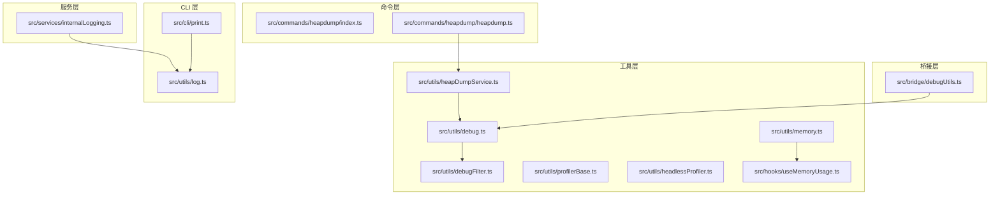
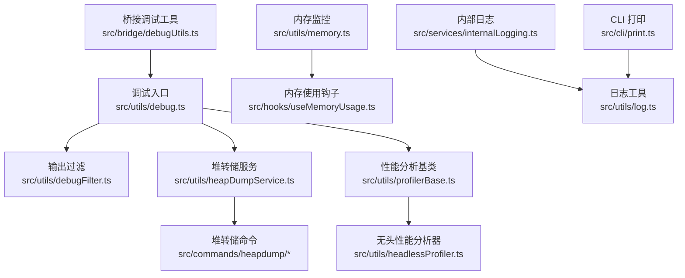
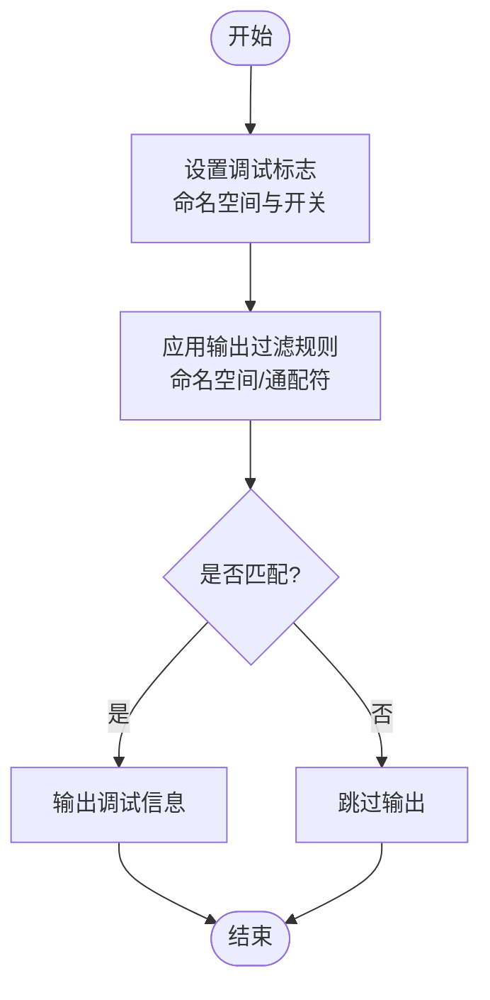
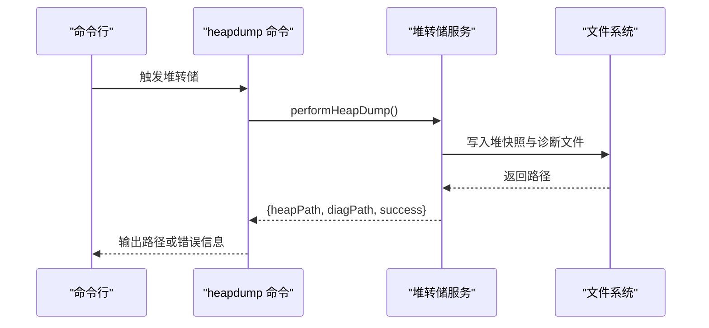
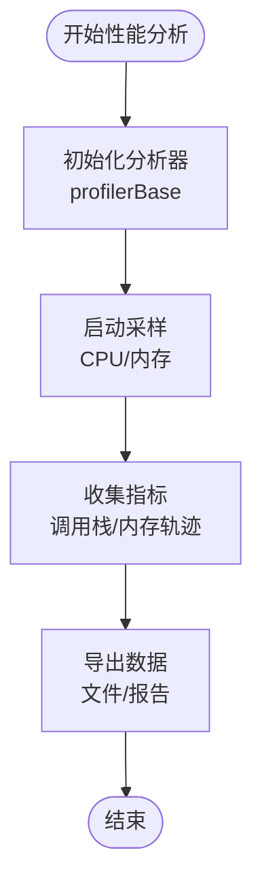
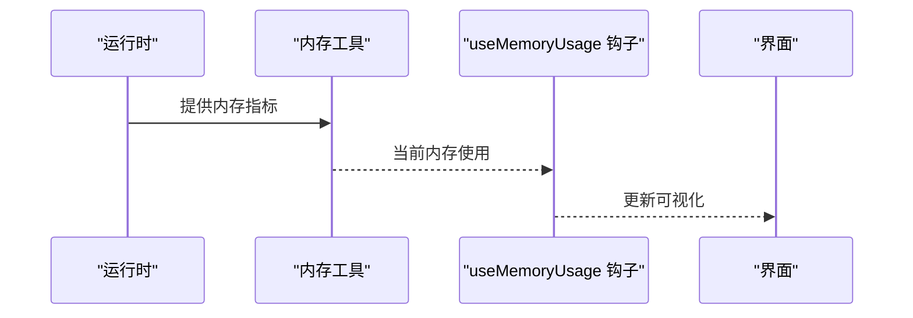
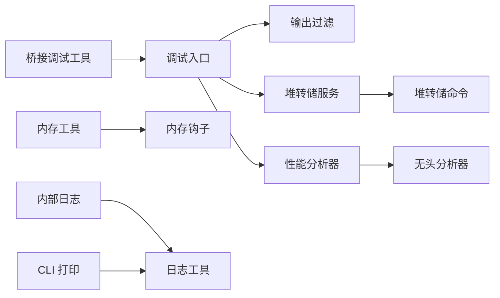

# 调试工具

<cite>
**本文引用的文件**
- [src/utils/debug.ts](file://src/utils/debug.ts)
- [src/utils/debugFilter.ts](file://src/utils/debugFilter.ts)
- [src/bridge/debugUtils.ts](file://src/bridge/debugUtils.ts)
- [src/utils/heapDumpService.ts](file://src/utils/heapDumpService.ts)
- [src/commands/heapdump/heapdump.ts](file://src/commands/heapdump/heapdump.ts)
- [src/commands/heapdump/index.ts](file://src/commands/heapdump/index.ts)
- [src/utils/profilerBase.ts](file://src/utils/profilerBase.ts)
- [src/utils/headlessProfiler.ts](file://src/utils/headlessProfiler.ts)
- [src/utils/memory.ts](file://src/utils/memory.ts)
- [src/hooks/useMemoryUsage.ts](file://src/hooks/useMemoryUsage.ts)
- [src/services/internalLogging.ts](file://src/services/internalLogging.ts)
- [src/cli/print.ts](file://src/cli/print.ts)
- [src/utils/log.ts](file://src/utils/log.ts)
</cite>

## 目录
1. [简介](#简介)
2. [项目结构](#项目结构)
3. [核心组件](#核心组件)
4. [架构总览](#架构总览)
5. [详细组件分析](#详细组件分析)
6. [依赖关系分析](#依赖关系分析)
7. [性能考虑](#性能考虑)
8. [故障排查指南](#故障排查指南)
9. [结论](#结论)
10. [附录](#附录)

## 简介
本文件面向 Claude Code 的调试工具体系，系统性说明以下能力与使用方法：
- 内置调试系统：调试标志的设置与调试输出过滤
- 堆转储服务：内存快照生成、分析与内存泄漏检测
- 性能分析器：CPU 性能分析、内存使用分析与运行时性能监控
- 断点调试、条件断点与表达式求值
- 复杂异步代码与并发问题的调试技巧

目标是帮助开发者在本地开发与生产环境中快速定位问题、优化性能并稳定运行。

## 项目结构
调试相关功能主要分布在以下模块：
- 工具层（utils）：通用调试、日志、内存与性能分析基础能力
- 桥接层（bridge）：桥接进程中的调试辅助工具
- 命令层（commands）：对外暴露的调试命令（如堆转储）
- 服务层（services）：内部日志与诊断输出
- CLI 层（cli）：终端打印与格式化输出

图表来源
- [src/utils/debug.ts:1-200](file://src/utils/debug.ts#L1-L200)
- [src/utils/debugFilter.ts:1-120](file://src/utils/debugFilter.ts#L1-L120)
- [src/utils/heapDumpService.ts:1-200](file://src/utils/heapDumpService.ts#L1-L200)
- [src/utils/profilerBase.ts:1-150](file://src/utils/profilerBase.ts#L1-L150)
- [src/utils/headlessProfiler.ts:1-120](file://src/utils/headlessProfiler.ts#L1-L120)
- [src/utils/memory.ts:1-180](file://src/utils/memory.ts#L1-L180)
- [src/hooks/useMemoryUsage.ts:1-120](file://src/hooks/useMemoryUsage.ts#L1-L120)
- [src/bridge/debugUtils.ts:1-120](file://src/bridge/debugUtils.ts#L1-L120)
- [src/commands/heapdump/index.ts:1-12](file://src/commands/heapdump/index.ts#L1-L12)
- [src/commands/heapdump/heapdump.ts:1-17](file://src/commands/heapdump/heapdump.ts#L1-L17)
- [src/services/internalLogging.ts:1-120](file://src/services/internalLogging.ts#L1-L120)
- [src/cli/print.ts:1-120](file://src/cli/print.ts#L1-L120)
- [src/utils/log.ts:1-120](file://src/utils/log.ts#L1-L120)

章节来源
- [src/utils/debug.ts:1-200](file://src/utils/debug.ts#L1-L200)
- [src/utils/debugFilter.ts:1-120](file://src/utils/debugFilter.ts#L1-L120)
- [src/utils/heapDumpService.ts:1-200](file://src/utils/heapDumpService.ts#L1-L200)
- [src/utils/profilerBase.ts:1-150](file://src/utils/profilerBase.ts#L1-L150)
- [src/utils/headlessProfiler.ts:1-120](file://src/utils/headlessProfiler.ts#L1-L120)
- [src/utils/memory.ts:1-180](file://src/utils/memory.ts#L1-L180)
- [src/hooks/useMemoryUsage.ts:1-120](file://src/hooks/useMemoryUsage.ts#L1-L120)
- [src/bridge/debugUtils.ts:1-120](file://src/bridge/debugUtils.ts#L1-L120)
- [src/commands/heapdump/index.ts:1-12](file://src/commands/heapdump/index.ts#L1-L12)
- [src/commands/heapdump/heapdump.ts:1-17](file://src/commands/heapdump/heapdump.ts#L1-L17)
- [src/services/internalLogging.ts:1-120](file://src/services/internalLogging.ts#L1-L120)
- [src/cli/print.ts:1-120](file://src/cli/print.ts#L1-L120)
- [src/utils/log.ts:1-120](file://src/utils/log.ts#L1-L120)

## 核心组件
- 调试系统与输出过滤
  - 调试开关与命名空间：通过统一的调试入口控制不同模块的输出
  - 输出过滤：基于命名空间与通配符规则，仅显示关注的调试信息
- 堆转储服务
  - 生成堆快照到桌面，并返回诊断路径
  - 支持错误回退与结果报告
- 性能分析器
  - 基于通用性能分析基类实现 CPU 与内存分析
  - 提供无头模式下的性能采集与导出
- 内存监控
  - 运行时内存指标采集与可视化钩子
- 桥接调试工具
  - 桥接进程中的调试辅助函数
- 内部日志与 CLI 打印
  - 终端输出与格式化打印

章节来源
- [src/utils/debug.ts:1-200](file://src/utils/debug.ts#L1-L200)
- [src/utils/debugFilter.ts:1-120](file://src/utils/debugFilter.ts#L1-L120)
- [src/utils/heapDumpService.ts:1-200](file://src/utils/heapDumpService.ts#L1-L200)
- [src/utils/profilerBase.ts:1-150](file://src/utils/profilerBase.ts#L1-L150)
- [src/utils/headlessProfiler.ts:1-120](file://src/utils/headlessProfiler.ts#L1-L120)
- [src/utils/memory.ts:1-180](file://src/utils/memory.ts#L1-L180)
- [src/hooks/useMemoryUsage.ts:1-120](file://src/hooks/useMemoryUsage.ts#L1-L120)
- [src/bridge/debugUtils.ts:1-120](file://src/bridge/debugUtils.ts#L1-L120)
- [src/services/internalLogging.ts:1-120](file://src/services/internalLogging.ts#L1-L120)
- [src/cli/print.ts:1-120](file://src/cli/print.ts#L1-L120)
- [src/utils/log.ts:1-120](file://src/utils/log.ts#L1-L120)

## 架构总览
调试工具的整体架构围绕“统一调试入口 + 命名空间过滤 + 堆转储 + 性能分析 + 内存监控 + 桥接支持 + 日志输出”展开。

图表来源
- [src/utils/debug.ts:1-200](file://src/utils/debug.ts#L1-L200)
- [src/utils/debugFilter.ts:1-120](file://src/utils/debugFilter.ts#L1-L120)
- [src/utils/heapDumpService.ts:1-200](file://src/utils/heapDumpService.ts#L1-L200)
- [src/commands/heapdump/index.ts:1-12](file://src/commands/heapdump/index.ts#L1-L12)
- [src/commands/heapdump/heapdump.ts:1-17](file://src/commands/heapdump/heapdump.ts#L1-L17)
- [src/utils/profilerBase.ts:1-150](file://src/utils/profilerBase.ts#L1-L150)
- [src/utils/headlessProfiler.ts:1-120](file://src/utils/headlessProfiler.ts#L1-L120)
- [src/utils/memory.ts:1-180](file://src/utils/memory.ts#L1-L180)
- [src/hooks/useMemoryUsage.ts:1-120](file://src/hooks/useMemoryUsage.ts#L1-L120)
- [src/bridge/debugUtils.ts:1-120](file://src/bridge/debugUtils.ts#L1-L120)
- [src/services/internalLogging.ts:1-120](file://src/services/internalLogging.ts#L1-L120)
- [src/utils/log.ts:1-120](file://src/utils/log.ts#L1-L120)
- [src/cli/print.ts:1-120](file://src/cli/print.ts#L1-L120)

## 详细组件分析

### 调试系统与输出过滤
- 调试标志设置
  - 在调试入口中定义命名空间与开关，按需启用特定模块的调试输出
  - 可通过环境变量或配置项控制全局调试级别
- 输出过滤
  - 使用命名空间匹配与通配符规则，仅输出感兴趣的调试信息
  - 支持多命名空间组合与精确匹配，避免噪声干扰
- 实践建议
  - 将高频模块的调试输出关闭，仅在定位问题时临时开启
  - 使用通配符快速筛选相关模块，例如 “bridge:*” 或 “perf:*”

图表来源
- [src/utils/debug.ts:1-200](file://src/utils/debug.ts#L1-L200)
- [src/utils/debugFilter.ts:1-120](file://src/utils/debugFilter.ts#L1-L120)

章节来源
- [src/utils/debug.ts:1-200](file://src/utils/debug.ts#L1-L200)
- [src/utils/debugFilter.ts:1-120](file://src/utils/debugFilter.ts#L1-L120)

### 堆转储服务与内存泄漏检测
- 快照生成
  - 通过命令触发堆转储，将快照保存至桌面并返回诊断路径
  - 若生成失败，返回错误信息以便快速定位原因
- 分析与泄漏检测
  - 结合诊断路径进行内存分析，识别异常增长与未释放对象
  - 关注长时间运行进程中的持续增长，作为潜在泄漏信号
- 使用流程

图表来源
- [src/commands/heapdump/heapdump.ts:1-17](file://src/commands/heapdump/heapdump.ts#L1-L17)
- [src/utils/heapDumpService.ts:1-200](file://src/utils/heapDumpService.ts#L1-L200)

章节来源
- [src/commands/heapdump/index.ts:1-12](file://src/commands/heapdump/index.ts#L1-L12)
- [src/commands/heapdump/heapdump.ts:1-17](file://src/commands/heapdump/heapdump.ts#L1-L17)
- [src/utils/heapDumpService.ts:1-200](file://src/utils/heapDumpService.ts#L1-L200)

### 性能分析器工作原理
- CPU 性能分析
  - 基于性能分析基类，启动采样周期，收集调用栈与热点函数
  - 导出采样数据用于可视化与热点定位
- 内存使用分析
  - 记录堆内存分配与回收轨迹，识别峰值与增长趋势
  - 配合堆转储进行深度分析
- 运行时性能监控
  - 无头模式下自动采集与导出，便于 CI/CD 中的回归检测
- 关键流程

图表来源
- [src/utils/profilerBase.ts:1-150](file://src/utils/profilerBase.ts#L1-L150)
- [src/utils/headlessProfiler.ts:1-120](file://src/utils/headlessProfiler.ts#L1-L120)

章节来源
- [src/utils/profilerBase.ts:1-150](file://src/utils/profilerBase.ts#L1-L150)
- [src/utils/headlessProfiler.ts:1-120](file://src/utils/headlessProfiler.ts#L1-L120)

### 内存监控与可视化
- 指标采集
  - 从运行时获取内存使用情况，包含堆、非堆与系统内存
- 可视化钩子
  - 提供 React 钩子以在界面中展示内存趋势与峰值
- 应用场景
  - 长时间任务监控、内存泄漏预警与容量规划

图表来源
- [src/utils/memory.ts:1-180](file://src/utils/memory.ts#L1-L180)
- [src/hooks/useMemoryUsage.ts:1-120](file://src/hooks/useMemoryUsage.ts#L1-L120)

章节来源
- [src/utils/memory.ts:1-180](file://src/utils/memory.ts#L1-L180)
- [src/hooks/useMemoryUsage.ts:1-120](file://src/hooks/useMemoryUsage.ts#L1-L120)

### 桥接进程调试工具
- 功能概述
  - 提供桥接进程中的调试辅助函数，便于跨进程问题定位
- 典型用途
  - 消息传递、权限回调、状态同步等环节的调试

章节来源
- [src/bridge/debugUtils.ts:1-120](file://src/bridge/debugUtils.ts#L1-L120)

### 内部日志与 CLI 输出
- 内部日志
  - 通过内部日志服务统一管理日志级别与输出
- CLI 打印
  - 提供格式化打印接口，确保调试信息在终端中清晰可读
- 协同机制
  - 日志工具与 CLI 打印共同构成调试输出链路

章节来源
- [src/services/internalLogging.ts:1-120](file://src/services/internalLogging.ts#L1-L120)
- [src/cli/print.ts:1-120](file://src/cli/print.ts#L1-L120)
- [src/utils/log.ts:1-120](file://src/utils/log.ts#L1-L120)

## 依赖关系分析
- 组件耦合
  - 调试入口与输出过滤解耦，便于独立演进
  - 堆转储服务与命令层松耦合，便于扩展其他触发方式
  - 性能分析器与无头模式分离，适配不同运行环境
- 外部依赖
  - 文件系统用于持久化堆快照与诊断文件
  - 运行时 API 提供内存与性能指标
- 潜在循环依赖
  - 各模块通过工具层聚合，避免直接相互引用

图表来源
- [src/utils/debug.ts:1-200](file://src/utils/debug.ts#L1-L200)
- [src/utils/debugFilter.ts:1-120](file://src/utils/debugFilter.ts#L1-L120)
- [src/utils/heapDumpService.ts:1-200](file://src/utils/heapDumpService.ts#L1-L200)
- [src/commands/heapdump/index.ts:1-12](file://src/commands/heapdump/index.ts#L1-L12)
- [src/commands/heapdump/heapdump.ts:1-17](file://src/commands/heapdump/heapdump.ts#L1-L17)
- [src/utils/profilerBase.ts:1-150](file://src/utils/profilerBase.ts#L1-L150)
- [src/utils/headlessProfiler.ts:1-120](file://src/utils/headlessProfiler.ts#L1-L120)
- [src/utils/memory.ts:1-180](file://src/utils/memory.ts#L1-L180)
- [src/hooks/useMemoryUsage.ts:1-120](file://src/hooks/useMemoryUsage.ts#L1-L120)
- [src/bridge/debugUtils.ts:1-120](file://src/bridge/debugUtils.ts#L1-L120)
- [src/services/internalLogging.ts:1-120](file://src/services/internalLogging.ts#L1-L120)
- [src/utils/log.ts:1-120](file://src/utils/log.ts#L1-L120)
- [src/cli/print.ts:1-120](file://src/cli/print.ts#L1-L120)

章节来源
- [src/utils/debug.ts:1-200](file://src/utils/debug.ts#L1-L200)
- [src/utils/debugFilter.ts:1-120](file://src/utils/debugFilter.ts#L1-L120)
- [src/utils/heapDumpService.ts:1-200](file://src/utils/heapDumpService.ts#L1-L200)
- [src/commands/heapdump/index.ts:1-12](file://src/commands/heapdump/index.ts#L1-L12)
- [src/commands/heapdump/heapdump.ts:1-17](file://src/commands/heapdump/heapdump.ts#L1-L17)
- [src/utils/profilerBase.ts:1-150](file://src/utils/profilerBase.ts#L1-L150)
- [src/utils/headlessProfiler.ts:1-120](file://src/utils/headlessProfiler.ts#L1-L120)
- [src/utils/memory.ts:1-180](file://src/utils/memory.ts#L1-L180)
- [src/hooks/useMemoryUsage.ts:1-120](file://src/hooks/useMemoryUsage.ts#L1-L120)
- [src/bridge/debugUtils.ts:1-120](file://src/bridge/debugUtils.ts#L1-L120)
- [src/services/internalLogging.ts:1-120](file://src/services/internalLogging.ts#L1-L120)
- [src/utils/log.ts:1-120](file://src/utils/log.ts#L1-L120)
- [src/cli/print.ts:1-120](file://src/cli/print.ts#L1-L120)

## 性能考虑
- 调试输出开销
  - 在高负载场景下谨慎开启调试输出，避免 I/O 与字符串拼接带来的额外开销
- 堆转储频率
  - 堆转储对运行时有暂停影响，建议在低峰期或受控条件下执行
- 性能分析采样
  - 采样周期与线程数需平衡精度与开销；无头模式下建议缩短采样窗口
- 内存监控
  - 定期采样与平滑处理有助于降低抖动对判断的影响

## 故障排查指南
- 调试输出为空
  - 检查调试标志是否正确设置，确认命名空间与过滤规则
  - 排查是否被更严格的过滤规则屏蔽
- 堆转储失败
  - 查看返回的错误信息，确认磁盘空间与权限
  - 检查是否存在长时间占用的句柄导致写入失败
- 性能分析无数据
  - 确认分析器已正确初始化并处于运行状态
  - 检查导出路径与文件权限
- 内存监控异常
  - 对比不同采样间隔下的趋势，排除瞬时波动
  - 关注峰值出现的时间点与业务操作的关联性

章节来源
- [src/utils/debug.ts:1-200](file://src/utils/debug.ts#L1-L200)
- [src/utils/debugFilter.ts:1-120](file://src/utils/debugFilter.ts#L1-L120)
- [src/utils/heapDumpService.ts:1-200](file://src/utils/heapDumpService.ts#L1-L200)
- [src/utils/profilerBase.ts:1-150](file://src/utils/profilerBase.ts#L1-L150)
- [src/utils/headlessProfiler.ts:1-120](file://src/utils/headlessProfiler.ts#L1-L120)
- [src/utils/memory.ts:1-180](file://src/utils/memory.ts#L1-L180)
- [src/hooks/useMemoryUsage.ts:1-120](file://src/hooks/useMemoryUsage.ts#L1-L120)
- [src/bridge/debugUtils.ts:1-120](file://src/bridge/debugUtils.ts#L1-L120)
- [src/services/internalLogging.ts:1-120](file://src/services/internalLogging.ts#L1-L120)
- [src/cli/print.ts:1-120](file://src/cli/print.ts#L1-L120)
- [src/utils/log.ts:1-120](file://src/utils/log.ts#L1-L120)

## 结论
Claude Code 的调试工具体系以统一的调试入口为核心，结合输出过滤、堆转储、性能分析与内存监控，形成覆盖问题定位与性能优化的完整闭环。通过合理设置调试标志、按需触发堆转储与性能分析，并利用内存监控与桥接调试工具，开发者可以高效应对复杂异步与并发场景中的疑难问题。

## 附录
- 快速上手清单
  - 设置调试标志并验证输出过滤
  - 在问题复现场景触发堆转储并分析诊断文件
  - 使用性能分析器定位热点与内存瓶颈
  - 结合内存监控与桥接调试工具定位跨进程问题
- 最佳实践
  - 将高频调试输出关闭，仅在必要时开启
  - 在 CI/CD 中集成无头性能分析，建立回归基线
  - 对长期运行的服务定期进行堆转储与内存趋势分析