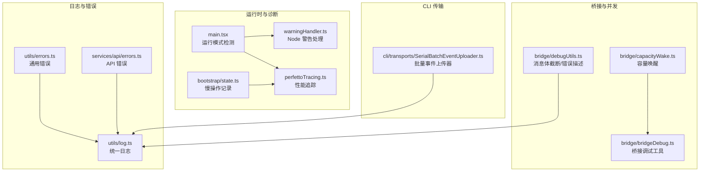
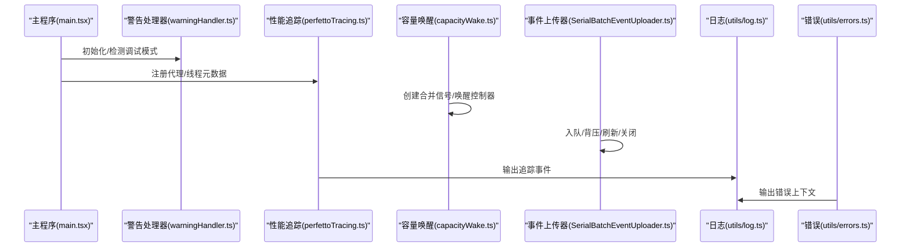
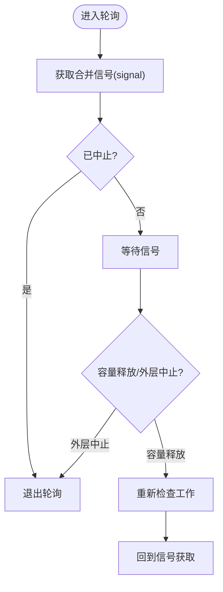
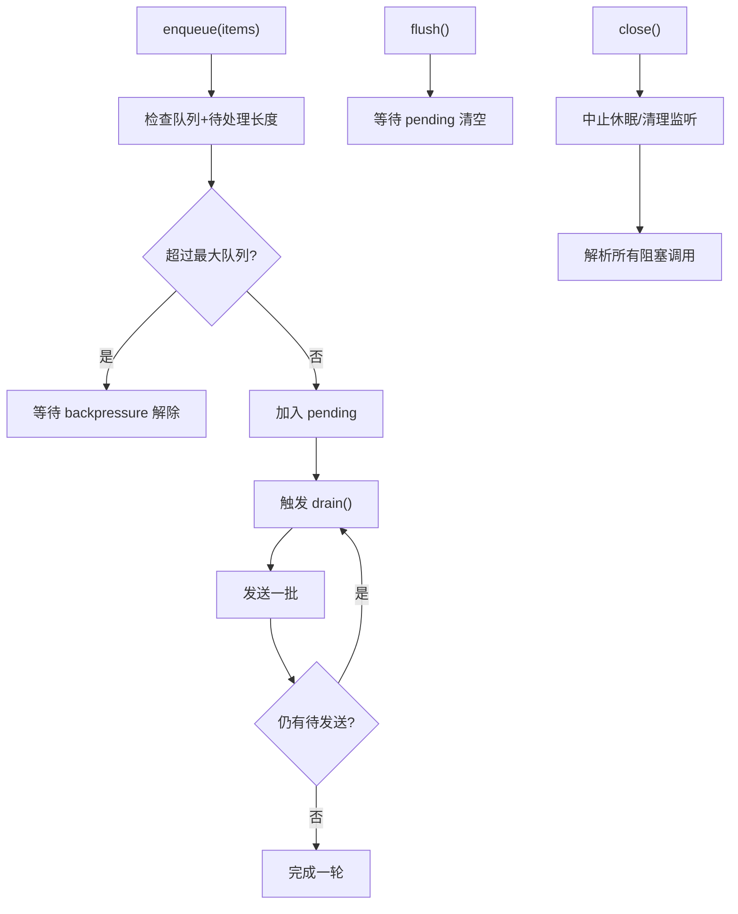
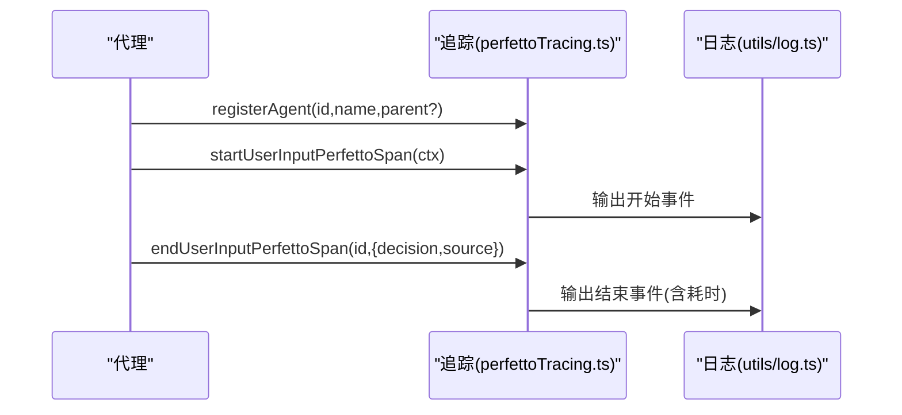
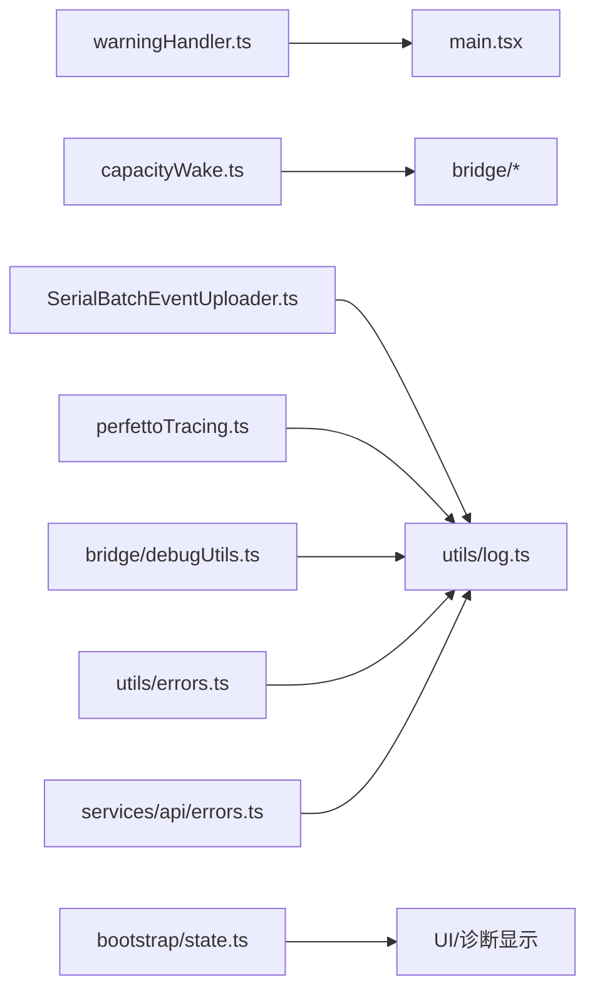

# 调试技巧与最佳实践

<cite>
**本文引用的文件**
- [src/utils/warningHandler.ts](file://src/utils/warningHandler.ts)
- [src/cli/transports/SerialBatchEventUploader.ts](file://src/cli/transports/SerialBatchEventUploader.ts)
- [src/bridge/capacityWake.ts](file://src/bridge/capacityWake.ts)
- [src/utils/telemetry/perfettoTracing.ts](file://src/utils/telemetry/perfettoTracing.ts)
- [src/main.tsx](file://src/main.tsx)
- [src/bootstrap/state.ts](file://src/bootstrap/state.ts)
- [src/bridge/debugUtils.ts](file://src/bridge/debugUtils.ts)
- [src/utils/debug.ts](file://src/utils/debug.ts)
- [src/bridge/bridgeDebug.ts](file://src/bridge/bridgeDebug.ts)
- [src/utils/log.ts](file://src/utils/log.ts)
- [src/utils/errors.ts](file://src/utils/errors.ts)
- [src/services/api/errors.ts](file://src/services/api/errors.ts)
</cite>

## 目录
1. 引言
2. 项目结构
3. 核心组件
4. 架构总览
5. 组件详解
6. 依赖关系分析
7. 性能考量
8. 故障排查指南
9. 结论
10. 附录

## 引言
本文件面向 Claude Code 的开发者与高级用户，系统梳理在复杂异步代码（Promise 链、事件循环、并发）中进行高效调试的方法论，并结合仓库内现有调试基础设施给出可落地的实践建议。内容涵盖断点调试技巧、模块化调试、问题复现与缩小范围、网络与第三方集成调试、以及工具组合使用策略，帮助你在大型应用中稳定定位并解决问题。

## 项目结构
围绕“调试”主题，本项目的关键实现分布在以下模块：
- 运行时与进程级调试：运行模式检测、警告处理、性能追踪
- 桥接层与并发控制：容量唤醒、背压与关闭流程
- 日志与错误描述：统一日志、错误信息增强
- CLI 传输层：批量事件上传器的异步与背压机制
- 状态与诊断：慢操作记录、主线程代理类型等诊断数据

图表来源
- [src/main.tsx](file://src/main.tsx)
- [src/utils/warningHandler.ts](file://src/utils/warningHandler.ts)
- [src/utils/telemetry/perfettoTracing.ts](file://src/utils/telemetry/perfettoTracing.ts)
- [src/bootstrap/state.ts](file://src/bootstrap/state.ts)
- [src/bridge/capacityWake.ts](file://src/bridge/capacityWake.ts)
- [src/bridge/bridgeDebug.ts](file://src/bridge/bridgeDebug.ts)
- [src/bridge/debugUtils.ts](file://src/bridge/debugUtils.ts)
- [src/utils/log.ts](file://src/utils/log.ts)
- [src/utils/errors.ts](file://src/utils/errors.ts)
- [src/services/api/errors.ts](file://src/services/api/errors.ts)
- [src/cli/transports/SerialBatchEventUploader.ts](file://src/cli/transports/SerialBatchEventUploader.ts)

章节来源
- [src/main.tsx](file://src/main.tsx)
- [src/utils/warningHandler.ts](file://src/utils/warningHandler.ts)
- [src/utils/telemetry/perfettoTracing.ts](file://src/utils/telemetry/perfettoTracing.ts)
- [src/bootstrap/state.ts](file://src/bootstrap/state.ts)
- [src/bridge/capacityWake.ts](file://src/bridge/capacityWake.ts)
- [src/bridge/bridgeDebug.ts](file://src/bridge/bridgeDebug.ts)
- [src/bridge/debugUtils.ts](file://src/bridge/debugUtils.ts)
- [src/utils/log.ts](file://src/utils/log.ts)
- [src/utils/errors.ts](file://src/utils/errors.ts)
- [src/services/api/errors.ts](file://src/services/api/errors.ts)
- [src/cli/transports/SerialBatchEventUploader.ts](file://src/cli/transports/SerialBatchEventUploader.ts)

## 核心组件
- 运行模式检测与调试开关：用于识别是否处于调试/检查模式，便于条件断点与日志策略调整。
- Node 警告处理：统一处理 Node 的 process.warning 事件，区分内部/外部用户场景，避免冗余输出或保留开发期警告。
- 容量唤醒与背压：桥接轮询循环中的容量控制与早醒机制，支持优雅关闭与资源回收。
- 批量事件上传器：队列长度与背压控制、刷新与关闭流程，保障高吞吐下的稳定性。
- 性能追踪（Perfetto）：为代理/线程注入元数据、开始/结束跨度，便于可视化分析端到端耗时。
- 慢操作记录：主线程慢操作聚合与过期清理，辅助定位卡顿根因。
- 日志与错误描述：统一日志入口、错误消息增强（含 HTTP 响应体细节），提升排障效率。
- 桥接调试工具：消息体截断、敏感信息脱敏、Axios 错误描述扩展。

章节来源
- [src/main.tsx](file://src/main.tsx)
- [src/utils/warningHandler.ts](file://src/utils/warningHandler.ts)
- [src/bridge/capacityWake.ts](file://src/bridge/capacityWake.ts)
- [src/cli/transports/SerialBatchEventUploader.ts](file://src/cli/transports/SerialBatchEventUploader.ts)
- [src/utils/telemetry/perfettoTracing.ts](file://src/utils/telemetry/perfettoTracing.ts)
- [src/bootstrap/state.ts](file://src/bootstrap/state.ts)
- [src/utils/log.ts](file://src/utils/log.ts)
- [src/utils/errors.ts](file://src/utils/errors.ts)
- [src/services/api/errors.ts](file://src/services/api/errors.ts)
- [src/bridge/debugUtils.ts](file://src/bridge/debugUtils.ts)

## 架构总览
下图展示调试相关组件之间的交互关系，强调异步路径、并发控制与可观测性：

图表来源
- [src/main.tsx](file://src/main.tsx)
- [src/utils/warningHandler.ts](file://src/utils/warningHandler.ts)
- [src/utils/telemetry/perfettoTracing.ts](file://src/utils/telemetry/perfettoTracing.ts)
- [src/bridge/capacityWake.ts](file://src/bridge/capacityWake.ts)
- [src/cli/transports/SerialBatchEventUploader.ts](file://src/cli/transports/SerialBatchEventUploader.ts)
- [src/utils/log.ts](file://src/utils/log.ts)
- [src/utils/errors.ts](file://src/utils/errors.ts)

## 组件详解

### 运行模式检测与调试开关
- 目标：判断当前是否处于调试/检查模式，以便启用更详细的日志、断点策略或禁用某些优化。
- 关键点：检查 execArgv 与 NODE_OPTIONS 中的 --inspect/-brk 或 --debug/-brk 变体；对 Bun 的特殊处理避免参数泄漏导致误判。
- 实战建议：在 IDE 中通过“附加到进程”或“启动配置”传递 --inspect/--inspect-brk；在 CI 中通过 NODE_OPTIONS 控制。

章节来源
- [src/main.tsx](file://src/main.tsx)

### Node 警告处理（process.warning）
- 目标：统一处理 Node 的未捕获警告，区分开发/生产环境，减少噪声或保留有用提示。
- 关键点：仅安装一次监听器；开发模式保留默认警告；非开发模式移除默认处理器以抑制 stderr 输出；提供重置函数用于测试。
- 实战建议：在本地开发时开启详细警告，CI 中关闭默认警告以避免污染日志；对特定内部警告进行白名单过滤。

章节来源
- [src/utils/warningHandler.ts](file://src/utils/warningHandler.ts)

### 容量唤醒与轮询循环
- 目标：在桥接轮询中实现“满载睡眠 + 早醒”机制，当外层信号取消或容量释放时立即响应。
- 关键点：合并 AbortSignal；每次唤醒后重建控制器；提供 signal()/wake() 接口；确保清理事件监听。
- 实战建议：在长轮询任务中使用该模式，避免忙等；结合 AbortController 的一次性监听，防止内存泄漏。

图表来源
- [src/bridge/capacityWake.ts](file://src/bridge/capacityWake.ts)

章节来源
- [src/bridge/capacityWake.ts](file://src/bridge/capacityWake.ts)

### 批量事件上传器（背压、刷新与关闭）
- 目标：在高吞吐场景下保证稳定性，避免内存暴涨与丢失事件。
- 关键点：队列长度达到阈值时阻塞入队；drain() 异步驱动；flush() 等待清空；close() 放弃待处理项并通知阻塞调用者。
- 实战建议：在 UI 会话边界或优雅停机前调用 flush()；在异常或关闭时调用 close() 并记录丢弃数量。

图表来源
- [src/cli/transports/SerialBatchEventUploader.ts](file://src/cli/transports/SerialBatchEventUploader.ts)

章节来源
- [src/cli/transports/SerialBatchEventUploader.ts](file://src/cli/transports/SerialBatchEventUploader.ts)

### 性能追踪（Perfetto）
- 目标：为代理/线程注入元数据，记录开始/结束跨度，生成可导入 Perfetto 的事件流。
- 关键点：注册代理、写入进程/线程名、父子关系；开始/结束跨度携带上下文与耗时；提供启用查询接口。
- 实战建议：在关键路径（如用户输入等待、工具调用）包裹 span；结合浏览器 Perfetto 工具查看火焰图与时序。

图表来源
- [src/utils/telemetry/perfettoTracing.ts](file://src/utils/telemetry/perfettoTracing.ts)
- [src/utils/log.ts](file://src/utils/log.ts)

章节来源
- [src/utils/telemetry/perfettoTracing.ts](file://src/utils/telemetry/perfettoTracing.ts)
- [src/utils/log.ts](file://src/utils/log.ts)

### 慢操作记录与诊断
- 目标：聚合主线程慢操作，按 TTL 过滤，避免频繁渲染与抖动。
- 关键点：稳定返回空数组引用；到期自动清理；提供主线程代理类型查询。
- 实战建议：在 UI 中周期性读取慢操作列表，结合 Perfetto 跟踪根因；对热点路径进行节流/去抖。

章节来源
- [src/bootstrap/state.ts](file://src/bootstrap/state.ts)

### 日志与错误描述
- 统一日志入口：集中输出，便于统一格式与级别管理。
- 错误增强：对 Axios 错误提取服务端响应体中的详细信息，补充状态码之外的业务错误描述。
- 实战建议：在网络请求失败时优先使用增强描述；在桥接层打印截断后的消息体，避免日志膨胀。

章节来源
- [src/utils/log.ts](file://src/utils/log.ts)
- [src/utils/errors.ts](file://src/utils/errors.ts)
- [src/services/api/errors.ts](file://src/services/api/errors.ts)
- [src/bridge/debugUtils.ts](file://src/bridge/debugUtils.ts)

### 桥接调试工具
- 消息体截断与脱敏：对 JSON 序列化结果进行截断与敏感信息替换，适配日志安全。
- Axios 错误描述：从响应体提取 message/error.message，丰富错误上下文。
- 实战建议：在桥接消息打印前调用截断工具；对第三方 API 返回体进行脱敏后再输出。

章节来源
- [src/bridge/debugUtils.ts](file://src/bridge/debugUtils.ts)

## 依赖关系分析
- 组件耦合：容量唤醒被桥接轮询复用；事件上传器依赖日志输出；性能追踪依赖日志输出；慢操作记录被 UI 使用。
- 外部依赖：Node 的 process.warning、AbortController；Perfetto 事件格式；Axios 错误结构。
- 潜在风险：重复安装警告处理器、未清理事件监听、未正确处理关闭流程可能导致内存泄漏或日志污染。

图表来源
- [src/utils/warningHandler.ts](file://src/utils/warningHandler.ts)
- [src/main.tsx](file://src/main.tsx)
- [src/bridge/capacityWake.ts](file://src/bridge/capacityWake.ts)
- [src/cli/transports/SerialBatchEventUploader.ts](file://src/cli/transports/SerialBatchEventUploader.ts)
- [src/utils/telemetry/perfettoTracing.ts](file://src/utils/telemetry/perfettoTracing.ts)
- [src/bootstrap/state.ts](file://src/bootstrap/state.ts)
- [src/bridge/debugUtils.ts](file://src/bridge/debugUtils.ts)
- [src/utils/log.ts](file://src/utils/log.ts)
- [src/utils/errors.ts](file://src/utils/errors.ts)
- [src/services/api/errors.ts](file://src/services/api/errors.ts)

章节来源
- [src/utils/warningHandler.ts](file://src/utils/warningHandler.ts)
- [src/main.tsx](file://src/main.tsx)
- [src/bridge/capacityWake.ts](file://src/bridge/capacityWake.ts)
- [src/cli/transports/SerialBatchEventUploader.ts](file://src/cli/transports/SerialBatchEventUploader.ts)
- [src/utils/telemetry/perfettoTracing.ts](file://src/utils/telemetry/perfettoTracing.ts)
- [src/bootstrap/state.ts](file://src/bootstrap/state.ts)
- [src/bridge/debugUtils.ts](file://src/bridge/debugUtils.ts)
- [src/utils/log.ts](file://src/utils/log.ts)
- [src/utils/errors.ts](file://src/utils/errors.ts)
- [src/services/api/errors.ts](file://src/services/api/errors.ts)

## 性能考量
- 避免忙等：使用容量唤醒的合并信号替代轮询；在关闭时及时中止休眠。
- 控制日志体量：对大对象进行截断与脱敏；仅在必要时输出完整消息体。
- 合理采样：慢操作列表按 TTL 过滤，减少 UI 抖动；性能追踪事件按需开启。
- 背压策略：在高吞吐场景限制队列长度，必要时丢弃旧事件以保护内存。

## 故障排查指南

### 断点调试技巧
- 条件断点：在轮询循环处设置基于容量/信号状态的条件断点；在事件上传器处设置基于 pending 长度的断点。
- 表达式求值：在断点处快速评估合并信号状态、待处理数量、最近慢操作列表。
- 变量监视：持续观察 pending、backpressureResolvers、flushResolvers 的变化；关注容量唤醒控制器的 abort 状态。

### 模块化调试与范围缩小
- 分层定位：先确认运行模式与警告处理是否正常；再检查桥接轮询与容量唤醒；最后验证事件上传与日志输出。
- 关闭路径：在异常或优雅停机时调用 close() 并记录丢弃数量；在 flush() 后确认队列清空。
- 诊断数据：读取慢操作列表与主线程代理类型，结合性能追踪定位瓶颈。

### 网络请求调试
- 使用增强错误描述：优先输出包含服务端 message/error.message 的错误信息。
- 桥接消息：对第三方 API 返回体进行脱敏与截断后再打印，避免敏感信息泄露。
- 追踪跨度：在请求前后打点，记录耗时与上下文。

### 文件系统与第三方集成调试
- 对于 NAPI/原生模块，优先通过日志与错误描述定位；在桥接层打印截断后的上下文。
- 在第三方 SDK 出错时，结合统一错误模块输出标准化信息，便于跨模块排查。

### 工具组合使用
- 运行模式检测 + 警告处理：在本地启用详细警告，在 CI 关闭默认警告。
- 容量唤醒 + 事件上传器：在高吞吐场景下配合背压与关闭流程，确保稳定性。
- 性能追踪 + 慢操作记录：在 UI 层展示慢操作列表，结合 Perfetto 查看端到端耗时。

章节来源
- [src/main.tsx](file://src/main.tsx)
- [src/utils/warningHandler.ts](file://src/utils/warningHandler.ts)
- [src/bridge/capacityWake.ts](file://src/bridge/capacityWake.ts)
- [src/cli/transports/SerialBatchEventUploader.ts](file://src/cli/transports/SerialBatchEventUploader.ts)
- [src/utils/telemetry/perfettoTracing.ts](file://src/utils/telemetry/perfettoTracing.ts)
- [src/bootstrap/state.ts](file://src/bootstrap/state.ts)
- [src/utils/errors.ts](file://src/utils/errors.ts)
- [src/services/api/errors.ts](file://src/services/api/errors.ts)
- [src/bridge/debugUtils.ts](file://src/bridge/debugUtils.ts)

## 结论
通过对运行模式检测、警告处理、容量唤醒、事件上传器、性能追踪与慢操作记录等模块的系统化梳理，本文件提供了在复杂异步与并发场景下的调试方法论。建议在日常开发中结合断点策略、模块化调试与工具链组合，形成从现象到根因的闭环排查流程，持续提升定位与修复效率。

## 附录
- 快速检查清单
  - 是否处于调试模式？是否启用了详细警告？
  - 轮询循环是否使用容量唤醒的合并信号？
  - 事件上传器是否正确处理背压、刷新与关闭？
  - 是否对大对象进行了截断与脱敏？
  - 是否在关键路径打点并导出到 Perfetto？