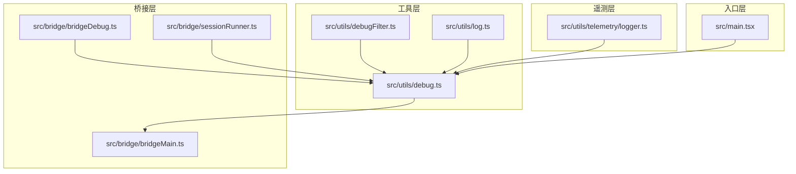
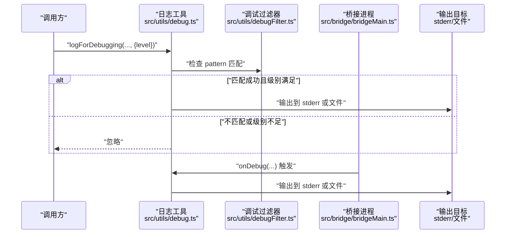
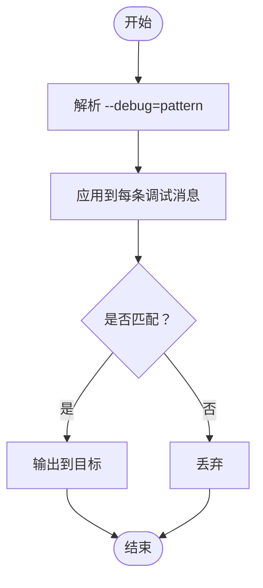
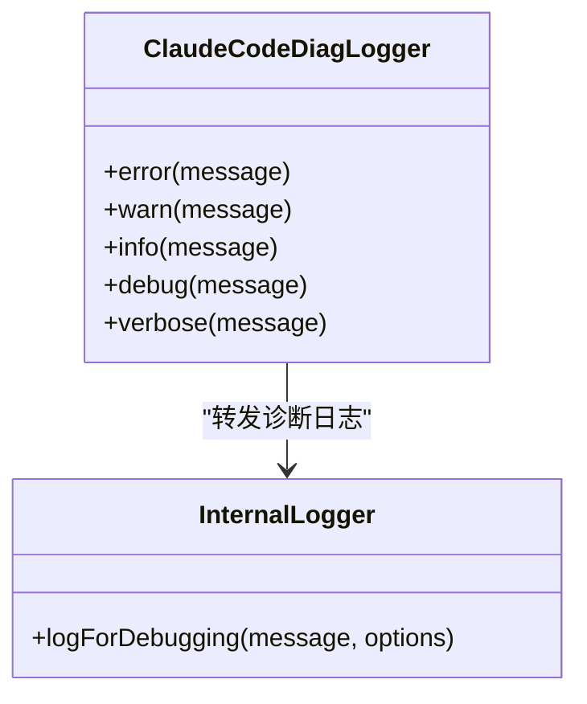
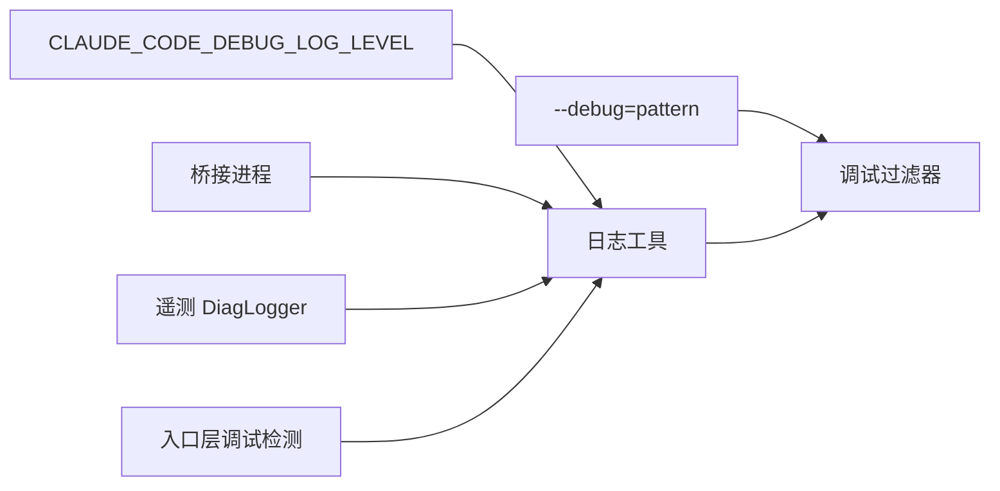

# 调试日志系统

<cite>
**本文引用的文件**
- [src/utils/debug.ts](file://src/utils/debug.ts)
- [src/utils/debugFilter.ts](file://src/utils/debugFilter.ts)
- [src/utils/log.ts](file://src/utils/log.ts)
- [src/bridge/bridgeMain.ts](file://src/bridge/bridgeMain.ts)
- [src/bridge/bridgeDebug.ts](file://src/bridge/bridgeDebug.ts)
- [src/bridge/sessionRunner.ts](file://src/bridge/sessionRunner.ts)
- [src/utils/telemetry/logger.ts](file://src/utils/telemetry/logger.ts)
- [src/main.tsx](file://src/main.tsx)
</cite>

## 目录
1. [简介](#简介)
2. [项目结构](#项目结构)
3. [核心组件](#核心组件)
4. [架构总览](#架构总览)
5. [详细组件分析](#详细组件分析)
6. [依赖关系分析](#依赖关系分析)
7. [性能考量](#性能考量)
8. [故障排查指南](#故障排查指南)
9. [结论](#结论)
10. [附录](#附录)

## 简介
本文件系统性梳理 Claude Code 的调试日志体系，覆盖以下主题：
- 日志级别与控制：verbose、debug、info、warn、error 的语义及通过环境变量 CLAUDE_CODE_DEBUG_LOG_LEVEL 的启用策略
- 调试标志与过滤：--debug=pattern 的格式与匹配规则
- 输出目标：标准错误输出（--debug-to-stderr）与文件输出（--debug-file）
- 运行时控制：/debug 命令的触发与行为
- 文件轮转与符号链接：调试日志文件的滚动与链接维护机制

## 项目结构
调试日志相关能力由多处模块协同实现：
- 工具层：日志工具与过滤器（src/utils/debug.ts、src/utils/debugFilter.ts、src/utils/log.ts）
- 桥接层：桥接进程参数解析与调试输出（src/bridge/bridgeMain.ts、src/bridge/bridgeDebug.ts、src/bridge/sessionRunner.ts）
- 遥测层：第三方诊断日志桥接到内部调试通道（src/utils/telemetry/logger.ts）
- 入口层：主程序入口对调试模式的检测与处理（src/main.tsx）

图表来源
- [src/utils/debug.ts:1-120](file://src/utils/debug.ts#L1-L120)
- [src/utils/debugFilter.ts:1-120](file://src/utils/debugFilter.ts#L1-L120)
- [src/utils/log.ts:1-120](file://src/utils/log.ts#L1-L120)
- [src/bridge/bridgeMain.ts:1751-1785](file://src/bridge/bridgeMain.ts#L1751-L1785)
- [src/bridge/bridgeDebug.ts:1-120](file://src/bridge/bridgeDebug.ts#L1-L120)
- [src/bridge/sessionRunner.ts:482-521](file://src/bridge/sessionRunner.ts#L482-L521)
- [src/utils/telemetry/logger.ts:1-26](file://src/utils/telemetry/logger.ts#L1-L26)
- [src/main.tsx:231-271](file://src/main.tsx#L231-L271)

章节来源
- [src/utils/debug.ts:1-120](file://src/utils/debug.ts#L1-L120)
- [src/utils/debugFilter.ts:1-120](file://src/utils/debugFilter.ts#L1-L120)
- [src/utils/log.ts:1-120](file://src/utils/log.ts#L1-L120)
- [src/bridge/bridgeMain.ts:1751-1785](file://src/bridge/bridgeMain.ts#L1751-L1785)
- [src/bridge/bridgeDebug.ts:1-120](file://src/bridge/bridgeDebug.ts#L1-L120)
- [src/bridge/sessionRunner.ts:482-521](file://src/bridge/sessionRunner.ts#L482-L521)
- [src/utils/telemetry/logger.ts:1-26](file://src/utils/telemetry/logger.ts#L1-L26)
- [src/main.tsx:231-271](file://src/main.tsx#L231-L271)

## 核心组件
- 日志工具与级别控制：提供统一的日志入口，支持按级别输出，并受环境变量 CLAUDE_CODE_DEBUG_LOG_LEVEL 控制
- 调试过滤器：基于 --debug=pattern 的通配符匹配，仅输出匹配的调试消息
- 输出目标：支持标准错误输出与文件输出；桥接进程支持 --debug-file 与 --debug-to-stderr
- 运行时控制：通过 /debug 命令在运行时切换调试状态
- 文件轮转与链接：调试日志文件具备滚动与符号链接维护机制，便于持续追踪

章节来源
- [src/utils/debug.ts:1-120](file://src/utils/debug.ts#L1-L120)
- [src/utils/debugFilter.ts:1-120](file://src/utils/debugFilter.ts#L1-L120)
- [src/utils/log.ts:1-120](file://src/utils/log.ts#L1-L120)
- [src/bridge/bridgeMain.ts:1751-1785](file://src/bridge/bridgeMain.ts#L1751-L1785)
- [src/bridge/bridgeDebug.ts:1-120](file://src/bridge/bridgeDebug.ts#L1-L120)
- [src/bridge/sessionRunner.ts:482-521](file://src/bridge/sessionRunner.ts#L482-L521)
- [src/utils/telemetry/logger.ts:1-26](file://src/utils/telemetry/logger.ts#L1-L26)
- [src/main.tsx:231-271](file://src/main.tsx#L231-L271)

## 架构总览
调试日志从“输入”到“输出”的整体流程如下：
- 输入：业务代码调用日志工具（含级别与标签），或桥接进程产生调试信息
- 过滤：根据 CLAUDE_CODE_DEBUG_LOG_LEVEL 与 --debug=pattern 决定是否输出
- 输出：写入 stderr 或指定文件；同时可记录到轮转日志并维护符号链接

图表来源
- [src/utils/debug.ts:1-120](file://src/utils/debug.ts#L1-L120)
- [src/utils/debugFilter.ts:1-120](file://src/utils/debugFilter.ts#L1-L120)
- [src/bridge/bridgeMain.ts:1751-1785](file://src/bridge/bridgeMain.ts#L1751-L1785)

## 详细组件分析

### 日志级别与环境变量控制
- 支持的日志级别：verbose、debug、info、warn、error
- 控制方式：通过环境变量 CLAUDE_CODE_DEBUG_LOG_LEVEL 设置当前有效级别
  - 当前级别会过滤掉低于该级别的消息
  - 设置为 verbose 可显示更细粒度的调试信息
- 实现要点：
  - 日志工具负责读取环境变量并进行级别判断
  - 调试过滤器配合 --debug=pattern 对消息进行二次筛选

章节来源
- [src/utils/debug.ts:25-40](file://src/utils/debug.ts#L25-L40)

### 调试标志与过滤规则
- 格式：--debug=pattern
  - pattern 支持通配符匹配，用于限定只输出匹配的消息
- 解析位置：桥接进程在启动参数中解析 --debug=pattern
- 过滤流程：
  - 将传入的 pattern 交由调试过滤器进行匹配判定
  - 仅当消息标签与 pattern 匹配时才输出

图表来源
- [src/bridge/bridgeMain.ts:1751-1785](file://src/bridge/bridgeMain.ts#L1751-L1785)
- [src/utils/debugFilter.ts:1-120](file://src/utils/debugFilter.ts#L1-L120)

章节来源
- [src/bridge/bridgeMain.ts:1751-1785](file://src/bridge/bridgeMain.ts#L1751-L1785)
- [src/utils/debugFilter.ts:1-120](file://src/utils/debugFilter.ts#L1-L120)

### 输出目标与桥接参数
- 标准错误输出：默认输出到 stderr
- 文件输出：通过 --debug-file 指定文件路径
- 桥接进程参数：
  - --debug-file：设置调试日志文件路径
  - --debug-to-stderr：强制输出到 stderr（若未指定文件则默认 stderr）
- 运行时调试输出：
  - 桥接会将关键事件（如会话生命周期、信号处理等）以调试形式输出

章节来源
- [src/bridge/bridgeMain.ts:1751-1785](file://src/bridge/bridgeMain.ts#L1751-L1785)
- [src/bridge/sessionRunner.ts:482-521](file://src/bridge/sessionRunner.ts#L482-L521)

### 运行时启用调试日志（/debug 命令）
- 触发方式：在交互界面输入 /debug 命令
- 行为说明：
  - 切换当前调试状态（例如开启/关闭详细日志）
  - 影响后续日志输出的级别与过滤策略
- 注意：具体命令实现细节不在本次分析范围内，但其对日志系统的影响贯穿上述级别与过滤逻辑

章节来源
- [src/utils/debug.ts:1-120](file://src/utils/debug.ts#L1-L120)

### 文件轮转与符号链接管理
- 能力概述：调试日志文件支持滚动与符号链接维护，便于长期运行时的持续追踪
- 作用对象：通常针对 --debug-file 指定的文件
- 维护内容：
  - 滚动：当日志达到阈值时自动滚动新文件
  - 符号链接：保持一个指向最新日志的稳定链接，方便快速定位

章节来源
- [src/utils/debug.ts:1-120](file://src/utils/debug.ts#L1-L120)

### 第三方诊断日志桥接
- OpenTelemetry 诊断日志通过 Claude Code 的调试通道输出
- 实现方式：自定义 DiagLogger，在 error/warn 时调用内部日志工具，并标注级别
- 影响：统一了第三方库的诊断输出到同一调试系统

图表来源
- [src/utils/telemetry/logger.ts:1-26](file://src/utils/telemetry/logger.ts#L1-L26)
- [src/utils/debug.ts:1-120](file://src/utils/debug.ts#L1-L120)

章节来源
- [src/utils/telemetry/logger.ts:1-26](file://src/utils/telemetry/logger.ts#L1-L26)
- [src/utils/debug.ts:1-120](file://src/utils/debug.ts#L1-L120)

## 依赖关系分析
- 日志工具依赖于环境变量与过滤器共同决定输出
- 桥接进程在启动阶段解析调试相关参数，并在运行期输出调试信息
- 遥测层通过 DiagLogger 将第三方诊断纳入统一调试通道
- 入口层对调试模式进行检测，避免在被调试状态下继续执行

图表来源
- [src/utils/debug.ts:1-120](file://src/utils/debug.ts#L1-L120)
- [src/utils/debugFilter.ts:1-120](file://src/utils/debugFilter.ts#L1-L120)
- [src/bridge/bridgeMain.ts:1751-1785](file://src/bridge/bridgeMain.ts#L1751-L1785)
- [src/utils/telemetry/logger.ts:1-26](file://src/utils/telemetry/logger.ts#L1-L26)
- [src/main.tsx:231-271](file://src/main.tsx#L231-L271)

章节来源
- [src/utils/debug.ts:1-120](file://src/utils/debug.ts#L1-L120)
- [src/utils/debugFilter.ts:1-120](file://src/utils/debugFilter.ts#L1-L120)
- [src/bridge/bridgeMain.ts:1751-1785](file://src/bridge/bridgeMain.ts#L1751-L1785)
- [src/utils/telemetry/logger.ts:1-26](file://src/utils/telemetry/logger.ts#L1-L26)
- [src/main.tsx:231-271](file://src/main.tsx#L231-L271)

## 性能考量
- 过滤前置：优先在日志工具与过滤器中进行级别与 pattern 判定，避免不必要的字符串拼接与 IO
- 输出路径：stderr 通常比文件写入更快；大流量调试建议结合 --debug=pattern 限制范围
- 轮转策略：合理配置滚动阈值与保留数量，平衡磁盘占用与可追溯性
- 遥测桥接：第三方诊断日志量可能较大，建议在问题定位阶段临时提升级别，定位后恢复默认

## 故障排查指南
- 现象：看不到任何调试输出
  - 检查 CLAUDE_CODE_DEBUG_LOG_LEVEL 是否设置为 verbose
  - 确认 --debug=pattern 是否正确匹配消息标签
- 现象：日志写入到文件但找不到
  - 检查 --debug-file 指定路径是否存在与权限
  - 查看符号链接是否指向最新日志文件
- 现象：第三方库诊断日志未出现
  - 确认 DiagLogger 是否已接入内部调试通道
  - 检查 warn/error 级别是否被当前级别过滤
- 现象：被调试器打断导致无法继续
  - 入口层会对调试模式进行检测并提前退出，确认 NODE_OPTIONS 与 execArgv 中的 --inspect/--debug 标志

章节来源
- [src/utils/debug.ts:1-120](file://src/utils/debug.ts#L1-L120)
- [src/utils/debugFilter.ts:1-120](file://src/utils/debugFilter.ts#L1-L120)
- [src/utils/telemetry/logger.ts:1-26](file://src/utils/telemetry/logger.ts#L1-L26)
- [src/main.tsx:231-271](file://src/main.tsx#L231-L271)

## 结论
Claude Code 的调试日志系统通过“级别控制 + 过滤匹配 + 多目标输出 + 运行时切换 + 文件轮转”的组合，提供了灵活而强大的问题定位能力。建议在日常开发中使用 --debug=pattern 缩小输出范围，在问题复现阶段临时提升 CLAUDE_CODE_DEBUG_LOG_LEVEL 并结合 /debug 命令进行动态控制。

## 附录
- 关键参数速览
  - CLAUDE_CODE_DEBUG_LOG_LEVEL：设置日志级别（verbose/debug/info/warn/error）
  - --debug=pattern：设置调试消息过滤规则
  - --debug-file：设置调试日志文件路径
  - --debug-to-stderr：强制输出到标准错误
  - /debug：运行时切换调试状态