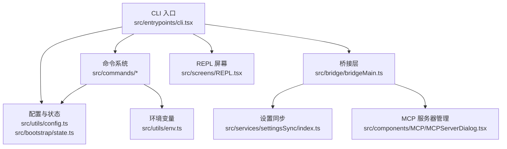
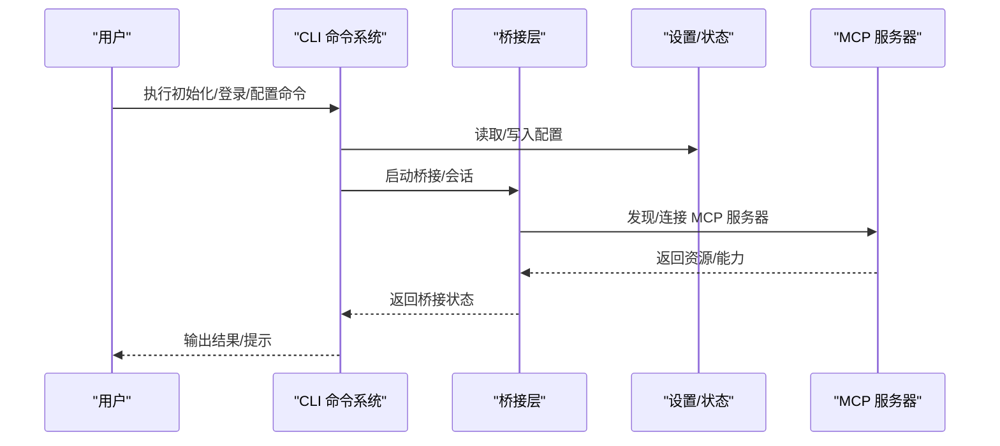
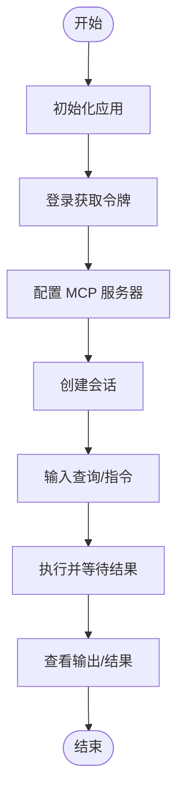
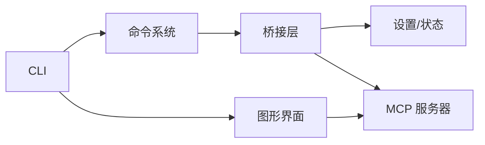

# 快速开始

<cite>
**本文引用的文件**
- [package.json](file://package.json)
- [src/entrypoints/cli.tsx](file://src/entrypoints/cli.tsx)
- [src/commands/init.ts](file://src/commands/init.ts)
- [src/commands/login/index.ts](file://src/commands/login/index.ts)
- [src/commands/mcp/index.ts](file://src/commands/mcp/index.ts)
- [src/commands/config/index.ts](file://src/commands/config/index.ts)
- [src/bridge/bridgeMain.ts](file://src/bridge/bridgeMain.ts)
- [src/bootstrap/state.ts](file://src/bootstrap/state.ts)
- [src/utils/config.ts](file://src/utils/config.ts)
- [src/utils/env.ts](file://src/utils/env.ts)
- [src/services/settingsSync/index.ts](file://src/services/settingsSync/index.ts)
- [src/components/MCP/MCPServerDialog.tsx](file://src/components/MCP/MCPServerDialog.tsx)
- [src/components/Settings/Settings.tsx](file://src/components/Settings/Settings.tsx)
- [src/screens/REPL.tsx](file://src/screens/REPL.tsx)
- [src/hooks/useSettings.ts](file://src/hooks/useSettings.ts)
</cite>

## 目录
1. [简介](#简介)
2. [项目结构](#项目结构)
3. [核心组件](#核心组件)
4. [架构总览](#架构总览)
5. [详细组件分析](#详细组件分析)
6. [依赖关系分析](#依赖关系分析)
7. [性能考虑](#性能考虑)
8. [故障排除指南](#故障排除指南)
9. [结论](#结论)
10. [附录](#附录)

## 简介
本指南面向首次接触 Claude Code 的用户，帮助您在本地完成环境准备、安装与首次运行，掌握基本使用方法（创建会话、简单代码查询、AI 助手交互），并提供常见初始化问题的排查建议。文档同时覆盖命令行与图形界面两种入门路径。

## 项目结构
Claude Code 是一个基于 Node.js 的桌面应用与 CLI 工具集合，采用模块化设计，核心入口包括 CLI、桥接层（Bridge）与图形界面组件。主要职责划分如下：
- CLI 入口：负责命令解析与任务调度
- 桥接层（Bridge）：连接本地与远程服务，管理会话与权限
- 图形界面组件：提供设置、MCP 服务器管理、REPL 等交互界面
- 配置与状态：集中管理用户配置、环境变量与应用状态

**图表来源**
- [src/entrypoints/cli.tsx](file://src/entrypoints/cli.tsx)
- [src/bridge/bridgeMain.ts](file://src/bridge/bridgeMain.ts)
- [src/services/settingsSync/index.ts](file://src/services/settingsSync/index.ts)
- [src/components/MCP/MCPServerDialog.tsx](file://src/components/MCP/MCPServerDialog.tsx)
- [src/screens/REPL.tsx](file://src/screens/REPL.tsx)
- [src/utils/config.ts](file://src/utils/config.ts)
- [src/bootstrap/state.ts](file://src/bootstrap/state.ts)
- [src/utils/env.ts](file://src/utils/env.ts)

**章节来源**
- [src/entrypoints/cli.tsx](file://src/entrypoints/cli.tsx)
- [src/bridge/bridgeMain.ts](file://src/bridge/bridgeMain.ts)
- [src/utils/config.ts](file://src/utils/config.ts)
- [src/bootstrap/state.ts](file://src/bootstrap/state.ts)
- [src/utils/env.ts](file://src/utils/env.ts)

## 核心组件
- CLI 命令系统：提供 init、login、mcp、config 等子命令，用于初始化、登录、MCP 服务器配置与全局配置管理
- 桥接层（Bridge）：负责与远程服务建立连接、会话生命周期管理、权限与能力协商
- 设置与状态：集中管理用户偏好、MCP 服务器列表、模型选择、输出样式等
- 图形界面：提供设置面板、MCP 服务器对话框、REPL 界面等可视化操作入口

**章节来源**
- [src/commands/init.ts](file://src/commands/init.ts)
- [src/commands/login/index.ts](file://src/commands/login/index.ts)
- [src/commands/mcp/index.ts](file://src/commands/mcp/index.ts)
- [src/commands/config/index.ts](file://src/commands/config/index.ts)
- [src/bridge/bridgeMain.ts](file://src/bridge/bridgeMain.ts)
- [src/services/settingsSync/index.ts](file://src/services/settingsSync/index.ts)
- [src/components/MCP/MCPServerDialog.tsx](file://src/components/MCP/MCPServerDialog.tsx)
- [src/screens/REPL.tsx](file://src/screens/REPL.tsx)

## 架构总览
下图展示了从 CLI 到桥接层再到 MCP 服务器与设置系统的整体调用链路。

**图表来源**
- [src/entrypoints/cli.tsx](file://src/entrypoints/cli.tsx)
- [src/bridge/bridgeMain.ts](file://src/bridge/bridgeMain.ts)
- [src/services/settingsSync/index.ts](file://src/services/settingsSync/index.ts)
- [src/components/MCP/MCPServerDialog.tsx](file://src/components/MCP/MCPServerDialog.tsx)

## 详细组件分析

### 环境要求与安装
- 运行时要求
  - Node.js：24 或更高版本
  - 包管理器：推荐使用 Bun（版本 1.3.5 或更高）
- 安装步骤
  - 使用包管理器安装项目依赖
  - 初始化应用（生成必要配置与引导文件）
  - 登录以获取访问令牌（用于后续请求）
- 首次运行流程
  - 启动 CLI 并执行初始化命令
  - 根据提示完成登录与基础配置
  - 在图形界面中确认 MCP 服务器可用性与权限

**章节来源**
- [package.json](file://package.json)
- [src/commands/init.ts](file://src/commands/init.ts)
- [src/commands/login/index.ts](file://src/commands/login/index.ts)

### 配置与设置
- 全局配置
  - 通过 config 子命令查看或修改全局设置
  - 支持模型选择、输出样式、日志级别等
- 用户设置同步
  - 设置变更通过设置同步服务传播到桥接层
- 环境变量
  - 应用启动时加载环境变量，用于控制行为与调试

**章节来源**
- [src/commands/config/index.ts](file://src/commands/config/index.ts)
- [src/services/settingsSync/index.ts](file://src/services/settingsSync/index.ts)
- [src/utils/env.ts](file://src/utils/env.ts)

### MCP 服务器配置
- 服务器发现与授权
  - 在图形界面中打开 MCP 服务器对话框，添加/编辑服务器
  - 对于新服务器，需要进行授权与能力确认
- 服务器列表与权限
  - 设置中维护已批准的 MCP 服务器清单
  - 权限回调用于处理用户同意/拒绝授权

**章节来源**
- [src/components/MCP/MCPServerDialog.tsx](file://src/components/MCP/MCPServerDialog.tsx)
- [src/bridge/bridgePermissionCallbacks.ts](file://src/bridge/bridgePermissionCallbacks.ts)
- [src/bridge/bridgeEnabled.ts](file://src/bridge/bridgeEnabled.ts)

### 基本使用场景
- 创建第一个会话
  - 通过 CLI 启动会话或在图形界面中新建会话
  - 会话创建后，桥接层负责与远端建立连接
- 执行简单代码查询
  - 在 REPL 中输入查询，观察 AI 助手返回的结果
  - 可切换输出样式以获得不同格式的响应
- 使用 AI 助手功能
  - 结合 MCP 服务器提供的工具，实现文件读写、搜索、终端命令等

**图表来源**
- [src/commands/init.ts](file://src/commands/init.ts)
- [src/commands/login/index.ts](file://src/commands/login/index.ts)
- [src/commands/mcp/index.ts](file://src/commands/mcp/index.ts)
- [src/screens/REPL.tsx](file://src/screens/REPL.tsx)

**章节来源**
- [src/screens/REPL.tsx](file://src/screens/REPL.tsx)
- [src/bridge/bridgeMain.ts](file://src/bridge/bridgeMain.ts)

## 依赖关系分析
- CLI 与命令系统耦合度高，负责统一入口与参数分发
- 桥接层是核心枢纽，向上对接 CLI/界面，向下连接 MCP 与远端服务
- 设置与状态模块为全局共享，确保配置一致性
- MCP 服务器作为外部扩展点，通过对话框与权限回调进行集成

**图表来源**
- [src/entrypoints/cli.tsx](file://src/entrypoints/cli.tsx)
- [src/bridge/bridgeMain.ts](file://src/bridge/bridgeMain.ts)
- [src/services/settingsSync/index.ts](file://src/services/settingsSync/index.ts)
- [src/components/MCP/MCPServerDialog.tsx](file://src/components/MCP/MCPServerDialog.tsx)

**章节来源**
- [src/entrypoints/cli.tsx](file://src/entrypoints/cli.tsx)
- [src/bridge/bridgeMain.ts](file://src/bridge/bridgeMain.ts)
- [src/services/settingsSync/index.ts](file://src/services/settingsSync/index.ts)
- [src/components/MCP/MCPServerDialog.tsx](file://src/components/MCP/MCPServerDialog.tsx)

## 性能考虑
- 合理选择模型与输出样式，避免不必要的大模型调用
- 控制上下文长度与附件大小，减少传输与处理开销
- 使用 MCP 服务器的本地能力（如文件读写、搜索）降低网络往返
- 在 REPL 中按需刷新，避免频繁重渲染

## 故障排除指南
- 初始化失败
  - 检查 Node.js 与 Bun 版本是否满足要求
  - 清理缓存并重新安装依赖
- 登录问题
  - 确认网络连通性与代理设置
  - 查看设置中的日志输出定位错误
- MCP 服务器无法连接
  - 在图形界面中检查服务器地址与授权状态
  - 通过权限回调确认授权流程已完成
- 验证安装
  - 运行初始化命令并观察输出
  - 在 REPL 中执行简单查询验证响应

**章节来源**
- [src/commands/init.ts](file://src/commands/init.ts)
- [src/commands/login/index.ts](file://src/commands/login/index.ts)
- [src/components/MCP/MCPServerDialog.tsx](file://src/components/MCP/MCPServerDialog.tsx)
- [src/utils/config.ts](file://src/utils/config.ts)

## 结论
通过本指南，您已经完成了 Claude Code 的环境准备、安装与首次运行，并掌握了基本的使用方法。建议在实际工作中结合 MCP 服务器与 REPL，逐步探索更丰富的 AI 助手能力。

## 附录
- 常用命令参考
  - 初始化：用于生成必要配置与引导文件
  - 登录：获取访问令牌
  - 配置：查看/修改全局设置
  - MCP：管理 MCP 服务器
- 图形界面入口
  - 设置面板：集中管理偏好与能力
  - MCP 服务器对话框：添加/编辑/授权服务器
  - REPL：与 AI 助手交互的主要界面

**章节来源**
- [src/commands/init.ts](file://src/commands/init.ts)
- [src/commands/login/index.ts](file://src/commands/login/index.ts)
- [src/commands/config/index.ts](file://src/commands/config/index.ts)
- [src/commands/mcp/index.ts](file://src/commands/mcp/index.ts)
- [src/components/Settings/Settings.tsx](file://src/components/Settings/Settings.tsx)
- [src/components/MCP/MCPServerDialog.tsx](file://src/components/MCP/MCPServerDialog.tsx)
- [src/screens/REPL.tsx](file://src/screens/REPL.tsx)