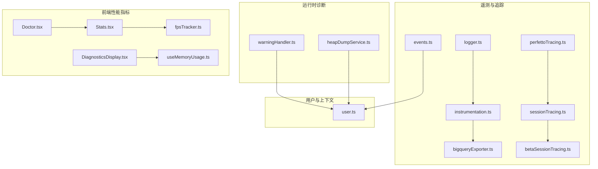
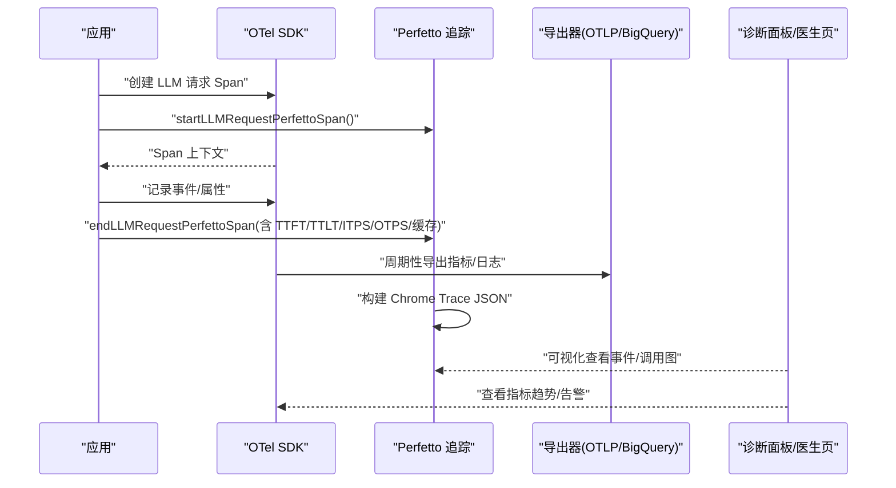
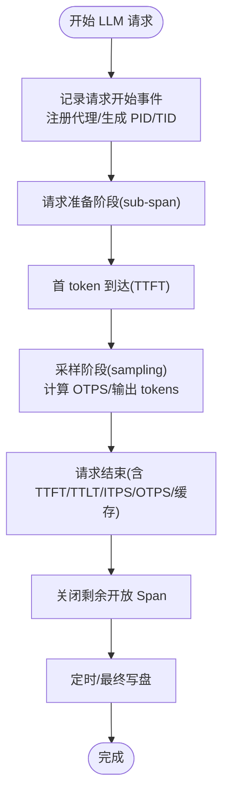
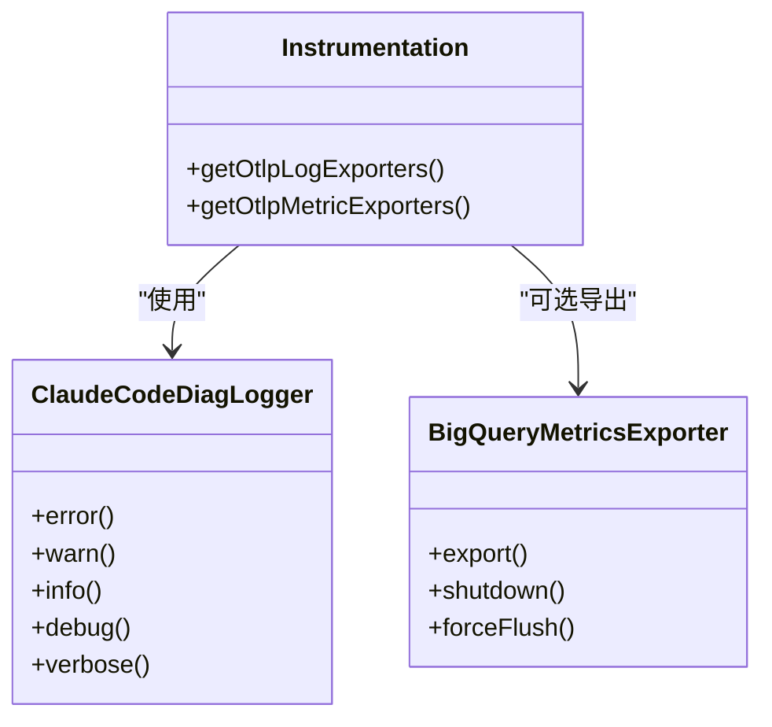
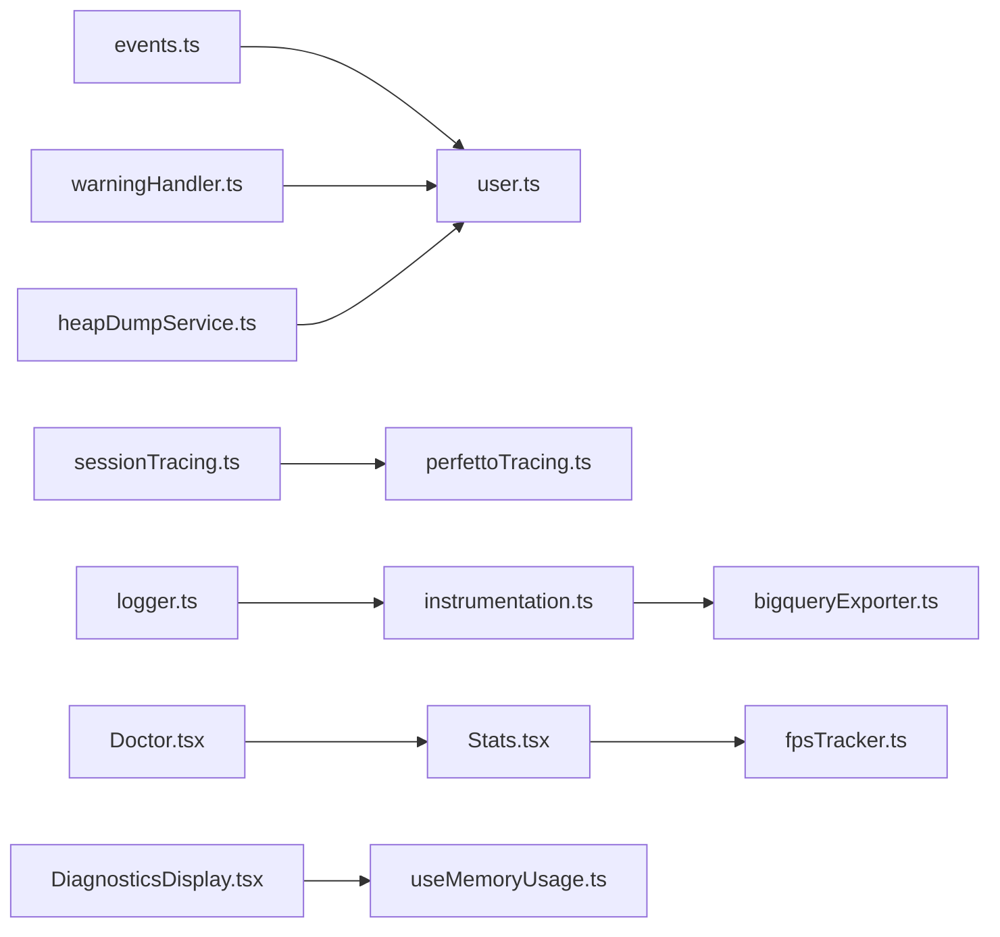

# 性能与监控

<cite>
**本文引用的文件**
- [perfettoTracing.ts](file://src/utils/telemetry/perfettoTracing.ts)
- [instrumentation.ts](file://src/utils/telemetry/instrumentation.ts)
- [logger.ts](file://src/utils/telemetry/logger.ts)
- [events.ts](file://src/utils/telemetry/events.ts)
- [bigqueryExporter.ts](file://src/utils/telemetry/bigqueryExporter.ts)
- [sessionTracing.ts](file://src/utils/telemetry/sessionTracing.ts)
- [betaSessionTracing.ts](file://src/utils/telemetry/betaSessionTracing.ts)
- [user.ts](file://src/utils/user.ts)
- [warningHandler.ts](file://src/utils/warningHandler.ts)
- [heapDumpService.ts](file://src/utils/heapDumpService.ts)
- [fpsTracker.ts](file://src/utils/fpsTracker.ts)
- [useMemoryUsage.ts](file://src/hooks/useMemoryUsage.ts)
- [Stats.tsx](file://src/components/Stats/Stats.tsx)
- [DiagnosticsDisplay.tsx](file://src/components/DiagnosticsDisplay/DiagnosticsDisplay.tsx)
- [Doctor.tsx](file://src/screens/Doctor.tsx)
</cite>

## 目录
1. [简介](#简介)
2. [项目结构](#项目结构)
3. [核心组件](#核心组件)
4. [架构总览](#架构总览)
5. [组件详解](#组件详解)
6. [依赖关系分析](#依赖关系分析)
7. [性能考量](#性能考量)
8. [故障排查指南](#故障排查指南)
9. [结论](#结论)
10. [附录](#附录)

## 简介
本文件面向 Claude Code 的性能与监控体系，系统化阐述指标采集、数据分析与可视化展示的架构设计；解释响应时间、内存使用、CPU 占用等关键指标的含义与测量方法；介绍遥测数据的收集与处理机制（含用户行为与系统健康监控）；并提供性能优化建议、瓶颈识别方法与故障诊断流程，以及监控告警与自动化运维支持。

## 项目结构
围绕性能与监控的关键目录与文件：
- 遥测与追踪：perfettoTracing.ts、instrumentation.ts、events.ts、logger.ts、bigqueryExporter.ts、sessionTracing.ts、betaSessionTracing.ts
- 用户与上下文：user.ts
- 运行时诊断：warningHandler.ts、heapDumpService.ts
- 前端性能指标：fpsTracker.ts、useMemoryUsage.ts、Stats.tsx、DiagnosticsDisplay.tsx、Doctor.tsx

图表来源
- [perfettoTracing.ts](file://src/utils/telemetry/perfettoTracing.ts)
- [instrumentation.ts](file://src/utils/telemetry/instrumentation.ts)
- [events.ts](file://src/utils/telemetry/events.ts)
- [logger.ts](file://src/utils/telemetry/logger.ts)
- [bigqueryExporter.ts](file://src/utils/telemetry/bigqueryExporter.ts)
- [sessionTracing.ts](file://src/utils/telemetry/sessionTracing.ts)
- [betaSessionTracing.ts](file://src/utils/telemetry/betaSessionTracing.ts)
- [user.ts](file://src/utils/user.ts)
- [warningHandler.ts](file://src/utils/warningHandler.ts)
- [heapDumpService.ts](file://src/utils/heapDumpService.ts)
- [fpsTracker.ts](file://src/utils/fpsTracker.ts)
- [useMemoryUsage.ts](file://src/hooks/useMemoryUsage.ts)
- [Stats.tsx](file://src/components/Stats/Stats.tsx)
- [DiagnosticsDisplay.tsx](file://src/components/DiagnosticsDisplay/DiagnosticsDisplay.tsx)
- [Doctor.tsx](file://src/screens/Doctor.tsx)

章节来源
- [perfettoTracing.ts](file://src/utils/telemetry/perfettoTracing.ts)
- [instrumentation.ts](file://src/utils/telemetry/instrumentation.ts)
- [events.ts](file://src/utils/telemetry/events.ts)
- [logger.ts](file://src/utils/telemetry/logger.ts)
- [bigqueryExporter.ts](file://src/utils/telemetry/bigqueryExporter.ts)
- [sessionTracing.ts](file://src/utils/telemetry/sessionTracing.ts)
- [betaSessionTracing.ts](file://src/utils/telemetry/betaSessionTracing.ts)
- [user.ts](file://src/utils/user.ts)
- [warningHandler.ts](file://src/utils/warningHandler.ts)
- [heapDumpService.ts](file://src/utils/heapDumpService.ts)
- [fpsTracker.ts](file://src/utils/fpsTracker.ts)
- [useMemoryUsage.ts](file://src/hooks/useMemoryUsage.ts)
- [Stats.tsx](file://src/components/Stats/Stats.tsx)
- [DiagnosticsDisplay.tsx](file://src/components/DiagnosticsDisplay/DiagnosticsDisplay.tsx)
- [Doctor.tsx](file://src/screens/Doctor.tsx)

## 核心组件
- Perfetto 调用链与事件追踪：用于记录 LLM 请求、工具执行、用户输入等待、交互等跨线程/进程事件，并以 Chrome Trace 格式落盘，便于在 Perfetto UI 可视化。
- OpenTelemetry 指标与日志导出：通过 OTLP 导出器将指标与日志发送至外部系统；内置 BigQuery 导出器适配内部聚合需求。
- 事件日志与用户提示脱敏：OTel 事件可按环境变量控制是否记录用户提示内容，并统一注入会话级属性。
- 会话级追踪桥接：将 OTel 上下文与 Perfetto 事件进行映射与结束标记，确保端到端可观测性。
- 用户画像与上下文：提供设备、会话、订阅等级、速率限制等维度的基础用户数据，作为分析标签。
- 运行时诊断：Node 警告聚合上报、堆转储服务，辅助定位内存与稳定性问题。
- 前端性能指标：帧率与内存使用 Hook，配合诊断面板与医生页展示。

章节来源
- [perfettoTracing.ts](file://src/utils/telemetry/perfettoTracing.ts)
- [instrumentation.ts](file://src/utils/telemetry/instrumentation.ts)
- [events.ts](file://src/utils/telemetry/events.ts)
- [sessionTracing.ts](file://src/utils/telemetry/sessionTracing.ts)
- [user.ts](file://src/utils/user.ts)
- [warningHandler.ts](file://src/utils/warningHandler.ts)
- [heapDumpService.ts](file://src/utils/heapDumpService.ts)
- [fpsTracker.ts](file://src/utils/fpsTracker.ts)
- [useMemoryUsage.ts](file://src/hooks/useMemoryUsage.ts)
- [Stats.tsx](file://src/components/Stats/Stats.tsx)
- [DiagnosticsDisplay.tsx](file://src/components/DiagnosticsDisplay/DiagnosticsDisplay.tsx)
- [Doctor.tsx](file://src/screens/Doctor.tsx)

## 架构总览
整体采用“OTel 指标/日志 + Perfetto 事件追踪”的双轨观测方案：
- 指标与日志：通过 OpenTelemetry SDK 初始化导出器，按配置周期性导出至 OTLP 或自定义 BigQuery 导出器。
- 事件追踪：在关键路径（LLM 请求、工具调用、用户输入等待、交互）插入开始/结束事件，形成跨进程/线程的调用图谱。
- 会话桥接：OTel 的 LLM 请求 Span 结束时，同步结束对应的 Perfetto Span 并写入衍生指标（TTFT/TTLT/ITPS/OTPS/缓存命中率等）。
- 用户与上下文：所有遥测统一注入用户设备、会话、订阅等级等属性，便于分群分析。
- 前端可视化：FPS 与内存使用指标在诊断面板与医生页中呈现，辅助前端性能诊断。

图表来源
- [sessionTracing.ts](file://src/utils/telemetry/sessionTracing.ts)
- [perfettoTracing.ts](file://src/utils/telemetry/perfettoTracing.ts)
- [instrumentation.ts](file://src/utils/telemetry/instrumentation.ts)
- [bigqueryExporter.ts](file://src/utils/telemetry/bigqueryExporter.ts)
- [Stats.tsx](file://src/components/Stats/Stats.tsx)
- [DiagnosticsDisplay.tsx](file://src/components/DiagnosticsDisplay/DiagnosticsDisplay.tsx)
- [Doctor.tsx](file://src/screens/Doctor.tsx)

## 组件详解

### Perfetto 事件追踪（LLM/工具/用户输入/交互）
- 功能要点
  - 支持注册/注销代理（进程/线程层级），生成唯一 PID/TID。
  - 记录 LLM 请求（含 TTFT/TTLT/ITPS/OTPS/缓存命中率）、工具执行、用户输入等待、交互等事件。
  - 自动清理过期 Span 与事件上限，避免内存膨胀。
  - 定时写盘与退出兜底写盘，保证 Trace 文件完整性。
- 关键接口
  - 初始化：initializePerfettoTracing()
  - LLM 请求：startLLMRequestPerfettoSpan() / endLLMRequestPerfettoSpan()
  - 工具执行：startToolPerfettoSpan() / endToolPerfettoSpan()
  - 用户输入：startUserInputPerfettoSpan() / endUserInputPerfettoSpan()
  - 交互：startInteractionPerfettoSpan() / endInteractionPerfettoSpan()
  - 写盘：periodicWrite() / writePerfettoTrace() / writePerfettoTraceSync()

图表来源
- [perfettoTracing.ts](file://src/utils/telemetry/perfettoTracing.ts)

章节来源
- [perfettoTracing.ts](file://src/utils/telemetry/perfettoTracing.ts)

### OpenTelemetry 指标与日志导出
- 功能要点
  - 解析 OTLP 日志/指标导出器类型与协议，支持 console/otlp。
  - 提供 BigQuery 导出器，转换资源属性与数据点，选择 Delta 聚合以适配仪表板。
  - 诊断日志器：将 OTEL 诊断信息映射为内部日志，便于排查 SDK 配置问题。
- 关键接口
  - 获取日志导出器：getOtlpLogExporters()
  - 获取指标导出器：getOtlpMetricExporters()
  - BigQuery 导出：BigQueryMetricsExporter.export()

图表来源
- [instrumentation.ts](file://src/utils/telemetry/instrumentation.ts)
- [logger.ts](file://src/utils/telemetry/logger.ts)
- [bigqueryExporter.ts](file://src/utils/telemetry/bigqueryExporter.ts)

章节来源
- [instrumentation.ts](file://src/utils/telemetry/instrumentation.ts)
- [logger.ts](file://src/utils/telemetry/logger.ts)
- [bigqueryExporter.ts](file://src/utils/telemetry/bigqueryExporter.ts)

### 事件日志与用户提示脱敏
- 功能要点
  - 事件序列号单调递增，保证会话内顺序一致性。
  - 可通过环境变量控制是否记录用户提示内容，未启用时对内容进行脱敏。
  - 在测试环境跳过事件记录，避免污染测试数据。
  - 注入全局 Telemetry 属性（如会话 ID、时间戳、事件序号）。
- 关键接口
  - 事件记录：logOTelEvent()
  - 内容脱敏：redactIfDisabled()

章节来源
- [events.ts](file://src/utils/telemetry/events.ts)

### 会话级追踪桥接（OTel → Perfetto）
- 功能要点
  - 将 OTel 的 LLM 请求 Span 结束时，映射到对应 Perfetto Span 并写入衍生指标。
  - 兼容并行请求场景，优先使用传入 Span，回退到最近一次 llm_request。
- 关键接口
  - 结束 OTel Span 并结束 Perfetto Span：endLLMRequestPerfettoSpan()

章节来源
- [sessionTracing.ts](file://src/utils/telemetry/sessionTracing.ts)
- [perfettoTracing.ts](file://src/utils/telemetry/perfettoTracing.ts)

### Beta 会话追踪（去重与哈希）
- 功能要点
  - 对系统提示、工具 Schema 等大体量不变内容仅首次记录完整内容，后续通过哈希去重，降低带宽与存储开销。
- 关键接口
  - 去重集合：seenHashes（Set<string>）

章节来源
- [betaSessionTracing.ts](file://src/utils/telemetry/betaSessionTracing.ts)

### 用户画像与上下文
- 功能要点
  - 提供设备 ID、会话 ID、平台、版本、组织/账户 UUID、订阅类型、速率限制等级等基础属性。
  - 支持 GitHub Actions 元数据注入，便于 CI 场景分析。
- 关键接口
  - 初始化用户：initUser()
  - 获取核心用户数据：getCoreUserData()
  - 重置缓存：resetUserCache()

章节来源
- [user.ts](file://src/utils/user.ts)

### 运行时诊断与稳定性
- Node 警告聚合上报：统计警告次数、区分内部/外部警告，按类别上报至遥测，调试模式下输出详细上下文。
- 堆转储服务：提供堆快照能力，辅助定位内存泄漏与峰值问题。

章节来源
- [warningHandler.ts](file://src/utils/warningHandler.ts)
- [heapDumpService.ts](file://src/utils/heapDumpService.ts)

### 前端性能指标与可视化
- 帧率与内存使用：FPS 跟踪与内存使用 Hook，结合诊断面板与医生页展示，便于前端性能诊断。
- 诊断显示与医生页：集中呈现系统状态、性能指标与健康度。

章节来源
- [fpsTracker.ts](file://src/utils/fpsTracker.ts)
- [useMemoryUsage.ts](file://src/hooks/useMemoryUsage.ts)
- [Stats.tsx](file://src/components/Stats/Stats.tsx)
- [DiagnosticsDisplay.tsx](file://src/components/DiagnosticsDisplay/DiagnosticsDisplay.tsx)
- [Doctor.tsx](file://src/screens/Doctor.tsx)

## 依赖关系分析
- 组件耦合
  - Perfetto 追踪与会话追踪紧密耦合：OTel LLM Span 结束即触发 Perfetto 结束与衍生指标写入。
  - 事件日志依赖用户上下文与 Telemetry 属性，确保每条事件具备一致的维度标签。
  - 指标导出器与日志导出器由统一初始化逻辑解析环境变量配置，减少重复配置。
- 外部依赖
  - OpenTelemetry API/SDK：提供 Span、指标、日志与导出器抽象。
  - Perfetto UI：消费 Chrome Trace JSON，进行可视化与分析。
  - BigQuery：内部指标聚合与报表平台。

图表来源
- [events.ts](file://src/utils/telemetry/events.ts)
- [user.ts](file://src/utils/user.ts)
- [sessionTracing.ts](file://src/utils/telemetry/sessionTracing.ts)
- [perfettoTracing.ts](file://src/utils/telemetry/perfettoTracing.ts)
- [instrumentation.ts](file://src/utils/telemetry/instrumentation.ts)
- [bigqueryExporter.ts](file://src/utils/telemetry/bigqueryExporter.ts)
- [logger.ts](file://src/utils/telemetry/logger.ts)
- [warningHandler.ts](file://src/utils/warningHandler.ts)
- [heapDumpService.ts](file://src/utils/heapDumpService.ts)
- [fpsTracker.ts](file://src/utils/fpsTracker.ts)
- [useMemoryUsage.ts](file://src/hooks/useMemoryUsage.ts)
- [Stats.tsx](file://src/components/Stats/Stats.tsx)
- [DiagnosticsDisplay.tsx](file://src/components/DiagnosticsDisplay/DiagnosticsDisplay.tsx)
- [Doctor.tsx](file://src/screens/Doctor.tsx)

## 性能考量
- 指标与事件规模控制
  - Perfetto 事件上限与半量淘汰策略，避免长时间会话导致内存膨胀。
  - 哈希去重与按需记录用户提示，降低遥测体积。
- 导出与网络抖动
  - 指标/日志导出失败时记录错误但不中断主流程，保证稳定性。
  - BigQuery 导出器选择 Delta 聚合，避免仪表板聚合异常。
- 前端性能
  - FPS 与内存使用 Hook 仅在诊断场景启用，避免对正常用户体验造成影响。
- I/O 与落盘
  - 定时写盘与退出兜底写盘，确保 Trace 文件完整性；I/O 失败被吞并并记录调试日志。

章节来源
- [perfettoTracing.ts](file://src/utils/telemetry/perfettoTracing.ts)
- [bigqueryExporter.ts](file://src/utils/telemetry/bigqueryExporter.ts)
- [events.ts](file://src/utils/telemetry/events.ts)

## 故障排查指南
- 无事件记录或记录被跳过
  - 检查事件记录器是否初始化；确认非测试环境；检查用户提示记录开关。
- Perfetto Trace 缺失或不完整
  - 确认初始化已调用；检查写盘间隔与兜底写盘；查看调试日志中的写盘结果。
- 指标/日志未到达目标
  - 检查导出器类型与端点配置；关注 BigQuery 导出器的错误回调与调试日志。
- Node 警告过多
  - 查看警告聚合上报与调试日志，定位内部/外部警告来源。
- 堆内存异常
  - 触发堆转储并结合诊断面板查看内存曲线，定位峰值与泄漏点。

章节来源
- [events.ts](file://src/utils/telemetry/events.ts)
- [perfettoTracing.ts](file://src/utils/telemetry/perfettoTracing.ts)
- [instrumentation.ts](file://src/utils/telemetry/instrumentation.ts)
- [bigqueryExporter.ts](file://src/utils/telemetry/bigqueryExporter.ts)
- [warningHandler.ts](file://src/utils/warningHandler.ts)
- [heapDumpService.ts](file://src/utils/heapDumpService.ts)

## 结论
该性能与监控体系通过“OTel 指标/日志 + Perfetto 事件追踪”实现端到端可观测性，结合用户上下文与前端指标，覆盖后端服务、模型推理、工具执行、用户交互与前端渲染全链路。通过事件去重、容量控制与兜底写盘等工程化手段，在保证稳定性的同时兼顾可观测性与成本控制。建议在生产环境中开启必要的导出器与追踪开关，并结合诊断面板与医生页持续观察关键指标与健康度。

## 附录
- 关键性能指标说明
  - TTFT（首 token 时间）：衡量模型冷启动与网络延迟之和。
  - TTLT（最后 token 时间）：从开始到结束的总耗时，反映端到端吞吐。
  - ITPS（输入令牌/秒）：TTFT 前的输入处理速度。
  - OTPS（输出令牌/秒）：采样阶段的输出生成速度。
  - 缓存命中率：提示词缓存命中比例，反映复用效率。
- 建议的告警阈值（示例）
  - TTFT > N 秒（按模型/环境设定）
  - OTPS < M（按模型/输出长度设定）
  - 缓存命中率异常波动
  - 前端 FPS < K 或内存峰值超阈