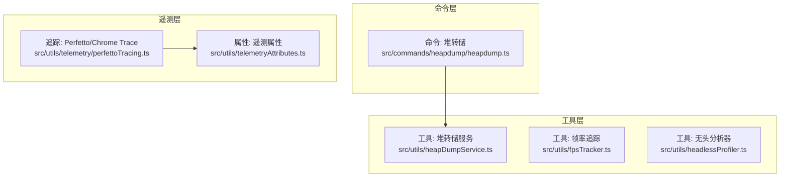
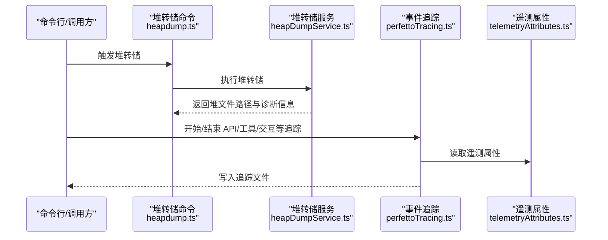
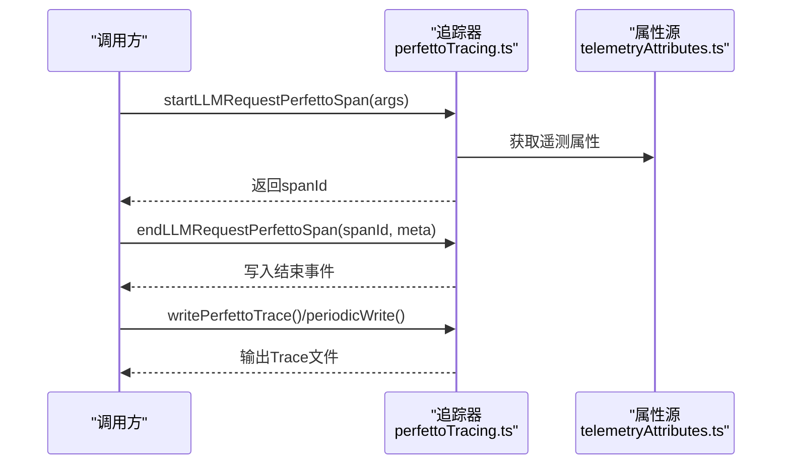
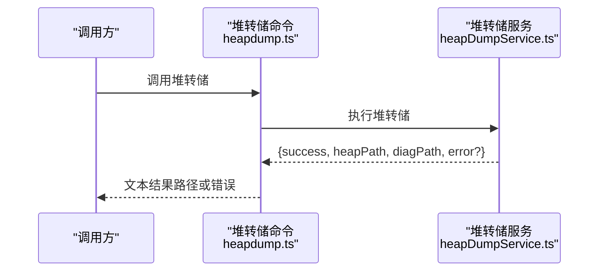
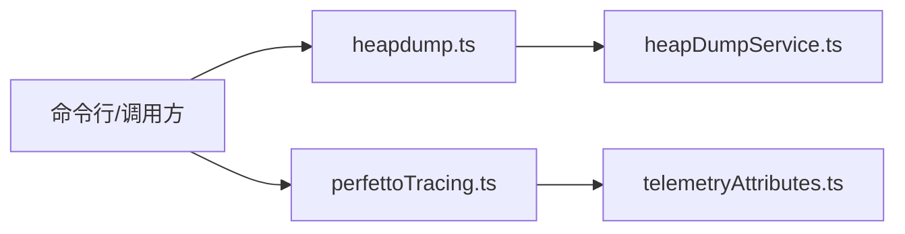

# 性能分析与优化

<cite>
**本文引用的文件**
- [perfettoTracing.ts](file://src/utils/telemetry/perfettoTracing.ts)
- [heapDumpService.ts](file://src/utils/heapDumpService.ts)
- [heapdump.ts](file://src/commands/heapdump/heapdump.ts)
- [fpsTracker.ts](file://src/utils/fpsTracker.ts)
- [telemetryAttributes.ts](file://src/utils/telemetryAttributes.ts)
- [insights.ts](file://src/commands/insights.ts)
- [headlessProfiler.ts](file://src/utils/headlessProfiler.ts)
- [package-lock.json](file://package-lock.json)
</cite>

## 目录
1. [简介](#简介)
2. [项目结构](#项目结构)
3. [核心组件](#核心组件)
4. [架构总览](#架构总览)
5. [详细组件分析](#详细组件分析)
6. [依赖关系分析](#依赖关系分析)
7. [性能考量](#性能考量)
8. [故障排查指南](#故障排查指南)
9. [结论](#结论)
10. [附录](#附录)

## 简介
本指南面向 Claude Code 的性能分析与优化实践，聚焦于以下能力：
- 使用 CPU 分析器（含无头分析）、内存分析器（堆转储）与事件式性能追踪（Perfetto/Chrome Trace）进行系统级性能诊断
- 识别与定位性能瓶颈：CPU 密集路径、内存增长、I/O 阻塞、长尾交互与 API 延迟
- 提供可落地的优化策略与实施步骤
- 建立性能回归测试与持续性能监控流程
- 介绍性能基准测试与对比分析的方法与工具链

## 项目结构
本仓库围绕“命令-服务-工具-遥测”分层组织，性能相关能力主要分布在：
- 命令层：提供性能采集命令入口（如堆转储）
- 工具层：实现具体性能采集与分析工具（CPU、内存、帧率、无头分析）
- 遥测层：统一事件式性能追踪（Perfetto/Chrome Trace），支持细粒度时序与聚合指标

图示来源
- [heapdump.ts:1-17](file://src/commands/heapdump/heapdump.ts#L1-L17)
- [heapDumpService.ts](file://src/utils/heapDumpService.ts)
- [fpsTracker.ts](file://src/utils/fpsTracker.ts)
- [headlessProfiler.ts](file://src/utils/headlessProfiler.ts)
- [perfettoTracing.ts:114-150](file://src/utils/telemetry/perfettoTracing.ts#L114-L150)
- [telemetryAttributes.ts:1-42](file://src/utils/telemetryAttributes.ts#L1-L42)

章节来源
- [heapdump.ts:1-17](file://src/commands/heapdump/heapdump.ts#L1-L17)
- [heapDumpService.ts](file://src/utils/heapDumpService.ts)
- [fpsTracker.ts](file://src/utils/fpsTracker.ts)
- [headlessProfiler.ts](file://src/utils/headlessProfiler.ts)
- [perfettoTracing.ts:114-150](file://src/utils/telemetry/perfettoTracing.ts#L114-L150)
- [telemetryAttributes.ts:1-42](file://src/utils/telemetryAttributes.ts#L1-L42)

## 核心组件
- 事件式性能追踪（Perfetto/Chrome Trace）
  - 能力：以“开始/结束”事件记录 API 调用、工具执行、用户等待、交互等关键阶段，支持采样阶段细分与时延统计
  - 关键接口：开始/结束 API 调用、工具执行、用户输入等待、交互等
  - 输出：周期性写盘与最终落盘，生成可导入 Chrome Tracing/Perfetto 的 JSON 文档
- 堆转储（Heap Dump）
  - 能力：触发 V8 堆转储，输出堆文件与诊断信息，辅助定位内存泄漏与对象增长
  - 入口：命令层调用工具层服务
- 帧率追踪（FPS Tracker）
  - 能力：在渲染或交互场景下统计帧率，用于 UI 卡顿与渲染性能评估
- 无头分析器（Headless Profiler）
  - 能力：在非 GUI 环境下进行 CPU/内存采样，便于 CI 或远程环境下的性能分析
- 遥测属性（Telemetry Attributes）
  - 能力：按环境变量控制是否包含会话 ID、版本号、账户 UUID 等维度，平衡指标颗粒度与隐私

章节来源
- [perfettoTracing.ts:425-463](file://src/utils/telemetry/perfettoTracing.ts#L425-L463)
- [perfettoTracing.ts:687-763](file://src/utils/telemetry/perfettoTracing.ts#L687-L763)
- [perfettoTracing.ts:765-835](file://src/utils/telemetry/perfettoTracing.ts#L765-L835)
- [perfettoTracing.ts:948-1037](file://src/utils/telemetry/perfettoTracing.ts#L948-L1037)
- [heapDumpService.ts](file://src/utils/heapDumpService.ts)
- [heapdump.ts:1-17](file://src/commands/heapdump/heapdump.ts#L1-L17)
- [fpsTracker.ts](file://src/utils/fpsTracker.ts)
- [headlessProfiler.ts](file://src/utils/headlessProfiler.ts)
- [telemetryAttributes.ts:1-42](file://src/utils/telemetryAttributes.ts#L1-L42)

## 架构总览
下图展示性能分析子系统的整体交互：命令入口触发工具层采集，工具层通过遥测层输出事件流；同时提供独立的内存与帧率分析能力。

图示来源
- [heapdump.ts:1-17](file://src/commands/heapdump/heapdump.ts#L1-L17)
- [heapDumpService.ts](file://src/utils/heapDumpService.ts)
- [perfettoTracing.ts:425-463](file://src/utils/telemetry/perfettoTracing.ts#L425-L463)
- [telemetryAttributes.ts:29-42](file://src/utils/telemetryAttributes.ts#L29-L42)

## 详细组件分析

### 事件式性能追踪（Perfetto/Chrome Trace）
- 设计要点
  - 采用“开始/结束”事件模型，支持嵌套与并发事件
  - 将代理/会话映射为进程/线程 ID，保证多实例可区分
  - 支持采样阶段细分（首 token 到结束），计算实际采样时长
  - 提供周期性写盘与最终落盘，避免异常退出导致数据丢失
- 关键流程
  - 启动 API 调用/工具执行/用户等待/交互等事件
  - 记录参数（模型、令牌数、消息 ID、上下文等）
  - 结束事件时计算耗时并写入事件数组
  - 定期或会话结束时序列化为 Trace 文档

图示来源
- [perfettoTracing.ts:425-463](file://src/utils/telemetry/perfettoTracing.ts#L425-L463)
- [perfettoTracing.ts:642-685](file://src/utils/telemetry/perfettoTracing.ts#L642-L685)
- [perfettoTracing.ts:990-1037](file://src/utils/telemetry/perfettoTracing.ts#L990-L1037)
- [telemetryAttributes.ts:29-42](file://src/utils/telemetryAttributes.ts#L29-L42)

章节来源
- [perfettoTracing.ts:114-150](file://src/utils/telemetry/perfettoTracing.ts#L114-L150)
- [perfettoTracing.ts:425-463](file://src/utils/telemetry/perfettoTracing.ts#L425-L463)
- [perfettoTracing.ts:642-685](file://src/utils/telemetry/perfettoTracing.ts#L642-L685)
- [perfettoTracing.ts:687-763](file://src/utils/telemetry/perfettoTracing.ts#L687-L763)
- [perfettoTracing.ts:765-835](file://src/utils/telemetry/perfettoTracing.ts#L765-L835)
- [perfettoTracing.ts:948-1037](file://src/utils/telemetry/perfettoTracing.ts#L948-L1037)
- [telemetryAttributes.ts:1-42](file://src/utils/telemetryAttributes.ts#L1-L42)

### 堆转储（Heap Dump）
- 设计要点
  - 命令层负责触发与结果呈现
  - 工具层封装堆转储逻辑与错误处理
- 流程
  - 命令调用服务执行堆转储
  - 成功返回堆文件路径与诊断路径，失败返回错误信息

图示来源
- [heapdump.ts:1-17](file://src/commands/heapdump/heapdump.ts#L1-L17)
- [heapDumpService.ts](file://src/utils/heapDumpService.ts)

章节来源
- [heapdump.ts:1-17](file://src/commands/heapdump/heapdump.ts#L1-L17)
- [heapDumpService.ts](file://src/utils/heapDumpService.ts)

### 帧率追踪（FPS Tracker）
- 设计要点
  - 在渲染/交互密集场景下统计帧率，用于识别卡顿与渲染热点
  - 可结合 UI 渲染循环与动画节拍进行采样
- 应用建议
  - 在长时间交互或批量 UI 更新前后启用/停止
  - 对比不同配置或版本的帧率分布，定位渲染回归

章节来源
- [fpsTracker.ts](file://src/utils/fpsTracker.ts)

### 无头分析器（Headless Profiler）
- 设计要点
  - 在非 GUI 环境下进行 CPU/内存采样，适合 CI/远程调试
- 应用建议
  - 在自动化脚本中集成采样周期与输出目录
  - 与事件式追踪配合，形成“行为+时序+资源”的完整画像

章节来源
- [headlessProfiler.ts](file://src/utils/headlessProfiler.ts)

### 遥测属性（Telemetry Attributes）
- 设计要点
  - 按环境变量控制是否包含会话 ID、版本号、账户 UUID 等
  - 降低高基数维度带来的存储与查询成本
- 应用建议
  - 在生产环境默认开启必要维度，开发/CI 可按需裁剪

章节来源
- [telemetryAttributes.ts:1-42](file://src/utils/telemetryAttributes.ts#L1-L42)

### 性能洞察可视化（Insights）
- 设计要点
  - 提供响应时间直方图与统计摘要（中位数、平均值）
  - 支持固定顺序与降序排序的条形图
- 应用建议
  - 将用户响应时间分布作为关键 SLI，识别长尾延迟
  - 与事件式追踪结合，定位高延迟阶段（解析、网络、渲染）

章节来源
- [insights.ts:1832-1861](file://src/commands/insights.ts#L1832-L1861)
- [insights.ts:1863-1875](file://src/commands/insights.ts#L1863-L1875)
- [insights.ts:2542-2551](file://src/commands/insights.ts#L2542-L2551)

## 依赖关系分析
- 组件耦合
  - 命令层仅依赖工具层接口，低耦合、易替换
  - 遥测层对属性源存在只读依赖，便于扩展新维度
  - 事件式追踪与属性源解耦，可通过环境变量控制输出粒度
- 外部依赖
  - 事件式追踪依赖 Node.js 文件系统与时间戳 API
  - 堆转储依赖运行时 V8 接口
  - 帧率与无头分析器依赖平台渲染/采样能力

图示来源
- [heapdump.ts:1-17](file://src/commands/heapdump/heapdump.ts#L1-L17)
- [heapDumpService.ts](file://src/utils/heapDumpService.ts)
- [perfettoTracing.ts:990-1037](file://src/utils/telemetry/perfettoTracing.ts#L990-L1037)
- [telemetryAttributes.ts:29-42](file://src/utils/telemetryAttributes.ts#L29-L42)

章节来源
- [heapdump.ts:1-17](file://src/commands/heapdump/heapdump.ts#L1-L17)
- [heapDumpService.ts](file://src/utils/heapDumpService.ts)
- [perfettoTracing.ts:990-1037](file://src/utils/telemetry/perfettoTracing.ts#L990-L1037)
- [telemetryAttributes.ts:1-42](file://src/utils/telemetryAttributes.ts#L1-L42)

## 性能考量
- 事件式追踪开销
  - 采用周期性写盘与最终落盘策略，避免高频 I/O 影响主流程
  - 通过 TTL 与清理定时器回收陈旧事件，防止内存膨胀
- 堆转储与采样
  - 堆转储为一次性重操作，建议在问题复现后触发并离线分析
  - 无头分析器适合短周期采样，避免长时间采样带来的额外负载
- 指标维度控制
  - 通过遥测属性开关控制高基数维度，兼顾可观测性与成本
- 基准测试与对比
  - 建议在相同硬件与环境条件下运行，统一采样时长与重复次数
  - 对比 CPU/内存/事件时序与 UI 帧率，综合评估优化效果

## 故障排查指南
- 事件式追踪未落盘
  - 检查追踪器状态与写盘路径，确认周期写盘与最终落盘逻辑是否被调用
  - 查看日志输出，定位 I/O 异常或权限问题
- 堆转储失败
  - 检查服务返回的错误信息，确认运行时可用内存与磁盘空间
  - 确认命令调用上下文与权限
- 帧率异常
  - 对比不同配置下的帧率分布，关注渲染密集型操作
  - 结合事件式追踪中的渲染阶段，定位阻塞点

章节来源
- [perfettoTracing.ts:990-1037](file://src/utils/telemetry/perfettoTracing.ts#L990-L1037)
- [heapdump.ts:6-11](file://src/commands/heapdump/heapdump.ts#L6-L11)
- [heapDumpService.ts](file://src/utils/heapDumpService.ts)

## 结论
通过事件式追踪、堆转储与帧率/无头分析器的组合，Claude Code 能够在复杂交互场景下实现端到端的性能画像。建议将上述能力纳入日常开发与发布流程，建立持续监控与回归测试机制，确保性能稳定与持续改进。

## 附录
- 性能分析工具链参考
  - 事件式追踪：Chrome Tracing/Perfetto
  - 堆分析：Node.js V8 Heap Snapshot（结合堆转储输出）
  - 帧率与渲染：浏览器开发者工具/帧率面板
  - 基准测试：es-toolkit（仓库内包含基准工作区）

章节来源
- [package-lock.json:2626-2633](file://package-lock.json#L2626-L2633)