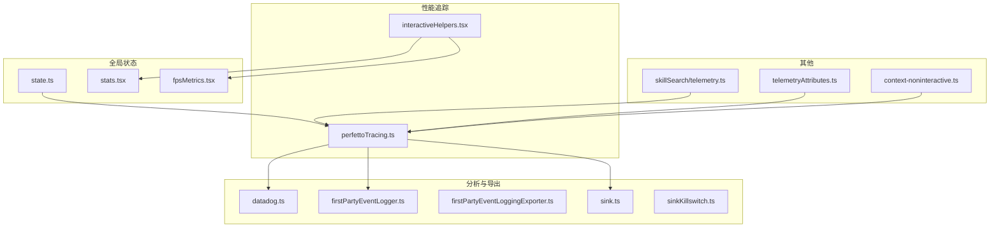
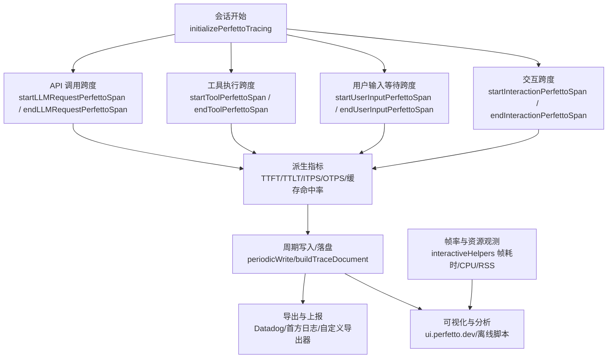
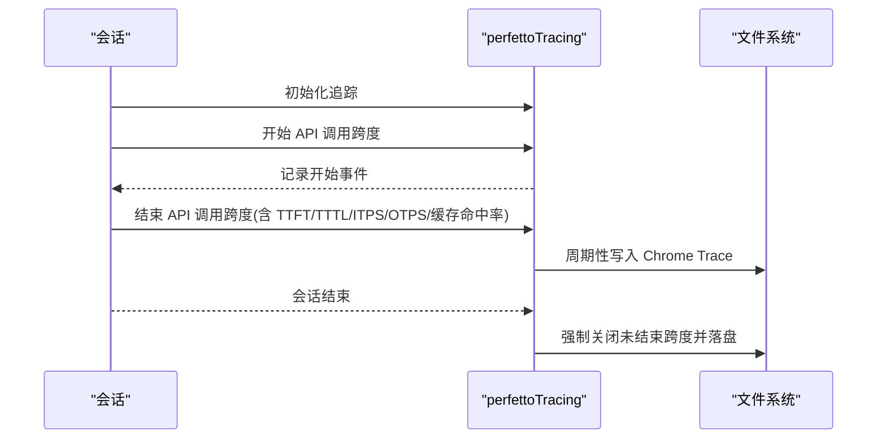
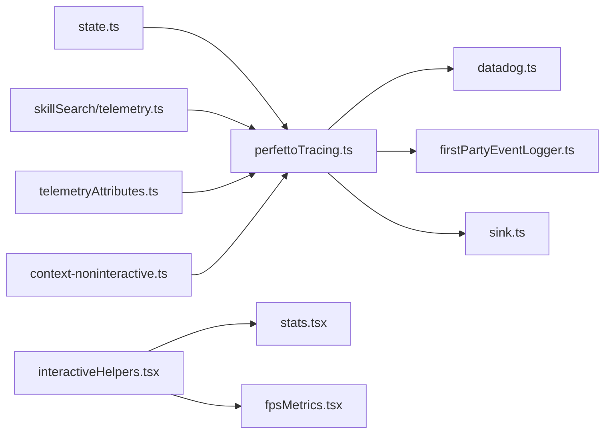
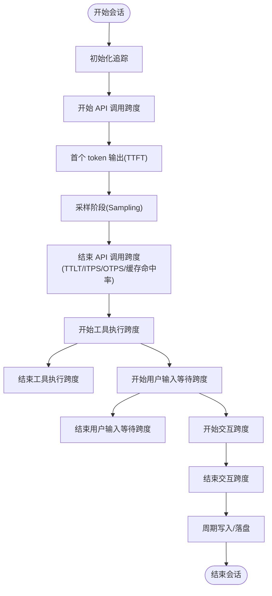

# 性能指标体系

<cite>
**本文引用的文件**
- [perfettoTracing.ts](file://src/utils/telemetry/perfettoTracing.ts)
- [state.ts](file://src/bootstrap/state.ts)
- [insights.ts](file://src/commands/insights.ts)
- [interactiveHelpers.tsx](file://src/interactiveHelpers.tsx)
- [datadog.ts](file://src/services/analytics/datadog.ts)
- [firstPartyEventLogger.ts](file://src/services/analytics/firstPartyEventLogger.ts)
- [firstPartyEventLoggingExporter.ts](file://src/services/analytics/firstPartyEventLoggingExporter.ts)
- [sink.ts](file://src/services/analytics/sink.ts)
- [sinkKillswitch.ts](file://src/services/analytics/sinkKillswitch.ts)
- [telemetry.ts](file://src/services/skillSearch/telemetry.ts)
- [telemetryAttributes.ts](file://src/utils/telemetryAttributes.ts)
- [context-noninteractive.ts](file://src/commands/context/context-noninteractive.ts)
- [stats.tsx](file://src/context/stats.tsx)
- [fpsMetrics.tsx](file://src/context/fpsMetrics.tsx)
</cite>

## 目录
1. [引言](#引言)
2. [项目结构](#项目结构)
3. [核心组件](#核心组件)
4. [架构总览](#架构总览)
5. [详细组件分析](#详细组件分析)
6. [依赖关系分析](#依赖关系分析)
7. [性能考量](#性能考量)
8. [故障排查指南](#故障排查指南)
9. [结论](#结论)
10. [附录](#附录)

## 引言
本文件系统化梳理 Claude Code 的性能指标体系，覆盖响应时间、吞吐量、资源利用率等关键指标，解释会话级性能事件的采集与分析流程，并给出组件级监控策略、指标收集机制与基准测试方法。目标是帮助开发者在不深入源码的前提下，理解并应用这些指标进行性能优化与问题定位。

## 项目结构
围绕性能指标的关键目录与文件如下：
- 会话级性能追踪：perfettoTracing（Chrome Trace 格式）
- 全局状态与计数器：state（会话计数器、活跃时长、成本与令牌计数器等）
- 用户交互与帧率统计：interactiveHelpers（帧耗时、CPU/RSS 观测）
- 分析与导出：analytics（Datadog、首方日志、导出器、开关）
- 技能搜索性能：skillSearch/telemetry
- 上下文与统计：context/stats、context/fpsMetrics
- 指标属性与上下文：telemetryAttributes、context-noninteractive

图表来源
- [perfettoTracing.ts](file://src/utils/telemetry/perfettoTracing.ts)
- [interactiveHelpers.tsx](file://src/interactiveHelpers.tsx)
- [state.ts](file://src/bootstrap/state.ts)
- [stats.tsx](file://src/context/stats.tsx)
- [fpsMetrics.tsx](file://src/context/fpsMetrics.tsx)
- [datadog.ts](file://src/services/analytics/datadog.ts)
- [firstPartyEventLogger.ts](file://src/services/analytics/firstPartyEventLogger.ts)
- [firstPartyEventLoggingExporter.ts](file://src/services/analytics/firstPartyEventLoggingExporter.ts)
- [sink.ts](file://src/services/analytics/sink.ts)
- [sinkKillswitch.ts](file://src/services/analytics/sinkKillswitch.ts)
- [telemetry.ts](file://src/services/skillSearch/telemetry.ts)
- [telemetryAttributes.ts](file://src/utils/telemetryAttributes.ts)
- [context-noninteractive.ts](file://src/commands/context/context-noninteractive.ts)

章节来源
- [perfettoTracing.ts](file://src/utils/telemetry/perfettoTracing.ts)
- [state.ts](file://src/bootstrap/state.ts)
- [interactiveHelpers.tsx](file://src/interactiveHelpers.tsx)
- [datadog.ts](file://src/services/analytics/datadog.ts)
- [firstPartyEventLogger.ts](file://src/services/analytics/firstPartyEventLogger.ts)
- [firstPartyEventLoggingExporter.ts](file://src/services/analytics/firstPartyEventLoggingExporter.ts)
- [sink.ts](file://src/services/analytics/sink.ts)
- [sinkKillswitch.ts](file://src/services/analytics/sinkKillswitch.ts)
- [telemetry.ts](file://src/services/skillSearch/telemetry.ts)
- [telemetryAttributes.ts](file://src/utils/telemetryAttributes.ts)
- [context-noninteractive.ts](file://src/commands/context/context-noninteractive.ts)
- [stats.tsx](file://src/context/stats.tsx)
- [fpsMetrics.tsx](file://src/context/fpsMetrics.tsx)

## 核心组件
- 会话级性能追踪（Perfetto/Chrome Trace）：提供 API 调用、工具执行、用户等待、交互等跨度事件的采集与落盘，支持 TTFT/TTLT/ITPS/OTPS/缓存命中率等派生指标。
- 全局状态与计数器：提供会话、LOC、PR、提交、成本、令牌、活跃时长等计数器访问接口，便于跨模块统计与聚合。
- 用户交互与渲染性能：记录帧耗时、CPU 使用、RSS 内存，支持离线分析。
- 分析与导出：Datadog 集成、首方事件日志、导出器与开关，用于性能数据的上报与控制。
- 技能搜索性能：技能搜索模块的性能遥测，辅助评估检索与排序开销。
- 指标属性与上下文：统一的遥测属性与上下文信息，确保指标的一致性与可比性。

章节来源
- [perfettoTracing.ts](file://src/utils/telemetry/perfettoTracing.ts)
- [state.ts](file://src/bootstrap/state.ts)
- [interactiveHelpers.tsx](file://src/interactiveHelpers.tsx)
- [datadog.ts](file://src/services/analytics/datadog.ts)
- [firstPartyEventLogger.ts](file://src/services/analytics/firstPartyEventLogger.ts)
- [firstPartyEventLoggingExporter.ts](file://src/services/analytics/firstPartyEventLoggingExporter.ts)
- [sink.ts](file://src/services/analytics/sink.ts)
- [sinkKillswitch.ts](file://src/services/analytics/sinkKillswitch.ts)
- [telemetry.ts](file://src/services/skillSearch/telemetry.ts)
- [telemetryAttributes.ts](file://src/utils/telemetryAttributes.ts)
- [context-noninteractive.ts](file://src/commands/context/context-noninteractive.ts)
- [stats.tsx](file://src/context/stats.tsx)
- [fpsMetrics.tsx](file://src/context/fpsMetrics.tsx)

## 架构总览
下图展示性能指标体系的整体架构：从会话级事件采集到指标派生与导出，再到可视化与分析。

图表来源
- [perfettoTracing.ts](file://src/utils/telemetry/perfettoTracing.ts)
- [interactiveHelpers.tsx](file://src/interactiveHelpers.tsx)
- [datadog.ts](file://src/services/analytics/datadog.ts)
- [firstPartyEventLogger.ts](file://src/services/analytics/firstPartyEventLogger.ts)
- [firstPartyEventLoggingExporter.ts](file://src/services/analytics/firstPartyEventLoggingExporter.ts)

## 详细组件分析

### 会话级性能追踪（Perfetto/Chrome Trace）
- 事件模型：以“开始/结束”事件记录跨度，支持嵌套子跨度（如采样阶段），并记录进程/线程元数据。
- 关键指标与派生指标：
  - TTFT（首次 token 时间）：从请求开始到首个 token 输出的时间。
  - TTLT（总延迟）：从请求开始到完整响应结束的时间。
  - ITPS（输入 tokens/秒）：基于 prompt tokens 与请求设置时间估算。
  - OTPS（输出 tokens/秒）：基于采样阶段输出 token 数与实际采样时长估算。
  - 缓存命中率（%）：基于缓存读取 token 与 prompt token 计算。
- 事件落盘：周期性写入磁盘，异常吞掉避免影响会话；会话结束强制关闭未结束跨度。
- 环境控制：通过环境变量启用/禁用追踪与指定输出路径。

图表来源
- [perfettoTracing.ts](file://src/utils/telemetry/perfettoTracing.ts)

章节来源
- [perfettoTracing.ts](file://src/utils/telemetry/perfettoTracing.ts)

### 全局状态与计数器
- 提供会话计数器、LOC/PR/提交计数器、成本与令牌计数器、活跃时长计数器等访问接口，便于在各模块中统一统计与上报。

章节来源
- [state.ts](file://src/bootstrap/state.ts)

### 用户交互与渲染性能
- 帧率与资源观测：在 TUI 渲染管线中记录每帧耗时、CPU 使用、RSS 内存，支持将阶段耗时写入文件以便离线分析。
- 适用场景：验证渲染阶段优化效果、识别 UI 卡顿瓶颈。

章节来源
- [interactiveHelpers.tsx](file://src/interactiveHelpers.tsx)
- [stats.tsx](file://src/context/stats.tsx)
- [fpsMetrics.tsx](file://src/context/fpsMetrics.tsx)

### 分析与导出
- Datadog 集成：将性能事件与指标上报至 Datadog，便于集中监控与告警。
- 首方事件日志：内部事件日志记录与导出器，支持开关控制与 Kill Switch。
- 导出器：统一的导出接口，便于扩展新的上报通道。

章节来源
- [datadog.ts](file://src/services/analytics/datadog.ts)
- [firstPartyEventLogger.ts](file://src/services/analytics/firstPartyEventLogger.ts)
- [firstPartyEventLoggingExporter.ts](file://src/services/analytics/firstPartyEventLoggingExporter.ts)
- [sink.ts](file://src/services/analytics/sink.ts)
- [sinkKillswitch.ts](file://src/services/analytics/sinkKillswitch.ts)

### 技能搜索性能
- 技能搜索模块的性能遥测，用于评估检索与排序的开销，辅助优化搜索链路。

章节来源
- [telemetry.ts](file://src/services/skillSearch/telemetry.ts)

### 指标属性与上下文
- 统一的遥测属性与上下文信息，确保指标在不同模块间的一致性与可比性。

章节来源
- [telemetryAttributes.ts](file://src/utils/telemetryAttributes.ts)
- [context-noninteractive.ts](file://src/commands/context/context-noninteractive.ts)

### 会话跟踪与性能分析（命令行洞察）
- 提供用户响应时间分布直方图与统计摘要，辅助分析用户侧交互性能。

章节来源
- [insights.ts](file://src/commands/insights.ts)

## 依赖关系分析
- 组件耦合：
  - perfettoTracing 作为核心事件采集器，被分析与导出模块间接依赖。
  - interactiveHelpers 与上下文模块（stats/fpsMetrics）独立运行，但可与 perfettoTracing 的会话关联。
  - analytics 子模块通过 sink 与 killswitch 控制上报行为。
- 外部依赖：
  - Chrome Trace 可视化平台（ui.perfetto.dev）用于事件回放与分析。
  - Datadog 平台用于集中监控与告警。

图表来源
- [perfettoTracing.ts](file://src/utils/telemetry/perfettoTracing.ts)
- [interactiveHelpers.tsx](file://src/interactiveHelpers.tsx)
- [state.ts](file://src/bootstrap/state.ts)
- [stats.tsx](file://src/context/stats.tsx)
- [fpsMetrics.tsx](file://src/context/fpsMetrics.tsx)
- [datadog.ts](file://src/services/analytics/datadog.ts)
- [firstPartyEventLogger.ts](file://src/services/analytics/firstPartyEventLogger.ts)
- [sink.ts](file://src/services/analytics/sink.ts)
- [telemetry.ts](file://src/services/skillSearch/telemetry.ts)
- [telemetryAttributes.ts](file://src/utils/telemetryAttributes.ts)
- [context-noninteractive.ts](file://src/commands/context/context-noninteractive.ts)

## 性能考量
- 响应时间（RT）
  - 定义：从请求发起到收到完整响应的时间。
  - 指标来源：TTFT、TTLT。
  - 应用场景：评估端到端响应质量，定位网络/服务端/客户端瓶颈。
- 吞吐量（TPS）
  - 定义：单位时间内完成的请求数或处理的 token 数。
  - 派生指标：ITPS（输入 T/S）、OTPS（输出 T/S）。
  - 应用场景：评估系统承载能力与资源利用效率。
- 资源利用率
  - 定义：CPU、内存（RSS）、I/O 在关键阶段的占用情况。
  - 指标来源：帧耗时、CPU 使用、RSS 内存。
  - 应用场景：识别 UI 卡顿、内存泄漏与 CPU 热点。
- 缓存命中率
  - 定义：缓存读取 token 占比。
  - 指标来源：缓存读取 token 与 prompt token。
  - 应用场景：评估缓存策略有效性与预热效果。

章节来源
- [perfettoTracing.ts](file://src/utils/telemetry/perfettoTracing.ts)
- [interactiveHelpers.tsx](file://src/interactiveHelpers.tsx)

## 故障排查指南
- 追踪未生成或丢失
  - 检查环境变量是否启用追踪与输出路径是否可写。
  - 查看周期写入日志与异常吞掉的错误记录。
- 事件缺失或不完整
  - 确认所有跨度均正确配对（开始/结束）。
  - 会话结束时强制关闭未结束跨度，检查 incomplete 标记。
- 数据导出失败
  - 检查导出器与开关状态，确认 Kill Switch 是否开启。
- UI 卡顿
  - 使用帧耗时与资源观测数据，定位渲染阶段热点。

章节来源
- [perfettoTracing.ts](file://src/utils/telemetry/perfettoTracing.ts)
- [sinkKillswitch.ts](file://src/services/analytics/sinkKillswitch.ts)
- [interactiveHelpers.tsx](file://src/interactiveHelpers.tsx)

## 结论
该性能指标体系以会话级事件追踪为核心，结合派生指标与资源观测，形成从端到端响应到 UI 渲染的全链路可观测性。通过统一的导出与可视化平台，能够高效定位瓶颈并指导优化。

## 附录

### 性能事件采集流程（流程图）

图表来源
- [perfettoTracing.ts](file://src/utils/telemetry/perfettoTracing.ts)

### 指标定义与计算方法（表格）
- 响应时间
  - TTFT：首次 token 输出时间
  - TTLT：完整响应结束时间
- 吞吐量
  - ITPS：输入 tokens/秒
  - OTPS：输出 tokens/秒
- 资源利用率
  - 帧耗时（ms）、CPU 使用、RSS（字节）
- 缓存命中率
  - 百分比：缓存读取 token / prompt token

章节来源
- [perfettoTracing.ts](file://src/utils/telemetry/perfettoTracing.ts)
- [interactiveHelpers.tsx](file://src/interactiveHelpers.tsx)