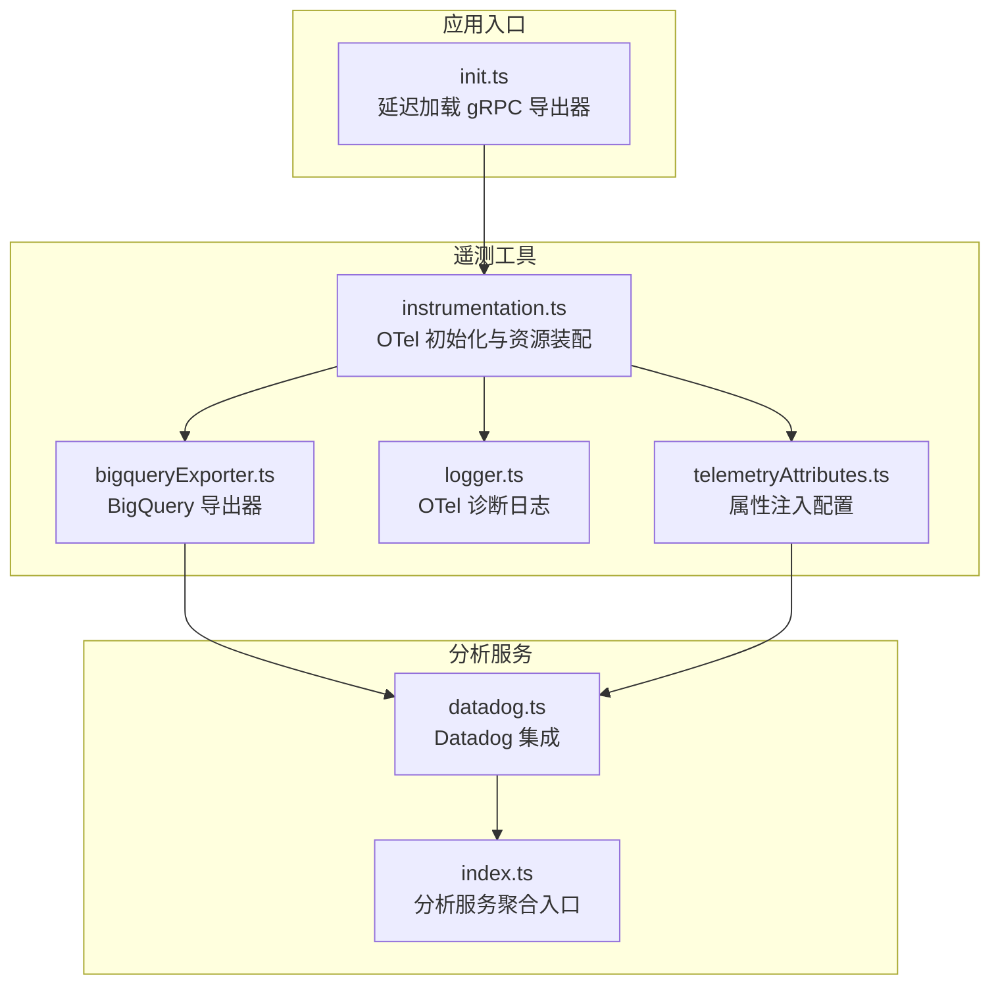
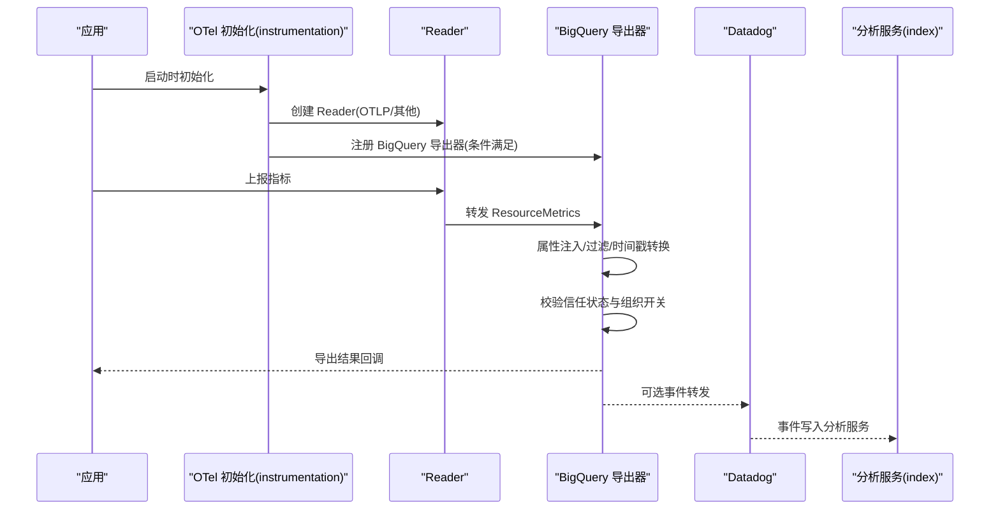
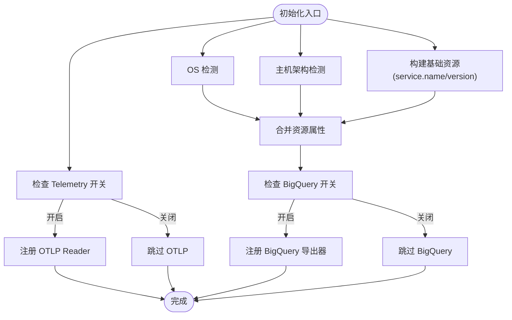
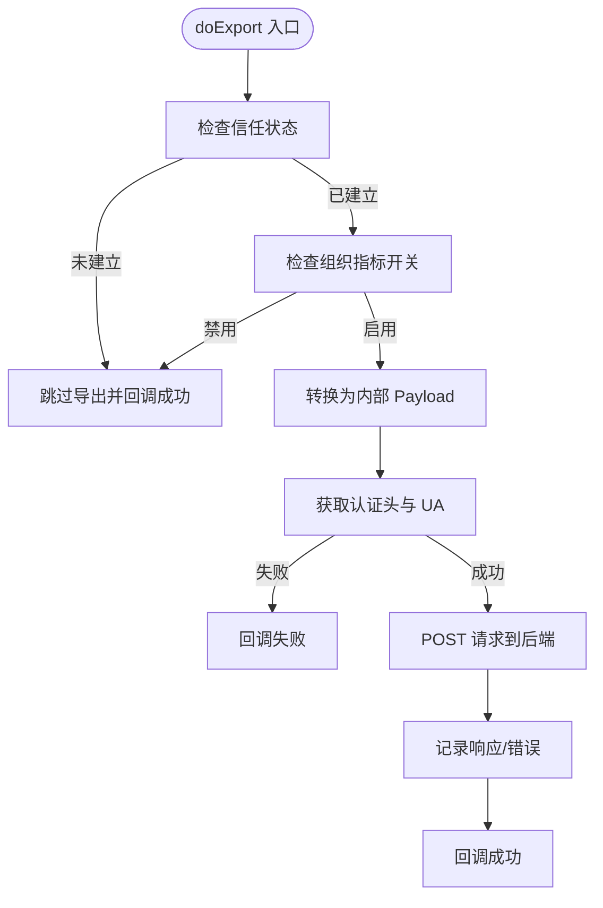
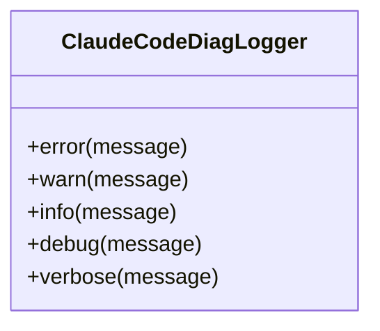
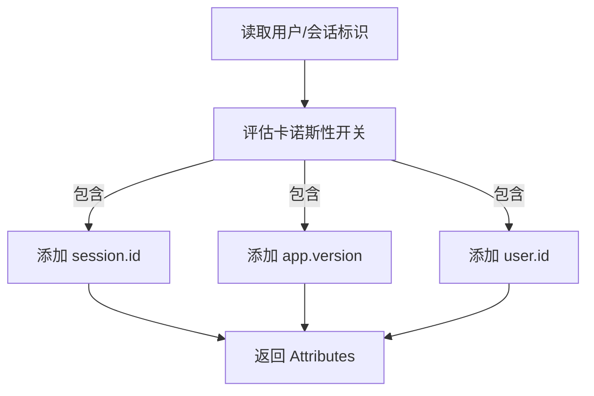
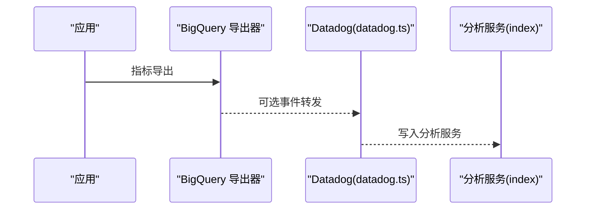
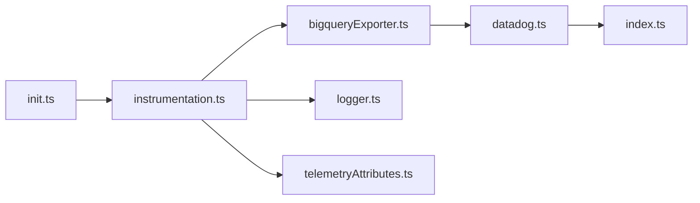

# 监控架构设计

<cite>
**本文档引用的文件**
- [bigqueryExporter.ts](file://src/utils/telemetry/bigqueryExporter.ts)
- [instrumentation.ts](file://src/utils/telemetry/instrumentation.ts)
- [logger.ts](file://src/utils/telemetry/logger.ts)
- [telemetryAttributes.ts](file://src/utils/telemetryAttributes.ts)
- [datadog.ts](file://src/services/analytics/datadog.ts)
- [index.ts](file://src/services/analytics/index.ts)
- [init.ts](file://src/entrypoints/init.ts)
</cite>

## 目录
1. [简介](#简介)
2. [项目结构](#项目结构)
3. [核心组件](#核心组件)
4. [架构总览](#架构总览)
5. [详细组件分析](#详细组件分析)
6. [依赖关系分析](#依赖关系分析)
7. [性能考虑](#性能考虑)
8. [故障排除指南](#故障排除指南)
9. [结论](#结论)

## 简介
本文件系统性阐述 Claude Code 的监控架构设计，聚焦于数据采集层、处理层与展示层的职责划分与协作机制。监控体系以 OpenTelemetry 为核心，结合内部 BigQuery 导出器与第三方分析平台（如 Datadog），实现从指标采集、属性注入、导出到可视化监控的完整闭环。文档同时给出可扩展性设计原则、模块化组织方式以及与第三方服务的集成策略。

## 项目结构
监控相关代码主要分布在以下位置：
- 通用遥测工具：src/utils/telemetry（包含 OpenTelemetry 初始化、导出器、诊断日志等）
- 分析服务：src/services/analytics（包含 Datadog 集成与事件日志）
- 应用入口：src/entrypoints/init.ts（延迟加载 gRPC 导出器，避免启动时额外开销）

图表来源
- [init.ts:45-45](file://src/entrypoints/init.ts#L45-L45)
- [instrumentation.ts:455-500](file://src/utils/telemetry/instrumentation.ts#L455-L500)
- [bigqueryExporter.ts:87-252](file://src/utils/telemetry/bigqueryExporter.ts#L87-L252)
- [logger.ts:1-26](file://src/utils/telemetry/logger.ts#L1-L26)
- [telemetryAttributes.ts:1-42](file://src/utils/telemetryAttributes.ts#L1-L42)
- [datadog.ts:158-158](file://src/services/analytics/datadog.ts#L158-L158)
- [index.ts:1-200](file://src/services/analytics/index.ts#L1-L200)

章节来源
- [init.ts:45-45](file://src/entrypoints/init.ts#L45-L45)
- [instrumentation.ts:455-500](file://src/utils/telemetry/instrumentation.ts#L455-L500)

## 核心组件
- OpenTelemetry 初始化与资源装配：负责创建 Reader、合并资源属性（平台、OS、主机架构等），并按需启用不同导出器。
- BigQuery 导出器：将 OTel 指标转换为内部格式并通过 HTTP 推送至后端接口，支持信任状态检查与组织级开关控制。
- 诊断日志适配器：将 OTel 内部诊断日志桥接到应用日志系统，便于问题定位。
- 属性注入配置：通过环境变量控制指标卡诺斯性（是否包含会话 ID、版本号、账户 UUID 等）。
- 分析服务（Datadog）：提供事件日志与分析能力，作为展示层与外部平台的桥梁。

章节来源
- [instrumentation.ts:455-500](file://src/utils/telemetry/instrumentation.ts#L455-L500)
- [bigqueryExporter.ts:87-252](file://src/utils/telemetry/bigqueryExporter.ts#L87-L252)
- [logger.ts:1-26](file://src/utils/telemetry/logger.ts#L1-L26)
- [telemetryAttributes.ts:1-42](file://src/utils/telemetryAttributes.ts#L1-L42)
- [datadog.ts:158-158](file://src/services/analytics/datadog.ts#L158-L158)

## 架构总览
监控系统采用分层设计：
- 数据采集层：OTel SDK 在应用中埋点与收集指标，初始化阶段根据运行环境与配置选择合适的 Reader。
- 处理层：属性注入与资源合并，过滤无效数据点，统一时间戳格式；在导出前进行信任与组织级开关校验。
- 展示层：指标通过 BigQuery 导出器进入内部数据管道，同时可选地经由 Datadog 等第三方平台进行可视化与告警。

图表来源
- [instrumentation.ts:455-500](file://src/utils/telemetry/instrumentation.ts#L455-L500)
- [bigqueryExporter.ts:87-252](file://src/utils/telemetry/bigqueryExporter.ts#L87-L252)
- [datadog.ts:158-158](file://src/services/analytics/datadog.ts#L158-L158)
- [index.ts:1-200](file://src/services/analytics/index.ts#L1-L200)

## 详细组件分析

### 组件A：OpenTelemetry 初始化与资源装配
职责与流程：
- 条件启用：根据全局 Telemetry 开关决定是否注册 OTLP Reader。
- 资源合并：基础服务名/版本 + OS 检测 + 主机架构 + 平台特定属性（WSL 版本）。
- 导出器注册：在 BigQuery 开关开启时注册 BigQuery 导出器。
- 诊断日志：安装自定义诊断日志适配器，统一错误/警告输出。

图表来源
- [instrumentation.ts:455-500](file://src/utils/telemetry/instrumentation.ts#L455-L500)

章节来源
- [instrumentation.ts:455-500](file://src/utils/telemetry/instrumentation.ts#L455-L500)

### 组件B：BigQuery 导出器
职责与流程：
- 导出前置校验：信任状态检查、组织级指标开关。
- 数据转换：提取 Resource/Metric 描述符与数据点，统一时间戳格式，过滤非数值数据点。
- 认证与请求：拼装认证头与 UA，发送 JSON Payload 至后端接口。
- 结果回调：成功/失败回调，支持强制刷新与优雅关闭。

图表来源
- [bigqueryExporter.ts:87-252](file://src/utils/telemetry/bigqueryExporter.ts#L87-L252)

章节来源
- [bigqueryExporter.ts:87-252](file://src/utils/telemetry/bigqueryExporter.ts#L87-L252)

### 组件C：诊断日志适配器
职责：
- 将 OTel 诊断日志映射到应用日志系统，确保错误与警告被一致记录与可观测。

图表来源
- [logger.ts:1-26](file://src/utils/telemetry/logger.ts#L1-L26)

章节来源
- [logger.ts:1-26](file://src/utils/telemetry/logger.ts#L1-L26)

### 组件D：属性注入与卡诺斯性控制
职责：
- 基于环境变量动态决定是否包含会话 ID、版本号、账户 UUID 等高基数属性，平衡指标维度与存储成本。

图表来源
- [telemetryAttributes.ts:1-42](file://src/utils/telemetryAttributes.ts#L1-L42)

章节来源
- [telemetryAttributes.ts:1-42](file://src/utils/telemetryAttributes.ts#L1-L42)

### 组件E：分析服务（Datadog 集成）
职责：
- 作为第三方分析平台的接入点，提供事件日志与可视化能力；通过聚合入口统一对外暴露。

图表来源
- [datadog.ts:158-158](file://src/services/analytics/datadog.ts#L158-L158)
- [index.ts:1-200](file://src/services/analytics/index.ts#L1-L200)

章节来源
- [datadog.ts:158-158](file://src/services/analytics/datadog.ts#L158-L158)
- [index.ts:1-200](file://src/services/analytics/index.ts#L1-L200)

## 依赖关系分析
- 启动时延展：gRPC 导出器通过延迟加载减少初始体积与冷启动开销。
- 运行时耦合：instrumentation 统一装配 Reader 与导出器；bigqueryExporter 依赖认证与组织策略；telemetryAttributes 提供属性注入。
- 第三方集成：Datadog 通过分析服务入口进行事件写入，形成展示层与数据层的解耦。

图表来源
- [init.ts:45-45](file://src/entrypoints/init.ts#L45-L45)
- [instrumentation.ts:455-500](file://src/utils/telemetry/instrumentation.ts#L455-L500)
- [bigqueryExporter.ts:87-252](file://src/utils/telemetry/bigqueryExporter.ts#L87-L252)
- [logger.ts:1-26](file://src/utils/telemetry/logger.ts#L1-L26)
- [telemetryAttributes.ts:1-42](file://src/utils/telemetryAttributes.ts#L1-L42)
- [datadog.ts:158-158](file://src/services/analytics/datadog.ts#L158-L158)
- [index.ts:1-200](file://src/services/analytics/index.ts#L1-L200)

章节来源
- [init.ts:45-45](file://src/entrypoints/init.ts#L45-L45)
- [instrumentation.ts:455-500](file://src/utils/telemetry/instrumentation.ts#L455-L500)

## 性能考虑
- 启动优化：延迟加载 gRPC 导出器，降低冷启动体积与时间。
- 导出并发：BigQuery 导出器在关闭时支持强制刷新，确保关键指标不丢失。
- 卡诺斯性控制：通过环境变量限制高基数属性，避免指标维度爆炸导致查询与存储压力。
- 时间戳一致性：统一将高分辨率时间转换为 ISO 字符串，保证跨系统对齐。

## 故障排除指南
- 导出失败排查：
  - 检查信任状态与组织指标开关，确认未被拦截。
  - 查看认证头与 UA 是否正确设置。
  - 关注网络超时与异常响应，必要时增加重试或降级策略。
- 日志定位：
  - 使用诊断日志适配器统一记录 OTel 错误/警告，便于快速定位。
- 性能影响：
  - 若发现指标维度过高，调整卡诺斯性开关，减少不必要的属性注入。
  - 在高并发场景下，关注导出器的批量与缓冲策略，避免阻塞主线程。

章节来源
- [bigqueryExporter.ts:87-252](file://src/utils/telemetry/bigqueryExporter.ts#L87-L252)
- [logger.ts:1-26](file://src/utils/telemetry/logger.ts#L1-L26)
- [telemetryAttributes.ts:1-42](file://src/utils/telemetryAttributes.ts#L1-L42)

## 结论
该监控架构以 OpenTelemetry 为基础，结合 BigQuery 导出器与第三方分析平台，实现了从采集、处理到展示的全链路可观测性。通过模块化组织与可配置的属性注入策略，系统在保证灵活性的同时兼顾性能与可维护性。建议在生产环境中持续监控导出成功率与指标维度，配合灰度发布与开关控制，逐步完善监控体系。