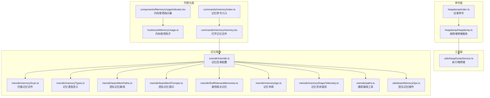
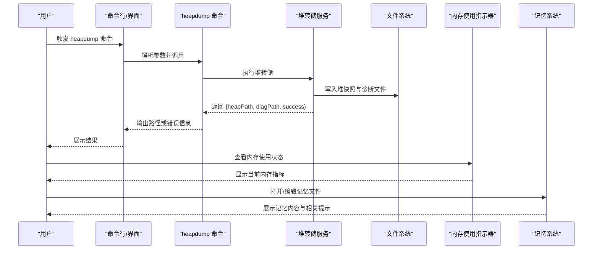
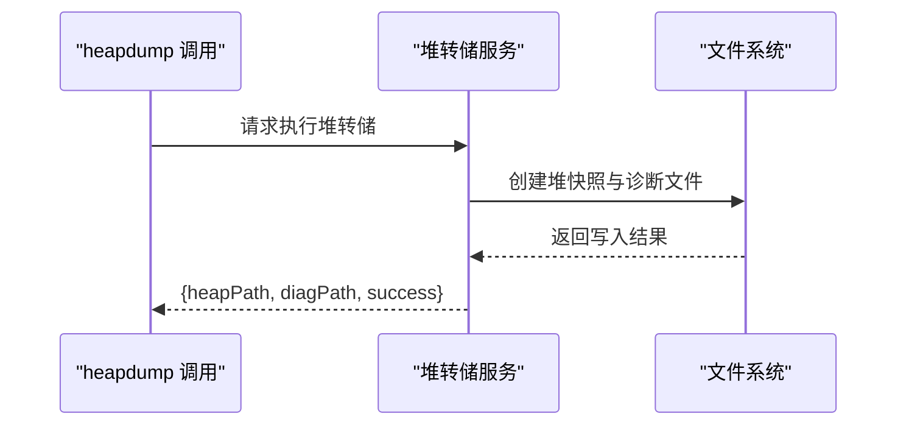
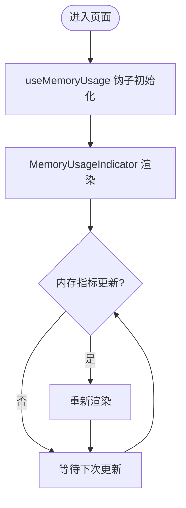
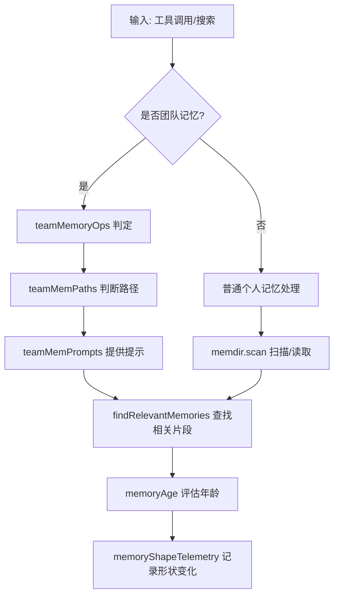
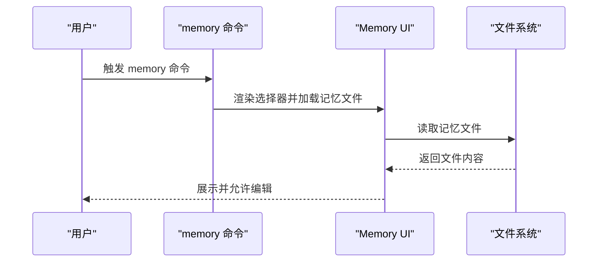
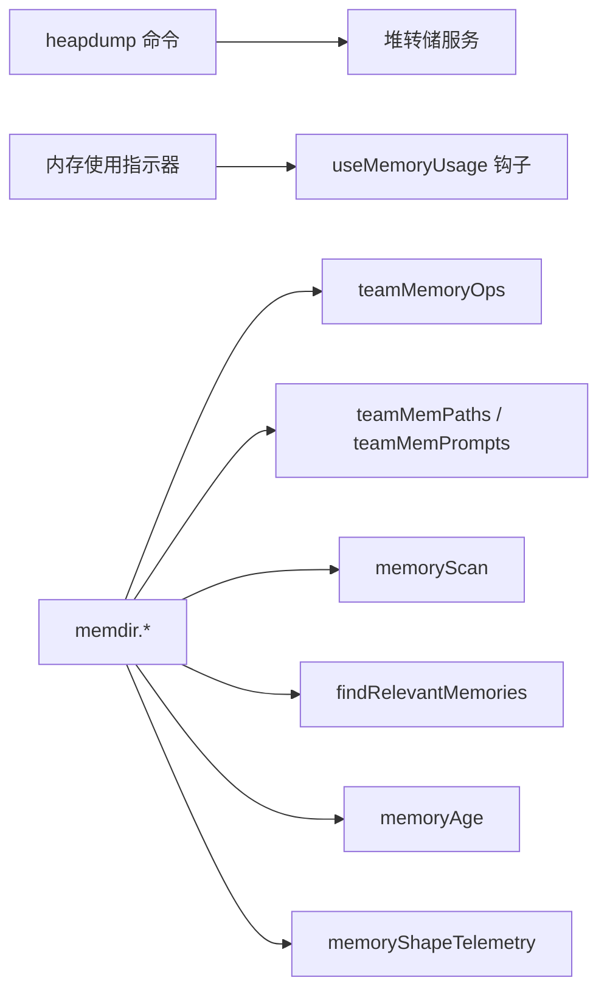

# 堆转储分析器

<cite>
**本文档引用的文件**
- [src/commands/heapdump/index.ts](file://src/commands/heapdump/index.ts)
- [src/commands/heapdump/heapdump.ts](file://src/commands/heapdump/heapdump.ts)
- [src/utils/heapDumpService.ts](file://src/utils/heapDumpService.ts)
- [src/components/MemoryUsageIndicator.tsx](file://src/components/MemoryUsageIndicator.tsx)
- [src/hooks/useMemoryUsage.ts](file://src/hooks/useMemoryUsage.ts)
- [src/commands/memory/index.ts](file://src/commands/memory/index.ts)
- [src/commands/memory/memory.tsx](file://src/commands/memory/memory.tsx)
- [src/memdir/memdir.ts](file://src/memdir/memdir.ts)
- [src/memdir/memoryScan.ts](file://src/memdir/memoryScan.ts)
- [src/memdir/memoryTypes.ts](file://src/memdir/memoryTypes.ts)
- [src/memdir/teamMemPaths.ts](file://src/memdir/teamMemPaths.ts)
- [src/memdir/teamMemPrompts.ts](file://src/memdir/teamMemPrompts.ts)
- [src/memdir/findRelevantMemories.ts](file://src/memdir/findRelevantMemories.ts)
- [src/memdir/memoryAge.ts](file://src/memdir/memoryAge.ts)
- [src/memdir/memoryShapeTelemetry.ts](file://src/memdir/memoryShapeTelemetry.ts)
- [src/memdir/paths.ts](file://src/memdir/paths.ts)
- [src/utils/teamMemoryOps.ts](file://src/utils/teamMemoryOps.ts)
</cite>

## 目录
1. [简介](#简介)
2. [项目结构](#项目结构)
3. [核心组件](#核心组件)
4. [架构总览](#架构总览)
5. [详细组件分析](#详细组件分析)
6. [依赖关系分析](#依赖关系分析)
7. [性能考量](#性能考量)
8. [故障排查指南](#故障排查指南)
9. [结论](#结论)
10. [附录](#附录)

## 简介
本指南面向需要诊断与优化 JavaScript 运行时内存问题（尤其是内存泄漏）的开发者。Claude Code 提供了“堆转储”能力，用于在本地生成 V8 堆快照与诊断信息，结合内存使用可视化组件与团队记忆（Team Memory）扫描工具，帮助定位对象未释放、引用链异常等内存泄漏模式，并给出优化建议与最佳实践。

## 项目结构
与堆转储分析相关的关键模块分布如下：
- 命令层：提供触发堆转储的命令入口与参数解析
- 工具层：封装实际执行堆转储的底层服务
- 可视化层：展示内存使用状态与交互式打开内存文件
- 记忆系统：管理个人与团队记忆文件，支持扫描与路径判定

图表来源
- [src/commands/heapdump/index.ts](file://src/commands/heapdump/index.ts)
- [src/commands/heapdump/heapdump.ts](file://src/commands/heapdump/heapdump.ts)
- [src/utils/heapDumpService.ts](file://src/utils/heapDumpService.ts)
- [src/components/MemoryUsageIndicator.tsx](file://src/components/MemoryUsageIndicator.tsx)
- [src/hooks/useMemoryUsage.ts](file://src/hooks/useMemoryUsage.ts)
- [src/commands/memory/index.ts](file://src/commands/memory/index.ts)
- [src/commands/memory/memory.tsx](file://src/commands/memory/memory.tsx)
- [src/memdir/memdir.ts](file://src/memdir/memdir.ts)
- [src/memdir/memoryScan.ts](file://src/memdir/memoryScan.ts)
- [src/memdir/memoryTypes.ts](file://src/memdir/memoryTypes.ts)
- [src/memdir/teamMemPaths.ts](file://src/memdir/teamMemPaths.ts)
- [src/memdir/teamMemPrompts.ts](file://src/memdir/teamMemPrompts.ts)
- [src/memdir/findRelevantMemories.ts](file://src/memdir/findRelevantMemories.ts)
- [src/memdir/memoryAge.ts](file://src/memdir/memoryAge.ts)
- [src/memdir/memoryShapeTelemetry.ts](file://src/memdir/memoryShapeTelemetry.ts)
- [src/memdir/paths.ts](file://src/memdir/paths.ts)
- [src/utils/teamMemoryOps.ts](file://src/utils/teamMemoryOps.ts)

章节来源
- [src/commands/heapdump/index.ts](file://src/commands/heapdump/index.ts)
- [src/commands/heapdump/heapdump.ts](file://src/commands/heapdump/heapdump.ts)
- [src/utils/heapDumpService.ts](file://src/utils/heapDumpService.ts)
- [src/components/MemoryUsageIndicator.tsx](file://src/components/MemoryUsageIndicator.tsx)
- [src/hooks/useMemoryUsage.ts](file://src/hooks/useMemoryUsage.ts)
- [src/commands/memory/index.ts](file://src/commands/memory/index.ts)
- [src/commands/memory/memory.tsx](file://src/commands/memory/memory.tsx)
- [src/memdir/memdir.ts](file://src/memdir/memdir.ts)
- [src/memdir/memoryScan.ts](file://src/memdir/memoryScan.ts)
- [src/memdir/memoryTypes.ts](file://src/memdir/memoryTypes.ts)
- [src/memdir/teamMemPaths.ts](file://src/memdir/teamMemPaths.ts)
- [src/memdir/teamMemPrompts.ts](file://src/memdir/teamMemPrompts.ts)
- [src/memdir/findRelevantMemories.ts](file://src/memdir/findRelevantMemories.ts)
- [src/memdir/memoryAge.ts](file://src/memdir/memoryAge.ts)
- [src/memdir/memoryShapeTelemetry.ts](file://src/memdir/memoryShapeTelemetry.ts)
- [src/memdir/paths.ts](file://src/memdir/paths.ts)
- [src/utils/teamMemoryOps.ts](file://src/utils/teamMemoryOps.ts)

## 核心组件
- 堆转储命令与调用
  - 命令注册：通过命令索引文件注册名为 heapdump 的本地命令，描述为“将 JS 堆转储到桌面”，默认隐藏且支持非交互式运行。
  - 调用实现：命令调用函数内部调用堆转储服务，返回堆文件路径与诊断文件路径；若失败则返回错误信息。
- 堆转储服务
  - 执行逻辑：封装实际触发堆转储的流程，负责生成堆快照与诊断信息，并返回成功与否及输出路径。
- 内存使用可视化
  - 指示器组件：提供内存使用状态的可视化展示。
  - 钩子：提供获取当前内存使用数据的钩子，便于在组件中消费。
- 记忆系统与团队记忆
  - 记忆目录与扫描：统一管理记忆文件的存储位置与扫描策略。
  - 团队记忆路径与提示：判断是否为团队记忆文件、提供相关提示词。
  - 相关记忆查找与年龄统计：辅助定位与评估记忆有效性。
  - 记忆形状遥测：记录记忆结构变化，辅助分析潜在泄漏或膨胀。

章节来源
- [src/commands/heapdump/index.ts](file://src/commands/heapdump/index.ts)
- [src/commands/heapdump/heapdump.ts](file://src/commands/heapdump/heapdump.ts)
- [src/utils/heapDumpService.ts](file://src/utils/heapDumpService.ts)
- [src/components/MemoryUsageIndicator.tsx](file://src/components/MemoryUsageIndicator.tsx)
- [src/hooks/useMemoryUsage.ts](file://src/hooks/useMemoryUsage.ts)
- [src/commands/memory/index.ts](file://src/commands/memory/index.ts)
- [src/commands/memory/memory.tsx](file://src/commands/memory/memory.tsx)
- [src/memdir/memdir.ts](file://src/memdir/memdir.ts)
- [src/memdir/memoryScan.ts](file://src/memdir/memoryScan.ts)
- [src/memdir/memoryTypes.ts](file://src/memdir/memoryTypes.ts)
- [src/memdir/teamMemPaths.ts](file://src/memdir/teamMemPaths.ts)
- [src/memdir/teamMemPrompts.ts](file://src/memdir/teamMemPrompts.ts)
- [src/memdir/findRelevantMemories.ts](file://src/memdir/findRelevantMemories.ts)
- [src/memdir/memoryAge.ts](file://src/memdir/memoryAge.ts)
- [src/memdir/memoryShapeTelemetry.ts](file://src/memdir/memoryShapeTelemetry.ts)
- [src/utils/teamMemoryOps.ts](file://src/utils/teamMemoryOps.ts)

## 架构总览
下图展示了从用户触发堆转储到生成诊断文件的整体流程，以及与内存可视化和记忆系统的交互关系。

图表来源
- [src/commands/heapdump/heapdump.ts](file://src/commands/heapdump/heapdump.ts)
- [src/utils/heapDumpService.ts](file://src/utils/heapDumpService.ts)
- [src/components/MemoryUsageIndicator.tsx](file://src/components/MemoryUsageIndicator.tsx)
- [src/commands/memory/memory.tsx](file://src/commands/memory/memory.tsx)

## 详细组件分析

### 组件 A：堆转储命令与服务
- 命令注册
  - 类型为本地命令，名称为 heapdump，描述为“将 JS 堆转储到桌面”，隐藏且支持非交互式。
- 调用流程
  - 调用堆转储服务，等待结果；根据返回值决定输出堆文件路径与诊断文件路径，或输出错误信息。
- 堆转储服务
  - 负责实际触发堆转储，返回包含堆文件路径、诊断文件路径与布尔成功的结构体。

图表来源
- [src/commands/heapdump/heapdump.ts](file://src/commands/heapdump/heapdump.ts)
- [src/utils/heapDumpService.ts](file://src/utils/heapDumpService.ts)

章节来源
- [src/commands/heapdump/index.ts](file://src/commands/heapdump/index.ts)
- [src/commands/heapdump/heapdump.ts](file://src/commands/heapdump/heapdump.ts)
- [src/utils/heapDumpService.ts](file://src/utils/heapDumpService.ts)

### 组件 B：内存使用可视化与钩子
- 内存使用指示器
  - 提供内存使用状态的可视化组件，便于在界面中直观查看当前内存占用情况。
- useMemoryUsage 钩子
  - 提供获取内存使用数据的钩子，便于在组件中订阅与渲染内存指标。

图表来源
- [src/hooks/useMemoryUsage.ts](file://src/hooks/useMemoryUsage.ts)
- [src/components/MemoryUsageIndicator.tsx](file://src/components/MemoryUsageIndicator.tsx)

章节来源
- [src/hooks/useMemoryUsage.ts](file://src/hooks/useMemoryUsage.ts)
- [src/components/MemoryUsageIndicator.tsx](file://src/components/MemoryUsageIndicator.tsx)

### 组件 C：记忆系统与团队记忆
- 记忆目录与扫描
  - 统一管理记忆文件的存储位置与扫描策略，支持对个人与团队记忆进行分类处理。
- 团队记忆路径与提示
  - 判断目标路径是否为团队记忆文件，并提供相关提示词以辅助上下文理解。
- 相关记忆查找与年龄统计
  - 在检索或使用记忆时，可按需查找相关记忆片段并评估其年龄，辅助判断是否过期或冗余。
- 记忆形状遥测
  - 记录记忆结构的变化趋势，有助于发现异常增长或泄漏迹象。
- 记忆操作工具
  - 提供判断写入/编辑是否针对团队记忆的工具函数，便于在工具链中进行分支控制。

图表来源
- [src/utils/teamMemoryOps.ts](file://src/utils/teamMemoryOps.ts)
- [src/memdir/teamMemPaths.ts](file://src/memdir/teamMemPaths.ts)
- [src/memdir/teamMemPrompts.ts](file://src/memdir/teamMemPrompts.ts)
- [src/memdir/memoryScan.ts](file://src/memdir/memoryScan.ts)
- [src/memdir/findRelevantMemories.ts](file://src/memdir/findRelevantMemories.ts)
- [src/memdir/memoryAge.ts](file://src/memdir/memoryAge.ts)
- [src/memdir/memoryShapeTelemetry.ts](file://src/memdir/memoryShapeTelemetry.ts)

章节来源
- [src/memdir/memdir.ts](file://src/memdir/memdir.ts)
- [src/memdir/memoryScan.ts](file://src/memdir/memoryScan.ts)
- [src/memdir/memoryTypes.ts](file://src/memdir/memoryTypes.ts)
- [src/memdir/teamMemPaths.ts](file://src/memdir/teamMemPaths.ts)
- [src/memdir/teamMemPrompts.ts](file://src/memdir/teamMemPrompts.ts)
- [src/memdir/findRelevantMemories.ts](file://src/memdir/findRelevantMemories.ts)
- [src/memdir/memoryAge.ts](file://src/memdir/memoryAge.ts)
- [src/memdir/memoryShapeTelemetry.ts](file://src/memdir/memoryShapeTelemetry.ts)
- [src/memdir/paths.ts](file://src/memdir/paths.ts)
- [src/utils/teamMemoryOps.ts](file://src/utils/teamMemoryOps.ts)

### 组件 D：打开记忆文件命令
- 命令入口
  - 注册名为 memory 的本地 JSX 命令，描述为“编辑 Claude 记忆文件”，加载对应的 UI 组件。
- UI 行为
  - 清理缓存并预热记忆文件列表后渲染选择器，允许用户选择并打开记忆文件；同时支持通过环境变量 $EDITOR 或 $VISUAL 设置编辑器。

图表来源
- [src/commands/memory/index.ts](file://src/commands/memory/index.ts)
- [src/commands/memory/memory.tsx](file://src/commands/memory/memory.tsx)

章节来源
- [src/commands/memory/index.ts](file://src/commands/memory/index.ts)
- [src/commands/memory/memory.tsx](file://src/commands/memory/memory.tsx)

## 依赖关系分析
- 命令到服务
  - heapdump 命令依赖堆转储服务执行实际操作，二者通过导出/导入方式耦合。
- 可视化到钩子
  - 内存使用指示器依赖 useMemoryUsage 钩子获取数据，形成单向依赖。
- 记忆系统内部
  - 多个模块围绕记忆文件的路径、类型、扫描、查找、年龄与形状进行协作，形成清晰的职责分层。

图表来源
- [src/commands/heapdump/heapdump.ts](file://src/commands/heapdump/heapdump.ts)
- [src/utils/heapDumpService.ts](file://src/utils/heapDumpService.ts)
- [src/components/MemoryUsageIndicator.tsx](file://src/components/MemoryUsageIndicator.tsx)
- [src/hooks/useMemoryUsage.ts](file://src/hooks/useMemoryUsage.ts)
- [src/memdir/memdir.ts](file://src/memdir/memdir.ts)
- [src/utils/teamMemoryOps.ts](file://src/utils/teamMemoryOps.ts)
- [src/memdir/teamMemPaths.ts](file://src/memdir/teamMemPaths.ts)
- [src/memdir/teamMemPrompts.ts](file://src/memdir/teamMemPrompts.ts)
- [src/memdir/memoryScan.ts](file://src/memdir/memoryScan.ts)
- [src/memdir/findRelevantMemories.ts](file://src/memdir/findRelevantMemories.ts)
- [src/memdir/memoryAge.ts](file://src/memdir/memoryAge.ts)
- [src/memdir/memoryShapeTelemetry.ts](file://src/memdir/memoryShapeTelemetry.ts)

章节来源
- [src/commands/heapdump/heapdump.ts](file://src/commands/heapdump/heapdump.ts)
- [src/utils/heapDumpService.ts](file://src/utils/heapDumpService.ts)
- [src/components/MemoryUsageIndicator.tsx](file://src/components/MemoryUsageIndicator.tsx)
- [src/hooks/useMemoryUsage.ts](file://src/hooks/useMemoryUsage.ts)
- [src/memdir/memdir.ts](file://src/memdir/memdir.ts)
- [src/utils/teamMemoryOps.ts](file://src/utils/teamMemoryOps.ts)
- [src/memdir/teamMemPaths.ts](file://src/memdir/teamMemPaths.ts)
- [src/memdir/teamMemPrompts.ts](file://src/memdir/teamMemPrompts.ts)
- [src/memdir/memoryScan.ts](file://src/memdir/memoryScan.ts)
- [src/memdir/findRelevantMemories.ts](file://src/memdir/findRelevantMemories.ts)
- [src/memdir/memoryAge.ts](file://src/memdir/memoryAge.ts)
- [src/memdir/memoryShapeTelemetry.ts](file://src/memdir/memoryShapeTelemetry.ts)

## 性能考量
- 堆转储成本
  - 堆转储会暂停 V8 垃圾回收并阻塞主线程，建议在低负载时段或特定场景触发，避免影响用户体验。
- 文件大小与磁盘空间
  - 堆快照可能较大，确保磁盘有足够空间；诊断文件可用于后续离线分析。
- 内存使用监控
  - 使用内存使用指示器与钩子持续观察内存曲线，结合堆转储结果定位异常增长点。
- 记忆系统优化
  - 定期清理过期记忆（依据记忆年龄），避免无用数据累积导致内存压力增大。
  - 对团队记忆进行结构化管理，减少不必要的重复与冗余。

## 故障排查指南
- 堆转储失败
  - 检查命令返回的错误信息，确认堆转储服务是否成功写入文件；若失败，尝试在非交互模式下重试或更换输出目录。
- 无法打开记忆文件
  - 确认编辑器环境变量 $EDITOR 或 $VISUAL 是否正确设置；检查文件权限与路径是否存在。
- 内存使用异常升高
  - 结合堆转储中的对象引用链与诊断信息，定位未释放的对象与长生命周期引用；审查工具链中对大型对象的持有与缓存策略。
- 团队记忆访问异常
  - 使用团队记忆路径判定与相关查找工具，确认目标路径是否属于团队记忆；检查提示词与上下文拼接是否合理。

章节来源
- [src/commands/heapdump/heapdump.ts](file://src/commands/heapdump/heapdump.ts)
- [src/commands/memory/memory.tsx](file://src/commands/memory/memory.tsx)
- [src/utils/teamMemoryOps.ts](file://src/utils/teamMemoryOps.ts)

## 结论
通过堆转储命令与服务，配合内存使用可视化与记忆系统，可以系统性地完成内存泄漏的检测与分析。建议在稳定版本发布前、回归测试阶段或出现内存异常告警时触发堆转储，并结合诊断文件与内存指标进行综合研判，最终形成可落地的优化方案与最佳实践。

## 附录
- 快速上手
  - 触发堆转储：在命令行中执行 heapdump 命令，获取堆文件与诊断文件路径。
  - 查看内存使用：在界面中查看内存使用指示器，关注峰值与增长趋势。
  - 编辑记忆文件：执行 memory 命令，选择并打开记忆文件进行审阅与优化。
- 最佳实践
  - 控制堆转储频率，优先在问题复现时采集样本。
  - 对大型对象与集合进行显式释放，避免闭包与全局变量持有。
  - 定期清理过期记忆，保持团队记忆结构简洁。
  - 将堆转储与内存监控集成到 CI/CD 流水线，建立长期趋势观测。