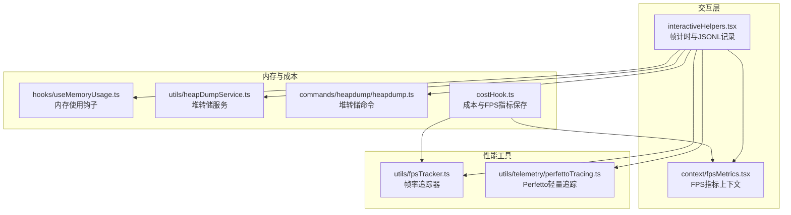
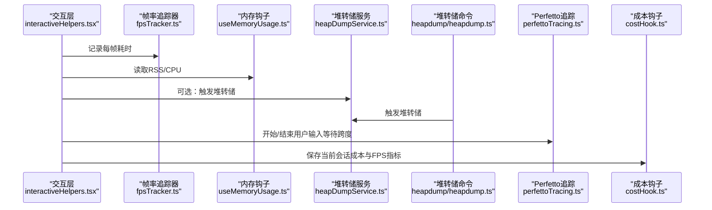
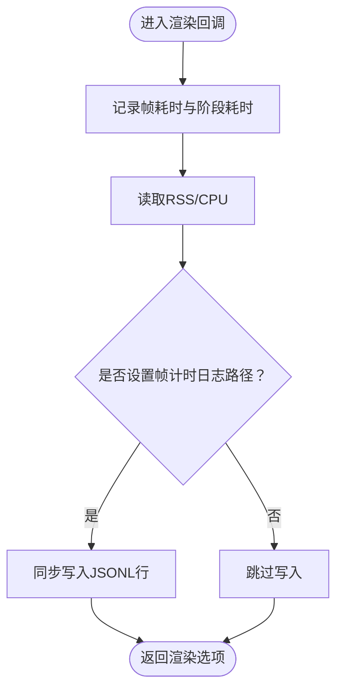
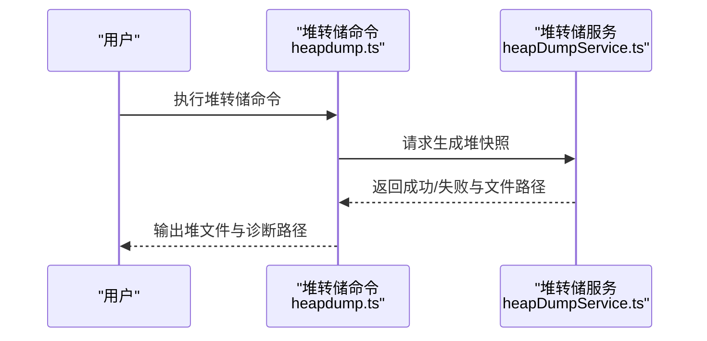
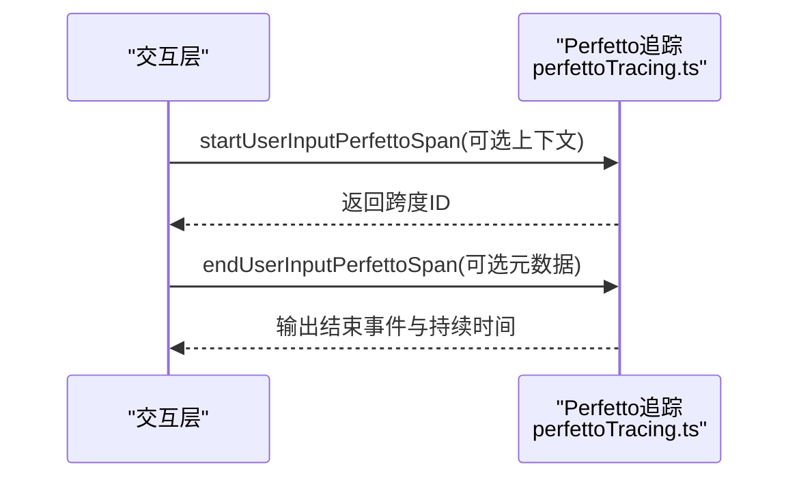
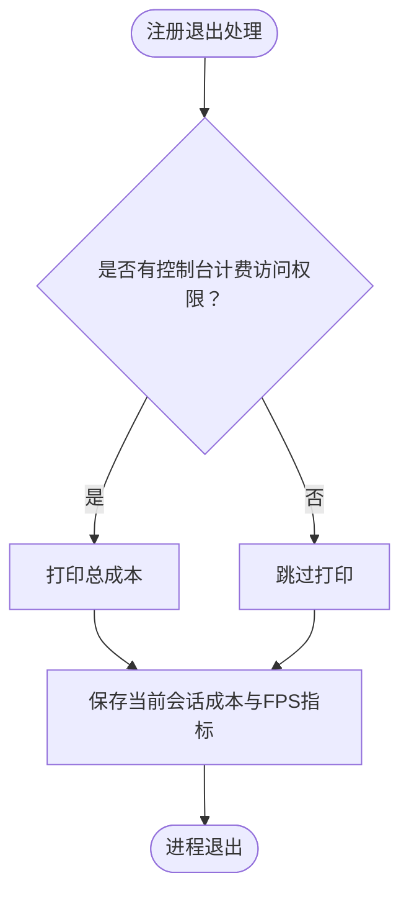
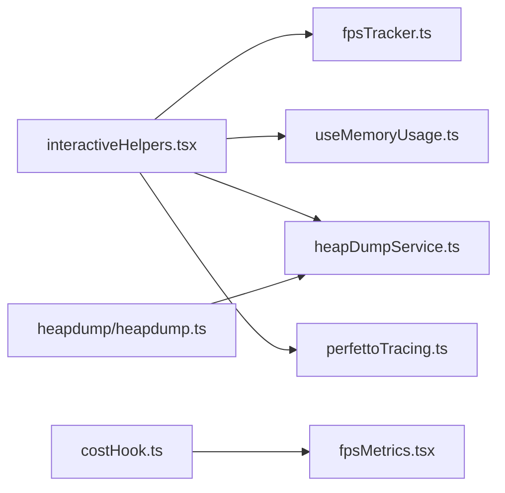

# 性能分析器

<cite>
**本文引用的文件**
- [src/interactiveHelpers.tsx](file://src/interactiveHelpers.tsx)
- [src/utils/fpsTracker.ts](file://src/utils/fpsTracker.ts)
- [src/context/fpsMetrics.tsx](file://src/context/fpsMetrics.tsx)
- [src/hooks/useMemoryUsage.ts](file://src/hooks/useMemoryUsage.ts)
- [src/utils/heapDumpService.ts](file://src/utils/heapDumpService.ts)
- [src/commands/heapdump/heapdump.ts](file://src/commands/heapdump/heapdump.ts)
- [src/utils/telemetry/perfettoTracing.ts](file://src/utils/telemetry/perfettoTracing.ts)
- [src/costHook.ts](file://src/costHook.ts)
- [src/utils/inProcessTeammateHelpers.ts](file://src/utils/inProcessTeammateHelpers.ts)
</cite>

## 目录
1. [简介](#简介)
2. [项目结构](#项目结构)
3. [核心组件](#核心组件)
4. [架构总览](#架构总览)
5. [详细组件分析](#详细组件分析)
6. [依赖关系分析](#依赖关系分析)
7. [性能考量](#性能考量)
8. [故障排查指南](#故障排查指南)
9. [结论](#结论)
10. [附录](#附录)

## 简介
本指南面向 Claude Code 的开发者与高级用户，系统讲解内置性能分析能力的使用方法，涵盖以下主题：
- 查询性能分析：通过帧率（FPS）与渲染阶段耗时进行端到端性能评估
- 帧率监控：实时统计与可视化帧耗时分布
- 内存使用跟踪：RSS、CPU 使用与堆转储（Heap Dump）
- 性能分析模式启用：环境变量与命令入口
- 数据采集与瓶颈定位：结合 Perfetto 跟踪与 JSONL 指标日志
- 指标解读与优化建议：基于实际实现的可操作建议

## 项目结构
与性能分析直接相关的模块主要分布在以下位置：
- 帧率与渲染阶段计时：交互层与 FPS 工具
- 内存与堆转储：内存钩子与堆转储服务
- 性能事件追踪：Perfetto 轻量追踪
- 成本与会话指标：成本钩子与上下文指标

图表来源
- [src/interactiveHelpers.tsx:315-342](file://src/interactiveHelpers.tsx#L315-L342)
- [src/context/fpsMetrics.tsx](file://src/context/fpsMetrics.tsx)
- [src/utils/fpsTracker.ts](file://src/utils/fpsTracker.ts)
- [src/utils/telemetry/perfettoTracing.ts:762-835](file://src/utils/telemetry/perfettoTracing.ts#L762-L835)
- [src/hooks/useMemoryUsage.ts](file://src/hooks/useMemoryUsage.ts)
- [src/utils/heapDumpService.ts](file://src/utils/heapDumpService.ts)
- [src/commands/heapdump/heapdump.ts:1-17](file://src/commands/heapdump/heapdump.ts#L1-L17)
- [src/costHook.ts:1-22](file://src/costHook.ts#L1-L22)

章节来源
- [src/interactiveHelpers.tsx:315-342](file://src/interactiveHelpers.tsx#L315-L342)
- [src/context/fpsMetrics.tsx](file://src/context/fpsMetrics.tsx)
- [src/utils/fpsTracker.ts](file://src/utils/fpsTracker.ts)
- [src/utils/telemetry/perfettoTracing.ts:762-835](file://src/utils/telemetry/perfettoTracing.ts#L762-L835)
- [src/hooks/useMemoryUsage.ts](file://src/hooks/useMemoryUsage.ts)
- [src/utils/heapDumpService.ts](file://src/utils/heapDumpService.ts)
- [src/commands/heapdump/heapdump.ts:1-17](file://src/commands/heapdump/heapdump.ts#L1-L17)
- [src/costHook.ts:1-22](file://src/costHook.ts#L1-L22)

## 核心组件
- 帧率与渲染阶段计时
  - 交互层在渲染回调中记录每帧耗时，并可选地将各阶段耗时写入 JSONL 文件用于离线分析
  - 提供 FPS 指标获取接口，便于成本钩子等模块保存当前会话指标
- 内存使用与堆转储
  - 内存钩子暴露 RSS 与 CPU 使用信息
  - 堆转储服务支持触发生成堆快照，命令行提供调用入口
- Perfetto 轻量追踪
  - 提供用户输入等待等关键阶段的开始/结束跨度记录，输出为 Perfetto 事件流
- 成本与指标保存
  - 在进程退出或特定时机汇总当前会话的成本与 FPS 指标

章节来源
- [src/interactiveHelpers.tsx:315-342](file://src/interactiveHelpers.tsx#L315-L342)
- [src/utils/fpsTracker.ts](file://src/utils/fpsTracker.ts)
- [src/context/fpsMetrics.tsx](file://src/context/fpsMetrics.tsx)
- [src/hooks/useMemoryUsage.ts](file://src/hooks/useMemoryUsage.ts)
- [src/utils/heapDumpService.ts](file://src/utils/heapDumpService.ts)
- [src/commands/heapdump/heapdump.ts:1-17](file://src/commands/heapdump/heapdump.ts#L1-L17)
- [src/utils/telemetry/perfettoTracing.ts:762-835](file://src/utils/telemetry/perfettoTracing.ts#L762-L835)
- [src/costHook.ts:1-22](file://src/costHook.ts#L1-L22)

## 架构总览
下图展示性能分析相关模块之间的交互关系与数据流向。

图表来源
- [src/interactiveHelpers.tsx:315-342](file://src/interactiveHelpers.tsx#L315-L342)
- [src/utils/fpsTracker.ts](file://src/utils/fpsTracker.ts)
- [src/hooks/useMemoryUsage.ts](file://src/hooks/useMemoryUsage.ts)
- [src/utils/heapDumpService.ts](file://src/utils/heapDumpService.ts)
- [src/commands/heapdump/heapdump.ts:1-17](file://src/commands/heapdump/heapdump.ts#L1-L17)
- [src/utils/telemetry/perfettoTracing.ts:762-835](file://src/utils/telemetry/perfettoTracing.ts#L762-L835)
- [src/costHook.ts:1-22](file://src/costHook.ts#L1-L22)

## 详细组件分析

### 帧率与渲染阶段计时
- 启用方式
  - 通过环境变量开启 JSONL 帧计时日志，交互层在渲染回调中同步写入每帧的总耗时与各阶段耗时，同时记录 RSS 与 CPU 使用
- 关键行为
  - 每帧记录：将帧耗时与阶段耗时写入指定文件，便于离线分析
  - 指标获取：提供获取 FPS 指标的函数，供其他模块使用
- 典型用途
  - 定位渲染管道中的热点阶段（如布局、屏幕缓冲、差异计算、优化、输出）
  - 结合成本钩子保存当前会话的 FPS 指标

图表来源
- [src/interactiveHelpers.tsx:315-342](file://src/interactiveHelpers.tsx#L315-L342)

章节来源
- [src/interactiveHelpers.tsx:315-342](file://src/interactiveHelpers.tsx#L315-L342)
- [src/utils/fpsTracker.ts](file://src/utils/fpsTracker.ts)
- [src/context/fpsMetrics.tsx](file://src/context/fpsMetrics.tsx)

### 内存使用跟踪与堆转储
- 内存使用
  - 通过内存钩子读取进程 RSS 与 CPU 使用，便于在帧计时日志中关联内存指标
- 堆转储
  - 堆转储服务负责生成堆快照；命令入口提供统一调用方式，返回堆文件与诊断信息路径

图表来源
- [src/commands/heapdump/heapdump.ts:1-17](file://src/commands/heapdump/heapdump.ts#L1-L17)
- [src/utils/heapDumpService.ts](file://src/utils/heapDumpService.ts)

章节来源
- [src/hooks/useMemoryUsage.ts](file://src/hooks/useMemoryUsage.ts)
- [src/utils/heapDumpService.ts](file://src/utils/heapDumpService.ts)
- [src/commands/heapdump/heapdump.ts:1-17](file://src/commands/heapdump/heapdump.ts#L1-L17)

### Perfetto 轻量追踪
- 功能概述
  - 提供用户输入等待阶段的开始/结束跨度记录，输出 Perfetto 事件格式，包含名称、类别、时间戳、进程/线程 ID 与参数（含持续时间）
- 使用场景
  - 分析用户交互延迟与决策耗时，辅助定位前端等待环节的性能瓶颈

图表来源
- [src/utils/telemetry/perfettoTracing.ts:762-835](file://src/utils/telemetry/perfettoTracing.ts#L762-L835)

章节来源
- [src/utils/telemetry/perfettoTracing.ts:762-835](file://src/utils/telemetry/perfettoTracing.ts#L762-L835)

### 成本与指标保存
- 行为描述
  - 在进程退出或特定时机，汇总当前会话的成本与 FPS 指标，便于后续分析与报告
- 集成点
  - 与帧率指标上下文配合，确保指标一致性

图表来源
- [src/costHook.ts:1-22](file://src/costHook.ts#L1-L22)
- [src/context/fpsMetrics.tsx](file://src/context/fpsMetrics.tsx)

章节来源
- [src/costHook.ts:1-22](file://src/costHook.ts#L1-L22)
- [src/context/fpsMetrics.tsx](file://src/context/fpsMetrics.tsx)

## 依赖关系分析
- 组件耦合
  - 交互层对帧率追踪器与内存钩子存在直接依赖，用于采集指标
  - 堆转储命令依赖堆转储服务完成实际操作
  - 成本钩子依赖帧率指标上下文以保证指标完整性
- 外部集成
  - Perfetto 轻量追踪用于输出事件流，便于外部分析工具消费

图表来源
- [src/interactiveHelpers.tsx:315-342](file://src/interactiveHelpers.tsx#L315-L342)
- [src/utils/fpsTracker.ts](file://src/utils/fpsTracker.ts)
- [src/hooks/useMemoryUsage.ts](file://src/hooks/useMemoryUsage.ts)
- [src/utils/heapDumpService.ts](file://src/utils/heapDumpService.ts)
- [src/utils/telemetry/perfettoTracing.ts:762-835](file://src/utils/telemetry/perfettoTracing.ts#L762-L835)
- [src/commands/heapdump/heapdump.ts:1-17](file://src/commands/heapdump/heapdump.ts#L1-L17)
- [src/costHook.ts:1-22](file://src/costHook.ts#L1-L22)
- [src/context/fpsMetrics.tsx](file://src/context/fpsMetrics.tsx)

章节来源
- [src/interactiveHelpers.tsx:315-342](file://src/interactiveHelpers.tsx#L315-L342)
- [src/utils/fpsTracker.ts](file://src/utils/fpsTracker.ts)
- [src/hooks/useMemoryUsage.ts](file://src/hooks/useMemoryUsage.ts)
- [src/utils/heapDumpService.ts](file://src/utils/heapDumpService.ts)
- [src/utils/telemetry/perfettoTracing.ts:762-835](file://src/utils/telemetry/perfettoTracing.ts#L762-L835)
- [src/commands/heapdump/heapdump.ts:1-17](file://src/commands/heapdump/heapdump.ts#L1-L17)
- [src/costHook.ts:1-22](file://src/costHook.ts#L1-L22)
- [src/context/fpsMetrics.tsx](file://src/context/fpsMetrics.tsx)

## 性能考量
- 帧计时 JSONL 写入采用同步方式，确保在异常退出时不丢失帧数据，但可能带来额外开销
- Perfetto 事件输出为事件流，注意在高并发场景下的事件数量与存储压力
- 堆转储会阻塞当前进程，建议在低峰时段或受控环境下执行
- 内存与 CPU 指标读取为轻量级系统调用，但频繁采样仍需权衡频率

## 故障排查指南
- 无法生成帧计时日志
  - 检查环境变量是否正确设置，确认写入路径可写
  - 确认渲染回调已启用帧计时逻辑
- 帧计时日志缺失
  - 确认同步写入路径仅在开启特定环境变量时生效
  - 检查进程是否被意外中断导致未落盘
- 堆转储失败
  - 查看命令返回的错误信息，确认堆转储服务可用
  - 检查磁盘空间与权限
- Perfetto 事件缺失
  - 确认追踪已启用且开始/结束配对正确
  - 检查事件输出通道与分析工具配置

章节来源
- [src/commands/heapdump/heapdump.ts:1-17](file://src/commands/heapdump/heapdump.ts#L1-L17)
- [src/utils/telemetry/perfettoTracing.ts:762-835](file://src/utils/telemetry/perfettoTracing.ts#L762-L835)

## 结论
通过交互层的帧计时、内存钩子、堆转储与 Perfetto 轻量追踪，Claude Code 提供了从渲染到交互的全链路性能观测能力。结合成本钩子与 FPS 指标保存，可在日常开发与回归测试中快速定位瓶颈并持续优化用户体验。

## 附录
- 快速上手清单
  - 设置帧计时日志路径环境变量，运行交互流程，收集 JSONL 指标
  - 在需要时触发堆转储，分析内存占用与泄漏
  - 使用 Perfetto 工具查看用户输入等待阶段的事件流
  - 在退出时检查成本与 FPS 指标保存情况