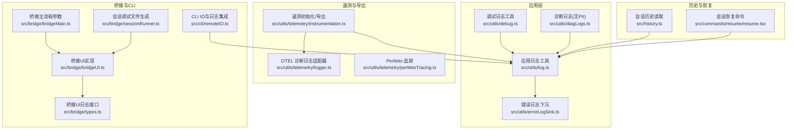
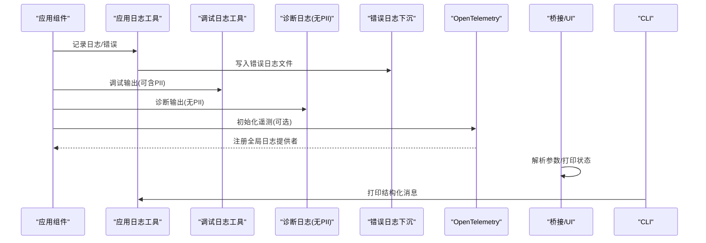
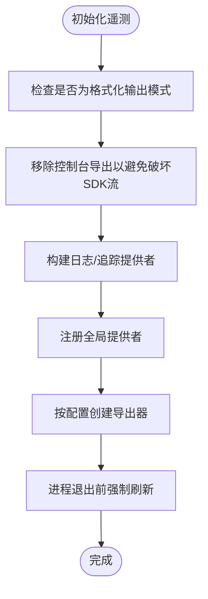
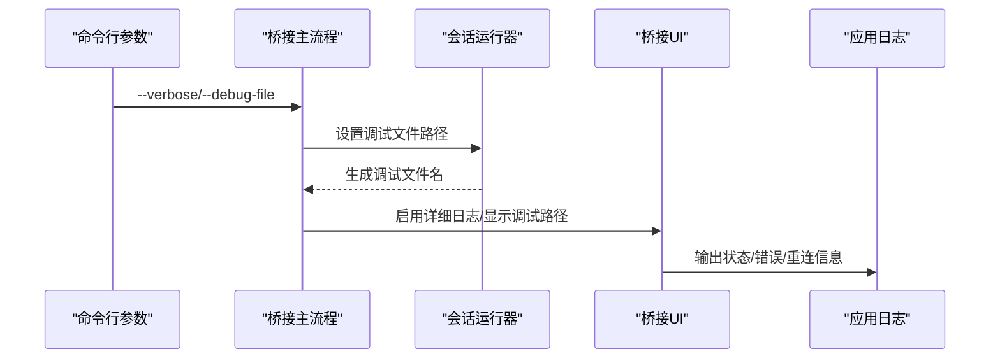
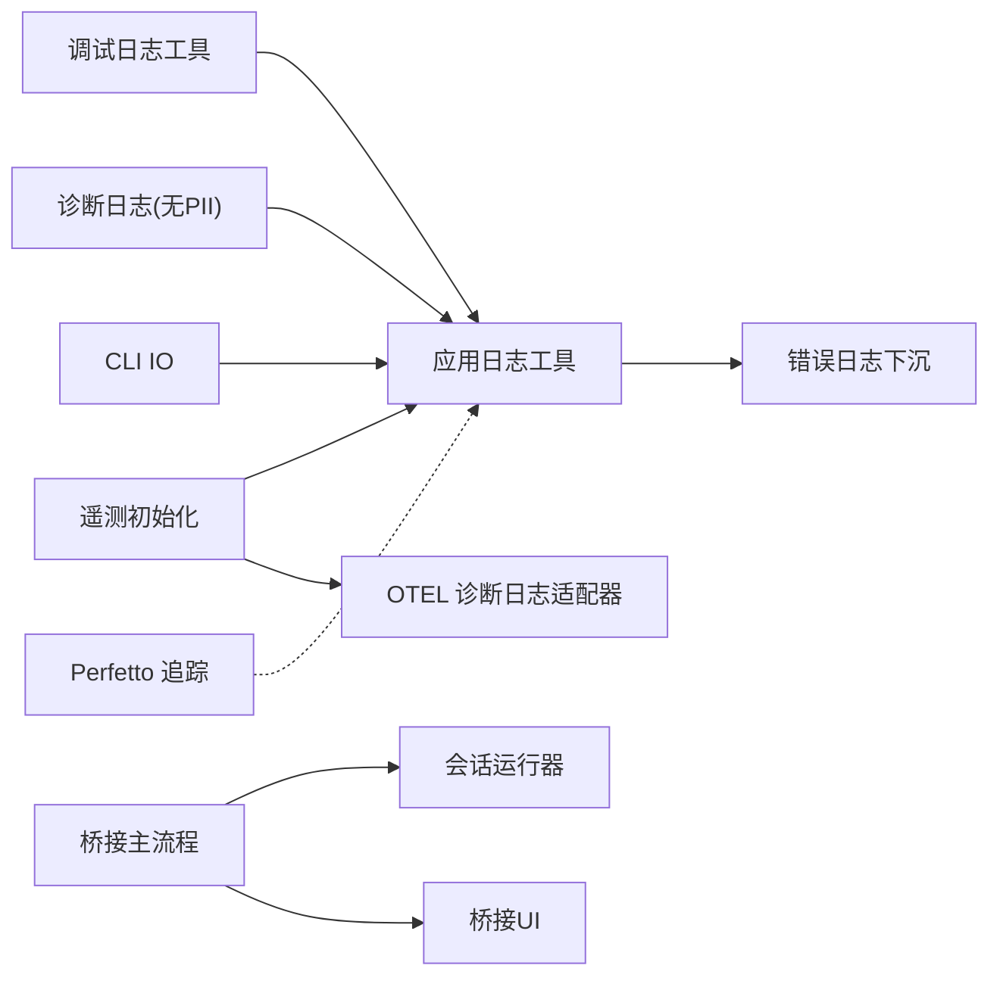

# 日志系统

<cite>
**本文引用的文件**
- [src/utils/log.ts](file://src/utils/log.ts)
- [src/utils/debug.ts](file://src/utils/debug.ts)
- [src/utils/diagLogs.ts](file://src/utils/diagLogs.ts)
- [src/utils/errorLogSink.ts](file://src/utils/errorLogSink.ts)
- [src/utils/telemetry/instrumentation.ts](file://src/utils/telemetry/instrumentation.ts)
- [src/utils/telemetry/logger.ts](file://src/utils/telemetry/logger.ts)
- [src/utils/telemetry/perfettoTracing.ts](file://src/utils/telemetry/perfettoTracing.ts)
- [src/bridge/bridgeUI.ts](file://src/bridge/bridgeUI.ts)
- [src/bridge/bridgeMain.ts](file://src/bridge/bridgeMain.ts)
- [src/bridge/sessionRunner.ts](file://src/bridge/sessionRunner.ts)
- [src/bridge/types.ts](file://src/bridge/types.ts)
- [src/cli/remoteIO.ts](file://src/cli/remoteIO.ts)
- [src/history.ts](file://src/history.ts)
- [src/commands/resume/resume.tsx](file://src/commands/resume/resume.tsx)
- [src/services/internalLogging.ts](file://src/services/internalLogging.ts)
</cite>

## 目录
1. [简介](#简介)
2. [项目结构](#项目结构)
3. [核心组件](#核心组件)
4. [架构总览](#架构总览)
5. [详细组件分析](#详细组件分析)
6. [依赖关系分析](#依赖关系分析)
7. [性能考量](#性能考量)
8. [故障排查指南](#故障排查指南)
9. [结论](#结论)
10. [附录：配置示例与最佳实践](#附录配置示例与最佳实践)

## 简介
本指南面向 Claude Code 的内置日志系统，覆盖以下主题：
- 日志级别与输出控制
- 过滤器与隐私保护（PII）策略
- 调试模式与日志文件输出
- OpenTelemetry 日志导出与本地控制台输出
- 性能追踪与诊断日志
- 常见场景配置与最佳实践

目标是帮助开发者在不同运行环境（CLI、桥接进程、远程会话等）下，正确启用与使用日志系统，快速定位问题并优化可观测性。

## 项目结构
日志系统由多层实现组成：
- 应用层日志工具：统一的日志入口与错误下沉
- 调试与诊断日志：带隐私开关的诊断输出
- OpenTelemetry 日志与指标/追踪：可选的外部导出
- 桥接与 CLI 层：命令行参数与 UI 输出
- 性能追踪：独立的 Perfetto 追踪器

**图表来源**
- [src/utils/log.ts](file://src/utils/log.ts)
- [src/utils/debug.ts](file://src/utils/debug.ts)
- [src/utils/diagLogs.ts](file://src/utils/diagLogs.ts)
- [src/utils/errorLogSink.ts](file://src/utils/errorLogSink.ts)
- [src/utils/telemetry/instrumentation.ts](file://src/utils/telemetry/instrumentation.ts)
- [src/utils/telemetry/logger.ts](file://src/utils/telemetry/logger.ts)
- [src/utils/telemetry/perfettoTracing.ts](file://src/utils/telemetry/perfettoTracing.ts)
- [src/bridge/bridgeUI.ts](file://src/bridge/bridgeUI.ts)
- [src/bridge/bridgeMain.ts](file://src/bridge/bridgeMain.ts)
- [src/bridge/sessionRunner.ts](file://src/bridge/sessionRunner.ts)
- [src/bridge/types.ts](file://src/bridge/types.ts)
- [src/cli/remoteIO.ts](file://src/cli/remoteIO.ts)
- [src/history.ts](file://src/history.ts)
- [src/commands/resume/resume.tsx](file://src/commands/resume/resume.tsx)

**章节来源**
- [src/utils/log.ts](file://src/utils/log.ts)
- [src/utils/debug.ts](file://src/utils/debug.ts)
- [src/utils/diagLogs.ts](file://src/utils/diagLogs.ts)
- [src/utils/errorLogSink.ts](file://src/utils/errorLogSink.ts)
- [src/utils/telemetry/instrumentation.ts](file://src/utils/telemetry/instrumentation.ts)
- [src/utils/telemetry/logger.ts](file://src/utils/telemetry/logger.ts)
- [src/utils/telemetry/perfettoTracing.ts](file://src/utils/telemetry/perfettoTracing.ts)
- [src/bridge/bridgeUI.ts](file://src/bridge/bridgeUI.ts)
- [src/bridge/bridgeMain.ts](file://src/bridge/bridgeMain.ts)
- [src/bridge/sessionRunner.ts](file://src/bridge/sessionRunner.ts)
- [src/bridge/types.ts](file://src/bridge/types.ts)
- [src/cli/remoteIO.ts](file://src/cli/remoteIO.ts)
- [src/history.ts](file://src/history.ts)
- [src/commands/resume/resume.tsx](file://src/commands/resume/resume.tsx)

## 核心组件
- 应用日志工具：提供统一的日志记录入口，支持错误下沉到错误日志 sink。
- 调试日志工具：提供带级别与隐私开关的调试输出，便于开发期诊断。
- 诊断日志（无 PII）：在不泄露个人信息的前提下输出诊断信息。
- 错误日志下沉：将异常与错误统一写入错误日志文件，便于离线分析。
- OpenTelemetry 遥测：可选的 OTLP 导出与批量处理器，支持控制台与 OTLP 协议导出。
- 桥接与 CLI 日志：通过命令行参数启用详细日志与调试文件输出；桥接 UI 提供状态与错误输出。
- 性能追踪：独立的 Perfetto 追踪器，支持异步与同步落盘。

**章节来源**
- [src/utils/log.ts](file://src/utils/log.ts)
- [src/utils/debug.ts](file://src/utils/debug.ts)
- [src/utils/diagLogs.ts](file://src/utils/diagLogs.ts)
- [src/utils/errorLogSink.ts](file://src/utils/errorLogSink.ts)
- [src/utils/telemetry/instrumentation.ts](file://src/utils/telemetry/instrumentation.ts)
- [src/utils/telemetry/logger.ts](file://src/utils/telemetry/logger.ts)
- [src/utils/telemetry/perfettoTracing.ts](file://src/utils/telemetry/perfettoTracing.ts)
- [src/bridge/bridgeUI.ts](file://src/bridge/bridgeUI.ts)
- [src/bridge/bridgeMain.ts](file://src/bridge/bridgeMain.ts)
- [src/bridge/sessionRunner.ts](file://src/bridge/sessionRunner.ts)
- [src/cli/remoteIO.ts](file://src/cli/remoteIO.ts)

## 架构总览
日志系统采用“应用层统一入口 + 可插拔导出”的设计：
- 应用层：集中处理日志级别、格式化与隐私过滤
- 遥测层：可选地将日志导出至控制台或 OTLP 接收端
- 桥接与 CLI：通过参数与 UI 控制日志可见性与输出位置
- 诊断与错误：分离诊断日志与错误日志，便于不同用途

**图表来源**
- [src/utils/log.ts](file://src/utils/log.ts)
- [src/utils/debug.ts](file://src/utils/debug.ts)
- [src/utils/diagLogs.ts](file://src/utils/diagLogs.ts)
- [src/utils/errorLogSink.ts](file://src/utils/errorLogSink.ts)
- [src/utils/telemetry/instrumentation.ts](file://src/utils/telemetry/instrumentation.ts)
- [src/bridge/bridgeUI.ts](file://src/bridge/bridgeUI.ts)
- [src/cli/remoteIO.ts](file://src/cli/remoteIO.ts)

## 详细组件分析

### 应用日志工具（统一入口）
- 统一记录入口，负责将错误写入错误日志 sink，确保错误不会丢失
- 支持与诊断日志、调试日志协同工作，形成完整的可观测性闭环

**章节来源**
- [src/utils/log.ts](file://src/utils/log.ts)
- [src/utils/errorLogSink.ts](file://src/utils/errorLogSink.ts)

### 调试日志工具（调试模式与隐私）
- 提供带隐私开关的调试输出，适合开发期与问题复现
- 可根据环境变量或运行参数决定是否输出敏感信息

**章节来源**
- [src/utils/debug.ts](file://src/utils/debug.ts)

### 诊断日志（无 PII）
- 在不包含个人信息的前提下输出诊断信息，便于共享与上报
- 与应用日志配合，满足合规要求

**章节来源**
- [src/utils/diagLogs.ts](file://src/utils/diagLogs.ts)

### OpenTelemetry 日志与导出
- 初始化阶段可选择控制台或 OTLP 协议导出
- 使用批量处理器与定时刷新，保证稳定性与性能
- 诊断日志通过适配器接入 OTEL，统一管理

**图表来源**
- [src/utils/telemetry/instrumentation.ts](file://src/utils/telemetry/instrumentation.ts)
- [src/utils/telemetry/logger.ts](file://src/utils/telemetry/logger.ts)

**章节来源**
- [src/utils/telemetry/instrumentation.ts](file://src/utils/telemetry/instrumentation.ts)
- [src/utils/telemetry/logger.ts](file://src/utils/telemetry/logger.ts)

### 桥接与 CLI 日志
- 桥接主流程支持 --verbose、--debug-file 等参数，用于开启详细日志与指定调试文件
- 桥接 UI 实现了多种日志输出方法（状态、错误、重连等），并支持 UI 展示
- CLI IO 集成调试日志与错误日志，确保远程交互过程可被观测

**图表来源**
- [src/bridge/bridgeMain.ts](file://src/bridge/bridgeMain.ts)
- [src/bridge/sessionRunner.ts](file://src/bridge/sessionRunner.ts)
- [src/bridge/bridgeUI.ts](file://src/bridge/bridgeUI.ts)
- [src/cli/remoteIO.ts](file://src/cli/remoteIO.ts)

**章节来源**
- [src/bridge/bridgeMain.ts](file://src/bridge/bridgeMain.ts)
- [src/bridge/sessionRunner.ts](file://src/bridge/sessionRunner.ts)
- [src/bridge/bridgeUI.ts](file://src/bridge/bridgeUI.ts)
- [src/bridge/types.ts](file://src/bridge/types.ts)
- [src/cli/remoteIO.ts](file://src/cli/remoteIO.ts)

### 性能追踪（Perfetto）
- 独立于 OTEL 的追踪器，支持异步与同步落盘
- 在进程退出时自动刷新，必要时提供同步回退写入

**章节来源**
- [src/utils/telemetry/perfettoTracing.ts](file://src/utils/telemetry/perfettoTracing.ts)

### 历史与恢复中的日志
- 历史读取器从日志文件中解析条目，支持按项目与会话筛选
- 恢复命令在加载与选择会话时记录日志，便于问题诊断

**章节来源**
- [src/history.ts](file://src/history.ts)
- [src/commands/resume/resume.tsx](file://src/commands/resume/resume.tsx)

## 依赖关系分析
- 应用日志工具依赖错误日志 sink，确保错误持久化
- 调试与诊断日志工具与应用日志工具解耦，通过隐私策略隔离敏感信息
- 遥测初始化依赖环境变量与配置，动态选择导出器类型与协议
- 桥接与 CLI 通过参数与 UI 间接影响日志可见性与输出位置
- 性能追踪器独立运行，避免与遥测导出冲突

**图表来源**
- [src/utils/log.ts](file://src/utils/log.ts)
- [src/utils/errorLogSink.ts](file://src/utils/errorLogSink.ts)
- [src/utils/debug.ts](file://src/utils/debug.ts)
- [src/utils/diagLogs.ts](file://src/utils/diagLogs.ts)
- [src/utils/telemetry/instrumentation.ts](file://src/utils/telemetry/instrumentation.ts)
- [src/utils/telemetry/logger.ts](file://src/utils/telemetry/logger.ts)
- [src/bridge/bridgeMain.ts](file://src/bridge/bridgeMain.ts)
- [src/bridge/sessionRunner.ts](file://src/bridge/sessionRunner.ts)
- [src/bridge/bridgeUI.ts](file://src/bridge/bridgeUI.ts)
- [src/cli/remoteIO.ts](file://src/cli/remoteIO.ts)
- [src/utils/telemetry/perfettoTracing.ts](file://src/utils/telemetry/perfettoTracing.ts)

**章节来源**
- [src/utils/log.ts](file://src/utils/log.ts)
- [src/utils/errorLogSink.ts](file://src/utils/errorLogSink.ts)
- [src/utils/debug.ts](file://src/utils/debug.ts)
- [src/utils/diagLogs.ts](file://src/utils/diagLogs.ts)
- [src/utils/telemetry/instrumentation.ts](file://src/utils/telemetry/instrumentation.ts)
- [src/utils/telemetry/logger.ts](file://src/utils/telemetry/logger.ts)
- [src/bridge/bridgeMain.ts](file://src/bridge/bridgeMain.ts)
- [src/bridge/sessionRunner.ts](file://src/bridge/sessionRunner.ts)
- [src/bridge/bridgeUI.ts](file://src/bridge/bridgeUI.ts)
- [src/cli/remoteIO.ts](file://src/cli/remoteIO.ts)
- [src/utils/telemetry/perfettoTracing.ts](file://src/utils/telemetry/perfettoTracing.ts)

## 性能考量
- 批量导出与定时刷新：遥测导出使用批量处理器与定时刷新，降低 I/O 压力
- 控制台输出剥离：在格式化输出模式下移除控制台导出，避免破坏 SDK 流
- 异步/同步落盘：性能追踪器支持异步与同步两种落盘方式，兼顾可靠性与性能
- 日志级别与隐私：通过隐私开关与日志级别控制输出量，减少不必要的 I/O

[本节为通用指导，无需列出具体文件来源]

## 故障排查指南
- 启用调试模式
  - CLI/桥接：使用 --verbose 或 --debug-file 指定调试文件路径
  - 应用层：调用调试日志工具输出详细信息
- 定位错误
  - 查看错误日志文件，确认异常堆栈与上下文
  - 结合诊断日志（无 PII）进行问题复现与共享
- 遥测导出问题
  - 检查 OTEL_LOGS_EXPORTER、协议与端点配置
  - 确认批量处理器与刷新间隔设置合理
- 性能追踪
  - 确认追踪开关与输出路径有效
  - 在进程退出前等待刷新完成，或使用同步写入回退

**章节来源**
- [src/bridge/bridgeMain.ts](file://src/bridge/bridgeMain.ts)
- [src/bridge/sessionRunner.ts](file://src/bridge/sessionRunner.ts)
- [src/utils/debug.ts](file://src/utils/debug.ts)
- [src/utils/errorLogSink.ts](file://src/utils/errorLogSink.ts)
- [src/utils/diagLogs.ts](file://src/utils/diagLogs.ts)
- [src/utils/telemetry/instrumentation.ts](file://src/utils/telemetry/instrumentation.ts)
- [src/utils/telemetry/perfettoTracing.ts](file://src/utils/telemetry/perfettoTracing.ts)

## 结论
Claude Code 的日志系统通过“应用层统一入口 + 可插拔导出 + 隐私与性能考量”实现了高可用、可扩展且合规的可观测性方案。结合调试模式、诊断日志与遥测导出，开发者可以在不同场景下快速定位问题并持续优化系统表现。

[本节为总结性内容，无需列出具体文件来源]

## 附录：配置示例与最佳实践
- 启用调试模式
  - CLI/桥接：添加 --verbose 或 --debug-file <路径>，以便输出详细日志与会话调试文件
  - 应用层：在需要时调用调试日志工具输出关键路径信息
- 配置日志文件输出
  - 桥接会话运行器会在 verbose 或特定用户类型下自动生成调试文件；也可通过 --debug-file 显式指定
- 使用不同日志级别进行问题诊断
  - 使用调试日志工具输出开发期细节；使用诊断日志（无 PII）进行问题复现与共享
- 遥测导出配置
  - 设置 OTEL_LOGS_EXPORTER 为 console 或 otlp，按需设置协议（grpc/http/json/proto）与端点
  - 在格式化输出模式下避免控制台导出，防止破坏 SDK 流
- 过滤器与隐私
  - 优先使用诊断日志（无 PII）进行问题上报与共享
  - 对敏感信息进行脱敏处理，避免在调试日志中直接输出
- 性能追踪
  - 开启 CLAUDE_CODE_PERFETTO_TRACE=1 或指定路径，收集性能事件
  - 在退出前确保刷新完成，必要时使用同步写入回退

**章节来源**
- [src/bridge/bridgeMain.ts](file://src/bridge/bridgeMain.ts)
- [src/bridge/sessionRunner.ts](file://src/bridge/sessionRunner.ts)
- [src/utils/debug.ts](file://src/utils/debug.ts)
- [src/utils/diagLogs.ts](file://src/utils/diagLogs.ts)
- [src/utils/telemetry/instrumentation.ts](file://src/utils/telemetry/instrumentation.ts)
- [src/utils/telemetry/perfettoTracing.ts](file://src/utils/telemetry/perfettoTracing.ts)