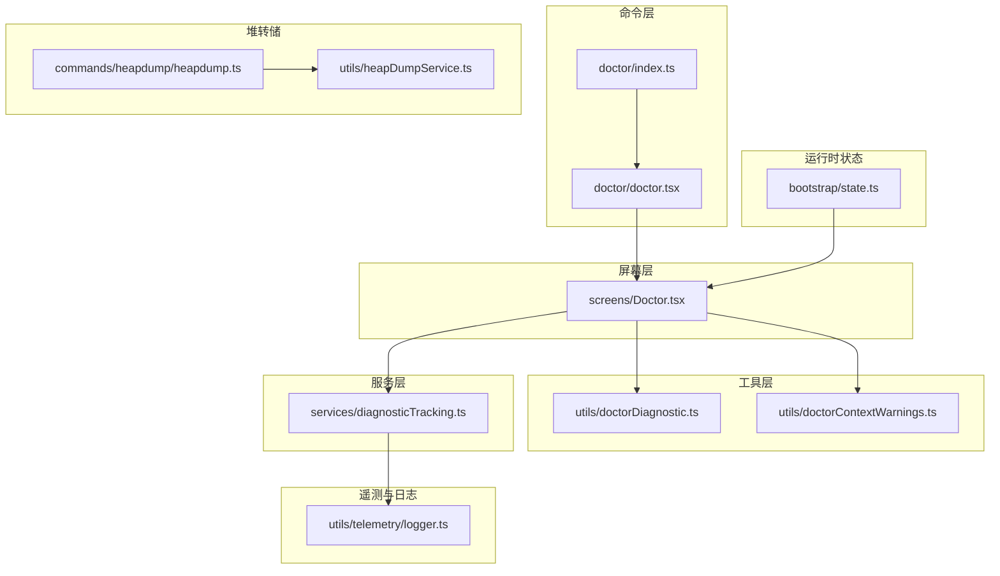
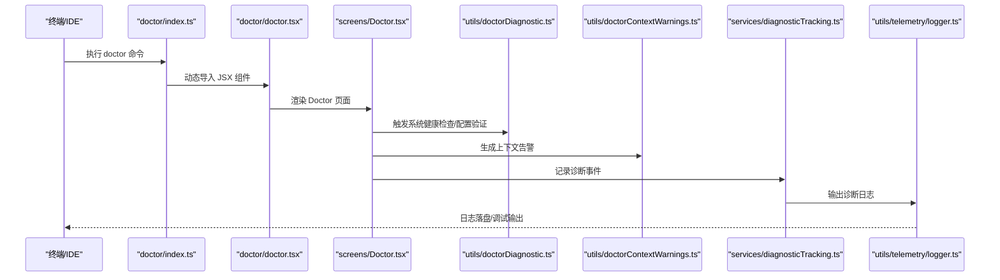
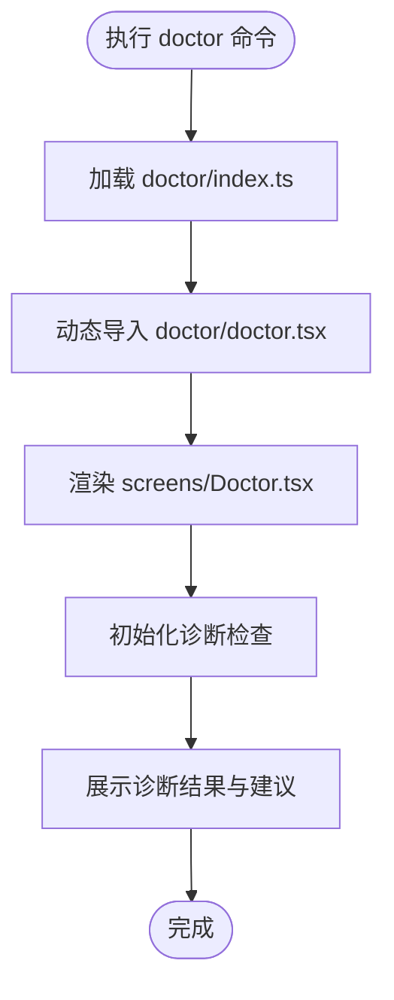
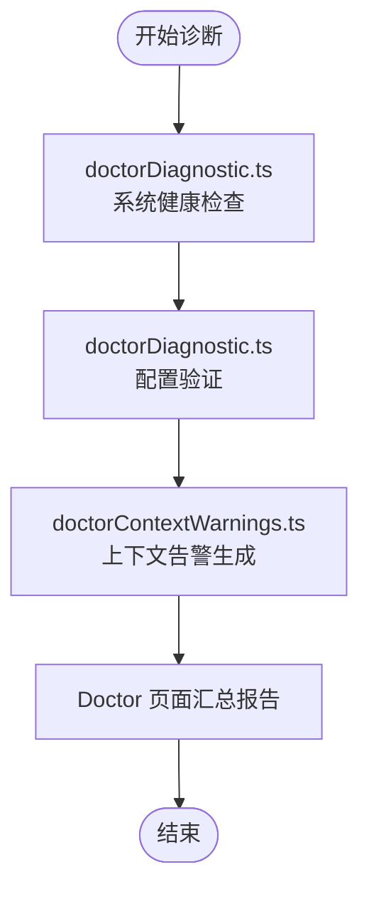
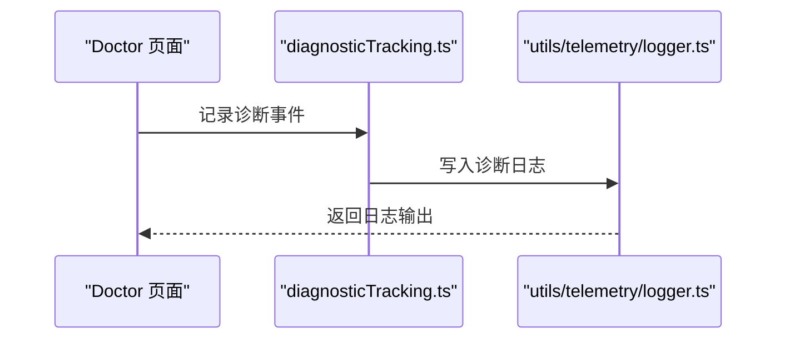
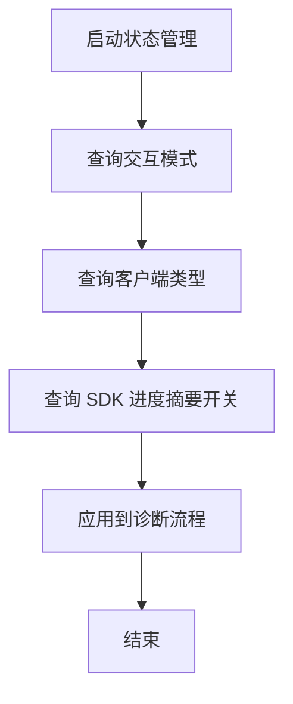
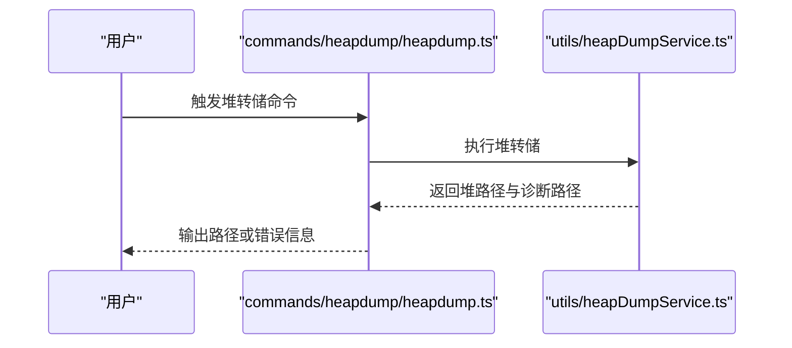
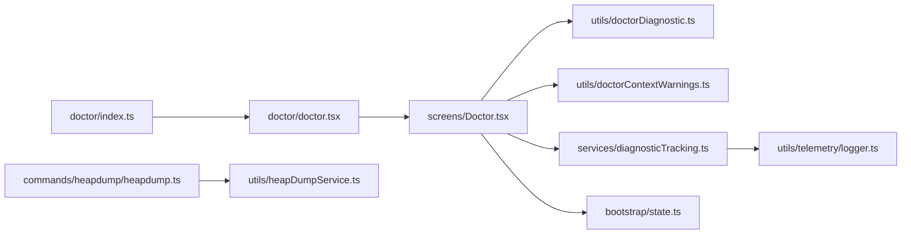

# 诊断工具

<cite>
**本文引用的文件**
- [src/commands/doctor/index.ts](file://src/commands/doctor/index.ts)
- [src/commands/doctor/doctor.tsx](file://src/commands/doctor/doctor.tsx)
- [src/screens/Doctor.tsx](file://src/screens/Doctor.tsx)
- [src/utils/doctorDiagnostic.ts](file://src/utils/doctorDiagnostic.ts)
- [src/utils/doctorContextWarnings.ts](file://src/utils/doctorContextWarnings.ts)
- [src/services/diagnosticTracking.ts](file://src/services/diagnosticTracking.ts)
- [src/utils/telemetry/logger.ts](file://src/utils/telemetry/logger.ts)
- [src/bootstrap/state.ts](file://src/bootstrap/state.ts)
- [src/commands/heapdump/heapdump.ts](file://src/commands/heapdump/heapdump.ts)
- [src/utils/heapDumpService.ts](file://src/utils/heapDumpService.ts)
</cite>

## 目录
1. [简介](#简介)
2. [项目结构](#项目结构)
3. [核心组件](#核心组件)
4. [架构总览](#架构总览)
5. [详细组件分析](#详细组件分析)
6. [依赖关系分析](#依赖关系分析)
7. [性能考量](#性能考量)
8. [故障排查指南](#故障排查指南)
9. [结论](#结论)
10. [附录](#附录)

## 简介
本指南面向使用者与维护者，系统性讲解 Claude Code 的内置诊断工具与诊断能力，涵盖安装与配置健康检查、运行时状态监控、诊断报告解读与问题修复流程。重点围绕“doctor”命令入口、诊断数据采集与呈现、遥测日志记录、以及内存堆转储辅助定位（heapdump）等模块展开，帮助快速定位系统异常、配置偏差与性能瓶颈。

## 项目结构
与诊断相关的代码主要分布在以下位置：
- 命令层：提供“doctor”命令入口，负责加载诊断界面
- 屏幕层：Doctor 页面承载诊断 UI 与交互
- 工具层：诊断逻辑与上下文告警收集
- 服务层：诊断事件追踪与上报
- 遥测与日志：OpenTelemetry 诊断日志适配
- 运行时状态：交互模式、SDK 模式等状态开关
- 堆转储：辅助内存问题定位

图表来源
- [src/commands/doctor/index.ts:1-12](file://src/commands/doctor/index.ts#L1-L12)
- [src/commands/doctor/doctor.tsx:1-7](file://src/commands/doctor/doctor.tsx#L1-L7)
- [src/screens/Doctor.tsx](file://src/screens/Doctor.tsx)
- [src/utils/doctorDiagnostic.ts](file://src/utils/doctorDiagnostic.ts)
- [src/utils/doctorContextWarnings.ts](file://src/utils/doctorContextWarnings.ts)
- [src/services/diagnosticTracking.ts](file://src/services/diagnosticTracking.ts)
- [src/utils/telemetry/logger.ts:1-26](file://src/utils/telemetry/logger.ts#L1-L26)
- [src/bootstrap/state.ts:1043-1099](file://src/bootstrap/state.ts#L1043-L1099)
- [src/commands/heapdump/heapdump.ts:1-17](file://src/commands/heapdump/heapdump.ts#L1-L17)
- [src/utils/heapDumpService.ts](file://src/utils/heapDumpService.ts)

章节来源
- [src/commands/doctor/index.ts:1-12](file://src/commands/doctor/index.ts#L1-L12)
- [src/commands/doctor/doctor.tsx:1-7](file://src/commands/doctor/doctor.tsx#L1-L7)
- [src/screens/Doctor.tsx](file://src/screens/Doctor.tsx)
- [src/utils/doctorDiagnostic.ts](file://src/utils/doctorDiagnostic.ts)
- [src/utils/doctorContextWarnings.ts](file://src/utils/doctorContextWarnings.ts)
- [src/services/diagnosticTracking.ts](file://src/services/diagnosticTracking.ts)
- [src/utils/telemetry/logger.ts:1-26](file://src/utils/telemetry/logger.ts#L1-L26)
- [src/bootstrap/state.ts:1043-1099](file://src/bootstrap/state.ts#L1043-L1099)
- [src/commands/heapdump/heapdump.ts:1-17](file://src/commands/heapdump/heapdump.ts#L1-L17)

## 核心组件
- doctor 命令入口：注册“doctor”本地 JSX 命令，启用条件受环境变量控制；加载 Doctor 屏幕组件。
- Doctor 屏幕：作为诊断 UI 容器，协调诊断数据采集、上下文告警展示与诊断事件追踪。
- 诊断工具集：包含诊断逻辑与上下文警告生成，用于系统健康检查与配置验证。
- 诊断追踪服务：负责诊断事件的记录与上报，配合遥测日志输出。
- OpenTelemetry 诊断日志：将底层诊断信息映射到统一日志接口，便于调试与审计。
- 运行时状态：提供交互/非交互模式、客户端类型、SDK 进度摘要开关等状态查询与设置。
- 堆转储命令：在需要时触发内存堆快照，辅助定位内存泄漏或异常占用。

章节来源
- [src/commands/doctor/index.ts:1-12](file://src/commands/doctor/index.ts#L1-L12)
- [src/commands/doctor/doctor.tsx:1-7](file://src/commands/doctor/doctor.tsx#L1-L7)
- [src/screens/Doctor.tsx](file://src/screens/Doctor.tsx)
- [src/utils/doctorDiagnostic.ts](file://src/utils/doctorDiagnostic.ts)
- [src/utils/doctorContextWarnings.ts](file://src/utils/doctorContextWarnings.ts)
- [src/services/diagnosticTracking.ts](file://src/services/diagnosticTracking.ts)
- [src/utils/telemetry/logger.ts:1-26](file://src/utils/telemetry/logger.ts#L1-L26)
- [src/bootstrap/state.ts:1043-1099](file://src/bootstrap/state.ts#L1043-L1099)
- [src/commands/heapdump/heapdump.ts:1-17](file://src/commands/heapdump/heapdump.ts#L1-L17)

## 架构总览
下图展示了从命令调用到诊断页面、再到诊断数据采集与追踪的整体流程：

图表来源
- [src/commands/doctor/index.ts:1-12](file://src/commands/doctor/index.ts#L1-L12)
- [src/commands/doctor/doctor.tsx:1-7](file://src/commands/doctor/doctor.tsx#L1-L7)
- [src/screens/Doctor.tsx](file://src/screens/Doctor.tsx)
- [src/utils/doctorDiagnostic.ts](file://src/utils/doctorDiagnostic.ts)
- [src/utils/doctorContextWarnings.ts](file://src/utils/doctorContextWarnings.ts)
- [src/services/diagnosticTracking.ts](file://src/services/diagnosticTracking.ts)
- [src/utils/telemetry/logger.ts:1-26](file://src/utils/telemetry/logger.ts#L1-L26)

## 详细组件分析

### doctor 命令与 Doctor 页面
- 命令注册：定义“doctor”命令名称、描述、启用条件与加载方式，确保在特定环境下可用。
- JSX 加载：通过动态导入将 Doctor 屏幕组件注入到当前会话中，实现无侵入式诊断入口。
- Doctor 屏幕：作为诊断 UI 主体，负责组织诊断检查项、展示结果与引导修复步骤。

图表来源
- [src/commands/doctor/index.ts:1-12](file://src/commands/doctor/index.ts#L1-L12)
- [src/commands/doctor/doctor.tsx:1-7](file://src/commands/doctor/doctor.tsx#L1-L7)
- [src/screens/Doctor.tsx](file://src/screens/Doctor.tsx)

章节来源
- [src/commands/doctor/index.ts:1-12](file://src/commands/doctor/index.ts#L1-L12)
- [src/commands/doctor/doctor.tsx:1-7](file://src/commands/doctor/doctor.tsx#L1-L7)
- [src/screens/Doctor.tsx](file://src/screens/Doctor.tsx)

### 诊断数据采集与上下文告警
- 诊断逻辑：集中于 doctorDiagnostic.ts，负责系统健康检查与配置验证，返回结构化检查项与状态。
- 上下文告警：doctorContextWarnings.ts 负责基于当前工作区、权限、插件、代理等上下文生成告警提示，帮助识别潜在风险点。
- 结合使用：Doctor 页面在渲染后调用上述两个模块，汇总为最终诊断报告。

图表来源
- [src/utils/doctorDiagnostic.ts](file://src/utils/doctorDiagnostic.ts)
- [src/utils/doctorContextWarnings.ts](file://src/utils/doctorContextWarnings.ts)
- [src/screens/Doctor.tsx](file://src/screens/Doctor.tsx)

章节来源
- [src/utils/doctorDiagnostic.ts](file://src/utils/doctorDiagnostic.ts)
- [src/utils/doctorContextWarnings.ts](file://src/utils/doctorContextWarnings.ts)
- [src/screens/Doctor.tsx](file://src/screens/Doctor.tsx)

### 诊断事件追踪与遥测日志
- 诊断追踪：diagnosticTracking.ts 提供诊断事件的记录与上报能力，便于后续分析与审计。
- OpenTelemetry 诊断日志：logger.ts 将诊断错误与警告映射到统一日志接口，结合调试输出，便于定位问题。

图表来源
- [src/services/diagnosticTracking.ts](file://src/services/diagnosticTracking.ts)
- [src/utils/telemetry/logger.ts:1-26](file://src/utils/telemetry/logger.ts#L1-L26)

章节来源
- [src/services/diagnosticTracking.ts](file://src/services/diagnosticTracking.ts)
- [src/utils/telemetry/logger.ts:1-26](file://src/utils/telemetry/logger.ts#L1-L26)

### 运行时状态与交互模式
- 交互模式：通过 bootstrap/state.ts 提供交互/非交互模式查询与切换，影响诊断行为与输出粒度。
- 客户端类型与 SDK 开关：可据此调整诊断覆盖范围与上报策略。

图表来源
- [src/bootstrap/state.ts:1043-1099](file://src/bootstrap/state.ts#L1043-L1099)

章节来源
- [src/bootstrap/state.ts:1043-1099](file://src/bootstrap/state.ts#L1043-L1099)

### 堆转储辅助定位
- 命令入口：heapdump.ts 调用堆转储服务，返回堆文件与诊断文件路径，失败时返回错误信息。
- 堆转储服务：heapDumpService.ts 实现实际的堆快照生成逻辑，供命令调用。

图表来源
- [src/commands/heapdump/heapdump.ts:1-17](file://src/commands/heapdump/heapdump.ts#L1-L17)
- [src/utils/heapDumpService.ts](file://src/utils/heapDumpService.ts)

章节来源
- [src/commands/heapdump/heapdump.ts:1-17](file://src/commands/heapdump/heapdump.ts#L1-L17)
- [src/utils/heapDumpService.ts](file://src/utils/heapDumpService.ts)

## 依赖关系分析
- 命令层依赖 JSX 导入与 Doctor 屏幕渲染。
- Doctor 屏幕依赖诊断工具集与上下文告警模块。
- 诊断追踪服务依赖遥测日志接口以输出诊断信息。
- 运行时状态为诊断流程提供上下文开关。
- 堆转储命令依赖堆转储服务。

图表来源
- [src/commands/doctor/index.ts:1-12](file://src/commands/doctor/index.ts#L1-L12)
- [src/commands/doctor/doctor.tsx:1-7](file://src/commands/doctor/doctor.tsx#L1-L7)
- [src/screens/Doctor.tsx](file://src/screens/Doctor.tsx)
- [src/utils/doctorDiagnostic.ts](file://src/utils/doctorDiagnostic.ts)
- [src/utils/doctorContextWarnings.ts](file://src/utils/doctorContextWarnings.ts)
- [src/services/diagnosticTracking.ts](file://src/services/diagnosticTracking.ts)
- [src/utils/telemetry/logger.ts:1-26](file://src/utils/telemetry/logger.ts#L1-L26)
- [src/bootstrap/state.ts:1043-1099](file://src/bootstrap/state.ts#L1043-L1099)
- [src/commands/heapdump/heapdump.ts:1-17](file://src/commands/heapdump/heapdump.ts#L1-L17)
- [src/utils/heapDumpService.ts](file://src/utils/heapDumpService.ts)

章节来源
- [src/commands/doctor/index.ts:1-12](file://src/commands/doctor/index.ts#L1-L12)
- [src/commands/doctor/doctor.tsx:1-7](file://src/commands/doctor/doctor.tsx#L1-L7)
- [src/screens/Doctor.tsx](file://src/screens/Doctor.tsx)
- [src/utils/doctorDiagnostic.ts](file://src/utils/doctorDiagnostic.ts)
- [src/utils/doctorContextWarnings.ts](file://src/utils/doctorContextWarnings.ts)
- [src/services/diagnosticTracking.ts](file://src/services/diagnosticTracking.ts)
- [src/utils/telemetry/logger.ts:1-26](file://src/utils/telemetry/logger.ts#L1-L26)
- [src/bootstrap/state.ts:1043-1099](file://src/bootstrap/state.ts#L1043-L1099)
- [src/commands/heapdump/heapdump.ts:1-17](file://src/commands/heapdump/heapdump.ts#L1-L17)
- [src/utils/heapDumpService.ts](file://src/utils/heapDumpService.ts)

## 性能考量
- 诊断检查应避免阻塞主线程，采用异步与分步执行策略。
- 上下文告警与诊断事件追踪需控制频率，防止过度 IO。
- 堆转储仅在必要时触发，避免频繁生成大体积文件。
- 遥测日志应按需开启，避免对运行时性能造成影响。

## 故障排查指南
- 启动 doctor 命令不可用
  - 检查命令启用条件与环境变量，确认未禁用 doctor 命令。
  - 参考：[src/commands/doctor/index.ts:1-12](file://src/commands/doctor/index.ts#L1-L12)
- 诊断页面无法渲染
  - 确认 doctor/doctor.tsx 正确导入 Doctor 屏幕组件。
  - 参考：[src/commands/doctor/doctor.tsx:1-7](file://src/commands/doctor/doctor.tsx#L1-L7)
- 诊断报告为空或不完整
  - 检查 doctorDiagnostic.ts 与 doctorContextWarnings.ts 是否正常返回检查项。
  - 参考：[src/utils/doctorDiagnostic.ts](file://src/utils/doctorDiagnostic.ts)，[src/utils/doctorContextWarnings.ts](file://src/utils/doctorContextWarnings.ts)
- 诊断事件未记录
  - 确认 diagnosticTracking.ts 是否被调用，日志是否输出到 OTEL 诊断日志。
  - 参考：[src/services/diagnosticTracking.ts](file://src/services/diagnosticTracking.ts)，[src/utils/telemetry/logger.ts:1-26](file://src/utils/telemetry/logger.ts#L1-L26)
- 堆转储失败
  - 查看 heapdump.ts 返回的错误信息，确认堆转储服务可用。
  - 参考：[src/commands/heapdump/heapdump.ts:1-17](file://src/commands/heapdump/heapdump.ts#L1-L17)，[src/utils/heapDumpService.ts](file://src/utils/heapDumpService.ts)

章节来源
- [src/commands/doctor/index.ts:1-12](file://src/commands/doctor/index.ts#L1-L12)
- [src/commands/doctor/doctor.tsx:1-7](file://src/commands/doctor/doctor.tsx#L1-L7)
- [src/utils/doctorDiagnostic.ts](file://src/utils/doctorDiagnostic.ts)
- [src/utils/doctorContextWarnings.ts](file://src/utils/doctorContextWarnings.ts)
- [src/services/diagnosticTracking.ts](file://src/services/diagnosticTracking.ts)
- [src/utils/telemetry/logger.ts:1-26](file://src/utils/telemetry/logger.ts#L1-L26)
- [src/commands/heapdump/heapdump.ts:1-17](file://src/commands/heapdump/heapdump.ts#L1-L17)
- [src/utils/heapDumpService.ts](file://src/utils/heapDumpService.ts)

## 结论
通过 doctor 命令与 Doctor 页面，Claude Code 提供了系统化的诊断能力，覆盖健康检查、配置验证与上下文告警，并通过诊断追踪与遥测日志形成闭环。结合堆转储能力，可在复杂问题定位时提供更丰富的证据链。建议在日常维护与问题排查中优先使用 doctor 命令，按报告指引逐步修复，并在必要时配合堆转储进一步分析。

## 附录
- 使用建议
  - 在出现连接异常、权限不足、插件失效等问题时，先运行 doctor 获取诊断报告。
  - 对照报告中的检查项逐条核对，修正配置或权限后再重试。
  - 如涉及内存问题，可按需触发堆转储并提交相关文件以便深入分析。
- 常见检查项与阈值说明
  - 系统健康检查：关注关键服务可达性、网络连通性、资源占用等。
  - 配置验证：关注必填字段、格式合法性、默认值覆盖情况。
  - 上下文告警：关注权限范围、代理设置、插件兼容性等。
  - 诊断事件：关注事件发生时间线与关联日志，定位问题根因。
- 相关实现参考
  - 命令注册与加载：[src/commands/doctor/index.ts:1-12](file://src/commands/doctor/index.ts#L1-L12)，[src/commands/doctor/doctor.tsx:1-7](file://src/commands/doctor/doctor.tsx#L1-L7)
  - 诊断与告警：[src/utils/doctorDiagnostic.ts](file://src/utils/doctorDiagnostic.ts)，[src/utils/doctorContextWarnings.ts](file://src/utils/doctorContextWarnings.ts)
  - 诊断追踪与日志：[src/services/diagnosticTracking.ts](file://src/services/diagnosticTracking.ts)，[src/utils/telemetry/logger.ts:1-26](file://src/utils/telemetry/logger.ts#L1-L26)
  - 运行时状态：[src/bootstrap/state.ts:1043-1099](file://src/bootstrap/state.ts#L1043-L1099)
  - 堆转储：[src/commands/heapdump/heapdump.ts:1-17](file://src/commands/heapdump/heapdump.ts#L1-L17)，[src/utils/heapDumpService.ts](file://src/utils/heapDumpService.ts)