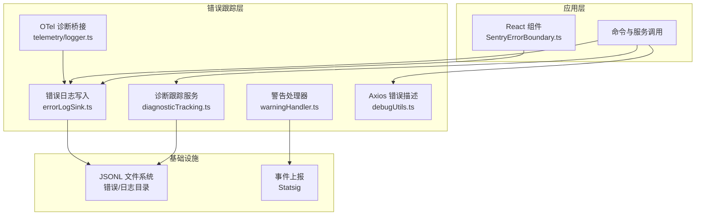
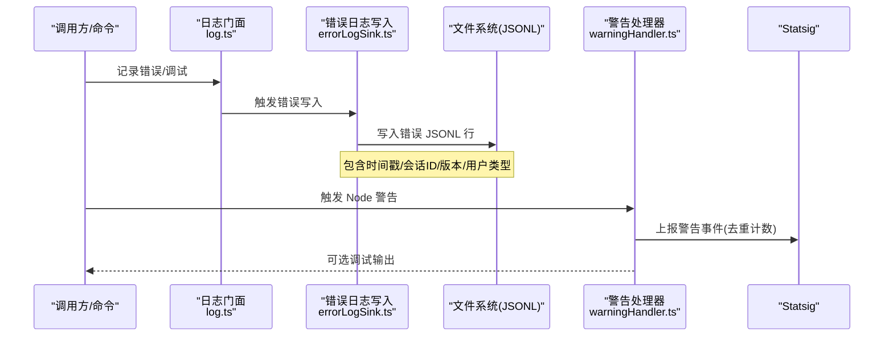
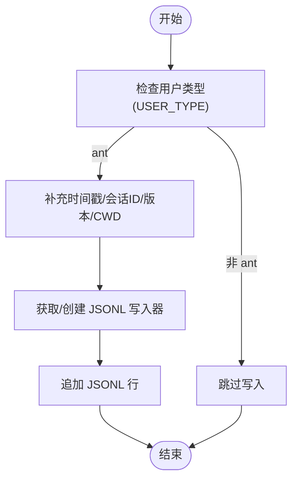
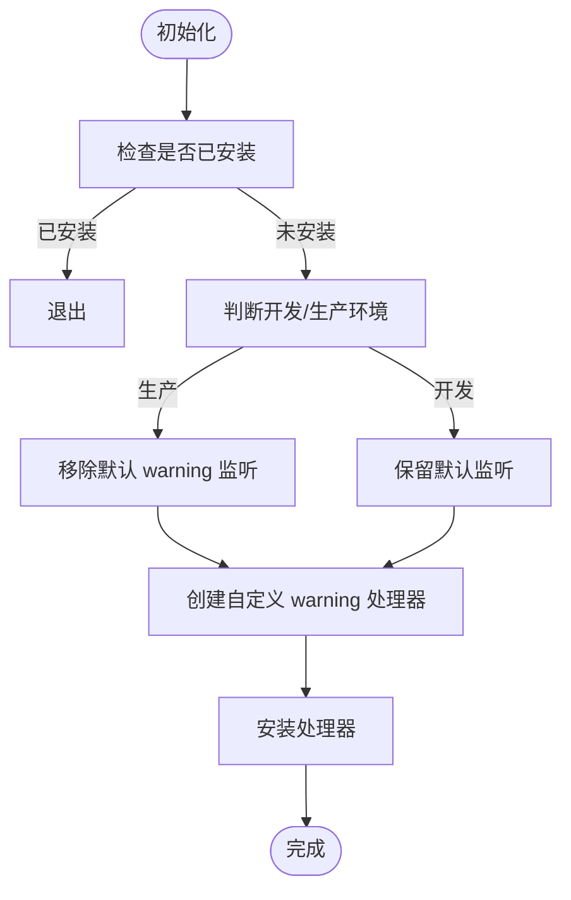
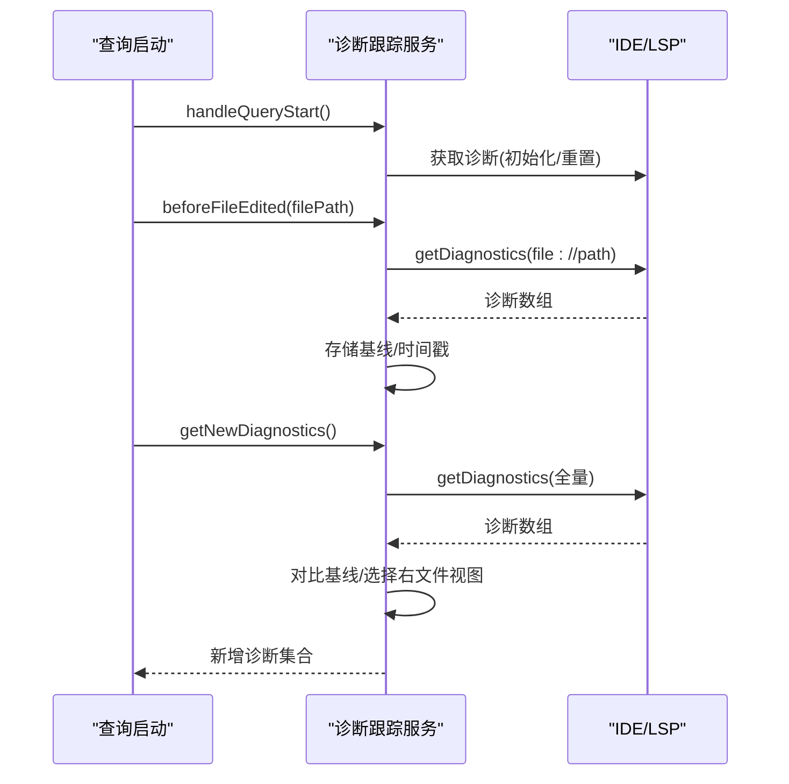
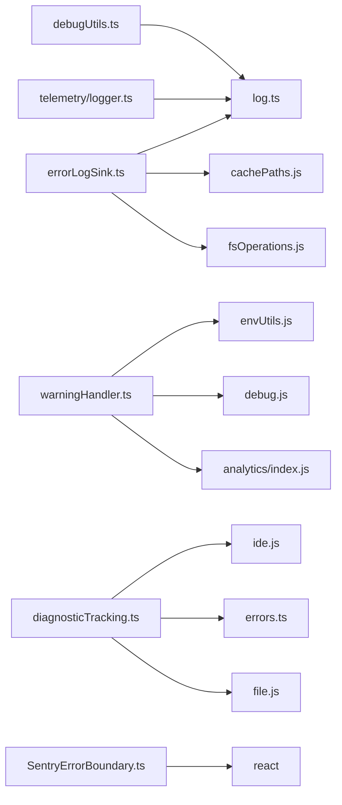

# 错误跟踪

<cite>
**本文引用的文件**
- [src/utils/errorLogSink.ts](file://src/utils/errorLogSink.ts)
- [src/utils/warningHandler.ts](file://src/utils/warningHandler.ts)
- [src/bridge/debugUtils.ts](file://src/bridge/debugUtils.ts)
- [src/utils/telemetry/logger.ts](file://src/utils/telemetry/logger.ts)
- [src/services/diagnosticTracking.ts](file://src/services/diagnosticTracking.ts)
- [src/components/SentryErrorBoundary.ts](file://src/components/SentryErrorBoundary.ts)
- [src/constants/errorIds.ts](file://src/constants/errorIds.ts)
- [src/utils/errors.ts](file://src/utils/errors.ts)
- [src/utils/log.ts](file://src/utils/log.ts)
- [src/bridge/bridgeDebug.ts](file://src/bridge/bridgeDebug.ts)
</cite>

## 目录
1. [简介](#简介)
2. [项目结构](#项目结构)
3. [核心组件](#核心组件)
4. [架构总览](#架构总览)
5. [组件详解](#组件详解)
6. [依赖关系分析](#依赖关系分析)
7. [性能与可维护性](#性能与可维护性)
8. [故障排查指南](#故障排查指南)
9. [结论](#结论)
10. [附录：错误分类与优先级](#附录错误分类与优先级)

## 简介
本指南面向使用者与维护者，系统讲解 Claude Code 的错误跟踪体系，涵盖错误收集、记录、分析与可视化路径。内容包括：
- 错误日志管理（本地 JSONL 文件、MCP 日志）
- 警告处理与统计上报
- 异常捕获与边界保护
- 错误报告生成与趋势分析思路
- 错误分类与优先级建议
- 常见问题诊断与解决步骤

## 项目结构
围绕“错误跟踪”的关键模块分布如下：
- 错误日志与写入：src/utils/errorLogSink.ts
- 警告处理与上报：src/utils/warningHandler.ts
- 调试工具与错误描述：src/bridge/debugUtils.ts
- 三方遥测诊断日志桥接：src/utils/telemetry/logger.ts
- 诊断信息跟踪与汇总：src/services/diagnosticTracking.ts
- React 组件级错误边界：src/components/SentryErrorBoundary.ts
- 错误标识常量与基础错误类型：src/constants/errorIds.ts、src/utils/errors.ts
- 日志门面与调试输出：src/utils/log.ts
- 桥接层调试注入：src/bridge/bridgeDebug.ts

图表来源
- [src/utils/errorLogSink.ts:1-236](file://src/utils/errorLogSink.ts#L1-L236)
- [src/utils/warningHandler.ts:1-122](file://src/utils/warningHandler.ts#L1-L122)
- [src/bridge/debugUtils.ts:45-82](file://src/bridge/debugUtils.ts#L45-L82)
- [src/utils/telemetry/logger.ts:1-26](file://src/utils/telemetry/logger.ts#L1-L26)
- [src/services/diagnosticTracking.ts:1-398](file://src/services/diagnosticTracking.ts#L1-L398)
- [src/components/SentryErrorBoundary.ts:1-29](file://src/components/SentryErrorBoundary.ts#L1-L29)

章节来源
- [src/utils/errorLogSink.ts:1-236](file://src/utils/errorLogSink.ts#L1-L236)
- [src/utils/warningHandler.ts:1-122](file://src/utils/warningHandler.ts#L1-L122)
- [src/bridge/debugUtils.ts:45-82](file://src/bridge/debugUtils.ts#L45-L82)
- [src/utils/telemetry/logger.ts:1-26](file://src/utils/telemetry/logger.ts#L1-L26)
- [src/services/diagnosticTracking.ts:1-398](file://src/services/diagnosticTracking.ts#L1-L398)
- [src/components/SentryErrorBoundary.ts:1-29](file://src/components/SentryErrorBoundary.ts#L1-L29)

## 核心组件
- 错误日志写入器：负责将错误与 MCP 调试信息以 JSONL 形式落盘，带时间戳、会话 ID、用户类型等上下文。
- 警告处理器：统一拦截 Node.js 进程警告，进行去重计数、内部/外部识别、Statsig 上报与可选调试输出。
- 诊断跟踪服务：基于 IDE/LSP 诊断结果，对比编辑前后差异，提取新增诊断并格式化摘要。
- Axios 错误描述：增强 HTTP 错误消息，拼接响应体中的业务提示，便于定位。
- OTEL 诊断桥接：将第三方遥测诊断日志转为统一错误记录与调试输出。
- React 错误边界：在 UI 层对异常进行兜底，避免整页崩溃。

章节来源
- [src/utils/errorLogSink.ts:149-174](file://src/utils/errorLogSink.ts#L149-L174)
- [src/utils/warningHandler.ts:60-121](file://src/utils/warningHandler.ts#L60-L121)
- [src/services/diagnosticTracking.ts:30-76](file://src/services/diagnosticTracking.ts#L30-L76)
- [src/bridge/debugUtils.ts:60-82](file://src/bridge/debugUtils.ts#L60-L82)
- [src/utils/telemetry/logger.ts:4-26](file://src/utils/telemetry/logger.ts#L4-L26)
- [src/components/SentryErrorBoundary.ts:11-28](file://src/components/SentryErrorBoundary.ts#L11-L28)

## 架构总览
下图展示从调用链到落地存储的关键路径，以及与外部系统的交互点。

图表来源
- [src/utils/log.ts](file://src/utils/log.ts)
- [src/utils/errorLogSink.ts:149-174](file://src/utils/errorLogSink.ts#L149-L174)
- [src/utils/warningHandler.ts:95-106](file://src/utils/warningHandler.ts#L95-L106)

## 组件详解

### 错误日志写入器（errorLogSink）
职责
- 将错误与 MCP 调试信息以 JSONL 行写入缓存目录，便于离线分析。
- 自动创建目录、缓冲写入、注册清理钩子。
- 对 Axios 错误增强上下文（URL、状态码、服务器消息）。

关键行为
- 初始化：attachErrorLogSink 注册实现，随后所有错误通过统一入口写入。
- 错误写入：logErrorImpl 增强消息后写入错误日志文件。
- MCP 写入：logMCPErrorImpl/logMCPDebugImpl 分别写入对应服务器的日志文件。
- 路径策略：按日期命名文件，支持多服务器隔离。

图表来源
- [src/utils/errorLogSink.ts:111-126](file://src/utils/errorLogSink.ts#L111-L126)
- [src/utils/errorLogSink.ts:152-174](file://src/utils/errorLogSink.ts#L152-L174)
- [src/utils/errorLogSink.ts:179-195](file://src/utils/errorLogSink.ts#L179-L195)
- [src/utils/errorLogSink.ts:200-213](file://src/utils/errorLogSink.ts#L200-L213)

章节来源
- [src/utils/errorLogSink.ts:1-236](file://src/utils/errorLogSink.ts#L1-L236)

### 警告处理器（warningHandler）
职责
- 安装进程级 warning 监听，过滤内部已知警告，上报 Statsig 并可选调试输出。
- 使用有界映射统计出现次数，防止内存膨胀。
- 在非开发模式下移除默认 Node 警告输出，避免干扰用户。

关键行为
- 初始化：检测是否已安装自定义处理器；根据运行环境决定保留默认处理器。
- 处理流程：计算键值、计数、判定内部警告、上报事件、调试输出。
- 重置：测试友好接口，清理监听与计数。

图表来源
- [src/utils/warningHandler.ts:60-121](file://src/utils/warningHandler.ts#L60-L121)

章节来源
- [src/utils/warningHandler.ts:1-122](file://src/utils/warningHandler.ts#L1-L122)

### 诊断跟踪服务（diagnosticTracking）
职责
- 在查询开始时初始化/重置，确保 IDE/LSP 诊断可用。
- 编辑前抓取基线，编辑后对比新诊断，仅返回新增项。
- 提供人类可读的诊断摘要，限制最大长度并截断标记。

关键行为
- 初始化/重置：handleQueryStart 根据客户端连接状态初始化或重置。
- 基线采集：beforeFileEdited 抓取 file:// URI 的诊断并规范化路径。
- 新诊断提取：getNewDiagnostics 对比 baseline 返回新增诊断。
- 摘要格式化：formatDiagnosticsSummary 生成简洁摘要字符串。

图表来源
- [src/services/diagnosticTracking.ts:330-343](file://src/services/diagnosticTracking.ts#L330-L343)
- [src/services/diagnosticTracking.ts:135-182](file://src/services/diagnosticTracking.ts#L135-L182)
- [src/services/diagnosticTracking.ts:188-283](file://src/services/diagnosticTracking.ts#L188-L283)
- [src/services/diagnosticTracking.ts:352-380](file://src/services/diagnosticTracking.ts#L352-L380)

章节来源
- [src/services/diagnosticTracking.ts:1-398](file://src/services/diagnosticTracking.ts#L1-L398)

### Axios 错误描述（debugUtils）
职责
- 从 axios 错误中提取描述性消息，若存在响应体中的 message 或 error.message，则拼接到默认错误消息后，提升可观测性。

章节来源
- [src/bridge/debugUtils.ts:55-82](file://src/bridge/debugUtils.ts#L55-L82)

### OTEL 诊断桥接（telemetry/logger）
职责
- 实现 DiagLogger 接口，将第三方遥测诊断错误/警告转换为统一的错误记录与调试输出。

章节来源
- [src/utils/telemetry/logger.ts:1-26](file://src/utils/telemetry/logger.ts#L1-L26)

### React 错误边界（SentryErrorBoundary）
职责
- 在 UI 层对子树异常进行捕获，避免整页崩溃；渲染空内容以隐藏异常 UI。

章节来源
- [src/components/SentryErrorBoundary.ts:1-29](file://src/components/SentryErrorBoundary.ts#L1-L29)

### 错误标识与基础类型（constants/errorIds、utils/errors）
职责
- 提供错误标识常量与基础错误类型，便于统一识别与分类。

章节来源
- [src/constants/errorIds.ts](file://src/constants/errorIds.ts)
- [src/utils/errors.ts](file://src/utils/errors.ts)

### 日志门面与调试输出（utils/log）
职责
- 提供统一的日志入口，延迟到 sink 初始化后再批量投递，避免导入循环与早期丢失。

章节来源
- [src/utils/log.ts](file://src/utils/log.ts)

### 桥接层调试注入（bridge/bridgeDebug）
职责
- 提供桥接层故障注入、强制重连、唤醒轮询等调试能力，配合调试日志快速复现问题。

章节来源
- [src/bridge/bridgeDebug.ts:38-75](file://src/bridge/bridgeDebug.ts#L38-L75)

## 依赖关系分析
- errorLogSink 依赖：log.ts（门面）、缓存路径、文件系统、清理注册、会话状态。
- warningHandler 依赖：平台信息、环境变量、Statsig 事件上报、调试输出。
- diagnosticTracking 依赖：IDE/LSP RPC、文件路径归一化、ClaudeError。
- debugUtils 依赖：通用错误消息提取、JSON 序列化。
- telemetry/logger 依赖：@opentelemetry/api、log.ts、debug 输出。
- SentryErrorBoundary 为 UI 组件，无复杂依赖。

图表来源
- [src/utils/errorLogSink.ts:13-22](file://src/utils/errorLogSink.ts#L13-L22)
- [src/utils/warningHandler.ts:1-9](file://src/utils/warningHandler.ts#L1-L9)
- [src/services/diagnosticTracking.ts:1-9](file://src/services/diagnosticTracking.ts#L1-L9)
- [src/bridge/debugUtils.ts:45-82](file://src/bridge/debugUtils.ts#L45-L82)
- [src/utils/telemetry/logger.ts:1-26](file://src/utils/telemetry/logger.ts#L1-L26)
- [src/components/SentryErrorBoundary.ts:1-5](file://src/components/SentryErrorBoundary.ts#L1-L5)

## 性能与可维护性
- 缓冲写入：errorLogSink 使用缓冲写入器，降低频繁 IO 开销。
- 有界计数：warningHandler 使用 Map 记录警告次数，上限 1000，避免内存无限增长。
- 路径归一化：diagnosticTracking 对 Windows 不区分大小写与分隔符，减少误判。
- 延迟初始化：log.ts 将事件排队直到 sink 初始化，避免早期丢失与循环依赖。
- 可观测性：Axios 错误增强、调试注入、诊断摘要截断，兼顾可读性与性能。

章节来源
- [src/utils/errorLogSink.ts:85-109](file://src/utils/errorLogSink.ts#L85-L109)
- [src/utils/warningHandler.ts:10-12](file://src/utils/warningHandler.ts#L10-L12)
- [src/services/diagnosticTracking.ts:78-97](file://src/services/diagnosticTracking.ts#L78-L97)
- [src/utils/log.ts](file://src/utils/log.ts)

## 故障排查指南
- 查看错误日志
  - 打开缓存目录下的错误 JSONL 文件，筛选包含时间戳、会话 ID、版本号与用户类型的字段，定位具体请求上下文。
  - 若涉及 MCP 服务器，查看对应服务器日志文件，关注错误堆栈与请求 URL。
- 分析警告趋势
  - 通过 Statsig 的 tengu_node_warning 事件，观察警告类别与出现次数，结合 is_internal 字段区分内部/外部警告。
  - 在调试模式下，可在控制台看到更详细的警告上下文。
- 诊断 LSP/IDE 问题
  - 使用 diagnosticTracking 的摘要功能，确认新增诊断是否与编辑操作一致。
  - 若路径不匹配或诊断为空，检查文件协议前缀与路径归一化逻辑。
- 增强 Axios 错误定位
  - 使用 describeAxiosError 获取包含服务器消息的完整错误描述，辅助定位业务错误。
- React 异常
  - 若 UI 出现空白或异常，检查 SentryErrorBoundary 是否生效，必要时临时关闭以定位根因。
- 桥接层问题
  - 使用 bridgeDebug 的调试句柄进行故障注入与强制重连，缩短复现时间。

章节来源
- [src/utils/errorLogSink.ts:111-126](file://src/utils/errorLogSink.ts#L111-L126)
- [src/utils/warningHandler.ts:95-112](file://src/utils/warningHandler.ts#L95-L112)
- [src/services/diagnosticTracking.ts:135-182](file://src/services/diagnosticTracking.ts#L135-L182)
- [src/bridge/debugUtils.ts:60-82](file://src/bridge/debugUtils.ts#L60-L82)
- [src/components/SentryErrorBoundary.ts:17-27](file://src/components/SentryErrorBoundary.ts#L17-L27)
- [src/bridge/bridgeDebug.ts:57-75](file://src/bridge/bridgeDebug.ts#L57-L75)

## 结论
该错误跟踪体系通过“统一日志门面 + 文件落盘 + 警告统计 + 诊断摘要 + UI 边界保护”形成闭环，既满足日常运维定位，也支持趋势分析与自动化监控。建议在生产环境启用错误日志与警告上报，在开发环境开启调试输出与默认警告保留，以平衡可观测性与用户体验。

## 附录：错误分类与优先级
- 分类维度
  - 来源：前端 UI、命令执行、IDE/LSP、网络请求（Axios）、遥测诊断、桥接层。
  - 严重度：Error（阻断）、Warning（降级）、Info/Hint（参考）。
- 优先级建议
  - P0：导致会话中断、数据损坏、安全风险的错误。
  - P1：影响主要功能但可回退的错误。
  - P2：影响次要功能或体验的错误。
  - P3：不影响功能但可优化的警告或噪声。
- 配置要点
  - 用户类型：仅对 ant 用户写入详细日志，避免泄露敏感信息。
  - 会话 ID：用于跨模块关联同一会话内的错误与诊断。
  - 截断策略：诊断摘要与调试消息设置上限，避免超长文本影响分析。

章节来源
- [src/utils/errorLogSink.ts:111-126](file://src/utils/errorLogSink.ts#L111-L126)
- [src/services/diagnosticTracking.ts:352-380](file://src/services/diagnosticTracking.ts#L352-L380)
- [src/utils/warningHandler.ts:95-106](file://src/utils/warningHandler.ts#L95-L106)