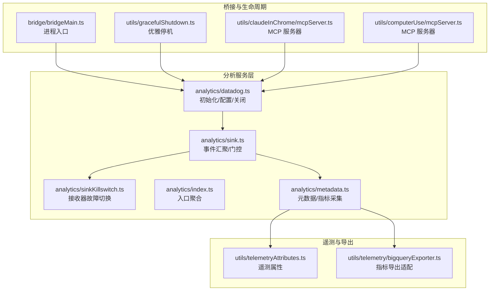
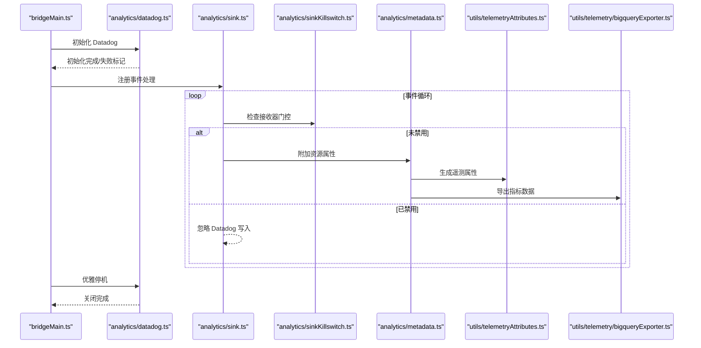
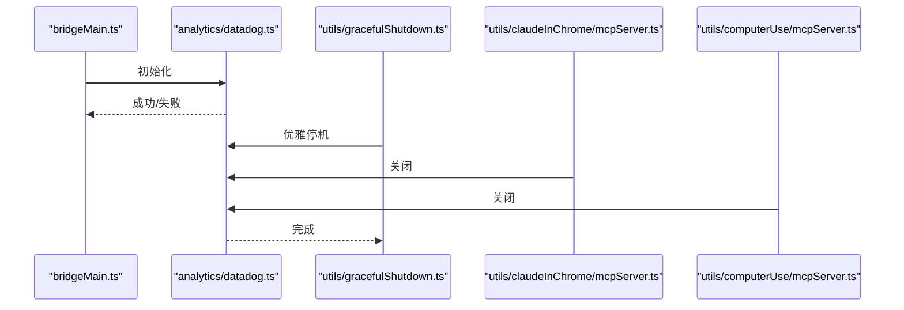
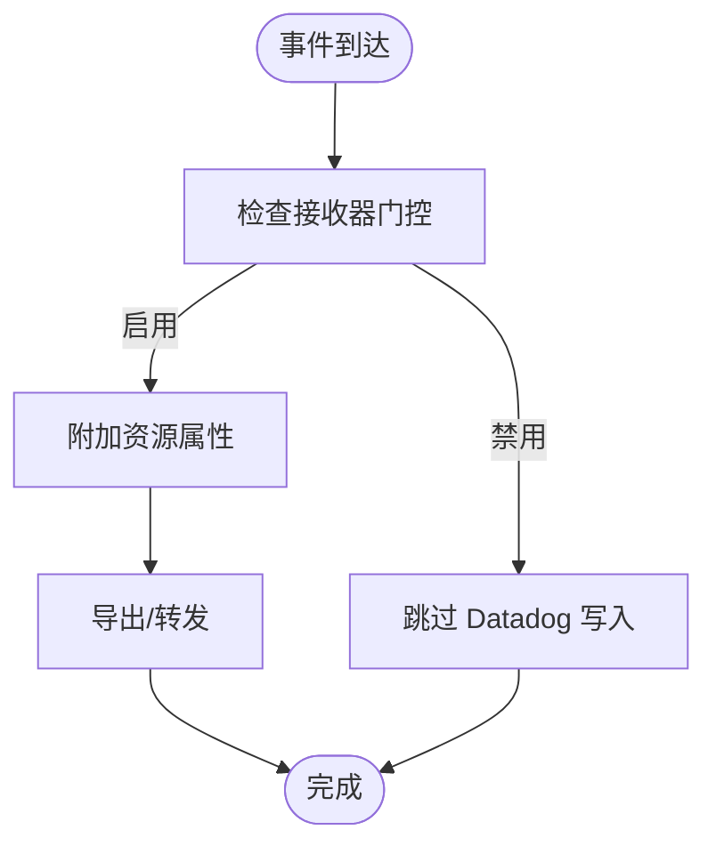
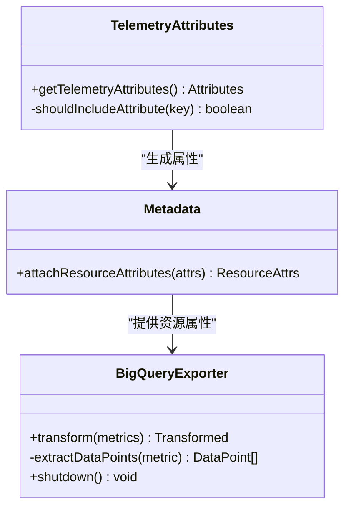
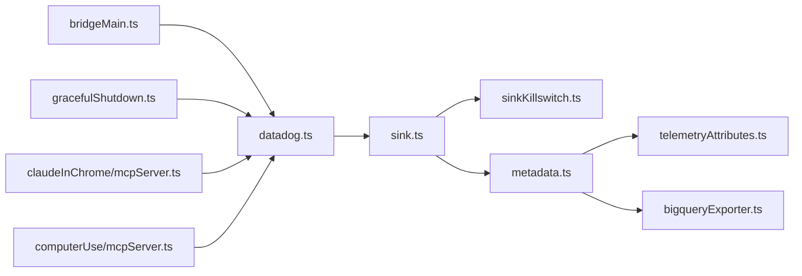

# Datadog 集成

<cite>
**本文引用的文件**
- [src/services/analytics/datadog.ts](file://src/services/analytics/datadog.ts)
- [src/services/analytics/sink.ts](file://src/services/analytics/sink.ts)
- [src/services/analytics/sinkKillswitch.ts](file://src/services/analytics/sinkKillswitch.ts)
- [src/services/analytics/index.ts](file://src/services/analytics/index.ts)
- [src/services/analytics/metadata.ts](file://src/services/analytics/metadata.ts)
- [src/bridge/bridgeMain.ts](file://src/bridge/bridgeMain.ts)
- [src/utils/telemetryAttributes.ts](file://src/utils/telemetryAttributes.ts)
- [src/utils/telemetry/bigqueryExporter.ts](file://src/utils/telemetry/bigqueryExporter.ts)
- [src/utils/gracefulShutdown.ts](file://src/utils/gracefulShutdown.ts)
- [src/utils/claudeInChrome/mcpServer.ts](file://src/utils/claudeInChrome/mcpServer.ts)
- [src/utils/computerUse/mcpServer.ts](file://src/utils/computerUse/mcpServer.ts)
</cite>

## 目录
1. [简介](#简介)
2. [项目结构](#项目结构)
3. [核心组件](#核心组件)
4. [架构总览](#架构总览)
5. [详细组件分析](#详细组件分析)
6. [依赖关系分析](#依赖关系分析)
7. [性能考量](#性能考量)
8. [故障排查指南](#故障排查指南)
9. [结论](#结论)
10. [附录](#附录)

## 简介
本文件系统性梳理并说明本仓库中的 Datadog 集成方案：包括 SDK 初始化与配置、遥测属性注入、事件导出管道、数据接收器（日志/指标）配置与故障切换、性能监控指标定义与可视化建议、仪表板与告警配置思路，以及数据安全与隐私保护实践。文档基于实际源码进行分析，避免臆造信息。

## 项目结构
与 Datadog 集成相关的核心模块集中在 analytics 子系统，并与桥接层、遥测工具、优雅停机流程等存在耦合：

图表来源
- [src/services/analytics/datadog.ts](file://src/services/analytics/datadog.ts)
- [src/services/analytics/sink.ts](file://src/services/analytics/sink.ts)
- [src/services/analytics/sinkKillswitch.ts](file://src/services/analytics/sinkKillswitch.ts)
- [src/services/analytics/index.ts](file://src/services/analytics/index.ts)
- [src/services/analytics/metadata.ts](file://src/services/analytics/metadata.ts)
- [src/bridge/bridgeMain.ts](file://src/bridge/bridgeMain.ts)
- [src/utils/gracefulShutdown.ts](file://src/utils/gracefulShutdown.ts)
- [src/utils/claudeInChrome/mcpServer.ts](file://src/utils/claudeInChrome/mcpServer.ts)
- [src/utils/computerUse/mcpServer.ts](file://src/utils/computerUse/mcpServer.ts)
- [src/utils/telemetryAttributes.ts](file://src/utils/telemetryAttributes.ts)
- [src/utils/telemetry/bigqueryExporter.ts](file://src/utils/telemetry/bigqueryExporter.ts)

章节来源
- [src/services/analytics/datadog.ts](file://src/services/analytics/datadog.ts)
- [src/services/analytics/sink.ts](file://src/services/analytics/sink.ts)
- [src/services/analytics/sinkKillswitch.ts](file://src/services/analytics/sinkKillswitch.ts)
- [src/services/analytics/index.ts](file://src/services/analytics/index.ts)
- [src/services/analytics/metadata.ts](file://src/services/analytics/metadata.ts)
- [src/bridge/bridgeMain.ts](file://src/bridge/bridgeMain.ts)
- [src/utils/gracefulShutdown.ts](file://src/utils/gracefulShutdown.ts)
- [src/utils/claudeInChrome/mcpServer.ts](file://src/utils/claudeInChrome/mcpServer.ts)
- [src/utils/computerUse/mcpServer.ts](file://src/utils/computerUse/mcpServer.ts)
- [src/utils/telemetryAttributes.ts](file://src/utils/telemetryAttributes.ts)
- [src/utils/telemetry/bigqueryExporter.ts](file://src/utils/telemetry/bigqueryExporter.ts)

## 核心组件
- Datadog 初始化与配置
  - 负责 SDK 初始化、端点配置、初始化状态管理与关闭流程。
  - 关键职责：日志 intake 地址、初始化标记、关闭清理。
- 事件汇聚与门控
  - 将各类事件统一汇聚到统一出口，支持按门控开关控制是否写入 Datadog。
- 故障切换
  - 提供接收器级的“杀开关”，可临时禁用 Datadog 接收器，保障系统在异常时仍能继续运行。
- 元数据与指标采集
  - 聚合用户、会话、版本、订阅类型等资源属性，形成统一指标/日志上下文。
- 遥测属性与导出适配
  - 生成标准化遥测属性；将 OpenTelemetry 指标转换为可被下游消费的格式。

章节来源
- [src/services/analytics/datadog.ts](file://src/services/analytics/datadog.ts)
- [src/services/analytics/sink.ts](file://src/services/analytics/sink.ts)
- [src/services/analytics/sinkKillswitch.ts](file://src/services/analytics/sinkKillswitch.ts)
- [src/services/analytics/metadata.ts](file://src/services/analytics/metadata.ts)
- [src/utils/telemetryAttributes.ts](file://src/utils/telemetryAttributes.ts)
- [src/utils/telemetry/bigqueryExporter.ts](file://src/utils/telemetry/bigqueryExporter.ts)

## 架构总览
下图展示了从进程启动到事件落库的整体链路，以及与 Datadog 的交互位置：

图表来源
- [src/bridge/bridgeMain.ts](file://src/bridge/bridgeMain.ts)
- [src/services/analytics/datadog.ts](file://src/services/analytics/datadog.ts)
- [src/services/analytics/sink.ts](file://src/services/analytics/sink.ts)
- [src/services/analytics/sinkKillswitch.ts](file://src/services/analytics/sinkKillswitch.ts)
- [src/services/analytics/metadata.ts](file://src/services/analytics/metadata.ts)
- [src/utils/telemetryAttributes.ts](file://src/utils/telemetryAttributes.ts)
- [src/utils/telemetry/bigqueryExporter.ts](file://src/utils/telemetry/bigqueryExporter.ts)

## 详细组件分析

### 组件一：Datadog 初始化与关闭
- 初始化流程
  - 端点配置：包含日志 intake 地址等。
  - 初始化状态：维护全局初始化标记，避免重复初始化或竞态。
  - 失败处理：记录失败状态以便后续降级策略。
- 关闭流程
  - 在优雅停机阶段调用关闭函数，确保缓冲区刷新与连接释放。
- 与桥接层的集成
  - 进程入口与 MCP 服务器均在退出路径中触发关闭，保证生命周期一致性。

图表来源
- [src/bridge/bridgeMain.ts](file://src/bridge/bridgeMain.ts)
- [src/services/analytics/datadog.ts](file://src/services/analytics/datadog.ts)
- [src/utils/gracefulShutdown.ts](file://src/utils/gracefulShutdown.ts)
- [src/utils/claudeInChrome/mcpServer.ts](file://src/utils/claudeInChrome/mcpServer.ts)
- [src/utils/computerUse/mcpServer.ts](file://src/utils/computerUse/mcpServer.ts)

章节来源
- [src/services/analytics/datadog.ts](file://src/services/analytics/datadog.ts)
- [src/bridge/bridgeMain.ts](file://src/bridge/bridgeMain.ts)
- [src/utils/gracefulShutdown.ts](file://src/utils/gracefulShutdown.ts)
- [src/utils/claudeInChrome/mcpServer.ts](file://src/utils/claudeInChrome/mcpServer.ts)
- [src/utils/computerUse/mcpServer.ts](file://src/utils/computerUse/mcpServer.ts)

### 组件二：事件汇聚与门控
- 事件汇聚
  - 所有事件经由统一入口进入，便于集中处理与门控。
- 门控机制
  - 使用“接收器门控”名称标识 Datadog 写入开关，若被禁用则跳过写入。
- 与故障切换的协作
  - 门控与 killswitch 协同工作，确保在极端情况下仍可维持系统可用性。

图表来源
- [src/services/analytics/sink.ts](file://src/services/analytics/sink.ts)
- [src/services/analytics/sinkKillswitch.ts](file://src/services/analytics/sinkKillswitch.ts)

章节来源
- [src/services/analytics/sink.ts](file://src/services/analytics/sink.ts)
- [src/services/analytics/sinkKillswitch.ts](file://src/services/analytics/sinkKillswitch.ts)

### 组件三：元数据与遥测属性
- 资源属性
  - 用户 ID、会话 ID、应用版本、客户类型、订阅类型等。
  - 受环境变量控制的基数策略，避免指标爆炸。
- 遥测属性
  - 生成标准化属性字典，供日志与指标使用。
- 指标导出适配
  - 将 OpenTelemetry 指标转换为可序列化结构，便于下游处理。

图表来源
- [src/utils/telemetryAttributes.ts](file://src/utils/telemetryAttributes.ts)
- [src/utils/telemetry/bigqueryExporter.ts](file://src/utils/telemetry/bigqueryExporter.ts)
- [src/services/analytics/metadata.ts](file://src/services/analytics/metadata.ts)

章节来源
- [src/utils/telemetryAttributes.ts](file://src/utils/telemetryAttributes.ts)
- [src/utils/telemetry/bigqueryExporter.ts](file://src/utils/telemetry/bigqueryExporter.ts)
- [src/services/analytics/metadata.ts](file://src/services/analytics/metadata.ts)

### 组件四：性能监控指标与可视化
- 指标来源
  - 元数据模块负责聚合用户、会话、版本、订阅类型等维度。
  - 遥测属性模块提供基数控制与标准化属性。
- 指标建议
  - 会话级：活跃会话数、会话时长分布、错误率。
  - 用户级：新用户转化、留存、付费转化。
  - 系统级：CPU 使用率、内存占用、请求延迟、重试/超时次数。
- 可视化建议
  - 仪表板：分维度堆叠图、趋势线、热力图。
  - 告警：阈值告警、同比/环比异常检测、SLI/SLO 对齐。

章节来源
- [src/services/analytics/metadata.ts](file://src/services/analytics/metadata.ts)
- [src/utils/telemetryAttributes.ts](file://src/utils/telemetryAttributes.ts)

### 组件五：数据导出管道与传输机制
- 数据流
  - 事件 → 门控检查 → 资源属性附加 → 遥测属性生成 → 指标导出适配 → 下游传输。
- 传输通道
  - 日志：通过 Datadog 日志 intake 发送。
  - 指标：通过适配器转换后发送至目标系统（如 BigQuery）。
- 缓冲与批处理
  - 采用批量与定时刷新策略，降低网络开销与抖动。

章节来源
- [src/services/analytics/sink.ts](file://src/services/analytics/sink.ts)
- [src/services/analytics/datadog.ts](file://src/services/analytics/datadog.ts)
- [src/utils/telemetry/bigqueryExporter.ts](file://src/utils/telemetry/bigqueryExporter.ts)

### 组件六：数据接收器配置与故障切换
- 接收器配置
  - 通过门控名称标识 Datadog 接收器，支持动态启停。
- 故障切换
  - killswitch 支持在运行时禁用 Datadog 接收器，避免外部依赖异常影响主业务。
- 最佳实践
  - 默认启用，异常时快速切到禁用；恢复后逐步回切。

章节来源
- [src/services/analytics/sink.ts](file://src/services/analytics/sink.ts)
- [src/services/analytics/sinkKillswitch.ts](file://src/services/analytics/sinkKillswitch.ts)

### 组件七：SDK 集成方式与配置参数
- 集成方式
  - 在进程入口初始化 SDK，确保尽早建立日志/指标能力。
  - 在优雅停机与 MCP 服务器关闭时执行关闭逻辑。
- 配置参数
  - 日志 intake 地址等端点参数。
  - 初始化状态标记，避免重复初始化。
  - 与门控/killswitch 协同，支持运行时调整。

章节来源
- [src/services/analytics/datadog.ts](file://src/services/analytics/datadog.ts)
- [src/bridge/bridgeMain.ts](file://src/bridge/bridgeMain.ts)
- [src/utils/gracefulShutdown.ts](file://src/utils/gracefulShutdown.ts)
- [src/utils/claudeInChrome/mcpServer.ts](file://src/utils/claudeInChrome/mcpServer.ts)
- [src/utils/computerUse/mcpServer.ts](file://src/utils/computerUse/mcpServer.ts)

## 依赖关系分析
- 组件内聚与耦合
  - Datadog 初始化与关闭与桥接层强耦合，确保生命周期一致。
  - 事件汇聚与门控相对独立，便于扩展其他接收器。
  - 元数据与遥测属性解耦，便于复用与测试。
- 外部依赖
  - Datadog 日志 intake 端点。
  - OpenTelemetry 指标模型与导出适配器。
- 循环依赖
  - 未发现循环导入；模块边界清晰。

图表来源
- [src/services/analytics/datadog.ts](file://src/services/analytics/datadog.ts)
- [src/services/analytics/sink.ts](file://src/services/analytics/sink.ts)
- [src/services/analytics/sinkKillswitch.ts](file://src/services/analytics/sinkKillswitch.ts)
- [src/services/analytics/metadata.ts](file://src/services/analytics/metadata.ts)
- [src/utils/telemetryAttributes.ts](file://src/utils/telemetryAttributes.ts)
- [src/utils/telemetry/bigqueryExporter.ts](file://src/utils/telemetry/bigqueryExporter.ts)
- [src/bridge/bridgeMain.ts](file://src/bridge/bridgeMain.ts)
- [src/utils/gracefulShutdown.ts](file://src/utils/gracefulShutdown.ts)
- [src/utils/claudeInChrome/mcpServer.ts](file://src/utils/claudeInChrome/mcpServer.ts)
- [src/utils/computerUse/mcpServer.ts](file://src/utils/computerUse/mcpServer.ts)

## 性能考量
- 指标基数控制
  - 通过环境变量控制是否包含会话 ID、版本号等高基数属性，避免指标爆炸。
- 批量与刷新
  - 合理设置批量大小与刷新周期，平衡实时性与网络开销。
- 资源属性精简
  - 仅附加必要维度，减少序列化与传输成本。
- 门控与降级
  - 在异常时快速禁用 Datadog 写入，保障主业务稳定。

章节来源
- [src/utils/telemetryAttributes.ts](file://src/utils/telemetryAttributes.ts)
- [src/services/analytics/sink.ts](file://src/services/analytics/sink.ts)

## 故障排查指南
- 初始化失败
  - 检查初始化标记与端点配置，确认网络可达性。
- 写入被拒绝
  - 检查门控状态与 killswitch 设置，确认 Datadog 接收器未被禁用。
- 关闭异常
  - 确认优雅停机流程已调用关闭函数，缓冲区已刷新。
- 指标缺失
  - 检查资源属性附加与遥测属性生成是否正常，核对基数控制策略。

章节来源
- [src/services/analytics/datadog.ts](file://src/services/analytics/datadog.ts)
- [src/services/analytics/sink.ts](file://src/services/analytics/sink.ts)
- [src/services/analytics/sinkKillswitch.ts](file://src/services/analytics/sinkKillswitch.ts)
- [src/utils/gracefulShutdown.ts](file://src/utils/gracefulShutdown.ts)

## 结论
本集成方案通过“初始化—门控—元数据—导出—关闭”的闭环设计，实现了与 Datadog 的稳健对接。配合 killswitch 与基数控制，既能满足可观测性需求，又能在异常时保障系统稳定性。建议结合业务 SLI/SLO 设定仪表板与告警，持续优化指标与可视化效果。

## 附录
- 仪表板配置建议
  - 分维度面板：用户/会话/版本/订阅类型。
  - 实时看板：错误率、延迟、吞吐。
- 告警规则建议
  - 错误率阈值、P95/P99 延迟突增、指标基数异常。
- 数据安全与隐私
  - 严格遵循最小化原则，仅收集必要属性；对敏感字段进行脱敏或过滤；定期审计指标维度与访问权限。