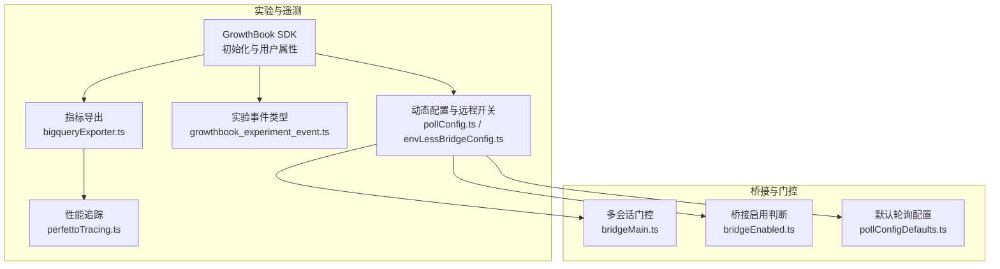
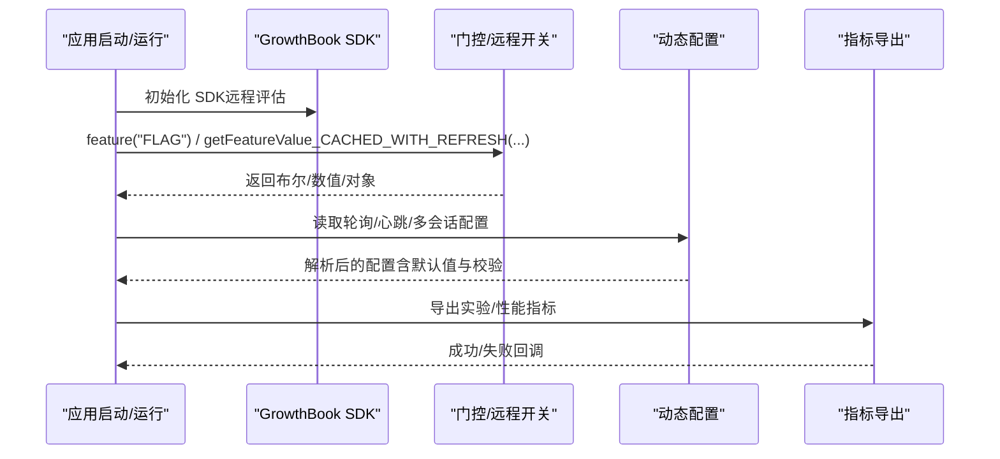
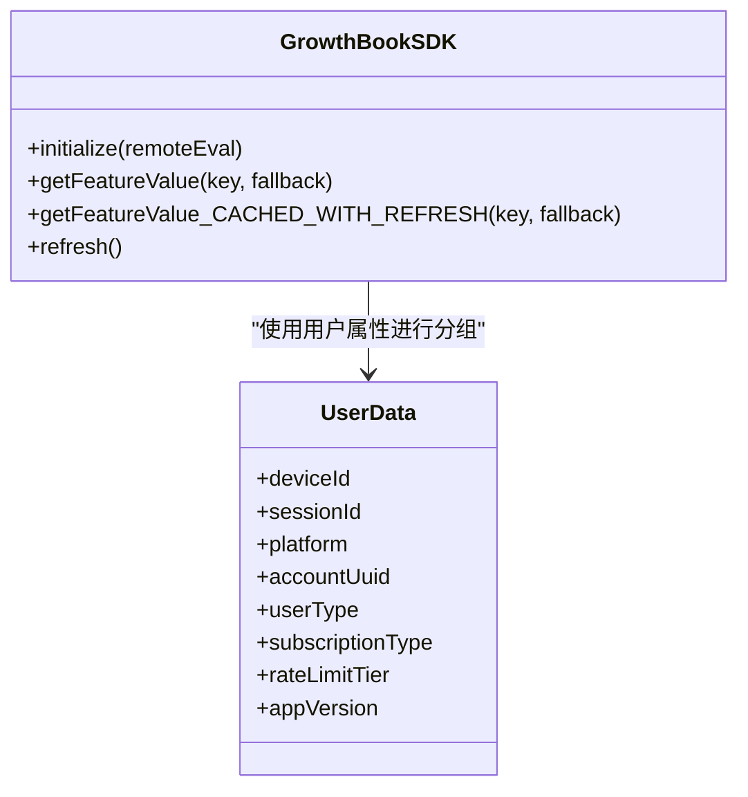
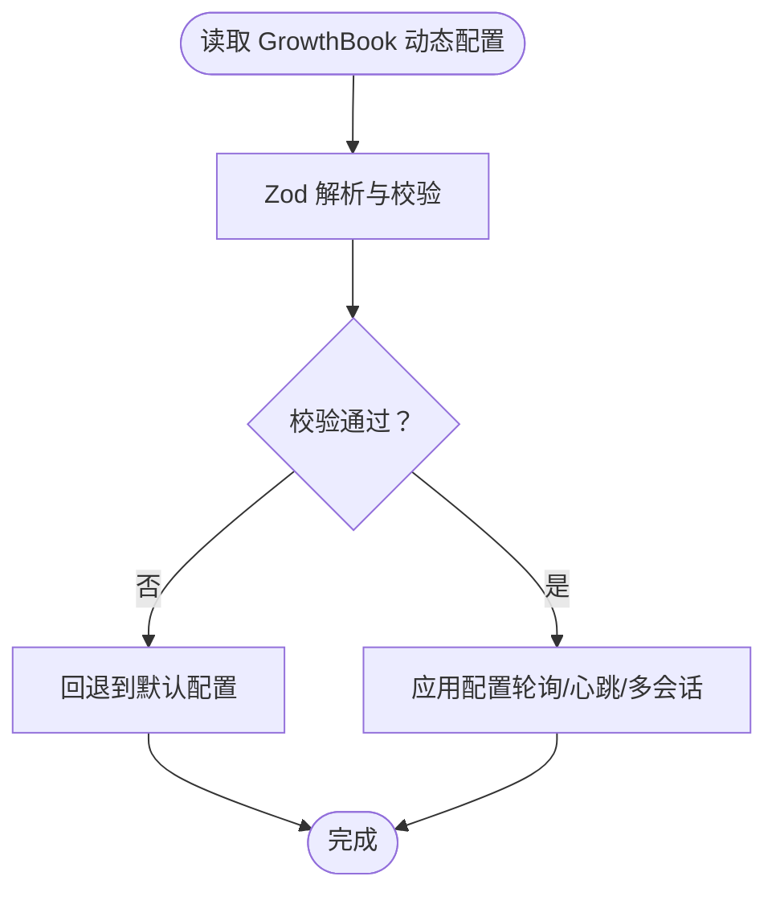
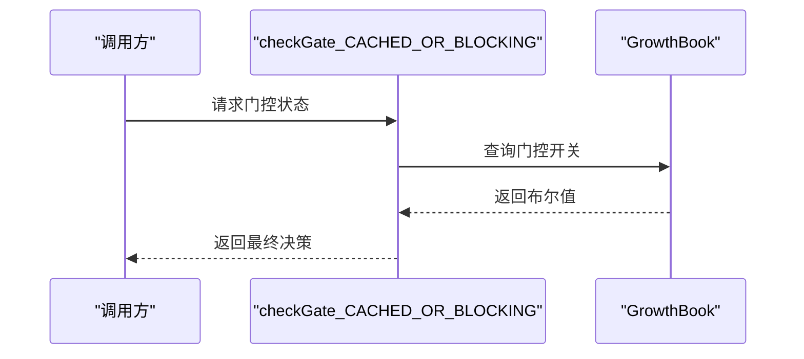
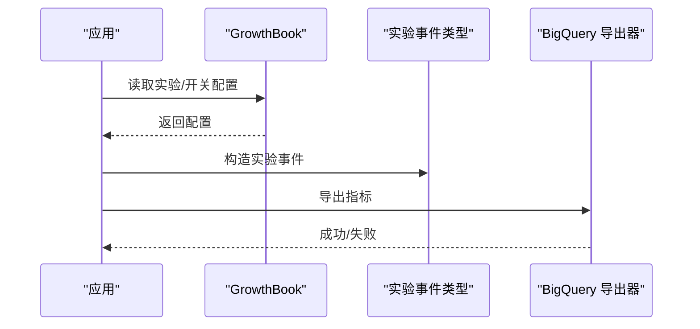
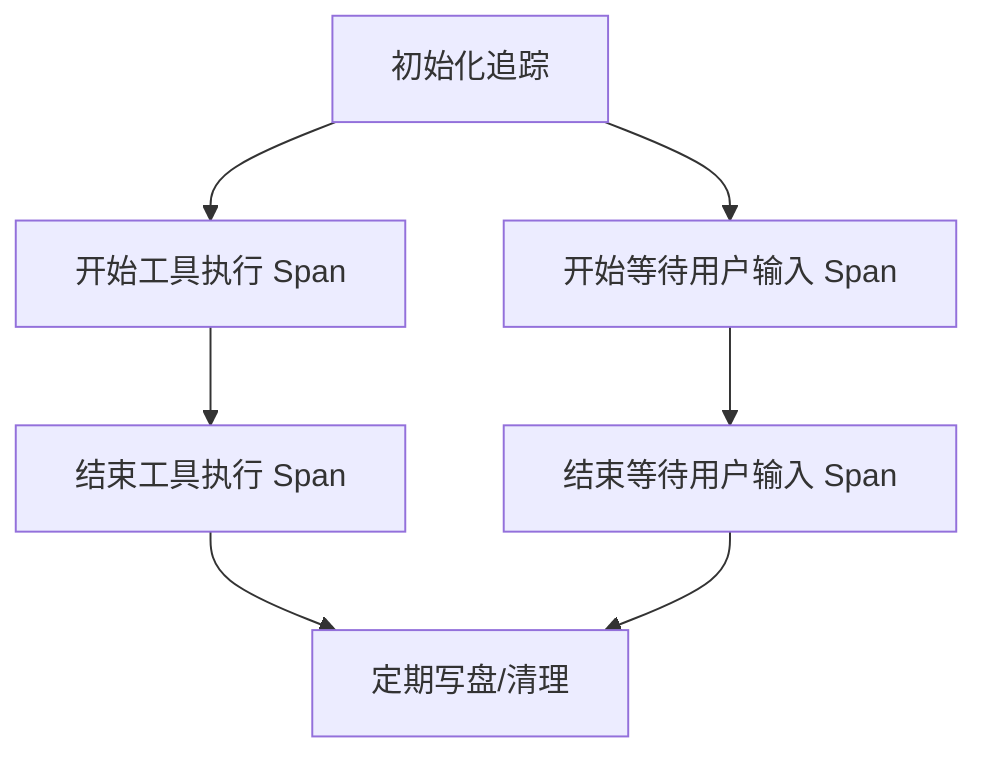
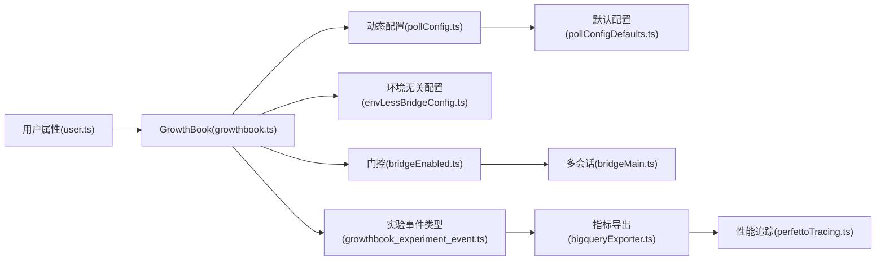

# 实验与 A/B 测试

<cite>
**本文引用的文件**
- [growthbook.ts](file://src/services/analytics/growthbook.ts)
- [user.ts](file://src/utils/user.ts)
- [pollConfig.ts](file://src/bridge/pollConfig.ts)
- [pollConfigDefaults.ts](file://src/bridge/pollConfigDefaults.ts)
- [envLessBridgeConfig.ts](file://src/bridge/envLessBridgeConfig.ts)
- [bridgeEnabled.ts](file://src/bridge/bridgeEnabled.ts)
- [bridgeMain.ts](file://src/bridge/bridgeMain.ts)
- [07-feature-gates.md](file://docs/07-feature-gates.md)
- [growthbook_experiment_event.ts](file://src/types/generated/events_mono/growthbook/v1/growthbook_experiment_event.ts)
- [bigqueryExporter.ts](file://src/utils/telemetry/bigqueryExporter.ts)
- [perfettoTracing.ts](file://src/utils/telemetry/perfettoTracing.ts)
</cite>

## 目录
1. [引言](#引言)
2. [项目结构](#项目结构)
3. [核心组件](#核心组件)
4. [架构总览](#架构总览)
5. [详细组件分析](#详细组件分析)
6. [依赖关系分析](#依赖关系分析)
7. [性能考量](#性能考量)
8. [故障排查指南](#故障排查指南)
9. [结论](#结论)
10. [附录](#附录)

## 引言
本文件系统化梳理 GrowthBook 实验与 A/B 测试在代码中的落地方式，覆盖实验框架配置与管理、远程开关与动态参数、实验分组与流量分配、实验结果统计与显著性检验、最佳实践与评估指标、动态管理与实时调整、以及实验数据的存储与查询接口。目标是帮助读者快速理解并安全地扩展实验体系。

## 项目结构
围绕 GrowthBook 的实验与 A/B 测试相关模块主要分布在以下位置：
- 实验 SDK 初始化与用户属性：services/analytics/growthbook.ts、utils/user.ts
- 动态参数与远程开关：bridge/pollConfig.ts、bridge/pollConfigDefaults.ts、bridge/envLessBridgeConfig.ts、bridge/bridgeEnabled.ts、bridge/bridgeMain.ts
- 文档与配置入口：docs/07-feature-gates.md
- 实验事件类型定义：types/generated/events_mono/growthbook/v1/growthbook_experiment_event.ts
- 数据导出与追踪：utils/telemetry/bigqueryExporter.ts、utils/telemetry/perfettoTracing.ts

图示来源
- [growthbook.ts](file://src/services/analytics/growthbook.ts)
- [user.ts](file://src/utils/user.ts)
- [pollConfig.ts](file://src/bridge/pollConfig.ts)
- [pollConfigDefaults.ts](file://src/bridge/pollConfigDefaults.ts)
- [envLessBridgeConfig.ts](file://src/bridge/envLessBridgeConfig.ts)
- [bridgeEnabled.ts](file://src/bridge/bridgeEnabled.ts)
- [bridgeMain.ts](file://src/bridge/bridgeMain.ts)
- [growthbook_experiment_event.ts](file://src/types/generated/events_mono/growthbook/v1/growthbook_experiment_event.ts)
- [bigqueryExporter.ts](file://src/utils/telemetry/bigqueryExporter.ts)
- [perfettoTracing.ts](file://src/utils/telemetry/perfettoTracing.ts)

章节来源
- [growthbook.ts](file://src/services/analytics/growthbook.ts)
- [user.ts](file://src/utils/user.ts)
- [pollConfig.ts](file://src/bridge/pollConfig.ts)
- [pollConfigDefaults.ts](file://src/bridge/pollConfigDefaults.ts)
- [envLessBridgeConfig.ts](file://src/bridge/envLessBridgeConfig.ts)
- [bridgeEnabled.ts](file://src/bridge/bridgeEnabled.ts)
- [bridgeMain.ts](file://src/bridge/bridgeMain.ts)
- [07-feature-gates.md](file://docs/07-feature-gates.md)
- [growthbook_experiment_event.ts](file://src/types/generated/events_mono/growthbook/v1/growthbook_experiment_event.ts)
- [bigqueryExporter.ts](file://src/utils/telemetry/bigqueryExporter.ts)
- [perfettoTracing.ts](file://src/utils/telemetry/perfettoTracing.ts)

## 核心组件
- GrowthBook SDK 初始化与用户属性
  - 使用远程评估模式，支持磁盘缓存跨进程持久化，内部用户刷新周期短于外部用户。
  - 用户属性包括设备 ID、会话 ID、平台、账户 UUID、用户类型、订阅类型、速率限制等级、应用版本等。
- 动态配置与远程开关
  - 通过 GrowthBook 获取轮询间隔、心跳、多会话等关键运行参数，并进行严格的参数校验与边界保护。
  - 提供环境无关的桥接配置读取，确保在无环境变量场景下也能获取稳定配置。
- 实验事件与数据导出
  - 定义实验事件类型，便于统一采集与上报。
  - 指标导出器负责将遥测数据转换为内部格式并批量发送至后端。
- 性能追踪与可观测性
  - Perfetto 追踪用于工具执行、用户输入等待等关键路径的时序记录，支撑实验前后性能对比。

章节来源
- [growthbook.ts](file://src/services/analytics/growthbook.ts)
- [user.ts](file://src/utils/user.ts)
- [pollConfig.ts](file://src/bridge/pollConfig.ts)
- [pollConfigDefaults.ts](file://src/bridge/pollConfigDefaults.ts)
- [envLessBridgeConfig.ts](file://src/bridge/envLessBridgeConfig.ts)
- [growthbook_experiment_event.ts](file://src/types/generated/events_mono/growthbook/v1/growthbook_experiment_event.ts)
- [bigqueryExporter.ts](file://src/utils/telemetry/bigqueryExporter.ts)
- [perfettoTracing.ts](file://src/utils/telemetry/perfettoTracing.ts)

## 架构总览
GrowthBook 在本项目中承担“远程开关 + 动态参数 + 实验分组”的三重角色：
- 远程开关：通过 feature()/getFeatureValue_* 系列函数在启动与运行期控制功能开关。
- 动态参数：从 GrowthBook 获取轮询间隔、心跳、多会话等运行参数，配合严格的 Zod 校验与边界保护。
- 实验分组：以用户属性为入参，结合 GrowthBook 的远程评估能力，实现流量分组与策略下发。

图示来源
- [growthbook.ts](file://src/services/analytics/growthbook.ts)
- [pollConfig.ts](file://src/bridge/pollConfig.ts)
- [bigqueryExporter.ts](file://src/utils/telemetry/bigqueryExporter.ts)

章节来源
- [growthbook.ts](file://src/services/analytics/growthbook.ts)
- [pollConfig.ts](file://src/bridge/pollConfig.ts)
- [bigqueryExporter.ts](file://src/utils/telemetry/bigqueryExporter.ts)

## 详细组件分析

### 组件 A：GrowthBook SDK 初始化与用户属性
- 初始化要点
  - 远程评估模式开启，内部用户刷新周期短于外部用户。
  - 支持磁盘缓存跨进程持久化，降低网络请求频率。
- 用户属性
  - 设备 ID、会话 ID、平台、账户 UUID、用户类型、订阅类型、速率限制等级、应用版本等。
  - 通过统一的 getUserForGrowthBook() 提供给实验与遥测使用。

图示来源
- [growthbook.ts](file://src/services/analytics/growthbook.ts)
- [user.ts](file://src/utils/user.ts)

章节来源
- [growthbook.ts](file://src/services/analytics/growthbook.ts)
- [user.ts](file://src/utils/user.ts)

### 组件 B：动态配置与远程开关（轮询/心跳/多会话）
- 关键点
  - 通过 GrowthBook 获取轮询间隔、心跳、多会话等配置。
  - 使用 Zod 对配置进行强约束：最小值保护、0 或 ≥100 的范围校验、至少启用一种容量下的存活机制。
  - 环境无关桥接配置：在无环境变量场景下仍可读取 GrowthBook 配置，且仅在生命周期内固定一次。
- 默认值与兼容性
  - 多会话轮询间隔默认与单会话保持一致，允许独立调优。
  - 旧字段兼容：非排他心跳命名区分与默认值保证向后兼容。

图示来源
- [pollConfig.ts](file://src/bridge/pollConfig.ts)
- [pollConfigDefaults.ts](file://src/bridge/pollConfigDefaults.ts)
- [envLessBridgeConfig.ts](file://src/bridge/envLessBridgeConfig.ts)

章节来源
- [pollConfig.ts](file://src/bridge/pollConfig.ts)
- [pollConfigDefaults.ts](file://src/bridge/pollConfigDefaults.ts)
- [envLessBridgeConfig.ts](file://src/bridge/envLessBridgeConfig.ts)

### 组件 C：门控与多会话能力
- 门控检查
  - 多会话 Spawn 能力通过 GrowthBook 门控与阻塞式检查，避免冷启动缓存导致的误判。
- 默认行为
  - 在满足条件时，默认启用某些桥接能力；用户显式设置优先级更高。

图示来源
- [bridgeMain.ts](file://src/bridge/bridgeMain.ts)
- [bridgeEnabled.ts](file://src/bridge/bridgeEnabled.ts)

章节来源
- [bridgeMain.ts](file://src/bridge/bridgeMain.ts)
- [bridgeEnabled.ts](file://src/bridge/bridgeEnabled.ts)

### 组件 D：实验事件类型与数据导出
- 实验事件类型
  - 定义了 GrowthBook 实验事件的数据结构，便于统一采集与上报。
- 指标导出
  - 将资源属性与指标转换为内部格式，按聚合时序发送至后端。
  - 选择 Delta 聚合时序，确保产品仪表盘正确聚合。

图示来源
- [growthbook_experiment_event.ts](file://src/types/generated/events_mono/growthbook/v1/growthbook_experiment_event.ts)
- [bigqueryExporter.ts](file://src/utils/telemetry/bigqueryExporter.ts)

章节来源
- [growthbook_experiment_event.ts](file://src/types/generated/events_mono/growthbook/v1/growthbook_experiment_event.ts)
- [bigqueryExporter.ts](file://src/utils/telemetry/bigqueryExporter.ts)

### 组件 E：性能追踪与可观测性
- Perfetto 追踪
  - 记录工具执行、用户输入等待等关键路径的开始/结束事件，支持元数据事件保留与事件上限淘汰。
  - 通过生成唯一 Span ID 与上下文注册，保证跨线程/进程的可追踪性。

图示来源
- [perfettoTracing.ts](file://src/utils/telemetry/perfettoTracing.ts)

章节来源
- [perfettoTracing.ts](file://src/utils/telemetry/perfettoTracing.ts)

## 依赖关系分析
- 组件耦合
  - GrowthBook SDK 是动态配置与门控的基础，所有依赖其返回值的功能均与其存在直接耦合。
  - 用户属性模块为实验与遥测提供统一的用户画像，降低重复计算与不一致风险。
- 外部依赖
  - @growthbook/growthbook SDK 提供远程评估与缓存能力。
  - 后端接口用于获取最新配置与实验分组结果。
- 循环依赖规避
  - 通过将门控默认值与桥接配置读取放在独立模块，避免 config.ts → growthbook.ts 的直接循环导入。

图示来源
- [user.ts](file://src/utils/user.ts)
- [growthbook.ts](file://src/services/analytics/growthbook.ts)
- [pollConfig.ts](file://src/bridge/pollConfig.ts)
- [pollConfigDefaults.ts](file://src/bridge/pollConfigDefaults.ts)
- [envLessBridgeConfig.ts](file://src/bridge/envLessBridgeConfig.ts)
- [bridgeEnabled.ts](file://src/bridge/bridgeEnabled.ts)
- [bridgeMain.ts](file://src/bridge/bridgeMain.ts)
- [growthbook_experiment_event.ts](file://src/types/generated/events_mono/growthbook/v1/growthbook_experiment_event.ts)
- [bigqueryExporter.ts](file://src/utils/telemetry/bigqueryExporter.ts)
- [perfettoTracing.ts](file://src/utils/telemetry/perfettoTracing.ts)

章节来源
- [user.ts](file://src/utils/user.ts)
- [growthbook.ts](file://src/services/analytics/growthbook.ts)
- [pollConfig.ts](file://src/bridge/pollConfig.ts)
- [pollConfigDefaults.ts](file://src/bridge/pollConfigDefaults.ts)
- [envLessBridgeConfig.ts](file://src/bridge/envLessBridgeConfig.ts)
- [bridgeEnabled.ts](file://src/bridge/bridgeEnabled.ts)
- [bridgeMain.ts](file://src/bridge/bridgeMain.ts)
- [growthbook_experiment_event.ts](file://src/types/generated/events_mono/growthbook/v1/growthbook_experiment_event.ts)
- [bigqueryExporter.ts](file://src/utils/telemetry/bigqueryExporter.ts)
- [perfettoTracing.ts](file://src/utils/telemetry/perfettoTracing.ts)

## 性能考量
- 刷新策略
  - 内部用户与外部用户的 GrowthBook 刷新周期不同，减少不必要的网络往返。
- 缓存与持久化
  - 磁盘缓存跨进程持久化，降低冷启动与频繁刷新带来的开销。
- 参数校验与边界保护
  - Zod 校验确保配置在服务端与客户端两端都处于受控范围，避免极端值导致的性能问题。
- 聚合时序
  - 指标导出采用 Delta 聚合时序，避免累积误差影响仪表盘展示。

## 故障排查指南
- GrowthBook 配置异常
  - 现象：动态配置解析失败或字段越界。
  - 排查：确认 Zod 校验规则是否被触发；检查 GrowthBook 配置是否包含非法值；必要时回退到默认配置。
- 门控误判
  - 现象：功能开关在冷启动阶段表现异常。
  - 排查：确认是否使用了阻塞式门控检查；检查本地缓存是否陈旧；验证用户属性是否完整。
- 指标导出失败
  - 现象：指标未到达后端或出现错误码。
  - 排查：查看导出器日志与错误回调；核对资源属性与聚合时序设置；确认网络连通性。
- 追踪事件缺失
  - 现象：关键路径缺少开始/结束事件。
  - 排查：确认追踪初始化是否成功；检查事件上限与淘汰策略；核对 Span ID 生成与注册流程。

章节来源
- [pollConfig.ts](file://src/bridge/pollConfig.ts)
- [bridgeMain.ts](file://src/bridge/bridgeMain.ts)
- [bigqueryExporter.ts](file://src/utils/telemetry/bigqueryExporter.ts)
- [perfettoTracing.ts](file://src/utils/telemetry/perfettoTracing.ts)

## 结论
本项目通过 GrowthBook 实现了“远程开关 + 动态参数 + 实验分组”的一体化实验体系。借助严格的参数校验、合理的刷新与缓存策略、统一的事件类型与导出流程，以及完善的性能追踪，实验能够在真实环境中安全、可控地运行。建议在扩展新实验时遵循本文的最佳实践与评估指标，确保实验结果的可靠性与可解释性。

## 附录
- 最佳实践
  - 明确实验目标与假设，设定清晰的评估指标与显著性阈值。
  - 控制流量比例与分组策略，避免相互干扰。
  - 使用统一的用户属性与实验事件类型，确保数据一致性。
  - 在上线前进行充分的灰度与回归测试，关注关键路径性能。
- 实验设计与评估指标
  - 指标类型：转化率、留存率、任务成功率、响应时间、吞吐量等。
  - 显著性检验：采用合适的统计检验方法（如卡方检验、t 检验），结合效应量与置信区间。
  - 影响因素：用户属性、设备类型、地域差异等需纳入分层分析。
- 动态管理与实时调整
  - 通过 GrowthBook 远程开关与动态配置实现快速回滚与灰度调整。
  - 建议引入 A/B 测试平台的可视化界面与告警机制，提升运维效率。
- 数据存储与查询接口
  - 实验事件类型与指标导出器提供了标准化的数据结构与传输通道。
  - 建议在后端建立专门的实验数据仓库与查询接口，支持多维分析与报表生成。